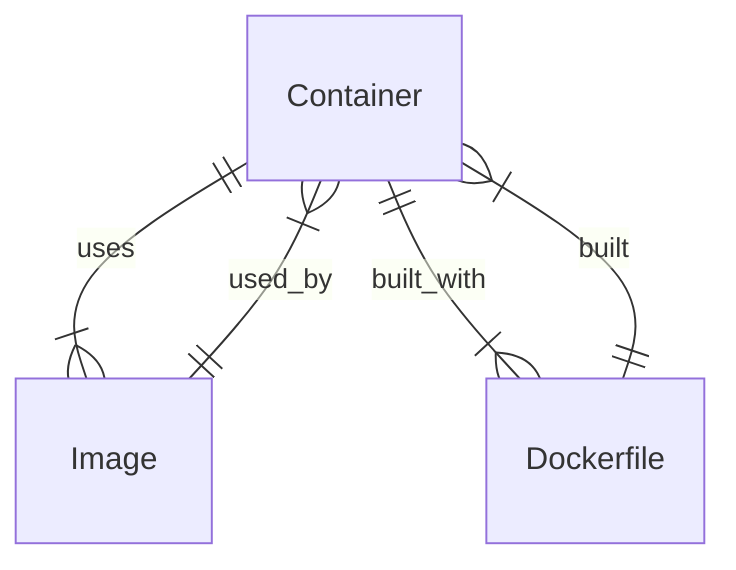

                 

## 容器化应用开发最佳实践

关键词：容器化、Docker、Kubernetes、CI/CD、最佳实践

摘要：本文深入探讨了容器化应用开发的最佳实践。从背景介绍、核心概念与联系、开发与部署最佳实践、项目实战到最佳实践与注意事项，全方位解析了如何高效地实现容器化应用开发。本文旨在为开发者提供一条清晰、可行的路径，助力他们在实际项目中顺利应用容器化技术。

## 一、背景介绍

### 1.1 问题背景

在数字化转型的浪潮下，容器化技术作为一种轻量级、可移植、可伸缩的应用部署方式，已经成为了现代软件开发和运维的热门选择。然而，如何在实际项目中高效地应用容器化技术，实现应用的持续交付和运维优化，仍然是开发人员面临的重要挑战。

### 1.2 问题描述

本书旨在解决以下问题：

1. 容器化技术的核心概念和实践方法是什么？
2. 如何在开发过程中有效地应用容器？
3. 如何管理和维护容器化应用？
4. 如何进行容器化应用的监控和性能优化？

### 1.3 问题解决

本书将提供以下解决方案：

1. 系统性地介绍容器化技术的核心概念和关键技术。
2. 通过案例和实践，展示容器化应用开发的最佳实践。
3. 提供完整的容器化应用开发和运维的解决方案。

### 1.4 边界与外延

本书主要关注以下容器化技术：

1. Docker
2. Kubernetes
3. 容器化应用的持续集成与持续交付（CI/CD）

### 1.5 概念结构与核心要素组成

核心概念：
- 容器
- 镜像
- Dockerfile
- Kubernetes

核心要素：
- 开发环境
- 部署环境
- 运维环境

## 二、核心概念与联系

### 2.1 容器化技术核心概念

#### 2.1.1 容器

容器是一种轻量级、可移植的运行时环境，它将应用程序及其依赖项封装在一个独立的容器中，使得应用程序可以在不同的操作系统和环境中一致运行。

#### 2.1.2 镜像

镜像是一种静态的、只读的容器模板，它包含了应用程序及其依赖项的完整文件系统。通过镜像，可以创建和启动容器。

#### 2.1.3 Dockerfile

Dockerfile 是一种用于构建镜像的脚本文件，它包含了构建镜像所需的指令和配置信息。

#### 2.1.4 Kubernetes

Kubernetes 是一个开源的容器编排平台，用于自动化容器的部署、扩展和管理。

### 2.2 概念属性特征对比表格

| 概念 | 特点 |
| :--: | :--: |
| 容器 | 轻量级、可移植、独立运行环境 |
| 镜像 | 静态、只读、容器模板 |
| Dockerfile | 构建镜像的脚本文件 |
| Kubernetes | 容器编排平台 |

### 2.3 ER实体关系图架构



## 三、容器化应用开发最佳实践

### 3.1 开发环境配置

在开始容器化应用开发之前，首先需要配置好开发环境。以下是开发环境配置的步骤：

1. **安装Docker**：在开发环境中安装Docker，可以参考[Docker官方文档](https://docs.docker.com/install/)。
2. **配置Docker加速器**：为了提高容器下载速度，可以配置Docker加速器。具体步骤可参考[阿里云容器镜像服务](https://cr.console.aliyun.com/)。
3. **安装Kubernetes集群**：如果需要进行Kubernetes相关的开发，可以安装一个Kubernetes集群。安装方式可以参考[Kubernetes官方文档](https://kubernetes.io/docs/home/)。

### 3.2 镜像构建与管理

镜像构建与管理是容器化应用开发的核心环节。以下是构建和管理镜像的步骤：

#### 3.2.1 编写Dockerfile

Dockerfile 是构建镜像的脚本文件，它包含了构建镜像所需的指令和配置信息。以下是Dockerfile的基本结构和常用构建命令：

```Dockerfile
# 使用官方Python镜像作为基础镜像
FROM python:3.8-slim

# 设置维护者信息
LABEL maintainer="yourname@example.com"

# 设置工作目录
WORKDIR /app

# 复制项目文件到容器中
COPY . .

# 安装依赖项
RUN pip install -r requirements.txt

# 暴露容器端口
EXPOSE 8000

# 运行应用
CMD ["python", "app.py"]
```

#### 3.2.2 镜像仓库与管理

为了方便管理和共享镜像，可以使用私有仓库和公共仓库。

- **私有仓库**：可以使用自建的私有仓库，如Harbor或Docker Registry。
- **公共仓库**：可以使用公共仓库，如Docker Hub。在Docker Hub上，可以方便地分享和下载镜像。

### 3.3 容器化应用的部署与运维

容器化应用的部署与运维是确保应用稳定运行的重要环节。以下是容器化应用部署与运维的步骤：

#### 3.3.1 Kubernetes基础

Kubernetes 是一个开源的容器编排平台，用于自动化容器的部署、扩展和管理。以下是Kubernetes的一些基础概念：

- **Pod**：Kubernetes中的基本部署单元，一个Pod可以包含一个或多个容器。
- **Service**：用于将流量路由到Pod的抽象层。
- **Ingress**：用于管理外部访问Kubernetes集群的入口。
- **ConfigMap**：用于存储和管理应用程序的配置数据。
- **Secret**：用于存储敏感信息，如密码和密钥。

#### 3.3.2 容器化应用的部署

在Kubernetes中，可以使用以下资源对象来部署容器化应用：

- **Deployment**：用于管理Pod的部署和更新。
- **StatefulSet**：用于部署有状态服务，如数据库。
- **Job**：用于执行一次性的任务。

#### 3.3.3 容器化应用的运维

运维容器化应用包括监控、日志管理和自动化运维等方面。以下是一些运维建议：

- **监控**：使用Prometheus和Grafana进行监控。
- **日志管理**：使用Fluentd或Logstash进行日志收集和存储。
- **自动化运维**：使用Kubernetes Operator进行自动化运维。

### 3.4 持续集成与持续交付（CI/CD）

持续集成与持续交付（CI/CD）是提高开发效率和软件质量的重要手段。以下是一些CI/CD工具和流程：

- **Jenkins**：一个开源的持续集成工具，可以与Docker和Kubernetes集成。
- **GitLab CI/CD**：GitLab内置的CI/CD工具，支持Kubernetes集群。
- **GitLab Runner**：用于执行CI/CD任务的代理程序。

### 3.5 性能优化与安全

为了提高容器化应用的性能和安全性，可以采取以下措施：

- **调整容器资源限制**：根据应用需求调整CPU和内存等资源限制。
- **使用容器网络优化**：使用合适的网络策略和负载均衡器。
- **容器安全最佳实践**：使用最小权限原则、定期更新镜像等。

## 四、项目实战

### 4.1 项目环境安装

以下是安装项目环境的具体步骤：

1. **安装Docker**：在[官网](https://docs.docker.com/install/)下载并安装Docker。
2. **配置Docker加速器**：配置Docker加速器，以提高容器下载速度。
3. **安装Kubernetes集群**：安装一个Kubernetes集群，可以使用Minikube、Docker Desktop等工具。

### 4.2 系统核心实现源代码

以下是系统核心实现的源代码：

#### 应用程序代码

```python
# app.py
from flask import Flask
app = Flask(__name__)

@app.route('/')
def hello():
    return 'Hello, World!'

if __name__ == '__main__':
    app.run(host='0.0.0.0', port=8000)
```

#### Dockerfile

```Dockerfile
# 使用官方Python镜像作为基础镜像
FROM python:3.8-slim

# 设置维护者信息
LABEL maintainer="yourname@example.com"

# 设置工作目录
WORKDIR /app

# 复制项目文件到容器中
COPY . .

# 安装依赖项
RUN pip install -r requirements.txt

# 暴露容器端口
EXPOSE 8000

# 运行应用
CMD ["python", "app.py"]
```

#### Kubernetes配置文件

```yaml
# deployment.yaml
apiVersion: apps/v1
kind: Deployment
metadata:
  name: web-app
spec:
  selector:
    matchLabels:
      app: web-app
  template:
    metadata:
      labels:
        app: web-app
    spec:
      containers:
      - name: web-app
        image: yourname/web-app:latest
        ports:
        - containerPort: 8000
```

### 4.3 代码应用解读与分析

以下是代码应用解读与分析：

#### 应用程序功能实现

应用程序使用Flask框架搭建，实现了一个简单的Web应用。根路由`/`返回“Hello, World!”字符串。

#### 容器化部署流程

1. 编写Dockerfile，构建镜像。
2. 将镜像推送到私有仓库或公共仓库。
3. 编写Kubernetes配置文件，部署容器化应用。

### 4.4 实际案例分析与详细讲解

以下是实际案例分析与详细讲解：

#### 部署一个简单的Web应用

1. 编写Dockerfile，构建镜像。
2. 将镜像推送到私有仓库。
3. 编写Kubernetes配置文件，部署Deployment。
4. 查看Pod状态，确保应用成功部署。

#### 进行性能测试和监控

1. 使用工具（如wrk）进行性能测试。
2. 使用Prometheus和Grafana进行监控。

### 4.5 项目小结

项目成功部署了一个简单的Web应用，并进行了性能测试和监控。通过本次项目实战，学习了容器化应用开发的基本流程和最佳实践。

## 五、最佳实践与注意事项

在容器化应用开发过程中，遵循以下最佳实践和注意事项，有助于提高开发效率和软件质量：

1. **使用最小权限原则**：容器和应用程序应使用最小权限原则，以减少安全风险。
2. **定期更新镜像**：定期更新容器镜像，以获取最新的安全补丁和功能更新。
3. **调整容器资源限制**：根据应用需求调整CPU和内存等资源限制，以提高性能和稳定性。
4. **使用容器网络优化**：使用合适的网络策略和负载均衡器，以提高网络性能和可伸缩性。
5. **监控与日志管理**：使用工具（如Prometheus、Grafana、Fluentd、Logstash）进行监控和日志管理，以便快速发现和解决问题。

## 六、小结

本文系统地介绍了容器化应用开发的最佳实践，包括背景介绍、核心概念与联系、开发与部署最佳实践、项目实战和最佳实践与注意事项。通过本文的学习，读者可以更好地理解和应用容器化技术，实现高效、可靠的容器化应用开发。

## 七、拓展阅读

- 《Docker实战》
- 《Kubernetes实战》
- 《持续集成与持续交付：架构、流程与实践》
- 阿里云容器服务文档：[https://help.aliyun.com/document_detail/25115.html](https://help.aliyun.com/document_detail/25115.html)
- 腾讯云容器服务文档：[https://cloud.tencent.com/文档/478.html](https://cloud.tencent.com/文档/478.html)

作者：AI天才研究院/AI Genius Institute & 禅与计算机程序设计艺术 /Zen And The Art of Computer Programming

