                 

# 容器化技术：提升部署效率与资源利用率

## 关键词

- 容器化技术
- 微服务架构
- 部署效率
- 资源利用率
- Kubernetes
- Docker
- 云原生架构

## 摘要

本文将深入探讨容器化技术的核心概念、原理及应用，分析其在提升部署效率和资源利用率方面的优势。通过详细的章节内容，我们将了解容器与虚拟机的区别、容器化技术的核心原理、容器化与微服务架构的整合，以及容器部署与管理的方法和实践。最后，我们将探讨容器化技术在企业中的应用、挑战与解决方案，并展望其未来发展趋势。通过本文的阅读，读者将全面了解容器化技术的本质，掌握其在现代软件开发和运维中的关键作用。

## 第一部分：容器化技术概述

### 第1章：容器化技术的基本概念

**1.1 容器与虚拟机的区别**

容器和虚拟机都是用于隔离和运行应用程序的技术，但它们在实现方式、资源隔离和性能上有显著差异。

- **容器的基本原理**：容器基于操作系统的Namespace和Cgroup机制，通过限制进程的访问范围来创建隔离的环境。容器内的应用运行在宿主机的内核之上，共享宿主机的内核资源和文件系统。

  ```mermaid
  graph TD
    A[进程] --> B[命名空间]
    B --> C[资源限制]
    C --> D[容器环境]
    D --> E[应用程序]
  ```

- **虚拟机的原理及不足**：虚拟机通过模拟硬件来运行操作系统和应用程序，每个虚拟机都有独立的操作系统和资源。虚拟机管理程序（VMM）负责资源分配和管理。虚拟机的缺点包括启动时间长、资源开销大、管理复杂等。

  ```mermaid
  graph TD
    A[物理主机] --> B[虚拟机管理程序]
    B --> C[虚拟机1]
    B --> D[虚拟机2]
    C --> E[操作系统1]
    D --> F[操作系统2]
  ```

- **容器与虚拟机的对比**：

  | 特性         | 容器               | 虚拟机                |
  | ------------ | ------------------ | --------------------- |
  | 资源开销     | 低                 | 高                    |
  | 启动时间     | 快                 | 慢                    |
  | 依赖         | 无需额外操作系统    | 独立操作系统          |
  | 隔离性       | 高                 | 高                    |
  | 可移植性     | 好                 | 一般                  |
  | 并发能力     | 强                 | 弱                    |

**1.2 容器化技术的发展历程**

容器化技术起源于2000年代初，最早由Linux容器（LXC）提出。随着Docker的兴起，容器化技术得到了广泛关注和应用。

- **容器技术的起源**：Linux容器起源于2000年代初，其核心思想是通过命名空间（Namespace）和隔离机制来创建隔离的运行环境。
- **容器技术的演变**：2006年，Linux内核引入了Namespace，使容器技术成为可能。随后，Cgroup的引入进一步增强了容器的资源隔离能力。
- **容器化技术的发展趋势**：随着云计算和微服务架构的兴起，容器化技术不断发展，成为现代软件开发和运维的重要工具。

**1.3 容器化技术的优势**

容器化技术为软件开发和运维带来了许多优势：

- **高效的资源利用**：容器可以共享宿主机的操作系统内核，降低资源消耗，提高资源利用率。
- **快速的部署和回滚**：容器具有轻量级、可移植性，可以快速部署和回滚，降低部署风险。
- **一致的开发与生产环境**：容器镜像确保开发、测试和生产环境一致，减少环境不一致带来的问题。

### 第2章：容器技术核心原理

**2.1 Linux容器基础**

- **命名空间**：命名空间用于隔离进程的资源视图。常见的命名空间包括PID（进程ID）、Network（网络）、IPC（进程间通信）和User（用户ID）。
- **Cgroup**：Cgroup用于限制和控制进程组使用的资源，包括CPU、内存、磁盘和网络等。
- **Linux容器的工作原理**：容器通过命名空间和Cgroup实现了进程和资源的隔离。容器内的应用运行在宿主机的内核之上，但对外呈现出独立的运行环境。

  ```mermaid
  graph TD
    A[宿主机操作系统] --> B[命名空间]
    B --> C[容器1]
    B --> D[容器2]
    C --> E[应用程序1]
    D --> F[应用程序2]
  ```

- **容器的生命周期管理**：容器的生命周期包括创建、启动、运行、暂停、恢复和删除等状态。容器管理工具（如Docker）负责容器的生命周期管理。

**2.2 容器镜像与容器运行时**

- **容器镜像**：容器镜像是一个静态的、只读的文件系统，包含了运行容器所需的所有依赖和配置。容器镜像通过分层存储和分发，提高了部署效率。
- **容器运行时**：容器运行时负责容器镜像的加载和运行。常见的容器运行时包括runc、containerd和Podman等。

**2.3 容器编排与管理工具**

- **容器编排**：容器编排是指通过自动化和集中化管理容器集群的过程。常见的容器编排工具包括Docker Compose、Kubernetes和OpenShift等。
- **容器管理工具**：容器管理工具负责容器的创建、启动、停止、监控和日志管理等操作。常见的容器管理工具包括Docker、Podman和CRI-O等。

### 第3章：容器化与微服务架构

**3.1 微服务架构**

- **微服务架构的概念与优势**：微服务架构是一种将应用程序拆分为一组小型、独立的服务，每个服务负责单一功能模块的架构风格。微服务架构的优势包括可扩展性、灵活性、可维护性和快速迭代等。
- **容器化与微服务架构的整合**：容器化技术为微服务架构提供了轻量级、可移植和自动化的运行环境。容器化技术使得微服务的部署、扩展和管理变得更加简单和高效。
- **容器化在微服务架构中的应用实践**：容器化技术在微服务架构中的应用包括服务拆分、服务部署、服务发现、服务监控和服务治理等方面。

通过上述章节，我们了解了容器化技术的基本概念、核心原理以及在微服务架构中的应用。接下来，我们将进一步探讨容器部署与管理的基础知识。

## 第二部分：容器部署与管理

### 第4章：容器部署基础

**4.1 容器化应用部署流程**

容器化应用的部署流程主要包括构建、打包、部署和监控等步骤。

- **构建**：构建过程是将源代码编译和打包成可执行的程序或库。常见的构建工具包括Maven、Gradle和Golang等。
- **打包**：打包是将应用程序及其依赖打包成一个容器镜像。容器镜像可以通过Dockerfile或容器构建工具（如Jib和BuildKit）创建。
- **部署**：部署是将容器镜像推送到容器运行时，并启动容器实例。部署可以通过手动操作或自动化脚本实现。
- **监控**：监控是指对容器和应用程序的运行状态、性能和日志进行监控。常见的监控工具包括Prometheus、Grafana和Kibana等。

**4.2 容器化应用的构建与打包**

- **容器镜像的构建**：容器镜像的构建是通过Dockerfile或构建工具将应用程序及其依赖打包成一个容器镜像。Dockerfile是一个文本文件，包含了构建镜像的步骤和指令。
  
  ```dockerfile
  # 使用基础镜像
  FROM python:3.8
  
  # 设置工作目录
  WORKDIR /app
  
  # 拷贝源代码
  COPY . .
  
  # 安装依赖
  RUN pip install -r requirements.txt
  
  # 暴露端口
  EXPOSE 8080
  
  # 运行应用程序
  CMD ["python", "app.py"]
  ```

- **容器镜像的打包**：容器镜像的打包是将应用程序和依赖打包成一个容器镜像文件。常见的打包工具包括Docker CLI、Jib和BuildKit等。

**4.3 容器化应用的部署策略**

- **单机部署**：单机部署是将容器镜像部署到单台宿主机上。单机部署适用于开发、测试和单机生产环境。
- **集群部署**：集群部署是将容器镜像部署到多台宿主机构成的集群中。集群部署适用于大规模生产环境。
- **自动化部署**：自动化部署是通过CI/CD工具将容器镜像自动构建、打包和部署到容器运行时。常见的CI/CD工具包括Jenkins、GitLab CI和GitHub Actions等。

### 第5章：容器编排工具

**5.1 Docker Compose**

Docker Compose是一个用于定义和运行多容器应用的工具。通过Docker Compose，可以轻松地将多个容器实例部署到一个或多个宿主机上。

- **Docker Compose的基本概念**：Docker Compose基于Dockerfile和docker-compose.yml文件。docker-compose.yml文件定义了应用的服务、容器、网络和卷等配置。
- **Docker Compose的使用方法**：使用Docker Compose可以轻松地启动、停止、重启和管理容器实例。例如：

  ```yaml
  version: '3'
  services:
    web:
      image: webapp:latest
      ports:
        - "8000:8000"
      volumes:
        - /app
  ```

**5.2 Kubernetes入门与核心概念**

Kubernetes是一个开源的容器编排和管理平台，用于大规模部署和管理容器化应用。

- **Kubernetes的基本概念**：Kubernetes由多个组件组成，包括Master节点、Worker节点、Pod、容器等。
- **Kubernetes的核心概念**：Kubernetes的核心概念包括Pod、Service、Deployment、StatefulSet、Ingress等。

  ```mermaid
  graph TD
    A[Master节点] --> B[API服务器]
    B --> C[etcd]
    A --> D[Controller Manager]
    A --> E[Scheduler]
    F[Worker节点] --> G[Node]
    G --> H[Pod]
    H --> I[容器]
    J[Service] --> K[Cluster IP]
    L[Deployment] --> M[Replica Set]
    N[StatefulSet] --> O[Pod]
    P[Ingress] --> Q[外部访问]
  ```

- **Kubernetes的配置与资源管理**：Kubernetes配置文件通常以YAML格式编写，定义了Pod、Service、Deployment等资源对象。

  ```yaml
  apiVersion: apps/v1
  kind: Deployment
  metadata:
    name: webapp
  spec:
    replicas: 3
    selector:
      matchLabels:
        app: webapp
    template:
      metadata:
        labels:
          app: webapp
      spec:
        containers:
        - name: webapp
          image: webapp:latest
          ports:
            - containerPort: 80
  ```

### 第6章：容器化应用的性能优化

**6.1 调整容器资源限制**

容器资源限制包括CPU、内存、磁盘和网络等。通过合理配置容器资源限制，可以提高容器性能和稳定性。

- **CPU限制**：设置CPU限制可以确保容器不会占用过多的CPU资源，避免其他容器受到影响。
- **内存限制**：设置内存限制可以确保容器不会因内存不足而崩溃。
- **磁盘限制**：设置磁盘限制可以限制容器对磁盘的读写操作，提高容器性能。

**6.2 容器网络优化**

容器网络优化包括网络性能调优和网络故障排除等。

- **网络性能调优**：通过调整容器网络配置，如调整iptables规则、优化DNS解析等，可以提高容器网络性能。
- **网络故障排除**：通过排查容器网络故障，如容器无法访问外部服务、容器内网络不通等，可以确保容器网络的稳定性。

**6.3 数据持久化与存储优化**

数据持久化与存储优化包括数据备份、存储性能调优和数据恢复等。

- **数据备份**：定期备份数据可以确保数据的安全性和可靠性。
- **存储性能调优**：通过调整存储设备配置、优化I/O调度策略等，可以提高存储性能。
- **数据恢复**：在数据丢失或损坏时，通过数据恢复工具可以恢复数据。

通过上述章节，我们了解了容器化应用部署的基础知识和性能优化方法。接下来，我们将通过具体项目实战，深入探讨容器化技术的实际应用。

### 第7章：容器化技术的项目实战

**7.1 构建一个简单的容器化应用**

为了更好地理解容器化技术的实际应用，我们将构建一个简单的Web应用程序，并将其容器化。

**项目需求**：构建一个简单的RESTful API，提供用户注册和登录功能。

**环境准备**：确保已经安装了Docker和Python环境。

**步骤1：编写应用程序代码**

在项目根目录下创建一个名为`app.py`的Python文件，实现用户注册和登录功能。

```python
from flask import Flask, request, jsonify

app = Flask(__name__)

users = {}

@app.route('/register', methods=['POST'])
def register():
    username = request.json.get('username')
    password = request.json.get('password')
    if username in users:
        return jsonify({'error': '用户已存在'}), 400
    users[username] = password
    return jsonify({'message': '注册成功'})

@app.route('/login', methods=['POST'])
def login():
    username = request.json.get('username')
    password = request.json.get('password')
    if username not in users or users[username] != password:
        return jsonify({'error': '用户名或密码错误'}), 401
    return jsonify({'message': '登录成功'})

if __name__ == '__main__':
    app.run(host='0.0.0.0', port=8080)
```

**步骤2：编写Dockerfile**

在项目根目录下创建一个名为`Dockerfile`的文件，用于构建容器镜像。

```dockerfile
# 使用Python官方基础镜像
FROM python:3.8

# 设置工作目录
WORKDIR /app

# 拷贝应用程序代码
COPY . .

# 安装依赖
RUN pip install -r requirements.txt

# 暴露端口
EXPOSE 8080

# 运行应用程序
CMD ["python", "app.py"]
```

**步骤3：构建容器镜像**

在命令行中执行以下命令，构建容器镜像。

```shell
docker build -t webapp:latest .
```

**步骤4：运行容器**

运行容器，将应用程序部署到Docker容器中。

```shell
docker run -d -p 8080:8080 --name webapp webapp:latest
```

**步骤5：测试应用程序**

通过浏览器或Postman等工具访问容器的8080端口，测试用户注册和登录功能。

**7.2 容器化应用在生产环境中的部署与监控**

在生产环境中，容器化应用通常需要部署到Kubernetes集群中进行管理和监控。

**步骤1：编写Kubernetes配置文件**

在项目根目录下创建一个名为`deployment.yaml`的Kubernetes配置文件。

```yaml
apiVersion: apps/v1
kind: Deployment
metadata:
  name: webapp
spec:
  replicas: 3
  selector:
    matchLabels:
      app: webapp
  template:
    metadata:
      labels:
        app: webapp
    spec:
      containers:
      - name: webapp
        image: webapp:latest
        ports:
        - containerPort: 80
```

**步骤2：部署到Kubernetes集群**

将配置文件上传到Kubernetes集群，并部署容器化应用。

```shell
kubectl apply -f deployment.yaml
```

**步骤3：监控应用程序**

使用Kubernetes集群的监控工具（如Prometheus和Grafana）对容器化应用进行监控。

```shell
kubectl top pod
kubectl logs <pod-name>
```

**7.3 容器化应用的安全性与最佳实践**

在容器化应用的安全性和最佳实践方面，需要注意以下几个方面：

- **使用可信镜像**：从官方镜像仓库或认证的镜像源下载镜像，确保镜像的可靠性和安全性。
- **最小权限原则**：容器运行时和应用程序只具有必要的权限，避免权限过大会引发安全风险。
- **容器命名规范**：使用统一的容器命名规范，方便管理和监控。
- **定期备份**：定期备份容器数据和配置文件，确保数据的安全性和可恢复性。

通过以上项目实战，我们了解了容器化技术的实际应用和部署方法。在下一章中，我们将探讨容器化技术在企业中的应用、挑战与解决方案。

### 第8章：容器化技术在企业中的应用

#### 容器化技术在企业中的应用案例

容器化技术已经在许多企业中得到广泛应用，以下是几个典型的应用案例：

1. **金融行业**：金融机构利用容器化技术实现了高可用性、弹性伸缩和快速部署。例如，银行可以将核心业务系统容器化，并通过Kubernetes进行自动化部署和管理，提高业务连续性和响应速度。

2. **电商行业**：电商平台通过容器化技术实现了高效的资源利用和快速扩展。容器化技术使得电商应用能够灵活地应对流量高峰，确保系统的稳定运行。

3. **互联网公司**：互联网公司利用容器化技术实现了快速迭代和持续集成。容器化技术使得开发团队可以独立开发和部署应用程序，降低环境不一致带来的风险。

4. **制造业**：制造业企业利用容器化技术实现了生产流程的数字化和智能化。通过容器化技术，企业可以快速部署和回滚生产系统，提高生产效率和质量。

#### 容器化技术的挑战与解决方案

尽管容器化技术在企业中具有许多优势，但在实际应用过程中仍然面临一些挑战：

1. **安全性**：容器化技术可能导致安全漏洞的增加，尤其是在容器镜像的构建和分发过程中。为了确保容器化应用的安全性，企业可以采取以下措施：
   - 使用可信的镜像源，确保镜像的可靠性和安全性。
   - 定期扫描容器镜像，检测潜在的漏洞和风险。
   - 实施最小权限原则，限制容器运行时的权限。

2. **兼容性**：容器化技术可能与其他现有系统存在兼容性问题。为了解决兼容性问题，企业可以采取以下措施：
   - 逐步引入容器化技术，避免一次性迁移带来的风险。
   - 使用兼容性测试和集成测试，确保容器化应用与现有系统无缝集成。
   - 与容器化技术供应商合作，确保系统的兼容性和稳定性。

3. **运维复杂度**：容器化技术的引入可能增加运维的复杂度。为了降低运维复杂度，企业可以采取以下措施：
   - 使用自动化工具和平台（如Kubernetes和Docker Swarm）进行容器编排和管理。
   - 建立专业的运维团队，提供技术支持和培训。
   - 定期进行运维审计，优化运维流程和工具。

4. **监控和管理**：容器化应用需要实时的监控和管理。为了确保容器化应用的稳定运行，企业可以采取以下措施：
   - 使用监控系统（如Prometheus和Grafana）对容器化应用进行实时监控。
   - 建立日志管理系统，收集和存储容器化应用的日志。
   - 实施故障报警和自动化恢复策略，确保系统的可用性。

#### 容器化技术的未来发展趋势

随着云计算和微服务架构的不断发展，容器化技术将继续在企业中发挥重要作用。以下是一些容器化技术的未来发展趋势：

1. **云原生架构**：云原生架构是一种基于容器、微服务和动态管理的新型架构风格。容器化技术将成为云原生架构的核心组成部分，推动企业数字化转型。

2. **服务网格**：服务网格是一种用于管理和路由服务流量的网络架构。服务网格将提供更高效、可扩展的服务间通信和监控，进一步提升容器化应用的可伸缩性和性能。

3. **自动化和AI**：容器化技术的自动化和智能化水平将不断提高。自动化工具和AI技术将用于容器化应用的部署、监控和管理，降低运维成本和提高系统效率。

4. **开源生态**：容器化技术的开源生态将继续繁荣发展。更多的开源项目和企业将加入容器化技术的开发和应用，推动技术的创新和进步。

通过以上内容，我们可以看到容器化技术在企业中的应用、挑战与解决方案，以及未来的发展趋势。在下一章中，我们将探讨容器化技术与云原生架构的整合。

### 第9章：容器化技术与云原生架构

#### 云原生架构概述

云原生架构（Cloud Native Architecture）是一种基于容器、微服务和动态管理的新型架构风格。云原生架构的核心思想是将应用程序分解为小型、独立的组件，并通过自动化和分布式系统进行部署和管理。云原生架构具有高可伸缩性、高可用性和高可靠性，能够快速响应业务变化，满足企业的数字化转型需求。

云原生架构的主要组成部分包括：

- **容器**：容器是云原生架构的核心组件，用于封装和运行应用程序。容器提供了轻量级、可移植性和隔离性，使得应用程序可以在任何环境中运行。

- **微服务**：微服务是一种将应用程序拆分为一组小型、独立的服务的方法。每个微服务负责一个特定的业务功能，可以独立开发、部署和扩展。微服务的优点包括可伸缩性、灵活性和可维护性。

- **动态管理**：动态管理是指通过自动化工具和平台对容器和微服务进行部署、监控和管理。动态管理包括服务发现、负载均衡、自动伸缩和故障恢复等。

- **DevOps**：DevOps是一种软件开发和运维的新模式，强调开发团队和运维团队的紧密合作和自动化。DevOps通过持续集成和持续交付，实现快速迭代和高效交付。

#### 容器化与云原生架构的整合

容器化技术是云原生架构的核心组成部分，为云原生架构的实现提供了基础。容器化技术与云原生架构的整合主要包括以下几个方面：

- **容器化应用开发**：容器化技术使得开发团队可以独立开发、测试和部署应用程序。开发团队可以使用Docker和Kubernetes等工具，快速构建和部署容器化应用。

- **微服务架构**：容器化技术支持微服务架构的实现。通过将应用程序拆分为微服务，开发团队可以独立开发和部署每个服务，提高系统的可维护性和可伸缩性。

- **动态管理**：容器化技术提供了动态管理的功能，包括服务发现、负载均衡、自动伸缩和故障恢复等。这些功能使得容器化应用可以自动适应业务变化，提高系统的可用性和可靠性。

- **云原生平台**：云原生平台（如Kubernetes和OpenShift）提供了完整的容器化应用管理功能。云原生平台可以自动化部署、监控和管理容器化应用，提高运维效率和系统稳定性。

#### 容器化在云原生环境中的应用

在云原生环境中，容器化技术为应用程序的部署、管理和监控提供了强大的支持。以下是一些容器化在云原生环境中的应用场景：

- **持续集成和持续交付（CI/CD）**：容器化技术使得持续集成和持续交付变得更加简单和高效。开发团队可以使用Docker和Jenkins等工具，实现自动化构建、测试和部署。

- **服务网格**：服务网格（如Istio和Linkerd）提供了一种新型的服务间通信和监控架构。服务网格可以自动化服务发现、负载均衡和故障恢复，提高系统的可伸缩性和可靠性。

- **云原生监控和日志管理**：云原生环境中的容器化应用需要实时的监控和日志管理。使用Prometheus、Grafana和ELK堆栈等工具，可以实现对容器化应用的监控和日志收集。

- **云原生安全性**：容器化技术带来了新的安全挑战，但同时也提供了许多安全解决方案。使用Docker Security Scanning、Kubernetes RBAC和Open Policy Agent等工具，可以实现对容器化应用的安全管理和控制。

通过整合容器化技术和云原生架构，企业可以实现高效的软件开发和运维，提高系统的可伸缩性、可靠性和安全性。在下一章中，我们将探讨容器化技术在开源社区中的作用和参与方式。

### 第10章：容器化技术与开源社区

#### 容器化技术的主要开源项目

容器化技术已经成为现代软件开发和运维的核心，其开源社区也蓬勃发展，产生了许多重要的开源项目。以下是一些主要的容器化技术开源项目：

- **Docker**：Docker是最早也是最著名的容器化技术开源项目。它提供了一个轻量级、可移植和自给自足的容器化平台，用于构建、运行和分发应用程序。Docker基于容器镜像和容器运行时，使得应用程序可以在任何环境中一致地运行。

- **Kubernetes**：Kubernetes是另一个非常重要的开源项目，它是一个用于自动化容器化应用的部署、扩展和管理的平台。Kubernetes提供了丰富的API和工具，使得容器化应用可以高效地运行在集群环境中。

- **Prometheus**：Prometheus是一个开源的监控解决方案，用于收集、存储和查询容器化应用和服务的监控数据。Prometheus提供了高效的查询引擎和灵活的数据可视化功能，是容器化环境中不可或缺的监控工具。

- **Grafana**：Grafana是一个开源的数据可视化平台，用于展示Prometheus等监控工具收集的数据。Grafana提供了丰富的图表和仪表板，帮助用户实时监控和洞察容器化应用的状态。

- **Istio**：Istio是一个开源的服务网格平台，用于管理和优化容器化应用之间的服务间通信。Istio提供了服务发现、负载均衡、故障恢复和安全等功能，是容器化环境中实现微服务架构的关键组件。

#### 参与容器化技术开源社区的方式

参与容器化技术开源社区是一个学习和贡献的过程，以下是一些参与方式：

- **阅读文档**：阅读开源项目的文档和文档是了解项目功能和使用方法的第一步。开源项目通常提供了详细的文档，包括安装指南、配置示例和常见问题解答。

- **提交Issue**：如果在使用开源项目时遇到问题，可以提交Issue到项目的GitHub仓库。提交Issue时，应详细描述问题现象和重现步骤，以便项目维护者能够快速定位问题。

- **编写文档**：开源项目通常欢迎社区成员贡献文档。如果你有相关的技术经验或对项目的理解，可以撰写文档或修改现有文档，帮助其他用户更好地使用项目。

- **提交Pull Request**：如果你发现了项目的bug或想要添加新功能，可以通过提交Pull Request（PR）向项目贡献代码。在提交PR之前，应先仔细阅读项目的贡献指南，确保代码风格和测试覆盖率达到项目的标准。

- **参加会议和活动**：许多开源项目会定期举办会议和活动，如线上会议、线下聚会和开发者大会。参加这些活动可以结识其他开发者，了解项目的最新动态，并提出自己的建议和需求。

#### 开源社区在容器化技术发展中的作用

开源社区在容器化技术发展中发挥着至关重要的作用，主要体现在以下几个方面：

- **技术推动**：开源社区通过不断贡献新的技术方案和改进，推动容器化技术的创新和发展。开源项目的快速迭代和丰富的功能，为容器化技术的应用提供了强大的支持。

- **社区协作**：开源社区促进了开发者之间的协作和知识共享。通过参与开源项目，开发者可以学习他人的经验，分享自己的见解，共同推动技术的进步。

- **生态构建**：开源社区为容器化技术构建了一个庞大的生态系统。大量的开源项目、工具和平台相互配合，形成了完整的容器化技术栈，为企业的数字化转型提供了强有力的支持。

通过参与容器化技术开源社区，开发者不仅可以提升自己的技术能力，还可以为社区的发展做出贡献。在下一章中，我们将总结容器化技术的常用工具与资源，以及学习路径和推荐资料。

## 附录

### 容器化技术常用工具与资源列表

- **Docker**：容器化平台，用于构建、运行和分发应用程序。官网：[https://docker.com](https://docker.com)
- **Kubernetes**：容器编排和管理平台，用于大规模部署和管理容器化应用。官网：[https://kubernetes.io](https://kubernetes.io)
- **Prometheus**：开源监控系统，用于收集、存储和查询容器化应用的监控数据。官网：[https://prometheus.io](https://prometheus.io)
- **Grafana**：开源数据可视化平台，用于展示Prometheus等监控工具收集的数据。官网：[https://grafana.com](https://grafana.com)
- **Istio**：开源服务网格平台，用于管理和优化容器化应用之间的服务间通信。官网：[https://istio.io](https://istio.io)
- **Kubernetes Dashboard**：Kubernetes的图形界面管理工具，用于可视化和管理集群资源。官网：[https://kubernetes-dashboard.dev](https://kubernetes-dashboard.dev)
- **Helm**：Kubernetes的包管理工具，用于简化容器化应用的部署和管理。官网：[https://helm.sh](https://helm.sh)
- **Docker Compose**：用于定义和运行多容器应用的工具。官网：[https://docs.docker.com/compose](https://docs.docker.com/compose)
- **Minikube**：用于在本地机器上运行Kubernetes集群的工具。官网：[https://minikube.sigs.k8s.io](https://minikube.sigs.k8s.io)

### 容器化技术学习路径与推荐资料

- **基础学习**：
  - 《Docker实战》
  - Kubernetes官方文档
  - 《Kubernetes权威指南》
- **进阶学习**：
  - 《云原生应用架构指南》
  - Prometheus官方文档
  - Grafana官方文档
  - 《服务网格技术实战》
- **实践项目**：
  - 搭建一个简单的Web应用程序，并将其容器化和部署到Kubernetes集群。
  - 学习并实现一个简单的微服务架构，使用Kubernetes进行管理和监控。
- **拓展阅读**：
  - 《云原生架构设计》
  - 《容器化与微服务架构实战》
  - 《容器化与DevOps实践》

通过上述常用工具与资源列表和学习路径，读者可以系统地学习和掌握容器化技术的核心知识和实际应用。最后，让我们总结一下本文的主要内容和观点。

## 总结

本文从多个角度深入探讨了容器化技术的核心概念、原理和应用。我们首先介绍了容器化技术的基本概念，包括容器与虚拟机的区别、容器化技术的发展历程和优势。接着，我们详细阐述了容器技术核心原理，包括Linux容器基础、容器镜像与容器运行时、容器编排与管理工具。然后，我们探讨了容器化与微服务架构的整合，以及容器部署与管理的方法和实践。

在项目实战部分，我们通过一个简单的Web应用程序展示了容器化技术的实际应用过程，并介绍了在生产环境中部署和监控容器化应用的方法。接着，我们分析了容器化技术在企业中的应用、挑战与解决方案，并展望了其未来发展趋势。此外，我们还探讨了容器化技术与云原生架构的整合，以及容器化技术在云原生环境中的应用。

最后，本文总结了一些容器化技术的常用工具与资源，以及学习路径和推荐资料。通过本文的阅读，读者可以全面了解容器化技术的本质，掌握其在现代软件开发和运维中的关键作用。

在容器化技术的不断发展中，掌握容器化技术将为开发者和运维人员提供强大的工具和平台，助力企业实现高效的软件开发和运维。让我们继续关注容器化技术的发展，共同探索其在未来技术领域中的应用与前景。

### 作者信息

- 作者：AI天才研究院/AI Genius Institute & 禅与计算机程序设计艺术 /Zen And The Art of Computer Programming

### 附录：Mermaid 流程图

以下是根据本文内容绘制的Mermaid流程图，用于展示容器化技术的主要概念和流程。

```mermaid
graph TD
    A[容器化技术概述] --> B[容器与虚拟机区别]
    B --> C[容器化技术优势]
    B --> D[容器化技术发展历程]
    E[容器技术核心原理] --> F[Linux容器基础]
    E --> G[容器镜像与容器运行时]
    E --> H[容器编排与管理工具]
    I[容器化与微服务架构] --> J[微服务架构的概念与优势]
    I --> K[容器化与微服务架构整合]
    I --> L[容器化在微服务架构应用实践]
    M[容器部署与管理] --> N[容器化应用部署流程]
    N --> O[容器化应用构建与打包]
    N --> P[容器化应用部署策略]
    M --> Q[容器编排工具]
    Q --> R[Docker Compose]
    Q --> S[Kubernetes入门与核心概念]
    Q --> T[Kubernetes配置与资源管理]
    U[容器化应用的性能优化] --> V[调整容器资源限制]
    U --> W[容器网络优化]
    U --> X[数据持久化与存储优化]
    Y[容器化技术与实践] --> Z[容器化技术的项目实战]
    Z --> AA[容器化应用在生产环境中的部署与监控]
    Z --> BB[容器化应用的安全性最佳实践]
    CC[容器化技术在企业中的应用] --> DD[容器化技术在企业中的应用案例]
    CC --> EE[容器化技术的挑战与解决方案]
    CC --> FF[容器化技术的未来发展趋势]
    GG[容器化技术与云原生架构] --> HH[云原生架构概述]
    GG --> II[容器化与云原生架构整合]
    GG --> JJ[容器化在云原生环境中的应用]
    KK[容器化技术与开源社区] --> LL[容器化技术的主要开源项目]
    KK --> MM[参与容器化技术开源社区的方式]
    KK --> NN[开源社区在容器化技术发展中的作用]
```



通过这些Mermaid流程图，读者可以更直观地了解容器化技术的核心概念和应用流程。希望这些图能帮助大家更好地理解和掌握容器化技术。

