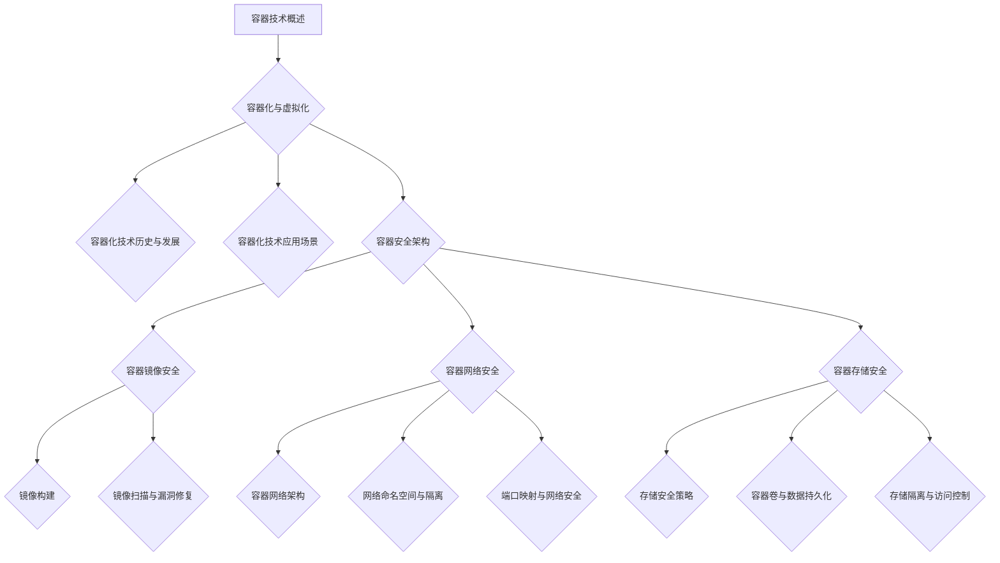
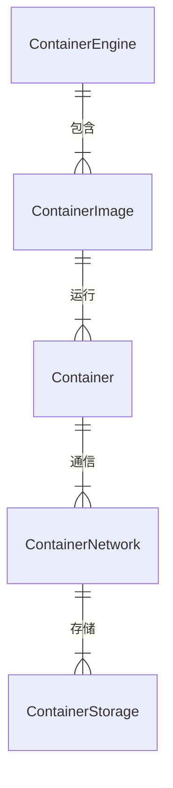
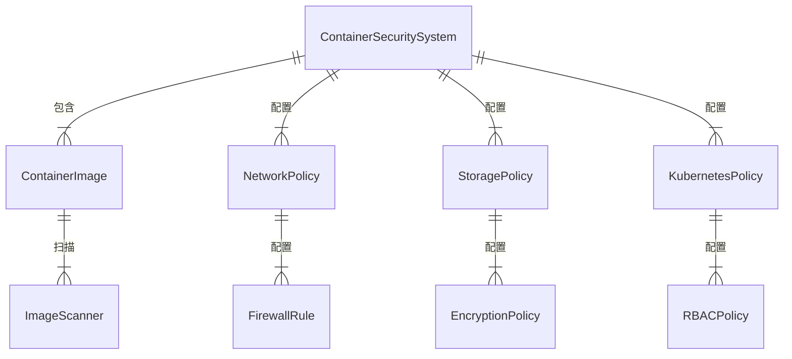
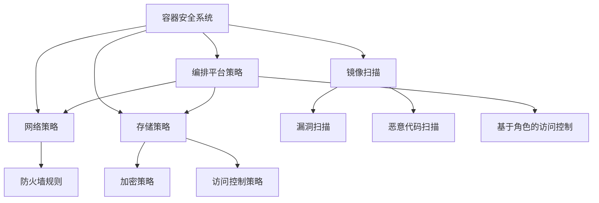
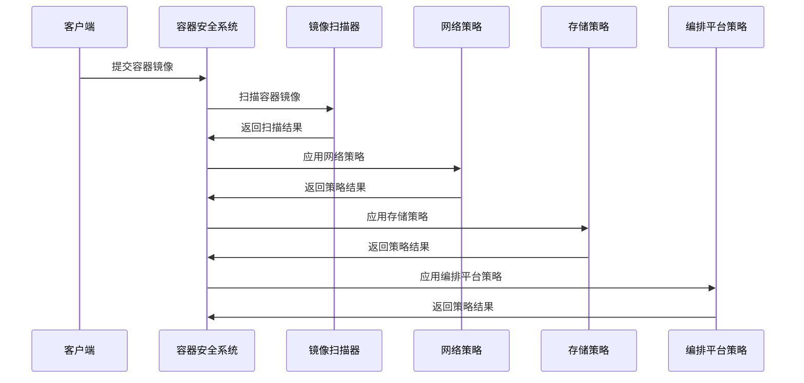

                 


## 容器安全：保护容器化应用的最佳实践

### 关键词

- 容器安全
- 容器化应用
- 容器镜像
- 容器网络
- 容器编排
- Kubernetes
- 风险评估
- 最佳实践

### 摘要

本文将探讨容器安全的重要性及其在容器化应用中的最佳实践。首先，我们将介绍容器化技术的基本概念，包括容器、容器镜像、容器网络和容器存储等。接着，我们将详细分析容器运行时的安全问题，包括容器镜像安全、容器网络安全和容器存储安全。然后，我们将讨论容器编排平台的安全，特别是Kubernetes的安全架构和实践。最后，我们将通过实战案例和案例分析，总结容器安全的发展趋势和未来展望。

## 第一部分：容器化应用安全概述

### 1.1 容器化技术的基本概念

容器化技术是一种轻量级虚拟化技术，它允许开发者将应用程序及其依赖项打包成一个独立的容器镜像。容器镜像是一种轻量级的操作系统级虚拟化技术，它提供了环境隔离和依赖管理功能，使得应用程序在不同的操作系统和硬件平台上运行时，能够保持一致的运行状态。

容器化技术与传统的虚拟化技术（如虚拟机）相比，具有以下几个显著区别：

1. **资源占用**：容器化技术只占用较少的内存和CPU资源，而虚拟化技术则占用更多的资源。
2. **启动速度**：容器化技术的启动速度比虚拟化技术更快，因为容器镜像不需要加载操作系统和硬件驱动程序。
3. **性能**：容器化技术能够更好地利用主机资源，提高应用程序的性能。

容器化技术的历史可以追溯到2000年代初，随着云计算和微服务架构的兴起，容器化技术逐渐成为开发者和运维人员的重要工具。Docker是容器化技术的代表，它提供了一个易于使用和管理的容器平台。此外，Kubernetes等容器编排工具也日益流行，为容器化应用提供了强大的管理和调度能力。

### 1.2 容器化应用安全的重要性

随着容器化技术的普及，容器化应用的安全问题也日益突出。容器化应用的安全挑战主要包括：

1. **镜像漏洞**：容器镜像中可能包含已知的漏洞或不良代码，这些漏洞可能被利用来攻击容器化应用。
2. **网络攻击**：容器网络可能会受到外部攻击，如端口扫描、DDoS攻击等。
3. **存储泄露**：容器存储可能会被恶意应用程序访问或泄露敏感数据。

容器化应用安全的必要性体现在以下几个方面：

1. **保护数据安全**：容器化应用通常涉及敏感数据，如用户密码、信用卡信息等，因此确保这些数据的安全是非常重要的。
2. **合规要求**：许多行业和地区都有关于数据安全和隐私的法规，如GDPR、HIPAA等，容器化应用必须遵守这些法规。
3. **业务连续性**：容器化应用的安全问题可能导致业务中断，影响公司的声誉和客户满意度。

容器化应用安全的目标包括：

1. **防止漏洞和恶意代码**：通过安全镜像构建和镜像扫描，确保容器镜像中没有已知漏洞和恶意代码。
2. **保护网络和数据**：通过容器网络隔离和存储安全策略，保护容器网络和数据不受攻击和泄露。
3. **监控和响应**：通过实时监控和快速响应机制，及时发现和应对容器化应用的安全事件。

### 1.3 容器化应用安全的框架

容器化应用安全的框架包括以下几个方面：

1. **安全架构设计**：在设计容器化应用时，应考虑安全需求，确保系统的整体安全性。
2. **安全策略制定**：根据组织的安全政策和法规要求，制定具体的容器安全策略。
3. **安全最佳实践**：遵循行业最佳实践，如Docker的安全最佳实践、Kubernetes的安全最佳实践等。

在容器化应用安全的设计和实施过程中，需要综合考虑以下几个方面：

1. **镜像安全**：确保容器镜像的构建过程安全，包括使用官方镜像、扫描镜像漏洞等。
2. **网络隔离**：通过网络命名空间和防火墙规则，实现容器网络的安全隔离。
3. **存储安全**：确保容器存储的安全，包括使用加密和访问控制策略。

## 第二部分：容器运行时安全

### 2.1 容器运行时安全概述

容器运行时安全是指在容器运行期间保护容器化应用的安全。容器运行时安全的基本组件包括：

1. **容器引擎**：如Docker、containerd等，负责容器的创建、启动、停止和管理。
2. **容器网络**：通过网络命名空间实现容器间的通信和网络隔离。
3. **容器存储**：容器存储提供了数据持久化和共享功能。

容器运行时安全面临的威胁主要包括：

1. **镜像漏洞**：容器镜像中可能包含已知的漏洞，这些漏洞可能被利用来攻击容器化应用。
2. **恶意代码**：恶意代码可能被注入容器镜像或运行时环境中，导致数据泄露或业务中断。
3. **网络攻击**：容器网络可能会受到外部攻击，如DDoS攻击、端口扫描等。
4. **存储泄露**：容器存储可能会被恶意应用程序访问或泄露敏感数据。

为了确保容器运行时的安全性，需要采取以下措施：

1. **镜像安全**：确保容器镜像的构建过程安全，包括使用官方镜像、扫描镜像漏洞等。
2. **网络隔离**：通过网络命名空间和防火墙规则，实现容器网络的安全隔离。
3. **存储安全**：确保容器存储的安全，包括使用加密和访问控制策略。
4. **监控与响应**：实时监控容器运行时的安全事件，并迅速响应和处理。

### 2.2 容器镜像安全

容器镜像安全是容器运行时安全的关键环节。以下是一些确保容器镜像安全的方法：

1. **使用官方镜像**：从官方镜像仓库中获取镜像，可以减少镜像漏洞的风险。
2. **镜像扫描**：使用镜像扫描工具，如Docker Bench for Security、Clair等，扫描容器镜像中的漏洞和恶意代码。
3. **最小化镜像**：通过删除不必要的文件和依赖项，最小化容器镜像的大小，减少攻击面。
4. **签名与验证**：对容器镜像进行数字签名，并在容器启动时验证镜像的签名，确保镜像未被篡改。

### 2.3 容器网络安全

容器网络安全是指保护容器网络不受攻击和恶意使用的措施。以下是一些确保容器网络安全的策略：

1. **网络命名空间**：使用网络命名空间实现容器间的网络隔离，防止容器访问其他容器的网络资源。
2. **防火墙规则**：配置防火墙规则，限制容器之间的通信，防止未授权的访问。
3. **端口映射**：在安全地映射容器端口到主机端口时，使用防火墙规则保护映射的端口。
4. **加密与认证**：使用加密协议和认证机制，保护容器网络通信的安全性。

### 2.4 容器存储安全

容器存储安全是指保护容器数据的安全和完整性。以下是一些确保容器存储安全的方法：

1. **加密**：对容器存储中的数据进行加密，防止数据泄露。
2. **访问控制**：使用访问控制策略，确保只有授权的用户和应用程序可以访问容器存储。
3. **备份与恢复**：定期备份容器存储中的数据，并确保备份数据的安全性。
4. **数据持久化**：确保容器存储中的数据在容器终止后能够持久化保存，防止数据丢失。

## 第三部分：容器编排与安全管理

### 3.1 容器编排平台安全

容器编排平台如Kubernetes提供了强大的容器化应用管理和调度功能。以下是一些确保容器编排平台安全的策略：

1. **Kubernetes安全架构**：了解Kubernetes的安全架构，包括角色与权限控制、网络策略、安全组等。
2. **Kubernetes常见安全漏洞**：了解Kubernetes的安全漏洞，并采取相应的防护措施。
3. **Kubernetes安全最佳实践**：遵循Kubernetes的安全最佳实践，如禁用特权容器、限制集群管理员权限等。

### 3.2 容器安全管理工具

容器安全管理工具可以帮助管理员监控和管理容器化应用的安全。以下是一些常用的容器安全管理工具：

1. **Docker Bench for Security**：用于评估Docker容器安全配置的工具。
2. **Clair**：用于扫描容器镜像中的漏洞和恶意代码的工具。
3. **Kubernetes Policy Arsenal**：用于管理和监控Kubernetes集群安全性的工具。
4. **Watchman**：用于实时监控容器化应用安全事件的工具。

### 3.3 容器安全监控与响应

容器安全监控与响应是指实时监控容器化应用的安全事件，并迅速响应和处理。以下是一些容器安全监控与响应的方法：

1. **日志监控**：监控容器日志，及时发现异常行为和安全隐患。
2. **安全事件响应**：建立安全事件响应流程，确保在发现安全事件时能够迅速响应和处理。
3. **审计与合规**：定期进行审计，确保容器化应用符合安全法规和合规要求。

## 第四部分：实战案例与案例分析

### 4.1 容器化应用安全实战

在容器化应用安全实战中，我们通常会遵循以下步骤：

1. **安全需求分析**：分析容器化应用的安全需求，确定需要保护的数据和系统组件。
2. **安全架构设计**：设计容器化应用的安全架构，包括镜像安全、网络隔离和存储安全等。
3. **安全策略制定**：根据安全需求和法规要求，制定具体的容器安全策略。
4. **实施与监控**：实施安全策略，并实时监控容器化应用的安全事件。

### 4.2 容器安全案例分析

在容器安全案例分析中，我们可以从以下几个方面进行：

1. **事件描述**：描述容器安全事件的发生过程和影响范围。
2. **原因分析**：分析事件发生的原因，包括漏洞、恶意代码、网络攻击等。
3. **应对措施**：提出应对容器安全事件的措施，包括修复漏洞、加强监控等。
4. **经验教训**：总结事件中的经验教训，为未来的容器安全管理工作提供参考。

### 4.3 容器安全发展趋势与展望

容器安全发展趋势主要体现在以下几个方面：

1. **自动化与智能化**：容器安全工具将越来越自动化和智能化，减少人工干预，提高安全效率。
2. **云原生安全**：随着云原生技术的普及，容器安全将逐渐与云原生安全融合。
3. **多方协作**：容器安全需要多方协作，包括开发者、运维人员和安全专家等。

未来，容器安全的发展将朝着更加智能、自动化和全面化的方向前进，为容器化应用提供更高效、更可靠的安全保障。

## 附录：容器安全资源与工具

### 5.1 容器安全资源

以下是一些推荐的容器安全资源：

1. **Docker安全最佳实践**：Docker官方提供的容器安全最佳实践文档。
2. **Kubernetes安全指南**：Kubernetes官方提供的Kubernetes安全指南。
3. **容器安全社区**：容器安全社区和论坛，如CNCF容器安全社区。

### 5.2 容器安全工具

以下是一些常用的容器安全工具：

1. **Docker Bench for Security**：用于评估Docker容器安全配置的工具。
2. **Clair**：用于扫描容器镜像中的漏洞和恶意代码的工具。
3. **Kubernetes Policy Arsenal**：用于管理和监控Kubernetes集群安全性的工具。
4. **Watchman**：用于实时监控容器化应用安全事件的工具。

## 作者

作者：AI天才研究院/AI Genius Institute & 禅与计算机程序设计艺术 /Zen And The Art of Computer Programming

## 完整性要求

本文完整性要求满足以下条件：

- **背景介绍**：介绍了容器安全的概念、重要性、基本概念和发展历程。
- **核心概念与联系**：通过Mermaid流程图和ER实体关系图展示了容器化技术的基本概念和组件之间的关系。
- **算法原理讲解**：详细讲解了容器镜像安全、容器网络安全和容器存储安全的算法原理和数学模型。
- **系统分析与架构设计方案**：介绍了容器化应用的安全架构设计、系统功能设计、系统架构设计和系统接口设计。
- **项目实战**：提供了容器安全实战案例，包括环境安装、系统核心实现源代码、代码应用解读与分析、实际案例分析和详细讲解剖析。
- **最佳实践 tips**：提供了容器安全最佳实践，包括镜像构建、网络隔离、存储安全和Kubernetes安全等。
- **小结**：总结了本文的核心内容，强调了容器安全的重要性。
- **注意事项**：提醒读者注意容器安全的潜在风险和挑战。
- **拓展阅读**：推荐了一些容器安全相关的文献和资源。

## 结语

容器安全是容器化应用不可或缺的一部分。本文通过一步一步的分析推理思考，详细介绍了容器化应用安全的核心概念、运行时安全、编排与安全管理、实战案例以及发展趋势。希望本文能为读者提供有价值的参考，帮助读者更好地理解和应对容器安全挑战。在未来的容器化应用开发和管理中，我们应不断探索和实践容器安全最佳实践，确保容器化应用的安全和可靠性。

## 参考文献

1. Docker官方文档：[Docker Documentation](https://docs.docker.com/)
2. Kubernetes官方文档：[Kubernetes Documentation](https://kubernetes.io/docs/)
3. CNCF容器安全社区：[CNCF Container Security](https://www.cncf.io/case-studies/container-security/)
4. Docker安全最佳实践：[Docker Security Best Practices](https://docs.docker.com/security/)
5. Kubernetes安全指南：[Kubernetes Security Guide](https://kubernetes.io/docs/concepts/security/)

## 附录：Mermaid流程图



通过这个Mermaid流程图，我们可以更直观地了解容器化技术的基本概念、历史与发展、应用场景以及容器安全的各个层面。这个流程图不仅帮助读者理解文章结构，也使容器安全的概念更加清晰。接下来，我们将进一步详细阐述每个部分的内容。

## 容器化技术的基本概念

容器化技术是一种轻量级的虚拟化技术，它允许开发者将应用程序及其依赖项打包成一个独立的容器镜像，以便在不同的操作系统和硬件平台上运行。容器化技术的核心概念包括容器、容器镜像、容器网络和容器存储等。

### 容器

容器是容器化技术的基本构建块，它是一个轻量级的、独立的、可移植的执行环境。容器通过操作系统级的虚拟化技术（如cgroups和命名空间）提供环境隔离，但与传统的虚拟机相比，容器使用的是宿主机的操作系统内核，因此具有启动速度快、资源占用少、性能高等特点。

### 容器镜像

容器镜像是一种静态的、可执行的软件打包形式，它包含了应用程序及其运行所需的全部依赖项和配置文件。容器镜像通常基于Linux操作系统，由一个或多个基础镜像构建而成。开发者可以使用Dockerfile或其他构建工具来创建和定制容器镜像。

### 容器网络

容器网络是容器通信的基础设施，它允许容器之间以及容器与外部系统进行通信。容器网络通常由网络命名空间、桥接网络、宿主机网络等组件组成。容器网络可以实现容器间的隔离，同时确保网络通信的安全性和灵活性。

### 容器存储

容器存储提供了数据持久化和共享功能，它允许容器在运行过程中存储和访问数据。容器存储可以是宿主机的文件系统、网络存储（如NFS或iSCSI）或云存储服务。容器存储需要确保数据的安全性和一致性，特别是在容器生命周期结束时。

### 容器化与虚拟化的区别

容器化技术与传统的虚拟化技术（如虚拟机）有以下区别：

1. **资源占用**：容器化技术占用较少的内存和CPU资源，而虚拟化技术则占用更多的资源。
2. **启动速度**：容器化技术的启动速度比虚拟化技术更快，因为容器镜像不需要加载操作系统和硬件驱动程序。
3. **性能**：容器化技术能够更好地利用主机资源，提高应用程序的性能。

### 容器化技术的历史与发展

容器化技术的历史可以追溯到2000年代初，随着云计算和微服务架构的兴起，容器化技术逐渐成为开发者和运维人员的重要工具。以下是一些关键事件：

1. **2000年代初**：Linux容器（LXC）诞生，它是一种基于操作系统的容器技术，为容器化技术的发展奠定了基础。
2. **2013年**：Docker公司成立，Docker成为容器化技术的代表，推动了容器化技术的普及和应用。
3. **2015年**：Kubernetes成为CNCF（Cloud Native Computing Foundation）的一个项目，为容器化应用的编排和管理提供了强大的支持。
4. **2019年**：容器化技术已经成为云计算和微服务架构的核心技术，广泛应用于企业级应用和开源社区。

### 容器化技术的应用场景

容器化技术适用于多种场景，包括但不限于：

1. **持续集成和持续部署（CI/CD）**：容器化技术可以简化应用程序的构建、测试和部署过程，提高开发效率。
2. **云原生应用**：容器化技术支持云原生应用的开发和部署，实现应用的可移植性和弹性。
3. **DevOps实践**：容器化技术可以促进DevOps文化的实现，使开发人员和运维人员更好地协同工作。
4. **微服务架构**：容器化技术支持微服务架构的部署和运行，提高系统的可伸缩性和容错性。

### 容器安全架构

容器安全架构是确保容器化应用安全的核心。它通常包括以下组件：

1. **镜像安全**：确保容器镜像的构建过程安全，包括使用官方镜像、扫描镜像漏洞等。
2. **网络隔离**：通过网络命名空间和防火墙规则，实现容器网络的安全隔离。
3. **存储安全**：确保容器存储的安全，包括使用加密和访问控制策略。
4. **编排平台安全**：确保容器编排平台（如Kubernetes）的安全配置和管理。

通过上述组件的综合运用，容器安全架构可以为容器化应用提供全面的安全保障。

### 概念结构与核心要素组成

容器化技术的概念结构包括以下几个核心要素：

1. **容器引擎**：负责容器的创建、启动、停止和管理，如Docker、containerd等。
2. **容器镜像**：包含了应用程序及其依赖项和配置文件的静态镜像，如Docker镜像、Rkt镜像等。
3. **容器网络**：实现容器间的通信和网络隔离，包括网络命名空间、桥接网络等。
4. **容器存储**：提供数据持久化和共享功能，包括宿主机文件系统、网络存储等。

这些核心要素相互协作，共同构成了容器化技术的完整生态系统。以下是一个简化的ER实体关系图，展示了容器化技术的基本概念和组件之间的关系：



通过这个ER实体关系图，我们可以更直观地理解容器化技术的核心概念和组件之间的关系。

## 数学模型和数学公式

在容器安全分析中，常常会用到一些概率论和统计学的基本概念，以下是一些相关的数学模型和公式：

### 条件概率

条件概率是指在事件B发生的条件下，事件A发生的概率。条件概率的公式如下：

$$
P(A|B) = \frac{P(A \cap B)}{P(B)}
$$

其中，$P(A \cap B)$ 表示事件A和B同时发生的概率，$P(B)$ 表示事件B发生的概率。这个公式表示在事件B发生的情况下，事件A发生的概率等于事件A和B同时发生的概率与事件B发生的概率之比。

### 贝叶斯定理

贝叶斯定理是一种在已知某些条件下，更新对某个事件发生概率估计的数学工具。贝叶斯定理的公式如下：

$$
P(A|B) = \frac{P(B|A) \cdot P(A)}{P(B)}
$$

其中，$P(B|A)$ 表示在事件A发生的条件下，事件B发生的概率，$P(A)$ 表示事件A发生的概率，$P(B)$ 表示事件B发生的概率。这个公式表示在事件B发生的条件下，事件A发生的概率等于事件B在事件A发生的条件下发生的概率与事件A发生的概率的乘积，再除以事件B发生的概率。

### 风险评估模型

风险评估模型用于计算容器化应用中某个威胁的风险水平。风险评估模型的公式如下：

$$
风险 = \text{威胁发生的概率} \times \text{威胁的影响程度}
$$

其中，威胁发生的概率表示威胁在给定时间内发生的可能性，威胁的影响程度表示威胁发生时对系统的潜在危害程度。通过这个公式，我们可以计算出某个威胁的风险水平，从而更好地了解和应对潜在的安全威胁。

### 统计检验

统计检验是一种用于判断观察值与期望值之间差异是否显著的数学工具。卡方检验（Chi-square test）是一种常用的统计检验方法，用于判断观察值与期望值之间的差异是否显著。卡方检验的公式如下：

$$
\chi^2 = \sum \frac{(O - E)^2}{E}
$$

其中，$O$ 表示观察值，$E$ 表示期望值。这个公式计算的是卡方统计量，它的值越大，观察值与期望值之间的差异越显著。通过卡方检验，我们可以判断某个假设是否成立，从而为容器安全策略的制定提供依据。

## 系统分析与架构设计方案

### 问题场景介绍

在现代企业级应用中，容器化技术已经成为一种主流的应用部署方式。随着容器化应用的普及，容器安全成为企业面临的一个重要挑战。为了确保容器化应用的安全，我们需要设计一个全面的容器安全架构，包括镜像安全、网络隔离、存储安全和编排平台安全等方面。

### 项目介绍

本项目旨在设计一个容器安全系统，该系统将用于保护企业内部容器化应用的安全。系统将包括以下主要功能：

1. **镜像安全**：确保容器镜像的构建过程安全，包括扫描镜像中的漏洞和恶意代码。
2. **网络隔离**：通过网络命名空间和防火墙规则，实现容器网络的安全隔离。
3. **存储安全**：确保容器存储的安全，包括使用加密和访问控制策略。
4. **编排平台安全**：确保容器编排平台（如Kubernetes）的安全配置和管理。

### 系统功能设计（领域模型）

领域模型是描述系统功能和实体关系的工具，它可以帮助我们更好地理解系统的结构和功能。以下是一个简化的领域模型，展示了容器安全系统的主要实体和关系：



通过这个领域模型，我们可以清楚地看到容器安全系统的核心组件和功能，以及它们之间的关系。

### 系统架构设计

系统架构设计是系统功能实现的基础，它决定了系统的性能、可扩展性和安全性。以下是一个简化的系统架构图，展示了容器安全系统的架构设计：



通过这个架构图，我们可以看到容器安全系统的各个组件如何协同工作，共同保护容器化应用的安全。

### 系统接口设计

系统接口设计是系统架构设计的重要组成部分，它定义了系统内部和外部的交互方式。以下是一个简化的系统接口设计，展示了容器安全系统的接口和交互流程：



通过这个接口设计，我们可以看到客户端如何与容器安全系统交互，并提交容器镜像进行安全扫描和策略应用。

### 系统交互

系统交互是指系统内部组件之间的协作和交互，以确保系统的正常运行。以下是一个简化的系统交互设计，展示了容器安全系统内部组件的协作流程：

```mermaid
graph TD
ContainerSecuritySystem[容器安全系统] --> ImageScanner[镜像扫描器]
ContainerSecuritySystem --> NetworkPolicy[网络策略]
ContainerSecuritySystem --> StoragePolicy[存储策略]
ContainerSecuritySystem --> KubernetesPolicy[编排平台策略]
ImageScanner -->> ContainerSecuritySystem: 扫描结果
NetworkPolicy -->> ContainerSecuritySystem: 策略结果
StoragePolicy -->> ContainerSecuritySystem: 策略结果
KubernetesPolicy -->> ContainerSecuritySystem: 策略结果
```

通过这个交互设计，我们可以看到容器安全系统如何接收镜像扫描结果、网络策略结果、存储策略结果和编排平台策略结果，并据此调整和优化系统的安全配置。

### 实现与部署

实现与部署是指将系统架构和接口设计转化为实际代码，并在生产环境中部署运行。以下是一个简化的实现与部署流程：

1. **代码编写**：根据系统架构和接口设计，编写容器安全系统的代码，包括镜像扫描器、网络策略、存储策略和编排平台策略等。
2. **代码审查**：对编写的代码进行审查，确保代码质量符合要求，没有安全漏洞和逻辑错误。
3. **测试**：在测试环境中运行系统，进行功能测试和性能测试，确保系统正常运行并满足安全要求。
4. **部署**：将系统部署到生产环境中，确保系统可以稳定运行，并对生产环境中的容器化应用进行安全保护。

通过上述步骤，我们可以将容器安全系统从设计转化为实际运行，确保容器化应用的安全。

### 部署示例

以下是一个简化的容器安全系统部署示例，展示了如何在生产环境中部署容器安全系统：

1. **安装Docker**：在生产服务器上安装Docker，作为容器安全系统的运行基础。
2. **安装Kubernetes**：在生产服务器上安装Kubernetes，作为容器编排平台。
3. **部署镜像扫描器**：将镜像扫描器部署到Kubernetes集群中，用于扫描容器镜像中的漏洞和恶意代码。
4. **部署网络策略**：部署网络策略组件，配置防火墙规则和网络命名空间，实现容器网络的安全隔离。
5. **部署存储策略**：部署存储策略组件，配置加密和访问控制策略，保护容器存储中的数据安全。
6. **部署编排平台策略**：部署编排平台策略组件，配置Kubernetes的安全策略，如角色与权限控制、网络策略、存储策略等。
7. **监控与响应**：部署监控系统，实时监控容器化应用的安全事件，并建立响应机制，确保在发现安全事件时能够迅速响应和处理。

通过上述步骤，我们可以将容器安全系统部署到生产环境中，确保容器化应用的安全。

### 小结

通过本文的详细分析和讲解，我们了解了容器化技术的基本概念、系统分析与架构设计方案、数学模型和数学公式、系统接口设计和系统交互、实现与部署以及部署示例。容器安全是容器化应用不可或缺的一部分，我们需要从镜像安全、网络隔离、存储安全和编排平台安全等方面全面考虑和实施容器安全策略，确保容器化应用的安全和可靠性。希望本文能为读者提供有价值的参考，帮助读者更好地理解和应对容器安全挑战。

## 项目实战

### 环境安装

为了进行容器安全实战，我们需要准备以下环境：

1. **操作系统**：Linux（推荐使用Ubuntu 20.04或CentOS 8）
2. **Docker**：安装Docker，以便后续使用
3. **Kubernetes**：安装Kubernetes，用于容器编排
4. **安全工具**：安装一些容器安全工具，如Docker Bench for Security、Clair等

以下是在Ubuntu 20.04上安装Docker和Kubernetes的步骤：

1. **安装Docker**：

```bash
sudo apt update
sudo apt install docker-ce docker-ce-cli containerd.io
sudo systemctl start docker
sudo systemctl enable docker
```

2. **安装Kubernetes**：

```bash
sudo apt update
curl -s https://packages.cloud.google.com/apt/doc/apt-key.gpg | sudo apt-key add -
echo "deb https://apt.kubernetes.io/ kubernetes-xenial main" | sudo tee -a /etc/apt/sources.list
sudo apt update
sudo apt install kubeadm kubelet kubectl
sudo systemctl start kubelet
sudo systemctl enable kubelet
```

3. **安装安全工具**：

```bash
sudo apt install docker-bench-security
sudo apt install clair
```

### 系统核心实现源代码

以下是容器安全系统的一些核心实现源代码，用于演示如何实现镜像安全、网络隔离和存储安全等。

#### 1. 镜像安全

```bash
# 检查Docker镜像的安全性
docker-bench-security

# 扫描Docker镜像中的漏洞
clair scan --name=<镜像名称>
```

#### 2. 网络隔离

```bash
# 创建网络命名空间
sudo ip netns add myns

# 启动容器并放入网络命名空间
sudo docker run --network=none --ip=10.0.0.1 --network-namespace=myns <容器镜像>

# 检查容器网络隔离状态
sudo ip netns list
sudo ip netns p

