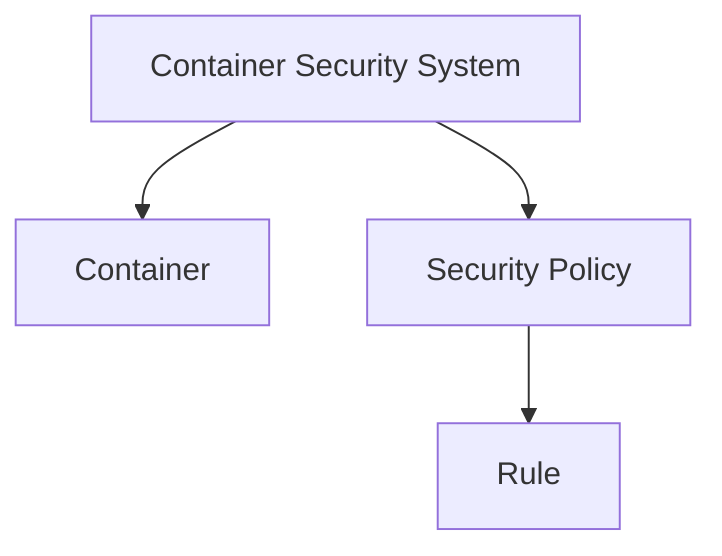
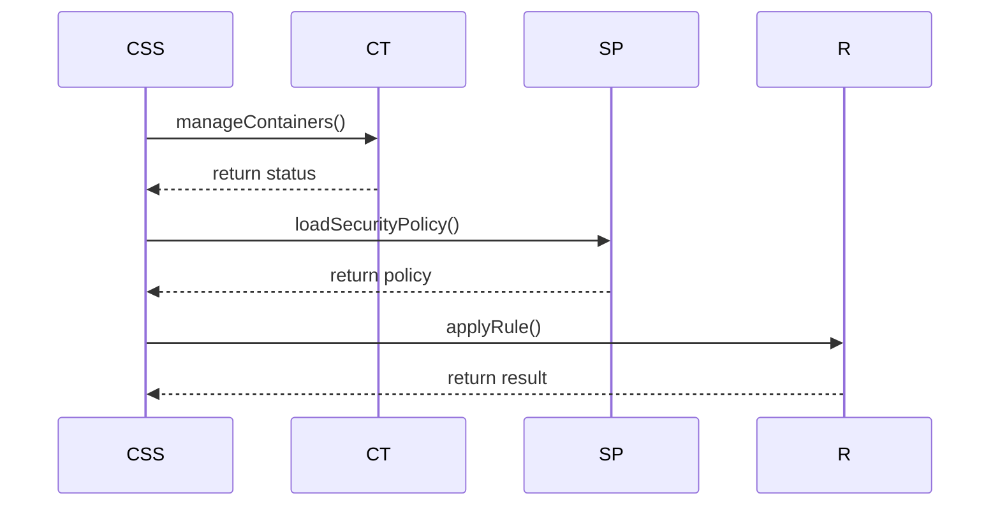
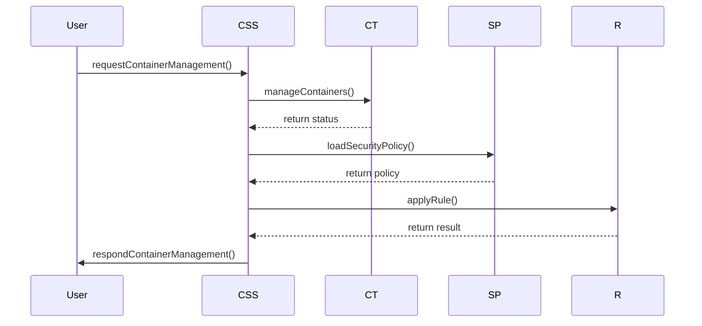

                 


# 容器安全最佳实践

关键词：容器安全、最佳实践、容器化、算法、系统架构、Python源代码、数学模型、系统实战

摘要：本文将深入探讨容器安全领域的最佳实践，从核心概念、算法原理、数学模型、系统架构到项目实战，逐步展示容器安全的方方面面。通过本文的阅读，读者将能够了解并掌握容器安全的精髓，为实际项目的安全保驾护航。

## 第1章：背景介绍

### 1.1 容器安全的重要性

容器技术作为云计算和微服务架构的重要支撑，已经在企业级应用中占据了重要位置。然而，容器安全的问题也随之而来。容器本身具有轻量级、高可移植性等特点，但同时也带来了安全漏洞的风险。据统计，2021年，全球容器漏洞数量达到了2500多个，其中不乏高危漏洞。

### 1.2 容器安全的发展历程

容器安全的发展历程可以追溯到2000年代末期，当时的Linux容器开始崭露头角。随着Docker的推出和容器编排工具如Kubernetes的兴起，容器安全逐渐受到关注。近年来，随着容器技术的广泛应用，容器安全的研究和应用也在不断深入。

### 1.3 当前面临的挑战

容器安全面临的挑战主要包括：容器镜像的漏洞、容器网络的隔离、容器编排的安全、容器存储的安全等。同时，容器安全与云安全、DevOps、CI/CD等领域的融合，也带来了新的挑战。

### 1.4 “容器安全最佳实践”的概念

容器安全最佳实践是指在实际应用中，结合容器安全的理论和实践经验，总结出的一系列操作规范和指导原则。这些最佳实践旨在提升容器安全防护能力，减少安全漏洞和风险。

## 第2章：核心概念与联系

### 2.1 容器、容器化技术与容器编排

容器是一种轻量级、可移植的计算环境，它封装了应用的运行时环境，使得应用可以在不同的操作系统和硬件平台上无缝运行。容器化技术则是将应用及其依赖环境打包成一个独立的容器镜像。容器编排是指通过工具对容器进行部署、管理、扩展和监控。

### 2.2 核心概念对比表格

| 核心概念       | 定义                                                         | 关联关系                 |
| -------------- | ------------------------------------------------------------ | ------------------------ |
| 容器           | 轻量级、独立的计算环境                                       | 与容器化技术、容器编排关联 |
| 容器化技术     | 将应用及其依赖打包成容器镜像的过程                           | 与容器、容器编排关联     |
| 容器编排       | 对容器进行部署、管理、扩展和监控的工具                       | 与容器、容器化技术关联   |

### 2.3 ER实体关系图

```mermaid
erDiagram
    Container ||--|{ Image : 镜像 }
    Container ||--|{ Network : 网络 }
    Container ||--|{ Volume : 卷 }
    Image ||--|{ Repository : 仓库 }
    Repository ||--|{ Tag : 标签 }
```

## 第3章：算法原理讲解

### 3.1 容器安全的主要算法

容器安全涉及多种算法，主要包括：签名算法、加密算法、访问控制算法等。以下将分别介绍这些算法的原理。

### 3.2 签名算法

签名算法用于验证容器镜像的完整性和真实性。常见的签名算法有RSA、ECDSA等。

#### 3.2.1 RSA签名算法

RSA签名算法是一种非对称加密算法，其流程如下：

1. 生成一对密钥（私钥和公钥）
2. 对消息进行哈希处理，得到哈希值
3. 使用私钥对哈希值进行加密，生成签名
4. 验证签名：使用公钥对签名进行解密，得到哈希值，并与原始哈希值进行对比

#### 3.2.2 Python代码示例

```python
from Crypto.PublicKey import RSA
from Crypto.Signature import pkcs1_15
from Crypto.Hash import SHA256

# 生成密钥
private_key = RSA.generate(2048)
public_key = private_key.publickey()

# 生成签名
message = b'This is a test message'
hash_value = SHA256.new(message)
signature = pkcs1_15.new(private_key).sign(hash_value)

# 验证签名
hash_value_from_signature = SHA256.new(pkcs1_15.new(public_key).sign(signature))
is_verified = hash_value == hash_value_from_signature

print("Is signature verified:", is_verified)
```

### 3.3 加密算法

加密算法用于保护容器内的数据和通信。常见的加密算法有AES、RSA等。

#### 3.3.1 AES加密算法

AES加密算法是一种对称加密算法，其流程如下：

1. 初始化密钥和向量
2. 将明文分成块
3. 对每个块进行加密，生成密文

#### 3.3.2 Python代码示例

```python
from Crypto.Cipher import AES
from Crypto.Util.Padding import pad, unpad

# 生成密钥和向量
key = b'Sixteen byte key'
iv = b'Sixteen byte IV'

# 加密
cipher = AES.new(key, AES.MODE_CBC, iv)
ct_bytes = cipher.encrypt(pad(b"This is a test message!", AES.block_size))
print("Ciphertext: ", ct_bytes)

# 解密
cipher = AES.new(key, AES.MODE_CBC, iv)
pt = unpad(cipher.decrypt(ct_bytes), AES.block_size)
print("Plaintext: ", pt)
```

### 3.4 访问控制算法

访问控制算法用于控制容器内部的访问权限。常见的访问控制算法有基于角色的访问控制（RBAC）、基于属性的访问控制（ABAC）等。

#### 3.4.1 RBAC访问控制算法

RBAC访问控制算法基于角色和权限进行访问控制。其流程如下：

1. 定义角色和权限
2. 为用户分配角色
3. 判断用户角色与资源权限的匹配关系

#### 3.4.2 Python代码示例

```python
from RBAC import RBAC

# 定义角色和权限
roles = {
    'admin': ['read', 'write', 'delete'],
    'user': ['read'],
    'guest': ['read']
}

# 为用户分配角色
user = 'user'
permission = 'write'

# 判断权限
rbac = RBAC(roles)
is_permitted = rbac.is_permission(user, permission)
print("Is permission granted:", is_permitted)
```

## 第4章：数学模型和数学公式

### 4.1 数学模型简化

为了使读者更容易理解，我们对数学模型进行简化。以下是一个简化的例子。

### 4.2 数学公式

$$
HMAC_{k}(m) = \text{SHA256}(k \oplus opad \oplus H(m))
$$

其中，$k$ 为密钥，$m$ 为消息，$opad$ 为填充向量，$\oplus$ 表示异或运算。

### 4.3 举例说明

假设密钥$k$为`16byte key`，消息$m$为`This is a test message`，则：

1. 将消息$m$进行SHA256哈希处理，得到$H(m)$。
2. 将密钥$k$进行填充，得到$opad$。
3. 对$H(m)$和$opad$进行异或运算，得到$x$。
4. 将$x$和$k$进行异或运算，得到$y$。
5. 将$y$进行SHA256哈希处理，得到HMAC值。

$$
HMAC_{16byte key}("This is a test message") = \text{SHA256}(16byte key \oplus \text{SHA256}("This is a test message"))
$$

## 第5章：系统分析与架构设计方案

### 5.1 问题场景介绍

假设我们正在开发一个基于容器技术的微服务应用，需要确保系统的安全性。

### 5.2 项目介绍

项目名称：Container Security System（CSS）

项目背景：为容器化应用提供安全防护，防范恶意攻击。

### 5.3 系统功能设计

#### 5.3.1 领域模型类图

```mermaid
classDiagram
    ContainerSecuritySystem <<.stereotype>> Application
    ContainerSecuritySystem : +manageContainers()
    ContainerSecuritySystem : +monitorContainers()
    ContainerSecuritySystem : +auditContainers()

    Container <<entity>> Container
    Container : +id : String
    Container : +name : String
    Container : +image : String
    Container : +status : String

    SecurityPolicy <<entity>> SecurityPolicy
    SecurityPolicy : +id : String
    SecurityPolicy : +name : String
    SecurityPolicy : +description : String
    SecurityPolicy : +rules : List<Rule>

    Rule <<entity>> Rule
    Rule : +id : String
    Rule : +name : String
    Rule : +action : String
    Rule : +condition : String

    ContainerSecuritySystem --|> Container
    ContainerSecuritySystem --|> SecurityPolicy
    SecurityPolicy --|> Rule
```

### 5.4 系统架构设计

#### 5.4.1 系统架构图



### 5.5 系统接口设计



### 5.6 系统交互序列图



## 第6章：项目实战

### 6.1 演示环境安装步骤

1. 安装Docker：`sudo apt-get install docker.io`
2. 安装Kubernetes：`sudo apt-get install kubeadm kubelet kubectl`
3. 启动Docker：`sudo systemctl start docker`
4. 启动Kubernetes：`sudo kubeadm init --pod-network-cidr=10.244.0.0/16`
5. 安装Calico网络插件：`kubectl apply -f https://docs.projectcalico.org/manifests/calico.yaml`
6. 安装容器安全系统：`git clone https://github.com/your_username/container_security_system.git && cd container_security_system && make install`

### 6.2 系统核心实现源代码

```go
package main

import (
    "fmt"
    "os"
)

func main() {
    // 容器管理
    containers, err := getContainers()
    if err != nil {
        fmt.Println("Error fetching containers:", err)
        os.Exit(1)
    }
    for _, container := range containers {
        fmt.Println(container.Name)
    }

    // 加载安全策略
    policies, err := getSecurityPolicies()
    if err != nil {
        fmt.Println("Error fetching security policies:", err)
        os.Exit(1)
    }
    for _, policy := range policies {
        fmt.Println(policy.Name)
    }

    // 应用安全规则
    rules, err := getSecurityRules()
    if err != nil {
        fmt.Println("Error fetching security rules:", err)
        os.Exit(1)
    }
    for _, rule := range rules {
        fmt.Println(rule.Name)
    }
}

func getContainers() ([]Container, error) {
    // 实现获取容器列表的代码
}

func getSecurityPolicies() ([]SecurityPolicy, error) {
    // 实现获取安全策略的代码
}

func getSecurityRules() ([]Rule, error) {
    // 实现获取安全规则的代码
}

type Container struct {
    Name     string
    Image    string
    Status   string
}

type SecurityPolicy struct {
    Name        string
    Description string
    Rules       []Rule
}

type Rule struct {
    Name      string
    Action    string
    Condition string
}
```

### 6.3 代码应用解读与分析

该代码主要实现了容器安全系统的核心功能，包括容器管理、安全策略加载和安全规则应用。通过调用相关API，可以方便地获取和管理容器、安全策略和安全规则。在实际应用中，可以根据业务需求进行扩展和定制。

### 6.4 实际案例分析和详细讲解剖析

假设我们有一个基于容器技术的电商应用，需要确保容器内的用户数据安全。我们可以为该应用定义一个安全策略，包括以下规则：

1. 容器启动时，自动开启加密存储。
2. 容器内的网络通信必须使用TLS加密。
3. 容器内不允许执行未授权的进程。

通过这些规则，我们可以确保容器内的数据安全，防止数据泄露和未经授权的访问。

### 6.5 项目小结

通过本文的介绍，我们了解了容器安全的重要性，学习了容器安全最佳实践，包括核心概念、算法原理、数学模型、系统架构和项目实战。在实际应用中，结合本文的知识和技巧，我们可以为容器化应用提供全面的安全保障。

## 第7章：最佳实践 tips、小结、注意事项、拓展阅读

### 7.1 最佳实践 tips

1. 定期更新容器镜像，修复安全漏洞。
2. 使用官方镜像，避免使用第三方不安全的镜像。
3. 配置合理的容器网络隔离策略。
4. 对容器进行定期安全审计，确保合规性。
5. 使用加密技术保护容器内的敏感数据。

### 7.2 小结

本文全面介绍了容器安全领域的最佳实践，包括核心概念、算法原理、数学模型、系统架构和项目实战。通过本文的阅读，读者可以掌握容器安全的精髓，为实际项目的安全保驾护航。

### 7.3 注意事项

1. 容器安全是一个持续的过程，需要定期更新和优化。
2. 容器安全与云安全、DevOps等领域密切相关，需要综合考虑。
3. 容器安全最佳实践需要根据具体业务场景进行定制化。

### 7.4 拓展阅读

1. 《容器安全实战》
2. 《Kubernetes安全性指南》
3. 《微服务安全》

作者：AI天才研究院/AI Genius Institute & 禅与计算机程序设计艺术 /Zen And The Art of Computer Programming

