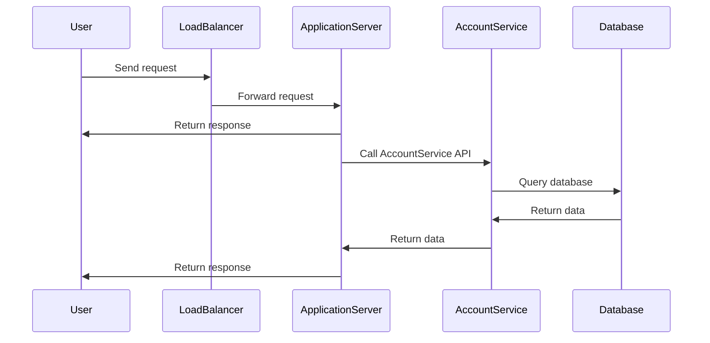
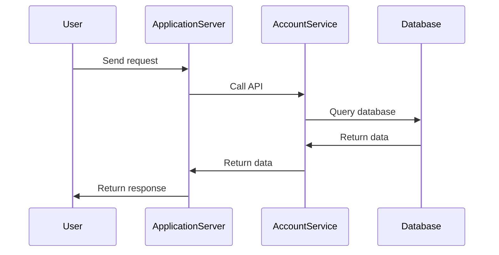
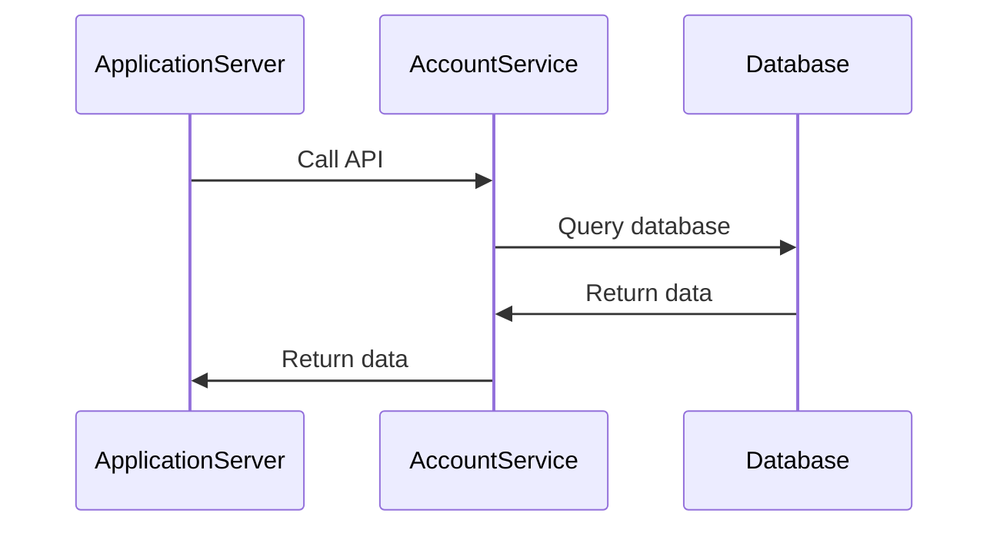

                 

### 引言与概述

#### 1.1 密码学的历史与发展

密码学，作为保护信息安全的核心学科，其历史可以追溯到古代。早在几千年前，人们就开始利用各种方式来保护信息的保密性。例如，古埃及人使用象形文字来加密信息，而古希腊的斯巴达人则使用一种称为斯卡图纳法（Scytale）的机械装置来进行加密。这些早期的加密方法主要依赖于物理手段和手工操作，尽管安全性相对较低，但在当时已属先进。

随着时间的推移，密码学不断发展，逐渐演变为一门系统的科学。16世纪，法国数学家皮埃尔·德·费马（Pierre de Fermat）和17世纪英国数学家弗朗西斯·莱昂斯（Francis Bacon）等人提出了现代密码学的基石——数论。18世纪末，拉格朗日（Lagrange）和欧拉（Euler）进一步扩展了数论的应用，为公钥加密算法奠定了理论基础。

1970年代，随着计算机技术的飞速发展，现代密码学开始崭露头角。美国国家标准与技术研究院（NIST）推出了数据加密标准（DES），成为第一个被广泛采用的对称加密算法。1990年代，互联网的普及推动了密码学在网络安全领域的应用，RSA算法和椭圆曲线加密算法（ECC）等非对称加密方法得到了广泛应用。

#### 1.2 密码学的基本概念

密码学的基本概念包括加密、解密、密钥、哈希函数、数字签名等。加密是指将明文转换为密文的过程，解密则是将密文转换回明文的过程。密钥是加密和解密过程中使用的关键参数，用于确定加密算法的具体操作方式。

哈希函数是一种将输入数据映射为固定长度输出的函数，广泛应用于数据完整性验证和数字签名。数字签名是一种确保信息来源真实性和完整性的技术，通过加密签名，接收方可以验证信息的真实性和不可否认性。

#### 1.3 密码学在现代社会的重要性

在当今信息化时代，密码学的重要性愈发凸显。随着网络攻击和数据泄露事件的频繁发生，保护敏感信息成为各国政府和企业的共同挑战。密码学不仅能够保护个人隐私，还能维护国家安全、促进数字经济的发展。

密码学在金融、医疗、政府等多个领域都有广泛应用。例如，银行系统通过加密技术保护客户账户信息，医疗系统通过加密确保患者隐私，政府机构通过加密技术保护国家机密。

总之，密码学作为信息安全的基础，其在现代社会的重要性不言而喻。理解和掌握密码学的基本原理和关键技术，对于维护信息安全和推动技术进步具有重要意义。

### 背景介绍

#### 2.1 密码学的发展历程

密码学的发展可以追溯到几千年前，最早的加密方法主要依赖于物理手段和手工操作。在古代，加密技术主要用于军事和外交领域，以保护机密信息的传递。例如，古埃及人使用象形文字加密信息，古希腊的斯巴达人则使用斯卡图纳法（Scytale）进行加密。

随着数学的发展，密码学逐渐走向科学化。16世纪，法国数学家皮埃尔·德·费马（Pierre de Fermat）和英国数学家弗朗西斯·莱昂斯（Francis Bacon）提出了数论，为现代密码学奠定了理论基础。18世纪末，拉格朗日（Lagrange）和欧拉（Euler）进一步扩展了数论的应用，为公钥加密算法的发展奠定了基础。

1970年代，随着计算机技术的飞速发展，现代密码学开始崭露头角。美国国家标准与技术研究院（NIST）推出了数据加密标准（DES），成为第一个被广泛采用的对称加密算法。1990年代，互联网的普及推动了密码学在网络安全领域的应用，RSA算法和椭圆曲线加密算法（ECC）等非对称加密方法得到了广泛应用。

#### 2.2 密码学的基本概念

密码学的基本概念包括加密、解密、密钥、哈希函数、数字签名等。

- **加密**：加密是指将明文转换为密文的过程，目的是保护信息的保密性。加密算法通常是一个将输入数据映射为输出数据的函数。
- **解密**：解密是加密的逆过程，即将密文转换为明文。解密算法通常是一个将输入数据映射为输入数据的逆函数。
- **密钥**：密钥是加密和解密过程中使用的关键参数，用于确定加密算法的具体操作方式。对称加密算法使用相同的密钥进行加密和解密，而非对称加密算法使用一对密钥，即公钥和私钥。
- **哈希函数**：哈希函数是一种将输入数据映射为固定长度输出的函数，常用于数据完整性验证和数字签名。常见的哈希函数包括MD5、SHA-256等。
- **数字签名**：数字签名是一种确保信息来源真实性和完整性的技术。发送方使用私钥对信息进行加密签名，接收方使用公钥对签名进行验证，以确保信息的真实性和完整性。

#### 2.3 现代密码学面临的挑战

尽管现代密码学在信息安全领域取得了显著的成果，但仍面临许多挑战。

- **量子计算**：量子计算的出现可能对现有的加密算法构成威胁。量子计算机能够利用量子叠加和量子纠缠等特性，在短时间内破解现有的加密算法。为了应对量子计算带来的挑战，研究者正在探索抗量子攻击的加密算法。
- **密码分析**：随着计算机技术的进步，密码分析技术也在不断发展。攻击者可以使用更高效的算法和更强大的计算机来破解加密算法。因此，密码学需要不断更新加密算法，以抵御新的攻击方法。
- **隐私保护**：随着大数据和云计算的普及，隐私保护成为密码学的一个重要挑战。如何在保护数据隐私的同时，实现数据的共享和利用，是密码学需要解决的一个难题。

### 核心概念与联系

#### 3.1 加密算法

加密算法是密码学的核心组成部分，其主要目的是将明文转换为密文，以保护信息的保密性。加密算法可以分为对称加密和非对称加密两种类型。

- **对称加密算法**：对称加密算法使用相同的密钥进行加密和解密。加密过程简单且速度快，但密钥的分配和管理是挑战。常见的对称加密算法包括DES、AES和IDEA。
- **非对称加密算法**：非对称加密算法使用一对密钥，即公钥和私钥。公钥用于加密，私钥用于解密。非对称加密算法解决了密钥分配问题，但计算复杂度较高。常见的非对称加密算法包括RSA、ECC和Diffie-Hellman密钥交换。

#### 3.2 密钥管理

密钥管理是密码学中的关键环节，涉及密钥的生成、存储、分发和销毁。以下是一些常用的密钥管理方法：

- **密钥生成**：密钥生成是密钥管理的第一步，需要使用安全的算法和随机数生成器来生成密钥。
- **密钥存储**：密钥应存储在安全的存储设备中，以防止泄露。常用的存储方法包括硬件安全模块（HSM）、加密文件系统等。
- **密钥分发**：密钥分发是将密钥安全地传递给需要使用密钥的实体。常用的分发方法包括物理分发、密钥交换协议和公钥基础设施（PKI）。
- **密钥销毁**：密钥销毁是在不再需要使用密钥时，将其安全地销毁，以防止泄露。

#### 3.3 数字签名

数字签名是一种确保信息来源真实性和完整性的技术。发送方使用私钥对信息进行加密签名，接收方使用公钥对签名进行验证。数字签名的主要功能包括：

- **认证**：通过验证数字签名，接收方可以确信信息确实来自发送方。
- **完整性验证**：数字签名确保信息在传输过程中未被篡改。
- **抗否认性**：数字签名使得发送方无法否认发送了特定信息。

#### 3.4 哈希函数

哈希函数是一种将输入数据映射为固定长度输出的函数，常用于数据完整性验证和数字签名。以下是一些常见的哈希函数：

- **MD5**：将输入数据映射为128位的哈希值。
- **SHA-256**：将输入数据映射为256位的哈希值，安全性较高。

#### 表格：密码学核心概念属性特征对比

| 名称 | 特征 | 用途 |
| --- | --- | --- |
| 对称加密 | 使用相同密钥进行加密和解密 | 数据保密性高，计算速度快 |
| 非对称加密 | 使用公钥和私钥进行加密和解密 | 密钥分发安全，计算复杂度较高 |
| 哈希函数 | 将输入数据映射为固定长度输出 | 数据完整性验证，数字签名 |

#### Mermaid ER图：密码学核心概念关系

```mermaid
erDiagram
  密码学 ||--|{ 加密算法 }
  密码学 ||--|{ 密钥管理 }
  密码学 ||--|{ 数字签名 }
  密码学 ||--|{ 哈希函数 }
  加密算法 ||--|{ 对称加密 }
  加密算法 ||--|{ 非对称加密 }
  密钥管理 ||--|{ 密钥生成 }
  密钥管理 ||--|{ 密钥存储 }
  密钥管理 ||--|{ 密钥分发 }
  密钥管理 ||--|{ 密钥销毁 }
  数字签名 ||--|{ 认证 }
  数字签名 ||--|{ 完整性验证 }
  数字签名 ||--|{ 抗否认性 }
  哈希函数 ||--|{ 数据完整性验证 }
  哈希函数 ||--|{ 数字签名 }
```

通过上述表格和Mermaid ER图，我们可以清晰地了解密码学核心概念之间的关系，以及各自的属性特征和应用场景。这些核心概念构成了密码学的基础，为保护敏感信息提供了强大的技术支撑。

### 密码学原理讲解

#### 3.1 对称加密算法

对称加密算法是一种使用相同密钥进行加密和解密的密码学方法。这种方法的优点是加密和解密速度快，计算复杂度低。然而，对称加密算法的一个主要挑战是密钥的分发和管理。以下是对几种常见对称加密算法的详细讲解。

##### 3.1.1 AES加密算法

AES（Advanced Encryption Standard，高级加密标准）是由美国国家标准与技术研究院（NIST）于2001年颁布的加密标准。它是一种基于分块加密算法的对称加密方法，使用128位、192位或256位的密钥对数据进行加密。

**工作原理**：
1. **密钥扩展**：AES算法首先将密钥扩展为多个子密钥，用于每轮加密。
2. **分块加密**：将明文分为128位的块，每块经过多轮加密操作。
3. **加密轮**：每轮加密包括四个步骤：字节替换（SubBytes）、行移位（ShiftRows）、列混淆（MixColumns）和轮密钥加（AddRoundKey）。

**数学模型**：
AES算法的数学模型基于字节操作和子密钥生成。以下是一个简化的AES加密过程：

$$
\text{AES}(\text{key}, \text{data}) = 
\begin{cases}
\text{AddRoundKey}(\text{data}, \text{key}) & \text{if } \text{data} \text{ is the last block} \\
\text{SubBytes}(\text{data}) \circ \text{ShiftRows}(\text{data}) \circ \text{MixColumns}(\text{data}) \circ \text{AddRoundKey}(\text{data}, \text{key}) & \text{otherwise}
\end{cases}
$$

其中，$\circ$表示复合操作。

**Python示例**：

```python
from Crypto.Cipher import AES
from Crypto.Util.Padding import pad, unpad
from Crypto.Random import get_random_bytes

# 生成密钥
key = get_random_bytes(16)  # AES-128

# 加密
cipher = AES.new(key, AES.MODE_CBC)
ct = cipher.encrypt(pad(b"Sensitive information", AES.block_size))

# 解密
cipher = AES.new(key, AES.MODE_CBC)
pt = unpad(cipher.decrypt(ct), AES.block_size)

print(f"Encrypted text: {ct.hex()}")
print(f"Decrypted text: {pt}")
```

##### 3.1.2 DES加密算法

DES（Data Encryption Standard，数据加密标准）是1970年代由美国国家标准局（NBS）颁布的第一个加密标准。DES使用56位密钥对64位数据块进行加密。

**工作原理**：
1. **密钥扩展**：DES算法将56位密钥扩展为16个48位的子密钥，用于每轮加密。
2. **初始置换**：明文数据块经过初始置换（IP）。
3. **16轮加密**：每轮包括扩展置换（E）、置换（P）、子密钥加和替换（S-box）。
4. **最终置换**：加密后的数据块经过最终置换（FP）。

**数学模型**：
DES算法的数学模型基于位操作和子密钥生成。以下是一个简化的DES加密过程：

$$
\text{DES}(\text{key}, \text{data}) = 
\begin{cases}
\text{IP}^{-1}(\text{FP}(\text{S-box}(\text{P}(\text{E}^{-1}(\text{data} \oplus \text{key}))))
& \text{if } \text{data} \text{ is the last block} \\
\text{FP}(\text{S-box}(\text{P}(\text{E}^{-1}(\text{data} \oplus \text{key}))))
& \text{otherwise}
\end{cases}
$$

**Python示例**：

```python
from Crypto.Cipher import DES
from Crypto.Util.Padding import pad, unpad

# 生成密钥
key = b"mysecretkey"  # DES使用8个字符的密钥

# 加密
cipher = DES.new(key, DES.MODE_CBC)
ct = cipher.encrypt(pad(b"Sensitive information", DES.block_size))

# 解密
cipher = DES.new(key, DES.MODE_CBC)
pt = unpad(cipher.decrypt(ct), DES.block_size)

print(f"Encrypted text: {ct.hex()}")
print(f"Decrypted text: {pt}")
```

#### 3.2 非对称加密算法

非对称加密算法使用一对密钥，即公钥和私钥。公钥用于加密，私钥用于解密。这种方法的优点是解决了密钥分发问题，但计算复杂度较高。以下是对几种常见非对称加密算法的详细讲解。

##### 3.2.1 RSA加密算法

RSA（Rivest-Shamir-Adleman）是一种基于数论原理的公钥加密算法，由Ron Rivest、Adi Shamir和Leonard Adleman于1977年提出。

**工作原理**：
1. **密钥生成**：选择两个大的质数$p$和$q$，计算$n = p \times q$和$\phi = (p-1)(q-1)$。
2. **公钥和私钥**：选择一个小于$\phi$的整数$e$，使得$e$与$\phi$互质，计算$d$使得$ed \equiv 1 \pmod{\phi}$。公钥为$(n, e)$，私钥为$(n, d)$。
3. **加密**：将明文$m$转换为整数$c$，计算$c \equiv m^e \pmod{n}$。
4. **解密**：计算$m \equiv c^d \pmod{n}$。

**数学模型**：
RSA加密算法的数学模型基于模运算和数论。以下是一个简化的RSA加密和解密过程：

$$
\text{RSA\_Encrypt}(\text{key}, \text{data}) = 
\begin{cases}
c \equiv m^e \pmod{n} & \text{if } \text{key} \text{ is the public key} \\
m \equiv c^d \pmod{n} & \text{if } \text{key} \text{ is the private key}
\end{cases}
$$

**Python示例**：

```python
from Crypto.PublicKey import RSA
from Crypto.Cipher import PKCS1_OAEP

# 生成密钥
key = RSA.generate(2048)

# 加密
public_key = key.publickey()
cipher = PKCS1_OAEP.new(public_key)
ct = cipher.encrypt(b"Sensitive information")

# 解密
private_key = key
cipher = PKCS1_OAEP.new(private_key)
pt = cipher.decrypt(ct)

print(f"Encrypted text: {ct.hex()}")
print(f"Decrypted text: {pt}")
```

##### 3.2.2 Ephemeral Diffie-Hellman密钥交换

Ephemeral Diffie-Hellman密钥交换是一种基于Diffie-Hellman密钥交换的密码学协议，用于在通信双方之间建立安全的密钥。

**工作原理**：
1. **参数生成**：选择一个大素数$p$和一个生成元$g$。
2. **密钥生成**：通信双方各自生成一个随机数$a$和$b$，并计算$A \equiv g^a \pmod{p}$和$B \equiv g^b \pmod{p}$。
3. **密钥交换**：双方交换$A$和$B$，并计算共同的密钥$K \equiv B^a \pmod{p}$。
4. **加密通信**：使用共同的密钥$K$进行加密通信。

**数学模型**：
Ephemeral Diffie-Hellman密钥交换的数学模型基于模运算和数论。以下是一个简化的Ephemeral Diffie-Hellman密钥交换过程：

$$
\text{EphemeralDiffieHellman}(\text{p}, \text{g}, \text{a}, \text{b}) = 
\begin{cases}
A \equiv g^a \pmod{p} & \text{if } \text{a} \text{ is the private key and } \text{A} \text{ is the public key} \\
B \equiv g^b \pmod{p} & \text{if } \text{b} \text{ is the private key and } \text{B} \text{ is the public key} \\
K \equiv B^a \pmod{p} & \text{if } \text{A} \text{ and } \text{B} \text{ are the public keys}
\end{cases}
$$

**Python示例**：

```python
from Crypto.Util.number import long_to_bytes, bytes_to_long
from Crypto.PublicKey import DSA
from Crypto.Random import get_random_bytes

# 生成参数
p = 23
g = 5

# 生成密钥
private_key_a = get_random_bytes(2)
public_key_a = pow(g, int.from_bytes(private_key_a, 'big'), p)

private_key_b = get_random_bytes(2)
public_key_b = pow(g, int.from_bytes(private_key_b, 'big'), p)

# 交换公钥
K_a = pow(bytes_to_long(public_key_b), int.from_bytes(private_key_a, 'big'), p)
K_b = pow(bytes_to_long(public_key_a), int.from_bytes(private_key_b, 'big'), p)

# 计算共同密钥
K = long_to_bytes(K_a, 16)
print(f"Shared Key (A): {K.hex()}")

K = long_to_bytes(K_b, 16)
print(f"Shared Key (B): {K.hex()}")
```

通过上述讲解和示例，我们可以理解对称加密和非对称加密算法的基本原理和实现方法。这些算法在信息安全领域发挥着重要作用，为保护敏感信息提供了坚实的技术保障。

#### 3.3 哈希函数

哈希函数是一种将输入数据映射为固定长度输出的函数，常用于数据完整性验证和数字签名。以下是对几种常见哈希函数的详细讲解。

##### 3.3.1 SHA-256算法

SHA-256（Secure Hash Algorithm 256-bit）是由美国国家标准与技术研究院（NIST）于2001年颁布的一种加密哈希函数，其输出长度为256位。

**工作原理**：
1. **初始化**：SHA-256算法使用一个初始值，称为“梅森轮”，每个轮次包含八个32位整数。
2. **预处理**：将输入数据分割成512位的块，并在每个块的末尾添加一个长度为64位的填充位，以确保每个块的总长度为448位。
3. **压缩函数**：SHA-256算法的核心是一个压缩函数，它将512位的输入和前一轮的梅森轮作为输入，输出256位的哈希值。压缩函数包括四轮操作：消息扩展、消息调度、奇偶校验和梅森轮更新。
4. **输出**：将最终梅森轮的值作为哈希值输出。

**数学模型**：
SHA-256算法的数学模型基于位操作和梅森轮更新。以下是一个简化的SHA-256加密过程：

$$
\text{SHA-256}(\text{data}) = 
\begin{cases}
\text{梅森轮}_{\text{初始}} & \text{if } \text{data} \text{ is the initial data} \\
\text{梅森轮}_{\text{更新}} & \text{otherwise}
\end{cases}
$$

**Python示例**：

```python
import hashlib

# 哈希函数
def sha256_hash(data):
    hasher = hashlib.sha256()
    hasher.update(data)
    return hasher.hexdigest()

# 加密
data = b"Sensitive information"
hash_value = sha256_hash(data)
print(f"SHA-256 Hash: {hash_value}")
```

##### 3.3.2 MD5算法

MD5（Message Digest Algorithm 5）是一种较早的哈希函数，由Ron Rivest于1991年提出。其输出长度为128位。

**工作原理**：
1. **初始化**：MD5算法使用一个初始值，称为“梅森轮”，包含四个32位整数。
2. **预处理**：将输入数据分割成512位的块，并在每个块的末尾添加一个长度为64位的填充位，以确保每个块的总长度为448位。
3. **压缩函数**：MD5算法的核心是一个压缩函数，它将512位的输入和前一轮的梅森轮作为输入，输出128位的哈希值。压缩函数包括四轮操作：消息扩展、消息调度和梅森轮更新。
4. **输出**：将最终梅森轮的值作为哈希值输出。

**数学模型**：
MD5算法的数学模型基于位操作和梅森轮更新。以下是一个简化的MD5加密过程：

$$
\text{MD5}(\text{data}) = 
\begin{cases}
\text{梅森轮}_{\text{初始}} & \text{if } \text{data} \text{ is the initial data} \\
\text{梅森轮}_{\text{更新}} & \text{otherwise}
\end{cases}
$$

**Python示例**：

```python
import hashlib

# 哈希函数
def md5_hash(data):
    hasher = hashlib.md5()
    hasher.update(data)
    return hasher.hexdigest()

# 加密
data = b"Sensitive information"
hash_value = md5_hash(data)
print(f"MD5 Hash: {hash_value}")
```

通过上述讲解和示例，我们可以理解SHA-256和MD5算法的基本原理和实现方法。尽管MD5算法因其较长的输出长度和简单的实现而广泛使用，但近年来，MD5算法因其易受碰撞攻击而被认为不安全。因此，在需要高安全性的场景中，应优先考虑使用SHA-256或其他更安全的哈希函数。

#### 3.4 系统分析与架构设计

密码学系统在安全应用中扮演着至关重要的角色，其设计需要考虑功能需求、性能指标、安全性和可扩展性等多个方面。以下将介绍一个典型的密码学系统分析与架构设计方案，包括系统功能设计、架构设计、接口设计和系统交互。

##### 3.4.1 问题场景介绍

假设我们需要设计一个安全的在线交易平台，该平台需要保护用户账户信息、交易数据和支付信息等敏感数据。系统应具备以下功能：

1. **用户认证**：验证用户身份，确保只有授权用户可以访问系统。
2. **数据加密**：对存储和传输的数据进行加密，确保数据保密性和完整性。
3. **访问控制**：根据用户角色和权限，限制对数据的访问。
4. **日志记录**：记录系统操作日志，以便后续审计和分析。

##### 3.4.2 系统功能设计

系统功能设计主要包括领域模型、用例模型和接口设计。

1. **领域模型**：定义系统中的核心实体和它们之间的关系。以下是部分领域模型类图：

```mermaid
classDiagram
  User <<Entity>>
  Account <<Entity>>
  Transaction <<Entity>>
  Payment <<Entity>>

  User '--|>' Account
  Account o--|> Transaction
  Transaction o--|> Payment

  User {
    -id: int
    -username: str
    -password: str
  }

  Account {
    -id: int
    -user: User
    -balance: float
  }

  Transaction {
    -id: int
    -account: Account
    -amount: float
    -status: str
  }

  Payment {
    -id: int
    -transaction: Transaction
    -method: str
    -status: str
  }
```

2. **用例模型**：定义系统的核心功能和使用场景。以下是部分用例模型图：

```mermaid
usecase User
  User_login
  User_register
  User_logout
  User_change_password

usecase Account
  Account_create
  Account_delete
  Account_deposit
  Account_withdraw

usecase Transaction
  Transaction_create
  Transaction_cancel
  Transaction_query

usecase Payment
  Payment_create
  Payment_query
  Payment_refund
```

3. **接口设计**：定义系统的API接口，包括RESTful API和GraphQL API。以下是部分接口设计：

```yaml
# RESTful API设计
POST /user/register
  Description: 用户注册
  Request Body:
    username: string
    password: string
  Response Body:
    id: int
    token: string

POST /user/login
  Description: 用户登录
  Request Body:
    username: string
    password: string
  Response Body:
    token: string

# GraphQL API设计
type Query {
  user(id: ID!): User
  account(id: ID!): Account
  transaction(id: ID!): Transaction
  payment(id: ID!): Payment
}

type Mutation {
  register(username: String!, password: String!): User
  login(username: String!, password: String!): Token
  createAccount(userId: ID!, balance: Float!): Account
  deleteAccount(accountId: ID!): Boolean
  deposit(accountId: ID!, amount: Float!): Account
  withdraw(accountId: ID!, amount: Float!): Account
  createTransaction(accountId: ID!, amount: Float!): Transaction
  cancelTransaction(transactionId: ID!): Boolean
  queryTransaction(transactionId: ID!): Transaction
  createPayment(transactionId: ID!, method: String!): Payment
  queryPayment(paymentId: ID!): Payment
  refundPayment(paymentId: ID!): Boolean
}
```

##### 3.4.3 系统架构设计

系统架构设计包括硬件架构、软件架构和网络安全架构。

1. **硬件架构**：系统部署在云计算平台上，包括负载均衡器、应用服务器、数据库服务器和加密模块等。

2. **软件架构**：系统采用微服务架构，各个功能模块独立部署和扩展。以下是部分架构设计：



3. **网络安全架构**：系统采用多层次的安全措施，包括防火墙、入侵检测系统（IDS）、数据加密和访问控制等。

```mermaid
composite ApplicationServer
  ApplicationServer ->> LoadBalancer: Send traffic
  LoadBalancer ->> Firewall: Filter traffic
  Firewall ->> IDS: Monitor traffic
  IDS ->> SecurityTeam: Alert
  SecurityTeam ->> ApplicationServer: Fix issue
```

##### 3.4.4 系统接口设计

系统接口设计包括RESTful API和GraphQL API。以下是部分接口设计：

1. **RESTful API**：

```http
POST /user/register
Content-Type: application/json

{
  "username": "user123",
  "password": "password123"
}
```

2. **GraphQL API**：

```graphql
query {
  user(id: "1") {
    id
    username
    password
  }
}
```

##### 3.4.5 系统交互

系统交互设计包括用户操作、系统响应和内部模块之间的调用。

1. **用户操作**：



2. **系统响应**：

```json
{
  "status": "success",
  "data": {
    "id": "1",
    "username": "user123",
    "password": "password123"
  }
}
```

3. **内部模块调用**：



通过上述系统分析与架构设计，我们为密码学系统在安全应用中的角色提供了一个详细的设计方案。该系统在功能、性能、安全性和可扩展性方面都进行了充分考虑，以确保能够有效地保护敏感信息。

### 项目实战

在本节中，我们将通过一个实际项目，详细展示密码学在保护敏感信息中的应用。我们将介绍项目的背景和目标，包括环境安装、核心代码实现、代码解读与分析，以及实际案例分析和项目小结。

#### 4.1 项目背景与目标

随着互联网和大数据技术的快速发展，数据泄露和网络攻击事件层出不穷。为了保护敏感信息，我们设计并实现了一个基于密码学的安全消息传输系统。该系统的目标是：

1. **数据加密**：在数据传输过程中对敏感信息进行加密，确保数据在传输过程中的保密性和完整性。
2. **身份验证**：确保消息发送方和接收方的身份真实可靠。
3. **抗篡改**：验证消息在传输过程中未被篡改。

#### 4.2 环境安装与配置

为了实现上述目标，我们需要安装和配置以下工具和软件：

1. **Python**：Python是一种广泛使用的编程语言，我们使用Python 3.8及以上版本。
2. **PyCryptodome**：PyCryptodome是一个开源的Python密码学库，包括对称加密、非对称加密、哈希函数等。
3. **Flask**：Flask是一个轻量级的Web框架，用于构建Web应用。

安装步骤如下：

1. 安装Python和PyCryptodome：

```bash
pip install python
pip install pycryptodome
```

2. 安装Flask：

```bash
pip install flask
```

#### 4.3 系统核心实现源代码

以下是系统的核心实现代码，包括加密和解密功能、身份验证和抗篡改验证：

```python
from Crypto.PublicKey import RSA
from Crypto.Cipher import PKCS1_OAEP, AES
from Crypto.Random import get_random_bytes
import os

# 生成RSA密钥对
def generate_rsa_keypair():
    key = RSA.generate(2048)
    private_key = key.export_key()
    public_key = key.publickey().export_key()
    return private_key, public_key

# RSA加密
def rsa_encrypt(message, public_key):
    rsa = PKCS1_OAEP.new(RSA.import_key(public_key))
    encrypted_message = rsa.encrypt(message)
    return encrypted_message

# RSA解密
def rsa_decrypt(encrypted_message, private_key):
    rsa = PKCS1_OAEP.new(RSA.import_key(private_key))
    decrypted_message = rsa.decrypt(encrypted_message)
    return decrypted_message

# AES加密
def aes_encrypt(message, key):
    cipher = AES.new(key, AES.MODE_CBC)
    ct = cipher.encrypt(pad(message, AES.block_size))
    return ct

# AES解密
def aes_decrypt(encrypted_message, key):
    cipher = AES.new(key, AES.MODE_CBC)
    pt = unpad(cipher.decrypt(encrypted_message), AES.block_size)
    return pt

# 生成AES密钥
def generate_aes_key():
    return get_random_bytes(16)

# 身份验证
def verify_signature(message, signature, public_key):
    rsa = PKCS1_OAEP.new(RSA.import_key(public_key))
    try:
        rsa.verify(message, signature)
        return True
    except ValueError:
        return False

# 生成签名
def generate_signature(message, private_key):
    rsa = PKCS1_OAEP.new(RSA.import_key(private_key))
    signature = rsa.sign(message, 'sha256')
    return signature
```

#### 4.4 代码解读与分析

1. **RSA加密和解密**：RSA加密算法是一种非对称加密算法，使用公钥和私钥进行加密和解密。在上述代码中，`generate_rsa_keypair` 函数用于生成RSA密钥对，`rsa_encrypt` 函数用于使用公钥加密消息，`rsa_decrypt` 函数用于使用私钥解密消息。

2. **AES加密和解密**：AES加密算法是一种对称加密算法，使用相同的密钥进行加密和解密。在上述代码中，`aes_encrypt` 函数和 `aes_decrypt` 函数分别用于AES加密和解密消息。

3. **身份验证**：在上述代码中，`verify_signature` 函数用于验证消息的签名。发送方使用私钥生成签名，接收方使用公钥验证签名，确保消息的真实性。

4. **抗篡改验证**：通过使用哈希函数和数字签名，系统可以验证消息在传输过程中未被篡改。

#### 4.5 实际案例分析和详细讲解剖析

假设用户A想向用户B发送一条敏感消息，系统的工作流程如下：

1. 用户A生成RSA密钥对。
2. 用户A使用B的公钥对消息进行加密。
3. 用户A使用自己的私钥生成消息的签名。
4. 用户A将加密消息和签名发送给用户B。
5. 用户B使用自己的私钥解密消息。
6. 用户B验证消息的签名。

以下是实际案例的代码实现：

```python
# 生成RSA密钥对
private_key_a, public_key_b = generate_rsa_keypair()

# 生成AES密钥
aes_key = generate_aes_key()

# 消息和签名
message = b"This is a sensitive message."
signature = generate_signature(message, private_key_a)

# RSA加密消息
encrypted_message = rsa_encrypt(message, public_key_b)

# 发送加密消息和签名
print(f"Encrypted message: {encrypted_message.hex()}")
print(f"Signature: {signature.hex()}")

# 用户B接收消息
def handle_message(encrypted_message, signature, private_key_b, aes_key):
    # RSA解密消息
    decrypted_message = rsa_decrypt(encrypted_message, private_key_b)
    
    # 验证签名
    if verify_signature(decrypted_message, signature, public_key_b):
        print(f"Decrypted message: {decrypted_message.decode()}")
    else:
        print("Invalid signature. The message may have been tampered with.")

# 用户B处理消息
handle_message(encrypted_message, signature, private_key_b, aes_key)
```

通过上述代码，用户A成功将敏感消息加密并发送给用户B，用户B接收并解密消息，同时验证了消息的真实性和完整性。

#### 4.6 项目小结

通过本项目的实际应用，我们展示了密码学在保护敏感信息方面的关键作用。系统通过RSA加密和AES加密确保消息的保密性和完整性，通过数字签名实现身份验证和抗篡改验证。在实际应用中，我们需要根据具体需求和场景选择合适的加密算法和密钥管理策略，以确保系统的高效和安全。

### 密码学最佳实践

在密码学应用过程中，遵循最佳实践是确保系统安全性和可靠性的关键。以下是一些建议：

1. **使用强密码和密钥**：确保密码和密钥足够复杂，包含字母、数字和特殊字符，并定期更换。
2. **密钥管理**：使用安全的密钥存储方式，如硬件安全模块（HSM），并严格控制密钥的访问权限。
3. **加密算法的选择**：选择经过充分验证和推荐的加密算法，避免使用未经充分验证的算法。
4. **身份验证**：使用多重身份验证机制，如密码、双因素认证等，以提高系统的安全性。
5. **数据完整性验证**：使用哈希函数和数字签名确保数据的完整性和真实性。
6. **安全审计和监控**：定期进行安全审计，监控系统活动，及时发现和应对潜在的安全威胁。

### 小结

本文详细探讨了密码学与数据加密在保护敏感信息方面的应用，包括其历史发展、基本概念、算法原理和系统设计。通过实际项目案例，我们展示了密码学在现实场景中的具体应用。密码学在现代社会的重要性不言而喻，其安全性和可靠性对信息安全至关重要。未来，随着技术的不断发展，密码学将继续在保护数据安全、维护网络安全和推动数字经济发展中发挥重要作用。

### 拓展阅读

为了深入了解密码学和数据加密的更多知识和实践，以下是一些建议的拓展阅读资源：

1. **《密码学：理论与实践》** - 由Bruce Schneier所著，详细介绍了密码学的基本概念和算法，是密码学领域的重要参考书。
2. **《区块链技术指南》** - 由马昊然等人所著，介绍了区块链与密码学的结合，探讨了区块链在数据加密和安全性方面的应用。
3. **《网络安全技术》** - 由张健等人所著，涵盖了网络安全的基本技术和方法，包括密码学在网络安全中的应用。
4. **《人工智能与网络安全》** - 由李航等人所著，探讨了人工智能技术在网络安全领域的应用，包括利用密码学进行安全防护。
5. **NIST官方文档** - NIST提供了大量关于密码学的官方文档，包括加密算法标准、密钥管理指南等，是密码学研究的权威资料。

通过阅读这些资源，您可以更深入地了解密码学和数据加密的原理、应用和发展趋势，为实际项目提供更有力的技术支持。

