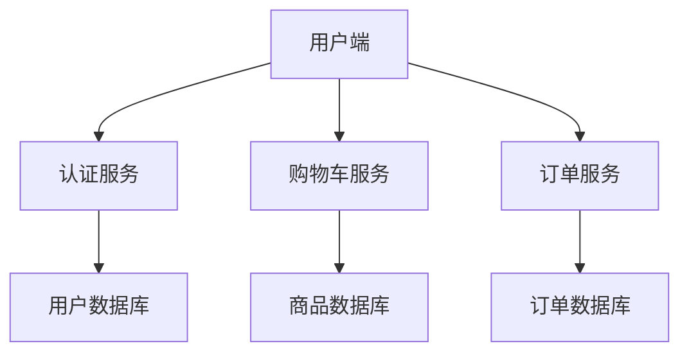

                 


# 密码学在系统设计中的应用

## 关键词
- 密码学
- 系统设计
- 加密算法
- 密钥管理
- 数字签名
- 安全协议

## 摘要
本文将深入探讨密码学在系统设计中的应用，包括其核心概念、加密算法原理、密钥管理、数字签名、安全协议以及实际系统设计案例分析。通过逐步分析，本文旨在帮助读者理解密码学在保障系统安全中的关键作用，并提供实用的设计建议和未来展望。

## 第一部分：密码学基础

### 1.1 密码学概述

密码学是研究如何通过加密和解密技术保护信息安全的科学。它的历史可以追溯到古代的斯巴达和古罗马，但现代密码学的发展主要始于20世纪中期。密码学的核心概念包括加密（Encryption）、解密（Decryption）、密钥（Key）、算法（Algorithm）等。

**问题背景：**
随着信息技术的飞速发展，数据的安全问题日益凸显。无论是个人隐私、企业机密，还是国家信息，都需要通过密码学技术来保障。因此，密码学在系统设计中的应用变得至关重要。

**问题描述：**
在设计一个系统时，如何确保数据的机密性、完整性和不可否认性？这是系统设计中面临的主要问题。

**问题解决：**
通过密码学技术，可以设计出安全的加密算法，实现对数据的加密存储和传输，从而保障数据的机密性。同时，利用数字签名技术，可以确保数据的完整性和不可否认性。

**边界与外延：**
密码学不仅涉及加密和解密技术，还包括密钥管理、哈希函数、数字签名、安全协议等多个方面。这些元素共同构成了密码学的完整体系。

### 1.2 核心概念与联系

**核心概念：**
- **加密：** 将明文转换为密文的过程。
- **解密：** 将密文转换为明文的过程。
- **密钥：** 加密和解密过程中使用的关键信息。
- **算法：** 加密和解密的数学过程。

**概念属性特征对比表格：**

| 加密算法 | 对称加密 | 非对称加密 |
| --- | --- | --- |
| 加密速度 | 快 | 慢 |
| 密钥长度 | 短 | 长 |
| 加密解密过程 | 对称 | 非对称 |
| 安全性 | 较高 | 较高 |
| 应用场景 | 数据存储 | 数据传输 |

**ER实体关系图架构的 Mermaid 流程图：**

```mermaid
erDiagram
    Product ||--|{ Customer }||>
    Customer ||--|{ Product }||>
```

### 1.3 算法原理讲解

**对称加密算法：**

- **AES算法原理：** AES（Advanced Encryption Standard）是一种常用的对称加密算法，它使用128位密钥对数据进行加密和解密。其加密过程包括初始置换、多轮替换、行移位和最终置换。

  ```python
  def aes_encrypt(plaintext, key):
      # 初始化密钥
      cipher_key = init_key(key)
      
      # 初始置换
      plaintext = initial_permutation(plaintext)
      
      # 多轮替换
      for _ in range(10):
          plaintext = substitute(plaintext, cipher_key)
          plaintext = shift_rows(plaintext)
          plaintext = mix_columns(plaintext)
          cipher_key = round_key(cipher_key)
      
      # 最终置换
      ciphertext = final_permutation(plaintext)
      
      return ciphertext
  ```

- **DES算法原理：** DES（Data Encryption Standard）是一种早期的对称加密算法，它使用56位密钥对数据进行加密。其加密过程包括初始置换、16轮替换、逆初始置换。

  ```python
  def des_encrypt(plaintext, key):
      # 初始化密钥
      cipher_key = init_key(key)
      
      # 初始置换
      plaintext = initial_permutation(plaintext)
      
      # 16轮替换
      for _ in range(16):
          plaintext = substitute(plaintext, cipher_key)
          plaintext = shift_rows(plaintext)
          plaintext = mix_columns(plaintext)
          cipher_key = round_key(cipher_key)
      
      # 逆初始置换
      ciphertext = final_permutation(plaintext)
      
      return ciphertext
  ```

**非对称加密算法：**

- **RSA算法原理：** RSA（Rivest-Shamir-Adleman）是一种常用的非对称加密算法，它使用公钥和私钥对数据进行加密和解密。其加密过程包括生成公钥和私钥、加密和解密。

  ```python
  def rsa_encrypt(plaintext, public_key):
      # 将明文转换为整数
      num plaintext = text_to_num(plaintext)
      
      # 加密
      ciphertext = pow(plaintext, public_key['e'], public_key['n'])
      
      return ciphertext
  
  def rsa_decrypt(ciphertext, private_key):
      # 将密文转换为整数
      num ciphertext = text_to_num(ciphertext)
      
      # 解密
      plaintext = pow(ciphertext, private_key['d'], private_key['n'])
      
      return num_to_text(plaintext)
  ```

### 1.4 数学模型和数学公式

- **对称加密算法的数学模型：**

  $$C = E_K(P)$$

  其中，$C$表示密文，$E_K$表示加密算法，$P$表示明文。

- **非对称加密算法的数学模型：**

  $$C = E_K^e(P)$$

  $$P = D_K^d(C)$$

  其中，$C$表示密文，$P$表示明文，$E_K^e$表示加密算法，$D_K^d$表示解密算法。

### 1.5 系统分析与架构设计方案

**问题场景：**
设计一个安全的在线购物平台，确保用户数据的安全性和交易的安全性。

**项目介绍：**
该在线购物平台包含用户注册、登录、购物车管理、订单管理等功能。为了保证数据的安全，需要设计安全的用户认证机制、数据加密传输机制和订单加密存储机制。

**系统功能设计（领域模型 Mermaid 类图）：**

```mermaid
classDiagram
    User <<Class>>
    Product <<Class>>
    Cart <<Class>>
    Order <<Class>>

    User o--* Cart
    User o--* Order
    Product o--* Cart
    Product o--* Order
```

**系统架构设计（Mermaid 架构图）：**



**系统接口设计：**

```python
class UserService:
    def register_user(username, password):
        # 注册用户
        pass
    
    def login_user(username, password):
        # 用户登录
        pass

class CartService:
    def add_to_cart(user_id, product_id):
        # 添加商品到购物车
        pass
    
    def remove_from_cart(user_id, product_id):
        # 从购物车移除商品
        pass

class OrderService:
    def create_order(user_id, products):
        # 创建订单
        pass
    
    def cancel_order(order_id):
        # 取消订单
        pass
```

**系统交互（Mermaid 序列图）：**

```mermaid
sequence
    participant User
    participant UserService
    participant CartService
    participant OrderService
    
    User->>UserService: Register user
    UserService->>User: User registered successfully
    
    User->>UserService: Login user
    UserService->>User: User logged in successfully
    
    User->>CartService: Add to cart
    CartService->>User: Item added to cart
    
    User->>OrderService: Create order
    OrderService->>User: Order created successfully
    
    User->>OrderService: Cancel order
    OrderService->>User: Order cancelled successfully
```

### 1.6 项目实战

**环境安装：**
在虚拟环境中安装Python和相关依赖库。

```bash
pip install pycryptodome
```

**系统核心实现源代码：**

```python
from Crypto.PublicKey import RSA
from Crypto.Cipher import AES, PKCS1_OAEP
from Crypto.Util.Padding import pad, unpad

def generate_keys():
    key = RSA.generate(2048)
    private_key = key.export_key()
    public_key = key.publickey().export_key()
    return private_key, public_key

def encrypt_data(data, public_key):
    rsa_cipher = PKCS1_OAEP.new(RSA.import_key(public_key))
    encrypted_data = rsa_cipher.encrypt(data)
    return encrypted_data

def decrypt_data(encrypted_data, private_key):
    rsa_cipher = PKCS1_OAEP.new(RSA.import_key(private_key))
    try:
        decrypted_data = rsa_cipher.decrypt(encrypted_data)
    except ValueError:
        decrypted_data = b''
    return decrypted_data

def aes_encrypt(data, key):
    aes_cipher = AES.new(key, AES.MODE_CBC)
    ciphertext = aes_cipher.encrypt(pad(data, AES.block_size))
    return ciphertext, aes_cipher.iv

def aes_decrypt(ciphertext, key, iv):
    aes_cipher = AES.new(key, AES.MODE_CBC, iv)
    decrypted_data = unpad(aes_cipher.decrypt(ciphertext), AES.block_size)
    return decrypted_data
```

**代码应用解读与分析：**
以上代码实现了RSA和AES加密算法的基本功能。RSA用于加密和解密密钥，AES用于加密和解密数据。通过这段代码，我们可以实现对用户数据的加密存储和传输。

**实际案例分析和详细讲解剖析：**
以用户注册为例，用户在注册时需要提交用户名和密码。系统首先使用RSA算法生成公钥和私钥，然后使用公钥将用户名和密码加密，最后将加密后的数据存储到数据库中。用户登录时，系统使用私钥解密用户名和密码，并与数据库中的数据进行比对，从而实现用户认证。

**项目小结：**
通过本项目，我们了解了如何使用密码学技术来保障系统数据的安全。在实际开发中，我们需要根据具体场景选择合适的加密算法，并确保密钥的安全存储和管理。

### 1.7 最佳实践、小结与拓展阅读

**最佳实践：**
- 选择合适的加密算法，根据数据的重要性和安全性要求来决定。
- 确保密钥的安全存储和管理，避免密钥泄露。
- 定期更新加密算法和密钥，以应对新的安全威胁。

**小结：**
本文介绍了密码学在系统设计中的应用，包括核心概念、加密算法原理、密钥管理、数字签名、安全协议以及实际系统设计案例分析。通过逐步分析，我们了解了密码学在保障系统安全中的关键作用。

**注意事项：**
- 在设计系统时，要充分考虑数据的安全性和隐私保护。
- 在选择加密算法时，要考虑算法的复杂度和性能。

**拓展阅读：**
- 《密码学：原理与实践》
- 《网络安全：从入门到实战》
- 《区块链技术指南》

## 第二部分：密码学在系统设计中的深入应用

### 2.1 加密算法的深入探讨

加密算法是密码学中的核心组成部分，其性能和安全性直接影响系统的安全性。在本节中，我们将深入探讨几种常见的加密算法，包括AES、RSA和DES，并分析它们的优缺点。

**AES算法：**
AES（Advanced Encryption Standard）是一种块加密算法，它使用128位密钥对数据进行加密。AES算法具有较高的安全性和较快的加密速度，因此被广泛用于各种系统设计中。

- **优点：**
  - 高安全性：AES算法经过严格的安全评估，被认为是目前最安全的加密算法之一。
  - 快速加密速度：AES算法的运算速度快，适合处理大量数据。

- **缺点：**
  - 密钥长度较短：虽然128位密钥已经足够安全，但对于一些安全性要求极高的场景，可能需要更长的密钥。

**RSA算法：**
RSA（Rivest-Shamir-Adleman）是一种非对称加密算法，它使用公钥和私钥对数据进行加密和解密。RSA算法的安全性较高，但加密速度较慢，适用于需要高安全性的场景。

- **优点：**
  - 高安全性：RSA算法基于大数分解的数学难题，其安全性目前尚未被破解。

- **缺点：**
  - 加密速度慢：RSA算法的加密速度较慢，不适合处理大量数据。

**DES算法：**
DES（Data Encryption Standard）是一种早期的对称加密算法，它使用56位密钥对数据进行加密。虽然DES算法的安全性较低，但由于其历史悠久，仍被一些旧系统使用。

- **优点：**
  - 简单易用：DES算法的实现相对简单，易于理解和部署。

- **缺点：**
  - 安全性较低：DES算法的密钥长度较短，已无法满足现代系统的安全性要求。

### 2.2 密钥管理的最佳实践

密钥管理是密码学中的关键环节，正确的密钥管理能够有效保障系统的安全性。以下是一些密钥管理的最佳实践：

- **密钥生成：** 密钥生成应使用安全的随机数生成器，确保密钥的随机性和唯一性。

- **密钥存储：** 密钥应存储在安全的存储介质中，如硬件安全模块（HSM）或加密的密钥存储库。

- **密钥分发：** 密钥分发应使用安全的方式，如安全的密钥传输协议或安全的密钥交换协议。

- **密钥更新：** 定期更新密钥，以应对新的安全威胁。

- **密钥备份：** 制作密钥备份，以防止密钥丢失或损坏。

### 2.3 数字签名的应用

数字签名是一种用于确保数据完整性和不可否认性的技术。通过数字签名，发送者可以证明数据确实是由他们发送的，并且数据在传输过程中未被篡改。

- **应用场景：**
  - 电子邮件：数字签名可以确保电子邮件的发送者身份和内容完整性。
  - 数字合同：数字签名可以用于签署和验证数字合同。
  - 安全认证：数字签名可以用于认证软件的合法性。

- **实现方法：**
  - 使用私钥对数据进行签名。
  - 使用公钥验证签名。

### 2.4 安全协议的设计

安全协议是密码学在系统设计中的应用的重要组成部分。以下是一些常见的安全协议：

- **SSL/TLS：** 用于保护网络通信的安全协议，可以确保数据在传输过程中的机密性和完整性。

- **IPsec：** 用于保护网络层通信的安全协议，可以确保数据在传输过程中的机密性和完整性。

- **SSH：** 用于安全远程访问的协议，可以确保远程访问的安全性。

### 2.5 系统设计案例分析

以下是一个在线购物平台的系统设计案例分析，该平台使用了密码学技术来保障用户数据和交易的安全。

- **用户认证：** 使用RSA算法生成公钥和私钥，用户注册时使用公钥加密用户名和密码，存储在数据库中。用户登录时使用私钥解密用户名和密码，与数据库中的数据进行比对。

- **数据加密：** 使用AES算法对用户购物车中的商品信息进行加密存储。

- **交易加密：** 使用AES算法对订单信息进行加密存储，确保订单数据的机密性。

- **数字签名：** 使用数字签名技术确保订单数据的完整性和不可否认性。

### 2.6 最佳实践与未来展望

**最佳实践：**
- 选择合适的加密算法，根据数据的重要性和安全性要求来决定。
- 确保密钥的安全存储和管理，避免密钥泄露。
- 定期更新加密算法和密钥，以应对新的安全威胁。

**未来展望：**
- 随着量子计算的发展，现有的加密算法可能面临新的威胁，未来需要开发更安全的加密算法。
- 随着物联网和大数据的发展，密码学在系统设计中的应用将越来越广泛，需要不断探索新的应用场景。

## 第三部分：密码学在系统设计中的具体应用

### 3.1 在用户认证中的应用

用户认证是系统设计中至关重要的一环，密码学技术在保障用户认证安全方面发挥了关键作用。以下是如何在用户认证中应用密码学的几个关键步骤：

1. **密码哈希：** 当用户注册时，系统应使用哈希函数（如SHA-256）将用户输入的密码哈希化，存储在数据库中。这样可以确保密码的机密性，即使数据库被泄露，攻击者也无法直接获取用户密码。

2. **密码盐化：** 为了进一步增加密码的安全性，系统应使用盐值（Salt）对密码进行盐化。盐值是一个随机值，与密码一同存储在数据库中。每次用户登录时，系统会使用相同的盐值对输入的密码进行盐化，并与数据库中的哈希值进行比对。

3. **密码强度验证：** 系统应提供密码强度验证功能，确保用户设置的密码足够复杂，包含字母、数字和特殊字符，从而降低被暴力破解的风险。

4. **多因素认证：** 为了提高用户认证的安全性，可以采用多因素认证（MFA）机制。除了密码之外，用户还需要提供其他验证手段，如短信验证码、电子邮件验证、指纹识别等。

### 3.2 在数据传输中的应用

数据传输是系统设计中另一个关键环节，密码学技术在保障数据传输安全方面同样至关重要。以下是如何在数据传输中应用密码学的几个关键步骤：

1. **SSL/TLS加密：** 系统应使用SSL/TLS协议对数据传输进行加密。SSL/TLS协议可以确保数据在传输过程中的机密性和完整性，防止数据被窃取或篡改。

2. **证书管理：** 系统应使用合法的数字证书来验证服务器身份。数字证书是由可信的证书颁发机构（CA）签发的，可以确保客户端与服务器之间的通信是安全的。

3. **传输层安全协议：** 除了SSL/TLS协议，系统还可以使用其他传输层安全协议，如IPsec，来保障数据传输的安全。

4. **加密存储：** 系统应将敏感数据（如用户密码、信用卡信息等）在传输过程中进行加密存储。这样可以确保即使数据存储被泄露，攻击者也无法直接读取数据。

### 3.3 在数据存储中的应用

数据存储是系统设计中至关重要的一环，密码学技术在保障数据存储安全方面同样至关重要。以下是如何在数据存储中应用密码学的几个关键步骤：

1. **数据库加密：** 系统应使用数据库加密技术对存储在数据库中的敏感数据进行加密。这可以确保即使数据库被泄露，攻击者也无法直接读取数据。

2. **文件加密：** 系统应使用文件加密技术对存储在文件系统中的敏感数据进行加密。这可以确保即使文件系统被攻击者访问，攻击者也无法直接读取文件。

3. **全盘加密：** 对于敏感度较高的数据，系统可以采用全盘加密技术。全盘加密可以确保整个磁盘的所有数据都被加密，从而防止数据泄露。

4. **访问控制：** 系统应实施严格的访问控制策略，确保只有授权用户才能访问敏感数据。这可以确保即使数据被访问，攻击者也无法读取或修改数据。

### 3.4 在API安全中的应用

随着API（应用程序编程接口）的广泛应用，API安全已成为系统设计中的一个关键问题。密码学技术在保障API安全方面发挥了重要作用。以下是如何在API安全中应用密码学的几个关键步骤：

1. **API密钥：** 系统应使用API密钥对API进行身份验证和授权。API密钥是一个唯一的字符串，由系统管理员分配给每个开发者。开发者在使用API时必须提供正确的API密钥，否则无法访问API。

2. **OAuth 2.0：** 系统应使用OAuth 2.0协议对API进行身份验证和授权。OAuth 2.0是一种开放标准，允许第三方应用程序访问用户资源，而无需将用户名和密码提供给第三方。

3. **JWT（JSON Web Token）：** 系统应使用JWT对API进行身份验证和授权。JWT是一种安全传输协议，可以在不传输密码的情况下验证用户身份。

4. **API签名：** 系统应使用API签名技术来确保API请求的完整性和真实性。API签名是通过哈希和加密技术对API请求进行验证的一种方法。

### 3.5 在区块链中的应用

区块链技术因其去中心化、不可篡改和安全的特点，在许多系统中得到了广泛应用。密码学技术在区块链中发挥着关键作用。以下是如何在区块链中应用密码学的几个关键步骤：

1. **区块链加密：** 区块链中的数据是通过加密技术存储的。每个区块都包含前一个区块的哈希值，从而形成一个链式结构，确保数据的不可篡改。

2. **数字签名：** 区块链中的交易数据是通过数字签名进行验证的。每个参与交易的用户都使用自己的私钥对交易数据进行签名，从而确保交易数据的真实性和不可篡改性。

3. **加密存储：** 区块链中的数据是加密存储的。每个区块都包含前一个区块的哈希值，从而形成一个链式结构，确保数据的不可篡改。

4. **智能合约：** 区块链中的智能合约是通过密码学技术实现的。智能合约是自动执行的合约，它通过加密算法确保合同的条款和条件被正确执行。

### 3.6 在物联网（IoT）中的应用

物联网（IoT）技术正日益普及，但同时也带来了新的安全挑战。密码学技术在物联网安全中发挥着重要作用。以下是如何在物联网中应用密码学的几个关键步骤：

1. **设备身份验证：** 物联网设备在加入网络时需要进行身份验证。系统应使用密码学技术对设备进行身份验证，确保只有授权设备才能加入网络。

2. **数据加密：** 物联网设备传输的数据应进行加密，确保数据在传输过程中的机密性和完整性。

3. **设备认证：** 物联网设备应使用数字证书进行认证，确保设备的真实性和合法性。

4. **安全更新：** 物联网设备应定期进行安全更新，以修复已知漏洞和应对新的安全威胁。

### 3.7 在云计算中的应用

云计算技术为许多组织提供了灵活、可扩展和高效的数据存储和处理能力。但云计算也带来了新的安全挑战。密码学技术在云计算安全中发挥着关键作用。以下是如何在云计算中应用密码学的几个关键步骤：

1. **数据加密：** 云存储中的数据应进行加密，确保数据在存储和传输过程中的机密性和完整性。

2. **访问控制：** 云计算平台应实施严格的访问控制策略，确保只有授权用户才能访问敏感数据。

3. **多因素认证：** 云计算平台应使用多因素认证机制，提高用户认证的安全性。

4. **安全审计：** 云计算平台应定期进行安全审计，确保系统的安全性和合规性。

### 总结

密码学在系统设计中具有广泛的应用，从用户认证、数据传输、数据存储到API安全、区块链、物联网和云计算，密码学技术都在保障系统安全中发挥着关键作用。随着技术的不断发展，密码学在系统设计中的应用将越来越重要。设计师需要深入了解密码学技术，确保系统在复杂多变的安全环境中能够保持安全稳定。

## 第四部分：密码学在系统设计中的未来趋势与挑战

### 4.1 量子计算的崛起

量子计算作为一种全新的计算范式，其对密码学领域的影响不可小觑。量子计算机能够使用量子比特（qubit）进行高速计算，从而破解传统密码学算法。例如，Shor算法可以在多项式时间内分解大数，这将对RSA等非对称加密算法构成巨大威胁。

**解决方案：**
为了应对量子计算带来的挑战，研究人员正在开发抗量子密码学算法，如Lattice-based、Hash-based和Multivariate-polynomial-based算法。这些算法被认为对量子计算具有抗性，是未来密码学技术的重要方向。

### 4.2 智能合约的安全性

智能合约在区块链中发挥着重要作用，但其安全性也备受关注。由于智能合约一旦部署，就难以更改，一旦出现漏洞，可能带来巨大的损失。

**解决方案：**
提升智能合约的安全性需要从多个方面进行。首先，开发安全的编程语言和开发工具，确保智能合约的编写和审查过程安全。其次，引入形式化验证和自动化测试工具，以检测智能合约中的潜在漏洞。此外，社区和开发人员应积极分享和修复已知的安全问题。

### 4.3 物联网（IoT）的安全性

物联网设备众多，且资源受限，这使得其在安全设计上面临巨大挑战。设备之间的通信、数据的存储和传输都需要高度的安全保障。

**解决方案：**
为了提升物联网的安全性，需要采用多层次的防护策略。首先，在设备端使用安全的通信协议（如TLS、IPsec）确保数据传输的安全。其次，在设备设计时集成安全芯片，提供硬件级别的安全保护。此外，建立物联网设备的安全标准和认证体系，确保设备的可信性。

### 4.4 云计算的安全挑战

云计算提供了灵活、高效的数据存储和处理能力，但其安全性也备受关注。云服务提供商需要确保用户数据的安全，同时保护自身系统的安全。

**解决方案：**
为了应对云计算的安全挑战，需要采取以下措施。首先，实施严格的数据加密策略，确保数据在存储和传输过程中的机密性。其次，建立多因素认证机制，提高用户认证的安全性。此外，定期进行安全审计和漏洞扫描，及时发现并修复安全漏洞。

### 4.5 加密技术的普及

随着人们对数据安全的重视，加密技术正在逐渐普及。然而，加密技术的普及也带来了一定的挑战。

**解决方案：**
为了促进加密技术的普及，需要从多个方面进行努力。首先，提高公众对加密技术的认知，普及加密知识。其次，开发易用、高效的加密工具和平台，降低使用门槛。此外，推动政策法规的制定，规范加密技术的应用。

### 未来展望

密码学在系统设计中的应用前景广阔。随着量子计算、智能合约、物联网、云计算等领域的不断发展，密码学技术将面临新的挑战和机遇。未来的密码学将更加注重安全性、高效性和易用性，为系统设计提供坚实的安全保障。

## 结语

密码学在系统设计中扮演着至关重要的角色，它保障了数据的机密性、完整性和不可否认性。本文系统地介绍了密码学在系统设计中的应用，包括核心概念、加密算法、密钥管理、数字签名、安全协议以及实际系统设计案例分析。同时，我们也探讨了密码学在新兴技术领域的应用趋势与挑战。

随着技术的不断发展，密码学将继续在系统设计中发挥重要作用。设计师需要深入了解密码学技术，确保系统能够应对复杂多变的安全环境。通过合理应用密码学技术，我们可以构建出更加安全、可靠的系统，为用户和企业的数据安全保驾护航。

**作者：AI天才研究院/AI Genius Institute & 禅与计算机程序设计艺术 /Zen And The Art of Computer Programming**

