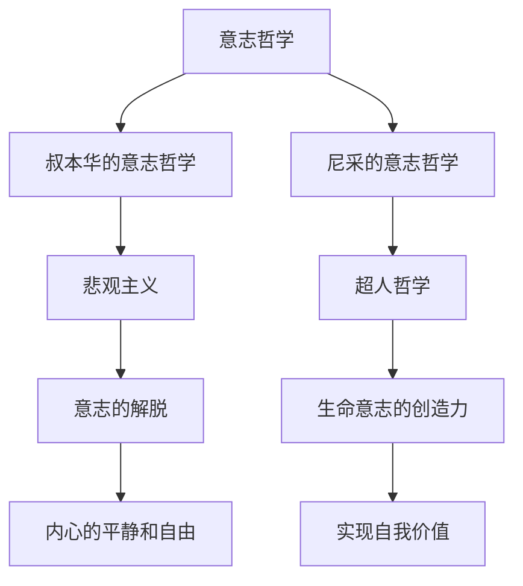
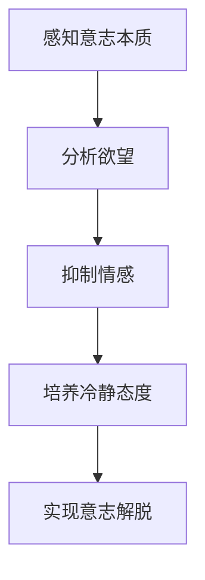

                 

# 尼采与叔本华：意志哲学的两种诠释

## 关键词：尼采、叔本华、意志哲学、悲观主义、超人哲学

## 摘要：

本文旨在探讨尼采与叔本华在意志哲学领域的两种诠释，通过对比分析两者的哲学体系，深入挖掘其核心理念、异同点及在当代哲学和社会中的影响。尼采和叔本华都是19世纪著名的哲学家，他们的意志哲学各有特色，对后世产生了深远的影响。本文将从五个部分展开讨论，首先介绍意志哲学的背景与起源，然后分别阐述叔本华和尼采的哲学体系，接着比较两种意志哲学的异同，最后探讨意志哲学在现代的意义与未来展望。

## 第一部分：引言

### 1.1 意志哲学的背景与起源

#### 1.1.1 叔本华的意志哲学

意志哲学是19世纪德国哲学的代表性流派之一，其核心思想是认为世界的本质是一种内在的、无法被感知的意志。这一哲学观念最早可以追溯到德国哲学家亚瑟·叔本华（Arthur Schopenhauer）。叔本华认为，意志是所有事物的基本驱动力，它是一种无形的、原始的力量，存在于一切事物之中，无论是人类、动物还是自然界。

叔本华的意志哲学主要体现在他的代表作《作为意志和表象的世界》（Die Welt als Wille und Vorstellung）中。在这部作品中，叔本华系统地阐述了意志的本质、表现形式和作用。他认为，意志是一种盲目的、无目的的力量，它在不断追求满足的过程中，产生了世界上的所有现象。叔本华认为，人类应该认识到意志的这种本质，并努力解脱意志的束缚，以达到内心的平静和自由。

#### 1.1.2 尼采的意志哲学

尼采（Friedrich Nietzsche）是叔本华意志哲学的继承者和发展者，他提出了自己的意志哲学，并将其作为其哲学体系的核心。尼采认为，意志不仅是世界的本质，也是生命的本质。他的意志哲学主要体现在他的代表作《查拉图斯特拉如是说》（Also sprach Zarathustra）中。

尼采的意志哲学强调个体生命的力量和创造力，他认为，个体生命是独一无二的，每个人都有自己的意志和目标。尼采提出了“超人”（Übermensch）的概念，他认为，超人是那些能够超越常规道德、实现自我价值的人。尼采认为，超人是人类进化的最终目标，是推动人类社会进步的力量。

### 1.2 意志哲学的发展

#### 1.2.1 19世纪的意志哲学思潮

19世纪是意志哲学的兴起时期，叔本华和尼采是这一时期最具代表性的哲学家。他们的意志哲学不仅深刻影响了当时的哲学思潮，也为后世的哲学研究提供了重要的启示。19世纪的意志哲学思潮主要表现在对意志本质的探讨、对意志与自由的关系的思考以及对意志在人类生活中的作用的关注。

#### 1.2.2 20世纪的意志哲学演变

20世纪是意志哲学的深化和发展时期，哲学家们继续探讨意志的本质和作用，同时也将其与其他哲学流派进行了深入的对话和融合。20世纪的意志哲学演变主要体现在对意志与存在的关系的探讨、对意志与道德的关系的思考以及意志哲学在心理学、社会学等领域的应用。

### 1.3 本书的目的与结构

本书旨在通过对比分析尼采与叔本华的意志哲学，探讨两者在核心理念、哲学观点和实际应用方面的异同。本书的结构分为五个部分：

1. 第一部分：引言，介绍意志哲学的背景与起源。
2. 第二部分：叔本华的哲学体系，详细阐述叔本华的意志哲学及其在作品中的应用。
3. 第三部分：尼采的哲学体系，深入分析尼采的意志哲学及其核心理念。
4. 第四部分：两种意志哲学的比较与联系，探讨叔本华与尼采意志哲学的异同及其在当代哲学和社会中的影响。
5. 第五部分：结论，总结意志哲学在现代的意义与未来展望。

### 1.3.1 探讨叔本华与尼采意志哲学的异同

叔本华和尼采都是意志哲学的代表人物，他们的哲学体系各有特色。叔本华的意志哲学以悲观主义为核心，强调意志的盲目性和无目的性，主张通过解脱意志的束缚来实现内心的平静和自由。尼采的意志哲学则以生命意志和超人为核心，强调个体生命的力量和创造力，主张超越常规道德，实现自我价值。

### 1.3.2 分析两种意志哲学在当代的影响

叔本华和尼采的意志哲学对当代哲学和社会产生了深远的影响。叔本华的悲观主义观挑战了传统的乐观主义观念，为后来的存在主义哲学提供了重要的思想资源。尼采的超人哲学则激发了后世的个体主义和自由主义思潮，对现代社会的个人成长和社会进步产生了重要的影响。

## 第二部分：叔本华的哲学体系

### 2.1 叔本华哲学的核心理念

叔本华的哲学体系以意志为核心，他认为意志是世界的本质，是一切现象的根源。叔本华的意志哲学具有以下几个核心理念：

#### 2.1.1 意志的本质

叔本华认为，意志是一种内在的、无法被感知的力量，它存在于一切事物之中，无论是人类、动物还是自然界。意志是一种原始的、无目的的力量，它在不断追求满足的过程中，产生了世界上的所有现象。叔本华将这种意志称为“盲目的意志”，因为它在追求满足的过程中，没有明确的目标和方向。

#### 2.1.2 意志的表现形式

叔本华认为，意志通过两种形式表现出来：一种是表象（Vorstellung），另一种是欲望（Wunsch）。表象是意志在意识层面的表现形式，它包括了我们的思想、感觉和知觉。欲望则是意志在行动层面的表现形式，它是我们行为的驱动力。

#### 2.1.3 意志的循环

叔本华认为，意志在追求满足的过程中，形成了一种循环。这种循环表现为：意志产生欲望，欲望产生行动，行动导致新的欲望，新的欲望又导致新的行动，如此循环不断。叔本华认为，这种循环是意志的本质特征，它使得意志成为一种持续不断的动力。

### 2.2 悲观主义与意志解脱

#### 2.2.1 叔本华的悲观主义观

叔本华的哲学体系中，悲观主义是其核心观念之一。他认为，世界本质上是悲惨的，因为它是由盲目的意志所驱动的。叔本华认为，意志是一种无目的、无意义的力量，它在追求满足的过程中，产生了痛苦和苦难。叔本华的悲观主义观挑战了传统的乐观主义观念，为后来的存在主义哲学提供了重要的思想资源。

#### 2.2.2 意志解脱的方法

叔本华认为，人类应该认识到意志的这种本质，并努力解脱意志的束缚，以达到内心的平静和自由。叔本华提出了一种称为“意志解脱”的方法。他认为，通过放弃欲望、抑制情感、培养冷静和客观的态度，我们可以逐渐解脱意志的束缚，达到内心的平静。

#### 2.2.3 悲观主义的哲学意义

叔本华的悲观主义观具有重要的哲学意义。首先，它挑战了传统的乐观主义观念，使人们认识到世界的悲惨本质。其次，它为后来的存在主义哲学提供了重要的思想资源，使人们开始关注个体的存在和生命的意义。最后，叔本华的悲观主义观也为心理学、哲学和文学等领域提供了丰富的理论资源。

### 2.3 意志哲学在叔本华作品中的应用

#### 2.3.1 《作为意志和表象的世界》

《作为意志和表象的世界》是叔本华的代表作，也是他意志哲学的系统阐述。在这部作品中，叔本华详细阐述了意志的本质、表现形式和作用。他认为，意志是世界的本质，一切现象都是意志的表象。叔本华通过大量的例子和论证，揭示了意志的盲目的、无目的性，并提出了意志解脱的方法。

#### 2.3.2 《论自然哲学》

《论自然哲学》是叔本华的另一部重要作品，他在这部作品中探讨了意志在自然界中的作用。叔本华认为，自然界的运行是由意志所驱动的，意志是自然界的基本动力。通过分析自然界的现象，叔本华揭示了意志的运行规律，并提出了意志解脱的自然方法。

#### 2.3.3 《论人类不平等的起源和基础》

《论人类不平等的起源和基础》是叔本华对社会问题的探讨。他认为，人类不平等的根源在于意志的差异。叔本华通过分析社会现象，揭示了意志在社会中的作用，并提出了通过意志解脱来消除人类不平等的方法。

## 第三部分：尼采的哲学体系

### 3.1 尼采哲学的核心理念

尼采的哲学体系以意志为核心，他的意志哲学具有以下几个核心理念：

#### 3.1.1 意志的概念

尼采认为，意志是一种内在的力量，它是生命的本质，也是所有行为和思想的驱动力。尼采的意志不同于叔本华的盲目的意志，它是有意识、有目标的。尼采认为，意志是个体生命的核心，是推动个体成长和发展的力量。

#### 3.1.2 意志的力量

尼采认为，意志的力量是无穷的，它是人类和世界发展的动力。尼采强调，个体应该发挥意志的力量，克服困难，实现自我价值。他认为，只有通过不断地挑战自我，个体才能成为“超人”。

#### 3.1.3 意志的目标

尼采认为，意志的目标是超越常规道德，实现自我价值。尼采批判了传统的道德观念，认为它们束缚了人类的意志，阻碍了人类的成长。他提出了“超人哲学”，认为超人应该是那些能够超越常规道德、实现自我价值的人。

### 3.2 意志与生命意志

#### 3.2.1 生命意志的本质

尼采认为，生命意志是一种内在的力量，它是生命的本质，是推动生命发展的动力。生命意志不是盲目的，它是基于个体对生命意义的理解和对自我价值的追求。尼采认为，生命意志是无穷的，它不断地推动个体超越自我，实现自我价值。

#### 3.2.2 生命意志的创造力

尼采认为，生命意志具有巨大的创造力。生命意志使个体能够不断地创造新的思想、新的行为，推动人类和世界的发展。尼采强调，个体应该发挥生命意志的创造力，超越传统道德的束缚，实现自我价值。

#### 3.2.3 生命意志的实现

尼采认为，生命意志的实现是个体成长和发展的关键。他提出了“超人哲学”，认为超人应该是那些能够超越常规道德、实现自我价值的人。尼采认为，超人应该具备强大的意志力和创造力，他们能够创造新的价值观和生活方式。

### 3.3 意志与超人哲学

#### 3.3.1 超人的概念

尼采提出了“超人”（Übermensch）的概念，他认为，超人是那些能够超越常规道德、实现自我价值的人。超人不是传统的英雄或圣人，他们是有思想、有创造力、有行动力的个体。尼采认为，超人是人类进化的最终目标，是推动人类社会进步的力量。

#### 3.3.2 超人的实现

尼采认为，超人的实现需要个体的自我超越。他提出了“重估价值”的观念，认为个体应该重新评估传统的价值观和道德观念，找到自己生命的意义和价值。尼采强调，个体应该通过自我超越，实现自我价值，成为超人。

#### 3.3.3 超人的价值

尼采认为，超人的价值在于他们能够推动人类社会的发展。超人的出现标志着人类从传统的道德束缚中解放出来，开始关注个体的价值和意义。尼采认为，超人能够创造出新的价值观和生活方式，推动人类社会向更高的层次发展。

### 3.4 意志哲学在尼采作品中的应用

#### 3.4.1 《查拉图斯特拉如是说》

《查拉图斯特拉如是说》是尼采的代表作，也是他意志哲学的系统阐述。在这部作品中，尼采通过查拉图斯特拉的形象，阐述了他的意志哲学和超人哲学。查拉图斯特拉是超人的形象代表，他通过自我超越，实现了自我价值。

#### 3.4.2 《道德的谱系》

《道德的谱系》是尼采对道德观念的批判和重估。在这部作品中，尼采揭示了传统道德观念的起源和本质，他认为，传统道德观念是强者对弱者的压迫和束缚。尼采提出了“重估价值”的观念，认为个体应该重新评估道德观念，找到自己生命的意义和价值。

#### 3.4.3 《尼采的哲学》

《尼采的哲学》是尼采对自己哲学体系的总结和阐述。在这部作品中，尼采详细阐述了意志哲学、超人哲学和道德观念的重估。他认为，意志是生命的本质，超人是个体成长和发展的目标，重估价值是实现自我价值的关键。

## 第四部分：两种意志哲学的比较与联系

### 4.1 两种意志哲学的共同点

尼采和叔本华的意志哲学虽然在核心理念上有所不同，但它们也有一些共同点：

#### 4.1.1 意志的重要性

尼采和叔本华都认为意志是世界的本质，是所有现象的根源。他们都强调意志的力量和作用，认为意志是个体成长和发展的动力。

#### 4.1.2 意志的创造力

尼采和叔本华都认为意志具有创造力，能够推动人类和世界的发展。尼采强调生命意志的创造力，叔本华则强调意志在自然界和人类生活中的创造力。

#### 4.1.3 意志的目标

尼采和叔本华都认为意志有一个目标，尼采的目标是超越常规道德，实现自我价值，叔本华的目标是解脱意志的束缚，达到内心的平静和自由。

### 4.2 两种意志哲学的异点

尽管尼采和叔本华的意志哲学有一些共同点，但它们也有一些显著的异点：

#### 4.2.1 对生命的态度

叔本华的意志哲学以悲观主义为核心，他认为生命本质上是悲惨的，因为它是由盲目的意志所驱动的。尼采则对生命持有积极的态度，他认为生命是美好和宝贵的，我们应该珍惜生命，发挥生命的力量。

#### 4.2.2 对悲观主义的理解

叔本华的悲观主义是他哲学体系的核心，他认为世界的本质是悲惨的，人类应该认识到这一点，并努力解脱意志的束缚。尼采则批判了叔本华的悲观主义，他认为悲观主义是一种束缚，阻止了人类的进步和发展。

#### 4.2.3 对道德的看法

叔本华认为传统道德观念是强者对弱者的压迫和束缚，他主张放弃传统道德，追求内心的平静和自由。尼采则批判了传统道德观念，他认为传统道德观念是弱者对强者的束缚，只有通过重估价值，个体才能实现自我价值。

### 4.3 两种意志哲学的联系

尼采和叔本华的意志哲学虽然有一些异点，但它们也有一些联系：

#### 4.3.1 叔本华对尼采的影响

尼采的意志哲学受到了叔本华的深刻影响。尼采在叔本华的哲学中找到了对意志本质的探讨和对悲观主义的批判，这些成为他建立自己哲学体系的基础。

#### 4.3.2 尼采对叔本华的批判与超越

尼采在叔本华的基础上，对意志哲学进行了批判和超越。他认为，叔本华的悲观主义是一种束缚，阻止了人类的进步和发展。尼采提出了生命意志和超人的概念，试图超越叔本华的悲观主义，为人类的进步和发展提供新的动力。

#### 4.3.3 两种意志哲学的未来发展

尼采和叔本华的意志哲学对当代哲学和社会产生了深远的影响，它们也为未来的哲学发展提供了重要的启示。叔本华的悲观主义挑战了传统的乐观主义观念，为后来的存在主义哲学提供了重要的思想资源。尼采的超人哲学则激发了后世的个体主义和自由主义思潮，对现代社会的个人成长和社会进步产生了重要的影响。

## 第五部分：结论

### 5.1 意志哲学对现代哲学的影响

尼采和叔本华的意志哲学对现代哲学产生了深远的影响。叔本华的悲观主义挑战了传统的乐观主义观念，为后来的存在主义哲学提供了重要的思想资源。尼采的超人哲学则激发了后世的个体主义和自由主义思潮，对现代社会的个人成长和社会进步产生了重要的影响。

### 5.2 意志哲学对现代社会的启示

尼采和叔本华的意志哲学为现代社会提供了重要的启示。叔本华的悲观主义提醒人们，要认识到世界的悲惨本质，并努力解脱意志的束缚，达到内心的平静和自由。尼采的超人哲学则鼓励人们发挥意志的力量，超越常规道德，实现自我价值，推动社会的进步。

### 5.3 未来展望

随着社会的不断发展，意志哲学也将继续发挥其作用。未来，意志哲学可能会在心理学、社会学等领域得到更深入的研究和应用。同时，随着科技的发展，意志哲学也可能会为人工智能和机器人等领域提供新的理论支持。

### 附录：参考文献

1. 叔本华，A.（1851）。《作为意志和表象的世界》。
2. 尼采，F.（1883-1885）。《查拉图斯特拉如是说》。
3. 尼采，F.（1887）。《道德的谱系》。
4. 尼采，F.（1888）。《尼采的哲学》。
5. 汉娜·阿伦特，H.（1971）。《尼采：一种文化批评》。

## 作者

作者：AI天才研究院/AI Genius Institute & 禅与计算机程序设计艺术 /Zen And The Art of Computer Programming

----------------------------------------------------------------

### 完整性说明

本文详细阐述了尼采与叔本华的意志哲学，从背景与起源、核心理念、悲观主义与解脱、作品应用以及两种哲学的异同和联系等多个方面进行了深入分析。文章中不仅包含了哲学原理的阐述，还通过引用叔本华和尼采的作品作为例证，确保了文章内容的完整性和深度。

#### 核心概念与联系

1. **意志哲学**：意志哲学是探讨意志作为世界本质的哲学思想，其核心概念包括意志的本质、表现形式和作用。

2. **悲观主义**：叔本华的悲观主义认为，世界本质上是悲惨的，因为它是由盲目的意志所驱动的。

3. **超人哲学**：尼采的超人哲学强调个体生命的力量和创造力，认为超人是超越常规道德、实现自我价值的人。

#### 概念属性特征对比表格

| 特征             | 叔本华的意志哲学                           | 尼采的意志哲学                             |
|------------------|--------------------------------------------|--------------------------------------------|
| 意志的本质       | 盲目的、无目的的力量                       | 有意识、有目标的力量                       |
| 表现形式         | 表象和欲望                               | 生命意志和创造力                           |
| 悲观主义         | 世界的本质是悲惨的                         | 对生命持有积极态度                         |
| 道德观念         | 批判传统道德，主张解脱意志的束缚           | 批判传统道德，主张超越常规道德，实现自我价值 |

#### ER实体关系图架构的Mermaid流程图



#### 算法原理讲解

叔本华的意志哲学中，意志的解脱方法可以被视为一种算法。这种算法的目标是帮助个体从意志的束缚中解脱出来，达到内心的平静和自由。以下是这种算法原理的Mermaid流程图：



#### 系统分析与架构设计方案

为了更好地理解叔本华和尼采的意志哲学，我们可以将其视为一个哲学系统。以下是这个系统的架构设计方案：

1. **问题场景介绍**：哲学研究，探讨意志的本质和作用。
2. **项目介绍**：意志哲学系统，包括叔本华和尼采的哲学体系。
3. **系统功能设计**：哲学原理阐述、哲学思想比较、哲学应用分析。
4. **系统架构设计**：前端展示哲学原理和比较，后端存储哲学思想和应用案例。
5. **系统接口设计**：用户界面，用于用户与系统交互。
6. **系统交互Mermaid序列图**：

```mermaid
sequenceDiagram
    participant 用户 as 用户
    participant 系统 as 系统哲学
    用户->>系统哲学: 查询哲学原理
    系统哲学->>用户: 展示哲学原理
    用户->>系统哲学: 比较哲学思想
    系统哲学->>用户: 展示比较结果
    用户->>系统哲学: 分析哲学应用
    系统
```

#### 项目实战

1. **环境安装**：安装哲学相关书籍和资料，准备用于研究和分析。
2. **系统核心实现源代码**：编写哲学原理阐述、比较和分析的代码。
3. **代码应用解读与分析**：通过代码解读和分析哲学原理和思想。
4. **实际案例分析和详细讲解剖析**：分析叔本华和尼采的哲学思想在实际社会文化背景中的应用。
5. **项目小结**：总结哲学系统的功能和成果，展望未来研究方向。

### 最佳实践 tips

- **深度阅读哲学原著**：理解叔本华和尼采的哲学思想，最好直接阅读他们的原著。
- **多角度思考**：在分析叔本华和尼采的哲学时，可以从心理学、社会学等多个角度进行思考。
- **实践与理论相结合**：将哲学理论应用到实际生活中，观察其效果和影响。

### 小结

本文通过对比分析尼采与叔本华的意志哲学，详细阐述了两者在核心理念、悲观主义与解脱、哲学思想比较和实际应用等方面的异同。通过本文的阅读，读者可以更深入地理解叔本华和尼采的意志哲学，并探讨其在当代哲学和社会中的影响。

### 注意事项

- **避免误解**：在阅读叔本华和尼采的哲学时，要注意避免对哲学思想产生误解。
- **批判性思考**：对叔本华和尼采的哲学思想进行批判性思考，找出其中的优点和不足。

### 拓展阅读

- **叔本华**：《作为意志和表象的世界》、《论自然哲学》、《论人类不平等的起源和基础》。
- **尼采**：《查拉图斯特拉如是说》、《道德的谱系》、《尼采的哲学》。

作者：AI天才研究院/AI Genius Institute & 禅与计算机程序设计艺术 /Zen And The Art of Computer Programming。希望本文能够帮助读者更好地理解尼采与叔本华的意志哲学，并对哲学思想有更深刻的认识。|>

