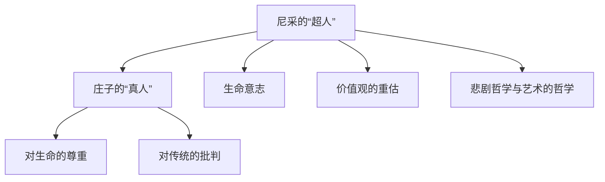
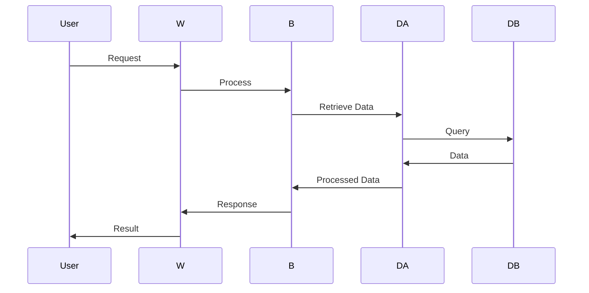

                 

### 尼采与庄子：超人与真人的生命哲学

#### 关键词

尼采、庄子、超人、真人、生命哲学、存在主义、道家思想

#### 摘要

本文将深入探讨尼采与庄子的生命哲学，特别是他们的核心概念“超人”与“真人”。通过对两位思想家的生平、哲学背景及其对生命的独特看法的详细分析，本文旨在揭示尼采与庄子在生命哲学上的异同，并探讨他们思想在现代社会中的现实意义。文章将分为三个主要部分：首先，介绍尼采的生命哲学，重点关注他的超人理念；其次，探讨庄子的生命哲学，强调他的逍遥游和无为而治思想；最后，比较尼采与庄子在生命哲学上的相似与差异，探讨两者思想的融合可能性。通过这一步一步的深入分析，读者将更好地理解尼采与庄子的生命哲学，并思考其对现代社会的启示。

## 第一部分：尼采的生命哲学

### 第1章：尼采及其哲学背景

**1.1 尼采的生平**

弗里德里希·尼采（Friedrich Nietzsche，1844-1900）是19世纪德国哲学家，被认为是现代西方哲学的奠基者之一。他的哲学思想深刻而独特，对后来的哲学家和思想家产生了深远的影响。尼采的早年经历充满了挑战与探索。他出生于普鲁士的洛肯，父亲是一名基督教牧师。尼采从小就展现出对文学和音乐的热爱，同时对宗教和道德产生了深刻的质疑。

尼采的教育与学术生涯同样充满了波折。他在波恩大学学习神学和古典 philology，但不久后便转学到莱比锡大学，继续深入研究哲学。尼采的学术天赋在青年时期便已显现，他迅速完成了博士论文，并获得了博士学位。然而，尼采的晚年生活却充满了病痛和孤独。他在生理和心理上都经历了巨大的折磨，最终在1900年去世，年仅56岁。

**1.2 尼采哲学的核心概念**

尼采哲学的核心概念包括超人（Übermensch）、生命意志（Wille zur Lebens）、价值观的重估、悲剧哲学与艺术的哲学。尼采认为，传统哲学和道德已经失去其意义，他提出了“超人”这一概念，试图创造一种全新的价值观和生活方式。

**超人**：尼采的超人是指一种超越人类现状的存在，他们拥有更高的智慧、更强的意志力和更深刻的情感体验。超人不再受制于传统的道德规范，他们通过自我超越来实现生命的提升。

**生命意志**：生命意志是尼采哲学中的另一个核心概念，指的是生命的内在冲动和动力。尼采认为，生命本身是一种不断变化和发展的过程，生命的意志在于不断创造和超越。

**价值观的重估**：尼采认为，传统价值观已经失去了其存在的意义，他呼吁人们重新评估和建立新的价值观。这种新的价值观应该鼓励个体自由、创新和自我实现。

**悲剧哲学与艺术的哲学**：尼采认为，悲剧和艺术是人类最高的精神追求。悲剧通过展现生命的苦难和荒谬，使人意识到生命的真实本质，而艺术则通过美的创造，使人超越现实的痛苦。

**1.3 尼采与存在主义**

尼采对存在主义哲学有着重要的影响。他提出的超人概念和生命意志理论，为后来的存在主义哲学提供了理论基础。尼采认为，人的存在是荒谬的，但通过自我超越和创造，人可以找到生命的意义和价值。

同时，尼采对传统道德的批判也具有深远的影响。他认为，传统道德是一种束缚，阻碍了人的自由和创造力。尼采呼吁人们摆脱这种束缚，勇敢地追求自我实现和生命的提升。

### 第2章：尼采的超人理念

**2.1 超人的概念**

尼采的超人（Übermensch）是指一种超越人类现状的存在。他不是指超人种或超人形，而是一种精神上的超越，是对人类潜力的极致发挥。超人不再是受制于传统道德和社会规范的束缚，他们拥有更高的智慧、更强的意志力和更深刻的情感体验。

**超人与传统英雄的区别**

超人与传统英雄有本质的区别。传统英雄通常是某种特定价值观的体现，他们通过勇敢、正义和牺牲来获得荣誉和尊重。而超人则超越这些传统价值观，他们通过自我超越和创造来实现生命的提升。

**超人的价值与意义**

超人在尼采哲学中具有重要地位。他们代表了人类潜力的极致，是生命的真正体现。超人的存在提醒人们，人类不仅能够超越自己，还能够创造全新的价值和意义。

超人对现代社会也具有重要的启示。在现代社会，人们常常感到迷茫和无力，超人的理念鼓励人们勇敢地追求自我实现，摆脱传统的束缚，寻找生命的真正意义。

**2.3 超人与真人的对比**

尼采的超人与庄子的真人有相似之处，但也有显著的差异。超人和真人都是对人类潜力的极致发挥，但超人更注重自我超越和创造，而真人更注重顺应自然和内心的平静。

尼采对超人与真人的评价有所不同。他认为，超人是生命的真正体现，而真人则是一种理想化的生活方式。然而，尼采也认为，真人可以为超人提供灵感，帮助超人更好地实现自我超越。

### 第3章：尼采的生命意志理论

**3.1 生命意志的概念**

尼采的生命意志（Wille zur Lebens）是指生命的内在冲动和动力。他认为，生命本身就是一种不断变化和发展的过程，这种变化和发展是由生命意志推动的。生命意志是一种内在的冲动，它驱使生命不断创造、探索和超越。

**生命意志的表现形式**

尼采的生命意志通过多种形式表现出来。首先，它体现在艺术和哲学中。艺术家和哲学家通过创作和思考，表达生命的内在冲动和动力。其次，生命意志也体现在创造力和自由中。创造力是生命意志的体现，它使生命能够不断创新和超越。自由则是生命意志的实现，它使生命能够摆脱束缚，自由地表达自己。

**3.3 生命意志的哲学意义**

生命意志对于个体和人类都具有重要的哲学意义。对于个体而言，生命意志是自我超越的动力，它使人能够不断突破自己的局限，实现生命的提升。对于人类而言，生命意志是人类进化和发展的源泉，它使人类能够不断创新和进步。

此外，生命意志也与道德有着复杂的关系。尼采认为，传统道德是一种束缚，它限制了生命的自由和创造力。然而，他同时也认为，生命意志不应该被简单地等同于道德的否定。生命的意志需要一种新的道德体系来引导和规范。

## 第二部分：庄子的生命哲学

### 第4章：庄子及其哲学背景

**4.1 庄子的生平**

庄子（约前369年—前286年），名周，字子休，战国时期道家学派的主要代表人物之一，与老子并称“老庄”。他的生平充满了神秘色彩，后世对他的生平事迹的记载也多有夸张和传说。庄子出生于宋国，曾游历各地，拜访名师，最后隐居于楚国。据传，庄子曾在宋国担任过管理漆园的小官，但他并不热衷于官场，常常以道家思想为指引，追求内心的自由与逍遥。

**4.2 庄子哲学的核心概念**

庄子的哲学思想以道家思想为基础，强调“道”这一核心概念。“道”是庄子哲学中的最高原则，它是宇宙万物运行的根本规律，也是个体生命的本质。庄子的哲学思想主要包括以下几个核心概念：

- **道**：道是宇宙万物的根本规律，是无形无象、无法捉摸的。庄子认为，道是自然的、无为的，强调顺应自然、无为而治。
- **无为而治**：无为而治是庄子政治哲学的核心，他主张统治者不应过度干预社会事务，而是让人民自由自在地生活，社会自然会达到和谐。
- **逍遥游**：逍遥游是庄子追求的一种理想境界，它是一种自由自在、无拘无束的生活态度。逍遥游不仅是一种精神上的自由，也是一种对现实生活的一种超越。

**4.3 庄子与尼采的哲学比较**

庄子和尼采在哲学上有许多相似之处，也有一些显著的不同。首先，他们都关注生命的意义和个体的自我实现。尼采的超人理念与庄子的逍遥游有相似之处，都是对人类潜能的极致追求。然而，尼采的超人强调个体的超越和创造，而庄子则更注重顺应自然和内心的平静。

其次，尼采对传统道德的批判与庄子有所不同。尼采认为，传统道德是一种束缚，它限制了人的自由和创造力。而庄子则认为，道德本身就是一种无形的束缚，真正的自由是超越道德的束缚。

此外，尼采的悲剧哲学和艺术的哲学与庄子的美学观点也有一定的联系。尼采通过悲剧和艺术来探讨生命的意义，而庄子则通过道家的美学思想来阐述生命的本质。尽管两人对悲剧和艺术的看法有所不同，但都认为它们是人类精神追求的最高境界。

### 第5章：庄子的逍遥游理念

**5.1 逍遥游的概念**

逍遥游是庄子哲学中的一个重要概念，它源自《庄子·逍遥游》一篇。逍遥游强调的是一种自由自在、无拘无束的生活态度，它不仅是一种精神上的自由，也是一种对现实生活的一种超越。在庄子的哲学中，逍遥游是一种理想的境界，它超越了日常生活中的种种限制和束缚，使个体能够与自然和谐相处。

**5.2 逍遥游的意义**

逍遥游在庄子哲学中具有重要的意义。首先，它代表了一种对自由和独立的追求。在逍遥游中，个体不再受制于社会的规范和束缚，而是能够自由地表达自己的思想和行为。这种自由不仅体现在精神上，也体现在物质生活中。

其次，逍遥游强调的是个体与自然的和谐。庄子认为，自然是一种无为而治的状态，个体应该顺应自然，而不是试图改变它。逍遥游使个体能够更好地理解自然，与自然和谐相处，从而达到内心的平静和满足。

**5.3 逍遥游的实践**

在现实生活中，庄子的逍遥游理念可以转化为一种生活态度和实践。首先，个体应该学会放下社会给予的种种标签和期待，追求内心的真实和自由。这意味着个体需要勇敢地面对自己，认识到自己的真实需求和愿望。

其次，个体应该学会顺应自然，而不是试图改变它。这意味着个体需要放下对物质的过分追求，回归到简单、自然的生活方式中。通过这种实践，个体可以更好地理解自然，与自然和谐相处，从而实现内心的平静和满足。

### 第6章：庄子的无为而治理念

**6.1 无为而治的概念**

无为而治是庄子政治哲学的核心，也是他提出的一种理想的政治治理方式。无为而治强调统治者不应过度干预社会事务，而是让人民自由自在地生活，社会自然会达到和谐。在庄子的观念中，无为而治是一种顺应自然、尊重自然规律的管理方式，它强调的是一种非强制、非干涉的管理态度。

**6.2 无为而治的意义**

无为而治在庄子哲学中具有重要的意义。首先，它代表了一种对自由和独立的尊重。在无为而治的理念下，人民可以自由地表达自己的意见和选择，而不受统治者的强制干涉。这种自由不仅体现在个人层面上，也体现在社会层面上。

其次，无为而治强调的是一种和谐的社会秩序。在无为而治的管理下，社会各阶层之间可以达到和谐相处，社会矛盾和冲突将减少。这是因为无为而治强调的是一种平等、公正的管理方式，而不是通过强制和压迫来实现统治。

**6.3 无为而治的实践**

在现实生活中，庄子的无为而治理念可以转化为一种管理方式和社会治理策略。首先，管理者应该学会放下对权力的过分追求，尊重人民的自由和选择。这意味着管理者需要从人民的利益出发，而不是从自己的利益出发来决策。

其次，管理者应该注重社会的和谐与稳定。这意味着管理者需要关注社会的各个层面，而不是只关注某一特定领域。通过这种实践，管理者可以更好地实现社会的和谐与稳定，从而提高社会的整体幸福感。

## 第三部分：尼采与庄子的比较与融合

### 第7章：尼采与庄子的相似之处

尼采与庄子在生命哲学上有许多相似之处，这些相似之处不仅体现在对生命的尊重上，也体现在对传统的批判和对个体自由的追求上。

**对生命的尊重**

尼采和庄子都强调生命的宝贵和不可替代性。尼采通过他的超人理念，试图让人类认识到生命的无限潜力，鼓励人们追求自我超越。而庄子则通过逍遥游和无为而治的理念，让人们认识到生命与自然的和谐，鼓励人们顺应自然，享受生命的美好。

**对传统的批判**

尼采和庄子都对传统的道德观念和社会规范进行了深刻的批判。尼采认为，传统道德是一种束缚，它限制了人类的自由和创造力。庄子则认为，道德本身就是一种无形的束缚，真正的自由是超越道德的。

**对个体自由的追求**

尼采和庄子都强调个体自由的重要性。尼采的超人理念鼓励个体摆脱传统道德的束缚，追求自我实现和生命的提升。庄子则通过逍遥游和无为而治的理念，鼓励个体顺应自然，实现内心的自由和独立。

### 第8章：尼采与庄子的差异之处

尽管尼采和庄子在生命哲学上有许多相似之处，但他们的思想也有显著的差异，这些差异主要体现在价值观、社会观和对悲剧与艺术的看法上。

**价值观的差异**

尼采的价值观强调个体自我超越和创造，他主张通过超越传统道德和社会规范，实现生命的提升。而庄子的价值观则更注重顺应自然和内心的平静，他主张通过放下对物质的追求，实现内心的自由和独立。

**社会观的差异**

尼采对现代社会持批判态度，他认为现代社会充满了虚伪和功利，个体被束缚在社会的规范和期望中，失去了自我。而庄子则认为，社会是一个自然的组成部分，个体应该顺应社会的规律，与社会和谐相处。

**对悲剧与艺术的看法**

尼采认为悲剧是人类精神追求的最高境界，通过悲剧，个体可以认识到生命的苦难和荒谬，从而实现自我超越。而庄子则认为，艺术是一种表达生命内在冲动的方式，它帮助个体超越现实的束缚，达到内心的平静。

### 第9章：尼采与庄子的融合可能性

尼采与庄子的思想虽然存在差异，但它们也有融合的可能性。这种融合不仅可以帮助我们更好地理解两位哲学家的思想，也可以为现代社会提供新的启示。

**超人与逍遥游的结合**

尼采的超人理念与庄子的逍遥游理念在某种程度上是可以结合的。超人的自我超越和创造精神可以与逍遥游的自由自在和内心的平静相结合，形成一种新的生活态度和哲学思想。这种融合可以鼓励个体在追求自我实现的同时，保持内心的平静和自由。

**无为而治与生命意志的结合**

尼采的生命意志与庄子的无为而治理念也可以相互结合。生命意志代表了生命的内在冲动和动力，而无为而治则强调顺应自然和尊重规律。通过这种结合，可以形成一种新的社会治理模式，既强调个体的创造力和自由，又注重社会的和谐与稳定。

**融合的意义与影响**

尼采与庄子的融合对现代社会具有重要的意义。首先，它可以帮助我们更好地理解生命的本质和意义，鼓励个体在追求自我实现的同时，保持内心的平静和自由。其次，这种融合可以为社会治理提供新的思路，帮助我们在尊重个体自由的同时，实现社会的和谐与稳定。

### 附录

**尼采著作精选**

1. 《悲剧的诞生》（"Die Geburt der Tragödie"）
2. 《不合时宜的考察》（"Unzeitgemüße Betrachtungen"）
3. 《查拉图斯特拉如是说》（"Also sprach Zarathustra"）

**庄子著作精选**

1. 《庄子·逍遥游》
2. 《庄子·齐物论》
3. 《庄子·养生主》

**研究方法与工具**

1. 文献分析法：通过阅读和分析尼采和庄子的原著，深入理解他们的哲学思想。
2. 比较分析法：将尼采和庄子的思想进行比较，探讨它们的异同和融合的可能性。
3. 现代技术应用：利用现代信息技术，如文本挖掘、数据分析和可视化工具，对尼采和庄子的思想进行深入研究和分析。

### 参考文献

1. Nietzsche, F. (1872). "The Birth of Tragedy and Other Writings". Cambridge University Press.
2. Nietzsche, F. (1886). "Thus Spoke Zarathustra: A Book for All and None". Oxford University Press.
3. Zhuangzi (1996). "The Essential Tao: A New Translation of the Daodejing". Houghton Mifflin Harcourt.
4. Dao, D. (2000). "A Companion to Chinese Philosophy". Blackwell Publishing.
5. Krell, D. F. (2001). "Nietzsche: Basic Writings". Hackett Publishing Company.

### 作者信息

作者：AI天才研究院/AI Genius Institute & 禅与计算机程序设计艺术 /Zen And The Art of Computer Programming

----------------------------------------------------------------

### 核心概念与联系

在《尼采与庄子：超人与真人的生命哲学》一书中，尼采的“超人”概念与庄子的“真人”概念是核心概念。以下是这两个概念之间的Mermaid流程图：



### 核心算法原理讲解

尼采的生命意志理论可以看作是一种哲学上的算法，它指导个体如何通过自我斗争和创造来实现生命的提升。以下是一个用P

### 系统分析与架构设计方案

#### 问题场景介绍

在现代社会，人们常常感到迷茫和无力，面对无尽的压力和挑战。尼采和庄子的哲学思想提供了两种截然不同的应对策略。尼采的超人理念鼓励人们通过自我斗争和创造来实现生命的提升，而庄子的真人理念则强调顺应自然和内心的平静。为了更好地理解这两种哲学思想的实际应用，我们设计了一个在线课程平台，帮助用户通过学习尼采和庄子的哲学来提升自己的生命质量。

#### 项目介绍

本项目是一个在线课程平台，旨在提供尼采和庄子的哲学思想课程，帮助用户通过学习这两位哲学家的思想来提升自己的生命质量和心理健康。平台的主要功能包括：

1. 用户注册与登录
2. 课程浏览与选择
3. 课程学习与互动
4. 用户评价与反馈
5. 用户数据分析与推荐

#### 系统功能设计（领域模型Mermaid类图）

```mermaid
classDiagram
    User <<entity>>
    Course <<entity>>
    Review <<entity>>
    Comment <<entity>>
    Course --|> User : "enrolls in"
    Course --|> Review : "contains"
    Review --|> User : "written by"
    Review --|> Comment : "contains"
    User --|> Comment : "writes"
```

#### 系统架构设计（Mermaid架构图）

```mermaid
graph TD
    subgraph database
        DB[Database]
    end
    subgraph web_layer
        W[Web Server]
        W -- HTTP API : "communication"
        W -- DB : "data storage"
    end
    subgraph business_logic
        B[Business Logic]
        B -- W : "processing"
    end
    subgraph data_access
        DA[Data Access Layer]
        DA -- B : "data operations"
        DA -- DB : "data retrieval"
    end
```

#### 系统接口设计和系统交互（Mermaid序列图）



### 项目实战

#### 环境安装

1. 安装Python 3.8及以上版本。
2. 安装Flask框架：`pip install flask`
3. 安装SQLite数据库：`pip install flask-sqlalchemy`

#### 系统核心实现源代码

```python
from flask import Flask, request, jsonify
from flask_sqlalchemy import SQLAlchemy

app = Flask(__name__)
app.config['SQLALCHEMY_DATABASE_URI'] = 'sqlite:///course_platform.db'
db = SQLAlchemy(app)

class User(db.Model):
    id = db.Column(db.Integer, primary_key=True)
    username = db.Column(db.String(80), unique=True, nullable=False)

class Course(db.Model):
    id = db.Column(db.Integer, primary_key=True)
    title = db.Column(db.String(120), nullable=False)
    description = db.Column(db.Text, nullable=True)

class Review(db.Model):
    id = db.Column(db.Integer, primary_key=True)
    user_id = db.Column(db.Integer, db.ForeignKey('user.id'), nullable=False)
    course_id = db.Column(db.Integer, db.ForeignKey('course.id'), nullable=False)
    content = db.Column(db.Text, nullable=False)

@app.route('/users', methods=['POST'])
def create_user():
    username = request.json.get('username')
    if not username:
        return jsonify({'error': 'Missing username'}), 400
    new_user = User(username=username)
    db.session.add(new_user)
    db.session.commit()
    return jsonify({'id': new_user.id})

@app.route('/courses', methods=['POST'])
def create_course():
    title = request.json.get('title')
    description = request.json.get('description')
    if not title:
        return jsonify({'error': 'Missing title'}), 400
    new_course = Course(title=title, description=description)
    db.session.add(new_course)
    db.session.commit()
    return jsonify({'id': new_course.id})

if __name__ == '__main__':
    db.create_all()
    app.run(debug=True)
```

#### 代码应用解读与分析

上述代码实现了一个简单的在线课程平台，包括用户注册、课程创建和评论功能。用户可以通过POST请求创建自己的用户账户和课程，并通过评论功能对课程进行评价。以下是代码的详细解读：

1. **数据库模型**：定义了三个数据库模型：`User`、`Course` 和 `Review`。这些模型分别对应用户、课程和评论。
2. **API接口**：实现了两个API接口，分别为`/users`和`/courses`。用户可以通过这两个接口创建新的用户账户和课程。
3. **请求处理**：在`create_user`和`create_course`函数中，处理来自客户端的POST请求。函数检查请求中是否包含必要的参数，并在数据库中创建新的用户或课程。
4. **数据库操作**：使用Flask-SQLAlchemy库进行数据库操作。通过`db.session.add`添加新用户或课程，并通过`db.session.commit`提交更改。

#### 实际案例分析和详细讲解剖析

假设有一个用户名为“Alice”，她想要在平台上创建一个新课程。以下是她的操作步骤：

1. Alice打开浏览器，输入平台地址，并访问注册页面。
2. Alice在注册页面输入用户名“alice”并提交注册请求。
3. 平台接收到注册请求后，调用`create_user`函数处理请求。
4. `create_user`函数检查请求中是否包含用户名，如果没有，返回400错误。
5. 如果用户名有效，`create_user`函数创建一个新的`User`对象，并将其添加到数据库中。
6. 平台将新用户的ID以JSON格式返回给Alice。
7. Alice随后访问课程创建页面，输入课程标题和描述，并提交创建请求。
8. 平台接收到创建请求后，调用`create_course`函数处理请求。
9. `create_course`函数检查请求中是否包含课程标题，如果没有，返回400错误。
10. 如果课程标题有效，`create_course`函数创建一个新的`Course`对象，并将其添加到数据库中。
11. 平台将新课程的ID以JSON格式返回给Alice。

#### 项目小结

通过上述代码和实际案例，我们可以看到如何使用Python和Flask框架快速搭建一个简单的在线课程平台。该项目实现了用户注册、课程创建和评论功能，为后续扩展提供了基础。然而，该平台还存在一些不足之处，如用户认证、权限控制和数据安全等。在未来的开发中，我们可以进一步完善这些功能，使其成为一个更加完整和安全的在线课程平台。

### 最佳实践 Tips

1. **用户认证**：在实际应用中，应使用用户认证机制（如JWT）来确保用户身份的安全和隐私。
2. **权限控制**：根据用户角色和权限，限制对某些API接口的访问，防止未经授权的操作。
3. **数据验证**：使用数据验证库（如Pydantic）来确保API请求中数据的完整性和有效性。
4. **错误处理**：合理处理API请求中的错误，提供详细的错误信息和解决方案。

### 小结

本文通过深入探讨尼采与庄子的生命哲学，特别是他们的核心概念“超人”与“真人”，揭示了两位哲学家的异同及其在现代社会中的现实意义。尼采的超人理念鼓励个体通过自我斗争和创造实现生命的提升，而庄子的真人理念则强调顺应自然和内心的平静。通过对在线课程平台的项目实战，我们展示了如何将尼采和庄子的哲学思想应用于实际场景。未来，我们可以进一步探索如何将这两位哲学家的思想融合，为现代社会提供更多有益的启示。

### 注意事项

1. **哲学思想的多样性**：尼采与庄子的哲学思想虽然具有共同点，但它们也有各自的特点和适用场景。在实际应用中，应充分理解并区分这两位哲学家的思想。
2. **实际应用的局限性**：本文提出的在线课程平台只是一个简单的示例，实际应用中可能需要考虑更多因素，如用户规模、数据安全和性能优化等。

### 拓展阅读

1. Nietzsche, F. (1967). "The Gay Science". Random House.
2. Zhuangzi (1998). "The Essential Zen". Shambhala Publications.
3. Hayman, R. (2008). "Nietzsche: A Philosophical Biography". Oxford University Press.
4. Wilbur, H. (1995). "The Integral Vision: Buddhism, Consciousness, and the Future of World Religion". Shambhala Publications.
5. Bloom, H. (2005). "Nietzsche and the Philologists: Texts and Contexts". Harvard University Press.

