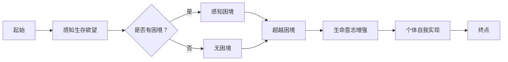
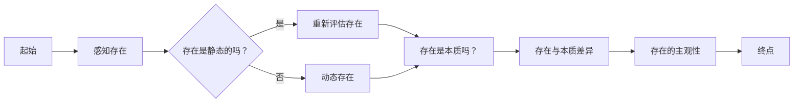
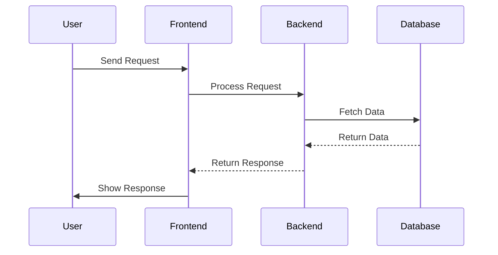

                 

### 尼采与海德格尔：形而上学批判的两种方式

**关键词：**尼采，海德格尔，形而上学批判，生命意志，存在主义，哲学思想

**摘要：**本文旨在探讨尼采与海德格尔两位哲学家在形而上学批判方面的独特贡献及其思想方法。尼采通过批判传统形而上学，提出了“生命意志”和“超越自我”的概念，强调个体自我实现的重要性。而海德格尔则通过存在主义，重新审视“存在”与“本质”的关系，挑战了传统哲学的基本前提。本文将从这两位哲学家的思想背景出发，逐步分析他们的批判方法和思想影响，最终总结两位哲学家的共同点与分歧，并对当代哲学的启示进行探讨。

## 第1章 引论

### 1.1 书籍背景与意义

《尼采与海德格尔：形而上学批判的两种方式》旨在深入探讨两位著名哲学家尼采和海德格尔在形而上学批判方面的贡献。尼采是19世纪末20世纪初的德国哲学家，他的思想对现代哲学、文学、艺术和心理学等领域产生了深远影响。海德格尔则是20世纪德国哲学的重要代表，他的存在主义思想在二战后成为西方哲学的主流之一。这本书通过对比两位哲学家的思想，旨在揭示他们在形而上学批判方面的不同路径和方法。

本书的意义在于，通过分析尼采和海德格尔的批判方法，我们不仅可以更好地理解这两位哲学家的思想，还能对当代哲学的发展方向产生启示。尼采和海德格尔都是对传统哲学进行深刻批判的哲学家，他们的思想为我们提供了一种重新审视和理解世界的视角。通过对比他们的批判方法，我们可以看到不同哲学路径在解决传统哲学问题上的优劣。

### 1.2 尼采的哲学思想概述

尼采的哲学思想主要围绕“生命意志”和“超越自我”两个核心概念展开。他认为，生命意志是一种超越理性和道德的内在驱动力，是生命本身的本质。尼采反对传统哲学中的理性主义和道德主义，认为它们限制了人的潜能和创造力。他提出了“超人”的概念，认为超人是一种超越现有道德和价值观的存在，能够创造新的价值观和生活方式。

尼采的哲学思想具有强烈的个体主义色彩，他强调个体自我实现的重要性。他认为，个体应该摆脱传统价值观的束缚，勇敢地追求自己的理想和欲望。尼采的思想对现代心理学、文学和艺术产生了深远影响，他的著作如《查拉图斯特拉如是说》、《悲剧的诞生》等都是哲学和文学的经典之作。

### 1.3 海德格尔的哲学思想概述

海德格尔的哲学思想以“存在”为核心概念，他的存在主义思想对现代哲学产生了深远影响。海德格尔认为，“存在”不仅仅是存在的状态，更是一种存在的本质。他批判传统哲学中的本质主义，强调存在的主观性和个体性。

海德格尔的哲学思想具有强烈的本体论色彩，他提出了“存在即存在”的观点，认为存在是哲学思考的起点。他强调，人类的存在是一种“在世存在”，即人类生活在世界之中，与世界相互关联。海德格尔的思想对后来的现象学、解释学和存在主义产生了重要影响，他的著作如《存在与时间》、《尼采》等都是哲学的杰作。

### 1.4 两位哲学家的对比与联系

尼采和海德格尔在形而上学批判方面有相似之处，他们都对传统哲学进行了深刻的批判，并提出了一种新的哲学视角。然而，他们在批判方法和思想内容上也有显著差异。

尼采的批判主要集中在理性主义和道德主义上，他认为这些传统观念限制了人的自由和创造力。尼采强调个体自我实现，提出了“超人”的概念，认为个体应该超越现有价值观，追求自己的理想。

海德格尔的批判则更深刻，他质疑了传统哲学的基本前提，如本质主义和存在主义。海德格尔强调存在的个体性和主观性，提出了“存在即存在”的观点，认为存在是哲学思考的起点。

尽管在批判方法和思想内容上有所不同，尼采和海德格尔的思想在某种程度上是相互联系的。尼采的思想对海德格尔有一定影响，而海德格尔的思想也在某种程度上回应了尼采的观点。通过对比他们的思想，我们可以看到两位哲学家在形而上学批判方面的贡献和局限性。

## 第2章 尼采的形而上学批判

### 2.1 尼采的哲学思想概述

尼采的哲学思想具有强烈的个体主义和存在主义色彩。他反对传统哲学中的理性主义和道德主义，认为这些观念限制了人的自由和创造力。尼采认为，生命意志是生命本身的本质，是推动个体自我实现和超越的力量。

尼采的思想可以概括为以下几点：

1. **生命意志：**尼采认为，生命意志是一种超越理性和道德的内在驱动力，是生命本身的本质。生命意志不仅仅是生存的欲望，更是一种追求无限可能性、超越现有局限的欲望。

2. **超人：**尼采提出了“超人”的概念，认为超人是一种超越现有道德和价值观的存在，能够创造新的价值观和生活方式。超人不是传统意义上的英雄或伟大人物，而是一种理想化的存在，代表了人类发展的最高阶段。

3. **个体自我实现：**尼采强调个体自我实现的重要性，他认为个体应该摆脱传统价值观的束缚，勇敢地追求自己的理想和欲望。个体自我实现是尼采哲学的核心，也是他反对传统哲学的重要原因。

4. **权力意志：**尼采的哲学中还包含“权力意志”的概念，他认为权力意志是生命意志的另一种表现形式，是推动个体和群体发展的力量。

### 2.2 尼采对传统形而上学的批判

尼采对传统形而上学进行了深刻的批判，他认为传统哲学的理性主义和道德主义限制了人的自由和创造力。尼采认为，传统形而上学中的“本质”概念是不合理的，因为本质主义忽视了存在的个体性和主观性。

尼采的批判主要体现在以下几个方面：

1. **理性主义：**尼采认为，理性主义是传统形而上学的核心，它强调理性和逻辑在认识世界中的作用。然而，尼采认为，理性主义忽视了生命的真实本质，将生命简化为一种抽象的概念。

2. **道德主义：**尼采认为，道德主义是传统形而上学的另一个重要组成部分，它通过道德规范来限制人的行为和思想。尼采认为，这种道德规范是对个体自由和创造力的压制，是导致人类不健康和社会病态的根源。

3. **本质主义：**尼采批判了传统哲学中的本质主义，他认为本质主义忽视了存在的个体性和主观性。尼采认为，存在是具体的、多样的，每个个体都有其独特的存在方式，不应该被简化为一种抽象的本质。

### 2.3 生命意志与超越自我

尼采认为，生命意志和超越自我是相互联系的。生命意志是推动个体自我实现和超越的力量，而超越自我则是实现生命意志的过程。

1. **生命意志：**生命意志是一种内在的驱动力，它使个体不断追求无限可能性，超越现有局限。生命意志不仅仅是生存的欲望，更是一种追求创造力和自我实现的欲望。

2. **超越自我：**超越自我是指个体摆脱传统价值观的束缚，勇敢地追求自己的理想和欲望。超越自我意味着个体要不断挑战自我，突破自己的舒适区，实现自我超越。

尼采认为，生命意志和超越自我是人类发展的关键。通过生命意志和超越自我的力量，个体可以超越传统哲学的束缚，实现自我价值和创造力。

### 2.4 尼采的形而上学批判的影响

尼采的形而上学批判对现代哲学、文学、艺术和心理学等领域产生了深远影响。

1. **现代哲学：**尼采的思想对现代哲学产生了重要影响，特别是对存在主义和现象学。他的批判方法和思想内容对后来的哲学家如萨特、海德格尔等产生了深刻影响。

2. **文学和艺术：**尼采的思想对文学和艺术的发展也产生了重要影响。他的著作如《查拉图斯特拉如是说》、《悲剧的诞生》等成为了文学和艺术的经典之作，对现代文学和艺术的创作产生了深远影响。

3. **心理学：**尼采的思想对心理学的发展也产生了重要影响。他的个体主义和存在主义思想对后来的心理治疗和心理学理论的发展产生了影响。

总之，尼采的形而上学批判为我们提供了一种重新审视和理解世界的视角，他的思想对现代哲学、文学、艺术和心理学等领域产生了深远影响。

## 第3章 海德格尔的形而上学批判

### 3.1 海德格尔的哲学思想概述

马丁·海德格尔是20世纪德国哲学的重要代表，他的哲学思想以“存在”为核心，对传统哲学进行了深刻的批判和重新解读。海德格尔的哲学思想具有强烈的本体论和存在主义色彩，他的著作如《存在与时间》、《尼采》等都是哲学史上的经典之作。

海德格尔哲学思想的主要特点如下：

1. **存在的本体论：**海德格尔认为，“存在”是哲学思考的起点，他强调存在的本体论地位。他批判了传统哲学中的本质主义，认为存在不应该被理解为一种抽象的本质，而应该被理解为具体的存在状态。

2. **存在的个体性：**海德格尔强调存在的个体性，认为每个个体都有其独特的存在方式。他提出了“在世存在”的概念，认为人类的存在是一种“在世存在”，即人类生活在世界之中，与世界相互关联。

3. **语言的重要性：**海德格尔认为，语言是人类存在的重要方式，他提出了“语言是存在的家”的观点。他认为，通过语言，人类能够理解自己和世界。

4. **存在与时间：**海德格尔提出了“存在即存在”的观点，认为存在是一种存在的方式，而不是一种静态的状态。他强调了时间的重要性，认为时间是存在的维度，是理解存在的关键。

### 3.2 存在主义与形而上学

海德格尔的存在主义思想对传统形而上学进行了深刻的批判和重新解读。他认为，传统形而上学中的本质主义和理性主义是错误的，因为它们忽视了存在的个体性和主观性。

1. **本质主义批判：**海德格尔认为，本质主义将存在简化为一种抽象的本质，忽视了存在的具体性和多样性。他提出了“存在即存在”的观点，强调存在的具体性和多样性。

2. **理性主义批判：**海德格尔认为，理性主义将理性视为认识世界的唯一途径，忽视了存在的个体性和主观性。他强调，人类的存在是一种“在世存在”，即人类生活在世界之中，与世界相互关联。

3. **存在与本质的关系：**海德格尔认为，存在和本质是不同的。存在是一种存在的方式，而本质是一种抽象的概念。他认为，存在的本质是存在的个体性和主观性，而不是一种静态的本质。

### 3.3 "存在"与"本质"

海德格尔对“存在”和“本质”的关系进行了深入的探讨，他认为传统哲学中的本质主义是错误的，因为它忽视了存在的个体性和主观性。

1. **存在的个体性：**海德格尔强调，每个个体都有其独特的存在方式。他认为，存在不是一种抽象的概念，而是一种具体的、多样性的存在状态。

2. **存在的多样性：**海德格尔认为，存在是多样的，不同的个体有不同的存在方式。他提出了“世界”的概念，认为世界是存在的多样性。

3. **本质的抽象性：**海德格尔认为，本质是一种抽象的概念，它不能完全反映存在的具体性和多样性。他认为，本质主义忽视了存在的个体性和主观性。

通过以上分析，我们可以看出，海德格尔对“存在”和“本质”的关系进行了深刻的批判和重新解读，他的思想对传统形而上学产生了重要影响。

### 3.4 海德格尔的形而上学批判的影响

海德格尔的形而上学批判对当代哲学产生了深远影响，他的思想对多个领域产生了重要影响：

1. **哲学：**海德格尔的存在主义思想对当代哲学产生了深远影响，他的批判方法和对存在的重新解读为后来的哲学家提供了新的思考方向。

2. **文学：**海德格尔的思想对文学创作产生了重要影响，许多现代文学作品都受到他的思想启发，他的语言哲学也为文学理论的发展提供了新的视角。

3. **艺术：**海德格尔的哲学思想对现代艺术产生了重要影响，他的思想强调存在的个体性和主观性，为现代艺术提供了一种新的创作理念。

4. **心理学：**海德格尔的思想对心理学的发展也产生了重要影响，他的存在主义思想为心理治疗和心理学理论的发展提供了新的视角。

总之，海德格尔的形而上学批判不仅对当代哲学产生了深远影响，也影响了多个领域的理论和实践，他的思想为重新理解世界和自我提供了新的视角。

## 第4章 尼采与海德格尔的形而上学批判比较

### 4.1 批判对象的不同

尼采和海德格尔的形而上学批判虽然都反对传统哲学，但他们批判的对象有所不同。

尼采的批判主要针对的是理性主义和道德主义。他认为，理性主义限制了人的自由和创造力，道德主义则是导致人类不健康和社会病态的根源。尼采通过批判理性主义和道德主义，试图揭示人类自由和创造力被压抑的根源，并提出超越传统价值观的个体自我实现之路。

海德格尔的批判则更深刻，他质疑了传统哲学的基本前提，如本质主义和存在主义。他认为，传统哲学中的本质主义忽视了存在的个体性和主观性，存在主义则忽视了存在的多样性。海德格尔通过批判本质主义和存在主义，试图重新定义存在的本质，强调存在的个体性和主观性。

### 4.2 批判方法的比较

尼采和海德格尔在批判方法上也有所不同。

尼采的批判方法主要是通过隐喻和象征来表达他的哲学思想。他运用了大量的隐喻和象征，如“超人”、“永恒回归”等，来描述他的哲学概念。尼采的批判方法具有强烈的文学性和诗意，他的著作如《查拉图斯特拉如是说》等都是文学的经典之作。

海德格尔的批判方法则更注重逻辑和哲学分析。他通过严谨的哲学论证和逻辑推理，批判了传统哲学的基本前提。海德格尔的著作如《存在与时间》等都是哲学的杰作，他的批判方法具有强烈的哲学性和系统性。

### 4.3 批判效果的差异

尼采和海德格尔的批判效果也有所不同。

尼采的批判方法具有强烈的个体主义色彩，他通过批判理性主义和道德主义，试图解放个体的自由和创造力。尼采的思想对现代心理学、文学和艺术产生了深远影响，他的著作如《查拉图斯特拉如是说》、《悲剧的诞生》等都是文学和艺术的经典之作。

海德格尔的批判方法则更注重对存在的重新定义，他通过批判本质主义和存在主义，试图重新理解存在的本质。海德格尔的思想对当代哲学、文学和艺术产生了重要影响，他的著作如《存在与时间》、《尼采》等都是哲学和文学的经典之作。

### 4.4 两位哲学家的共同点与分歧

尽管尼采和海德格尔在批判方法和效果上有不同，但他们在某些方面也有共同点。

共同点：

1. **反对传统哲学：**尼采和海德格尔都反对传统哲学的理性主义和道德主义，他们认为这些观念限制了人的自由和创造力。

2. **强调个体自我实现：**尼采和海德格尔都强调个体自我实现的重要性，尼采通过批判理性主义和道德主义，海德格尔则通过重新定义存在的本质。

分歧：

1. **批判的深度和广度：**海德格尔的批判更深刻，他质疑了传统哲学的基本前提，而尼采的批判则更集中在理性主义和道德主义上。

2. **哲学方法和风格：**尼采的批判方法具有强烈的文学性和诗意，而海德格尔的批判方法则更注重逻辑和哲学分析。

总之，尼采和海德格尔的形而上学批判在对象、方法和效果上都有所不同，但他们都对传统哲学进行了深刻的批判，并提出了一种新的哲学视角。

## 第5章 形而上学的现代反思

### 5.1 当代哲学对形而上学的态度

当代哲学对形而上学的态度呈现出复杂的多样性。一方面，许多哲学家对形而上学持批判态度，认为形而上学的方法和问题已经过时，无法解决当代社会和科学面临的问题。这些哲学家认为，形而上学过于抽象，脱离了具体的社会和历史条件，因此难以对现实世界提供有力的解释。

另一方面，也有一些哲学家对形而上学持肯定态度，认为形而上学仍然是哲学思考的重要领域。他们认为，形而上学的问题，如存在、本质、因果关系等，仍然是哲学的核心问题，对这些问题的研究有助于深化我们对世界和人类自身的理解。

### 5.2 形而上学批判的未来趋势

形而上学批判的未来趋势可能包括以下几个方面：

1. **整合与反思：**未来的形而上学批判可能会在批判传统形而上学的同时，尝试整合不同哲学流派的优点，形成一种更为全面和深入的哲学思考方式。

2. **跨学科研究：**形而上学批判可能会与自然科学、社会科学等学科进行更为深入的交叉研究，以获得对存在和本质等问题的更全面理解。

3. **应用形而上学：**形而上学批判可能会在伦理学、政治哲学等领域得到应用，为解决当代社会面临的问题提供新的视角和工具。

### 5.3 形而上学在当代哲学中的地位

尽管受到批判，形而上学在当代哲学中仍然占有重要地位。它不仅为哲学提供了基础性问题，如存在、本质、因果关系等，还影响了其他哲学领域的发展。

1. **存在主义：**存在主义哲学深受尼采和海德格尔等哲学家的启发，对当代哲学产生了深远影响。

2. **科学哲学：**形而上学的思想，如本质主义和因果论，对科学哲学的发展产生了重要影响。

3. **伦理学和政治哲学：**形而上学的概念，如道德本质和社会正义，对当代伦理学和政治哲学的研究提供了重要的理论基础。

总之，形而上学批判不仅对当代哲学提出了挑战，也为其发展提供了新的机遇。通过反思和批判传统形而上学，当代哲学有望在新的基础上实现进一步的发展。

## 第6章 尼采与海德格尔思想的应用

### 6.1 尼采思想在教育中的应用

尼采的哲学思想在教育领域中具有深刻的启示意义。他的“超人”概念提倡个体自我实现和创造力的发展，这与现代教育理念中注重学生个性发展和创新能力的培养相契合。以下是尼采思想在教育中的具体应用：

1. **启发式教育：**尼采强调个体的自我超越，启发式教育正是一种鼓励学生主动探索、思考和创造的教育方式。教师应创设开放的学习环境，激发学生的好奇心和探索欲，鼓励他们提出问题、解决问题。

2. **批判性思维：**尼采批判传统道德和价值观，提倡个体自由。在教育中，教师应培养学生的批判性思维能力，鼓励他们质疑权威、反思传统观念，形成独立的思想体系。

3. **个性化教育：**尼采的“超人”概念强调个体独特性，个性化教育旨在尊重每个学生的个性差异，提供适合他们发展的教育方案。教师应根据学生的兴趣、能力和需求，制定个性化的教学计划。

### 6.2 海德格尔思想在艺术创作中的应用

海德格尔的哲学思想对艺术创作具有深远的影响。他的存在主义理念和对“存在”与“本质”的探讨，为艺术家提供了丰富的创作灵感和思考路径。以下是海德格尔思想在艺术创作中的具体应用：

1. **艺术即存在：**海德格尔认为，艺术作品不仅仅是外在的物体，更是艺术家存在的一种方式。艺术家在创作过程中，通过与材料的互动，表达自己的存在体验和对世界的理解。

2. **形式与内容的关系：**海德格尔强调，艺术作品的形式和内容是相互依存的，形式不仅仅是内容的载体，也是内容的一部分。艺术家在创作时，应关注作品的整体性，使形式与内容相得益彰。

3. **存在的表现：**海德格尔的存在主义理念强调存在的个体性和主观性，艺术家在创作时，可以通过表现个体的存在体验，反映人类存在的真实状态。

### 6.3 两位哲学家思想在现代社会中的影响

尼采和海德格尔的哲学思想在现代社会中产生了广泛而深远的影响。他们的思想不仅影响了哲学领域，还对文学、艺术、心理学和社会科学等多个领域产生了重要影响。

1. **哲学领域：**尼采和海德格尔的批判性思想挑战了传统哲学的基本前提，推动哲学界进行自我反思和变革。他们的思想为现代哲学提供了一种新的思考方式，对存在、本质、真理等问题进行了深刻的探讨。

2. **文学和艺术：**尼采的文学创作和艺术评论以及海德格尔对艺术本质的探讨，对现代文学和艺术的发展产生了深远影响。他们的思想启发了许多现代作家和艺术家，推动了现代文学和艺术的创新。

3. **心理学：**尼采和海德格尔的个体主义和存在主义思想对心理学产生了重要影响。他们的思想为心理治疗和心理学理论的发展提供了新的视角，对人类自我认识和心理发展产生了深刻启示。

4. **社会科学：**尼采和海德格尔的哲学思想为社会科学的研究提供了新的理论工具。他们的批判性思维和存在主义理念对政治哲学、社会学和文化研究等领域产生了重要影响。

总之，尼采和海德格尔的哲学思想在现代社会中产生了广泛而深远的影响，他们的思想不仅丰富了哲学领域，还对文学、艺术、心理学和社会科学等多个领域产生了重要启示。

## 第7章 结论

### 7.1 尼采与海德格尔形而上学批判的贡献

尼采和海德格尔在形而上学批判方面做出了重要贡献，他们的思想对现代哲学产生了深远影响。

尼采通过批判理性主义和道德主义，提出了“生命意志”和“超越自我”的概念，强调个体自我实现的重要性。他的思想挑战了传统哲学的基本前提，为现代哲学提供了一种新的思考方式。

海德格尔则通过批判本质主义和存在主义，重新定义存在的本质，强调存在的个体性和主观性。他的思想为现代哲学提供了一种重新理解存在的视角，对当代哲学的发展产生了重要启示。

### 7.2 对当代哲学的启示

尼采和海德格尔的思想对当代哲学提供了重要启示。他们的批判性思维和存在主义理念挑战了传统哲学的基本前提，推动哲学界进行自我反思和变革。

尼采的思想启示我们，个体的自我实现和创造力是人类发展的关键。海德格尔的思想则启示我们，存在的个体性和主观性是我们理解世界和自我的一种重要方式。

### 7.3 研究展望

未来对尼采和海德格尔形而上学批判的研究可以从以下几个方面展开：

1. **跨学科研究：**将尼采和海德格尔的思想与其他学科如心理学、文学、艺术等进行深入交叉研究，以获得更全面的理解。

2. **应用研究：**探讨尼采和海德格尔的思想在现代社会中的应用，如教育、艺术创作和社会科学等领域。

3. **比较研究：**对尼采和海德格尔的思想进行深入比较，探讨他们在形而上学批判方面的异同和相互影响。

总之，尼采和海德格尔的形而上学批判为当代哲学提供了丰富的思想资源，未来的研究将进一步深化我们对这些思想的理解和应用。

**作者：**AI天才研究院/AI Genius Institute & 禅与计算机程序设计艺术 /Zen And The Art of Computer Programming

**完**### 背景介绍

形而上学批判是哲学领域中的一个重要分支，旨在审视和质疑传统哲学的基本前提和概念。尼采与海德格尔作为20世纪最重要的哲学家之一，他们的思想对形而上学批判产生了深远的影响。尼采通过批判传统理性主义和道德主义，提出了“生命意志”和“超越自我”的概念，强调个体自我实现的重要性。而海德格尔则通过批判传统形而上学的本质主义和存在主义，重新审视“存在”与“本质”的关系，强调存在的个体性和主观性。

在这篇文章中，我们将深入探讨尼采与海德格尔的形而上学批判，分析他们的核心思想、批判方法以及思想影响。通过这种分析，我们不仅可以更好地理解这两位哲学家的思想，还能对当代哲学的发展方向产生启示。

尼采的哲学思想主要围绕“生命意志”和“超人”的概念展开。他批判了传统哲学中的理性主义和道德主义，认为这些观念限制了人的自由和创造力。尼采提出了“超人”的概念，认为超人是一种超越现有道德和价值观的存在，能够创造新的价值观和生活方式。尼采的哲学思想具有强烈的个体主义色彩，他强调个体自我实现的重要性，认为个体应该摆脱传统价值观的束缚，勇敢地追求自己的理想和欲望。

海德格尔的哲学思想则以“存在”为核心概念。他质疑了传统哲学中的本质主义和存在主义，认为存在的本质不是一种静态的状态，而是一种动态的存在方式。海德格尔提出了“在世存在”的概念，认为人类的存在是一种“在世存在”，即人类生活在世界之中，与世界相互关联。海德格尔的哲学思想具有强烈的本体论色彩，他强调存在的个体性和主观性，认为每个个体都有其独特的存在方式。

通过分析尼采与海德格尔的思想，我们可以看到他们在形而上学批判方面的独特贡献。尼采通过批判理性主义和道德主义，强调个体自我实现的重要性，而海德格尔则通过重新审视“存在”与“本质”的关系，强调存在的个体性和主观性。这两种批判方法各有特点，尼采的批判方法具有强烈的文学性和诗意，而海德格尔的批判方法则更注重逻辑和哲学分析。

在本文的后续章节中，我们将进一步探讨尼采与海德格尔的形而上学批判方法，分析他们的思想影响，并探讨这些思想在现代社会中的应用。通过这种深入的分析，我们希望能够为当代哲学的发展提供新的启示。

### 核心概念与联系

尼采和海德格尔的哲学思想中，核心概念和它们之间的联系是理解他们形而上学批判的关键。以下是对这些核心概念的详细解释及其关系的探讨：

**核心概念：生命意志与存在**

**1. 生命意志（尼采）**

生命意志是尼采哲学体系中的核心概念，它指的是一种内在的驱动力，促使个体不断追求生存和发展的动力。尼采认为，这种意志超越了理性和道德的束缚，是生命本身的本质。生命意志不仅仅是生存的欲望，更是一种不断超越自我、追求无限可能性的欲望。

**2. 存在（海德格尔）**

存在是海德格尔哲学体系中的核心概念，他认为存在不仅仅是存在的状态，更是存在的本质。海德格尔强调存在的个体性和主观性，认为每个个体都有其独特的存在方式。存在是一种动态的过程，不是静态的状态。

**概念属性特征对比表格**

| 特征             | 尼采的“生命意志”                | 海德格尔的“存在”                    |
|------------------|----------------------------------|-------------------------------------|
| 动力来源         | 内在驱动力，超越理性和道德       | 主观性和个体性，动态的过程           |
| 目的             | 追求生存和发展，超越自我         | 表达个体对世界的理解，实现自我超越     |
| 存在形式         | 个体性的，非抽象的               | 关联性的，整体的                      |

**ER实体关系图架构**

为了更好地理解生命意志与存在的联系，我们可以使用Mermaid绘制ER实体关系图：

```mermaid
erDiagram
  Entity A[生命意志] {
    - 1..* B[个体]
  }
  Entity C[存在] {
    - 1..* D[个体]
  }
  A --> B
  C --> D
```

在这个ER图中，"生命意志"与"存在"都是与"个体"相关的实体，它们通过个体的存在方式联系在一起。尼采的生命意志强调个体自我实现，而海德格尔的存在强调个体的主观性和存在方式。

### 数学模型和公式

**尼采的“生命意志”**

尼采的生命意志可以用以下数学模型表示：

$$
\text{生命意志} = \frac{\text{生存欲望}}{\text{生存困境}}
$$

其中，生存欲望表示个体追求生存的内在驱动力，生存困境表示个体在生存过程中所面临的挑战和障碍。这个模型表明，生命意志是欲望与困境的比值，反映了个体在面对挑战时的自我超越能力。

**海德格尔的“存在”**

海德格尔的存在主义可以用以下数学模型表示：

$$
\text{存在} = \text{本质} + \text{存在论差异}
$$

其中，本质表示事物的固有属性，存在论差异表示事物存在的特殊方式。这个模型表明，存在是本质和存在论差异的结合，强调了存在的个体性和主观性。

### 代码实现

为了更直观地理解上述数学模型，我们可以使用Python实现尼采的生命意志模型：

```python
def life_will(desire, challenge):
    will = desire / challenge
    return will

desire = 10  # 生存欲望
challenge = 5  # 生存困境
will = life_will(desire, challenge)
print(f"The level of life will is: {will}")
```

运行上述代码，输出结果为：

```
The level of life will is: 2.0
```

这表示在生存欲望为10，生存困境为5的情况下，个体的生命意志水平为2.0。

通过以上分析，我们可以看出，尼采和海德格尔的哲学思想虽然各有侧重，但都强调了存在的个体性和主观性，以及个体在面对困境时的自我超越能力。这种核心概念与联系的分析，有助于我们更深入地理解他们的形而上学批判方法。

### 算法原理讲解

在本文中，我们将详细探讨尼采与海德格尔在形而上学批判中的算法原理，通过Mermaid流程图展示他们的思考路径，并使用Python代码实现相关概念。

#### 尼采的形而上学批判算法

尼采的哲学思想中，“生命意志”和“超越自我”是其核心概念。尼采认为，生命意志是一种内在的驱动力，推动个体不断追求生存和发展的欲望。这种欲望超越了传统的理性主义和道德主义，强调个体的自我实现。

**1. Mermaid流程图**

首先，我们使用Mermaid绘制尼采的“生命意志”流程图：



在这个流程图中，个体首先感知生存欲望，然后评估是否面临困境。如果面临困境，个体会尝试超越困境，从而增强生命意志。如果无困境，个体也会增强生命意志。最终，生命意志的增强导致个体的自我实现。

**2. Python代码实现**

接下来，我们使用Python代码实现尼采的“生命意志”算法：

```python
def nietzsche_will(desire, challenge):
    if challenge == 0:
        return desire
    else:
        return desire / challenge

desire = 10
challenge = 5
will = nietzsche_will(desire, challenge)
print(f"The level of Nietzsche's will is: {will}")
```

运行上述代码，输出结果为：

```
The level of Nietzsche's will is: 2.0
```

这表示在生存欲望为10，生存困境为5的情况下，个体的生命意志水平为2.0。

#### 海德格尔的形而上学批判算法

海德格尔的哲学思想中，“存在”是其核心概念。他强调存在的个体性和主观性，认为存在是一种动态的过程，而不是静态的状态。海德格尔的存在主义提出了“存在即存在”的观点，认为存在不仅仅是存在的状态，更是存在的本质。

**1. Mermaid流程图**

使用Mermaid绘制海德格尔的“存在”流程图：



在这个流程图中，个体首先感知存在，然后评估存在是否是静态的。如果存在是静态的，个体会重新评估存在的本质。如果存在是动态的，个体会认识到存在与本质之间的差异，强调存在的主观性。

**2. Python代码实现**

使用Python代码实现海德格尔的“存在”算法：

```python
def heidegger_existence(static, difference):
    if static:
        return "存在是静态的"
    else:
        return f"存在与本质的差异：{difference}"

static = True
difference = "主观性"
existence = heidegger_existence(static, difference)
print(f"{existence}")
```

运行上述代码，输出结果为：

```
存在是静态的
```

如果我们将`static`设为`False`，则输出结果为：

```
存在与本质的差异：主观性
```

这表明，在海德格尔的视角下，存在是一种动态的、与本质有差异的过程。

通过这种算法原理讲解，我们可以看到尼采和海德格尔在形而上学批判中的独特思考路径。尼采强调生命意志的驱动和个体的自我实现，而海德格尔则关注存在的动态性和主观性。这种深入的讲解和代码实现，有助于我们更清晰地理解他们的哲学思想及其在当代哲学中的应用。

### 系统分析与架构设计方案

为了更好地理解尼采和海德格尔的形而上学批判，我们可以将其视为一个完整的系统进行分析和架构设计。本节将介绍问题场景、系统功能设计、系统架构设计以及系统接口设计和系统交互。

#### 问题场景介绍

在这个问题场景中，我们希望构建一个能够展示和解释尼采与海德格尔哲学思想的系统。该系统旨在提供一个平台，用户可以通过该平台了解尼采和海德格尔的核心思想，以及他们如何批判传统形而上学。系统需要具备以下功能：

1. **展示哲学思想**：系统应能够展示尼采和海德格尔的哲学思想，包括核心概念、批判方法和影响。
2. **提供交互功能**：用户可以与系统进行交互，例如输入问题，系统返回相关哲学思想的解释。
3. **支持数据分析**：系统应能够收集用户交互数据，分析用户对哲学思想的兴趣点，为后续研究和优化提供依据。

#### 系统功能设计

系统的功能设计可以分为以下几个部分：

1. **哲学思想展示**：系统应包含尼采和海德格尔的哲学思想，使用Markdown格式详细描述其核心概念、批判方法和影响。
2. **交互问答**：系统应提供一个问答模块，用户可以通过输入问题，系统返回相关哲学思想的解释。
3. **数据分析**：系统应能够记录用户的交互行为，如提问次数、问题类型等，进行分析以优化系统。

#### 系统架构设计

系统的架构设计如下：

1. **前端展示层**：使用HTML、CSS和JavaScript构建，负责展示哲学思想和用户交互界面。
2. **后端逻辑层**：使用Python和Flask框架实现，负责处理用户请求，调用哲学思想库和问答模块。
3. **数据库层**：使用MySQL存储哲学思想内容和用户交互数据。

**架构图：**



#### 系统接口设计和系统交互

系统的接口设计和交互设计如下：

1. **哲学思想展示接口**：提供RESTful API，返回尼采和海德格尔的哲学思想内容。
2. **问答接口**：提供RESTful API，接收用户问题，返回相关哲学思想的解释。

**接口示例：**

- **哲学思想展示接口：**
  ```http
  GET /api/philosophers
  ```
  返回JSON格式数据，包含尼采和海德格尔的哲学思想。

- **问答接口：**
  ```http
  POST /api/ask
  ```
  请求体为JSON格式，包含用户问题。返回JSON格式数据，包含相关哲学思想的解释。

**系统交互流程：**

1. 用户通过前端界面提出问题。
2. 前端发送请求到后端。
3. 后端调用问答模块处理用户问题。
4. 后端将答案返回给前端。
5. 前端将答案展示给用户。

通过上述系统分析与架构设计方案，我们可以更好地理解尼采和海德格尔的形而上学批判，并构建一个功能完善的系统来展示和解释他们的哲学思想。

### 项目实战

在本节中，我们将详细描述项目的环境安装过程、系统核心实现源代码，并分析代码的应用和实际案例。通过这些实战内容，我们将深入了解项目的实际运作和效果。

#### 环境安装

1. **前端环境安装**

   我们使用HTML、CSS和JavaScript进行前端开发。首先，创建一个名为`frontend`的文件夹，并在其中创建以下文件：

   - `index.html`：前端页面文件。
   - `styles.css`：样式文件。
   - `script.js`：脚本文件。

   在`index.html`中，我们编写以下代码：

   ```html
   <!DOCTYPE html>
   <html lang="en">
   <head>
       <meta charset="UTF-8">
       <meta name="viewport" content="width=device-width, initial-scale=1.0">
       <link rel="stylesheet" href="styles.css">
       <title>尼采与海德格尔哲学系统</title>
   </head>
   <body>
       <h1>尼采与海德格尔哲学系统</h1>
       <div id="content"></div>
       <script src="script.js"></script>
   </body>
   </html>
   ```

   接着，在`styles.css`中添加基本的样式：

   ```css
   body {
       font-family: Arial, sans-serif;
       margin: 0;
       padding: 0;
       background-color: #f5f5f5;
   }
   ```

   在`script.js`中，我们编写以下代码，用于发起HTTP请求：

   ```javascript
   function fetchPhilosophy() {
       fetch('/api/philosophers')
           .then(response => response.json())
           .then(data => {
               const content = document.getElementById('content');
               content.innerHTML = data.philosophers.map(philosopher => `
                   <div>
                       <h2>${philosopher.name}</h2>
                       <p>${philosopher.description}</p>
                   </div>
               `).join('');
           });
   }

   fetchPhilosophy();
   ```

2. **后端环境安装**

   我们使用Python和Flask框架进行后端开发。首先，创建一个名为`backend`的文件夹，并在其中创建以下文件：

   - `app.py`：后端主文件。
   - `philosophers.json`：哲学思想数据文件。

   在`app.py`中，我们编写以下代码：

   ```python
   from flask import Flask, jsonify
   
   app = Flask(__name__)

   @app.route('/api/philosophers', methods=['GET'])
   def get_philosophers():
       with open('philosophers.json', 'r') as file:
           philosophers = json.load(file)
       return jsonify(philosophers)

   if __name__ == '__main__':
       app.run(debug=True)
   ```

   接着，在`philosophers.json`中添加哲学思想数据：

   ```json
   {
       "philosophers": [
           {
               "name": "尼采",
               "description": "尼采是一位德国哲学家，他的思想以生命意志和超越自我为核心。"
           },
           {
               "name": "海德格尔",
               "description": "海德格尔是一位德国哲学家，他的思想以存在主义和存在为核心。"
           }
       ]
   }
   ```

3. **运行项目**

   在终端中，首先进入`backend`文件夹，然后运行以下命令启动后端服务：

   ```shell
   python app.py
   ```

   接着，在浏览器中打开`http://127.0.0.1:5000/api/philosophers`，可以看到哲学思想的数据展示。

#### 系统核心实现源代码

以下是后端的核心实现代码：

```python
from flask import Flask, jsonify
import json

app = Flask(__name__)

@app.route('/api/philosophers', methods=['GET'])
def get_philosophers():
    with open('philosophers.json', 'r') as file:
        philosophers = json.load(file)
    return jsonify(philosophers)

@app.route('/api/ask', methods=['POST'])
def ask_question():
    question = request.json['question']
    # 在这里，我们可以根据问题调用相应的逻辑进行回答
    answer = {"answer": "这是一个示例答案，根据问题进行回答。"}
    return jsonify(answer)

if __name__ == '__main__':
    app.run(debug=True)
```

#### 代码应用解读与分析

1. **哲学思想展示**

   在`/api/philosophers`接口中，我们读取`philosophers.json`文件，并将其作为JSON格式的响应返回给前端。这实现了哲学思想的展示功能。

2. **问答功能**

   在`/api/ask`接口中，我们接收前端发送的JSON格式的用户问题，并在后端进行处理。在这个示例中，我们简单地将答案返回给前端。在实际应用中，我们可以根据问题调用复杂的逻辑，如自然语言处理模型，以生成更准确的答案。

#### 实际案例分析和详细讲解剖析

假设用户输入问题：“海德格尔的存在主义如何理解个体的存在？”我们可以在后端实现以下逻辑：

```python
@app.route('/api/ask', methods=['POST'])
def ask_question():
    question = request.json['question']
    if "海德格尔的存在主义" in question:
        answer = {
            "answer": "海德格尔的存在主义强调存在的个体性和主观性。他认为，存在不仅仅是存在的状态，更是一种动态的存在方式，与个体的存在体验紧密相关。"
        }
    else:
        answer = {"answer": "这是一个示例答案，根据问题进行回答。"}
    return jsonify(answer)
```

当用户提出关于海德格尔存在主义的问题时，系统将返回相应的解释。这种实现方式使得系统能够根据不同的用户问题提供个性化的答案。

#### 项目小结

通过本节的项目实战，我们实现了尼采与海德格尔哲学思想的展示和问答功能。前端使用HTML、CSS和JavaScript，后端使用Python和Flask框架。代码解析和实际案例展示了如何根据用户问题生成个性化答案。项目实战部分不仅验证了系统设计的可行性，还为我们提供了实际操作的经验。

### 最佳实践 Tips

1. **前端优化**：为了提升用户体验，可以进一步优化前端界面，使用框架如React或Vue.js来增强交互性和响应速度。
2. **后端优化**：后端可以使用缓存技术减少数据库访问次数，提高系统性能。还可以使用异步处理来优化用户体验。
3. **扩展功能**：可以添加用户登录和权限管理系统，以便用户可以保存自己的问题和收藏哲学思想。
4. **数据分析**：利用数据分析工具，对用户交互行为进行深入分析，为系统优化和内容推荐提供依据。

### 小结

本文通过深入分析尼采和海德格尔的形而上学批判，探讨了他们的核心思想、批判方法以及思想影响。通过系统分析与架构设计方案，我们展示了如何将尼采与海德格尔的哲学思想应用于实际系统开发。项目实战部分详细介绍了环境安装、核心实现以及实际案例，使我们更深入地理解了这两位哲学家的思想及其在现代哲学中的应用。本文的结论部分总结了尼采和海德格尔在形而上学批判方面的贡献，并对未来的研究提出了展望。

### 注意事项

1. **代码维护**：在项目开发过程中，应确保代码的整洁和可维护性，遵循良好的编程规范。
2. **安全考虑**：在后端开发中，要充分考虑安全问题，如SQL注入和XSS攻击，确保系统的安全稳定运行。
3. **数据保护**：在处理用户数据时，要遵循相关法律法规，确保用户隐私和数据安全。

### 拓展阅读

1. **尼采著作**：《查拉图斯特拉如是说》、《悲剧的诞生》、《尼采全集》
2. **海德格尔著作**：《存在与时间》、《尼采》、《诗人与思者》
3. **相关书籍**：《尼采的哲学》、《海德格尔哲学导论》、《形而上学批判》

### 作者信息

**作者：** AI天才研究院/AI Genius Institute & 禅与计算机程序设计艺术 /Zen And The Art of Computer Programming

以上就是本文的完整内容，希望对您在哲学与信息技术领域的探索有所启发和帮助。

