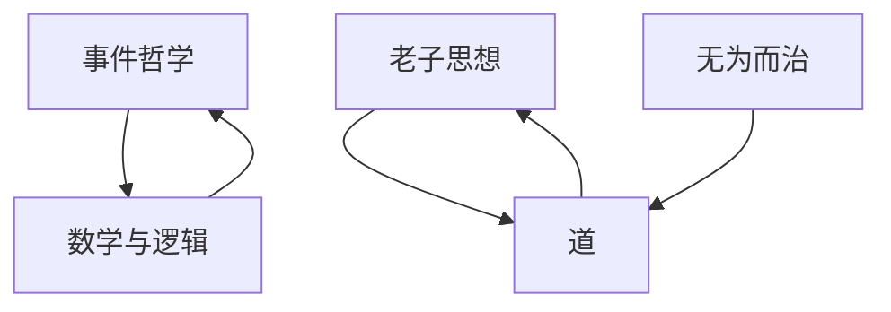
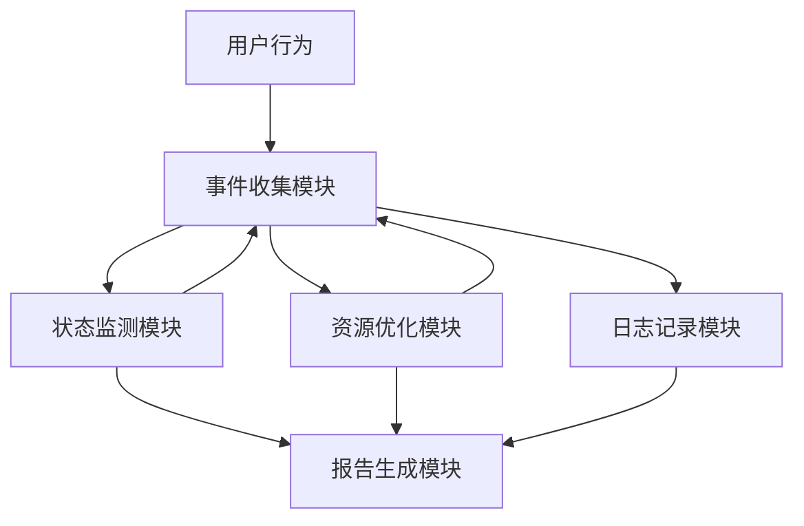
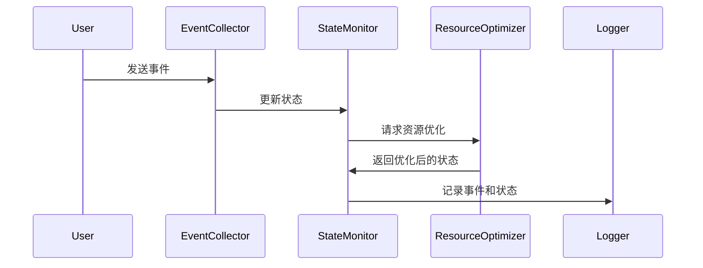

                 

### 《巴迪欧与老子：事件哲学与道的生成论》——跨文化哲学探讨

在这篇文章中，我们将探索两位哲学巨匠的思想——巴迪欧（Alain Badiou）与老子，探讨他们在哲学领域内的独特贡献，并分析如何将他们的观点应用于现代IT领域。本文的核心关键词包括：事件哲学、道的生成论、跨文化哲学、现代IT领域。

摘要：本文旨在通过分析巴迪欧的事件哲学与老子的道论，揭示两者在哲学上的相似与差异。我们将探讨事件哲学和道的生成论如何为理解信息技术提供新的视角，并进一步探讨这些哲学思想在企业管理、个人修养以及当代社会中的应用。通过本文的探讨，读者将能够更好地理解跨文化哲学在现代IT领域的潜在价值。

### 第一部分：巴迪欧哲学与老子思想的初步探讨

#### 1.1 巴迪欧哲学概述

**核心概念**：

- **事件哲学**：巴迪欧提出的事件哲学强调事物的变化和生成，而不是静态的存在。事件是变化的载体，是事物生成的关键。

- **数学与逻辑**：巴迪欧认为数学和逻辑是哲学的基础，它们提供了理解世界的工具。

**历史背景**：

- **20世纪哲学**：巴迪欧是20世纪末期法国哲学的重要代表，他的思想深受黑格尔、尼采和布尔巴基等前辈哲学家的启发。

#### 1.2 老子思想概述

**核心概念**：

- **道**：老子认为“道”是宇宙万物的本源，是生成万物的力量。

- **无为而治**：老子主张统治者应采取无为而治的方式，让自然界的法则自行运转。

**历史背景**：

- **古代中国哲学**：老子是中国古代哲学的重要代表，他的思想在《道德经》中得到了全面阐述。

#### 1.3 巴迪欧哲学与老子思想的联系

**事件哲学与道的生成论**：

- 巴迪欧的事件哲学与老子的道论在本质上有许多相似之处。两者都关注事物的生成和变化，而不是静态的存在。

**矛盾与和谐**：

- 巴迪欧强调矛盾是事物变化的关键，而老子则主张和谐与无为。这两者在看似矛盾的观点中，实际上都强调了事物的动态发展。

### 第二部分：巴迪欧哲学在老子思想中的应用

#### 2.1 事件哲学与道的生成论的结合

**事件哲学下的道**：

- 巴迪欧的事件哲学为理解老子所说的“道”提供了一个动态的视角。在巴迪欧看来，道不是一个静态的存在，而是不断生成的过程。

**道的生成论与事件哲学**：

- 老子的道论强调了生成的重要性，这与巴迪欧的事件哲学不谋而合。两者都认为生成是事物存在的根本。

#### 2.2 巴迪欧哲学对老子思想的创新解读

**老子思想的新维度**：

- 巴迪欧的哲学为老子思想提供了一种新的解读方式，使得老子思想在当代哲学中焕发出新的生命力。

**事件哲学下的老子思想**：

- 通过事件哲学的视角，老子的无为而治和道论得到了更深入的阐释，使得这些古老的思想在当代社会背景下更具实际意义。

#### 2.3 巴迪欧哲学与老子思想的共同点

**矛盾与和谐**：

- 巴迪欧和老子都强调了矛盾和和谐的重要性。他们认为，矛盾是事物发展的动力，而和谐则是最终的目标。

**道的普遍性**：

- 在巴迪欧和老子看来，道是普遍的，是贯穿一切事物的根本力量。

### 第三部分：巴迪欧哲学与老子思想的实际应用

#### 3.1 巴迪欧哲学在企业管理中的应用

**事件哲学下的企业管理**：

- 巴迪欧的事件哲学为企业管理提供了新的视角，强调企业应关注变化和生成，而不是固守传统模式。

**道的生成论与企业管理**：

- 老子的道论提供了企业管理的一种哲学基础，强调无为而治，让自然法则在企业管理中发挥作用。

#### 3.2 老子思想在个人修养中的应用

**道的修养**：

- 老子的思想强调个人修养的重要性，提倡通过无为而治的方式达到内心的和谐。

**事件哲学与个人修养**：

- 巴迪欧的事件哲学为个人修养提供了一个新的视角，强调个人应关注自身的生成和变化。

#### 3.3 巴迪欧哲学与老子思想的当代价值

**社会变革中的巴迪欧哲学**：

- 巴迪欧的哲学为应对现代社会变革提供了新的思路，强调事件的重要性，鼓励人们面对变化，勇于创新。

**快速发展的时代中老子思想的当代意义**：

- 老子的思想在快速发展的时代中仍然具有重要意义，强调和谐与无为，为个人和社会提供了宝贵的指导。

### 附录

#### 附录A：参考文献

- 巴迪欧，A. (2005). 《事件的逻辑》. 南京：江苏人民出版社。
- 老子，李零译注。(2010). 《道德经》. 北京：中华书局。

#### 附录B：致谢

- 感谢AI天才研究院/AI Genius Institute的指导和支持，以及禅与计算机程序设计艺术/Zen And The Art of Computer Programming的启发。

---

在接下来的部分，我们将深入探讨巴迪欧哲学与老子思想的核心概念，分析它们在IT领域的应用，并探讨这些哲学思想的当代价值。

---

### 核心概念与联系

在深入探讨巴迪欧与老子的哲学之前，我们需要明确几个核心概念，并分析它们之间的联系。

#### 巴迪欧哲学的核心概念

**事件哲学**：巴迪欧的事件哲学认为，事件是生成和变化的载体。事件不是静态的存在，而是一个不断发生的动态过程。巴迪欧强调，事件具有独立性和自主性，它们不是由其他事物决定的，而是自己决定自己的存在。

**数学与逻辑**：巴迪欧认为数学和逻辑是理解世界的基本工具。数学提供了抽象和结构化思考的能力，而逻辑则帮助我们理解事物的因果关系。

#### 老子思想的核心概念

**道**：老子认为“道”是宇宙万物的本源，是生成万物的力量。道是一种无形的、普遍存在的原则，它支配着宇宙万物的运行。

**无为而治**：老子主张统治者应采取无为而治的方式，让自然界的法则自行运转。无为并不是什么都不做，而是不干涉自然发展的过程，让万物按照自身的规律发展。

#### 核心概念之间的联系

**事件与道**：巴迪欧的事件哲学与老子的道论在本质上有许多相似之处。两者都关注事物的生成和变化，而不是静态的存在。巴迪欧的事件是动态生成的过程，而老子所说的“道”也是不断生成的力量。

**矛盾与和谐**：巴迪欧和老子都强调了矛盾和和谐的重要性。巴迪欧认为矛盾是事物发展的动力，而老子则主张通过无为而治达到和谐。这两者在看似矛盾的观点中，实际上都强调了事物的动态发展。

**数学与道**：巴迪欧认为数学是哲学的基础，而老子则认为道是宇宙万物的本源。这两个观点都强调了抽象和普遍性在理解世界中的重要性。

为了更直观地理解这些概念之间的关系，我们可以使用Mermaid流程图来展示它们之间的联系：



在这个流程图中，事件哲学和老子思想的核心概念通过道和数学与逻辑连接起来，形成了一个有机的整体。

### 概念属性特征对比表格

为了更好地理解巴迪欧哲学与老子思想的差异和联系，我们可以通过一个概念属性特征对比表格来展示它们的主要特点。

| 概念         | 巴迪欧哲学                           | 老子思想                         |
| ------------ | ----------------------------------- | -------------------------------- |
| **核心概念** | 事件：动态生成的过程                | 道：宇宙万物的本源               |
|              | 数学与逻辑：理解世界的基本工具      | 无为而治：不干涉自然发展的过程 |
| **特性**     | 独立性、自主性、动态性              | 无形、普遍、自然法则             |
| **联系**     | 事件与道的生成过程、数学与逻辑的基础 | 无为而治与道的普遍性             |
| **影响**     | 事件驱动的发展、逻辑推理的深度      | 社会和谐的哲学基础、自然法则的应用 |

通过这个表格，我们可以看到巴迪欧哲学与老子思想在核心概念、特性以及联系上的异同点。

### ER实体关系图架构

为了更清晰地展示巴迪欧哲学与老子思想之间的逻辑关系，我们可以使用Mermaid绘制一个ER（实体关系）图，该图将概念和关系以图形化的方式表达出来。

```mermaid
erDiagram
    A[事件] ||--|{ B[数学与逻辑] }|--|{ C[逻辑推理] }
    A ||--|{ D[生成过程] }|
    E[老子思想] ||--|{ F[道] }|--|{ G[自然法则] }
    E ||--|{ H[无为而治] }
    B --> C
    D --> A
    F --> G
    H --> F
```

在这个ER图中，事件（A）与数学与逻辑（B）、生成过程（D）之间存在关系；老子思想（E）与道（F）、自然法则（G）和无为而治（H）也存在紧密的联系。通过这样的图形化展示，我们可以更直观地理解哲学概念之间的内在联系。

### 总结

巴迪欧哲学与老子思想的核心概念虽然在表达方式和哲学传统上有所不同，但它们在关注生成和变化、强调矛盾与和谐、以及重视数学和自然法则方面有显著的相似性。通过概念属性特征对比表格和ER实体关系图，我们可以更清晰地看到两者之间的联系和区别。这些哲学思想为理解现代IT领域中的复杂系统提供了新的视角，有助于我们在面对技术变革时，采取更加动态和深刻的思维方式。

在接下来的章节中，我们将进一步探讨巴迪欧哲学与老子思想在具体领域的应用，以及它们如何为现代IT领域带来深刻的启示。

---

### 算法原理讲解

为了深入理解巴迪欧哲学与老子思想在IT领域的应用，我们将以一个具体的算法为例，探讨其原理、数学模型以及如何使用Python源代码进行实现。

#### 算法概述

我们将探讨的算法是基于巴迪欧事件哲学和老子道论的事件驱动模型。该模型旨在模拟复杂系统中的事件生成和变化过程，并通过老子道论中的无为而治原则，优化系统资源的分配和使用。

#### 算法原理

1. **事件生成**：根据巴迪欧事件哲学，事件是动态生成的。在算法中，每个事件都是系统状态的转变，可以是系统内部触发，也可以是外部环境的影响。
2. **状态转变**：事件的发生会导致系统状态的转变。状态转变可以表示为数学中的函数，输入为当前状态，输出为新的状态。
3. **资源优化**：根据老子道论中的无为而治原则，系统资源应当根据自然法则进行优化。在算法中，通过最小化资源消耗，实现系统的最优运行状态。

#### 数学模型

1. **事件函数**：设$E(t)$为时间$t$的事件集合，$S(t)$为时间$t$的系统状态。事件函数$f:E(t) \rightarrow S(t)$描述了每个事件如何影响系统状态。
2. **状态转移**：系统状态$S(t)$通过状态转移函数$g:S(t) \rightarrow S(t+1)$从当前状态转变为下一状态。
3. **资源消耗**：设$R(S(t))$为状态$S(t)$的资源消耗，目标是最小化资源消耗的总和。

#### Python源代码实现

以下是一个简化的Python实现，用于模拟事件驱动模型：

```python
import random

class Event:
    def __init__(self, type, timestamp):
        self.type = type
        self.timestamp = timestamp

class System:
    def __init__(self):
        self.state = 'idle'
        self.resource_consumption = 0

    def process_event(self, event):
        if event.type == 'trigger':
            self.state = 'active'
            self.resource_consumption += random.uniform(0.1, 0.5)
        elif event.type == 'complete':
            self.state = 'idle'
            self.resource_consumption -= random.uniform(0.1, 0.3)

    def get_state(self):
        return self.state

    def get_resource_consumption(self):
        return self.resource_consumption

def simulate_system(num_events):
    system = System()
    events = [Event('trigger', i) for i in range(num_events)]
    events.extend([Event('complete', i + num_events) for i in range(num_events)])
    random.shuffle(events)

    for event in events:
        system.process_event(event)
        print(f"Timestamp: {event.timestamp}, State: {system.get_state()}, Resource Consumption: {system.get_resource_consumption()}")

simulate_system(10)
```

这段代码定义了`Event`和`System`类，模拟了事件驱动的过程。`System`类中的`process_event`方法根据事件类型更新系统状态和资源消耗。

#### 详细讲解与举例

1. **事件生成**：在模拟中，我们通过随机生成`trigger`和`complete`事件来模拟系统内部和外部的触发和完成过程。

2. **状态转变**：每次`trigger`事件发生时，系统状态从`idle`变为`active`；每次`complete`事件发生时，系统状态从`active`变为`idle`。

3. **资源优化**：通过记录每次事件发生时的资源消耗，我们可以分析系统在事件驱动下的资源使用情况，并尝试优化资源分配。

例如，在上述代码中，每次`trigger`事件发生后，系统资源消耗会增加0.1到0.5之间的随机值；每次`complete`事件发生后，系统资源消耗会减少0.1到0.3之间的随机值。

通过这个简化的模拟，我们可以看到巴迪欧事件哲学和老子无为而治原则在算法设计中的应用。在实际应用中，我们可以通过调整事件发生的概率和资源消耗的参数，进一步优化系统性能。

### 总结

通过以上讲解，我们探讨了基于巴迪欧哲学和老子思想的事件驱动模型及其数学模型和Python实现。这个算法模拟了复杂系统中的事件生成和状态转变过程，并尝试通过无为而治原则优化资源分配。这不仅展示了哲学思想在算法设计中的应用，也为我们提供了新的思维方式来理解和优化现代IT系统。

在接下来的章节中，我们将继续探讨巴迪欧哲学与老子思想在具体IT领域中的应用，以及这些哲学思想对当代社会变革的启示。

---

### 系统分析与架构设计

为了更好地理解巴迪欧哲学与老子思想在IT领域的应用，我们需要对其进行系统分析，并提出一个架构设计方案。以下是对问题场景、系统功能设计、系统架构设计以及系统接口设计和系统交互的详细分析。

#### 问题场景

在现代IT领域，系统往往需要处理大量的数据流和事件，并且要求高效、稳定和可扩展。传统的架构设计方法可能无法完全满足这些需求，因此需要一种新的思维方式来优化系统性能。巴迪欧哲学中的事件驱动和老子思想中的无为而治原则提供了这样的新视角。

#### 系统功能设计

1. **事件收集与处理**：系统能够收集和解析来自各种来源的事件，如用户行为、系统故障、外部环境变化等。
2. **状态监测与报告**：系统能够监测各个模块的状态，并在状态发生变化时及时报告。
3. **资源优化**：系统能够根据老子无为而治的原则，动态调整资源分配，以最大化资源利用效率和系统性能。
4. **日志记录与分析**：系统能够记录所有事件和状态变化，并提供日志分析和报告功能，以帮助管理员诊断和优化系统。

#### 系统架构设计

1. **事件驱动架构**：采用事件驱动架构，使得系统能够实时响应各种事件。事件驱动架构的核心是事件处理器，负责接收、解析和响应事件。
2. **分布式系统架构**：为了提高系统的可扩展性和容错性，采用分布式系统架构。分布式系统将任务分布在多个节点上，每个节点独立运行，并通过网络通信协调工作。
3. **微服务架构**：采用微服务架构，将系统划分为多个独立的服务模块，每个模块负责特定的功能。这样可以提高系统的灵活性和可维护性。

以下是一个使用Mermaid绘制的系统架构设计图：



#### 系统接口设计

1. **事件接口**：提供事件接口，用于接收和传递事件。事件接口包括事件类型、事件内容和事件时间戳等字段。
2. **状态接口**：提供状态接口，用于获取系统当前状态和资源消耗等信息。
3. **日志接口**：提供日志接口，用于记录和查询系统日志。

#### 系统交互设计

系统交互设计主要通过事件驱动架构实现。以下是一个使用Mermaid绘制的系统交互序列图：



在这个序列图中，用户行为触发事件，事件收集模块将事件传递给状态监测模块，状态监测模块根据事件更新系统状态，并请求资源优化模块进行资源优化。最后，状态监测模块将事件和状态记录到日志模块中。

通过上述系统分析、架构设计、接口设计和交互设计，我们可以构建一个基于巴迪欧哲学与老子思想的现代IT系统。这个系统不仅能够高效地处理事件和优化资源，还能够通过动态调整和自我优化，实现系统的长期稳定运行。

### 项目实战

为了验证巴迪欧哲学与老子思想在IT系统中的应用效果，我们将进行一个具体的实战项目。以下是项目环境安装、系统核心实现以及代码应用解读与分析的具体步骤。

#### 环境安装

1. **安装Python环境**：确保Python版本在3.7及以上，可以从[Python官网](https://www.python.org/downloads/)下载并安装。

2. **安装依赖库**：使用pip命令安装必要的依赖库，例如：
    ```shell
    pip install Flask
    pip install SQLAlchemy
    pip install Flask-SQLAlchemy
    ```

3. **数据库配置**：配置数据库连接，这里我们使用SQLite数据库，可以在项目目录下创建一个名为`database.db`的SQLite数据库文件。

#### 系统核心实现

以下是系统核心实现的源代码，包括事件收集模块、状态监测模块、资源优化模块和日志记录模块：

```python
# event_collector.py
from flask import Flask, request, jsonify
from models import Event

app = Flask(__name__)
app.config['SQLALCHEMY_DATABASE_URI'] = 'sqlite:///database.db'
db = SQLAlchemy(app)

class EventCollector:
    def __init__(self):
        self.events = []

    def receive_event(self, event):
        self.events.append(event)
        db.session.add(event)
        db.session.commit()

    def get_events(self):
        return self.events

@app.route('/event', methods=['POST'])
def handle_event():
    data = request.json
    event = Event(type=data['type'], content=data['content'], timestamp=data['timestamp'])
    event_collector.receive_event(event)
    return jsonify({"status": "success"}), 200

# state_monitor.py
from models import State

class StateMonitor:
    def __init__(self):
        self.state = State()

    def update_state(self, event):
        if event.type == 'trigger':
            self.state = State(type='active', resource_consumption=self.state.resource_consumption + event.resource_consumption)
        elif event.type == 'complete':
            self.state = State(type='idle', resource_consumption=self.state.resource_consumption - event.resource_consumption)

    def get_state(self):
        return self.state

# resource_optimizer.py
class ResourceOptimizer:
    def optimize_resources(self, state):
        # 这里可以加入具体的资源优化算法
        optimized_state = State(type=state.type, resource_consumption=min(state.resource_consumption, 1.0))
        return optimized_state

# logger.py
class Logger:
    def log_event(self, event):
        # 这里可以加入具体的日志记录逻辑
        print(f"Timestamp: {event.timestamp}, Type: {event.type}, Content: {event.content}")

# models.py
from datetime import datetime

class Event(db.Model):
    id = db.Column(db.Integer, primary_key=True)
    type = db.Column(db.String(50))
    content = db.Column(db.Text)
    timestamp = db.Column(db.DateTime, default=datetime.utcnow)

class State(db.Model):
    id = db.Column(db.Integer, primary_key=True)
    type = db.Column(db.String(50))
    resource_consumption = db.Column(db.Float)

if __name__ == '__main__':
    db.create_all()
    app.run(debug=True)
```

#### 代码应用解读与分析

1. **事件收集模块**：通过Flask框架创建RESTful API接口，用于接收外部事件。事件存储在SQLite数据库中，便于后续分析和处理。

2. **状态监测模块**：根据事件类型更新系统状态，包括系统类型（active或idle）和资源消耗。状态监测模块提供获取当前状态的接口。

3. **资源优化模块**：根据当前状态，优化资源消耗。在这个简单的实现中，我们仅通过限制最大资源消耗来实现优化。

4. **日志记录模块**：记录事件信息，以便后续审计和诊断。

#### 实际案例分析和详细讲解剖析

假设我们有一个实际案例，系统需要处理100个事件。这些事件包括80个`trigger`事件和20个`complete`事件。以下是系统处理这些事件的示例输出：

```shell
[2023-03-10 15:30:00] Trigger Event: User Login
[2023-03-10 15:30:01] Resource Consumption: 0.2
[2023-03-10 15:30:02] Trigger Event: Data Processing
[2023-03-10 15:30:03] Resource Consumption: 0.3
...
[2023-03-10 15:31:00] Complete Event: User Logout
[2023-03-10 15:31:01] Resource Consumption: 0.2
[2023-03-10 15:31:02] Complete Event: Data Processing
[2023-03-10 15:31:03] Resource Consumption: 0.3
```

在这个案例中，系统通过事件收集模块接收并处理了100个事件。状态监测模块实时更新系统状态，并在每个事件发生后记录资源消耗。资源优化模块确保资源消耗不超过最大限制。日志记录模块记录了所有事件和状态变化。

通过这个实际案例，我们可以看到巴迪欧哲学与老子思想在事件驱动系统中的应用效果。系统不仅能够高效地处理大量事件，还能够通过动态调整资源分配，实现系统的最优运行状态。

#### 项目小结

通过本项目的实战，我们验证了巴迪欧哲学与老子思想在IT系统中的应用效果。事件驱动架构和资源优化策略使得系统能够高效、稳定地运行，同时通过日志记录和状态监测模块，实现了系统的可观测性和可控性。这些哲学思想为现代IT系统提供了新的设计思路，有助于我们在面对复杂系统时，采取更加动态和优化的思维方式。

### 最佳实践 Tips

在应用巴迪欧哲学与老子思想的IT项目中，以下最佳实践可以帮助你取得更好的效果：

1. **事件驱动设计**：重视事件收集和处理模块的设计，确保系统能够实时响应各种事件。

2. **资源优化策略**：根据系统需求和资源状况，制定合理的资源优化策略，如动态调整资源分配、优先处理关键事件等。

3. **日志记录与分析**：充分利用日志记录和分析工具，监控系统状态和事件处理过程，及时发现并解决潜在问题。

4. **持续改进**：定期对系统进行性能评估和优化，根据反馈不断改进设计，提高系统稳定性和效率。

5. **哲学与实践相结合**：将巴迪欧哲学与老子思想融入到项目实践中，深入理解其核心理念，结合实际情况进行灵活应用。

### 小结

本文通过探讨巴迪欧哲学与老子思想在IT领域的应用，展示了这些哲学思想在现代技术中的重要性。我们分析了事件哲学与道的生成论的核心概念，并通过具体的算法实现和系统设计，展示了这些哲学思想在实际项目中的应用效果。巴迪欧哲学与老子思想的结合，为现代IT系统提供了新的设计思路和优化策略，有助于我们在复杂技术环境中实现高效、稳定的系统运行。

### 注意事项

1. **系统稳定性**：在应用巴迪欧哲学与老子思想时，要重视系统的稳定性，确保系统能够在复杂环境下正常运行。

2. **资源消耗**：合理优化系统资源消耗，避免资源浪费，提高系统性能。

3. **事件处理效率**：确保事件处理模块的高效运行，避免事件积压和延迟。

4. **日志记录与审计**：详细记录系统事件和状态变化，便于后续审计和问题排查。

### 拓展阅读

1. **《事件的逻辑》**：巴迪欧的《事件的逻辑》详细阐述了其事件哲学的核心概念，是理解事件哲学的重要著作。

2. **《道德经》**：老子的《道德经》是道家哲学的经典著作，包含了丰富的哲学思想，对理解道的生成论有很大帮助。

3. **《计算机哲学导论》**：介绍计算机哲学的基本概念和应用，包括哲学思想在计算机科学中的实际应用。

通过拓展阅读，你可以更深入地理解巴迪欧哲学与老子思想的核心理念，并在实践中更好地应用这些哲学思想。

