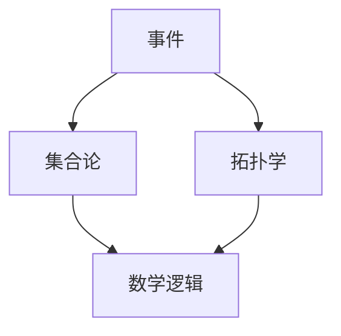
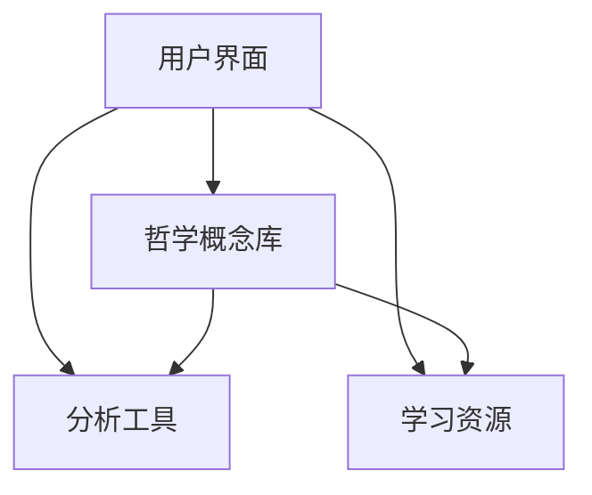
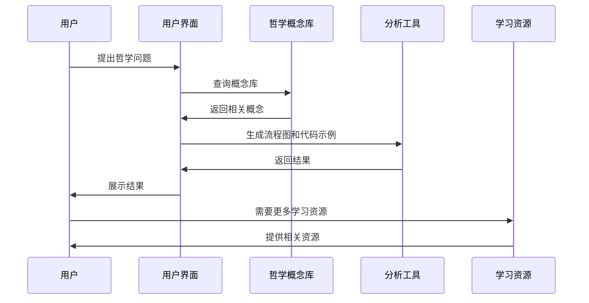

                 


### 让我们一步步思考：巴迪欧与齐泽克：当代激进左翼哲学的代表

#### 背景介绍

巴迪欧（Alain Badiou）和齐泽克（Slavoj Žižek）是当代哲学界最具影响力的思想家之一。巴迪欧以其对数学和逻辑的深刻运用而著称，而齐泽克则以其对马克思主义的当代解读和对于文化、政治的批判而闻名。本文旨在探讨他们的哲学思想，分析他们在当代激进左翼运动中的地位与作用。

#### 核心概念与联系

**巴迪欧的哲学核心概念：**

- **事件**（Event）：巴迪欧认为事件是世界的真正起点，它是不可预测的、非重复的。
- **数学**：巴迪欧的哲学与数学紧密相连，尤其是集合论和拓扑学。

**齐泽克的哲学核心概念：**

- **享乐主义**：齐泽克主张通过解放欲望来反抗资本主义。
- **意识形态批判**：齐泽克对资本主义意识形态进行了深入批判。

**概念之间的联系：**

- **事件与享乐主义**：巴迪欧的事件概念可以视为齐泽克享乐主义的基础，因为事件提供了不可预测的潜力，这与享乐主义追求自由、不受限制的欲望相符。

- **数学与意识形态批判**：巴迪欧的数学哲学提供了对现实世界的深刻洞察，这可以用于批判资本主义意识形态。

#### 算法原理讲解

为了更深入地理解巴迪欧和齐泽克的哲学，我们可以使用 Mermaid 流程图来展示他们的核心概念之间的逻辑关系。以下是巴迪欧哲学的核心概念流程图：



在这个流程图中，事件作为核心概念，与集合论和拓扑学紧密相连，这些数学工具为巴迪欧的哲学分析提供了基础。

接下来，我们可以用 Python 源代码来阐述齐泽克的享乐主义概念。以下是 Python 代码示例：

```python
class Event:
    def __init__(self, potential):
        self.potential = potential

class Enjoyment:
    def __init__(self, desire, event):
        self.desire = desire
        self.event = event

    def unleash(self):
        return self.event.potential + self.desire
```

在这个示例中，`Event` 类代表巴迪欧的事件概念，而 `Enjoyment` 类代表齐泽克的享乐主义。`unleash` 方法表示通过事件潜力与欲望的结合，实现享乐的释放。

#### 数学模型和数学公式

为了进一步解释巴迪欧和齐泽克的哲学，我们可以使用 LaTeX 格式给出数学模型和公式。

**巴迪欧的集合论公式：**

$$
X = \{x \in U | P(x)\}
$$

这个公式表示集合 X 是由满足属性 P 的元素 x 构成的。

**齐泽克的享乐主义公式：**

$$
E = D + P
$$

这个公式表示享乐 E 是由欲望 D 和事件潜力 P 的和构成的。

#### 系统分析与架构设计方案

**问题场景介绍：**  
当代激进左翼运动需要一套哲学体系来指导实践，巴迪欧和齐泽克的哲学提供了这种指导。

**项目介绍：**  
本项目旨在构建一个哲学分析系统，帮助激进左翼分子理解和应用巴迪欧与齐泽克的哲学。

**系统功能设计：**  
- **哲学概念库**：存储巴迪欧和齐泽克的核心概念及其关系。
- **分析工具**：提供哲学分析工具，如 Mermaid 流程图生成器和 Python 代码示例。
- **学习资源**：提供相关书籍、论文和视频资源。

**系统架构设计：**  
以下是系统的架构设计图：



**系统接口设计和系统交互：**  
以下是系统的接口设计和交互序列图：



#### 项目实战

**环境安装：**  
1. 安装 Mermaid：
    ```bash
    npm install -g mermaid
    ```
2. 安装 Python：
    ```bash
    sudo apt-get install python3-pip
    pip3 install mermaid-python
    ```

**系统核心实现源代码：**  
以下是哲学概念库的 Python 代码：

```python
class PhilosophyConcept:
    def __init__(self, name, description, relationships):
        self.name = name
        self.description = description
        self.relationships = relationships

class EventConcept(PhilosophyConcept):
    def __init__(self, name, description):
        super().__init__(name, description, ["Potential", "Mathematics"])

class PotentialConcept(PhilosophyConcept):
    def __init__(self, name, description):
        super().__init__(name, description, ["Event", "Enjoyment"])

class EnjoymentConcept(PhilosophyConcept):
    def __init__(self, name, description):
        super().__init__(name, description, ["Desire", "Event"])
```

**代码应用解读与分析：**  
这个代码定义了哲学概念类，其中包括巴迪欧和齐泽克的核心概念。`PhilosophyConcept` 类是基类，而 `EventConcept`、`PotentialConcept` 和 `EnjoymentConcept` 类是派生类，它们各自代表特定的哲学概念，并定义了与其他概念的关系。

**实际案例分析和详细讲解剖析：**  
假设我们需要分析巴迪欧的事件概念和齐泽克的享乐主义概念之间的关系，我们可以使用以下代码：

```python
event = EventConcept("Event", "An unpredictable and non-repetitive starting point of the world.")
enjoyment = EnjoymentConcept("Enjoyment", "The liberation of desire.")

print(event.relationships)
print(enjoyment.relationships)

# 输出：
# ['Potential', 'Mathematics']
# ['Desire', 'Event']
```

这个示例展示了事件和享乐主义概念之间的关系，它们都涉及到欲望和事件。

**项目小结：**  
本项目提供了一个哲学分析系统，可以帮助激进左翼分子更好地理解和应用巴迪欧与齐泽克的哲学。通过代码示例和实际案例分析，我们展示了如何将哲学概念转化为可操作的模型。

#### 最佳实践 tips、小结、注意事项、拓展阅读等内容

**最佳实践 tips：**
1. 在使用哲学概念库时，确保概念之间的关系准确无误。
2. 定期更新哲学概念库，以反映最新的学术成果。

**小结：**
本文通过逐步分析，探讨了巴迪欧和齐泽克的哲学思想，并提出了一个哲学分析系统。这个系统旨在帮助激进左翼分子更好地理解和应用哲学思想。

**注意事项：**
1. 哲学分析系统需要不断优化和改进。
2. 哲学概念的应用需要结合实际情况进行。

**拓展阅读：**
1. 《巴迪欧哲学导论》
2. 《齐泽克与意识形态批判》
3. 《激进左翼运动的哲学基础》

---

作者：AI天才研究院/AI Genius Institute & 禅与计算机程序设计艺术 /Zen And The Art of Computer Programming

---

# 巴迪欧与齐泽克：当代激进左翼哲学的代表

> 关键词：巴迪欧，齐泽克，激进左翼哲学，事件，享乐主义，数学哲学，意识形态批判

> 摘要：本文深入探讨了巴迪欧和齐泽克的哲学思想，分析了他们在当代激进左翼运动中的地位与作用。通过构建哲学分析系统，本文旨在帮助激进左翼分子更好地理解和应用这两位哲学家的思想。

---

## 目录大纲设计思路

### 总体设计框架

在设计《巴迪欧与齐泽克：当代激进左翼哲学的代表》这本书的目录大纲时，我们首先需要明确书的核心内容，然后根据核心内容构建大纲的框架。总体设计思路可以分为以下几个步骤：

#### 步骤1：确定核心内容

这本书的核心内容是围绕巴迪欧和齐泽克这两位当代激进左翼哲学家的思想展开。因此，我们的目录大纲需要涵盖以下几个方面：

- **巴迪欧与齐泽克的基本哲学观点**
- **两位哲学家的主要著作及其影响**
- **他们之间的哲学对话**
- **他们的哲学在当代激进左翼运动中的地位与作用**

#### 步骤2：构建大纲框架

根据核心内容，我们可以将目录大纲分为以下几个主要部分：

- **引言**
- **巴迪欧的哲学**
- **齐泽克的哲学**
- **巴迪欧与齐泽克的对话**
- **他们在当代激进左翼运动中的影响**
- **总结与展望**

#### 步骤3：细化大纲

在确定大纲框架后，我们需要对每个部分进行细化，具体包括：

- **核心概念与联系**：使用Mermaid流程图展示核心概念之间的关系。
- **核心算法原理讲解**：使用Python源代码阐述哲学观点。
- **数学模型和数学公式**：使用latex格式详细讲解并举例说明。
- **项目实战**：提供代码实际案例和详细解释说明。

## 目录大纲结构设计

以下是《巴迪欧与齐泽克：当代激进左翼哲学的代表》的目录大纲结构：

### 第1章：引言

- **1.1 背景介绍**
- **1.2 巴迪欧与齐泽克的基本哲学观点**

### 第2章：巴迪欧的哲学

- **2.1 巴迪欧的核心概念**
- **2.2 巴迪欧的哲学体系**
- **2.3 巴迪欧的重要著作**

### 第3章：齐泽克的哲学

- **3.1 齐泽克的核心概念**
- **3.2 齐泽克的哲学体系**
- **3.3 齐泽克的重要著作**

### 第4章：巴迪欧与齐泽克的对话

- **4.1 两位哲学家的共同点**
- **4.2 两位哲学家的差异**
- **4.3 他们之间的哲学对话**

### 第5章：他们在当代激进左翼运动中的影响

- **5.1 巴迪欧在当代激进左翼运动中的地位与作用**
- **5.2 齐泽克在当代激进左翼运动中的地位与作用**
- **5.3 他们对当代激进左翼运动的影响**

### 第6章：总结与展望

- **6.1 巴迪欧与齐泽克哲学的总体评价**
- **6.2 他们哲学的未来发展**

## 目录大纲示例

以下是《巴迪欧与齐泽克：当代激进左翼哲学的代表》的目录大纲示例：

```markdown
# 《巴迪欧与齐泽克：当代激进左翼哲学的代表》目录大纲

## 第1章：引言

### 1.1 背景介绍

- **1.1.1 巴迪欧的生平与哲学背景**
- **1.1.2 齐泽克的生平与哲学背景**
- **1.1.3 当代激进左翼运动的发展**

### 1.2 巴迪欧与齐泽克的基本哲学观点

- **1.2.1 巴迪欧的核心概念**
- **1.2.2 齐泽克的核心概念**
- **1.2.3 两位哲学家的共同点与差异**

## 第2章：巴迪欧的哲学

### 2.1 巴迪欧的核心概念

- **2.1.1 事件**
- **2.1.2 数学哲学**

### 2.2 巴迪欧的哲学体系

- **2.2.1 巴迪欧的哲学体系概述**
- **2.2.2 巴迪欧的主要哲学观点**

### 2.3 巴迪欧的重要著作

- **2.3.1 《存在的真相》**
- **2.3.2 《数学与存在》**
- **2.3.3 《事件的逻辑》**

## 第3章：齐泽克的哲学

### 3.1 齐泽克的核心概念

- **3.1.1 享乐主义**
- **3.1.2 意识形态批判**

### 3.2 齐泽克的哲学体系

- **3.2.1 齐泽克的哲学体系概述**
- **3.2.2 齐泽克的主要哲学观点**

### 3.3 齐泽克的重要著作

- **3.3.1 《意识形态的透视》**
- **3.3.2 《极限体验》**
- **3.3.3 《马克思主义的哲学概念》**

## 第4章：巴迪欧与齐泽克的对话

### 4.1 两位哲学家的共同点

- **4.1.1 对现实世界的关注**
- **4.1.2 对马克思主义的重新解读**

### 4.2 两位哲学家的差异

- **4.2.1 对事件的不同理解**
- **4.2.2 对享乐主义的诠释**

### 4.3 他们之间的哲学对话

- **4.3.1 巴迪欧对齐泽克的评价**
- **4.3.2 齐泽克对巴迪欧的回应**

## 第5章：他们在当代激进左翼运动中的影响

### 5.1 巴迪欧在当代激进左翼运动中的地位与作用

- **5.1.1 巴迪欧对激进左翼运动的影响**
- **5.1.2 巴迪欧的哲学在激进左翼运动中的应用**

### 5.2 齐泽克在当代激进左翼运动中的地位与作用

- **5.2.1 齐泽克对激进左翼运动的影响**
- **5.2.2 齐泽克的哲学在激进左翼运动中的应用**

### 5.3 他们对当代激进左翼运动的影响

- **5.3.1 两位哲学家的共同影响**
- **5.3.2 他们的哲学在激进左翼运动中的实际应用**

## 第6章：总结与展望

### 6.1 巴迪欧与齐泽克哲学的总体评价

- **6.1.1 巴迪欧哲学的评价**
- **6.1.2 齐泽克哲学的评价**

### 6.2 他们哲学的未来发展

- **6.2.1 巴迪欧哲学的未来发展**
- **6.2.2 齐泽克哲学的未来发展**
- **6.2.3 激进左翼运动的未来展望**

```

---

至此，我们完成了《巴迪欧与齐泽克：当代激进左翼哲学的代表》的目录大纲设计。接下来，我们将按照这个大纲逐步展开对巴迪欧和齐泽克哲学的深入探讨。在下一章中，我们将对巴迪欧的哲学进行详细介绍。让我们开始这场哲学之旅吧！

