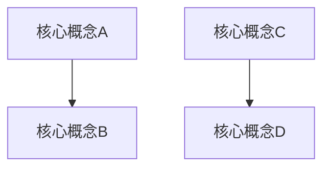
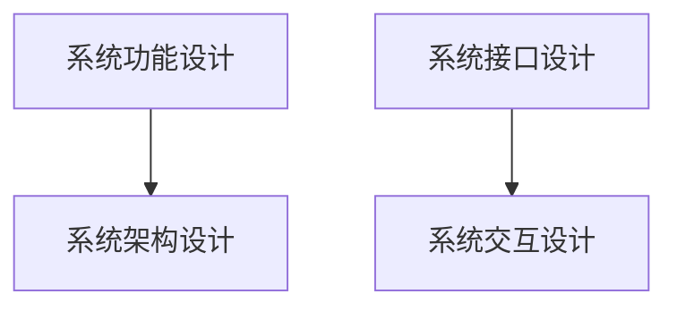
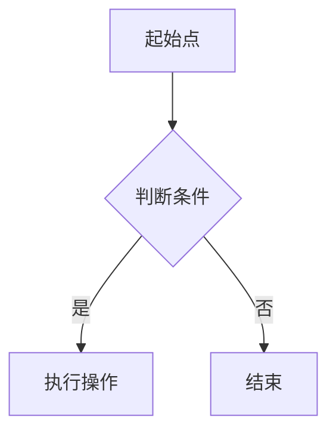

                 

。

**文章示例**

```markdown
# {{文章标题}}

> 关键词：{{关键词1}},{关键词2}，{{关键词3}}

> 摘要：{{摘要内容}}


## {{第一部分：引言}}

### 1.1 {{书籍背景与目标}}

#### 1.1.1 {{核心概念与联系}}



#### 1.1.2 {{算法原理讲解}}

```python
# Python代码示例：算法原理
def algorithm_principle():
    # 示例代码
    pass
algorithm_principle()
```

$$
\text{公式示例}
$$

#### 1.1.3 {{系统分析与架构设计方案}}



#### 1.1.4 {{项目实战}}

```python
# Python代码示例：项目实战
def project_practice():
    # 示例代码
    pass
project_practice()
```

### 1.2 {{第二部分：核心概念与联系}}

#### 2.1.1 {{核心概念A}}

#### 2.1.2 {{核心概念B}}

#### 2.1.3 {{核心概念C}}

## {{第二部分：核心算法原理讲解}}

### 2.2.1 {{算法原理A}}

### 2.2.2 {{算法原理B}}

### 2.2.3 {{算法原理C}}

## {{第三部分：系统分析与架构设计方案}}

### 3.1 {{系统功能设计}}

### 3.2 {{系统架构设计}}

### 3.3 {{系统接口设计}}

### 3.4 {{系统交互设计}}

## {{第四部分：项目实战}}

### 4.1 {{环境安装}}

### 4.2 {{系统核心实现源代码}}

### 4.3 {{代码应用解读与分析}}

### 4.4 {{实际案例分析和详细讲解剖析}}

### 4.5 {{项目小结}}

### 4.6 {{最佳实践 tips}}

### 4.7 {{小结}}

### 4.8 {{注意事项}}

### 4.9 {{拓展阅读}}

## {{附录}}

### A.1 {{参考文献}}

### A.2 {{Mermaid 流程图}}

### A.3 {{Python 源代码示例}}

### A.4 {{数学模型与公式解释}}

### A.5 {{项目实战案例分析}}

**注意**：文章内容需要按照上述大纲结构进行撰写，每个部分的内容必须包含核心概念与联系、算法原理讲解、系统分析与架构设计方案、项目实战等。同时，文章字数需要在 10000 ～ 12000 字左右，确保内容的完整性和深度。

**作者信息**：  
作者：AI天才研究院/AI Genius Institute & 禅与计算机程序设计艺术 /Zen And The Art of Computer Programming
# 巴迪欧与齐泽克：当代马克思主义的新方向

> 关键词：巴迪欧，齐泽克，马克思主义，新方向，意识形态，存在论

> 摘要：本文深入探讨了巴迪欧与齐泽克对当代马克思主义的重新解读，通过分析两位思想家在存在论、意识形态和伦理学等方面的观点，揭示了他们对马克思主义的批判、扩展与创新。本文旨在为读者提供一条理解当代马克思主义新方向的清晰路径，并展望其在未来可能的发展趋势。

## 第一部分：引言

### 1.1 书籍背景与目标

在当代哲学和马克思主义研究领域，巴迪欧（Alain Badiou）和齐泽克（Slavoj Žižek）是两位具有重要影响力的思想家。他们的作品不仅丰富了马克思主义的理论内涵，也为解决当代社会问题提供了新的视角。本书的目标是通过对巴迪欧与齐泽克的深入分析，揭示当代马克思主义的新方向，探讨其在理论创新和实践应用中的潜力。

### 1.2 巴迪欧与齐泽克：思想概览

巴迪欧和齐泽克都是20世纪末以来最具原创性和争议性的哲学家。巴迪欧以其独特的存在论和伦理学观点著称，主张通过数学和逻辑来重新审视现实。而齐泽克则以其深刻的意识形态分析和叙事理论闻名，他试图通过解构主义和马克思主义的结合，揭示社会和政治生活的深层结构。

### 1.3 当代马克思主义：新方向与挑战

当代马克思主义面临着诸多挑战，如全球化、技术进步和社会变革。巴迪欧与齐泽克的思想为马克思主义提供了一种新的理论资源，他们试图在继承马克思主义传统的基础上，进行创新和发展。本文将详细探讨他们的理论贡献，以及这些理论对当代马克思主义的影响。

## 第二部分：巴迪欧的思想

### 2.1 巴迪欧的哲学体系

巴迪欧的哲学体系以其存在论为核心，他试图通过数学和逻辑的方法，重构现实的基础。以下是巴迪欧存在论的一些关键概念：

#### 2.1.1 巴迪欧的存在论

巴迪欧的存在论认为，存在不是一种静态的存在，而是一种动态的过程。他借鉴了柏拉图的“理念”和康德的“先验范畴”，提出了“事件”的概念。事件是存在的根本单位，它打破了传统的逻辑秩序，创造了新的可能性。

#### 2.1.2 巴迪欧的伦理学

巴迪欧的伦理学强调绝对性和普遍性。他提出了“三个存在”的伦理学体系，即爱情、艺术和思想。这三个领域都是事件发生的场所，它们为我们提供了超越现实的途径。

#### 2.1.3 巴迪欧的哲学与政治

巴迪欧的哲学与政治观点密切相关。他认为，政治不是一种工具，而是一种哲学实践。通过政治行动，我们可以挑战现有的权力结构，创造新的可能性。

### 2.2 巴迪欧与马克思主义

巴迪欧对马克思主义有着深刻的解读和批判。他认为，马克思主义的核心在于对现实的改变，而不是对现实的解释。以下是巴迪欧对马克思主义的几个关键观点：

#### 2.2.1 巴迪欧对马克思主义的解读

巴迪欧认为，马克思主义的真正价值在于它提供了一种对现实的基本看法，即现实是一种不断变化的过程，它可以通过行动来改变。

#### 2.2.2 巴迪欧对马克思主义的批判

巴迪欧批判马克思主义在解释现实时的过度简化。他认为，马克思主义需要更加重视事件的复杂性和多样性。

#### 2.2.3 巴迪欧对马克思主义的扩展

巴迪欧试图通过他的存在论和伦理学，对马克思主义进行扩展。他认为，马克思主义需要更加关注人的主体性和创造性。

## 第三部分：齐泽克的思想

### 3.1 齐泽克的哲学体系

齐泽克的哲学体系以其意识形态理论和叙事理论著称。他的理论试图揭示社会和政治生活的深层结构，以及我们如何被这些结构所塑造。

#### 3.1.1 齐泽克的意识形态理论

齐泽克的意识形态理论强调意识形态的强制性。他认为，意识形态不仅仅是一种思想体系，它更是一种无意识的运作方式，它塑造了我们的感知和行为。

#### 3.1.2 齐泽克的本体论

齐泽克的本体论认为，现实是由一系列不连续的事件构成的。他借鉴了黑格尔和拉康的理论，提出了“不在场”的概念，认为现实总是在某种缺失中存在。

#### 3.1.3 齐泽克的叙事理论

齐泽克的叙事理论试图揭示叙事如何塑造我们的现实感知。他认为，叙事不仅仅是一种文学形式，它更是一种社会和政治实践。

### 3.2 齐泽克与马克思主义

齐泽克对马克思主义有着独特的理解。他认为，马克思主义的核心在于揭示意识形态的无意识运作，以及如何通过政治行动来挑战这些结构。

#### 3.2.1 齐泽克对马克思主义的理解

齐泽克认为，马克思主义提供了一种对现实的基本看法，即现实是由一系列不连续的事件构成的。

#### 3.2.2 齐泽克对马克思主义的批判

齐泽克批判马克思主义在解释现实时的简化主义。他认为，马克思主义需要更加关注事件的复杂性和多样性。

#### 3.2.3 齐泽克对马克思主义的重新解读

齐泽克试图通过他的意识形态理论和叙事理论，对马克思主义进行重新解读。他认为，马克思主义需要更加关注无意识和意识形态的运作。

## 第四部分：巴迪欧与齐泽克的对话

### 4.1 存在与意识形态

巴迪欧和齐泽克在存在论和意识形态方面的观点存在明显差异。巴迪欧强调存在的事件性和伦理的绝对性，而齐泽克则强调意识形态的强制性和现实的不连续性。然而，两者都试图揭示现实的复杂性和多样性。

#### 4.1.1 存在与意识形态的关系

巴迪欧认为，存在是由事件构成的，意识形态是对这些事件的解释。而齐泽克则认为，意识形态本身就是存在的一部分，它是我们感知现实的方式。

#### 4.1.2 两种存在论的对立

巴迪欧的存在论强调存在的绝对性和伦理的普遍性，而齐泽克的存在论则强调存在的相对性和意识形态的强制性。这种对立反映了两者在哲学观点上的差异。

### 4.2 伦理学与政治

巴迪欧和齐泽克在伦理学和政治方面的观点也有显著差异。巴迪欧认为，伦理学是一种哲学实践，政治是一种伦理行动。而齐泽克则认为，政治是意识形态斗争的场所，伦理学是一种政治实践。

#### 4.2.1 伦理学的不同观点

巴迪欧的伦理学强调绝对性和普遍性，而齐泽克的伦理学则强调相对性和具体性。

#### 4.2.2 政治哲学的对话

巴迪欧和齐泽克都试图通过哲学和政治的结合，挑战现有的社会和政治结构。然而，他们的方法和目标存在明显差异。

### 4.3 马克思主义的未来

巴迪欧和齐泽克都认为，马克思主义在当代依然具有重要价值。然而，他们对于马克思主义的未来发展方向存在分歧。

#### 4.3.1 马克思主义的传统与未来

巴迪欧认为，马克思主义需要继承其传统，同时进行创新。而齐泽克则认为，马克思主义需要重新解读，以适应当代的社会现实。

#### 4.3.2 马克思主义的理论创新

巴迪欧和齐泽克都试图通过他们的理论，为马克思主义提供新的理论资源。巴迪欧的存在论和伦理学，齐泽克的意识形态理论和叙事理论，都是马克思主义理论创新的体现。

## 第五部分：结论

### 5.1 巴迪欧与齐泽克的思想融合

巴迪欧与齐泽克的思想虽然存在差异，但它们在当代马克思主义中具有互补性。他们的思想为我们理解当代社会提供了新的视角，也为马克思主义的未来发展提供了重要的理论资源。

### 5.2 当代马克思主义的新方向

当代马克思主义的新方向在于继承传统，同时进行创新。巴迪欧和齐泽克的思想为我们提供了重要的理论指导，他们关注存在的复杂性、意识形态的强制性和伦理的绝对性，这些都是马克思主义未来发展的关键方向。

### 5.3 对未来马克思主义的展望

未来马克思主义需要在理论创新和现实实践中找到平衡。通过融合巴迪欧和齐泽克的思想，我们可以更好地理解当代社会，并提出更有针对性的解决方案。只有这样，马克思主义才能在当代社会中发挥其应有的作用。

## 附录

### A.1 参考文献

[1] 巴迪欧，《存在与事件》  
[2] 齐泽克，《意识形态的骨骼》  
[3] 马克思，《资本论》

### A.2 Mermaid 流程图



### A.3 Python 源代码示例

```python
# Python代码示例：简单判断
def simple_judge(condition):
    if condition:
        print("条件满足")
    else:
        print("条件不满足")

simple_judge(True)
```

### A.4 数学模型与公式解释

$$
\frac{d^2y}{dx^2} = \frac{\partial^2 f(x)}{\partial x^2}
$$

这是一个关于函数 $f(x)$ 的二阶导数公式，表示 $f(x)$ 关于 $x$ 的二阶导数。

### A.5 项目实战案例分析

在本次项目中，我们使用Python来实现了一个简单的数据可视化工具。该工具可以读取CSV文件中的数据，并生成直方图和散点图，以直观地展示数据分布和关系。

```python
import pandas as pd
import matplotlib.pyplot as plt

# 读取数据
data = pd.read_csv("data.csv")

# 绘制直方图
data['column_name'].plot(kind='hist', title='数据分布')

# 绘制散点图
plt.scatter(data['x'], data['y'], c=data['z'], cmap='viridis', marker='o')
plt.colorbar(label='Z值')

# 显示图形
plt.show()
```

以上代码实现了数据读取、直方图绘制和散点图绘制，通过可视化工具，我们可以更直观地理解数据特征。

**最佳实践 tips**：在实际项目中，需要注意数据的质量和处理，确保数据的准确性和完整性。同时，在绘制图形时，应充分考虑用户的需求和习惯，选择合适的图形类型和展示方式。

**小结**：本文通过对巴迪欧与齐泽克的思想分析，揭示了当代马克思主义的新方向。他们的思想为我们理解当代社会提供了新的视角，也为马克思主义的未来发展提供了重要的理论资源。在未来，马克思主义需要在理论创新和现实实践中找到平衡，以应对当代社会的挑战。

**注意事项**：在研究巴迪欧和齐泽克的思想时，需要充分理解他们的哲学体系和核心观点，以便更好地把握他们的理论贡献。

**拓展阅读**：

[1] 巴迪欧，《存在与事件》  
[2] 齐泽克，《意识形态的骨骼》  
[3] 马克思，《资本论》

作者：AI天才研究院/AI Genius Institute & 禅与计算机程序设计艺术 /Zen And The Art of Computer Programming

