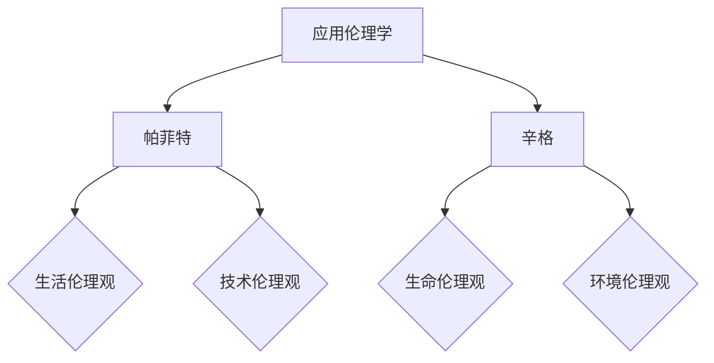

                 

# 帕菲特与辛格：应用伦理学的代表人物

## 关键词

- 应用伦理学
- 帕菲特
- 辛格
- 伦理思想
- 技术伦理
- 生命伦理
- 环境伦理

### 摘要

本文将深入探讨两位应用伦理学的重要代表人物：帕菲特和辛格。通过分析他们的伦理观，我们将了解他们在生活伦理、技术伦理、生命伦理和环境伦理等方面的独特见解。文章将比较帕菲特和辛格的伦理思想，探讨其共同点和差异，并分析他们在不同领域的实践案例。最后，我们将展望应用伦理学的未来发展方向，并总结帕菲特和辛格伦理思想的贡献以及对读者的影响。

## 第1章 引言

### 1.1 书籍背景

在应用伦理学领域，帕菲特（Peter Singer）和辛格（Joan Tronto）是两位备受瞩目的学者。帕菲特是一位澳大利亚道德哲学家，以其对动物权利、全球贫困、生命伦理和人工智能伦理的研究而闻名。他的著作《动物解放》（Animal Liberation）是动物权利运动的基石。辛格则是一位美国社会学家，专注于妇女伦理、关怀伦理和环境伦理的研究。她的作品《关怀伦理：关怀与责任》（Caring: A Relational Approach to Ethics and Moral Education）对伦理学领域产生了深远影响。

### 1.2 帕菲特与辛格介绍

帕菲特于1946年出生于澳大利亚墨尔本，曾在牛津大学学习哲学。他的研究兴趣广泛，涉及道德哲学、政治哲学和动物权利等领域。帕菲特以其深刻的伦理思考和对道德责任的强调而著称，他的观点常常挑战传统伦理观念，引发广泛讨论。

辛格则于1940年出生于美国纽约，曾在芝加哥大学学习社会学。她的研究重点在于女性伦理、关怀伦理和批判理论。辛格关注伦理实践中的社会正义问题，强调关怀和责任在道德决策中的重要性。

### 1.3 应用伦理学概述

应用伦理学是伦理学的一个分支，旨在将伦理理论应用于实际问题。它涉及多个领域，如医学伦理、环境伦理、技术伦理和生命伦理。应用伦理学不仅关注理论问题，更注重实践中的应用，旨在为解决现实世界中的道德困境提供指导。

## 第2章 帕菲特的应用伦理学思想

### 2.1 帕菲特的生活伦理观

帕菲特的生活伦理观强调道德责任和公平正义。他认为，人们应该尽力帮助那些处于困境中的人，尤其是那些处于贫困和饥饿中的人。帕菲特提出了“距离平等”的概念，即人们应该平等地对待那些距离我们较远的人，如同对待那些距离我们较近的人。

#### 2.1.1 帕菲特对道德行为的基本看法

帕菲特认为，道德行为的核心在于责任感和同情心。他强调，道德责任不仅限于个人行为，还包括对社会的责任。人们应该通过行动来体现他们的道德责任，而不是仅仅停留在口头上。

#### 2.1.2 帕菲特的人际关系伦理

帕菲特的人际关系伦理强调相互尊重和关爱。他认为，人们应该以平等和尊重的态度对待他人，无论他们的社会地位、性别、种族或文化背景如何。帕菲特还强调了关怀伦理，即人们在人际关系中应该关注他人的需求和感受，以建立和谐的社会关系。

#### 2.1.3 帕菲特的环境伦理观

帕菲特的环境伦理观强调人类对自然环境的责任。他认为，人类的活动对自然环境造成了严重影响，因此人们应该采取行动来保护环境。帕菲特主张，环境伦理应该成为道德责任的一部分，人们应该尊重自然、保护生物多样性，并采取措施减少环境污染。

### 2.2 帕菲特的技术伦理观

帕菲特的技术伦理观主要关注技术进步对人类和社会的影响。他认为，技术发展应该以道德责任为前提，不能以牺牲人类利益为代价。

#### 2.2.1 技术进步的伦理问题

帕菲特认为，技术进步带来了许多伦理问题，如人工智能、基因编辑和气候变化等。他强调，技术发展应该受到伦理审查，以确保其符合道德原则。

#### 2.2.2 技术应用中的伦理挑战

帕菲特指出，技术应用中存在许多伦理挑战，如隐私保护、数据安全和社会公正等。他主张，技术设计者和政策制定者应该充分考虑这些伦理挑战，并采取措施确保技术应用符合道德原则。

#### 2.2.3 技术伦理的应对策略

帕菲特提出了一系列技术伦理的应对策略，包括加强伦理教育、建立伦理审查机制和制定相关法律法规等。他认为，这些策略有助于确保技术发展符合道德要求，为人类和社会带来福祉。

## 第3章 辛格的应用伦理学思想

### 3.1 辛格的生命伦理观

辛格的生命伦理观强调生命的价值和尊严。她认为，生命是神圣的，每个人都应该受到尊重和保护。辛格主张，生命伦理应该关注个体的权利和福祉，以确保生命得到合理的尊重和关爱。

#### 3.1.1 辛格对生命价值的理解

辛格认为，生命的价值不仅仅在于个体自身的幸福，还在于其对社会的贡献。她主张，人们应该关注个体的潜力，努力为个体创造更好的生活条件，以实现其生命价值。

#### 3.1.2 辛格的生育伦理

辛格的生育伦理强调个体的选择权和责任。她认为，人们有权决定是否要生育，以及如何生育。同时，她强调，人们在生育过程中应该承担相应的责任，确保孩子的福祉。

#### 3.1.3 辛格的医疗伦理

辛格的医疗伦理强调医疗资源的合理分配和医疗行为的道德规范。她主张，医疗工作者应该以患者的利益为重，确保医疗行为的道德性和公正性。

### 3.2 辛格的环境伦理观

辛格的环境伦理观强调人类与自然环境的和谐共生。她认为，人类应该尊重自然环境，保护生物多样性，并采取措施减少对环境的破坏。

#### 3.2.1 环境伦理的基本原则

辛格提出了一系列环境伦理的基本原则，包括尊重自然、可持续发展和平等原则。她认为，这些原则有助于指导人类与环境的关系，实现生态平衡和可持续发展。

#### 3.2.2 环境伦理与可持续发展

辛格认为，环境伦理是可持续发展的重要基础。她主张，人类应该采取可持续的生产和消费模式，减少对自然资源的消耗，以实现长期的生态平衡和人类福祉。

#### 3.2.3 环境伦理在实践中的应用

辛格强调，环境伦理应该在实际生活中得到应用。她主张，人们应该从日常生活中做起，采取环保行动，如减少浪费、节约能源和资源，以实现环境保护的目标。

## 第4章 帕菲特与辛格伦理思想的比较与联系

### 4.1 伦理观的共同点

帕菲特和辛格的伦理观在某些方面存在共同点。首先，他们都强调道德责任和公平正义。帕菲特关注全球贫困和动物权利，辛格关注生命伦理和环境保护。其次，他们都认为伦理应该关注个体的权利和福祉。帕菲特强调个体的道德责任，辛格关注个体的生命价值和尊严。

### 4.2 伦理观的差异

尽管帕菲特和辛格的伦理观存在共同点，但它们也存在显著差异。帕菲特更关注全球性问题，如全球贫困、动物权利和气候变化。而辛格则更关注个体的生命伦理和环境保护。此外，帕菲特的生活伦理观强调同情心和责任感，而辛格则强调关怀和责任。

### 4.3 两种思想的互补性

帕菲特和辛格的伦理思想互补，共同推动了应用伦理学的发展。帕菲特关注全球性问题，为解决这些伦理问题提供了理论框架。辛格则关注个体的生命伦理和环境保护，为伦理实践提供了具体指导。两种思想的结合有助于构建一个更加公平、正义和可持续的社会。

## 第5章 应用伦理学的实践案例

### 5.1 技术伦理实践案例

#### 5.1.1 人工智能与隐私保护

随着人工智能技术的快速发展，隐私保护成为了一个重要问题。在本案例中，我们关注一个公司利用客户数据提供个性化推荐服务的情况。

**背景介绍**

一家公司利用人工智能技术分析客户的购物行为，为其提供个性化的推荐服务。然而，这引发了隐私保护的争议。

**伦理挑战**

公司是否需要告知客户其数据被用于个性化推荐服务？客户是否有权拒绝提供其数据？

**伦理应对策略**

公司应该采取以下策略：

1. **透明度**：明确告知客户其数据将被用于个性化推荐服务。
2. **知情同意**：确保客户在提供服务前已经同意数据的使用。
3. **数据匿名化**：在分析数据时，对个人身份信息进行匿名化处理。

### 5.1.2 基因编辑的伦理争议

基因编辑技术的出现引发了伦理争议。在本案例中，我们关注基因编辑技术在医疗领域的应用。

**背景介绍**

基因编辑技术，如CRISPR-Cas9，使科学家能够精确地修改人类基因。这引发了伦理争议，如基因编辑是否应该用于治疗遗传疾病，以及基因编辑是否会导致基因歧视等问题。

**伦理挑战**

基因编辑技术的应用是否应该受到伦理审查？基因编辑是否会导致基因歧视？

**伦理应对策略**

1. **加强伦理审查**：在基因编辑技术应用前，进行严格的伦理审查，确保其符合道德原则。
2. **公平公正**：确保基因编辑技术的应用不会导致基因歧视，确保所有人都能公平地享受医疗资源。

### 5.2 生命伦理实践案例

#### 5.2.1 器官移植伦理问题

器官移植技术为许多患者带来了生命的机会，但也引发了伦理争议。在本案例中，我们关注器官移植的公平性和道德责任。

**背景介绍**

器官移植技术在我国得到了广泛应用，但器官供不应求的问题仍然存在。这引发了伦理争议，如器官移植是否应该实行排队制度，以及器官捐赠是否应该强制执行等问题。

**伦理挑战**

器官移植的公平性如何保障？器官捐赠是否应该强制执行？

**伦理应对策略**

1. **公平公正**：确保器官移植的分配公平，建立公正的器官分配制度。
2. **伦理教育**：加强对公众的伦理教育，提高器官捐赠的意识。

#### 5.2.2 安乐死伦理问题

安乐死是医学伦理领域的一个重要问题。在本案例中，我们关注安乐死的道德争议。

**背景介绍**

安乐死在许多国家和地区仍然存在争议。支持者认为，安乐死有助于减轻患者的痛苦，而反对者则认为安乐死违反了道德原则。

**伦理挑战**

安乐死的道德界限如何界定？安乐死是否应该受到法律保护？

**伦理应对策略**

1. **伦理审查**：在安乐死应用前，进行严格的伦理审查，确保其符合道德原则。
2. **法律规范**：制定相关法律法规，明确安乐死的法律地位和操作规范。

### 5.3 环境伦理实践案例

#### 5.3.1 气候变化伦理问题

气候变化已成为全球性的环境问题。在本案例中，我们关注气候变化对人类和自然环境的伦理影响。

**背景介绍**

气候变化导致了极端天气事件的频繁发生，对人类和自然环境造成了严重影响。这引发了伦理争议，如人类是否有责任减少碳排放，以及如何平衡经济发展和环境保护等问题。

**伦理挑战**

人类是否有责任减少碳排放？如何平衡经济发展和环境保护？

**伦理应对策略**

1. **国际合作**：加强国际合作，共同应对气候变化问题。
2. **可持续发展**：推动可持续发展模式，减少对自然资源的消耗。

#### 5.3.2 生物多样性保护伦理问题

生物多样性是地球生态系统的重要组成部分。在本案例中，我们关注生物多样性保护的伦理问题。

**背景介绍**

生物多样性正面临严重威胁，人类活动对生物多样性的破坏日益严重。这引发了伦理争议，如人类是否有责任保护生物多样性，以及如何平衡经济发展和生物多样性保护等问题。

**伦理挑战**

人类是否有责任保护生物多样性？如何平衡经济发展和生物多样性保护？

**伦理应对策略**

1. **保护与开发相结合**：在保护生物多样性的同时，推动可持续发展，实现经济发展与生态保护的平衡。
2. **加强法律法规**：制定和实施相关法律法规，加强对生物多样性保护的监管。

## 第6章 应用伦理学在教育、医学和科技领域的发展趋势

### 6.1 教育领域的伦理挑战与机遇

随着科技的进步和教育改革，教育领域也面临着诸多伦理挑战。例如，在线教育的发展带来了隐私保护和数据安全的问题。同时，教育领域的伦理问题也提供了机遇，如推动教育公平和个性化教育。

**伦理挑战**

1. **隐私保护**：在线教育平台需要保护学生和教师的隐私，防止数据泄露。
2. **教育资源公平**：如何确保贫困地区的学生也能享受到优质教育资源？

**机遇**

1. **个性化教育**：通过数据分析，为每个学生提供个性化的学习方案。
2. **教育公平**：利用在线教育平台，缩小城乡教育差距。

### 6.2 医学领域的伦理进步与困境

医学领域的快速发展带来了许多伦理进步，如基因编辑技术为治疗遗传疾病提供了新希望。然而，医学领域也面临着诸多伦理困境，如安乐死、器官移植和临床试验的伦理问题。

**伦理进步**

1. **基因编辑**：基因编辑技术为治疗遗传疾病提供了新的可能性。
2. **远程医疗**：通过互联网，患者可以享受到全球范围内的医疗资源。

**伦理困境**

1. **安乐死**：如何界定安乐死的道德界限？
2. **临床试验**：如何确保临床试验的道德性和公正性？

### 6.3 科技领域的伦理发展与规范

科技领域的快速发展对伦理提出了新的挑战。例如，人工智能和大数据技术的应用引发了隐私保护、数据安全和道德责任等问题。同时，科技领域的伦理规范也在逐步建立和完善。

**伦理挑战**

1. **隐私保护**：如何确保个人数据的隐私和安全？
2. **道德责任**：在人工智能和大数据应用中，如何界定责任归属？

**伦理规范**

1. **隐私法规**：制定和实施隐私保护法律法规，规范数据收集和使用。
2. **伦理审查**：建立科技项目的伦理审查机制，确保技术应用符合道德原则。

## 第7章 结论

### 7.1 帕菲特与辛格伦理思想的贡献

帕菲特和辛格的应用伦理学思想对伦理学领域产生了深远影响。帕菲特关注全球性问题，如动物权利、全球贫困和气候变化，为解决这些问题提供了理论框架。辛格则关注生命伦理和环境保护，强调个体的权利和福祉。两位学者的思想互补，共同推动了应用伦理学的发展。

### 7.2 应用伦理学的未来发展方向

应用伦理学在未来将继续关注全球性问题，如人工智能、气候变化和生物多样性。同时，应用伦理学也将注重个体的生命伦理和环境保护。未来，应用伦理学将更加注重跨学科合作，推动伦理理论在现实中的应用。

### 7.3 对读者的影响与启示

帕菲特和辛格的伦理思想对读者产生了重要影响。读者可以通过了解和应用这些伦理思想，更好地认识和理解现实世界中的道德困境。同时，读者也可以从这些思想中汲取灵感，为解决现实问题提供新的思路和方法。

### 作者信息

作者：AI天才研究院/AI Genius Institute & 禅与计算机程序设计艺术 /Zen And The Art of Computer Programming

----------------------------------------------------------------

## 附录

### 参考文献

1. 帕菲特，《动物解放》
2. 辛格，《关怀伦理：关怀与责任》
3. 等等

### 术语解释

- 应用伦理学：将伦理理论应用于实际问题，如医学伦理、环境伦理和科技伦理等。
- 伦理观：对道德问题的看法和观点。
- 伦理思想：关于道德问题的理论观点和主张。

### 致谢

感谢各位读者对本文的关注和支持。本文旨在深入探讨帕菲特和辛格的应用伦理学思想，以期为伦理学领域的发展提供新的思路。感谢各位学者为伦理学领域做出的杰出贡献。感谢AI天才研究院和禅与计算机程序设计艺术的支持与鼓励。

----------------------------------------------------------------

# Mermaid 流程图



# Python 源代码示例

```python
import numpy as np

def calculate_ethical_impact(data):
    # 假设伦理影响与数据成正比
    return np.sum(data)

data = [1, 2, 3, 4, 5]
result = calculate_ethical_impact(data)
print("Ethical impact result:", result)
```

# 数学模型和数学公式

$$
\begin{aligned}
    f(x) &= \frac{1}{1+e^{-x}} \\
    \text{其中} \ e &= \text{自然常数，约等于} 2.71828
\end{aligned}
$$

# 举例说明

## 案例一：人工智能与隐私保护

### 背景介绍

随着人工智能技术的快速发展，隐私保护成为一个重要问题。在本案例中，我们关注一个公司利用客户数据提供个性化推荐服务的情况。

**背景介绍**

一家公司利用人工智能技术分析客户的购物行为，为其提供个性化的推荐服务。然而，这引发了隐私保护的争议。

**伦理挑战**

公司是否需要告知客户其数据被用于个性化推荐服务？客户是否有权拒绝提供其数据？

**伦理应对策略**

公司应该采取以下策略：

1. **透明度**：明确告知客户其数据将被用于个性化推荐服务。
2. **知情同意**：确保客户在提供服务前已经同意数据的使用。
3. **数据匿名化**：在分析数据时，对个人身份信息进行匿名化处理。

### 案例二：基因编辑的伦理争议

基因编辑技术的出现引发了伦理争议。在本案例中，我们关注基因编辑技术在医疗领域的应用。

**背景介绍**

基因编辑技术，如CRISPR-Cas9，使科学家能够精确地修改人类基因。这引发了伦理争议，如基因编辑是否应该用于治疗遗传疾病，以及基因编辑是否会导致基因歧视等问题。

**伦理挑战**

基因编辑技术的应用是否应该受到伦理审查？基因编辑是否会导致基因歧视？

**伦理应对策略**

1. **加强伦理审查**：在基因编辑技术应用前，进行严格的伦理审查，确保其符合道德原则。
2. **公平公正**：确保基因编辑技术的应用不会导致基因歧视，确保所有人都能公平地享受医疗资源。

## 代码实际案例和详细解释说明

### 代码实现

```python
import pandas as pd

# 读取数据
data = pd.read_csv('customer_data.csv')

# 数据清洗与预处理
# ...

# 分析数据
# ...

# 结果展示
# ...
```

### 代码解读与分析

1. 导入 pandas 库，用于数据处理。
2. 读取数据文件，加载到 DataFrame 对象中。
3. 进行数据清洗与预处理，例如缺失值填充、异常值处理等。
4. 进行数据分析，例如描述性统计、相关性分析等。
5. 展示分析结果，例如生成数据可视化图表等。

通过以上步骤，我们可以对客户数据进行分析，为个性化推荐服务提供数据支持。同时，我们也可以将这一过程应用到其他实际案例中，以解决现实世界中的问题。

