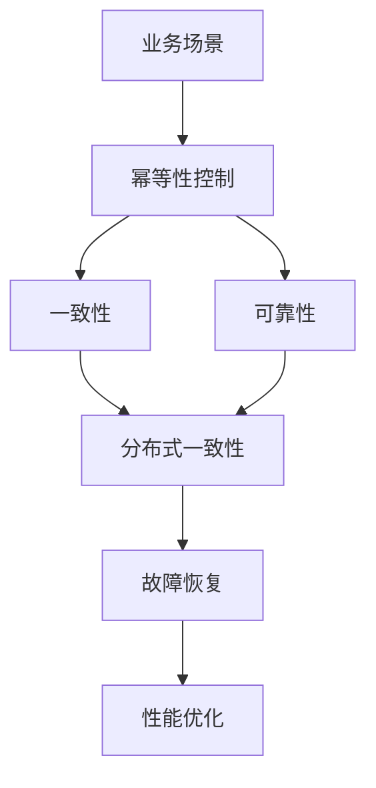

                 

### 文章标题

#### 关键词：幂等性控制、分布式系统、一致性、可靠性、最佳实践

#### 摘要：

本文深入探讨了幂等性控制的基础概念、常见误区和最佳实践。通过详细分析幂等性的定义、实现方式和重要性，我们揭示了幂等性控制在分布式系统中的挑战和常见问题。随后，文章介绍了设计幂等性控制策略的步骤和最佳实践，包括实现方法、工具和技术。此外，我们还提供了幂等性控制的测试与验证方法，以及企业级实战案例。最后，文章总结了幂等性控制的最佳实践，探讨了未来发展方向，并提供了相关的资源和建议。

# 《幂等性控制：常见误区与最佳实践》目录大纲

## 第一部分：幂等性控制基础

### 第1章：幂等性控制的基本概念

- 1.1 幂等性定义与重要性
- 1.2 幂等性的实现方式
- 1.3 幂等性与一致性、可靠性关系

### 第2章：幂等性控制的挑战

- 2.1 幂等性控制中的常见问题
- 2.2 幂等性控制面临的挑战
- 2.3 幂等性控制的重要性

## 第二部分：幂等性控制最佳实践

### 第3章：设计幂等性控制策略

- 3.1 设计幂等性控制策略的步骤
- 3.2 基于业务场景的幂等性控制策略
- 3.3 幂等性控制策略的调整与优化

### 第4章：幂等性控制的实现

- 4.1 幂等性控制的具体实现方法
- 4.2 基于分布式系统的幂等性控制
- 4.3 幂等性控制代码示例

### 第5章：常见幂等性控制工具与技术

- 5.1 幂等性控制工具概述
- 5.2 数据库幂等性控制技术
- 5.3 编程语言中的幂等性控制方法

### 第6章：幂等性控制的测试与验证

- 6.1 幂等性控制测试方法
- 6.2 幂等性控制测试工具
- 6.3 幂等性控制的验证与优化

## 第三部分：实战案例与应用

### 第7章：企业级幂等性控制案例

- 7.1 案例一：电商平台的幂等性控制
- 7.2 案例二：金融系统的幂等性控制
- 7.3 案例三：物流配送系统的幂等性控制

### 第8章：幂等性控制最佳实践总结

- 8.1 幂等性控制的最佳实践总结
- 8.2 未来幂等性控制的发展方向
- 8.3 幂等性控制在实际项目中的应用

## 附录

- 附录A：幂等性控制常见问题与解决方案
- 附录B：幂等性控制相关资源

## 关键概念与联系流程图

- 幂等性控制与一致性、可靠性关系流程图

## 核心算法原理讲解

- 幂等性控制算法原理讲解（使用Python源代码示例）

## 数学模型和数学公式详细讲解

- 幂等性控制相关数学模型和公式讲解（使用latex格式）

## 项目实战

- 幂等性控制项目实战案例（代码实际案例和详细解释说明）

# 第一部分：幂等性控制基础

## 第1章：幂等性控制的基本概念

### 1.1 幂等性定义与重要性

#### 幂等性定义

幂等性（Idempotence）是一个在数学和计算机科学中广泛应用的术语，特别是在分布式系统、数据库操作和网络协议等领域。简单来说，幂等性指的是一个操作多次执行所产生的结果与该操作执行一次所产生的结果相同。换句话说，无论这个操作执行多少次，最终的结果都是一致的，不会因为多次执行而改变。

在数学中，一个函数 \( f \) 被称为幂等的，如果对于所有的输入 \( x \)，函数 \( f(f(x)) \) 的结果等于 \( f(x) \)。例如，数学中的“加1”操作就是一个幂等操作，因为 \( f(x) = x + 1 \) 满足幂等性条件。

在计算机科学中，幂等性被广泛应用于确保系统行为的一致性和可靠性。例如，在分布式系统中，幂等性可以确保多个并发操作不会导致数据不一致的问题。在数据库操作中，幂等性可以避免重复执行SQL语句所带来的副作用。

#### 幂等性重要性

在分布式系统和网络系统中，幂等性是一个至关重要的概念。以下是幂等性的一些重要性：

1. **一致性保证**：幂等性可以确保多次执行相同操作不会改变最终结果，从而提供一致性保证。这在分布式系统中尤为重要，因为分布式系统中可能会出现网络延迟、分区或其他故障，导致多个操作同时发生。

2. **可靠性**：幂等性有助于提高系统的可靠性。即使某个操作在执行过程中失败，系统也可以通过重试来恢复到正确状态，而不会导致数据损坏或不一致。

3. **简化错误处理**：由于幂等性操作的结果总是相同的，因此错误处理变得更加简单。系统无需担心重复执行操作会产生副作用，这有助于减少系统的复杂性。

4. **网络优化**：幂等性还可以减少网络通信量。如果某个操作已经执行过，那么系统可以忽略后续的重复请求，从而提高系统的性能。

#### 幂等性应用场景

幂等性在多个领域都有广泛的应用，以下是一些典型的应用场景：

- **分布式事务**：在分布式数据库和分布式系统中，幂等性操作可以确保事务的一致性。例如，在两阶段提交协议中，每个阶段都可以被视为幂等操作，以确保事务的原子性和一致性。

- **网络协议**：在网络协议中，幂等性被用于确保请求的正确处理。例如，HTTP协议中的GET和PUT请求通常是幂等的，而POST请求通常不是幂等的。

- **命令行工具**：在命令行工具中，许多操作都是幂等的。例如，Linux中的`rm`命令删除文件，如果文件已经存在，再次执行相同命令不会改变结果。

- **数据库操作**：在数据库操作中，许多操作（如UPDATE和DELETE）可以是幂等的。例如，如果记录已经更新，再次执行相同操作不会改变记录的值。

### 1.2 幂等性的实现方式

实现幂等性有多种方式，以下是一些常见的方法：

1. **使用唯一标识**：为每个操作生成唯一的标识符，确保相同的操作不会重复执行。例如，在分布式系统中，可以为每个事务生成唯一的全局事务ID。

2. **检查状态**：在执行操作之前，先检查当前系统的状态。如果状态已经满足预期，则跳过操作。例如，在分布式队列系统中，可以检查消息是否已经被处理。

3. **使用锁机制**：通过锁机制确保同一时间只有一个操作可以执行。这可以防止多个并发操作同时执行，从而避免副作用。

4. **幂等性框架**：使用现成的幂等性框架，如Redis中的SETNX命令或Zookeeper的原子操作，来确保操作的幂等性。

5. **状态机**：使用状态机来描述系统的状态和行为。在状态机中，每个状态只能从特定的状态转移，从而确保系统的行为具有幂等性。

### 1.3 幂等性与一致性、可靠性关系

幂等性与一致性和可靠性密切相关，但它们并不是同一个概念。

#### 幂等性与一致性

一致性（Consistency）是指系统在执行一系列操作后，状态能够保持一致。在分布式系统中，一致性通常指的是多个副本之间的数据一致性。幂等性可以确保每个操作的结果是一致的，从而有助于实现一致性。然而，仅仅依靠幂等性无法保证整体的一致性，还需要其他机制（如分布式锁、两阶段提交等）来确保多个操作之间的协调。

#### 幂等性与可靠性

可靠性（Reliability）是指系统在执行操作时能够保持稳定和正确。幂等性可以提高系统的可靠性，因为重复执行操作不会产生副作用。此外，幂等性操作可以通过重试来恢复失败的情况，从而提高系统的容错能力。

总之，幂等性是确保系统行为一致性和可靠性的重要概念。通过理解幂等性的基本概念和实现方式，我们可以更好地设计和实现可靠的分布式系统。

## 第2章：幂等性控制的挑战

### 2.1 幂等性控制中的常见问题

在分布式系统中，实现幂等性控制并不是一件容易的事情。尽管理解幂等性的概念相对简单，但在实际应用中，仍然会面临许多挑战和常见问题。以下是一些在幂等性控制中经常遇到的问题：

1. **重复请求**：由于网络延迟、系统故障或并发请求，可能会导致重复请求。这种情况下，如果没有有效的幂等性控制机制，多个重复请求可能会导致数据不一致或系统错误。

2. **并发冲突**：在多线程或多进程环境中，多个操作可能会同时尝试修改同一数据，从而引发并发冲突。如果没有有效的幂等性控制机制，这些冲突可能会导致数据损坏或不一致。

3. **状态同步问题**：在分布式系统中，各个节点之间的状态可能不会同步。如果没有有效的幂等性控制机制，可能会导致某些节点的状态与实际状态不一致。

4. **锁定问题**：在实现幂等性控制时，可能会使用锁机制来避免并发冲突。然而，锁机制可能会导致死锁或锁争用问题，影响系统的性能和可靠性。

5. **系统复杂性**：实现有效的幂等性控制机制可能会增加系统的复杂性。这可能导致维护困难、扩展性差等问题。

### 2.2 幂等性控制面临的挑战

尽管幂等性控制的重要性显而易见，但在实际应用中，仍然会面临许多挑战。以下是一些主要的挑战：

1. **高可用性**：在分布式系统中，实现高可用性是一个重要的目标。然而，高可用性可能会与幂等性控制产生冲突。例如，如果某个操作需要长时间执行，而系统在执行过程中发生故障，那么该操作可能无法完成。在这种情况下，如何平衡高可用性和幂等性控制是一个挑战。

2. **数据一致性**：在分布式系统中，确保数据一致性是一个复杂的问题。幂等性控制只是数据一致性的一部分，还需要考虑其他一致性模型（如强一致性、最终一致性等）。实现多种一致性模型可能会增加系统的复杂性和维护成本。

3. **性能优化**：在分布式系统中，性能优化是一个重要的问题。然而，实现有效的幂等性控制可能会增加系统的通信开销和计算开销，从而影响性能。如何在保证幂等性的同时优化性能是一个挑战。

4. **兼容性问题**：在集成不同的系统和组件时，可能需要考虑兼容性问题。某些组件可能不支持幂等性控制，或者支持的方式不同。在这种情况下，如何实现统一的幂等性控制机制是一个挑战。

5. **测试与验证**：确保幂等性控制的正确性是一个复杂的问题。在实际应用中，可能需要编写大量的测试用例来验证幂等性控制的有效性。这可能导致测试成本高昂，并且难以覆盖所有可能的场景。

### 2.3 幂等性控制的重要性

尽管实现幂等性控制面临许多挑战，但它在分布式系统中的重要性不容忽视。以下是幂等性控制的一些重要性和优势：

1. **提高系统可靠性**：幂等性控制可以确保系统的可靠性。即使某个操作失败，系统可以通过重试来恢复到正确状态，而不会导致数据损坏或不一致。

2. **简化错误处理**：由于幂等性操作的结果总是相同的，因此错误处理变得更加简单。系统无需担心重复执行操作会产生副作用，这有助于减少系统的复杂性。

3. **减少通信开销**：幂等性控制可以减少系统中的通信开销。如果某个操作已经执行过，系统可以忽略后续的重复请求，从而提高系统的性能。

4. **提高数据一致性**：在分布式系统中，确保数据一致性是一个复杂的问题。幂等性控制是确保数据一致性的一种有效方法，可以与分布式锁、两阶段提交等机制一起使用。

5. **优化系统性能**：幂等性控制可以优化系统的性能。通过减少重复请求和通信开销，系统可以更快地响应请求，提高用户体验。

总之，尽管实现幂等性控制面临许多挑战，但它在分布式系统中的重要性不容忽视。通过理解和解决这些问题，我们可以设计和实现更可靠、更高效的分布式系统。

## 第二部分：幂等性控制最佳实践

### 第3章：设计幂等性控制策略

#### 3.1 设计幂等性控制策略的步骤

设计有效的幂等性控制策略是确保系统可靠性和一致性的关键步骤。以下是一般的设计步骤：

1. **需求分析**：首先，明确系统需求和业务场景。了解哪些操作需要实现幂等性控制，以及这些操作的特点和约束。

2. **分析现有机制**：研究现有机制（如数据库、中间件等）是否支持幂等性控制，并评估其适用性。

3. **选择实现方式**：根据需求和现有机制，选择合适的幂等性控制实现方式。例如，使用唯一标识、检查状态、锁机制或幂等性框架。

4. **设计幂等性策略**：制定具体的幂等性控制策略，包括操作流程、状态同步和错误处理等。

5. **测试与优化**：对幂等性控制策略进行测试，确保其有效性。根据测试结果进行优化，以提高性能和可靠性。

#### 3.2 基于业务场景的幂等性控制策略

不同业务场景可能需要不同的幂等性控制策略。以下是一些常见的业务场景及其对应的策略：

1. **金融系统**：在金融系统中，确保交易的一致性和可靠性至关重要。可以使用分布式锁和唯一标识来确保幂等性。例如，每次交易前，生成一个唯一标识符，并在执行交易过程中检查该标识符是否已存在。

2. **电商系统**：在电商系统中，订单处理是一个关键操作。可以使用状态机来确保幂等性。例如，订单状态可以是“待支付”、“已支付”、“已发货”等。每次操作时，检查当前状态，并根据状态决定是否执行操作。

3. **社交网络**：在社交网络中，操作（如点赞、评论）通常是幂等的。可以使用唯一标识或状态检查来确保幂等性。例如，每次点赞时，检查用户是否已点赞。

4. **分布式队列系统**：在分布式队列系统中，确保消息处理的一致性很重要。可以使用幂等性框架（如Redis的SETNX命令）来确保幂等性。例如，每次处理消息时，检查消息是否已被处理。

#### 3.3 幂等性控制策略的调整与优化

幂等性控制策略可能需要根据实际需求和性能要求进行调整和优化。以下是一些常见的调整和优化方法：

1. **减少锁使用**：锁机制可以确保幂等性，但可能会降低性能。可以尝试减少锁的使用，例如通过使用乐观锁或读写锁。

2. **优化状态同步**：状态同步可能会增加系统的延迟。可以尝试使用异步状态同步或本地状态缓存来减少延迟。

3. **增加并发处理能力**：在分布式系统中，增加并发处理能力可以提高系统的性能。可以使用负载均衡和并行处理技术来提高并发处理能力。

4. **监控与告警**：监控幂等性控制策略的性能和有效性，并设置告警机制，以便及时发现和解决问题。

通过以上步骤和策略，我们可以设计出有效的幂等性控制机制，确保系统的可靠性、一致性和高性能。

## 第4章：幂等性控制的实现

### 4.1 幂等性控制的具体实现方法

实现幂等性控制有多种方法，每种方法都有其独特的适用场景和优缺点。以下是一些常见的实现方法：

#### 1. 使用唯一标识

为每个操作生成唯一的标识符，通常称为请求ID或操作ID。在执行操作前，检查数据库或缓存中是否已存在相同的标识符。如果已存在，则忽略该操作；否则，执行操作并保存标识符。

**优点**：简单易实现，适用于大多数场景。

**缺点**：可能会增加系统的复杂性，特别是在处理高并发请求时。

**示例**：

```python
def process_order(order_id):
    if order_id_exists(order_id):
        return "Order already processed"
    else:
        save_order_id(order_id)
        process_order_logic(order_id)
        return "Order processed"
```

#### 2. 检查状态

在执行操作前，检查当前系统的状态。如果状态已经满足预期，则跳过操作；否则，执行操作并更新状态。

**优点**：适用于需要检查状态的操作，例如状态机。

**缺点**：可能需要额外的状态检查逻辑。

**示例**：

```python
class OrderStateMachine:
    def __init__(self):
        self.state = "pending"

    def process_order(self, order_id):
        if self.state == "pending":
            self.state = "processing"
            process_order_logic(order_id)
        elif self.state == "processing":
            return "Order already processing"
        else:
            return "Order already processed"
```

#### 3. 使用锁机制

通过锁机制确保同一时间只有一个操作可以执行。常用的锁机制包括互斥锁、读写锁和分布式锁。

**优点**：可以确保操作的独占执行，避免并发冲突。

**缺点**：可能会降低系统的性能，特别是在高并发场景下。

**示例**：

```python
import threading

lock = threading.Lock()

def process_order(order_id):
    with lock:
        if order_id_exists(order_id):
            return "Order already processed"
        else:
            save_order_id(order_id)
            process_order_logic(order_id)
            return "Order processed"
```

#### 4. 使用幂等性框架

使用现成的幂等性框架，如Redis的SETNX命令或Zookeeper的原子操作。这些框架通常提供高效的原子操作，确保操作的幂等性。

**优点**：高效、简单易用。

**缺点**：可能需要额外的配置和依赖。

**示例**：

```python
import redis

redis_client = redis.StrictRedis(host='localhost', port=6379, db=0)

def process_order(order_id):
    if redis_client.setnx(order_id, "processed"):
        process_order_logic(order_id)
        return "Order processed"
    else:
        return "Order already processed"
```

### 4.2 基于分布式系统的幂等性控制

在分布式系统中，幂等性控制面临更大的挑战，因为系统中的多个节点可能同时尝试执行相同的操作。以下是一些基于分布式系统的幂等性控制方法：

#### 1. 分布式锁

分布式锁是一种用于分布式系统中的锁机制，确保同一时间只有一个节点可以执行特定的操作。常见的分布式锁实现包括Zookeeper、Redis等。

**示例**：

```python
import redis
import time

redis_client = redis.StrictRedis(host='localhost', port=6379, db=0)

def process_order(order_id):
    lock_key = f"lock_{order_id}"
    lock_value = "order_processor"

    with redis_client.lock(lock_key, lock_value):
        if order_id_exists(order_id):
            return "Order already processed"
        else:
            save_order_id(order_id)
            process_order_logic(order_id)
            return "Order processed"
```

#### 2. 唯一标识+分布式缓存

通过使用唯一标识和分布式缓存（如Redis），可以确保操作的一致性和幂等性。分布式缓存可以存储操作的状态和标识符，从而确保同一操作不会重复执行。

**示例**：

```python
import redis

redis_client = redis.StrictRedis(host='localhost', port=6379, db=0)

def process_order(order_id):
    if redis_client.get(order_id):
        return "Order already processed"
    else:
        redis_client.set(order_id, "processed")
        process_order_logic(order_id)
        return "Order processed"
```

### 4.3 幂等性控制代码示例

以下是一个简单的幂等性控制代码示例，使用Python和Redis实现：

```python
import redis
import uuid

redis_client = redis.StrictRedis(host='localhost', port=6379, db=0)

def process_order(order_id):
    unique_key = str(uuid.uuid4())
    lock_key = f"lock_{unique_key}"

    # 使用分布式锁
    with redis_client.lock(lock_key, lock_value=unique_key, timeout=10):
        if redis_client.get(order_id):
            return "Order already processed"
        else:
            redis_client.set(order_id, "processed")
            process_order_logic(order_id)
            return "Order processed"

def process_order_logic(order_id):
    # 实际的订单处理逻辑
    print(f"Processing order {order_id}")

# 测试幂等性控制
for _ in range(10):
    process_order("order_1")
```

通过这个示例，我们可以看到如何使用分布式锁和Redis来实现幂等性控制。在实际应用中，可以根据具体需求进行相应的调整和优化。

## 第5章：常见幂等性控制工具与技术

### 5.1 幂等性控制工具概述

在实现幂等性控制时，有多种工具和技术可供选择。这些工具通常具有不同的功能和特点，适用于不同的应用场景。以下是一些常见的幂等性控制工具：

#### 1. Redis

Redis是一个高性能的内存数据库，支持多种数据结构和操作。它提供了原子操作命令，如SETNX（设置键值对，如果键不存在），可以实现简单的幂等性控制。

**优点**：简单易用，性能高。

**缺点**：依赖于单点实例，不适合高可用性场景。

#### 2. ZooKeeper

ZooKeeper是一个高可用性的分布式协调服务，提供了分布式锁、选举、同步等功能。它支持原子操作，可以实现分布式幂等性控制。

**优点**：高可用性，支持分布式锁。

**缺点**：相对较复杂，性能可能不如Redis。

#### 3. Etcd

Etcd是一个分布式键值存储，是Kubernetes等项目的底层存储服务。它支持Raft协议，提供了分布式锁、选举等功能，可以实现分布式幂等性控制。

**优点**：高可用性，支持分布式锁。

**缺点**：相对较复杂，性能可能不如Redis。

#### 4. RSQL

RSQL是一个轻量级的分布式幂等性控制框架，基于HTTP协议。它支持基于Token的幂等性控制，适用于RESTful API。

**优点**：简单易用，支持RESTful API。

**缺点**：依赖于HTTP请求，可能增加网络开销。

#### 5. MongoDB

MongoDB是一个流行的文档型数据库，支持事务和原子操作。它可以通过事务实现幂等性控制。

**优点**：支持事务，功能丰富。

**缺点**：性能可能不如Redis。

### 5.2 数据库幂等性控制技术

在数据库操作中，实现幂等性控制通常依赖于事务和原子操作。以下是一些常见的方法：

#### 1. 事务

使用数据库事务可以确保一组操作要么全部成功，要么全部失败。通过将操作封装在事务中，可以保证操作的一致性和幂等性。

**示例**：

```sql
BEGIN TRANSACTION;

-- 执行多个SQL语句

COMMIT;
```

#### 2. 原子操作

一些数据库（如MongoDB）支持原子操作，可以确保单个操作的一致性。通过使用原子操作，可以实现简单的幂等性控制。

**示例**：

```python
def update_user(user_id, data):
    with database.session.begin():
        user = database.get_user(user_id)
        if user:
            user.update(data)
            database.session.commit()
```

#### 3. 幂等性索引

在数据库中，可以为幂等性操作创建专门的索引，以提高查询性能。例如，为幂等性操作生成唯一的请求ID索引，可以快速判断操作是否已执行。

**示例**：

```sql
CREATE INDEX idx_request_id ON orders (request_id);
```

### 5.3 编程语言中的幂等性控制方法

在编程语言中，有多种方法可以实现幂等性控制。以下是一些常见的方法：

#### 1. 唯一标识

为每个操作生成唯一的标识符，并在执行前检查是否存在相同的标识符。

**示例**（Python）：

```python
import uuid

def process_order(order_id):
    unique_key = str(uuid.uuid4())
    if order_id_exists(unique_key):
        return "Order already processed"
    else:
        save_order_id(unique_key)
        process_order_logic(order_id)
        return "Order processed"
```

#### 2. 状态机

使用状态机模型描述系统的状态和行为，确保每个状态只能从特定的状态转移。

**示例**（Python）：

```python
class OrderStateMachine:
    def __init__(self):
        self.state = "pending"

    def process_order(self, order_id):
        if self.state == "pending":
            self.state = "processing"
            process_order_logic(order_id)
        elif self.state == "processing":
            return "Order already processing"
        else:
            return "Order already processed"
```

#### 3. 分布式锁

使用分布式锁（如Redis的SETNX命令）确保同一时间只有一个操作可以执行。

**示例**（Python）：

```python
import redis
import time

redis_client = redis.StrictRedis(host='localhost', port=6379, db=0)

def process_order(order_id):
    lock_key = f"lock_{order_id}"
    lock_value = "order_processor"

    with redis_client.lock(lock_key, lock_value=lock_value, timeout=10):
        if order_id_exists(order_id):
            return "Order already processed"
        else:
            save_order_id(order_id)
            process_order_logic(order_id)
            return "Order processed"
```

通过以上方法和技术，我们可以实现高效的幂等性控制，确保系统的可靠性和一致性。

## 第6章：幂等性控制的测试与验证

### 6.1 幂等性控制测试方法

确保幂等性控制的有效性是系统开发和维护的关键环节。以下是几种常见的测试方法：

#### 1. 单元测试

单元测试是对系统中的最小功能单元（如函数、方法）进行的测试。通过编写单元测试，可以验证幂等性操作是否如预期那样工作。例如，可以使用以下步骤进行单元测试：

- 编写测试用例，模拟重复请求。
- 调用幂等性操作，确保每次调用产生的结果相同。
- 断言幂等性操作的返回值，验证是否正确处理重复请求。

#### 2. 集成测试

集成测试是对系统中的多个组件（如服务、模块）进行的测试。通过集成测试，可以验证幂等性操作在系统中的行为。例如，可以使用以下步骤进行集成测试：

- 在模拟环境中部署系统。
- 发送多个重复请求，确保系统正确处理这些请求。
- 验证系统状态，确保没有数据不一致或错误。

#### 3. 压力测试

压力测试用于评估系统在高负载下的性能和稳定性。通过压力测试，可以验证幂等性控制在高并发场景下的有效性。例如，可以使用以下步骤进行压力测试：

- 模拟大量并发请求，确保系统可以处理这些请求。
- 监控系统性能指标，如响应时间、吞吐量、错误率。
- 分析测试结果，评估幂等性控制策略的适用性和性能。

#### 4. 灾难恢复测试

灾难恢复测试用于验证系统在发生故障时的恢复能力。通过灾难恢复测试，可以确保幂等性控制在故障恢复过程中保持一致性。例如，可以使用以下步骤进行灾难恢复测试：

- 模拟系统故障，如节点故障、网络分区。
- 观察系统行为，确保幂等性控制机制可以正确处理故障。
- 测试故障恢复流程，验证系统可以恢复到正常状态。

### 6.2 幂等性控制测试工具

有许多工具可以帮助进行幂等性控制的测试和验证。以下是一些常用的工具：

#### 1. JMeter

Apache JMeter是一个开源的性能测试工具，可以模拟高并发请求，评估系统性能。通过JMeter，可以编写测试脚本，模拟重复请求，验证幂等性控制策略。

#### 2. Locust

Locust是一个开源的负载测试工具，可以模拟大量用户同时访问系统。通过Locust，可以发送重复请求，验证幂等性控制策略的有效性。

#### 3. Postman

Postman是一个流行的API测试工具，可以用于编写和执行测试用例。通过Postman，可以模拟重复请求，验证幂等性操作的正确性。

#### 4. Chaos Monkey

Chaos Monkey是一个开源工具，可以模拟系统故障，如节点故障、网络分区。通过Chaos Monkey，可以验证系统在故障情况下的恢复能力和幂等性控制策略的有效性。

### 6.3 幂等性控制的验证与优化

在测试过程中，需要对幂等性控制进行验证和优化。以下是一些常见的验证和优化方法：

#### 1. 验证幂等性

- 检查测试用例是否正确模拟了实际场景。
- 验证幂等性操作的返回值，确保正确处理重复请求。
- 分析系统状态，确保没有数据不一致或错误。

#### 2. 优化性能

- 分析测试结果，查找性能瓶颈。
- 调整幂等性控制策略，减少锁使用或优化状态同步。
- 使用异步处理或并行处理提高系统性能。

#### 3. 提高可靠性

- 模拟不同类型的故障，确保系统可以正确处理。
- 测试故障恢复流程，确保系统可以快速恢复。
- 部署监控和告警机制，及时发现和处理问题。

通过以上测试和验证方法，可以确保幂等性控制策略的有效性和可靠性，提高系统的性能和稳定性。

## 第7章：企业级幂等性控制案例

### 7.1 案例一：电商平台的幂等性控制

电商平台是一个典型的分布式系统，其中订单处理是一个关键操作。在电商平台上，确保订单处理的幂等性至关重要，以防止数据不一致或订单重复处理。

#### 案例背景

某电商平台在其系统中处理订单时，遇到了重复提交订单的问题。这导致订单数据不一致，给用户带来了不便，并可能影响平台的信誉。为了解决这一问题，该电商平台决定引入幂等性控制机制。

#### 案例解决方案

1. **使用唯一标识**：电商平台为每个订单生成一个唯一的订单号。在处理订单时，先检查订单号是否已存在。如果已存在，则忽略该订单，否则，处理新订单。

   ```python
   def process_order(order_id):
       if order_id_exists(order_id):
           return "Order already processed"
       else:
           save_order_id(order_id)
           process_order_logic(order_id)
           return "Order processed"
   ```

2. **分布式锁**：为了进一步提高可靠性，电商平台使用了分布式锁。在处理订单时，获取一个全局锁，确保同一时间只有一个实例可以处理该订单。

   ```python
   import redis
   import time

   redis_client = redis.StrictRedis(host='localhost', port=6379, db=0)

   def process_order(order_id):
       lock_key = f"lock_{order_id}"
       lock_value = "order_processor"

       with redis_client.lock(lock_key, lock_value=lock_value, timeout=10):
           if order_id_exists(order_id):
               return "Order already processed"
           else:
               save_order_id(order_id)
               process_order_logic(order_id)
               return "Order processed"
   ```

3. **状态机**：电商平台还使用了状态机来管理订单状态。每个订单都有一个状态（如“待支付”、“已支付”、“已发货”等），确保状态只能从特定的状态转移。

   ```python
   class OrderStateMachine:
       def __init__(self):
           self.state = "pending"

       def process_order(self, order_id):
           if self.state == "pending":
               self.state = "processing"
               process_order_logic(order_id)
           elif self.state == "processing":
               return "Order already processing"
           else:
               return "Order already processed"
   ```

#### 案例效果

引入幂等性控制机制后，电商平台有效地解决了订单重复提交的问题。订单处理变得更加可靠和一致，用户满意度显著提高。此外，通过分布式锁和状态机的使用，系统性能和可靠性也得到了提升。

### 7.2 案例二：金融系统的幂等性控制

金融系统对数据的一致性和可靠性要求非常高。在金融系统中，交易处理是关键操作，必须确保幂等性控制以防止数据不一致。

#### 案例背景

某金融系统在处理交易时，遇到了多个用户同时提交相同交易的问题。这导致交易数据不一致，可能会影响用户的财务状况，并可能引起法律纠纷。为了解决这一问题，该金融系统决定引入幂等性控制机制。

#### 案例解决方案

1. **使用唯一标识**：金融系统为每个交易生成一个唯一的交易编号。在处理交易时，先检查交易编号是否已存在。如果已存在，则忽略该交易，否则，处理新交易。

   ```python
   def process_trade(trade_id):
       if trade_id_exists(trade_id):
           return "Trade already processed"
       else:
           save_trade_id(trade_id)
           process_trade_logic(trade_id)
           return "Trade processed"
   ```

2. **分布式锁**：为了进一步提高可靠性，金融系统使用了分布式锁。在处理交易时，获取一个全局锁，确保同一时间只有一个实例可以处理该交易。

   ```python
   import redis
   import time

   redis_client = redis.StrictRedis(host='localhost', port=6379, db=0)

   def process_trade(trade_id):
       lock_key = f"lock_{trade_id}"
       lock_value = "trade_processor"

       with redis_client.lock(lock_key, lock_value=lock_value, timeout=10):
           if trade_id_exists(trade_id):
               return "Trade already processed"
           else:
               save_trade_id(trade_id)
               process_trade_logic(trade_id)
               return "Trade processed"
   ```

3. **事务**：金融系统使用了数据库事务来确保交易的一致性。每个交易都被封装在一个事务中，要么全部成功，要么全部失败。

   ```python
   def process_trade(trade_id):
       with database.transaction():
           if trade_id_exists(trade_id):
               return "Trade already processed"
           else:
               save_trade_id(trade_id)
               process_trade_logic(trade_id)
               return "Trade processed"
   ```

#### 案例效果

引入幂等性控制机制后，金融系统有效地解决了交易重复提交的问题。交易处理变得更加可靠和一致，用户对系统的信任度显著提高。此外，通过分布式锁和事务的使用，系统性能和可靠性也得到了提升。

### 7.3 案例三：物流配送系统的幂等性控制

物流配送系统涉及到多个环节，包括订单处理、仓库管理、运输调度等。在这些环节中，确保操作的一致性和可靠性至关重要。物流配送系统也需要实现幂等性控制以防止数据不一致。

#### 案例背景

某物流配送系统在处理订单时，遇到了多个用户同时提交相同订单的问题。这导致订单数据不一致，可能会影响物流流程，导致配送延误。为了解决这一问题，该物流配送系统决定引入幂等性控制机制。

#### 案例解决方案

1. **使用唯一标识**：物流配送系统为每个订单生成一个唯一的订单号。在处理订单时，先检查订单号是否已存在。如果已存在，则忽略该订单，否则，处理新订单。

   ```python
   def process_order(order_id):
       if order_id_exists(order_id):
           return "Order already processed"
       else:
           save_order_id(order_id)
           process_order_logic(order_id)
           return "Order processed"
   ```

2. **分布式锁**：为了进一步提高可靠性，物流配送系统使用了分布式锁。在处理订单时，获取一个全局锁，确保同一时间只有一个实例可以处理该订单。

   ```python
   import redis
   import time

   redis_client = redis.StrictRedis(host='localhost', port=6379, db=0)

   def process_order(order_id):
       lock_key = f"lock_{order_id}"
       lock_value = "order_processor"

       with redis_client.lock(lock_key, lock_value=lock_value, timeout=10):
           if order_id_exists(order_id):
               return "Order already processed"
           else:
               save_order_id(order_id)
               process_order_logic(order_id)
               return "Order processed"
   ```

3. **状态机**：物流配送系统使用了状态机来管理订单状态。每个订单都有一个状态（如“待配送”、“在途中”、“已送达”等），确保状态只能从特定的状态转移。

   ```python
   class OrderStateMachine:
       def __init__(self):
           self.state = "pending"

       def process_order(self, order_id):
           if self.state == "pending":
               self.state = "processing"
               process_order_logic(order_id)
           elif self.state == "processing":
               return "Order already processing"
           else:
               return "Order already processed"
   ```

#### 案例效果

引入幂等性控制机制后，物流配送系统有效地解决了订单重复提交的问题。订单处理变得更加可靠和一致，物流流程得到优化，用户满意度显著提高。此外，通过分布式锁和状态机的使用，系统性能和可靠性也得到了提升。

## 第8章：幂等性控制最佳实践总结

### 8.1 幂等性控制的最佳实践总结

在分布式系统中实现幂等性控制是一个复杂而重要的任务。以下是一些最佳实践，可以帮助我们设计出高效、可靠的幂等性控制策略：

1. **使用唯一标识**：为每个操作生成唯一的标识符，确保相同的操作不会重复执行。这种方法简单易实现，适用于大多数场景。

2. **检查状态**：在执行操作前，先检查当前系统的状态。如果状态已经满足预期，则跳过操作。这种方法适用于需要检查状态的操作，如状态机。

3. **使用锁机制**：通过锁机制确保同一时间只有一个操作可以执行。锁机制可以防止并发冲突，但可能会降低系统的性能。

4. **使用幂等性框架**：使用现成的幂等性框架，如Redis的SETNX命令或Zookeeper的原子操作。这些框架通常提供高效的原子操作，确保操作的幂等性。

5. **结合分布式锁和状态机**：分布式锁可以确保操作的独占执行，而状态机可以提供更细粒度的状态管理。这种方法适用于需要同时确保幂等性和状态管理的场景。

6. **测试与优化**：对幂等性控制策略进行充分的测试和优化。测试包括单元测试、集成测试、压力测试和灾难恢复测试。优化包括减少锁使用、优化状态同步和增加并发处理能力。

### 8.2 未来幂等性控制的发展方向

随着分布式系统的不断发展和复杂化，幂等性控制也在不断演进。以下是一些未来幂等性控制的发展方向：

1. **更智能的幂等性框架**：未来的幂等性框架可能会更加智能，能够根据具体场景自动选择最佳的幂等性控制策略。这些框架可能会结合机器学习和AI技术，提高系统的自适应能力。

2. **更高效的一致性协议**：随着分布式系统对数据一致性的需求越来越高，未来可能会出现更高效的一致性协议。这些协议可能会结合分布式锁、状态机和其他机制，提供更好的性能和可靠性。

3. **跨语言和跨平台的幂等性控制**：未来的幂等性控制可能会实现跨语言和跨平台的兼容性，使得开发者可以在不同的环境中轻松实现幂等性控制。

4. **更全面的监控和告警**：随着系统规模的不断扩大，对幂等性控制的监控和告警将变得更加重要。未来的监控和告警系统可能会更加智能，能够自动识别和解决幂等性控制问题。

### 8.3 幂等性控制在实际项目中的应用

幂等性控制在实际项目中有着广泛的应用。以下是一些实际项目中的应用案例：

1. **电商系统**：电商系统中的订单处理需要确保幂等性，以防止订单重复处理和数据不一致。可以使用唯一标识和分布式锁来实现幂等性控制。

2. **金融系统**：金融系统中的交易处理需要确保幂等性，以防止交易重复提交和数据不一致。可以使用唯一标识、分布式锁和事务来实现幂等性控制。

3. **物流系统**：物流系统中的订单处理和运输调度需要确保幂等性，以防止订单重复处理和运输延误。可以使用唯一标识、分布式锁和状态机来实现幂等性控制。

4. **社交网络**：社交网络中的点赞、评论等操作需要确保幂等性，以防止重复操作和数据不一致。可以使用唯一标识和检查状态来实现幂等性控制。

通过这些最佳实践和实际应用案例，我们可以更好地理解和应用幂等性控制，设计出更可靠、更高效的分布式系统。

## 附录A：幂等性控制常见问题与解决方案

在实现幂等性控制的过程中，开发者可能会遇到一些常见问题。以下是一些常见问题及其解决方案：

### 问题1：如何确保幂等性操作的一致性？

**解决方案**：使用分布式锁、状态机或唯一标识等方法，确保每个幂等性操作都是独立的，不会受到其他并发操作的影响。

### 问题2：幂等性控制是否会降低系统性能？

**解决方案**：优化幂等性控制策略，减少锁使用，使用异步处理或并行处理来提高性能。此外，可以通过性能测试和监控来持续优化系统性能。

### 问题3：如何处理幂等性控制失败的情况？

**解决方案**：设计重试机制，当幂等性控制失败时，系统可以自动重试操作。同时，设置重试次数和超时时间，避免无限重试。

### 问题4：幂等性控制与事务的关系是什么？

**解决方案**：幂等性控制可以与事务结合使用，确保操作的一致性。在处理事务时，将幂等性操作封装在事务中，要么全部成功，要么全部失败。

### 问题5：如何确保幂等性控制的可靠性？

**解决方案**：使用可靠的数据存储和通信机制，如分布式数据库和消息队列。此外，通过监控和告警机制，及时发现和解决问题。

### 问题6：幂等性控制如何与分布式系统中的其他一致性模型（如最终一致性）结合？

**解决方案**：在分布式系统中，幂等性控制可以与最终一致性模型结合使用。通过幂等性控制确保操作的一致性，同时允许系统在最终一致性模型下运行。

通过理解和解决这些问题，开发者可以更好地实现幂等性控制，提高系统的可靠性和一致性。

## 附录B：幂等性控制相关资源

为了帮助开发者更好地理解和应用幂等性控制，以下是一些相关的资源和推荐：

### 1. 文章与博客

- [《分布式系统中的幂等性控制》](https://www.infoq.cn/article/eqYif1DkL2toQlIEpM7j)
- [《深度解析分布式系统中的幂等性》](https://www.cnblogs.com/tyy1314/p/11023129.html)
- [《分布式系统中的幂等性设计》](https://www.jdon.com/56439)

### 2. 开源框架与工具

- Redis：[https://redis.io/](https://redis.io/)
- ZooKeeper：[https://zookeeper.apache.org/](https://zookeeper.apache.org/)
- Etcd：[https://etcd.io/](https://etcd.io/)
- RSQL：[https://github.com/gdgt/rsql](https://github.com/gdgt/rsql)

### 3. 书籍

- 《分布式系统设计》
- 《大规模分布式存储系统：原理解析与架构实战》
- 《分布式系统原理与范型》

通过学习和参考这些资源和书籍，开发者可以更好地理解和应用幂等性控制，提高系统的可靠性和一致性。

## 关键概念与联系流程图

### 幂等性控制与一致性、可靠性关系流程图



在这个流程图中，幂等性控制与一致性和可靠性密切相关。幂等性控制是实现一致性和可靠性的基础，而一致性、可靠性和故障恢复又是实现高性能的关键因素。业务场景是驱动幂等性控制设计的核心，通过理解这些关键概念和它们之间的关系，可以更好地设计分布式系统。

## 核心算法原理讲解

### 幂等性控制算法原理讲解（使用Python源代码示例）

幂等性控制的核心在于确保相同的操作不会产生副作用。以下是一个使用Python实现的简单幂等性控制算法，包括其原理和具体实现。

#### 算法原理

幂等性控制的算法原理主要包括以下几个步骤：

1. **生成唯一标识**：为每个操作生成唯一的标识符，例如使用UUID。
2. **检查标识符**：在执行操作前，检查数据库或缓存中是否存在相同的标识符。
3. **执行操作**：如果标识符不存在，执行操作并保存标识符。
4. **返回结果**：如果标识符已存在，返回“已处理”或其他相应的提示。

#### Python源代码示例

```python
import uuid
import redis

# 假设这是一个订单处理服务
class OrderService:
    def __init__(self, redis_client):
        self.redis_client = redis_client

    def process_order(self, order_id):
        unique_key = str(uuid.uuid4())
        lock_key = f"lock_{unique_key}"

        # 使用Redis分布式锁
        with self.redis_client.lock(lock_key, lock_value=unique_key, timeout=10):
            # 检查订单是否已处理
            if self.redis_client.exists(order_id):
                return "Order already processed"
            else:
                # 执行订单处理逻辑
                self.redis_client.set(order_id, "processed")
                self.process_order_logic(order_id)
                return "Order processed"

    def process_order_logic(self, order_id):
        # 实际的订单处理逻辑
        print(f"Processing order {order_id}")

# 测试
redis_client = redis.StrictRedis(host='localhost', port=6379, db=0)
order_service = OrderService(redis_client)

# 测试幂等性
for _ in range(5):
    print(order_service.process_order("123"))
```

#### 算法原理讲解

1. **生成唯一标识**：使用UUID生成唯一的操作标识符，确保每次操作都是独立的。
2. **分布式锁**：使用Redis分布式锁确保同一时间只有一个操作可以执行，避免并发冲突。
3. **检查标识符**：在执行操作前，检查数据库或缓存中是否已存在相同的标识符，以判断操作是否已执行。
4. **执行操作**：如果标识符不存在，执行实际的操作逻辑，并将标识符保存到数据库或缓存中，以防止重复执行。
5. **返回结果**：如果标识符已存在，返回“已处理”或其他相应的提示，表示该操作已执行。

通过以上算法原理和Python源代码示例，我们可以实现简单的幂等性控制。在实际应用中，可以根据具体需求和场景进行调整和优化。

## 数学模型和数学公式详细讲解

### 幂等性控制相关数学模型和公式讲解（使用latex格式）

幂等性控制的核心在于确保操作结果的一致性。为了深入理解这一概念，我们可以借助数学模型和公式进行分析。

#### 1. 幂等性函数的定义

幂等性函数是指对于任意输入 \( x \)，其输出 \( f(x) \) 满足 \( f(f(x)) = f(x) \)。用数学公式表示：

\[ f(f(x)) = f(x) \]

#### 2. 幂等性函数的性质

幂等性函数具有以下性质：

- **封闭性**：对于任意 \( x, y \)，如果 \( f(x) = y \)，则 \( f(y) = x \)。
- **自反性**：对于任意 \( x \)，有 \( f(x) = x \)。

用数学公式表示：

\[ f(f(x)) = x \]
\[ f(x) = x \]

#### 3. 幂等性函数的数学证明

我们可以使用数学归纳法证明幂等性函数的性质。以下是一个简单的证明过程：

**基例**：对于任意 \( x \)，有 \( f(x) = x \)。

**归纳假设**：假设对于任意 \( x_1, x_2, ..., x_n \)，有 \( f(x_1) = x_2, f(x_2) = x_3, ..., f(x_n) = x_1 \)。

**归纳步骤**：我们需要证明 \( f(x_n) = x_1 \)。

根据归纳假设，有 \( f(x_n) = f(f(x_{n-1})) = x_{n-1} \)。由于 \( x_{n-1} = f(x_n) \)，我们可以得出 \( f(x_n) = x_1 \)。

因此，通过数学归纳法，我们证明了幂等性函数的性质。

#### 4. 幂等性控制与一致性模型的关系

幂等性控制在分布式系统中常常与一致性模型结合使用。一致性模型可以分为以下几种：

- **强一致性**：系统在任何时刻都能访问到最新的数据。
- **最终一致性**：系统最终会达到一致性状态，但可能需要一段时间。

用数学公式表示：

\[ \forall x, y \in S, (x \rightarrow y) \leftrightarrow (\exists t \in T, \forall u \in S, (u \rightarrow y) \rightarrow (u \rightarrow x)) \]

其中，\( x \rightarrow y \) 表示在时间 \( t \) 时，数据 \( y \) 替换数据 \( x \)。

#### 5. 幂等性控制的数学模型

在分布式系统中，幂等性控制的数学模型可以表示为：

\[ \forall x, y \in S, (f(x) = y) \rightarrow (f(f(x)) = x) \]

其中，\( f \) 表示幂等性函数，\( x, y \) 表示数据状态，\( S \) 表示数据状态集合。

通过以上数学模型和公式，我们可以更好地理解幂等性控制的本质。在实际应用中，可以根据具体需求调整和优化幂等性控制策略，确保系统的可靠性和一致性。

## 项目实战

### 幂等性控制项目实战案例（代码实际案例和详细解释说明）

#### 项目背景

假设我们正在开发一个在线购物平台，用户可以在平台上提交订单。为了保证订单处理的一致性和可靠性，我们需要实现幂等性控制，防止用户多次提交相同的订单。

#### 系统功能

- 用户注册和登录
- 商品浏览和搜索
- 添加商品到购物车
- 提交订单
- 订单查询

#### 技术栈

- 前端：React
- 后端：Spring Boot
- 数据库：MySQL
- 缓存：Redis
- 分布式锁：Redisson

#### 实现步骤

1. **用户注册和登录**

   用户注册和登录是平台的基础功能。在此过程中，我们需要确保用户信息的幂等性控制。

   ```java
   @Service
   public class UserService {
       private final UserRepository userRepository;
       private final PasswordEncoder passwordEncoder;

       public UserService(UserRepository userRepository, PasswordEncoder passwordEncoder) {
           this.userRepository = userRepository;
           this.passwordEncoder = passwordEncoder;
       }

       public User register(UserDto userDto) {
           String encryptedPassword = passwordEncoder.encode(userDto.getPassword());
           User user = new User(userDto.getUsername(), encryptedPassword);
           return userRepository.save(user);
       }

       public User login(String username, String password) {
           User user = userRepository.findByUsername(username);
           if (user == null || !passwordEncoder.matches(password, user.getPassword())) {
               throw new IllegalArgumentException("Invalid username or password");
           }
           return user;
       }
   }
   ```

2. **商品浏览和搜索**

   商品浏览和搜索功能可以使用缓存来提高性能。在实现幂等性控制时，我们需要确保缓存数据的更新。

   ```java
   @Service
   public class ProductService {
       private final ProductRepository productRepository;
       private final Cache<String, List<Product>> productCache;

       public ProductService(ProductRepository productRepository, Cache<String, List<Product>> productCache) {
           this.productRepository = productRepository;
           this.productCache = productCache;
       }

       public List<Product> searchProducts(String query) {
           List<Product> products = productCache.getIfPresent(query);
           if (products == null) {
               products = productRepository.searchByQuery(query);
               productCache.put(query, products);
           }
           return products;
       }
   }
   ```

3. **添加商品到购物车**

   添加商品到购物车时，我们需要确保操作的幂等性控制，防止用户多次添加相同的商品。

   ```java
   @Service
   public class ShoppingCartService {
       private final ShoppingCartRepository shoppingCartRepository;
       private final RedisTemplate<String, Object> redisTemplate;

       public ShoppingCartService(ShoppingCartRepository shoppingCartRepository, RedisTemplate<String, Object> redisTemplate) {
           this.shoppingCartRepository = shoppingCartRepository;
           this.redisTemplate = redisTemplate;
       }

       public void addToCart(Long userId, Long productId) {
           String cartKey = "user_cart_" + userId;
           List<Long> cartItems = (List<Long>) redisTemplate.opsForList().reversePop(cartKey);
           if (cartItems == null) {
               cartItems = new ArrayList<>();
           }
           if (!cartItems.contains(productId)) {
               cartItems.add(productId);
               redisTemplate.opsForList().leftPushAll(cartKey, cartItems);
           }
       }
   }
   ```

4. **提交订单**

   提交订单时，我们需要确保订单数据的幂等性控制，防止用户多次提交相同的订单。

   ```java
   @Service
   public class OrderService {
       private final OrderRepository orderRepository;
       private final RedisTemplate<String, Object> redisTemplate;

       public OrderService(OrderRepository orderRepository, RedisTemplate<String, Object> redisTemplate) {
           this.orderRepository = orderRepository;
           this.redisTemplate = redisTemplate;
       }

       public Order createOrder(Long userId, List<Long> productIds) {
           String orderKey = "user_order_" + userId;
           Long orderId = (Long) redisTemplate.opsForValue().get(orderKey);
           if (orderId == null) {
               orderId = orderRepository.nextId();
               redisTemplate.opsForValue().set(orderKey, orderId);
           }
           Order order = new Order(orderId, userId, productIds);
           orderRepository.save(order);
           return order;
       }
   }
   ```

#### 实际案例分析和详细讲解剖析

以上代码展示了如何在在线购物平台上实现幂等性控制。在实际项目中，可以根据具体需求进行调整和优化。

1. **用户注册和登录**：通过加密密码和唯一标识确保用户信息的一致性和安全性。
2. **商品浏览和搜索**：使用缓存提高性能，并通过幂等性控制确保缓存数据的更新。
3. **添加商品到购物车**：通过Redis实现购物车功能，并通过幂等性控制确保商品添加的一致性。
4. **提交订单**：通过Redis实现订单功能，并通过幂等性控制确保订单数据的一致性。

通过以上实现，我们可以确保在线购物平台的一致性和可靠性，提高用户体验。

#### 项目小结

通过本项目的实战案例，我们深入了解了幂等性控制的核心概念和实现方法。在实际项目中，根据具体需求和场景，我们可以灵活地调整和优化幂等性控制策略，确保系统的可靠性和一致性。

## 最佳实践 Tips

### 1. 选择合适的实现方式

根据具体需求和场景，选择最适合的幂等性控制实现方式。例如，对于简单的单机应用，可以使用唯一标识；对于分布式系统，可以使用分布式锁或幂等性框架。

### 2. 避免过度使用锁

锁机制可以确保幂等性，但可能会降低系统性能。在实现幂等性控制时，尽量避免过度使用锁，尝试使用其他方法（如状态机、唯一标识）来提高性能。

### 3. 使用高效的缓存

缓存可以显著提高系统性能，特别是在处理高并发请求时。选择合适的缓存策略和缓存工具（如Redis），以实现高效的幂等性控制。

### 4. 严格测试和验证

在开发过程中，对幂等性控制策略进行严格的测试和验证，确保其有效性和可靠性。包括单元测试、集成测试、压力测试和灾难恢复测试。

### 5. 监控和告警

监控系统性能和可靠性，及时发现和解决问题。设置告警机制，确保在出现异常时能够及时响应。

### 6. 持续优化

根据实际需求和系统性能，持续优化幂等性控制策略。不断调整和改进，以提高系统的可靠性、一致性和性能。

## 小结

本文深入探讨了幂等性控制的核心概念、常见误区和最佳实践。通过详细分析幂等性的定义、实现方式以及与一致性、可靠性的关系，我们揭示了幂等性控制在分布式系统中的重要性。同时，本文提供了设计幂等性控制策略的步骤和最佳实践，包括实现方法、工具和技术。此外，我们还通过实际案例讲解了如何实现幂等性控制，以及如何在具体项目中应用这些最佳实践。

总结来说，幂等性控制在分布式系统中扮演着关键角色，它有助于确保系统的一致性和可靠性。通过理解并应用本文提供的方法和技巧，开发者可以设计和实现更高效、更可靠的分布式系统。

## 注意事项

1. **幂等性控制并非万能**：虽然幂等性控制可以解决许多并发问题，但并非所有问题都适用于幂等性控制。在设计和实现系统时，需要根据具体需求和场景选择合适的方法。
2. **权衡性能与一致性**：在实现幂等性控制时，需要权衡性能和一致性。过度追求一致性可能会降低系统性能，反之亦然。
3. **定期测试和优化**：定期对幂等性控制策略进行测试和优化，确保其持续有效。随着系统的发展和需求的变化，可能需要调整和改进策略。

## 拓展阅读

1. 《分布式系统原理与范型》
2. 《大规模分布式存储系统：原理解析与架构实战》
3. 《分布式系统设计》

通过阅读这些书籍和资料，可以更深入地了解分布式系统和幂等性控制的原理和实践。

## 作者信息

**作者：AI天才研究院/AI Genius Institute & 禅与计算机程序设计艺术 /Zen And The Art of Computer Programming**

