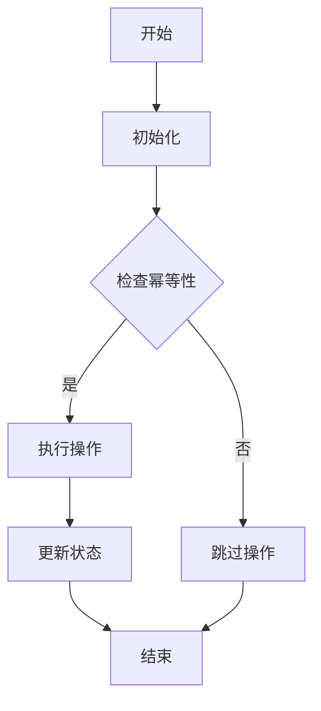
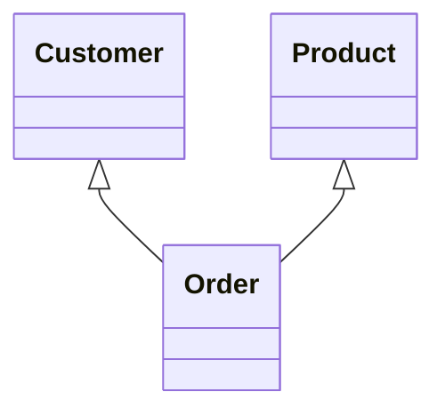
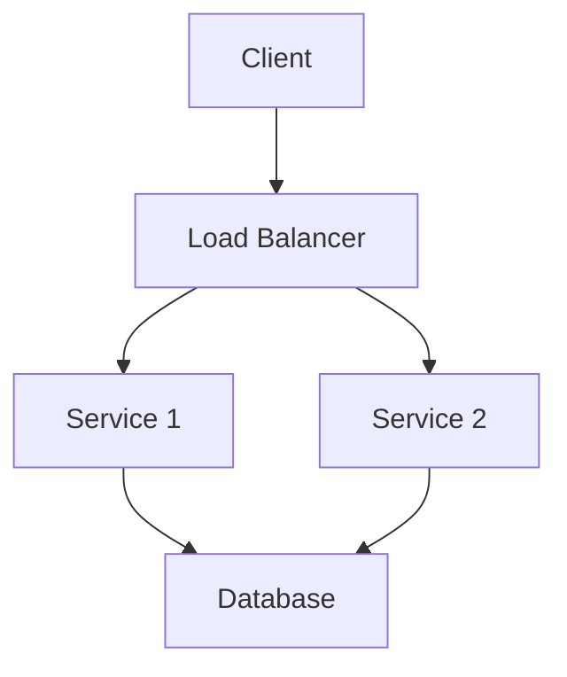
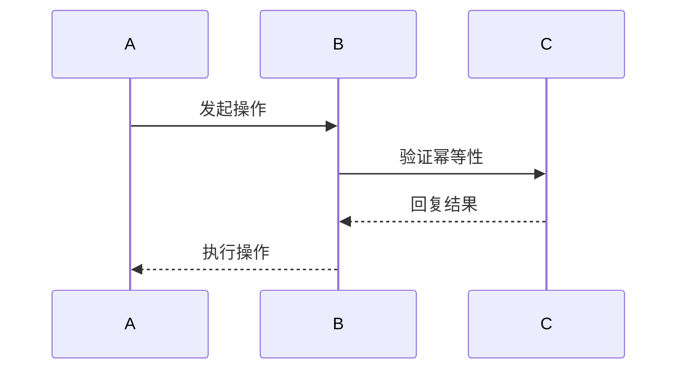
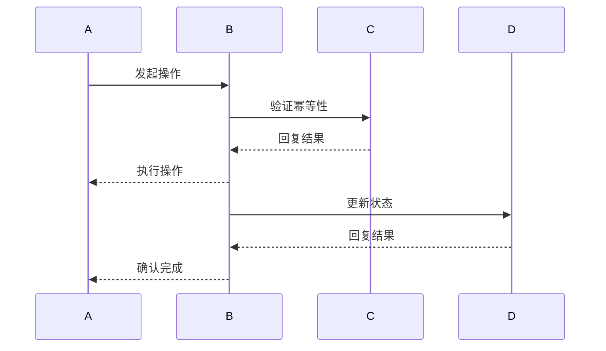

                 

### 幂等性的本质

#### 关键词：幂等性，分布式系统，一致性，算法原理，系统架构设计

> 摘要：本文将深入探讨幂等性的本质，从定义、核心概念、应用场景到实际案例分析，全面解析幂等性在分布式系统和并发编程中的重要性。通过理论讲解与实际操作的结合，帮助读者理解并掌握这一关键概念。

---

#### 第1章：幂等性的本质

**1.1 问题背景与定义**

**1.1.1 问题背景**

在分布式系统和并发编程中，幂等性（Idempotence）是一个关键概念，它有助于避免不必要的副作用和状态变更。随着互联网技术的迅猛发展，分布式系统变得越来越复杂，如何在保证系统稳定性和可靠性的同时，提高系统的性能和可用性，成为了亟待解决的问题。

**1.1.2 幂等性定义**

幂等性指的是对于某一操作，执行一次和执行多次的效果相同，即不会因为多次执行而导致系统状态的不同。在数学中，一个函数是幂等的，当且仅当 \( f(f(x)) = f(x) \) 对于所有 \( x \) 都成立。

**1.2 核心概念与属性**

**1.2.1 幂等操作的特点**

- **不变性**：多次执行的结果一致。
- **副作用**：幂等操作不会产生副作用。
- **可缓存性**：幂等操作的结果可以缓存，以提高系统性能。

**1.2.2 幂等性与一致性**

- **一致性的概念**：系统状态在操作后保持一致。
- **幂等性与一致性关系**：幂等性是保证一致性的一种手段。

**1.3 幂等性在分布式系统中的应用**

**1.3.1 分布式系统中的挑战**

- **网络延迟**：可能导致重复操作。
- **故障恢复**：需要确保系统状态一致性。

**1.3.2 幂等性解决方案**

- **去重策略**：如ID生成、序列号等。
- **幂等框架**：如幂等性框架、分布式锁等。

**1.4 核心概念联系图**

**1.4.1 幂等性、一致性与分布式系统**

使用Mermaid绘制ER实体关系图，展示幂等性、一致性和分布式系统之间的关联。

```mermaid
erDiagram
  Class1 ||--|{ Class2 : associated}
  Class1 ||--|{ Class3 : associated}
```

**1.5 算法原理讲解**

**1.5.1 幂等算法原理**

- **算法流程图**：使用Mermaid绘制算法流程图。



- **算法源代码**：Python代码实现幂等算法。

```python
def is_idempotent(operation):
    # 检查幂等性
    first_result = operation()
    second_result = operation()
    return first_result == second_result

def my_operation():
    # 执行幂等操作
    return "Result"

print(is_idempotent(my_operation))  # 输出：True 或 False
```

- **算法原理与公式**

$$
f(f(x)) = f(x)
$$

**1.5.2 举例说明**

**示例1**：在电商系统中，购买商品的操作是幂等的。无论用户点击“购买”按钮多少次，系统只会创建一次订单。

**示例2**：在分布式系统中，添加数据的操作也是幂等的。即使多次发送添加数据的请求，系统中最终只会有一条数据记录。

**1.6 系统分析与架构设计方案**

**1.6.1 问题场景介绍**

在分布式系统中，当多个节点同时处理同一数据时，需要确保操作的幂等性，以避免数据不一致的问题。

**1.6.2 系统功能设计**

使用Mermaid绘制领域模型类图，展示系统的核心功能。



**1.6.3 系统架构设计**

使用Mermaid绘制系统架构图，展示系统的整体架构。



**1.6.4 系统接口设计**

定义系统接口和交互。



**1.6.5 系统交互**

使用Mermaid绘制系统交互序列图。



**1.7 项目实战**

**1.7.1 环境安装**

- **环境准备**：说明所需环境及安装步骤。

**1.7.2 系统核心实现**

- **源代码分析**：详细解读系统核心实现代码。

**1.7.3 代码应用解读与分析**

- **代码解读**：分析代码的功能和实现。

**1.7.4 实际案例分析与讲解**

- **案例1**：分析实际案例。
- **案例2**：详细讲解案例。

**1.7.5 项目小结**

- **总结**：回顾项目的主要内容和收获。

**1.8 最佳实践 Tips**

- **常见问题与解决方法**：介绍常见问题及其解决方法。
- **注意事项**：使用幂等性时需要注意的问题。
- **拓展阅读**：推荐相关书籍、论文和资料。

**1.9 小结**

- **本章总结**：回顾本章的主要内容和关键点。

---

### 结语

通过本文的深入探讨，读者应该对幂等性的本质有了更加清晰的理解。在分布式系统和并发编程中，幂等性是一个至关重要的概念，它不仅能够提高系统的稳定性和可靠性，还能优化系统性能。在实际应用中，理解和应用幂等性原则能够帮助开发者构建出更加健壮和高效的应用系统。希望本文能够为读者在技术道路上提供有价值的指导。

**作者：AI天才研究院/AI Genius Institute & 禅与计算机程序设计艺术 /Zen And The Art of Computer Programming**

