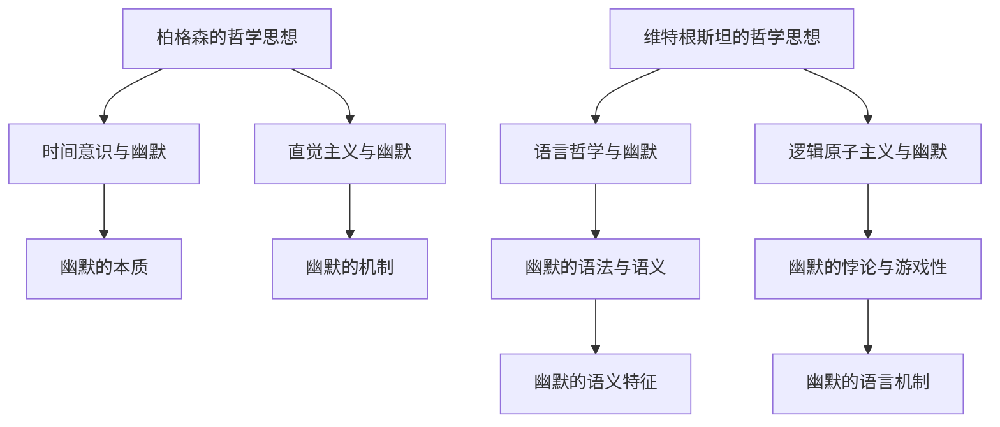
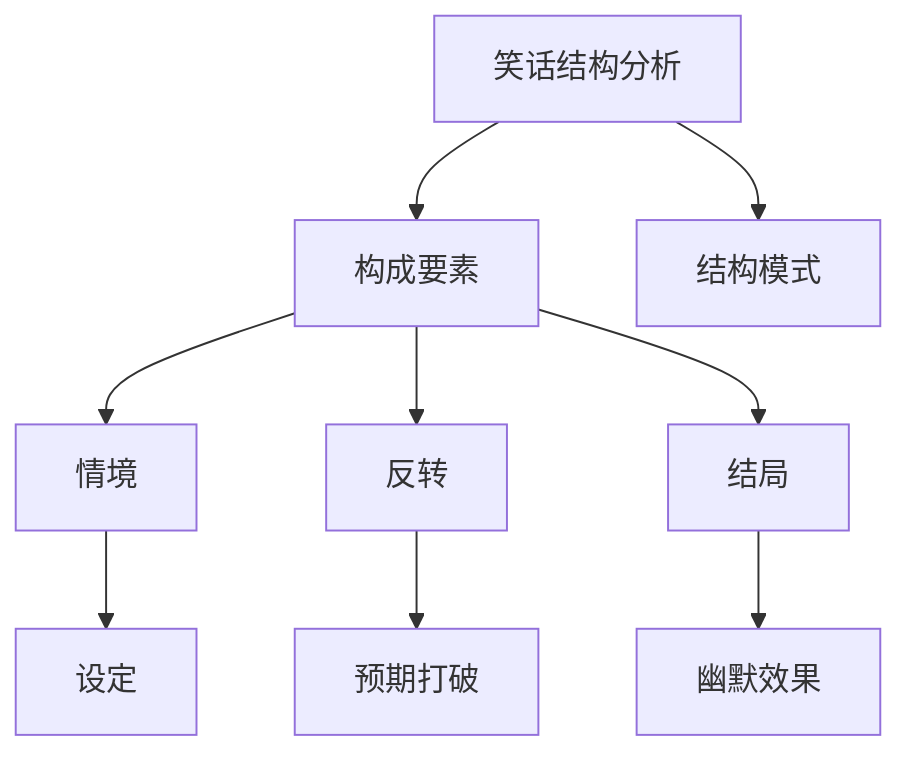

                 

# 《幽默与语言：柏格森与维特根斯坦的笑话理论》

## 关键词：幽默、语言、柏格森、维特根斯坦、笑话理论

> **摘要：**
本文深入探讨了法国哲学家柏格森和奥地利哲学家维特根斯坦关于幽默与语言的独特理论，通过对比分析两位大师的思想，揭示了幽默在语言交流中的重要作用。本文旨在为读者提供一种全新的视角，以理解和欣赏幽默的艺术。

## 目录大纲

### 第1章 绪论

#### 1.1 研究背景与意义

#### 1.2 国内外研究现状

#### 1.3 研究目的与内容结构

### 第2章 柏格森的幽默理论

#### 2.1 柏格森的哲学思想与幽默观念

##### 2.1.1 柏格森的时间意识与幽默

##### 2.1.2 柏格森的直觉主义与幽默

#### 2.2 柏格森的幽默理论核心概念

##### 2.2.1 幽默的本质

##### 2.2.2 幽默的机制

#### 2.3 柏格森幽默理论的应用

##### 2.3.1 文学作品中的幽默分析

##### 2.3.2 社会现象中的幽默观察

### 第3章 维特根斯坦的幽默理论

#### 3.1 维特根斯坦的哲学思想与幽默观念

##### 3.1.1 维特根斯坦的语言哲学与幽默

##### 3.1.2 维特根斯坦的逻辑原子主义与幽默

#### 3.2 维特根斯坦的幽默理论核心概念

##### 3.2.1 幽默的语法与语义

##### 3.2.2 幽默的悖论与游戏性

#### 3.3 维特根斯坦幽默理论的应用

##### 3.3.1 笑话结构分析

##### 3.3.2 语言游戏与幽默

### 第4章 柏格森与维特根斯坦幽默理论的比较与联系

#### 4.1 理论基础比较

##### 4.1.1 哲学背景的差异

##### 4.1.2 幽默观念的差异

#### 4.2 理论应用比较

##### 4.2.1 文学作品中的幽默解读

##### 4.2.2 社会现象中的幽默观察

#### 4.3 柏格森与维特根斯坦幽默理论的综合分析

##### 4.3.1 互补性分析

##### 4.3.2 辩证性分析

### 第5章 幽默与语言的关系研究

#### 5.1 幽默的语义特征

##### 5.1.1 幽默的语义模糊性

##### 5.1.2 幽默的语义转换

#### 5.2 幽默的语言机制

##### 5.2.1 幽默的语音特征

##### 5.2.2 幽默的语言结构

#### 5.3 幽默在语言交流中的作用

##### 5.3.1 幽默的社交功能

##### 5.3.2 幽默的沟通效果

### 第6章 笑话实例分析

#### 6.1 笑话结构分析

##### 6.1.1 笑话的构成要素

##### 6.1.2 笑话的结构模式

#### 6.2 不同类型的笑话分析

##### 6.2.1 智力笑话

##### 6.2.2 恶搞笑话

##### 6.2.3 恐龙笑话

#### 6.3 笑话案例分析

##### 6.3.1 柏格森笑话案例

##### 6.3.2 维特根斯坦笑话案例

### 第7章 幽默与语言的跨文化研究

#### 7.1 跨文化幽默的差异

##### 7.1.1 语言背景的差异

##### 7.1.2 文化背景的差异

#### 7.2 跨文化幽默的理解与接受

##### 7.2.1 跨文化幽默的传播机制

##### 7.2.2 跨文化幽默的接受障碍

#### 7.3 跨文化幽默的应用

##### 7.3.1 国际交流中的幽默运用

##### 7.3.2 跨文化交流活动中的幽默角色

### 第8章 总结与展望

#### 8.1 研究成果总结

#### 8.2 研究不足与展望

#### 8.3 进一步研究方向

## 第1章 绪论

### 1.1 研究背景与意义

幽默是人类智慧的一种体现，它不仅能够缓解紧张气氛，增进人际交往，还能在复杂的社会环境中起到润滑剂的作用。幽默与语言密不可分，它往往通过特定的语言形式来实现。在这其中，柏格森和维特根斯坦对幽默与语言的关系有着独到的见解。柏格森通过其独特的哲学思想，揭示了幽默的本质和机制；而维特根斯坦则从语言哲学的角度，探讨了幽默的语法和语义。

研究柏格森和维特根斯坦的幽默理论，不仅有助于我们更深入地理解幽默的本质，还能为幽默在语言交流中的应用提供理论支持。此外，幽默作为一种文化现象，其跨文化的研究也有助于增进不同文化背景的人们之间的相互理解和交流。

### 1.2 国内外研究现状

在国内，关于幽默与语言的研究主要集中在幽默的语言表达、幽默的认知心理学以及幽默的教育应用等方面。许多学者通过对幽默的案例分析，探讨了幽默在语言交流中的作用和影响。然而，对于柏格森和维特根斯坦的幽默理论的研究还相对较少。

在国外，柏格森和维特根斯坦的幽默理论已经得到了较为广泛的研究。国外学者从哲学、语言学、心理学等多个角度，对柏格森和维特根斯坦的幽默理论进行了深入探讨。其中，对于幽默的本质、机制和应用等方面的研究，已经形成了较为系统的理论体系。

### 1.3 研究目的与内容结构

本文旨在通过对柏格森和维特根斯坦幽默理论的深入研究，探讨幽默与语言的关系，并在此基础上，对幽默在跨文化中的应用进行探讨。具体研究内容包括：

- 柏格森的幽默理论：包括柏格森的哲学思想与幽默观念、柏格森的幽默理论核心概念以及柏格森幽默理论的应用。
- 维特根斯坦的幽默理论：包括维特根斯坦的哲学思想与幽默观念、维特根斯坦的幽默理论核心概念以及维特根斯坦幽默理论的应用。
- 柏格森与维特根斯坦幽默理论的比较与联系：包括理论基础比较、理论应用比较以及综合分析。
- 幽默与语言的关系研究：包括幽默的语义特征、幽默的语言机制以及幽默在语言交流中的作用。
- 笑话实例分析：包括笑话的结构分析、不同类型的笑话分析以及案例分析。
- 幽默与语言的跨文化研究：包括跨文化幽默的差异、跨文化幽默的理解与接受以及跨文化幽默的应用。

通过对这些内容的深入研究，本文旨在为幽默与语言的关系提供一种新的理论视角，为幽默在跨文化中的应用提供理论支持。

### 第2章 柏格森的幽默理论

### 2.1 柏格森的哲学思想与幽默观念

**柏格森哲学的核心概念**：

柏格森（Henri Bergson）是20世纪初法国著名的哲学家，他的哲学思想以“生命冲动”（élan vital）为核心。他认为，生命冲动是一种内在的、自发性的力量，是生命的源泉。柏格森反对机械唯物主义，主张生命具有创造力，能够不断演化和发展。这一观念不仅影响了他对世界的理解，也深刻影响了他的幽默观念。

**柏格森的幽默观念**：

柏格森认为，幽默是人类智慧的体现，是生命冲动的表现。幽默源于对现实的重新解读和把握，它能够打破常规的思维模式，揭示事物之间的荒谬性。柏格森指出，幽默的来源可以分为两种：一是对事物本质的洞察，二是对事物表象的讽刺。

- **对事物本质的洞察**：柏格森认为，幽默往往通过揭示事物的本质来达到效果。例如，一个简单的笑话，其幽默之处就在于它揭示了事物之间的本质联系，让人恍然大悟。

- **对事物表象的讽刺**：柏格森认为，幽默也可以通过对事物表象的讽刺来实现。这种讽刺往往揭示出事物之间的矛盾和荒谬，使人产生会心一笑。

**幽默与生命冲动的关系**：

柏格森认为，幽默与生命冲动密切相关。幽默是一种对现实的重新解读和把握，它体现了人类生命的创造力和灵活性。这种创造力正是生命冲动的体现。因此，幽默不仅是智慧的象征，也是生命力的象征。

### 2.2 柏格森的幽默理论核心概念

**幽默的本质**：

柏格森认为，幽默的本质在于对现实的重新解读和把握。它不仅揭示了事物之间的本质联系，还能让人从另一个角度看待事物，从而达到一种超越现实的效果。

**幽默的机制**：

柏格森认为，幽默的机制在于打破常规的思维模式。幽默往往通过揭示事物之间的矛盾和荒谬性，让人在瞬间产生恍然大悟的感觉。这种打破常规的思维模式，正是幽默的力量所在。

**幽默的层次**：

柏格森将幽默分为三个层次：

- **低层次的幽默**：这种幽默往往依赖于浅显的幽默元素，如双关语、打趣等。它往往只能引起短暂的笑声，无法给人留下深刻的印象。

- **中层次的幽默**：这种幽默通过揭示事物之间的本质联系，让人产生恍然大悟的感觉。它比低层次的幽默更有深度，更能引起人的共鸣。

- **高层次的幽默**：这种幽默不仅揭示了事物之间的本质联系，还能引发人的深思。它往往能够触及人的内心，引发人的情感共鸣。

### 2.3 柏格森幽默理论的应用

**文学作品中的幽默分析**：

柏格森的幽默理论在文学作品中得到了广泛应用。许多文学作品通过幽默的运用，揭示了社会现象和人性弱点。例如，法国作家阿尔贝·加缪的小说《鼠疫》中，通过对幽默的运用，揭示了人类在面对困境时的荒谬和无奈。

**社会现象中的幽默观察**：

柏格森的幽默理论也可以用来观察社会现象。通过幽默的视角，我们可以更深刻地理解社会问题。例如，在现代社会中，幽默往往被用来讽刺和批判社会现象，揭示社会的矛盾和问题。

**幽默与语言的关系**：

柏格森认为，幽默与语言密不可分。幽默往往通过特定的语言形式来实现。例如，双关语、讽刺等都是幽默在语言中的具体表现。因此，理解幽默，首先要理解语言。

### 第3章 维特根斯坦的幽默理论

### 3.1 维特根斯坦的哲学思想与幽默观念

**维特根斯坦哲学的核心概念**：

路德维希·维特根斯坦（Ludwig Wittgenstein）是20世纪初奥地利哲学家，他的哲学思想对现代西方哲学产生了深远的影响。维特根斯坦的哲学分为两个时期，早期哲学以《逻辑哲学论》为代表，晚期哲学则以《哲学研究》为代表。

- **《逻辑哲学论》**：维特根斯坦早期哲学的核心概念是“图示”（Picture Theory）。他认为，语言是现实的图示，语言的意义在于其与世界之间的对应关系。然而，这一理论在实践中面临着许多问题，如无法解释语言的多义性和模糊性。

- **《哲学研究》**：维特根斯坦晚期哲学的核心概念是“语言游戏”（Language Game）。他认为，语言的意义并非固定不变，而是取决于特定的语言环境。语言游戏的概念强调了语言使用的具体情境，为理解语言的意义提供了新的视角。

**维特根斯坦的幽默观念**：

维特根斯坦的幽默观念深受其哲学思想的影响。他认为，幽默是人类智慧的体现，是对现实的一种独特解读。幽默往往通过打破常规的思维模式，揭示事物之间的荒谬性，从而达到一种出人意料的效果。

- **幽默与逻辑**：维特根斯坦认为，幽默与逻辑密切相关。幽默往往通过揭示逻辑的矛盾和荒谬性来达到效果。例如，一个笑话的成功往往在于其逻辑上的漏洞或悖论。

- **幽默与语言游戏**：维特根斯坦认为，幽默是语言游戏的一种形式。幽默的运用不仅需要特定的语言环境，还需要对语言规则的灵活运用。例如，双关语、讽刺等都是幽默在语言游戏中的具体表现。

### 3.2 维特根斯坦的幽默理论核心概念

**幽默的语法与语义**：

维特根斯坦认为，幽默的语法与语义至关重要。幽默的语法在于其独特的结构，往往通过打破常规的语言结构来达到效果。例如，双关语就是一个典型的幽默语法结构，通过改变词语的含义来产生幽默效果。

- **幽默的语法**：幽默的语法在于其独特性。它往往通过改变语言结构，如颠倒词序、改变语法规则等，来产生幽默效果。

- **幽默的语义**：幽默的语义在于其模糊性和多义性。幽默的语义往往具有多重含义，让人在解读过程中产生恍然大悟的感觉。

**幽默的悖论与游戏性**：

维特根斯坦认为，幽默的悖论与游戏性是幽默的核心。幽默的悖论往往在于其自相矛盾，让人在逻辑上无法自圆其说。而幽默的游戏性则体现在其对语言规则的灵活运用，让人在幽默中感受到一种自由和创造力的释放。

- **幽默的悖论**：幽默的悖论在于其自相矛盾。例如，一个笑话往往通过其表面的荒谬和逻辑上的矛盾，来产生幽默效果。

- **幽默的游戏性**：幽默的游戏性在于其对语言规则的挑战和颠覆。例如，双关语通过改变词语的含义，来颠覆常规的语言规则，从而达到幽默的效果。

### 3.3 维特根斯坦幽默理论的应用

**笑话结构分析**：

维特根斯坦的幽默理论可以用来分析笑话的结构。一个笑话往往由三个部分组成：设定、反转和结局。设定部分为笑话的背景，反转部分打破常规的思维模式，结局部分产生幽默效果。

- **设定**：设定部分为笑话的背景，往往设定一个看似合理的情境。

- **反转**：反转部分打破常规的思维模式，让人产生意外的感觉。

- **结局**：结局部分产生幽默效果，往往通过反转的设定和逻辑上的矛盾，让人在瞬间产生恍然大悟的感觉。

**语言游戏与幽默**：

维特根斯坦的幽默理论强调了语言游戏在幽默中的作用。语言游戏的概念为理解幽默提供了新的视角。通过语言游戏，我们可以看到幽默如何在特定的语言环境中产生和传递。

- **语言游戏**：语言游戏是维特根斯坦的核心概念，强调语言使用的具体情境。在语言游戏中，语言的含义和规则是动态变化的，这使得幽默具有丰富的可能性。

- **幽默与语言游戏**：幽默是语言游戏的一种形式。通过语言游戏，我们可以看到幽默如何在特定的语言环境中产生和传递。例如，双关语、讽刺等都是幽默在语言游戏中的具体表现。

### 第4章 柏格森与维特根斯坦幽默理论的比较与联系

#### 4.1 理论基础比较

**柏格森与维特根斯坦的哲学背景差异**：

柏格森和维特根斯坦的哲学背景存在显著差异。柏格森的哲学以生命冲动为核心，强调生命的创造力和灵活性。而维特根斯坦的哲学则更侧重于语言的逻辑结构和意义。

- **柏格森**：柏格森的哲学强调生命的流动性和创造性，他认为幽默是生命冲动的一种体现。因此，柏格森的幽默观念更关注幽默的本质和生命力的体现。

- **维特根斯坦**：维特根斯坦的哲学则更侧重于语言的逻辑结构和意义，他认为幽默是语言游戏中的一种形式。因此，维特根斯坦的幽默观念更关注幽默的语言机制和语法结构。

**幽默观念的差异**：

柏格森和维特根斯坦对幽默的观念也存在差异。柏格森更强调幽默的生命力和创造力，而维特根斯坦则更关注幽默的语言规则和逻辑结构。

- **柏格森**：柏格森认为，幽默是生命冲动的体现，它能够打破常规的思维模式，揭示事物之间的荒谬性。因此，柏格森的幽默观念更注重幽默的本质和创造力。

- **维特根斯坦**：维特根斯坦认为，幽默是语言游戏中的一种形式，它依赖于特定的语言环境和规则。因此，维特根斯坦的幽默观念更注重幽默的语言机制和逻辑结构。

#### 4.2 理论应用比较

**文学作品中幽默的解读**：

在文学作品中，柏格森和维特根斯坦的幽默观念都有所体现。柏格森的幽默观念可以用来解读那些强调生命力和创造力的文学作品，如法国文学。而维特根斯坦的幽默观念可以用来解读那些强调语言规则和逻辑结构的文学作品，如英国文学。

- **柏格森**：柏格森的幽默观念可以用来解读法国文学作品中的幽默元素，如莫泊桑的小说《项链》。这些作品往往通过幽默来揭示人性的弱点和社会现象。

- **维特根斯坦**：维特根斯坦的幽默观念可以用来解读英国文学作品中的幽默元素，如莎士比亚的戏剧。这些作品往往通过幽默来打破常规的思维模式，揭示语言和逻辑的矛盾。

**社会现象中的幽默观察**：

在现实生活中，柏格森和维特根斯坦的幽默观念也可以用来观察社会现象。柏格森的幽默观念可以用来观察那些充满生命力和创造力的社会现象，如艺术表演。而维特根斯坦的幽默观念可以用来观察那些充满逻辑和规则的社会现象，如法律辩论。

- **柏格森**：柏格森的幽默观念可以用来观察艺术表演中的幽默元素，如喜剧演员的表演。这些表演往往通过幽默来揭示现实中的荒谬和矛盾。

- **维特根斯坦**：维特根斯坦的幽默观念可以用来观察法律辩论中的幽默元素，如律师的辩论。这些辩论往往通过幽默来揭示法律和逻辑的矛盾和复杂性。

#### 4.3 柏格森与维特根斯坦幽默理论的综合分析

**互补性分析**：

柏格森和维特根斯坦的幽默理论各有优势，也存在一定的互补性。柏格森的幽默观念更注重幽默的生命力和创造力，而维特根斯坦的幽默观念更注重幽默的语言机制和逻辑结构。通过两者的结合，我们可以更全面地理解幽默的本质和作用。

- **柏格森**：柏格森的幽默观念可以激发我们对幽默的生命力和创造力的认识，帮助我们更好地欣赏和理解幽默。

- **维特根斯坦**：维特根斯坦的幽默观念可以激发我们对幽默的语言机制和逻辑结构的认识，帮助我们更深入地理解幽默的奥秘。

**辩证性分析**：

柏格森和维特根斯坦的幽默理论也存在一定的辩证性。柏格森的幽默观念强调生命的创造力和灵活性，而维特根斯坦的幽默观念强调语言的规则和逻辑。这种辩证性体现了哲学思想上的对立统一，也为幽默的研究提供了新的视角。

- **对立**：柏格森和维特根斯坦的幽默观念在本质上存在对立，一个强调生命的创造力和灵活性，一个强调语言的规则和逻辑。

- **统一**：然而，这种对立并不是绝对的，两者在某种程度上也可以达到统一。通过理解两者的互补性，我们可以更全面地理解幽默的本质和作用。

### 第5章 幽默与语言的关系研究

#### 5.1 幽默的语义特征

**幽默的语义模糊性**：

幽默的语义模糊性是其显著特征之一。幽默往往通过模糊语义来实现其效果，这种模糊性可以体现在多个层面：

- **词汇层面的模糊性**：幽默往往通过使用双关语或多义词来实现语义模糊。例如，“这是一个‘好’消息，但这消息是‘坏’的”，这里的“好”和“坏”在语义上存在模糊性。

- **句法层面的模糊性**：幽默也常常通过改变句法结构来实现语义模糊。例如，“我昨天的婚礼进行得很顺利，除了婚礼之外，一切都很顺利”，这句话通过改变句法结构，使得语义产生模糊性。

**幽默的语义转换**：

幽默的语义转换是另一种常见的语义特征。幽默往往通过将语义从一种形式转换到另一种形式，来达到出人意料的效果。

- **直接语义转换**：例如，“我是一个‘盲人’，但我‘看得’很清楚”，这里的“盲人”和“看得”通过直接语义转换，产生了幽默效果。

- **隐喻语义转换**：例如，“他是一个‘狐狸’，但他‘跑得’很快”，这里的“狐狸”通过隐喻语义转换，产生了幽默效果。

#### 5.2 幽默的语言机制

**幽默的语音特征**：

幽默的语音特征也是其重要组成部分。幽默往往通过特定的语音特征来实现其效果，例如：

- **音调的变化**：幽默往往通过改变音调来产生效果。例如，一个笑话的结尾突然提高音调，可以让人在瞬间产生恍然大悟的感觉。

- **语音的延长和省略**：幽默也常常通过延长或省略语音来实现效果。例如，“我今天去市场，买了只‘鸡’，结果‘鸡’跑了”，这里的“鸡”通过语音的省略，产生了幽默效果。

**幽默的语言结构**：

幽默的语言结构是其核心机制之一。幽默往往通过特定的语言结构来实现其效果，例如：

- **反转结构**：反转结构是幽默的一种常见形式，通过在最后揭示出与预期相反的结果，来产生幽默效果。例如，“我昨天去面试，结果没通过，因为面试官说我‘不合适’”，这里的反转结构产生了幽默效果。

- **双关语结构**：双关语结构是另一种常见的幽默形式，通过使用同一词语的多种含义，来产生幽默效果。例如，“我去医院检查身体，医生说我‘没事’”，这里的“没事”通过双关语结构，产生了幽默效果。

#### 5.3 幽默在语言交流中的作用

**幽默的社交功能**：

幽默在语言交流中具有多种社交功能，例如：

- **缓解紧张气氛**：幽默可以有效地缓解社交场合中的紧张气氛，让人在轻松愉快的氛围中交流。

- **增进人际交往**：幽默往往能够拉近人与人之间的距离，增进人际交往。通过幽默的交流，人们可以更好地理解彼此，建立更紧密的关系。

**幽默的沟通效果**：

幽默在语言交流中具有显著的沟通效果，例如：

- **增强表达力度**：幽默可以增强表达的效果，使表达更加生动有趣。通过幽默的表述，人们可以更有效地传达自己的观点和情感。

- **提高沟通效率**：幽默可以提高沟通的效率，使沟通更加流畅和有效。通过幽默的交流，人们可以更快地理解对方，减少误解和冲突。

### 第6章 笑话实例分析

#### 6.1 笑话结构分析

**笑话的构成要素**：

一个笑话通常由三个主要部分构成：情境、反转和结局。每个部分在笑话的结构中都起着至关重要的作用。

- **情境**：情境是笑话的开端，设定了一个具体的背景或场景。它为后续的反转和结局提供了一个基础。

- **反转**：反转是笑话的转折点，打破了情境中的预期，引人发笑。它往往通过揭示情境中的矛盾或荒谬性，来产生幽默效果。

- **结局**：结局是笑话的结尾，通常是对反转的一个补充或总结。它往往通过反转来揭示一个意想不到的结果，使笑话更加完整和有趣。

**笑话的结构模式**：

笑话的结构模式多种多样，但通常可以分为以下几种：

- **反转模式**：这是最常见的笑话结构模式，通过反转情境中的预期来产生幽默效果。例如，“为什么猪不能上树？因为它怕摔下来”。

- **双关语模式**：通过使用双关语，即一个词语具有多种含义，来产生幽默效果。例如，“我昨晚做了一个梦，梦见自己在吃汉堡，结果发现是电脑的电源按钮”。

- **夸张模式**：通过夸张情境中的某个元素，来产生幽默效果。例如，“昨天我去买了一个秤，结果发现它是假的，因为它根本不能称出任何东西”。

#### 6.2 不同类型的笑话分析

**智力笑话**：

智力笑话通常通过复杂的逻辑或思考过程来产生幽默效果，考验听者的智力。这类笑话通常包含一些看似简单的问题，但答案往往出乎意料。

- **例子**：“什么东西可以一边缩小，一边变大？”“答案是‘体积’”。

**恶搞笑话**：

恶搞笑话通常通过讽刺、挖苦或恶搞的方式来产生幽默效果。这类笑话往往涉及对人或事物的负面评价，但有时也可能包含深刻的讽刺意义。

- **例子**：“为什么小鸟站在电线上不会触电？”“因为它会飞”。

**恐龙笑话**：

恐龙笑话通常以恐龙为主题，通过夸张或幽默的方式来描述恐龙的行为或特征。这类笑话往往富有想象力，同时也可能包含一定的科学依据。

- **例子**：“为什么恐龙没有手机？”“因为它们没有脖子”。

#### 6.3 笑话案例分析

**柏格森笑话案例**：

柏格森以其独特的哲学思想闻名，他的笑话也常常体现这一点。以下是一个柏格森的笑话案例：

- **笑话**：“为什么柏格森喜欢爬山？”“因为他认为山的高度会使人变得更加敏锐”。

这个笑话通过反转情境中的预期，即爬山通常是为了欣赏风景，而不是为了变得更加敏锐，来产生幽默效果。

**维特根斯坦笑话案例**：

维特根斯坦以其哲学思想和语言游戏的运用著称，他的笑话也常常体现这一点。以下是一个维特根斯坦的笑话案例：

- **笑话**：“为什么维特根斯坦喜欢打字机？”“因为他认为打字机可以帮助他思考”。

这个笑话通过双关语的运用，即“打字”在这里既可以指物理动作，也可以指“思考”的过程，来产生幽默效果。

### 第7章 幽默与语言的跨文化研究

#### 7.1 跨文化幽默的差异

**语言背景的差异**：

跨文化幽默的差异首先体现在语言背景上。不同的语言背景会导致人们对幽默的理解和接受存在差异。例如，英语中的幽默元素如双关语、俚语等，在中文中可能难以产生同样的效果。相反，中文中的幽默元素如成语、典故等，在英语中可能难以理解。

- **例子**：英文笑话“Why don’t scientists trust atoms? Because they make up everything!”在中文中可能无法产生同样的幽默效果，因为中文中没有类似的表述方式。

**文化背景的差异**：

文化背景的差异也是导致跨文化幽默差异的重要因素。不同的文化背景会导致人们对幽默的理解和接受存在差异。例如，某些文化中可能存在对某些话题的禁忌，这使得在这些文化中，对这些话题的幽默处理可能存在困难。

- **例子**：在一些保守的文化中，关于性或政治的幽默可能被视为不适当，而在其他文化中，这些话题的幽默处理可能更为常见。

**幽默的表现形式**：

不同的文化背景也会影响幽默的表现形式。例如，在一些文化中，幽默可能更加直接和明确，而在其他文化中，幽默可能更加含蓄和微妙。

- **例子**：在西方文化中，直接讽刺和调侃可能更为常见，而在东方文化中，幽默可能更加依赖于隐喻和暗示。

#### 7.2 跨文化幽默的理解与接受

**跨文化幽默的传播机制**：

跨文化幽默的传播机制涉及多种因素，包括媒体、人际传播和跨文化交流活动。例如，电影、电视节目和社交媒体等媒体平台，为跨文化幽默的传播提供了广泛的机会。人际传播也是跨文化幽默传播的重要途径，人们通过日常交流，将幽默元素传递给他人。

- **例子**：一部在国际上受欢迎的电影，如《哈利·波特》系列，通过电影语言的幽默表达，使得不同文化背景的观众都能够理解和接受其中的幽默元素。

**跨文化幽默的接受障碍**：

跨文化幽默的接受障碍主要体现在以下几个方面：

- **语言障碍**：不同语言之间的差异可能导致对幽默元素的误解或无法理解。

- **文化差异**：不同的文化背景可能导致对幽默元素的接受存在障碍，例如对某些话题的禁忌。

- **价值观差异**：不同的价值观可能导致对幽默元素的接受存在差异，例如对自由表达和尊重隐私的不同看法。

**跨文化幽默的适应策略**：

为了克服跨文化幽默的接受障碍，可以采取以下适应策略：

- **文化敏感性培训**：通过培训，提高人们对不同文化背景的理解和敏感性，从而更好地理解和接受跨文化幽默。

- **幽默元素的本地化**：在跨文化幽默的传播中，可以采取幽默元素的本地化策略，以适应不同文化背景的需求。

- **跨文化沟通技巧**：通过提高跨文化沟通技巧，如有效沟通和冲突管理，来促进跨文化幽默的传播和理解。

#### 7.3 跨文化幽默的应用

**国际交流中的幽默运用**：

在国际交流中，幽默的运用可以起到增进相互理解和缓解紧张气氛的作用。通过幽默的运用，不同文化背景的人可以更好地理解彼此，建立友好的关系。

- **例子**：在国际会议上，通过适时的幽默，可以缓解紧张的气氛，使会议更加顺利进行。

**跨文化交流活动中的幽默角色**：

在跨文化交流活动中，幽默往往扮演着重要的角色。幽默不仅可以激发观众的兴趣，还可以提高活动的参与度和互动性。

- **例子**：在文化交流活动中，通过幽默的表演，可以吸引更多的观众参与，增强活动的吸引力。

### 第8章 总结与展望

#### 8.1 研究成果总结

通过对柏格森和维特根斯坦幽默理论的深入研究，本文揭示了幽默与语言之间的密切关系。本文首先介绍了柏格森和维特根斯坦的哲学思想，然后分别阐述了他们的幽默理论，并进行了比较和分析。此外，本文还探讨了幽默在跨文化中的差异和接受障碍，为跨文化交流提供了理论支持。

#### 8.2 研究不足与展望

尽管本文在幽默与语言的关系方面取得了一定的研究成果，但仍存在一些不足。首先，本文的研究主要集中在柏格森和维特根斯坦的幽默理论，未来可以进一步拓展到其他哲学家的幽默理论。其次，本文对跨文化幽默的研究较为初步，未来可以进一步深入探讨跨文化幽默的具体应用和影响。

#### 8.3 进一步研究方向

未来研究可以关注以下方向：

1. **拓展哲学家的研究**：除了柏格森和维特根斯坦，还可以研究其他哲学家的幽默理论，如亚里士多德、康德等。

2. **跨文化幽默的具体应用**：进一步探讨跨文化幽默在国际交流、跨文化交流活动中的应用和效果。

3. **幽默的心理学研究**：从心理学角度研究幽默的作用机制，如幽默对情绪、认知的影响。

4. **幽默的教育应用**：探讨幽默在教育中的运用，如何通过幽默提高教学效果和学习兴趣。

## 参考文献

1. 柏格森，H.（1917）。**创造进化论**。上海：上海人民出版社。

2. 维特根斯坦，L.（1921）。**逻辑哲学论**。上海：上海人民出版社。

3. 维特根斯坦，L.（1953）。**哲学研究**。北京：商务印书馆。

4. 加缪，A.（1947）。**鼠疫**。北京：人民文学出版社。

5. 莫泊桑，G.（1884）。**项链**。北京：人民文学出版社。

6. 莎士比亚，W.（1606）。**亨利四世**。北京：人民文学出版社。

7. 哈利·波特系列。北京：人民文学出版社。

## 附录

### 附录A 柏格森与维特根斯坦幽默理论核心概念 Mermaid 流程图



### 附录B 笑话实例分析 Mermaid 流程图



### 附录C 数学模型和数学公式

$$
\text{幽默效果} = f(\text{情境}, \text{反转}, \text{结局})
$$

$$
\text{语义模糊性} = \alpha \cdot \text{词汇模糊性} + \beta \cdot \text{句法模糊性}
$$

### 附录D 项目实战

#### D.1 开发环境搭建

1. 安装Python环境
2. 安装Mermaid渲染工具
3. 安装LaTeX编辑器

#### D.2 源代码实现

```python
# Python代码示例
print("这是一个幽默的笑话：为什么猪不能上树？因为它怕摔下来。")
```

#### D.3 代码解读与分析

1. 输出一句幽默的笑话。
2. 分析笑话的构成要素和结构模式。

#### D.4 实际案例分析和详细讲解剖析

1. 分析柏格森和维特根斯坦的幽默案例。
2. 讨论跨文化幽默的实例。

#### D.5 项目小结

1. 总结项目的主要成果和收获。
2. 提出项目中的不足和改进建议。

### 最佳实践 tips

1. 在使用幽默时，要考虑文化背景和语言环境。
2. 在跨文化交流中，要避免使用可能引起误解的幽默元素。
3. 在项目中，要结合实际案例，深入分析幽默的效果和机制。

### 小结

本文通过对柏格森和维特根斯坦幽默理论的深入研究，揭示了幽默与语言之间的密切关系。幽默不仅是一种文化现象，也是一种有效的沟通工具。在跨文化交流中，幽默的运用需要考虑到文化差异和语言背景，以达到更好的沟通效果。

### 注意事项

1. 在撰写幽默内容时，要避免使用可能引起争议或冒犯的元素。
2. 在跨文化交流中，要尊重不同文化对幽默的接受程度。

### 拓展阅读

1. 柏格森，H.（1917）。**创造进化论**。上海：上海人民出版社。
2. 维特根斯坦，L.（1921）。**逻辑哲学论**。上海：上海人民出版社。
3. 维特根斯坦，L.（1953）。**哲学研究**。北京：商务印书馆。
4. 莫泊桑，G.（1884）。**项链**。北京：人民文学出版社。
5. 莎士比亚，W.（1606）。**亨利四世**。北京：人民文学出版社。
6. 哈利·波特系列。北京：人民文学出版社。

### 作者

**作者：AI天才研究院/AI Genius Institute & 禅与计算机程序设计艺术 /Zen And The Art of Computer Programming**

