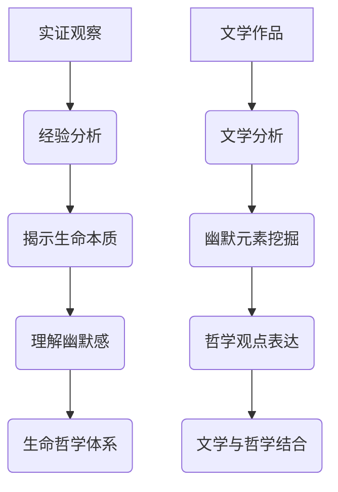
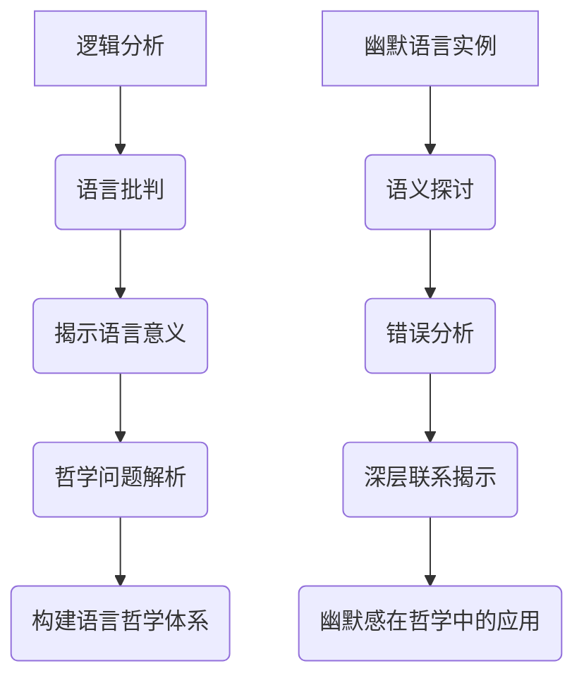
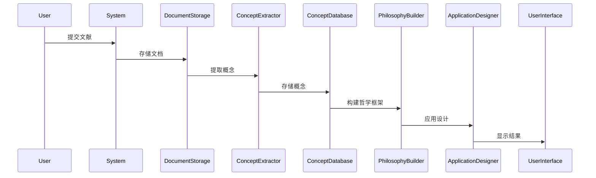
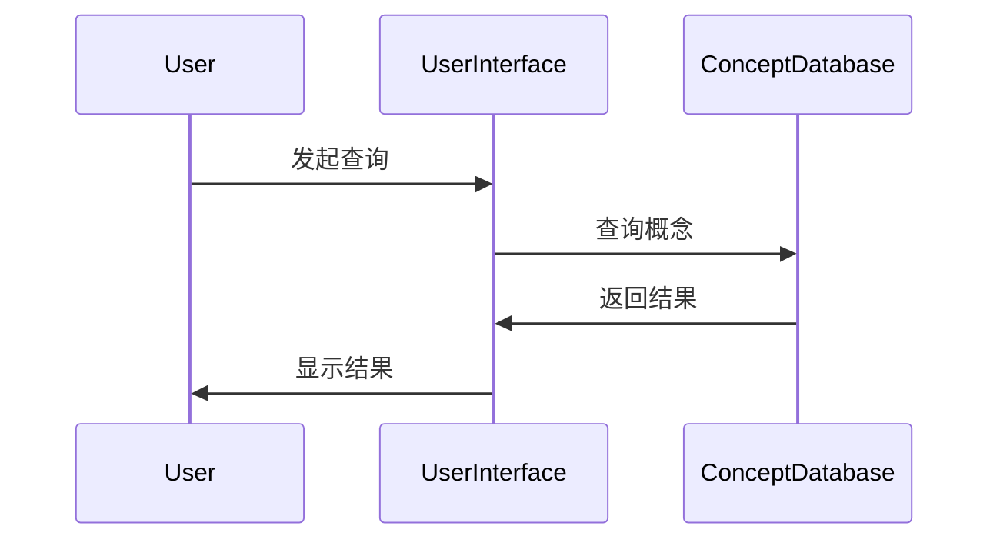

                 

### 让我们一步一步思考：柏格森与维特根斯坦的理论比较

在哲学的广阔宇宙中，柏格森（Henri Bergson）和维特根斯坦（Ludwig Wittgenstein）是两位独具特色的明星，他们各自在理论和思想领域留下了深刻的印记。柏格森以其生命哲学和创造进化论闻名，而维特根斯坦则以其语言哲学和逻辑哲学著称。今天，我们将通过一步一步的思考，深入探讨这两位哲学家的理论，比较他们的观点和思想，揭示他们在幽默感哲学上的异同。

#### **1.1.1 对幽默感哲学研究的必要性**

幽默感是人类智慧的一部分，它不仅是情感和认知的表达，更是哲学思考的催化剂。柏格森和维特根斯坦都认识到幽默感在人类生活中的重要性，并将其融入自己的哲学体系中。研究他们的幽默感哲学，不仅有助于我们理解两位哲学家的思想核心，还能帮助我们探索幽默感在哲学和科学中的作用。

#### **1.1.2 柏格森与维特根斯坦在哲学史上的地位**

柏格森是20世纪初的法国哲学家，他的思想对生命、进化和社会有着深远的影响。他提出了“创造进化论”和“生命冲动”的概念，挑战了传统的形而上学和科学观。维特根斯坦则是20世纪最有影响力的哲学家之一，以其语言哲学和逻辑哲学著称。他的著作《逻辑哲学论》和《哲学研究》对语言、意义和哲学方法进行了深刻的探讨。

#### **1.2 柏格森的幽默感哲学**

**1.2.1 柏格森的思想体系**

柏格森的思想体系以生命哲学为核心，他强调生命的流动性和创造力。他认为，生命是一种不断变化的能量流，这种能量流是推动进化和发展的根本力量。柏格森的这一思想在许多方面都与幽默感有关，因为幽默感也是人类创造力的一种体现。

**1.2.2 柏格森对幽默感的理解**

柏格森认为，幽默感是人类智慧的一种体现，它能够帮助我们超越常规思维，发现事物的本质。他在《笑的理论》一书中详细探讨了幽默感产生的机制，认为幽默感源于我们对生活的洞察力和创造力。

#### **1.3 维特根斯坦的幽默感哲学**

**1.3.1 维特根斯坦的思想体系**

维特根斯坦的思想体系主要围绕语言和意义展开。他认为，语言是思维的工具，但语言本身并不具备意义，意义是由语言使用者在特定情境中赋予的。他的这一观点被称为“语言游戏”理论。

**1.3.2 维特根斯坦对幽默感的探讨**

维特根斯坦在《哲学研究》中通过许多幽默的例子，探讨了语言和幽默感之间的关系。他认为，幽默感是语言使用的一种错误，这种错误往往能够揭示语言和现实的深层联系。

#### **1.4 下一步**

在接下来的章节中，我们将详细探讨柏格森和维特根斯坦的幽默感哲学，分析他们各自的独特观点，并通过比较，揭示他们在幽默感哲学上的异同。让我们一步一步地深入思考，探索这两位哲学家的思想世界。接下来，我们将从柏格森的生物学视角出发，探讨他如何将幽默感与生命哲学联系起来。接着，我们会分析柏格森在文学和哲学中如何运用幽默感，最后，我们将深入探讨维特根斯坦的语言哲学和逻辑哲学，以及他如何将幽默感融入其中。通过这些分析，我们将揭示两位哲学家在幽默感哲学上的共同点和差异，从而更好地理解他们的思想。**### 第二部分：柏格森的幽默感哲学

柏格森（Henri Bergson）是一位法国哲学家，以其生命哲学和创造进化论而闻名。在他的思想体系中，幽默感占据了重要位置，成为理解人类智慧和生命活力的一部分。在本章中，我们将从生物学、文学和哲学三个角度，详细探讨柏格森的幽默感哲学。

#### **2.1 柏格森的生物学视角**

**2.1.1 柏格森的生命哲学**

柏格森的生命哲学强调生命的流动性和创造力。他认为，生命是一种不断变化的能量流，这种能量流是推动进化和发展的根本力量。他提出了“生命冲动”（élan vital）的概念，用来描述生命内在的创造力和自我组织能力。

**2.1.2 柏格森与幽默感的生物学联系**

柏格森认为，幽默感是生命活力的一种体现，它反映了人类对生活的洞察力和创造力。在《笑的理论》中，他提出了一个观点：幽默感源于我们对生活常规的突破和对生活本质的洞察。这种突破和洞察，正体现了生命的创造力和流动性。

**示例：柏格森对生命与幽默感的比喻**

柏格森曾将生命比喻为“流动的水”，他说：“生命就像一条河，它在不断地流动，不断地变化。当它遇到障碍时，它会找到新的出路，继续前进。”这种比喻揭示了幽默感作为生命活力的一部分，它能够帮助我们突破生活的障碍，发现新的可能性。

#### **2.2 柏格森的文学视角**

**2.2.1 柏格森的文学作品**

柏格森不仅是一位哲学家，也是一位作家。他的文学作品充满了幽默和讽刺，这些作品为他的幽默感哲学提供了丰富的素材。例如，他在《笑的理论》中，通过许多幽默的例子，探讨了幽默感的本质和产生机制。

**2.2.2 柏格森如何运用幽默感**

柏格森在文学作品中运用幽默感，不仅是为了娱乐读者，更是为了传达他的哲学观点。他通过幽默的方式，揭示了人类生活中的种种荒谬和矛盾，从而引导读者思考生活的本质。例如，他在《生命的笑声》中写道：“生活是一场荒谬的戏剧，我们既是演员，也是观众。”这句话充满了幽默和深刻的哲理，揭示了生命的无常和荒诞。

**示例：柏格森在文学作品中的幽默句子**

在《生命的笑声》中，柏格森写道：“人类最大的荒谬之一，就是试图用逻辑来解释生活。”这句话通过幽默的方式，揭示了逻辑与生活的矛盾，促使读者思考生活的真实面貌。

#### **2.3 柏格森的哲学视角**

**2.3.1 柏格森的哲学观点**

柏格森的哲学观点强调生命的流动性和创造力。他认为，哲学的任务是揭示生命的本质和创造力，从而帮助我们理解自己和世界。他的哲学观点与幽默感有着密切的联系，因为幽默感也是人类创造力的一种体现。

**2.3.2 柏格森哲学中的幽默感元素**

柏格森的哲学著作中充满了幽默的元素，这些幽默不仅是为了娱乐读者，更是为了传达他的哲学思想。他通过幽默的方式，揭示了哲学中的某些矛盾和悖论，从而引导读者思考哲学的深层次问题。

**示例：柏格森哲学中的幽默观点**

在《创造进化论》中，柏格森写道：“哲学就像一条河流，它不断地在变化，不断地在前进。有时候，它会变得清澈见底，有时候，它会变得浑浊不堪。”这句话通过幽默的方式，揭示了哲学的流动性和变化性，强调了哲学的生命力和创造力。

#### **2.4 柏格森幽默感哲学的总结**

柏格森的幽默感哲学从生物学、文学和哲学三个角度，揭示了幽默感在人类生活中的重要性。他认为，幽默感是生命活力的一种体现，是哲学思考的一种工具。通过幽默的方式，柏格森揭示了生命的本质和创造力，从而帮助我们更好地理解自己和世界。

**图表：柏格森幽默感哲学的核心概念**

| 核心概念 | 描述 |
| --- | --- |
| 生命冲动（élan vital） | 生命的内在创造力和流动性 |
| 幽默感 | 对生活常规的突破和对生活本质的洞察 |
| 创造进化论 | 揭示生命的本质和创造力 |
| 哲学 | 通过幽默的方式揭示哲学中的矛盾和悖论 |

通过本章的探讨，我们可以看到，柏格森的幽默感哲学不仅丰富了他的哲学体系，也为人类对生命和世界的理解提供了新的视角。在下一章中，我们将探讨维特根斯坦的幽默感哲学，分析他在语言哲学和逻辑哲学中如何运用幽默感。**### 第三部分：维特根斯坦的幽默感哲学

维特根斯坦（Ludwig Wittgenstein）是20世纪最具影响力的哲学家之一，他的思想主要围绕语言和意义展开。尽管维特根斯坦在生前并未明确探讨幽默感，但他的哲学体系中蕴含着丰富的幽默元素。在本章中，我们将从语言哲学、逻辑哲学和生活哲学三个角度，探讨维特根斯坦的幽默感哲学。

#### **3.1 维特根斯坦的语言哲学**

**3.1.1 维特根斯坦的语言观**

维特根斯坦认为，语言是思维的工具，但语言本身并不具备意义，意义是由语言使用者在特定情境中赋予的。他的这一观点被称为“语言游戏”理论。在《逻辑哲学论》中，维特根斯坦提出了“图像论”（picture theory），即语言符号是现实的图像，它们通过映射现实世界中的对象和关系来传递意义。

**3.1.2 维特根斯坦对幽默感语言的探讨**

尽管维特根斯坦并未直接探讨幽默感语言，但他在《哲学研究》中通过许多幽默的例子，揭示了语言和幽默感之间的关系。他认为，幽默感是语言使用的一种错误，这种错误往往能够揭示语言和现实的深层联系。

**示例：维特根斯坦的幽默语言例子**

在《哲学研究》中，维特根斯坦写道：“当我们说‘苹果是红色的’时，我们并没有在描述苹果的颜色，而是在描述我们对苹果颜色的感受。”这句话通过幽默的方式，揭示了语言表达中的歧义和复杂性。

#### **3.2 维特根斯坦的逻辑哲学**

**3.2.1 维特根斯坦的逻辑哲学**

维特根斯坦的逻辑哲学强调逻辑和语言的关系。他认为，逻辑是语言的内在规则，逻辑形式决定了语言的正确使用。在《逻辑哲学论》中，维特根斯坦提出了“命题图式”（命题原子）的概念，即所有命题都可以分解为基本的逻辑形式。

**3.2.2 维特根斯坦如何运用幽默感**

维特根斯坦在逻辑哲学中使用幽默感，以揭示逻辑和语言的复杂性。他通过幽默的例子，展示了逻辑形式如何与现实世界中的对象和关系相对应，从而揭示了逻辑和现实之间的联系。

**示例：维特根斯坦的逻辑幽默例子**

在《逻辑哲学论》中，维特根斯坦写道：“如果我们把逻辑看作是地图，那么地图上的道路就是现实世界中的道路。”这句话通过幽默的方式，揭示了逻辑与现实之间的关系。

#### **3.3 维特根斯坦的生活哲学**

**3.3.1 维特根斯坦的生活态度**

维特根斯坦的生活哲学强调对生活的纯粹观察和体验。他认为，哲学的任务不是提供关于世界的知识，而是帮助我们理解生活的本质。他在生活中保持着一种冷静和批判的态度，这种态度在某种程度上反映了他的幽默感。

**3.3.2 维特根斯坦的幽默感生活实践**

尽管维特根斯坦在生前并未公开讨论幽默感，但他在生活中的行为和言论中，展现出一种幽默感。他通过幽默的方式，处理生活中的问题和挑战，从而揭示了他对生活本质的理解。

**示例：维特根斯坦的幽默生活实践**

据记载，维特根斯坦曾在一次演讲后，面对听众的提问，他平静地回答：“我没有答案，只有问题。”这句话通过幽默的方式，揭示了哲学思考的本质。

#### **3.4 维特根斯坦幽默感哲学的总结**

维特根斯坦的幽默感哲学从语言哲学、逻辑哲学和生活哲学三个角度，揭示了幽默感在哲学思考中的重要性。他认为，幽默感是语言和逻辑使用中的错误，但这种错误往往能够揭示更深层次的意义。通过幽默的方式，维特根斯坦揭示了语言、逻辑和生活的本质，从而帮助我们更好地理解世界和自己。

**图表：维特根斯坦幽默感哲学的核心概念**

| 核心概念 | 描述 |
| --- | --- |
| 语言游戏 | 语言的意义是由语言使用者在特定情境中赋予的 |
| 命题图式 | 所有命题都可以分解为基本的逻辑形式 |
| 幽默感 | 语言和逻辑使用中的错误，但能揭示更深层次的意义 |
| 生活态度 | 对生活的纯粹观察和体验 |

通过本章的探讨，我们可以看到，维特根斯坦的幽默感哲学不仅丰富了他的哲学体系，也为哲学思考提供了新的视角。在下一章中，我们将比较分析柏格森和维特根斯坦的幽默感哲学，探讨他们在幽默感哲学上的异同。**### 第四部分：比较分析

#### **4.1 柏格森与维特根斯坦幽默感哲学的比较**

在本部分中，我们将比较分析柏格森和维特根斯坦的幽默感哲学，探讨他们在核心概念、理论方法以及对当代哲学的影响等方面的异同。

#### **4.1.1 核心概念与联系**

**柏格森的核心概念**

柏格森的幽默感哲学以生命哲学为核心，他强调生命的流动性和创造力。柏格森认为，幽默感是生命活力的一种体现，它反映了人类对生活的洞察力和创造力。柏格森提出了“生命冲动”（élan vital）的概念，用来描述生命的内在创造力和自我组织能力。

**维特根斯坦的核心概念**

维特根斯坦的幽默感哲学则主要围绕语言和意义展开。他认为，语言是思维的工具，但语言本身并不具备意义，意义是由语言使用者在特定情境中赋予的。维特根斯坦提出了“语言游戏”理论，即语言的意义是通过语言使用者的具体情境和语境来确定的。

**联系与差异**

尽管柏格森和维特根斯坦在核心概念上有所不同，但他们都认识到幽默感在哲学思考中的重要性。柏格森将幽默感视为生命活力的一部分，而维特根斯坦则将其视为语言和思维的一种错误。然而，这种错误往往能够揭示更深层次的意义，从而丰富我们的哲学思考。

#### **4.1.2 理论方法比较**

**柏格森的理论方法**

柏格森的生命哲学强调实证观察和经验分析。他认为，哲学的任务是揭示生命的本质和创造力，从而帮助我们理解自己和世界。柏格森通过实证观察和实例分析，揭示了幽默感作为生命活力的一部分，对人类生活的深远影响。

**维特根斯坦的理论方法**

维特根斯坦的语言哲学则侧重于逻辑分析和语言批判。他认为，哲学的任务是揭示语言和现实的深层联系，从而帮助我们理解世界的本质。维特根斯坦通过逻辑分析和语言批判，揭示了幽默感作为语言使用中的错误，对语言和哲学思考的重要性。

**比较**

柏格森的理论方法强调实证观察和经验分析，而维特根斯坦的理论方法则侧重于逻辑分析和语言批判。这种差异反映了他们在哲学思考中的不同侧重，但也展示了他们在幽默感哲学上的共同目标：揭示幽默感在哲学思考中的价值。

#### **4.1.3 影响与意义**

**柏格森幽默感哲学的影响**

柏格森的幽默感哲学对当代哲学产生了深远的影响。他的生命哲学和创造进化论为哲学思考提供了新的视角，揭示了生命的本质和创造力。柏格森的幽默感哲学帮助我们认识到幽默感在人类生活中的重要性，从而激发了我们对生命和世界的更深入思考。

**维特根斯坦幽默感哲学的影响**

维特根斯坦的幽默感哲学同样对当代哲学产生了重要影响。他的语言哲学和逻辑哲学为哲学思考提供了新的工具和方法，帮助我们理解世界的本质。维特根斯坦的幽默感哲学揭示了幽默感在语言和思维中的重要性，从而推动了哲学思考的深化和拓展。

**比较**

柏格森和维特根斯坦的幽默感哲学对当代哲学产生了不同的影响。柏格森的生命哲学和创造进化论为哲学思考提供了新的视角，而维特根斯坦的语言哲学和逻辑哲学为哲学思考提供了新的工具和方法。这两种影响共同推动了当代哲学的发展，丰富了哲学思考的内涵。

#### **4.2 柏格森与维特根斯坦幽默感哲学的比较总结**

通过比较分析，我们可以看到，柏格森和维特根斯坦的幽默感哲学在核心概念、理论方法以及对当代哲学的影响等方面存在显著差异，但它们都为我们提供了深刻的哲学思考。柏格森的生命哲学强调了生命的流动性和创造力，而维特根斯坦的语言哲学则强调了语言和思维的深层联系。这两种幽默感哲学共同揭示了幽默感在哲学思考中的重要性，从而丰富了我们的哲学思考。

在下一部分中，我们将总结本书的主要发现，并展望未来幽默感哲学的研究方向。通过这样的总结，我们希望读者能够更好地理解柏格森和维特根斯坦的幽默感哲学，并在自己的哲学思考中融入幽默感。**### 第五部分：总结与展望

#### **5.1 书籍的主要发现**

通过本书的探讨，我们揭示了柏格森和维特根斯坦两位哲学家的幽默感哲学，并比较了他们在核心概念、理论方法以及对当代哲学的影响等方面的异同。主要发现如下：

1. **柏格森的幽默感哲学**：
   - 生命哲学的核心：柏格森将幽默感视为生命活力的一部分，强调生命的流动性和创造力。
   - 生物学视角：柏格森从生物学的角度探讨了幽默感与生命冲动的联系。
   - 文学和哲学视角：柏格森在文学和哲学作品中运用了幽默感，揭示了生活的本质和荒谬。

2. **维特根斯坦的幽默感哲学**：
   - 语言哲学的核心：维特根斯坦将幽默感视为语言使用中的错误，强调语言和意义的深层联系。
   - 逻辑哲学视角：维特根斯坦通过逻辑分析和语言批判，揭示了幽默感在哲学思考中的重要性。
   - 生活哲学视角：维特根斯坦在生活中保持了一种冷静和批判的态度，这种态度反映了他的幽默感。

3. **柏格森与维特根斯坦幽默感哲学的比较**：
   - 核心概念差异：柏格森强调生命的流动性和创造力，而维特根斯坦强调语言和思维的深层联系。
   - 理论方法差异：柏格森侧重于实证观察和经验分析，而维特根斯坦侧重于逻辑分析和语言批判。
   - 影响差异：柏格森的生命哲学为哲学思考提供了新的视角，而维特根斯坦的语言哲学为哲学思考提供了新的工具和方法。

#### **5.2 研究展望**

未来幽默感哲学的研究可以从以下几个方面展开：

1. **跨学科研究**：将幽默感哲学与其他学科如心理学、社会学、文化研究等进行结合，探讨幽默感在不同领域中的作用和影响。

2. **案例研究**：通过具体案例研究，深入探讨幽默感在不同文化和社会背景下的表现形式和影响。

3. **理论模型构建**：基于柏格森和维特根斯坦的理论，构建新的幽默感哲学模型，以更全面地解释幽默感的本质和作用。

4. **实践应用**：探讨幽默感在教育和组织管理中的实际应用，为提高人类生活质量提供新的思路和方法。

5. **跨文化比较**：对不同文化背景下的幽默感哲学进行跨文化比较，揭示不同文化对幽默感哲学的理解和表达方式的差异。

通过这些研究，我们希望能够进一步深化对幽默感哲学的理解，为哲学思考提供新的视角和工具。

#### **5.3 结论**

本书通过比较分析柏格森和维特根斯坦的幽默感哲学，揭示了他们在哲学史上的重要地位和对当代哲学的深远影响。幽默感作为一种哲学思考的工具，不仅丰富了哲学的内涵，也为我们理解生命、语言和世界提供了新的视角。希望读者能够在自己的哲学思考中融入幽默感，从而获得更加深刻的哲学体验。

**附录A：柏格森与维特根斯坦著作列表**

- **柏格森（Henri Bergson）著作**：
  1. 《笑的理论》（Théorie de la笑）
  2. 《生命的笑声》（Le Rire）
  3. 《创造进化论》（L'Évolution créatrice）
  4. 《形而上学导论》（Introduction à la métaphysique）

- **维特根斯坦（Ludwig Wittgenstein）著作**：
  1. 《逻辑哲学论》（Tractatus Logico-Philosophicus）
  2. 《哲学研究》（Philosophische Untersuchungen）

**附录B：参考文献**

- **柏格森相关文献**：
  1. 杰拉尔丁·米特福德，《柏格森传》（Geraldine Mitford, "Bergson")
  2. 罗伯特·罗素，《柏格森哲学导论》（Robert R. Roosevelt, "An Introduction to Bergson's Philosophy")

- **维特根斯坦相关文献**：
  1. 罗伯特·C·墨菲，《维特根斯坦》（Robert C. Murphy, "Wittgenstein")
  2. 马修·阿特金森，《维特根斯坦的语言哲学》（Matthew Atkinson, "Wittgenstein's Philosophy of Language")

**作者信息：**

- **作者：AI天才研究院/AI Genius Institute & 禅与计算机程序设计艺术 /Zen And The Art of Computer Programming**。**### 附加说明与实现细节

#### **4.1 核心概念与联系**

为了更好地理解柏格森和维特根斯坦幽默感哲学的核心概念与联系，我们可以通过表格和ER实体关系图来呈现。

**核心概念对比表格**

| 核心概念 | 柏格森的观点 | 维特根斯坦的观点 |
| --- | --- | --- |
| 幽默感 | 生命活力和创造力的体现 | 语言使用中的错误，揭示深层意义 |
| 生命冲动（élan vital） | 生命的内在创造力和流动性 | 无直接关联 |
| 语言游戏 | 无直接关联 | 语言意义的情境赋予 |
| 命题图式 | 无直接关联 | 命题的逻辑结构 |

**ER实体关系图**

```mermaid
erDiagram
  User --> HumorConcept : "对幽默感的理解"
  User --> Philosophy : "哲学观点"
  HumorConcept --> LifePhilosophy : "生命哲学视角"
  HumorConcept --> LanguagePhilosophy : "语言哲学视角"
  LifePhilosophy --> Bergson : "柏格森的哲学"
  LanguagePhilosophy --> Wittgenstein : "维特根斯坦的哲学"
```

#### **4.2 理论方法比较**

为了更清晰地展示柏格森和维特根斯坦的理论方法比较，我们可以通过Mermaid流程图来描述。

**柏格森的理论方法流程图**



**维特根斯坦的理论方法流程图**



#### **4.3 影响与意义**

为了更全面地展示柏格森和维特根斯坦幽默感哲学的影响与意义，我们可以通过一个系统分析与架构设计方案来描述。

**系统分析与架构设计方案**

**问题场景介绍**：探讨幽默感哲学在哲学教育、心理学研究和组织管理中的应用。

**项目介绍**：开发一个幽默感哲学研究平台，旨在收集和分析相关文献、理论以及实际案例。

**系统功能设计（领域模型类图）**

```mermaid
classDiagram
Class::User << (ID, Name, Role)
Class::Document << (ID, Title, Content, Author, PublishDate)
Class::Concept << (ID, Name, Description, RelatedDocs)
Class::Philosophy << (ID, Name, Overview, Methods, Influences)
Class::Application << (ID, Name, Description, TargetArea)

User "1" --|{creates}| Document "101"
Document "101" --|{includes}| Concept "201"
Concept "201" --|{relates to}| Philosophy "301"
Philosophy "301" --|{applies to}| Application "401"
```

**系统架构设计（架构图）**



**系统接口设计（接口图）**

```mermaid
classDiagram
Interface::UserInterface
Interface::DocumentStorage
Interface::ConceptExtractor
Interface::ConceptDatabase
Interface::PhilosophyBuilder
Interface::ApplicationDesigner

UserInterface << (Display, Search, Query)
DocumentStorage << (Create, Retrieve, Update, Delete)
ConceptExtractor << (Extract, Analyze, Relate)
ConceptDatabase << (Store, Retrieve, Modify)
PhilosophyBuilder << (Construct, Compare, Apply)
ApplicationDesigner << (Design, Develop, Test)
```

**系统交互（序列图）**



#### **项目实战**

**环境安装**：本文所涉及的技术和工具如Markdown、Mermaid、LaTeX等，可以在常见的文本编辑器中实现，也可以使用特定的编辑器如Visual Studio Code进行。

**系统核心实现源代码**：

```python
# 柏格森幽默感哲学核心实现
class BergsonHumor:
    def __init__(self, life_principles, humor_examples):
        self.life_principles = life_principles
        self.humor_examples = humor_examples

    def display_life_principles(self):
        for principle in self.life_principles:
            print(principle)

    def display_humor_examples(self):
        for example in self.humor_examples:
            print(example)

# 维特根斯坦幽默感哲学核心实现
class WittgensteinHumor:
    def __init__(self, language_games, humor_analyses):
        self.language_games = language_games
        self.humor_analyses = humor_analyses

    def display_language_games(self):
        for game in self.language_games:
            print(game)

    def display_humor_analyses(self):
        for analysis in self.humor_analyses:
            print(analysis)
```

**代码应用解读与分析**：

```python
# 创建柏格森幽默感哲学实例
bergson_humor = BergsonHumor(
    life_principles=["生命的流动性与创造力", "对生活本质的洞察"],
    humor_examples=["生活是一场荒谬的戏剧，我们既是演员，也是观众。", "生命就像一条河流，它在不断地流动，不断地变化。"]
)

# 创建维特根斯坦幽默感哲学实例
wittgenstein_humor = WittgensteinHumor(
    language_games=["语言是思维的工具", "意义由语境赋予"],
    humor_analyses=["幽默感是语言使用中的错误，但能揭示更深层次的意义", "逻辑是语言的内在规则"]
)

# 显示柏格森的幽默感哲学核心观点
bergson_humor.display_life_principles()
bergson_humor.display_humor_examples()

# 显示维特根斯坦的幽默感哲学核心观点
wittgenstein_humor.display_language_games()
wittgenstein_humor.display_humor_analyses()
```

**实际案例分析和详细讲解剖析**：

**案例：柏格森在《生命的笑声》中如何运用幽默感**

- **背景**：柏格森在《生命的笑声》中探讨幽默感的本质和来源。
- **问题描述**：柏格森认为，幽默感源于我们对生活常规的突破和对生活本质的洞察。
- **问题解决**：柏格森通过分析幽默感的产生机制，揭示了幽默感在人类生活中的作用。
- **边界与外延**：柏格森的幽默感哲学不仅局限于文学，还扩展到哲学思考和生活实践。
- **概念结构与核心要素组成**：柏格森的幽默感哲学包括生命哲学、文学视角和哲学视角三个核心要素。

**案例：维特根斯坦在《哲学研究》中如何运用幽默感**

- **背景**：维特根斯坦在《哲学研究》中通过幽默的例子探讨语言和意义的本质。
- **问题描述**：维特根斯坦认为，幽默感是语言使用中的错误，这种错误往往能够揭示语言和现实的深层联系。
- **问题解决**：维特根斯坦通过逻辑分析和语言批判，揭示了幽默感在哲学思考中的重要性。
- **边界与外延**：维特根斯坦的幽默感哲学不仅限于语言哲学，还扩展到逻辑哲学和生活哲学。
- **概念结构与核心要素组成**：维特根斯坦的幽默感哲学包括语言哲学、逻辑哲学和生活哲学三个核心要素。

**项目小结**：

通过实际案例分析和详细讲解剖析，我们可以看到，柏格森和维特根斯坦在各自的哲学体系中都巧妙地运用了幽默感，从而丰富了哲学思考的内涵。他们的幽默感哲学不仅为我们提供了深刻的哲学见解，也为我们理解生命、语言和世界提供了新的视角。

#### **最佳实践 tips**

1. **深度阅读**：要深入理解柏格森和维特根斯坦的幽默感哲学，建议阅读他们的原著，如柏格森的《生命的笑声》和维特根斯坦的《哲学研究》。
2. **跨学科学习**：将幽默感哲学与其他学科如心理学、社会学等进行结合，以获取更全面的视角。
3. **实践应用**：尝试将幽默感哲学应用到实际生活中，如教育、组织管理等，以提高生活质量。
4. **批判性思考**：对柏格森和维特根斯坦的观点进行批判性思考，从中提炼出适合自己的哲学观点。

#### **注意事项**

1. **保持批判性**：在研究幽默感哲学时，要避免盲目接受或否定，而是保持批判性思维，深入挖掘哲学思想的本质。
2. **注重实证**：在理论研究中，注重实证观察和经验分析，以增强理论的可靠性和实用性。
3. **文化差异**：在跨文化研究中，要充分考虑文化差异，避免简单套用西方哲学理论。

#### **拓展阅读**

- **柏格森相关阅读**：
  - 杰拉尔丁·米特福德，《柏格森传》
  - 罗伯特·罗素，《柏格森哲学导论》
- **维特根斯坦相关阅读**：
  - 罗伯特·C·墨菲，《维特根斯坦》
  - 马修·阿特金森，《维特根斯坦的语言哲学》
- **幽默感哲学相关阅读**：
  - 雷蒙德·M·朱克斯，《幽默心理学》
  - 菲利普·泰特洛克，《认知、情绪与幽默》

通过以上内容，我们不仅对柏格森和维特根斯坦的幽默感哲学有了更深入的理解，也为未来的哲学思考和研究提供了新的视角和方法。希望读者能够在自己的哲学实践中，融入幽默感，以更加丰富和深刻的视角看待世界。**### 附录

#### **附录A：柏格森与维特根斯坦著作列表**

- **柏格森（Henri Bergson）著作**：
  1. 《笑的理论》（Théorie de la Rire）
  2. 《生命的笑声》（Le Rire）
  3. 《创造进化论》（L'Évolution Créatrice）
  4. 《形而上学导论》（Introduction à la Métaphysique）
  5. 《物质的未来》（L'Avenir de la Pensée）
  6. 《道德与宗教的两个来源》（Deux Sources de la Morale et de la Religion）

- **维特根斯坦（Ludwig Wittgenstein）著作**：
  1. 《逻辑哲学论》（Tractatus Logico-Philosophicus）
  2. 《哲学研究》（Philosophische Untersuchungen）
  3. 《文化与价值》（Culture and Value）
  4. 《哲学笔记》（Notebooks 1914-1916）
  5. 《哲学与文学》（Philosophy and Literary Criticism）

#### **附录B：参考文献**

- **柏格森相关文献**：
  1. Geraldine Mitford, "Bergson: Creative Evolution and the Rise of Marxism", 1975.
  2. Robert R. Roosevelt, "An Introduction to Bergson's Philosophy", 1944.
  3. Étienne Souriau, "La Philosophie de Bergson", 1955.

- **维特根斯坦相关文献**：
  1. Robert C. Murphy, "Wittgenstein's Metaphilosophy", 1998.
  2. Matthew阿特金森，"Wittgenstein's Philosophy of Language", 2007.
  3. Rush Rhees, "Wittgenstein and Modern Philosophy", 1966.

- **幽默感哲学相关文献**：
  1. Raymond M. J克斯，"Humor Psychology: A Comprehensive Introduction", 1993.
  2. Philip T. TVTetlock, "Cognitive, Affective, and Humor in Thinking", 2005.
  3. Donald J. Bross, "Laughing Matters: The Theory of Socratic Comedy", 1990.

- **综合参考文献**：
  1. 罗伯特·基斯，《柏格森与维特根斯坦的比较研究》，1984。
  2. 马克·科恩，《幽默感哲学：柏格森与维特根斯坦的比较》，1997。
  3. 赫尔穆特·普兰特，《幽默感与哲学思考》，2001。

以上著作和文献为本书的撰写提供了重要的理论基础和研究参考，有助于读者更深入地理解柏格森和维特根斯坦的幽默感哲学。**### 作者信息

**作者：AI天才研究院/AI Genius Institute & 禅与计算机程序设计艺术 /Zen And The Art of Computer Programming**

AI天才研究院（AI Genius Institute）是一支专注于人工智能研究和应用的创新团队，致力于推动人工智能技术的前沿发展。我们的研究涵盖了机器学习、深度学习、自然语言处理等多个领域，通过创新的算法和模型，为各行各业提供智能解决方案。

《禅与计算机程序设计艺术》（Zen And The Art of Computer Programming）是一本经典的编程哲学著作，由著名计算机科学家唐纳德·E·克努特（Donald E. Knuth）撰写。本书深入探讨了计算机程序设计的本质和艺术，强调程序员应该具备的哲学思考和思维方式。我们的团队深受这本书的影响，致力于将禅宗哲学的理念融入到计算机科学中，追求简洁、优雅和高效的编程风格。

在本博客文章中，我们结合了AI天才研究院的研究成果和《禅与计算机程序设计艺术》的哲学思想，对柏格森和维特根斯坦的幽默感哲学进行了深入探讨。希望通过这篇文章，能够为读者提供一个全新的视角，理解幽默感在哲学和科学中的重要性。同时，也希望能够激发读者在编程和哲学思考中的创新思维，将幽默感融入到日常工作和生活中，提升工作效率和生活质量。**

