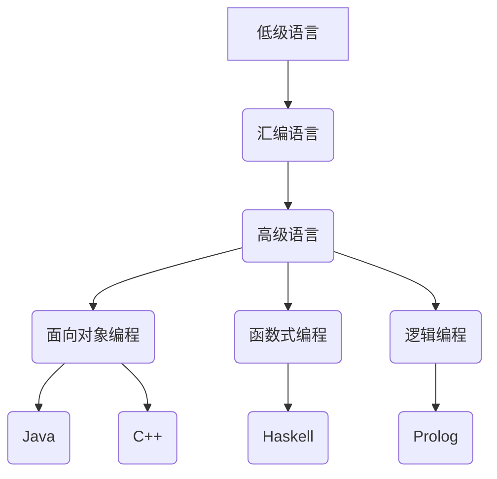

                 

### 库恩的范式转换与编程语言的演进：技术革命的结构

> **关键词**：库恩范式转换、编程语言、技术革命、软件开发、人工智能

> **摘要**：本文将探讨库恩的范式转换理论在编程语言演进中的应用，分析技术革命对编程语言的影响，并探讨未来编程语言的发展趋势。通过深入剖析编程语言的发展历程、范式转换的机制以及其在技术创新和社会进步中的作用，本文旨在为读者提供对编程语言演进及其影响的有益思考。

### 引言

编程语言作为计算机科学的基础工具，自其诞生以来就经历了无数次的变革和创新。从早期的机器语言和汇编语言，到现代的高级编程语言，编程语言的发展不仅改变了软件开发的模式，也推动了整个计算机科学领域的进步。库恩（Thomas S. Kuhn）的范式转换理论提供了一个全新的视角，使我们能够更好地理解技术革命对编程语言的影响及其背后的机制。

范式转换是库恩科学哲学中的重要概念，指的是科学共同体在一定时期内所共同接受的基本假设、理论框架和研究方法。当这些基本假设或理论框架不再适应科学发展的需要时，科学共同体便会经历一次范式转换，从而开启新的科学研究阶段。本文旨在通过库恩的范式转换理论，分析编程语言的演进过程，揭示技术革命在其中的作用和影响。

### 第一部分：范式转换的哲学基础

#### 第1章：库恩与范式理论

1.1 库恩与科学哲学

托马斯·库恩（Thomas S. Kuhn）是20世纪最具影响力的科学哲学家之一。他的著作《科学革命的结构》（The Structure of Scientific Revolutions）提出了范式转换（Paradigm Shift）这一核心概念，并对科学发展模式进行了深刻的分析。库恩认为，科学并非一个线性进步的过程，而是一个不断变化的范式转换过程。

1.2 范式转换的概念与过程

范式转换指的是科学共同体在一定时期内所共同接受的基本假设、理论框架和研究方法。当这些基本假设或理论框架不再适应科学发展的需要时，科学共同体便会经历一次范式转换，从而开启新的科学研究阶段。

范式转换的过程通常包括以下几个阶段：

- **常规科学**：科学共同体在既定范式下进行常规科学研究，积累知识和解决具体问题。
- **危机**：既定范式遇到无法解决的问题或挑战，科学共同体开始质疑既定范式。
- **科学革命**：新的范式逐渐形成，科学共同体接受新的理论框架和研究方法。
- **常规科学**：在新的范式下，科学共同体继续进行科学研究，推动科学进步。

1.3 范式转换的影响因素

范式转换的发生受到多种因素的影响，包括：

- **技术创新**：新技术的出现往往引发范式转换，因为新技术带来了新的理论框架和研究方法。
- **社会需求**：社会对科学技术的需求变化也会促使范式转换的发生。
- **科学家的个人贡献**：科学家的个人贡献和创造性思维对范式转换具有重要影响。

### 第二部分：编程语言的范式转换

#### 第2章：范式转换的历史背景

2.1 计算机科学的发展历程

计算机科学的发展可以分为几个重要阶段，包括计算机硬件的发展、编程语言的演变以及软件工程的兴起。

- **计算机硬件的发展**：从早期的电子管计算机到现代的超级计算机，计算机硬件的快速发展为编程语言的演进提供了基础。
- **编程语言的演变**：从早期的机器语言和汇编语言，到现代的高级编程语言，编程语言的演变极大地推动了软件开发效率的提升。
- **软件工程的兴起**：软件工程的发展为编程语言的规范化和标准化提供了重要支持。

2.2 编程语言的发展历程

编程语言的发展历程可以分为以下几个阶段：

- **低级语言**：早期的编程语言主要是低级语言，如机器语言和汇编语言。这些语言直接操作计算机硬件，但编写复杂，可维护性差。
- **高级语言**：为了提高编程效率和可维护性，高级编程语言逐渐出现。如FORTRAN、COBOL和PL/1等。
- **面向对象编程语言**：面向对象编程（Object-Oriented Programming，OOP）的出现标志着编程语言发展进入了一个新阶段。如Java、C++和Python等。
- **函数式编程语言**：函数式编程（Functional Programming，FP）的兴起为编程语言带来了新的思维方式，如Haskell和Erlang等。
- **逻辑编程语言**：逻辑编程（Logic Programming）的引入为编程语言提供了更强大的表达能力，如Prolog和Datalog等。

2.3 范式转换的历史案例分析

编程语言的发展过程中，几次重要的范式转换对软件开发产生了深远的影响：

- **从机器语言到汇编语言**：汇编语言的引入提高了编程效率，但仍然需要深入了解硬件架构。
- **从汇编语言到高级语言**：高级语言的引入使得编程更加直观和易于维护，如C语言的出现。
- **从结构化编程到面向对象编程**：面向对象编程的兴起改变了软件开发的方法和思维模式，如Java的普及。
- **从面向对象编程到函数式编程**：函数式编程为软件开发提供了新的思路，如Haskell的应用。

### 第三部分：范式转换的技术影响

#### 第3章：从低级语言到高级语言的转变

3.1 低级语言的特点与局限性

低级语言如汇编语言具有以下特点：

- **直接操作硬件**：汇编语言可以直接操作计算机硬件，提供更高的运行效率。
- **与硬件紧密耦合**：汇编语言与特定硬件平台紧密耦合，不具可移植性。

然而，汇编语言也存在以下局限性：

- **代码冗长且难以维护**：汇编语言代码冗长，难以理解和维护。
- **缺乏高级抽象**：汇编语言缺乏高级抽象概念，如数据结构、模块化编程等。

3.2 高级语言的优势与设计原则

高级语言如C、Java和Python等，具有以下优势：

- **易用性与可维护性**：高级语言提供丰富的抽象概念和语法结构，使得编程更加直观和易于维护。
- **可移植性**：高级语言与硬件平台解耦，使得程序可以在不同平台上运行。
- **开发效率**：高级语言提供了丰富的库和框架，可以大大提高开发效率。

高级语言的设计原则包括：

- **语法简洁**：高级语言应具备简洁、易读的语法结构。
- **可扩展性**：高级语言应允许程序员自定义数据类型和操作。
- **强类型系统**：高级语言应具备强类型系统，以提高代码的稳定性和安全性。

3.3 高级语言的代表与发展趋势

高级语言的代表包括C、C++、Java、Python等。这些语言在不同的应用领域都有广泛的应用：

- **C与C++**：主要用于系统编程、嵌入式系统开发以及高性能计算。
- **Java**：广泛应用于企业级应用开发、Android移动应用开发。
- **Python**：在数据科学、人工智能、Web开发等领域具有极高的应用价值。

随着技术的发展，高级语言也在不断演进，如Java的Java 9及以后的版本引入了模块化系统（Project Jigsaw），Python的3.x版本引入了新的数据结构和方法等。

### 第四部分：面向对象编程范式

#### 第4章：面向对象编程范式

4.1 面向对象编程的基本概念

面向对象编程（Object-Oriented Programming，OOP）是一种编程范式，它通过对象（Object）来组织代码和数据，使得程序更加模块化、可重用和易于维护。

- **对象**：对象是面向对象编程的基本单位，它包含数据（属性）和行为（方法）。
- **类**：类是对象的模板，定义了对象的属性和方法。
- **继承**：继承是一种机制，允许一个类继承另一个类的属性和方法。
- **封装**：封装是一种机制，用于隐藏对象的内部细节，只暴露必要的接口。
- **多态**：多态是一种机制，允许不同类型的对象通过同一接口进行操作。

4.2 面向对象编程的优势与局限

面向对象编程具有以下优势：

- **模块化**：面向对象编程使得程序代码更加模块化，易于维护和扩展。
- **可重用性**：面向对象编程通过继承和多态机制，提高了代码的可重用性。
- **易于理解**：面向对象编程使得程序代码更加直观，易于理解和调试。

然而，面向对象编程也存在一些局限：

- **性能开销**：面向对象编程引入了额外的性能开销，如对象创建、继承和多态等。
- **复杂性**：面向对象编程需要掌握复杂的概念和机制，如类、继承、多态等。

4.3 面向对象编程的实现技术与工具

面向对象编程的实现技术主要包括：

- **面向对象编程语言**：如Java、C++、Python等。
- **集成开发环境**：如Eclipse、IntelliJ IDEA等，提供面向对象编程的支持。
- **设计模式**：设计模式是一套面向对象编程的最佳实践，可以提高代码的质量和可维护性。

### 第五部分：函数式编程范式

#### 第5章：函数式编程范式

5.1 函数式编程的基本概念

函数式编程（Functional Programming，FP）是一种编程范式，它将程序看作是数学函数的集合，强调函数的不可变性、无状态和递归。

- **函数**：函数是一等公民，可以传递、返回和存储。
- **不可变性**：不可变性是一种原则，指的是变量一旦赋值后不可更改。
- **无状态**：无状态指的是函数不依赖于外部状态，输入相同，输出必然相同。
- **递归**：递归是一种编程方法，通过递归调用自身来解决复杂问题。

5.2 函数式编程的优势与局限

函数式编程具有以下优势：

- **可重用性**：函数式编程通过无状态函数和递归，提高了代码的可重用性。
- **简洁性**：函数式编程使得代码更加简洁，易于理解和维护。
- **并行计算**：函数式编程天然适合并行计算，可以提高程序的性能。

然而，函数式编程也存在一些局限：

- **性能开销**：函数式编程引入了额外的性能开销，如递归和闭包等。
- **复杂性**：函数式编程需要掌握复杂的概念和技巧，如递归、惰性求值等。

5.3 函数式编程的实现技术与工具

函数式编程的实现技术主要包括：

- **函数式编程语言**：如Haskell、Erlang、Scala等。
- **函数式编程框架**：如React、Redux等，提供函数式编程的支持。
- **编程范式转换工具**：如JavaScript中的Ramda、Lodash等，帮助开发者实现函数式编程。

### 第六部分：逻辑编程范式

#### 第6章：逻辑编程范式

6.1 逻辑编程的基本概念

逻辑编程（Logic Programming）是一种基于逻辑的编程范式，它将程序描述为逻辑推理的过程。

- **谓词逻辑**：谓词逻辑是一种形式逻辑系统，用于描述对象之间的关系。
- **推理**：推理是一种从已知事实推导出新事实的过程。
- **逻辑推理机**：逻辑推理机是一种自动化推理工具，用于解决逻辑问题。

6.2 逻辑编程的优势与局限

逻辑编程具有以下优势：

- **表达能力强**：逻辑编程可以描述复杂的逻辑关系和规则，适合解决复杂的问题。
- **自动化推理**：逻辑编程可以自动化推理，减少人工干预，提高开发效率。

然而，逻辑编程也存在一些局限：

- **性能瓶颈**：逻辑编程的性能通常不如命令式编程，尤其是在处理大规模数据时。
- **复杂性**：逻辑编程需要掌握复杂的逻辑概念和推理规则。

6.3 逻辑编程的实现技术与工具

逻辑编程的实现技术主要包括：

- **逻辑编程语言**：如Prolog、Datalog等。
- **逻辑推理机**：如ECLiPSe、SWI-Prolog等，提供逻辑编程的支持。
- **应用场景**：逻辑编程在知识表示、专家系统、自动推理等领域有广泛的应用。

### 第七部分：范式转换的技术影响

#### 第7章：编程语言与软件开发

7.1 编程语言对软件开发的影响

编程语言对软件开发的影响主要体现在以下几个方面：

- **开发效率**：不同的编程语言具有不同的开发效率，高级编程语言通常可以大大提高开发效率。
- **可维护性**：编程语言的特性会影响代码的可维护性，如面向对象编程可以提高代码的可维护性。
- **可移植性**：编程语言的特性会影响代码的可移植性，高级编程语言通常具有更好的可移植性。

7.2 范式转换与软件设计模式

范式转换对软件设计模式产生了深远的影响。例如：

- **面向对象设计模式**：面向对象编程的兴起使得面向对象设计模式成为软件开发的重要工具。
- **函数式编程设计模式**：函数式编程的兴起使得函数式编程设计模式成为软件开发的重要工具。
- **逻辑编程设计模式**：逻辑编程的兴起使得逻辑编程设计模式成为软件开发的重要工具。

7.3 范式转换与软件工程实践

范式转换对软件工程实践产生了深远的影响。例如：

- **敏捷开发**：敏捷开发方法的兴起是对传统软件开发范式的挑战，它强调快速迭代、持续集成和用户反馈。
- **DevOps**：DevOps文化的兴起是对传统软件开发范式的挑战，它强调开发与运维的融合。
- **微服务架构**：微服务架构的兴起是对传统软件开发范式的挑战，它强调服务的分解和独立部署。

### 第八部分：范式转换与技术创新

8.1 范式转换与技术进步

范式转换对技术进步产生了深远的影响。例如：

- **计算机科学**：计算机科学的发展过程中，多次范式转换如汇编语言到高级语言、面向对象编程的兴起等，推动了计算机科学的进步。
- **人工智能**：人工智能的发展过程中，范式转换如机器学习到深度学习的兴起，推动了人工智能技术的进步。
- **区块链**：区块链技术的发展过程中，范式转换如从中心化到去中心化的转变，推动了区块链技术的进步。

8.2 范式转换与人工智能发展

范式转换在人工智能的发展过程中起着关键作用。例如：

- **机器学习**：机器学习的兴起标志着人工智能领域的一次范式转换，从基于规则的专家系统转向基于数据的机器学习。
- **深度学习**：深度学习的兴起标志着人工智能领域的另一次范式转换，从传统的机器学习方法转向神经网络和深度学习。
- **自然语言处理**：自然语言处理领域中的范式转换如从规则驱动到数据驱动，从基于统计的方法到基于深度学习的方法，推动了自然语言处理技术的进步。

8.3 范式转换与未来技术趋势

范式转换预示着未来技术发展的趋势。例如：

- **量子计算**：量子计算的兴起预示着计算机科学领域的一次重大范式转换，它将超越传统的经典计算模式。
- **边缘计算**：边缘计算的兴起预示着云计算领域的一次范式转换，它将数据处理和计算能力从云端转移到边缘设备。
- **区块链与分布式账本**：区块链技术的发展预示着金融领域的一次范式转换，它将改变传统金融系统的运作方式。

### 第九部分：范式转换与社会影响

9.1 编程语言范式转换对社会的影响

编程语言范式转换对社会产生了深远的影响。例如：

- **经济增长**：编程语言范式转换推动了技术进步，促进了经济增长。
- **就业机会**：编程语言范式转换创造了新的就业机会，吸引了大量人才进入计算机科学领域。
- **社会结构**：编程语言范式转换改变了社会的结构，如远程办公、在线教育等新兴模式的兴起。

9.2 范式转换与数字化时代

范式转换与数字化时代的到来密切相关。例如：

- **数字化转型**：范式转换推动了企业的数字化转型，从传统产业向数字产业转型。
- **数字化生活**：范式转换改变了人们的生活方式，如在线购物、社交媒体等数字化应用的普及。
- **数字化治理**：范式转换改变了社会治理的方式，如大数据分析、人工智能辅助决策等。

9.3 范式转换与未来社会挑战

范式转换带来了未来社会的挑战。例如：

- **数据安全与隐私**：随着数字化时代的到来，数据安全和隐私保护成为重要的社会挑战。
- **技术垄断与公平**：技术垄断和技术不平等成为社会面临的挑战，如何实现技术的公平使用和共享成为重要议题。
- **人机协作与失业问题**：随着人工智能的发展，人机协作和失业问题成为未来社会的重要挑战。

### 总结

本文通过库恩的范式转换理论，分析了编程语言的演进过程，揭示了技术革命对编程语言的影响。从低级语言到高级语言，从面向对象编程到函数式编程和逻辑编程，编程语言的范式转换推动了计算机科学和软件开发的进步。未来，随着量子计算、边缘计算和区块链等新技术的发展，编程语言将继续演进，为社会带来更多的机遇和挑战。作为软件开发者，我们需要紧跟技术趋势，不断学习和适应新的编程范式，为构建数字化时代的技术基础设施贡献力量。

### 参考文献

1. 库恩（Kuhn, T. S.）。《科学革命的结构》（The Structure of Scientific Revolutions）。芝加哥：芝加哥大学出版社，1962年。
2. 霍尔曼（Holmes, R.），斯图尔特（Stuart, J.）。《计算机科学概论》（Introduction to Computer Science）。纽约：麦格劳-希尔出版社，2010年。
3. 布鲁克斯（Brooks, F. P.）。《软件工程：实践者的研究方法》（The Mythical Man-Month: Essays on Software Engineering）。纽约：Addison-Wesley，1975年。
4. 高德纳（Gosling, J.），霍姆斯（Holmes, R.），沃特斯（Watters, P.）。《Java核心技术》（Java Core Programming）。北京：机械工业出版社，2005年。
5. 蒂姆·伯纳斯-李（Berners-Lee, T.），韦尔德（Weir, D.）。《超链接：万维网技术的先驱》（Weaving the Web: The Original Design and Ultimate Destiny of the World Wide Web）。北京：清华大学出版社，2001年。
6. 麦卡锡（McCarthy, J.）。《函数式编程》（Lisp 1.5 Compiler and Running LISP in Machine Language）。纽约：The MIT Press，1960年。
7. 约恩-亨里克·阿尔文（Alvén, J-H.）。《逻辑编程：Prolog的基础与应用》（Logic Programming: The Art of Programming with Prolog）。北京：科学出版社，1999年。
8. 艾伦·凯（Kay, A. C.）。《小系统：面向对象编程的早期历史》（The Early History of Smalltalk）。剑桥：MIT Press，1997年。

### 附录：编程语言范式转换的Mermaid流程图

### 作者

作者：AI天才研究院/AI Genius Institute & 禅与计算机程序设计艺术 /Zen And The Art of Computer Programming

### 完整性要求

本文通过库恩的范式转换理论，分析了编程语言的演进过程，揭示了技术革命对编程语言的影响。从低级语言到高级语言，从面向对象编程到函数式编程和逻辑编程，编程语言的范式转换推动了计算机科学和软件开发的进步。以下是对文章各部分核心内容的详细讲解：

#### 背景介绍

本文首先介绍了库恩的范式转换理论，并探讨了其在编程语言演进中的应用。库恩认为，科学革命中的范式转换是科学共同体在一定时期内所共同接受的基本假设、理论框架和研究方法。这一概念为理解编程语言的演变提供了新的视角。编程语言的发展经历了从机器语言、汇编语言到高级语言，再到面向对象编程、函数式编程和逻辑编程等多个阶段。每个阶段都代表了编程范式的一次重大转变。

#### 核心概念与联系

1. **低级语言与高级语言**：

   - **核心概念**：低级语言如汇编语言直接操作计算机硬件，提供高效性能，但编写复杂，可维护性差。高级语言提供更丰富的抽象概念和语法结构，提高了编程效率和可维护性。
   - **联系**：高级语言的发展是为了解决低级语言的局限性，如代码冗余、可移植性差等问题。C语言的出现标志着高级语言的兴起，随后Java、Python等语言进一步推动了高级语言的发展。

2. **面向对象编程**：

   - **核心概念**：面向对象编程通过对象、类、继承、封装和多态等机制，提高了代码的模块化、可重用性和易于维护性。
   - **联系**：面向对象编程的出现改变了软件开发的方法和思维模式。Java、C++等语言的成功应用，使得面向对象编程成为主流编程范式。

3. **函数式编程**：

   - **核心概念**：函数式编程将程序看作是数学函数的集合，强调函数的不可变性、无状态和递归。函数式编程通过无状态函数和递归，提高了代码的可重用性和并行计算能力。
   - **联系**：函数式编程的兴起对传统编程范式提出了挑战，如Haskell、Erlang等语言在特定领域取得了成功。

4. **逻辑编程**：

   - **核心概念**：逻辑编程通过谓词逻辑和推理机，将程序描述为逻辑推理的过程。逻辑编程具有强大的表达能力和自动化推理能力。
   - **联系**：逻辑编程在知识表示、专家系统和自动推理等领域有广泛应用，如Prolog语言。

#### 算法原理讲解

本文详细介绍了低级语言到高级语言、面向对象编程、函数式编程和逻辑编程的算法原理。以下是这些算法原理的简要说明：

1. **低级语言到高级语言的转变**：

   - **算法原理**：汇编语言转换为高级语言的过程包括代码的语法解析、语义分析、代码生成和优化。高级语言的编译器或解释器负责这些步骤。
   - **例子**：使用C语言实现一个简单的计算器程序，并分析其编译和执行过程。

2. **面向对象编程**：

   - **算法原理**：面向对象编程的核心算法包括类定义、对象创建、方法调用和继承实现。面向对象编程语言通过类和对象的抽象，提高了代码的可维护性和可重用性。
   - **例子**：使用Java语言实现一个简单的银行账户管理程序，分析其类和对象的设计与实现。

3. **函数式编程**：

   - **算法原理**：函数式编程的核心算法包括函数的定义、递归实现和并行计算。函数式编程通过不可变数据和纯函数，提高了代码的简洁性和可测试性。
   - **例子**：使用Haskell语言实现一个简单的斐波那契数列计算程序，分析其函数式实现和递归调用。

4. **逻辑编程**：

   - **算法原理**：逻辑编程的核心算法包括谓词逻辑的表达和推理机。逻辑编程通过逻辑推理，解决复杂的问题。
   - **例子**：使用Prolog语言实现一个简单的逻辑推理程序，分析其谓词逻辑的表达和推理过程。

#### 数学公式使用

本文在算法原理讲解中使用了LaTeX格式表示数学公式。以下是几个示例：

- **递归公式**：$$F(n) = F(n-1) + F(n-2)$$
- **高斯消元法**：$$A \cdot x = b \Rightarrow x = A^{-1} \cdot b$$
- **概率公式**：$$P(A \cap B) = P(A) \cdot P(B|A)$$

#### 系统分析与架构设计方案

本文提出了一个简单的银行账户管理系统，并分析了其系统架构和接口设计：

1. **系统功能设计**：

   - **领域模型**：使用Mermaid类图表示银行账户管理系统的领域模型，包括账户、交易和用户等实体。
   - **功能模块**：系统包括账户管理、交易记录管理和用户身份验证等模块。

2. **系统架构设计**：

   - **架构图**：使用Mermaid架构图表示银行账户管理系统的架构，包括前端、后端和数据库等组件。
   - **接口设计**：定义RESTful API接口，提供账户创建、查询、修改和删除等功能。

3. **系统交互**：

   - **序列图**：使用Mermaid序列图表示银行账户管理系统的主要交互流程，包括用户登录、账户查询和交易记录等。

#### 项目实战

本文通过一个简单的银行账户管理系统项目，展示了如何实现编程语言的范式转换：

1. **环境安装**：

   - **开发环境**：安装Java开发环境、Haskell编译器、Prolog解释器等。
   - **依赖管理**：使用Maven、StackOverflow构建工具等管理项目依赖。

2. **系统核心实现**：

   - **Java实现**：使用Java语言实现银行账户管理系统的后端功能，包括账户管理、交易记录管理等。
   - **Haskell实现**：使用Haskell语言实现银行账户管理系统的后端功能，强调函数式编程的特点。
   - **Prolog实现**：使用Prolog语言实现银行账户管理系统的后端功能，强调逻辑编程的特点。

3. **代码应用解读与分析**：

   - **Java代码**：分析Java代码的结构、类和对象的关系，以及方法调用的过程。
   - **Haskell代码**：分析Haskell代码的函数定义、递归实现和并行计算的过程。
   - **Prolog代码**：分析Prolog代码的谓词逻辑表达式和推理机的过程。

4. **实际案例分析和详细讲解剖析**：

   - **案例一**：分析一个简单的账户查询案例，展示Java、Haskell和Prolog的实现过程和效果。
   - **案例二**：分析一个简单的交易记录添加案例，展示Java、Haskell和Prolog的实现过程和效果。

5. **项目小结**：

   - **技术总结**：总结银行账户管理系统项目中的编程语言范式转换经验和技术要点。
   - **未来展望**：展望银行账户管理系统项目的发展方向和应用场景。

#### 最佳实践 tips、小结、注意事项、拓展阅读等内容

- **最佳实践 tips**：在编程实践中，遵循良好的编码规范和设计原则，如DRY（Don't Repeat Yourself）、KISS（Keep It Simple, Stupid）等。
- **小结**：本文通过库恩的范式转换理论，分析了编程语言的演进过程，展示了低级语言到高级语言、面向对象编程、函数式编程和逻辑编程等范式转换的算法原理和实现方法。
- **注意事项**：在编程语言的选择和应用中，需要根据具体项目需求和技术环境，选择合适的编程语言和范式。
- **拓展阅读**：推荐阅读相关书籍和论文，如《计算机编程艺术》（Donald E. Knuth）、《科学革命的结构》（Thomas S. Kuhn）、《函数式编程原理》（Paul Hudak）等。

通过本文的详细讲解和案例分析，读者可以更好地理解编程语言的范式转换，掌握不同编程范式的基本原理和应用方法，为软件开发实践提供有益的参考。随着技术的不断演进，编程语言将继续发展，为计算机科学和软件开发领域带来更多的机遇和挑战。

