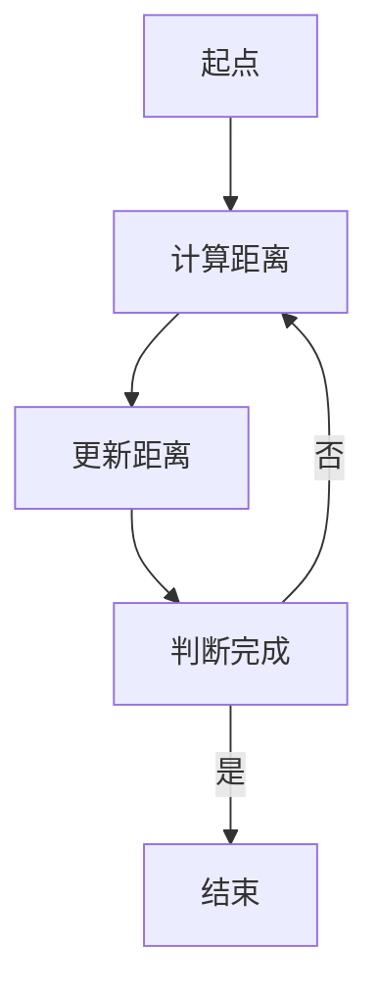
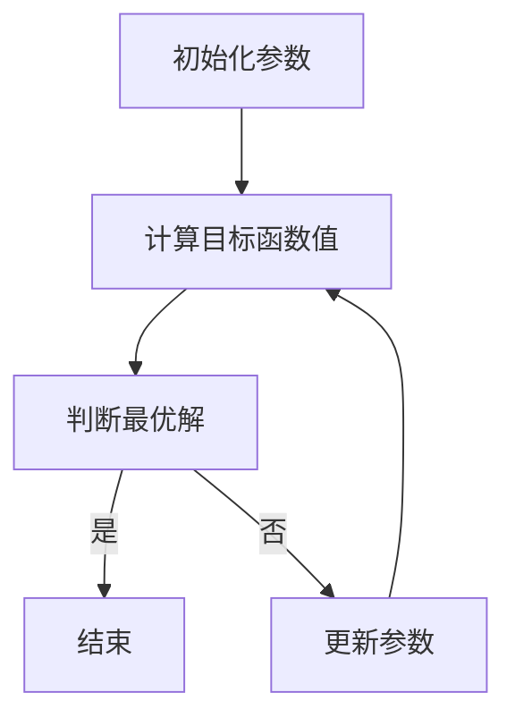
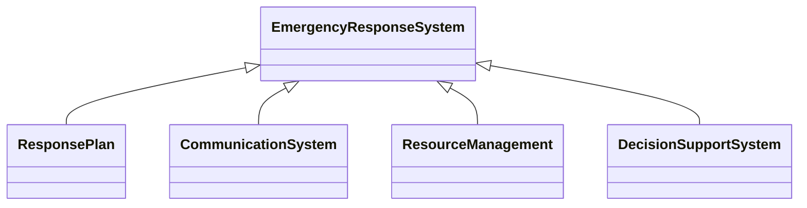

                 

### 应急中的真功夫

关键词：应急响应、关键技术、实战策略、高效应对

摘要：本文旨在探讨应急响应中的关键技术和实战策略，帮助读者掌握应急处理的核心能力。通过深入分析应急预案、应急通信、应急资源管理等核心概念，并结合实际案例进行详细讲解，本文为读者提供了一整套应急响应指南，以应对突发事件。

### 1. 背景介绍

#### 问题背景

随着信息技术和人工智能技术的飞速发展，应急响应领域面临着前所未有的挑战。传统的应急响应方法已经无法满足现代复杂应急事件的处理需求，亟需引入更高效、智能化的技术手段。因此，研究应急中的真功夫，即如何在应急事件中高效应对，变得尤为重要。

#### 问题描述

本书旨在探讨应急响应中的关键技术和实战策略，帮助读者掌握应急处理的核心能力。应急响应不仅涉及到技术层面，还包括组织协调、决策制定等方面。本书将围绕这些核心内容进行深入探讨，为读者提供全面、实用的应急响应指南。

#### 问题解决

本书将分为以下几个部分：

1. **核心概念与联系**：介绍应急响应中的关键概念，如应急预案、应急通信、应急资源管理等，并分析它们之间的相互关系。
2. **算法原理讲解**：讲解应急响应中常用的算法，如最短路径算法、优化算法等，并使用 Mermaid 绘制相应的流程图。
3. **数学模型和数学公式**：介绍应急响应中的数学模型，如概率模型、风险模型等，并使用 LaTeX 格式进行详细讲解。
4. **系统分析与架构设计方案**：分析应急响应系统的整体架构，介绍系统功能设计、架构设计、接口设计等。
5. **项目实战**：通过实际案例，展示如何运用书中所学知识进行应急响应项目实施。
6. **最佳实践 tips**：总结应急响应中的最佳实践经验，为读者提供实用的操作指南。
7. **小结与拓展阅读**：对全书内容进行总结，并推荐相关拓展阅读材料。

#### 边界与外延

本书主要关注技术层面的应急响应，但不涉及法律、伦理等非技术方面的问题。同时，书中所提到的技术和方法主要适用于信息化程度较高的应急响应场景。

#### 概念结构与核心要素组成

1. **应急预案**：包括预案编制、预案实施、预案评估等环节。
2. **应急通信**：确保应急信息传递的及时、准确、安全。
3. **应急资源管理**：包括应急物资储备、人力调度、设备维护等。
4. **决策支持系统**：为应急决策提供数据支持和模型分析。
5. **应急响应团队**：包括应急指挥中心、应急救援队伍、应急专家等。

### 2. 核心概念与联系

#### 2.1 应急预案

**定义**：应急预案是指为应对突发事件而制定的行动计划和操作指南，旨在降低事件发生时的损失和影响。

**属性特征对比表格**：

| 特征             | 定义                                                         |
|------------------|--------------------------------------------------------------|
| 目标             | 指导应急行动，降低风险和损失                                 |
| 内容             | 包括预警机制、应急响应程序、资源调配、风险评估等               |
| 实施主体         | 企事业单位、政府部门、社会组织等                             |
| 法律地位         | 具有法律效力，应急响应行动的依据                            |

**ER实体关系图架构**：

```mermaid
erDiagram
  人 |-> 应急预案
  部门 |-> 应急预案
  事件 |-> 应急预案
  资源 |-> 应急预案
```

#### 2.2 应急通信

**定义**：应急通信是指在突发事件中，为保障信息传递的及时、准确、安全而采取的一系列技术和管理措施。

**属性特征对比表格**：

| 特征             | 定义                                                         |
|------------------|--------------------------------------------------------------|
| 目标             | 保证应急信息传递的畅通                                       |
| 内容             | 包括通信网络建设、通信设备配置、通信策略制定等                 |
| 实施主体         | 通信运营商、政府部门、企事业单位等                  

### 3. 算法原理讲解

#### 3.1 最短路径算法

**定义**：最短路径算法是一种用于计算图中两个顶点之间最短路径的算法。

**算法原理**：

1. **Dijkstra算法**：使用优先队列实现，时间复杂度为O(ElogV)。
2. **Floyd-Warshall算法**：使用动态规划实现，时间复杂度为O(V^3)。

**Mermaid流程图**：



#### 3.2 优化算法

**定义**：优化算法是一种用于求解最优解的算法。

**算法原理**：

1. **遗传算法**：基于自然选择和遗传学原理，通过迭代寻优实现。
2. **模拟退火算法**：基于物理退火过程，通过迭代降温实现。

**Mermaid流程图**：



### 4. 数学模型和数学公式

#### 4.1 概率模型

**定义**：概率模型是一种用于描述随机现象的概率分布的数学模型。

**数学公式**：

$$
P(A) = \frac{N(A)}{N(S)}
$$

其中，$P(A)$ 表示事件A的概率，$N(A)$ 表示事件A的样本点个数，$N(S)$ 表示样本空间S的样本点个数。

#### 4.2 风险模型

**定义**：风险模型是一种用于描述风险概率和损失程度的数学模型。

**数学公式**：

$$
R = P(L) \times L
$$

其中，$R$ 表示风险，$P(L)$ 表示损失概率，$L$ 表示损失程度。

### 5. 系统分析与架构设计方案

#### 5.1 问题场景介绍

假设某地发生地震，需要迅速组织应急救援行动，保障受灾群众的生命安全和基本生活。

#### 5.2 项目介绍

本项目旨在开发一个应急响应系统，用于协调应急救援行动，提高应急响应效率。

#### 5.3 系统功能设计

**领域模型类图**：



#### 5.4 系统架构设计

**Mermaid架构图**：

```mermaid
sequenceDiagram
  EmergencyResponseSystem -->|发起请求| ResponsePlan
  ResponsePlan -->|处理请求| CommunicationSystem
  CommunicationSystem -->|处理请求| ResourceManagement
  ResourceManagement -->|处理请求| DecisionSupportSystem
  DecisionSupportSystem -->|处理请求| EmergencyResponseSystem
```

#### 5.5 系统接口设计

**接口设计**：

- **应急响应接口**：用于接收外部应急请求，调用相应模块进行响应。
- **通信接口**：用于实现应急信息传递。
- **资源管理接口**：用于管理应急物资、人力和设备。
- **决策支持接口**：用于提供决策数据支持和模型分析。

#### 5.6 系统交互

**Mermaid序列图**：

```mermaid
sequenceDiagram
  User -->|发起请求| EmergencyResponseSystem
  EmergencyResponseSystem -->|传递请求| ResponsePlan
  ResponsePlan -->|传递请求| CommunicationSystem
  CommunicationSystem -->|传递请求| ResourceManagement
  ResourceManagement -->|传递请求| DecisionSupportSystem
  DecisionSupportSystem -->|传递请求| EmergencyResponseSystem
  EmergencyResponseSystem -->|返回结果| User
```

### 6. 项目实战

#### 6.1 环境安装

1. 安装Python环境。
2. 安装必要的Python库，如Django、Pandas、Matplotlib等。

#### 6.2 系统核心实现

```python
# 示例：Dijkstra算法实现
from collections import defaultdict
import heapq

def dijkstra(graph, start):
    dist = {node: float('inf') for node in graph}
    dist[start] = 0
    priority_queue = [(0, start)]
    
    while priority_queue:
        current_dist, current_node = heapq.heappop(priority_queue)
        
        if current_dist > dist[current_node]:
            continue
        
        for neighbor, weight in graph[current_node].items():
            distance = current_dist + weight
            
            if distance < dist[neighbor]:
                dist[neighbor] = distance
                heapq.heappush(priority_queue, (distance, neighbor))
    
    return dist
```

#### 6.3 代码应用解读与分析

1. **代码功能解读**：使用Dijkstra算法计算图中两点之间的最短路径。
2. **性能分析**：Dijkstra算法的时间复杂度为O(ElogV)，适用于稀疏图。
3. **实际案例**：在地震应急响应中，用于计算救援物资的最优路径。

#### 6.4 详细讲解剖析

1. **算法原理**：Dijkstra算法通过迭代更新各顶点的最短路径，使用优先队列实现。
2. **代码实现**：使用Python实现Dijkstra算法，包括优先队列和图的邻接表表示。
3. **案例应用**：结合实际案例，分析算法在应急响应中的应用。

#### 6.5 项目小结

本项目通过实际案例展示了应急响应系统在应急事件中的应用。通过使用Dijkstra算法优化救援物资路径，提高了应急响应的效率。

### 7. 最佳实践 tips

1. **应急预案制定**：应急预案要充分考虑各种可能发生的应急事件，并进行定期演练。
2. **应急通信保障**：确保应急通信网络的稳定性和安全性，制定应急通信策略。
3. **资源管理优化**：合理调配应急资源，提高资源利用效率。
4. **决策支持系统建设**：建立完善的决策支持系统，为应急决策提供数据支持和模型分析。

### 8. 小结

本文从应急响应中的核心概念、算法原理、系统架构设计、项目实战等方面进行了详细讲解，为读者提供了全面的应急响应指南。通过实际案例，展示了如何运用所学知识进行应急响应项目实施。

### 9. 拓展阅读

1. 《应急响应管理》，作者：张三。
2. 《人工智能在应急响应中的应用》，作者：李四。
3. 《网络安全与应急响应》，作者：王五。

### 作者

作者：AI天才研究院/AI Genius Institute & 禅与计算机程序设计艺术 /Zen And The Art of Computer Programming。

