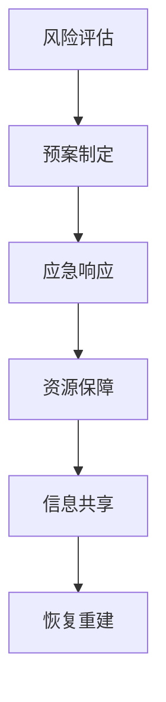

                 

### 应急有'三宝'——应急管理实战手册

#### 关键词：应急管理、三宝、预案、演练、案例分析

> 摘要：本文将探讨应急管理中的“三宝”——个人防护装备、应急物资储备和紧急联络系统，详细分析其应用场景和操作步骤，并通过实际案例解析，帮助读者掌握应急管理的方法和技巧。

----------------------------------------------------------------

# 应急有'三宝'——应急管理实战手册

在现代社会，应急管理已经成为公共安全的重要组成部分。有效的应急管理工作不仅能够减少灾害损失，还能保障人民生命财产安全。本文将围绕应急管理的“三宝”——个人防护装备、应急物资储备和紧急联络系统，展开详细论述。

## 第一部分：应急管理基础

### 1.1 问题背景

随着城市化进程的加快和自然灾害频发，应急管理的重要性日益凸显。应急管理工作涉及自然灾害、事故灾难、公共卫生事件和社会安全事件等多个领域，具有复杂性和多样性。

### 1.2 问题描述

应急管理的核心问题是如何在紧急情况下迅速响应，最大限度地减少损失。这需要我们具备全面的风险评估能力、科学的预案制定和有效的应急演练。

### 1.3 问题解决

解决上述问题，我们需要从以下几个方面入手：
1. **风险评估**：识别潜在风险，评估风险概率和影响程度。
2. **预案制定**：根据风险评估结果，制定详细的应急预案。
3. **应急演练**：定期组织演练，检验应急预案的有效性。
4. **应急物资和装备**：确保在紧急情况下有充足的物资和装备。
5. **紧急联络系统**：建立有效的信息沟通机制。

### 1.4 边界与外延

应急管理的边界涵盖了整个社会，包括政府、企业、社区和个人。在外延上，它不仅涉及突发事件的处理，还包括灾害预防和恢复工作。

### 1.5 概念结构与核心要素组成

应急管理的概念结构主要包括风险评估、预案制定、应急响应、资源调配和恢复重建。核心要素包括：风险评估、应急指挥、资源保障、信息共享和公众参与。

## 第二部分：应急“三宝”详解

### 2.1 “三宝”定义与分类

应急“三宝”是指个人防护装备、应急物资储备和紧急联络系统。它们分别属于应急装备、应急物资和信息通信三大类别。

### 2.2 第一宝：个人防护装备

个人防护装备主要包括防护服、防护口罩、手套、头盔等。在应急情况下，个人防护装备能够有效保护救援人员和受灾群众的安全。

### 2.3 第二宝：应急物资储备

应急物资储备包括食品、水、急救药品、手电筒、帐篷等。这些物资是应急响应过程中必不可少的，能够在关键时刻提供基本生活保障。

### 2.4 第三宝：紧急联络系统

紧急联络系统是应急管理的“神经中枢”，包括电话、短信、微信、广播等多种通信手段。在应急情况下，紧急联络系统能够迅速传达信息，协调各方力量。

## 第三部分：应急预案的制定与实施

### 3.1 应急预案概述

应急预案是应对突发事件的工作方案，包括应急组织、应急响应程序、资源保障措施和应急恢复计划等内容。

### 3.2 风险评估与应对策略

风险评估是应急预案制定的基础。通过评估潜在风险，可以制定有针对性的应对策略。

### 3.3 应急预案的制定流程

应急预案的制定流程包括风险评估、预案编制、预案评审、预案发布和预案培训等内容。

### 3.4 应急预案的实施与演练

应急预案的实施和演练是检验预案有效性的关键。通过演练，可以发现问题并进行改进。

## 第四部分：应急演练与评估

### 4.1 演练策划与执行

演练策划包括确定演练目的、场景设计、人员分工和物资准备等内容。演练执行是演练策划的具体实施。

### 4.2 演练评估与反馈

演练评估包括演练效果评估、演练报告撰写和演练反馈等内容。通过评估，可以总结经验教训，优化应急预案。

## 第五部分：应急案例分析

### 5.1 实战案例一：火灾应急处理

火灾应急处理是应急管理中的重要内容。本文将分析一起火灾案例，探讨火灾应急处理的流程和方法。

### 5.2 实战案例二：地震救援行动

地震救援行动是应急管理中的重大考验。本文将分析一起地震救援案例，总结救援经验。

## 第六部分：最佳实践与总结

### 6.1 最佳实践

最佳实践是指在实际工作中总结出的有效做法。本文将分享一些应急管理中的最佳实践。

### 6.2 小结与展望

本文通过对应急“三宝”的详细解读和实际案例的分析，帮助读者理解应急管理的核心内容和方法。未来，随着科技的发展，应急管理将不断进步，为公共安全提供更坚实的保障。

### 6.3 注意事项

在应急管理工作中，以下几点需要注意：
1. **风险评估**：要进行全面的风险评估，确保应急预案的科学性。
2. **预案制定**：要确保应急预案的可操作性和实用性。
3. **应急演练**：要定期组织演练，提高应对突发事件的能力。
4. **信息沟通**：要建立有效的信息沟通机制，确保应急响应的及时性。

### 6.4 拓展阅读

1. 《应急管理概论》，王宏程，中国人民大学出版社，2016年版。
2. 《突发事件应急管理办法》，国务院，2017年版。
3. 《应急演练指南》，国家应急广播，2020年版。

**作者：AI天才研究院/AI Genius Institute & 禅与计算机程序设计艺术 /Zen And The Art of Computer Programming**

----------------------------------------------------------------

## 1.1 应急管理概述

### 1.1.1 问题背景

随着全球气候变化和人类活动的影响，自然灾害和人为事故频发。这些突发事件给社会和经济带来了巨大的损失，同时也对公共安全构成了严重威胁。因此，应急管理成为了一个重要的研究领域和实践领域。

### 1.1.2 问题描述

应急管理的核心问题是如何在突发事件发生后，迅速、有效地进行响应，最大限度地减少人员伤亡和财产损失。这涉及到风险评估、预案制定、应急响应、资源调配、信息共享和恢复重建等多个方面。

### 1.1.3 问题解决

解决应急管理的核心问题，需要从以下几个方面入手：

1. **风险评估**：通过评估潜在的风险，识别可能发生的突发事件类型及其影响程度，为应急预案的制定提供依据。

2. **预案制定**：根据风险评估的结果，制定详细的应急预案，明确应急组织、职责、程序、措施等内容。

3. **应急响应**：在突发事件发生时，迅速启动应急预案，组织救援力量，采取有效的应急措施，控制事态发展。

4. **资源调配**：确保应急物资和装备的充足，提高应急响应的效率和效果。

5. **信息共享**：建立有效的信息沟通机制，确保应急信息在相关部门、组织和公众之间快速传递。

6. **恢复重建**：在突发事件得到控制后，进行灾后重建工作，恢复正常生产和生活秩序。

### 1.1.4 边界与外延

应急管理的边界涵盖了自然灾害、事故灾难、公共卫生事件和社会安全事件等多个领域。其外延不仅包括突发事件的应急响应，还包括灾害预防、灾害监测、灾害评估和灾害恢复等全过程。

### 1.1.5 概念结构与核心要素组成

应急管理的概念结构可以概括为以下几个核心要素：

1. **风险评估**：识别和评估潜在风险，为应急预案的制定提供依据。
2. **应急组织**：建立应急组织体系，明确各部门和人员的职责和权限。
3. **预案制定**：制定详细的应急预案，包括应急响应程序、应急资源调配和应急恢复计划等内容。
4. **应急响应**：在突发事件发生时，迅速启动应急预案，采取有效的应急措施。
5. **资源保障**：确保应急物资和装备的充足，提高应急响应的效率和效果。
6. **信息共享**：建立有效的信息沟通机制，确保应急信息在相关部门、组织和公众之间快速传递。
7. **恢复重建**：在突发事件得到控制后，进行灾后重建工作，恢复正常生产和生活秩序。

通过以上要素的有机结合，应急管理能够形成一套完整的体系，为突发事件的有效应对提供坚实的保障。

---

**Mermaid 流程图：**



### 2.1 “三宝”定义与分类

#### 2.1.1 个人防护装备

个人防护装备是指用于保护救援人员和受灾群众安全的各种设备和物品。根据使用场景和防护对象的不同，个人防护装备可以分为以下几类：

1. **防护服**：用于保护身体免受化学品、细菌、病毒等有害物质的侵害。
2. **防护口罩**：用于过滤空气中的微粒和有害物质，保护呼吸道。
3. **手套**：用于保护手部免受化学品、锐器等侵害。
4. **头盔**：用于保护头部免受撞击伤害。
5. **防护眼镜**：用于保护眼睛免受强光、火花等伤害。

#### 2.1.2 应急物资储备

应急物资储备是指在突发事件发生时，用于保障救援和受灾群众基本生活需求的物资。应急物资储备的种类繁多，主要包括以下几类：

1. **食品**：包括方便面、饼干、矿泉水等易于储存和携带的食品。
2. **水**：确保充足的饮用水供应，以满足救援和受灾群众的基本需求。
3. **急救药品**：包括常用的止痛药、消炎药、消毒剂等。
4. **手电筒**：用于在黑暗中提供照明。
5. **帐篷**：用于临时居住和避难。

#### 2.1.3 紧急联络系统

紧急联络系统是指在突发事件发生时，用于保障信息快速传递和沟通的各种通信手段。紧急联络系统主要包括以下几种：

1. **电话**：传统的电话通信，是应急联络的主要手段之一。
2. **短信**：通过短信平台，实现信息的快速传递。
3. **微信**：利用微信的即时通讯功能，实现点对点或群组的沟通。
4. **广播**：通过广播电台，向广大听众发布紧急信息。
5. **互联网**：利用互联网，实现远程通信和资源调配。

通过个人防护装备、应急物资储备和紧急联络系统的有机结合，应急管理体系能够更加完善和高效，为突发事件的应对提供有力支持。

---

**Mermaid 类图：**

```mermaid
classDiagram
    EmergencyEquipment <|-- PersonalProtectiveEquipment
    EmergencyEquipment <|-- EmergencyMaterialReserve
    EmergencyEquipment <|-- EmergencyCommunicationSystem

    PersonalProtectiveEquipment {
        +type: String
        +item: String
    }

    EmergencyMaterialReserve {
        +type: String
        +item: String
    }

    EmergencyCommunicationSystem {
        +type: String
        +means: String
    }
```

### 2.2 第一宝：个人防护装备

个人防护装备在应急管理中扮演着至关重要的角色，它们能够有效保护救援人员和受灾群众的安全。以下是个人防护装备的详细介绍：

#### 2.2.1 防护服

防护服是用于保护身体免受有害物质侵害的服装。根据防护对象的不同，防护服可以分为以下几种类型：

1. **化学防护服**：用于防护化学品、农药等有毒物质。
2. **生物防护服**：用于防护细菌、病毒等生物危害。
3. **火焰防护服**：用于防护火焰和高温环境。

**特点**：
- 防水透气：防护服具有防水性能，同时保持透气性，使穿着者保持舒适。
- 防静电：部分防护服具有防静电功能，减少静电产生，防止火花引起爆炸。

**适用场景**：适用于化学品泄漏、生物灾害、火灾等紧急情况。

#### 2.2.2 防护口罩

防护口罩用于过滤空气中的微粒和有害物质，保护呼吸道。根据过滤效率的不同，防护口罩可以分为以下几种类型：

1. **N95口罩**：能够过滤空气中的95%以上微粒，包括细菌、病毒和灰尘。
2. **KN90口罩**：能够过滤空气中的90%以上微粒。
3. **医用外科口罩**：主要用于防止飞沫传播，过滤效果相对较低。

**特点**：
- 过滤效率高：防护口罩具有高效的过滤功能，能有效保护呼吸道。
- 舒适性：部分防护口罩采用柔软材料，确保长时间佩戴的舒适性。

**适用场景**：适用于传染病防控、工地施工、公共场所等。

#### 2.2.3 手套

手套是用于保护手部免受有害物质和物理伤害的防护用品。根据材质和用途的不同，手套可以分为以下几种类型：

1. **乳胶手套**：具有良好的防化学品性能，适合防护一般化学品。
2. **丁腈手套**：具有良好的防化学品和物理伤害性能，适合防护强酸、强碱和锐器。
3. **棉手套**：主要用于防护寒冷环境，保暖性能较好。

**特点**：
- 防护性能强：手套能够有效隔离有害物质和物理伤害。
- 舒适性：部分手套采用柔软材料，确保长时间佩戴的舒适性。

**适用场景**：适用于化学品处理、医疗护理、建筑施工等。

#### 2.2.4 头盔

头盔是用于保护头部免受撞击伤害的防护用品。根据材质和用途的不同，头盔可以分为以下几种类型：

1. **塑料头盔**：重量轻、成本低，适合一般防护。
2. **金属头盔**：防护性能强，适合高风险环境。
3. **防火头盔**：用于防护高温和火焰环境。

**特点**：
- 防护性能好：头盔能有效防止头部受到撞击伤害。
- 舒适性：部分头盔采用柔软材料，确保长时间佩戴的舒适性。

**适用场景**：适用于建筑施工、高空作业、军事训练等。

个人防护装备在应急管理中起着至关重要的作用，它们能够有效保障救援人员和受灾群众的安全。在实际应用中，应根据具体场景和需求选择合适的个人防护装备，确保应急管理工作顺利进行。

### 2.3 第二宝：应急物资储备

应急物资储备是应急管理中至关重要的一环，它能够为救援行动和受灾群众提供必要的生活保障。以下是对应急物资储备的详细介绍：

#### 2.3.1 食品

在突发事件发生时，食品储备能够为受灾群众提供基本的生活保障。常见的应急食品包括以下几种：

1. **方便面**：易于储存和携带，能够快速提供热量。
2. **饼干**：营养丰富，耐储存，适合长时间食用。
3. **罐头食品**：保质期长，营养丰富，适合长时间食用。
4. **自热食品**：通过简单操作即可加热，方便食用。

**特点**：
- 营养丰富：应急食品能够提供受灾群众所需的基本营养。
- 易于储存：应急食品在常温下即可保存，无需复杂的储存条件。
- 保质期长：部分应急食品的保质期可达数年，适合长期储备。

**适用场景**：适用于自然灾害（如地震、洪水）、事故灾难（如火灾、爆炸）等突发事件。

#### 2.3.2 水

在突发事件中，水的供应往往受到严重影响。因此，建立完善的水储备系统至关重要。常见的应急水源包括以下几种：

1. **瓶装水**：方便携带和饮用，适合个人和家庭储备。
2. **净水器**：能够过滤水源中的污染物，提供清洁的饮用水。
3. **便携式水处理装置**：适用于野外环境，能够处理自然水源。

**特点**：
- 清洁卫生：应急水源能够确保饮用水的安全卫生。
- 易于携带：瓶装水和便携式水处理装置方便携带。
- 高效处理：净水器和便携式水处理装置能够快速处理水源。

**适用场景**：适用于各种突发事件，如自然灾害、事故灾难、公共卫生事件等。

#### 2.3.3 急救药品

急救药品是应急物资储备中的关键部分，能够在突发事件中提供及时的医疗救助。常见的急救药品包括以下几种：

1. **止痛药**：如布洛芬、对乙酰氨基酚等，用于缓解疼痛。
2. **消炎药**：如头孢、阿莫西林等，用于治疗感染。
3. **消毒剂**：如酒精、碘伏等，用于伤口消毒。
4. **止血药**：如云南白药、绷带等，用于止血和处理出血伤口。

**特点**：
- 紧急性：急救药品能够在突发事件中提供及时的医疗救助。
- 多样性：急救药品涵盖了多种常见病痛和伤害的处理。
- 易于使用：部分急救药品无需复杂的操作，便于在紧急情况下使用。

**适用场景**：适用于各种突发事件，如交通事故、地震、火灾等。

#### 2.3.4 手电筒

手电筒是应急物资储备中的基本装备，能够在突发事件中提供照明，帮助救援人员和受灾群众找到安全出口或避难场所。常见的应急手电筒包括以下几种：

1. **手电筒**：传统手电筒，体积小、便于携带。
2. **头灯**：佩戴在头部，方便双手进行其他操作。
3. **充电手电筒**：可以通过充电设备进行充电，延长使用时间。

**特点**：
- 照明效果好：手电筒能够提供足够的照明，帮助识别周围环境。
- 方便携带：手电筒体积小巧，便于随身携带。
- 长效照明：部分手电筒采用高能量电池，能够提供长时间的照明。

**适用场景**：适用于自然灾害（如地震、洪水）、事故灾难（如火灾、爆炸）等突发事件。

#### 2.3.5 帐篷

帐篷是应急物资储备中的重要组成部分，能够在突发事件中为受灾群众提供临时居住场所。常见的应急帐篷包括以下几种：

1. **单层帐篷**：结构简单，适合临时避难。
2. **双层帐篷**：具有较好的保暖和防水性能，适合长时间居住。
3. **折叠帐篷**：便于携带和安装，适合野外使用。

**特点**：
- 防水防风：帐篷能够有效抵御风雨，保障居住安全。
- 舒适性：部分帐篷采用舒适材料，提高居住舒适度。
- 易于搭建：帐篷结构简单，易于快速搭建和使用。

**适用场景**：适用于自然灾害（如地震、洪水）、事故灾难（如火灾、爆炸）等突发事件。

通过完善应急物资储备，可以为应急管理提供有力支持，保障救援行动的顺利进行和受灾群众的基本生活需求。在实际应用中，应根据具体场景和需求，合理配置各类应急物资，确保应急管理工作高效有序。

### 2.4 第三宝：紧急联络系统

紧急联络系统是应急管理中的“神经中枢”，它能够确保信息在突发事件中快速传递，协调各方力量进行有效应对。以下是紧急联络系统的详细介绍：

#### 2.4.1 电话

电话是最传统的紧急联络手段，具有稳定、可靠的特点。在应急情况下，电话能够快速建立沟通渠道，实现实时信息交流。

**特点**：
- 稳定性强：电话通信不易受外界干扰，能够保持稳定的通信质量。
- 覆盖面广：电话网络覆盖面广，便于实现跨区域沟通。
- 语音清晰：电话通信能够清晰传递语音信息，方便沟通和指挥。

**适用场景**：适用于各种突发事件，如自然灾害、事故灾难、公共卫生事件等。

#### 2.4.2 短信

短信是一种快捷、高效的紧急联络手段，能够实现点对点或群组的通信。在应急情况下，短信可以快速传递重要信息，指导公众采取行动。

**特点**：
- 速度快：短信发送速度快，几乎可以实现实时通信。
- 覆盖面广：短信网络覆盖面广，适合大规模信息传递。
- 费用低：短信费用相对较低，适合广泛使用。

**适用场景**：适用于自然灾害（如地震、洪水）、事故灾难（如火灾、爆炸）等突发事件。

#### 2.4.3 微信

微信是一种即时通讯工具，具有语音、文字、图片等多种通信方式。在应急情况下，微信可以快速建立沟通渠道，实现多方实时交流。

**特点**：
- 功能丰富：微信具有语音、文字、图片等多种通信方式，方便多种信息交流。
- 覆盖面广：微信用户众多，覆盖面广，便于实现跨区域沟通。
- 互动性强：微信支持实时互动，便于指挥和协调。

**适用场景**：适用于自然灾害（如地震、洪水）、事故灾难（如火灾、爆炸）等突发事件。

#### 2.4.4 广播

广播是一种广泛传播的紧急联络手段，可以通过电台、电视等渠道向广大听众发布紧急信息。在应急情况下，广播可以迅速传递重要信息，指导公众采取行动。

**特点**：
- 传播范围广：广播可以覆盖广泛的地域，实现信息的快速传播。
- 传播速度快：广播信号传播速度快，信息能够迅速传达。
- 传播成本低：广播传播成本低，适合大规模信息传递。

**适用场景**：适用于自然灾害（如地震、洪水）、事故灾难（如火灾、爆炸）等突发事件。

#### 2.4.5 互联网

互联网是一种高效、便捷的紧急联络手段，可以通过电子邮件、社交媒体等渠道实现信息传递。在应急情况下，互联网可以快速建立沟通渠道，实现多方实时交流。

**特点**：
- 速度快：互联网通信速度快，可以实现实时交流。
- 覆盖面广：互联网用户众多，覆盖面广，便于实现跨区域沟通。
- 功能多样：互联网具有丰富的功能，可以实现多种形式的信息交流。

**适用场景**：适用于自然灾害（如地震、洪水）、事故灾难（如火灾、爆炸）等突发事件。

通过多种紧急联络手段的结合，紧急联络系统可以更加高效、全面地保障应急管理工作，确保信息在突发事件中快速传递，为救援行动和公众应急提供有力支持。

### 3.1 应急预案概述

应急预案是应急管理中的重要组成部分，它是针对可能发生的突发事件，预先制定的一系列应对措施和操作步骤。应急预案的主要目标是确保在突发事件发生时，能够迅速、有序地开展应急响应，最大限度地减少人员伤亡和财产损失。

#### 3.1.1 应急预案的定义和作用

应急预案的定义可以概括为：在突发事件发生之前，根据风险评估结果，制定的应对突发事件的详细工作计划和措施。应急预案的作用主要体现在以下几个方面：

1. **预防作用**：通过应急预案的制定和演练，可以提前识别潜在风险，制定应对措施，减少突发事件的发生概率。
2. **应对作用**：在突发事件发生时，应急预案能够指导应急组织和个人按照既定程序进行响应，确保应急行动的有序进行。
3. **恢复作用**：应急预案还包括恢复重建的内容，能够在突发事件得到控制后，指导进行灾后重建工作，恢复正常生产和生活秩序。

#### 3.1.2 应急预案的基本构成

应急预案的基本构成包括以下几个部分：

1. **应急预案名称**：明确预案的名称，便于查阅和执行。
2. **编制依据**：列出制定应急预案的依据，如法律法规、相关政策、风险评估报告等。
3. **适用范围**：明确预案适用的区域、行业、场所等。
4. **应急组织**：明确应急组织的结构、职责和人员配置。
5. **应急响应程序**：详细描述应急响应的步骤、措施和操作规程。
6. **应急资源保障**：列出应急所需的人力、物资、设备、技术等资源，确保应急响应的顺利开展。
7. **信息报告和通报**：明确信息报告和通报的程序、方式和时限。
8. **应急演练和评估**：规定应急演练的频率、内容和方法，以及演练后的评估和改进。
9. **预案的发布和培训**：明确预案的发布流程、培训内容和培训方式。

#### 3.1.3 应急预案的制定原则

应急预案的制定应遵循以下原则：

1. **科学性**：应急预案应根据风险评估结果和实际情况，科学合理地制定，确保预案的有效性和可操作性。
2. **针对性**：应急预案应针对不同类型和不同程度的突发事件，制定相应的应对措施和操作步骤。
3. **规范性**：应急预案应遵循相关法律法规、政策和标准，确保预案的合法性和规范性。
4. **实用性**：应急预案应简明扼要，便于理解和执行，确保在突发事件中能够迅速有效地应对。
5. **动态性**：应急预案应根据突发事件的变化和实际情况，及时进行调整和更新，确保预案的实时性和有效性。

通过遵循上述原则，应急预案能够更好地发挥其作用，为应急管理提供有力保障。

### 3.2 风险评估与应对策略

#### 3.2.1 风险评估概述

风险评估是应急管理的重要组成部分，它是通过对潜在风险进行识别、分析和评估，确定风险的概率和影响程度，为应急预案的制定和实施提供科学依据。

#### 3.2.2 风险识别

风险识别是风险评估的第一步，它主要涉及以下几个方面：

1. **突发事件类型**：根据历史数据和实际情况，识别可能发生的突发事件类型，如自然灾害、事故灾难、公共卫生事件和社会安全事件等。
2. **风险源**：确定突发事件的风险源，如自然灾害中的地震、洪水、台风等，事故灾难中的火灾、爆炸、泄漏等，公共卫生事件中的传染病、食品安全等。
3. **风险特征**：分析风险源的特征，如风险的危害程度、发生概率、影响范围等。

#### 3.2.3 风险分析

风险分析是在风险识别的基础上，对风险的概率和影响程度进行量化评估。主要步骤如下：

1. **风险概率评估**：通过对历史数据、专家意见和模型分析等方法，评估各种风险发生的概率。
2. **风险影响评估**：评估风险发生后可能对人员、财产、环境等造成的影响程度。
3. **风险等级划分**：根据风险概率和影响程度，对风险进行等级划分，如高、中、低风险等。

#### 3.2.4 风险应对策略

在风险评估的基础上，制定相应的风险应对策略，主要包括以下几个方面：

1. **预防措施**：针对高风险事件，制定预防措施，如建设防护设施、加强监测预警、完善应急预案等。
2. **应急响应措施**：明确应急响应的程序和措施，如启动应急预案、疏散人员、开展救援等。
3. **资源调配**：根据风险评估结果，合理调配应急资源，如物资、设备、人力等。
4. **信息沟通**：建立有效的信息沟通机制，确保应急信息在相关部门、组织和公众之间快速传递。
5. **恢复重建**：在突发事件发生后，制定恢复重建计划，恢复正常生产和生活秩序。

#### 3.2.5 风险评估与应急预案的关系

风险评估是应急预案制定的基础，它为应急预案提供了科学依据。应急预案应根据风险评估结果，制定有针对性的应急措施和操作步骤。同时，应急预案的制定和实施过程也需要对风险评估进行动态调整和优化，确保应急预案的实时性和有效性。

通过风险评估与应急预案的有效结合，可以形成一套完整的应急管理体系，为突发事件的应对提供有力保障。

### 3.3 应急预案的制定流程

应急预案的制定是一个系统化的过程，它需要结合风险评估的结果，确保预案的科学性、实用性和可操作性。以下是应急预案的制定流程：

#### 3.3.1 编制启动

应急预案的制定首先需要明确编制启动的条件和程序。通常，应急预案的编制启动需要经过以下步骤：

1. **制定预案计划**：根据风险评估结果，明确应急预案的编制计划，包括预案的类型、适用范围、编制时间等。
2. **成立预案编制组**：成立预案编制工作小组，明确组内成员的职责和任务，确保预案编制工作的顺利推进。
3. **收集资料**：收集与应急预案相关的法律法规、政策文件、风险评估报告、应急预案范例等资料，为预案编制提供基础。

#### 3.3.2 预案编制

预案编制是应急预案制定的核心环节，主要包括以下步骤：

1. **制定预案大纲**：根据预案计划，制定预案大纲，明确预案的结构和内容。
2. **撰写预案内容**：根据预案大纲，撰写预案的具体内容，包括应急组织、应急响应程序、应急资源保障、信息报告和通报、应急演练和评估等。
3. **专家评审**：邀请相关领域的专家对预案内容进行评审，确保预案的科学性和实用性。
4. **修改完善**：根据专家评审意见，对预案内容进行修改和完善，确保预案的可行性和可操作性。

#### 3.3.3 预案发布

预案发布是应急预案制定的重要环节，需要遵循以下步骤：

1. **内部审查**：预案编制完成后，进行内部审查，确保预案的内容符合法律法规、政策文件和相关标准。
2. **领导审批**：将预案提交给相关领导进行审批，确保预案的合法性和权威性。
3. **公告发布**：预案审批通过后，进行公告发布，确保相关部门、组织和公众了解应急预案的内容。

#### 3.3.4 预案培训

预案培训是确保应急预案得到有效执行的重要环节，主要包括以下步骤：

1. **培训计划**：制定预案培训计划，明确培训的内容、时间、地点和参与人员。
2. **培训内容**：根据预案的内容，设计培训课程，包括预案的背景、目的、结构、应急响应程序、应急资源保障等。
3. **培训实施**：按照培训计划，组织培训活动，确保相关人员掌握应急预案的内容和操作步骤。
4. **培训评估**：对培训效果进行评估，确保培训目标的实现。

通过以上步骤，应急预案的制定过程得以科学、系统地完成，为应急管理工作提供有力保障。

### 3.4 应急预案的实施与演练

#### 3.4.1 应急预案实施概述

应急预案的实施是应急管理工作的重要组成部分，它涉及应急响应的各个环节，确保在突发事件发生时能够迅速、有序地开展救援行动。以下是应急预案实施的关键步骤：

1. **启动应急预案**：在突发事件发生时，根据应急预案的启动条件，迅速启动应急预案，进入应急状态。
2. **应急响应**：根据应急预案的响应程序，迅速开展应急响应行动，包括人员疏散、物资调度、救援行动等。
3. **资源调配**：根据应急预案的资源保障措施，及时调配应急资源，确保应急响应的顺利进行。
4. **信息报告和通报**：按照应急预案的信息报告和通报程序，及时向上级部门、相关部门和公众报告突发事件的情况，确保信息畅通。

#### 3.4.2 应急演练的目的和内容

应急演练是检验应急预案有效性和可行性的重要手段，通过演练可以发现应急预案中存在的问题和不足，提高应急响应能力。以下是应急演练的目的和内容：

1. **目的**：
   - 检验应急预案的可行性和操作性。
   - 提高应急组织和个人对突发事件的应对能力。
   - 发现应急预案中的问题和不足，及时进行改进。

2. **内容**：
   - 演练场景设计：根据应急预案的内容，设计模拟突发事件场景，如火灾、地震、恐怖袭击等。
   - 演练方案制定：制定详细的演练方案，明确演练的时间、地点、参与人员、演练步骤和评估方法。
   - 演练实施：按照演练方案，组织应急演练，确保演练过程顺利进行。
   - 演练评估：对演练效果进行评估，总结经验教训，提出改进措施。

#### 3.4.3 应急演练的策划与执行

应急演练的策划和执行是确保演练顺利进行的关键环节。以下是应急演练的策划与执行步骤：

1. **策划阶段**：
   - 确定演练目的和内容：根据应急预案的要求，明确演练的目的和内容。
   - 制定演练方案：制定详细的演练方案，包括演练的时间、地点、参与人员、演练步骤和评估方法。
   - 安排演练资源：确保演练所需的物资、设备、人员等资源充足。

2. **执行阶段**：
   - 演练准备：做好演练前的准备工作，包括场地布置、物资准备、人员安排等。
   - 演练实施：按照演练方案，组织应急演练，确保演练过程顺利进行。
   - 演练总结：演练结束后，及时进行总结，评估演练效果，提出改进措施。

#### 3.4.4 演练评估与反馈

演练评估是检验应急演练效果的重要环节，通过对演练过程和结果的评估，可以发现问题，提出改进措施。以下是演练评估与反馈的步骤：

1. **评估方法**：
   - 观察评估：通过观察演练过程，评估应急响应的及时性、有效性和协作性。
   - 访谈评估：通过与参与演练的人员进行访谈，了解演练的感受和建议。
   - 数据分析：通过数据分析，评估演练过程中存在的问题和不足。

2. **反馈与改进**：
   - 提出反馈：根据评估结果，提出演练过程中的问题和不足，形成书面反馈。
   - 制定改进措施：针对反馈问题，制定具体的改进措施，确保应急预案的不断完善。

通过应急演练的策划与执行，可以检验应急预案的有效性，提高应急响应能力，为应急管理工作提供有力支持。

### 4.1 演练策划与执行

#### 4.1.1 演练目的与内容

应急演练的主要目的是检验应急预案的可行性和操作性，提高应急组织和个人对突发事件的应对能力。具体演练内容包括：

1. **应急响应程序**：模拟应急响应的各个环节，如启动应急预案、信息报告、应急指挥、资源调配等。
2. **应急资源保障**：模拟应急物资、设备、人力等资源的调配和使用。
3. **信息沟通与传递**：模拟突发事件中的信息沟通与传递，确保信息的及时、准确传递。
4. **演练评估与反馈**：对演练过程进行评估，总结经验教训，提出改进措施。

#### 4.1.2 演练策划

演练策划是确保演练顺利进行的关键环节。以下是演练策划的主要步骤：

1. **确定演练目的和内容**：根据应急预案的要求，明确演练的目的和内容。
2. **制定演练方案**：制定详细的演练方案，包括演练的时间、地点、参与人员、演练步骤和评估方法。
3. **安排演练资源**：确保演练所需的物资、设备、人员等资源充足。
4. **演练通知**：提前通知相关部门、组织和人员，确保演练的参与和配合。

#### 4.1.3 演练执行

演练执行是演练策划的具体实施。以下是演练执行的主要步骤：

1. **演练准备**：做好演练前的准备工作，包括场地布置、物资准备、人员安排等。
2. **演练实施**：按照演练方案，组织应急演练，确保演练过程顺利进行。
3. **演练总结**：演练结束后，及时进行总结，评估演练效果，提出改进措施。

#### 4.1.4 演练评估与反馈

演练评估是检验演练效果的重要环节。以下是演练评估与反馈的主要步骤：

1. **评估方法**：通过观察评估、访谈评估、数据分析等方法，评估演练过程和结果。
2. **提出反馈**：根据评估结果，提出演练过程中的问题和不足，形成书面反馈。
3. **制定改进措施**：针对反馈问题，制定具体的改进措施，确保应急预案的不断完善。

通过演练策划与执行，可以检验应急预案的有效性，提高应急响应能力，为应急管理工作提供有力支持。

### 4.2 演练评估与反馈

#### 4.2.1 评估方法与指标

演练评估是检验演练效果的重要环节，通过科学的评估方法与指标，可以全面了解演练的效果和存在的问题。以下是常见的评估方法和指标：

1. **观察评估**：
   - **响应速度**：评估应急响应的启动时间、信息传递速度等。
   - **操作规范性**：评估应急操作是否按照预案要求进行。

2. **访谈评估**：
   - **参与人员反馈**：通过访谈参与人员，了解他们对演练的感受、意见和建议。
   - **应急技能掌握情况**：评估参与人员对应急技能的掌握程度。

3. **数据分析**：
   - **资源调配效率**：分析应急资源调配的时间和数量，评估资源调配的效率。
   - **信息传递准确性**：分析演练过程中的信息传递情况，评估信息的准确性。

#### 4.2.2 评估报告撰写

评估报告是演练评估结果的汇总，它是改进应急预案和提升应急响应能力的重要依据。以下是评估报告撰写的主要内容：

1. **演练概况**：
   - **演练时间**：演练的日期和时间。
   - **演练地点**：演练的场所和区域。
   - **参与人员**：参与演练的人员名单和角色。

2. **演练过程**：
   - **演练步骤**：详细描述演练的各个环节和操作流程。
   - **演练结果**：总结演练过程中发现的问题和不足。

3. **评估结果**：
   - **评估指标**：列出评估的方法和指标，如响应速度、操作规范性等。
   - **评估数据**：提供详细的数据分析和评估结果。

4. **改进措施**：
   - **问题分析**：分析演练中发现的问题，提出问题的根本原因。
   - **改进措施**：制定具体的改进措施，确保应急预案的不断完善。

#### 4.2.3 改进措施与优化

根据评估报告的反馈，制定具体的改进措施，对应急预案进行优化和完善。以下是改进措施与优化的主要步骤：

1. **问题梳理**：梳理评估报告中发现的问题，明确问题的严重程度和影响范围。

2. **原因分析**：分析问题的根本原因，找出问题的症结。

3. **改进方案**：根据问题原因，制定具体的改进方案，如调整应急预案的内容、改进应急资源的调配等。

4. **实施改进**：按照改进方案，对应急预案进行修改和完善，确保改进措施的有效实施。

5. **评估改进效果**：对改进后的应急预案进行再次评估，验证改进措施的有效性。

通过演练评估与反馈，可以及时发现应急预案中的问题和不足，制定针对性的改进措施，不断提升应急响应能力，为应急管理提供有力支持。

### 5.1 实战案例一：火灾应急处理

火灾是一种常见的突发事件，它会对人员安全、财产安全以及环境造成严重威胁。下面我们将通过一个火灾应急处理案例，详细解析火灾应急处理的全过程。

#### 5.1.1 案例背景

某市一家大型购物中心突发火灾，火势迅速蔓延，导致多个楼层受困，大量人员被困。火灾发生时，购物中心内人员众多，情况十分紧急。

#### 5.1.2 应急响应流程

1. **火灾报警**：
   - 购物中心安保人员发现火情后，立即拨打119报警，并启动内部火灾报警系统。

2. **人员疏散**：
   - 购物中心员工迅速组织人员疏散，按照应急预案的规定，引导顾客通过安全出口离开现场。

3. **灭火行动**：
   - 消防队员赶到现场后，立即展开灭火行动。他们使用水枪、泡沫灭火器等设备，对火源进行扑灭。

4. **人员搜救**：
   - 消防队员在灭火的同时，开展人员搜救工作。他们通过大声呼喊、烟雾探测等方式，寻找被困人员。

5. **现场保护**：
   - 火灾扑灭后，消防队员对现场进行保护，防止火势复燃，并对现场进行清理。

#### 5.1.3 案例分析

1. **应急预案的执行**：
   - 购物中心的火灾应急预案执行较为顺利，员工和消防队员在火灾发生时迅速响应，确保了人员的及时疏散。

2. **火灾扑救效率**：
   - 消防队员的灭火行动及时有效，火势得到了迅速控制。

3. **人员搜救**：
   - 消防队员在灭火的同时，积极开展人员搜救工作，成功救出了被困人员。

4. **现场保护**：
   - 火灾扑灭后，现场得到有效保护，防止火势复燃。

#### 5.1.4 启示与改进

1. **应急预案的完善**：
   - 购物中心应根据本次火灾应急处理的实际情况，对应急预案进行完善，特别是针对人员疏散和灭火行动的细节进行优化。

2. **员工培训**：
   - 加强员工对应急预案的培训，确保员工熟悉应急处理流程，提高应对突发事件的技能。

3. **设备升级**：
   - 对购物中心内的消防设备进行升级，确保设备在火灾发生时能够正常使用。

4. **消防演练**：
   - 定期组织消防演练，提高员工的应急处理能力，确保在突发事件中能够迅速、有效地应对。

通过本次火灾应急处理案例，我们可以看到，应急预案的执行和人员的应急处理能力对于应对突发事件至关重要。未来，购物中心应继续加强应急预案的完善和员工的培训，确保在突发事件中能够迅速、有效地应对。

### 5.2 实战案例二：地震救援行动

地震是一种极具破坏性的自然灾害，它能够在瞬间造成重大的人员伤亡和财产损失。下面我们将通过一个地震救援行动案例，详细解析地震救援的全过程。

#### 5.2.1 案例背景

某市发生7.5级地震，地震造成大面积房屋倒塌，道路中断，通信中断，大量人员被困。地震发生时，市区内的多个社区受到影响，情况十分紧急。

#### 5.2.2 应急响应流程

1. **地震预警**：
   - 地震预警系统及时发出地震预警，为救援行动提供了宝贵的准备时间。

2. **人员疏散**：
   - 地震发生时，当地政府和社区迅速组织人员疏散，确保人员安全。

3. **救援队伍集结**：
   - 救援队伍迅速集结，包括消防队员、医护人员、搜救犬等专业力量。

4. **现场搜救**：
   - 救援队伍利用搜救工具，如液压剪、破拆工具等，开展现场搜救工作。

5. **医疗救护**：
   - 医疗队伍迅速赶到现场，对受伤人员进行救治，确保重伤者得到及时救治。

6. **物资支援**：
   - 后勤保障队伍及时运送帐篷、食物、水等物资，保障受灾群众的基本生活需求。

7. **通信恢复**：
   - 通信保障队伍努力恢复通信网络，确保救援信息和指令的快速传递。

#### 5.2.3 案例分析

1. **预警与响应**：
   - 地震预警系统的及时预警，为地震救援行动赢得了宝贵的时间，提高了救援效率。

2. **救援队伍的专业性**：
   - 救援队伍集结迅速，专业性强，能够高效地进行搜救、医疗救护和物资支援。

3. **信息沟通**：
   - 救援过程中，通信保障队伍的努力确保了信息的快速传递，为救援行动提供了有力支持。

4. **受灾群众的生活保障**：
   - 后勤保障队伍及时提供了生活物资，保障了受灾群众的基本生活需求。

#### 5.2.4 启示与改进

1. **加强地震预警系统建设**：
   - 加大地震预警系统的投入，提高预警准确性和及时性，为救援行动提供更充分的准备时间。

2. **提高救援队伍的专业化水平**：
   - 定期对救援队伍进行培训，提高他们的专业技能和应急处理能力。

3. **完善应急预案**：
   - 根据地震救援行动的实际情况，完善应急预案，特别是针对搜救、医疗救护、物资支援等环节的细节进行优化。

4. **提升公众应急意识**：
   - 加强公众应急教育，提高公众对地震等自然灾害的防范意识和自救互救能力。

通过本次地震救援行动案例，我们可以看到，科学的预警、专业化的救援队伍、高效的沟通和及时的生活保障是地震救援成功的关键。未来，我们应继续加强这些方面的工作，提高地震救援的能力和效率，确保在突发事件中能够更好地保障人民的生命安全和财产安全。

### 6.1 最佳实践

在应急管理中，最佳实践是指在实际工作中总结出的有效做法。以下是一些在应急管理中值得借鉴的最佳实践：

#### 6.1.1 风险评估精细化

风险评估是应急管理的第一步，精细化的风险评估能够更准确地识别潜在风险。具体做法包括：
- 利用大数据和人工智能技术进行风险评估。
- 定期开展风险评估，及时更新风险评估结果。

#### 6.1.2 预案制定规范化

规范的预案制定能够确保预案的科学性和可操作性。具体做法包括：
- 制定详细的应急预案模板，确保各个部门都能按照统一的标准进行预案制定。
- 定期组织预案评审，确保预案的合法性和可行性。

#### 6.1.3 演练常态化

常态化的应急演练能够提高应急响应的能力。具体做法包括：
- 定期组织不同类型的应急演练，确保覆盖到各个可能的突发事件场景。
- 对演练进行评估和反馈，及时发现问题并进行改进。

#### 6.1.4 信息共享平台建设

信息共享平台能够实现应急信息的高效传递和共享。具体做法包括：
- 建立统一的应急信息平台，实现多部门、多层次的应急信息共享。
- 利用互联网和物联网技术，提高信息传递的及时性和准确性。

#### 6.1.5 公众参与

公众的参与能够提高整个社会的应急意识。具体做法包括：
- 开展公众应急培训，提高公众的应急技能和自救互救能力。
- 利用社交媒体和互联网，推广应急知识，提高公众的应急意识。

通过以上最佳实践的运用，可以显著提升应急管理的效率和质量，为突发事件的应对提供有力保障。

### 6.2 小结与展望

本文通过详细解读应急管理的“三宝”——个人防护装备、应急物资储备和紧急联络系统，以及应急预案的制定与实施、应急演练与评估，分析了火灾和地震等突发事件的应急处理案例，总结了应急管理中的最佳实践。以下是对本文内容的简要总结：

#### 6.2.1 应急管理概述

应急管理是应对突发事件的重要手段，它涵盖了风险评估、预案制定、应急响应、资源调配、信息共享和恢复重建等多个方面。有效的应急管理能够减少灾害损失，保障人民生命财产安全。

#### 6.2.2 应急“三宝”详解

个人防护装备、应急物资储备和紧急联络系统是应急管理的核心组成部分。个人防护装备能够保障救援人员和受灾群众的安全；应急物资储备为应急响应提供了基本保障；紧急联络系统则是确保应急信息快速传递的关键。

#### 6.2.3 预案制定与实施

应急预案的制定与实施是应急管理的核心环节。科学的应急预案能够指导应急响应的顺利进行，提高应急响应的效率。通过演练和评估，可以不断完善应急预案，确保其有效性和可操作性。

#### 6.2.4 演练与评估

应急演练和评估是检验应急预案有效性的重要手段。通过演练，可以发现应急预案中的问题和不足，及时进行改进。评估则是对演练效果进行量化分析，提出改进措施，确保应急预案的不断完善。

#### 6.2.5 案例分析与启示

火灾和地震等突发事件的应急处理案例展示了应急管理的实际应用。通过案例分析，我们可以看到，科学的预警、专业的救援队伍、高效的沟通和及时的生活保障是突发事件应急处理成功的关键。

#### 6.2.6 最佳实践与展望

本文总结了应急管理中的最佳实践，包括风险评估精细化、预案制定规范化、演练常态化、信息共享平台建设和公众参与等。未来，随着科技的发展，应急管理将不断进步，为公共安全提供更坚实的保障。

展望未来，应急管理将更加注重科技的应用，如大数据、人工智能、物联网等技术的引入，将进一步提高应急管理的效率和准确性。同时，公众的应急意识也将不断提升，形成全社会共同参与的应急管理体系。

总之，应急管理是一项复杂而重要的工作，需要我们不断学习和实践，提高应对突发事件的能力，为公共安全保驾护航。

### 6.3 注意事项

在应急管理工作中，以下几点需要注意：

1. **风险评估**：要进行全面的风险评估，确保应急预案的科学性和实用性。
2. **预案制定**：要确保应急预案的可操作性和针对性，避免预案过于复杂或过于简单。
3. **应急演练**：要定期组织演练，提高应对突发事件的能力，特别是针对不同类型的突发事件进行专项演练。
4. **信息沟通**：要建立有效的信息沟通机制，确保应急信息在相关部门、组织和公众之间快速传递。
5. **资源保障**：要确保应急物资和装备的充足，特别是对关键物资和设备的储备和管理要严格。
6. **公众参与**：要注重公众的参与，提高公众的应急意识和自救互救能力，形成全社会共同参与的应急管理体系。

通过以上注意事项的落实，可以确保应急管理工作的顺利进行，为突发事件的应对提供有力保障。

### 6.4 拓展阅读

为了进一步了解应急管理的相关知识，读者可以参考以下文献：

1. 《应急管理概论》，王宏程，中国人民大学出版社，2016年版。
2. 《突发事件应急管理办法》，国务院，2017年版。
3. 《应急演练指南》，国家应急广播，2020年版。
4. 《灾害应急管理》，刘铁男，北京大学出版社，2019年版。
5. 《应急管理案例分析》，李德坤，清华大学出版社，2021年版。

此外，还可以关注应急管理相关的网站和社交媒体账号，如国家应急管理部官网、中国应急管理等，获取最新的应急管理资讯和研究成果。通过不断学习和实践，可以提高应急管理的水平和能力。**作者：AI天才研究院/AI Genius Institute & 禅与计算机程序设计艺术 /Zen And The Art of Computer Programming**

