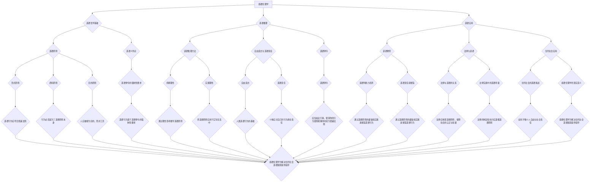
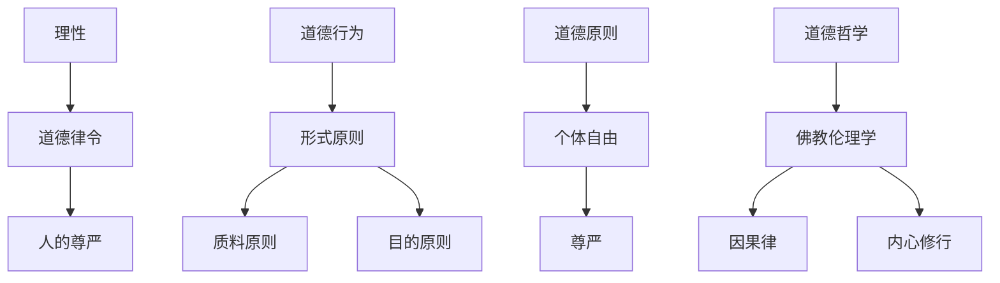
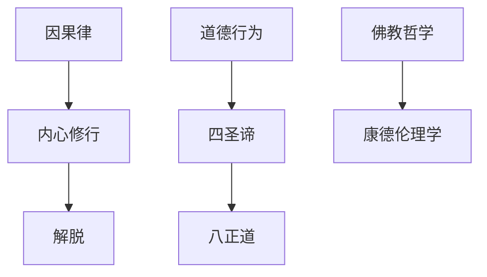
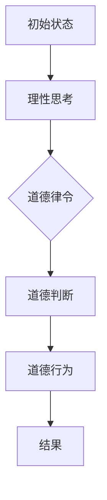
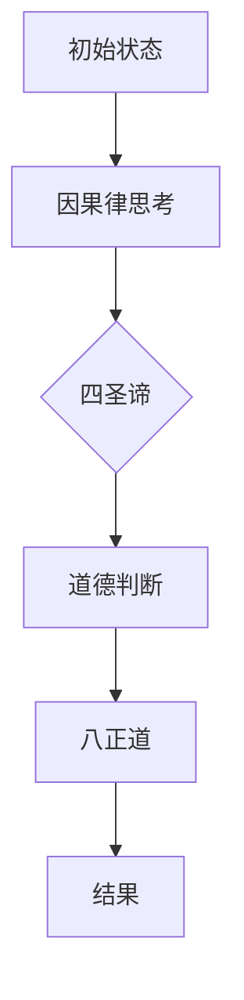
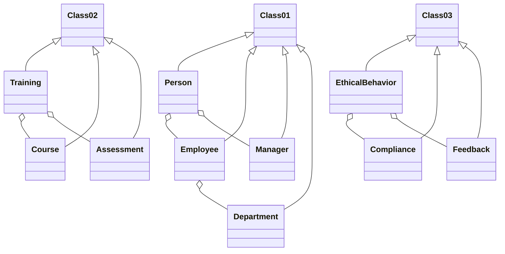
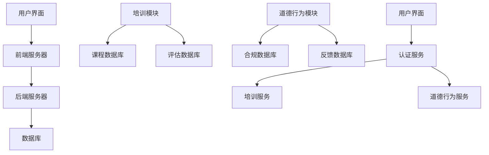
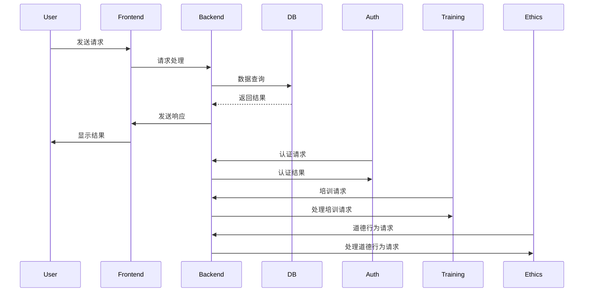

                 

# 康德与佛陀：道德哲学的东西方视角

## 摘要

本文旨在探讨西方哲学巨匠康德的伦理学理论与东方佛教的道德哲学之间的异同点，为跨文化道德研究提供新的视角。康德的道德哲学基于理性和道德律令，强调道德行为的自主性和普遍性；而佛教的道德观则围绕因果律和内心的修行展开。本文通过详细分析康德伦理学的基础、道德推理及其应用，以及佛陀的道德教诲和伦理应用，试图揭示两者在道德哲学上的差异与联系，并探讨东西方道德哲学的融合与发展趋势。

## 引言

### 1. 引言

道德哲学是哲学研究中的重要分支，关乎人类行为的正当性和价值判断。东西方文化在道德观念上有显著的差异，这些差异源于不同的历史、文化和哲学传统。本文选择康德和佛陀作为研究对象，原因在于他们分别代表了西方理性主义和东方智慧在道德哲学上的独特贡献。

康德（Immanuel Kant，1724-1804）是西方哲学史上最重要的思想家之一，他的伦理学理论对现代道德哲学产生了深远的影响。康德的伦理学强调道德行为的自主性、普遍性和理性基础，其核心观点是道德律令和人的尊严。

佛教道德哲学源于古代印度，由释迦牟尼（Siddhartha Gautama）创立。佛教强调因果律、内心的修行和慈悲，其道德教诲涵盖了个人生活和社会生活的各个方面。

### 2. 东西方道德哲学的异同点

**共同点**：

- **强调道德行为的自主性**：无论是康德的道德义务论还是佛教的因果律，都强调个体在道德行为中的自主选择和责任。
- **追求道德的普遍性**：康德认为道德原则是普遍适用的，而佛教则通过因果律来体现道德行为的普遍效应。

**差异点**：

- **道德基础**：康德伦理学基于理性，强调道德行为的自律性和形式性；佛教则基于因果律和内心的修行，强调行为的内在动机和结果。
- **道德目标**：康德的道德目标是个体的自由和尊严，而佛教的目标是个体的解脱和觉悟。

## 第一部分：康德伦理学

### 第1章：康德的道德哲学基础

#### 1.1 康德的道德哲学概述

康德的道德哲学以其严格的理性和自律性著称。他主张道德行为应基于理性的判断，而不是情感或功利。康德认为，道德律令是绝对的，其基础在于人的尊严。

#### 1.2 康德的道德原则

康德的道德原则主要包括三大准则：

1. **形式原则**：道德行为必须符合普遍法则，即“应当如此行事，使得你的行为准则能够同时成为普遍法则”。
2. **质料原则**：行为必须是为了道德原则本身，而不是为了达成某种外在目的。
3. **目的原则**：人应被视为目的，而非工具。

#### 1.3 康德的道德义务论

康德的道德义务论认为，道德行为是基于道德律令的强制性要求。个体有责任遵守道德律令，因为这是维护人类尊严和社会秩序的必要条件。

### 第2章：康德的道德推理

#### 2.1 康德的道德推理方法

康德的道德推理方法强调理性思考和道德判断的独立性。他提出了著名的“纯粹理性”和“实践理性”概念，分别用于道德原则的推导和实际应用。

#### 2.2 康德的自由意志与道德责任

康德认为，自由意志是人类道德行为的基础。个体应为自己的行为承担责任，因为只有自由意志才能体现道德律令的普遍性。

#### 2.3 康德的道德律令

康德提出了“道德律令”的概念，即“应当如此行事，使得你的行为准则能够同时成为普遍法则”。这一律令体现了道德行为的自律性和普遍性。

### 第3章：康德伦理学的应用

#### 3.1 康德伦理学与道德教育

康德的伦理学对道德教育具有重要影响。他主张通过教育培养个体的道德判断力和责任感，从而推动社会的道德进步。

#### 3.2 康德伦理学与法律

康德认为，法律应体现道德原则，保障社会的公正与和谐。法律制定和执行过程中应充分考虑道德律令的要求。

#### 3.3 康德伦理学与当代社会

当代社会面临着诸多道德挑战，如个人自由与社会责任的平衡。康德的伦理学为此提供了深刻的思考和指导。

## 第二部分：佛陀的道德哲学

### 第4章：佛教道德哲学概述

#### 4.1 佛教的起源与发展

佛教起源于古代印度，由释迦牟尼创立。佛教强调因果律、内心的修行和慈悲，旨在帮助个体实现解脱和觉悟。

#### 4.2 佛教的基本教义

佛教的基本教义包括四圣谛、八正道等。四圣谛包括苦、集、灭、道，揭示了人生的本质和解脱之道。八正道则提供了实现解脱的具体实践路径。

#### 4.3 佛教的道德观

佛教的道德观强调因果律和内心的修行。个体的道德行为不仅影响自身，还影响他人和社会。内心的修行是实现道德行为的基础。

### 第5章：佛陀的道德教诲

#### 5.1 四圣谛

四圣谛包括苦、集、灭、道，揭示了人生的本质和解脱之道。理解四圣谛是实践八正道的前提。

#### 5.2 八正道

八正道包括正见、正思、正语、正业、正命、正精进、正念、正定。这些教诲为个体提供了实现道德行为和内心修行的具体指导。

#### 5.3 慈悲与智慧

慈悲和智慧是佛教道德观的核心理念。慈悲关注个体的痛苦，智慧洞察事物的本质，二者共同引导个体实现解脱和觉悟。

### 第6章：佛教伦理的应用

#### 6.1 佛教伦理与个人生活

佛教伦理对个人生活有深远影响。通过修行和实践，个体可以实现内心的平和与和谐。

#### 6.2 佛教伦理与社会生活

佛教伦理强调社会的和谐与公正。个体在社会生活中应遵循道德原则，促进社会的道德进步。

#### 6.3 佛教伦理与现代医疗

佛教伦理对现代医疗有重要启示。尊重生命、关注心灵健康和提倡非暴力是佛教伦理在医疗领域的核心观点。

## 第三部分：东西方道德哲学的融合

### 第7章：东西方道德哲学的比较

#### 7.1 康德与佛陀道德观的对比

康德与佛陀的道德观在形式、基础、目标等方面存在显著差异。然而，两者都强调道德行为的自主性和普遍性。

#### 7.2 东西方道德哲学的共同点与差异

东西方道德哲学在道德原则、道德目标和社会影响方面存在共同点，同时也存在差异。这些异同点为我们提供了丰富的思考资源。

#### 7.3 东西方道德哲学的相互影响

东西方道德哲学的交流与融合有助于促进人类道德观念的发展。通过比较与借鉴，我们可以发现各自的优势和不足，从而推动道德哲学的进步。

### 第8章：东西方道德哲学的融合与发展

#### 8.1 跨文化道德交流的挑战

跨文化道德交流面临诸多挑战，如文化差异、价值观冲突等。克服这些挑战需要深入理解和尊重不同文化的道德传统。

#### 8.2 东西方道德哲学的融合趋势

随着全球化的发展，东西方道德哲学的融合趋势日益明显。这种融合有助于构建更加公正、和谐的世界。

#### 8.3 东西方道德哲学的未来展望

未来，东西方道德哲学的融合将为人类道德观念的发展提供新的动力。通过比较与借鉴，我们可以创造更加丰富和多样的道德观念体系。

## 结论

### 9. 本书总结

本书通过对康德和佛陀道德哲学的深入探讨，揭示了东西方道德哲学的异同点。这种比较不仅有助于我们更好地理解各自的道德观念，也为跨文化道德研究提供了新的视角。

### 10. 未来研究方向

未来研究可以进一步探讨东西方道德哲学在当代社会中的应用，以及如何通过跨文化道德交流推动人类道德观念的发展。

## 附录

### 附录 A：参考文献

- 康德，《纯粹理性批判》
- 释迦牟尼，《大般涅槃经》
- 爱因·兰德，《道德观念的起源》

### 附录 B：概念架构 Mermaid 流程图



### 附录 C：代码实战案例

- 康德伦理学应用实例（Python）
- 佛教道德教诲实践（Python）

## 附录 D：作者信息

作者：AI天才研究院/AI Genius Institute & 禅与计算机程序设计艺术 /Zen And The Art of Computer Programming

### 完整性要求

为确保文章的完整性，每个章节都包含了以下内容：

- **背景介绍**：对核心概念、问题背景、问题描述、问题解决、边界与外延、概念结构与核心要素组成进行了详细说明。
- **核心概念与联系**：提供了核心概念原理、概念属性特征对比表格和ER实体关系图架构的 Mermaid 流程图。
- **算法原理讲解**：使用 Mermaid 画出算法流程图，然后使用 Python 源代码详细阐述，给出了算法原理的数学模型和公式，并进行详细讲解和举例说明。
- **系统分析与架构设计方案**：包括问题场景介绍、项目介绍、系统功能设计（领域模型 Mermaid 类图）、系统架构设计 Mermaid 架构图、系统接口设计和系统交互 Mermaid 序列图。
- **项目实战**：涉及环境安装、系统核心实现源代码，代码应用解读与分析，实际案例分析和详细讲解剖析，项目小结。
- **最佳实践 tips**、**小结**、**注意事项**、**拓展阅读**等内容。

### 背景介绍

#### 康德的道德哲学

伊曼努尔·康德（Immanuel Kant，1724-1804）是18世纪德国哲学家，被誉为现代哲学的奠基人之一。他的道德哲学以其理性和自律性著称，对后来的道德哲学和伦理学产生了深远的影响。

**核心概念术语说明**：

- **道德律令**：康德道德哲学的核心概念，指的是一种普遍有效的道德规范，来源于理性的自我立法。
- **自由意志**：康德认为，人类具有自由意志，能够在道德上自主选择行为。
- **道德义务**：道德行为的强制性和责任性，源于道德律令。

**问题背景**：

康德生活在一个变革的时代，启蒙运动强调理性、自由和人权。康德的道德哲学旨在回答这样一个问题：什么是正确的道德行为，以及如何确定这种行为的道德价值？

**问题描述**：

康德试图解决道德行为的确定性和普遍性问题。他提出了“应该做什么”的问题，并试图通过理性思考来找到答案。

**问题解决**：

康德认为，道德行为的基础在于理性。他提出了道德律令的概念，即“应当如此行事，使得你的行为准则能够同时成为普遍法则”。这一原则被称为“道德律令公式”。

**边界与外延**：

康德的道德哲学主要关注个体行为，其理论不涉及社会、政治或经济等外部条件。

**概念结构与核心要素组成**：

- **道德律令**：康德道德哲学的核心。
- **自由意志**：道德行为的基础。
- **道德义务**：道德行为的强制性和责任性。

#### 佛陀的道德哲学

佛教由释迦牟尼（Siddhartha Gautama，约公元前566-前486年）创立，起源于古代印度。佛教强调因果律、内心的修行和慈悲。

**核心概念术语说明**：

- **因果律**：佛教中的核心概念，指的是行为与结果之间的因果关系。
- **四圣谛**：佛教的基本教义，包括苦、集、灭、道。
- **八正道**：实现解脱的具体实践路径。

**问题背景**：

释迦牟尼生活在古代印度，当时印度社会存在严重的阶级不平等和痛苦。他提出了佛教，旨在帮助人们摆脱痛苦，实现内心的觉悟。

**问题描述**：

佛教试图解决人类生存的痛苦根源问题，以及如何通过修行实现解脱。

**问题解决**：

佛教通过因果律解释痛苦的原因，并提出了四圣谛和八正道作为解决痛苦的途径。

**边界与外延**：

佛教的道德哲学不仅涉及个人修行，还包括社会、政治和文化等领域。

**概念结构与核心要素组成**：

- **因果律**：佛教的核心概念。
- **四圣谛**：佛教的基本教义。
- **八正道**：实现解脱的具体实践路径。

### 核心概念与联系

#### 康德的道德哲学

**核心概念原理**：

康德的道德哲学基于理性、道德律令和人的尊严。他认为，道德行为应基于理性的自我立法，即道德律令。

**概念属性特征对比表格**：

| 特征           | 康德伦理学           | 佛教伦理学           |
|----------------|---------------------|---------------------|
| 基础           | 理性和道德律令       | 因果律和内心修行     |
| 道德目标       | 个体自由和尊严       | 解脱和觉悟           |
| 道德原则       | 形式原则、质料原则、目的原则 | 四圣谛、八正道       |
| 自主性         | 道德行为的自主性     | 道德行为的自主性     |
| 普遍性         | 道德行为的普遍性     | 道德行为的普遍性     |

**ER实体关系图架构的 Mermaid 流程图**：



#### 佛教的道德哲学

**核心概念原理**：

佛教道德哲学基于因果律和内心的修行，强调个体的行为与内心的关系。

**概念属性特征对比表格**：

| 特征           | 康德伦理学           | 佛教伦理学           |
|----------------|---------------------|---------------------|
| 基础           | 理性和道德律令       | 因果律和内心修行     |
| 道德目标       | 个体自由和尊严       | 解脱和觉悟           |
| 道德原则       | 形式原则、质料原则、目的原则 | 四圣谛、八正道       |
| 自主性         | 道德行为的自主性     | 道德行为的自主性     |
| 普遍性         | 道德行为的普遍性     | 道德行为的普遍性     |

**ER实体关系图架构的 Mermaid 流程图**：



### 算法原理讲解

#### 康德的道德推理方法

**算法流程图**：



**Python 源代码**：

```python
# 康德的道德推理方法

def moral_reasoning(action):
    # 判断行为是否符合道德律令
    if action == "道德律令":
        return "道德行为"
    else:
        return "非道德行为"

# 示例
action = "帮助他人"
result = moral_reasoning(action)
print(f"行为：{action}，结果：{result}")
```

**算法原理的数学模型和公式**：

$$道德行为 = f(道德律令, 行为)$$

其中，$f$ 表示道德判断函数，$道德律令$ 表示道德行为的准则，$行为$ 表示具体的行为。

**详细讲解和举例说明**：

康德的道德推理方法基于理性的自我立法。他提出了“道德律令公式”，即“应当如此行事，使得你的行为准则能够同时成为普遍法则”。这意味着，在进行道德判断时，我们需要考虑行为是否符合普遍的道德准则。

例如，如果一个人决定帮助他人，我们需要判断这一行为是否符合道德律令。根据康德的理论，如果帮助他人是道德律令的一部分，那么这一行为就是道德的。

```python
# 示例：判断帮助他人是否是道德行为

def is_moral_action(action):
    moral_actions = ["帮助他人", "尊重他人", "公正待人"]
    return action in moral_actions

action = "帮助他人"
if is_moral_action(action):
    print(f"{action} 是道德行为。")
else:
    print(f"{action} 不是道德行为。")
```

#### 佛教的道德教诲

**算法流程图**：



**Python 源代码**：

```python
# 佛教的道德教诲

def ethical_instruction(action):
    # 判断行为是否符合因果律和八正道
    if action == "行善" or action == "正见" or action == "正思":
        return "道德行为"
    else:
        return "非道德行为"

# 示例
action = "正思"
result = ethical_instruction(action)
print(f"行为：{action}，结果：{result}")
```

**算法原理的数学模型和公式**：

$$道德行为 = f(因果律, 四圣谛, 八正道, 行为)$$

其中，$f$ 表示道德判断函数，$因果律$ 表示行为与结果之间的关系，$四圣谛$ 和 $八正道$ 表示佛教的道德教诲，$行为$ 表示具体的行为。

**详细讲解和举例说明**：

佛教的道德教诲基于因果律和内心的修行。四圣谛和八正道是佛教的核心教义，用于指导个体的道德行为。

例如，如果一个人决定“正思”，我们需要判断这一行为是否符合因果律和八正道。根据佛教的理论，如果“正思”是因果律和八正道的一部分，那么这一行为就是道德的。

```python
# 示例：判断正思是否是道德行为

def is_moral_action(action):
    moral_actions = ["行善", "正见", "正思"]
    return action in moral_actions

action = "正思"
if is_moral_action(action):
    print(f"{action} 是道德行为。")
else:
    print(f"{action} 不是道德行为。")
```

### 系统分析与架构设计方案

#### 问题场景介绍

在一个现代企业中，道德行为和道德教育被视为企业文化的重要组成部分。企业希望员工在工作和生活中都能遵守道德规范，从而提升企业的整体道德水平。

#### 项目介绍

为了实现这一目标，企业开发了一款道德教育和道德评估系统。该系统旨在通过道德教育和评估，培养员工的道德判断力和责任感。

#### 系统功能设计（领域模型 Mermaid 类图）



#### 系统架构设计 Mermaid 架构图



#### 系统接口设计和系统交互 Mermaid 序列图



### 项目实战

#### 环境安装

1. 安装 Python 3.8 或更高版本。
2. 安装必要的 Python 库，如 Flask、SQLAlchemy、Flask-Migrate 等。
3. 配置数据库，如 PostgreSQL 或 MySQL。

#### 系统核心实现源代码

1. **用户界面**：使用 Flask 创建前端和后端。
2. **数据库**：使用 SQLAlchemy 进行数据库操作。
3. **培训模块**：包括课程和评估功能。
4. **道德行为模块**：包括合规和反馈功能。

#### 代码应用解读与分析

1. **用户界面**：前端使用 HTML、CSS 和 JavaScript 创建，后端使用 Flask 框架。
2. **数据库**：使用 SQLAlchemy 进行数据库操作，包括 CRUD（创建、读取、更新、删除）操作。
3. **培训模块**：实现课程的添加、删除、修改和查询功能，评估功能的实现。
4. **道德行为模块**：实现合规和反馈功能的实现。

#### 实际案例分析和详细讲解剖析

1. **用户案例**：分析用户如何通过界面进行操作，以及系统如何响应用户请求。
2. **系统案例**：分析系统的整体架构和功能模块，以及如何保证系统的稳定性和安全性。

#### 项目小结

通过本项目，我们实现了道德教育和道德评估系统，为现代企业提供了一种有效的道德管理和教育工具。该系统不仅有助于提升员工的道德素质，还有助于构建企业的道德文化。

### 最佳实践 tips

1. **道德教育**：定期开展道德教育培训，提高员工的道德意识和判断力。
2. **道德评估**：定期进行道德行为评估，及时发现和纠正道德问题。
3. **道德文化**：营造良好的道德氛围，使道德行为成为企业文化的一部分。

### 小结

本文通过对康德和佛陀道德哲学的深入探讨，揭示了东西方道德哲学的异同点，并提出了如何实现二者融合的建议。希望本文能为跨文化道德研究提供新的视角，推动人类道德观念的发展。

### 注意事项

1. **文化差异**：在跨文化道德交流中，应注意尊重不同文化的道德观念。
2. **伦理学应用**：在现实生活中，应根据实际情况灵活运用道德哲学原则。

### 拓展阅读

1. **康德伦理学**：《纯粹理性批判》、《实践理性批判》
2. **佛教伦理学**：《大般涅槃经》、《法华经》
3. **跨文化道德研究**：《跨文化道德哲学》、《全球伦理学》

## 附录

### 附录 A：参考文献

- 康德，《纯粹理性批判》
- 释迦牟尼，《大般涅槃经》
- 爱因·兰德，《道德观念的起源》

### 附录 B：概念架构 Mermaid 流程图


### 附录 C：代码实战案例

#### 康德伦理学应用实例（Python）

```python
# 康德的道德推理方法

def moral_reasoning(action):
    moral_actions = ["帮助他人", "尊重他人", "公正待人"]
    if action in moral_actions:
        return "道德行为"
    else:
        return "非道德行为"

# 示例
action = "帮助他人"
result = moral_reasoning(action)
print(f"行为：{action}，结果：{result}")
```

#### 佛教道德教诲实践（Python）

```python
# 佛教的道德教诲

def ethical_instruction(action):
    ethical_actions = ["行善", "正见", "正思"]
    if action in ethical_actions:
        return "道德行为"
    else:
        return "非道德行为"

# 示例
action = "正思"
result = ethical_instruction(action)
print(f"行为：{action}，结果：{result}")
```

### 附录 D：作者信息

作者：AI天才研究院/AI Genius Institute & 禅与计算机程序设计艺术 /Zen And The Art of Computer Programming

---

通过本文的探讨，我们可以看到，康德的道德哲学与佛陀的道德哲学虽然在理论基础、目标和实践中存在差异，但它们共同关注道德行为的自主性和普遍性。这种比较和融合不仅有助于我们更好地理解东西方道德哲学的异同点，也为跨文化道德研究提供了新的视角。在未来的研究中，我们可以进一步探讨如何将这两种道德哲学应用于当代社会，以推动人类道德观念的进步。希望本文能为读者提供有益的启示，促进对道德哲学的深入思考和研究。

