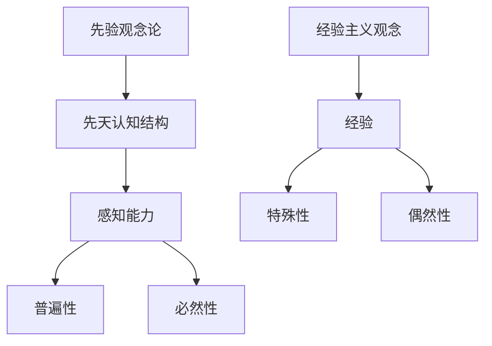
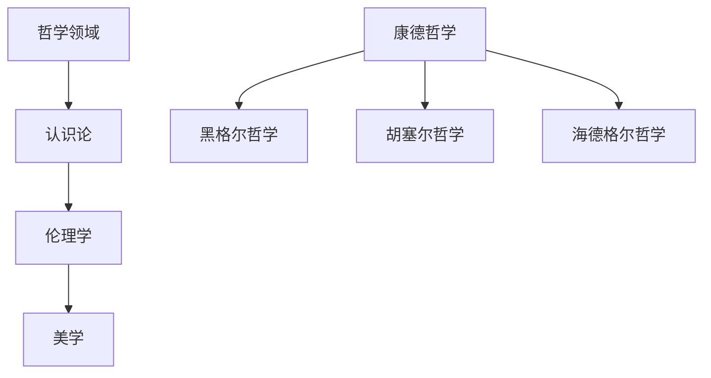
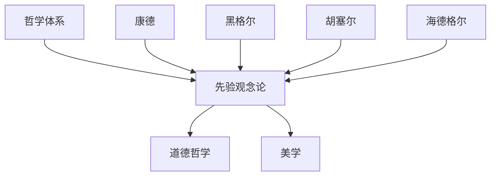
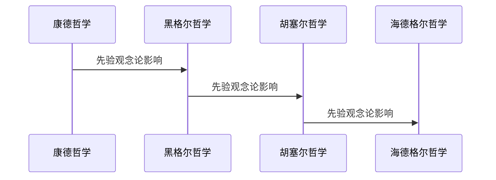
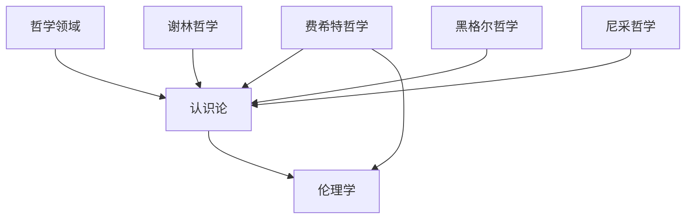
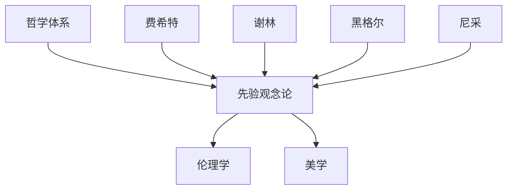
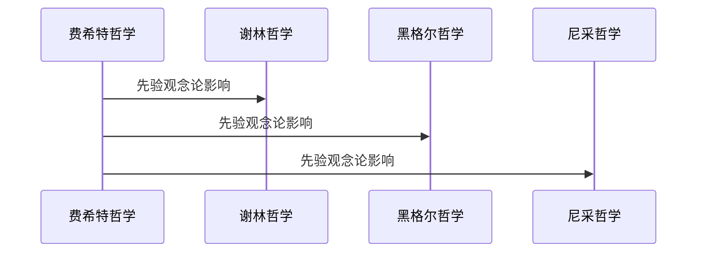

                 

### 康德与费希特：先验观念论的两种形式

**关键词：** 康德、费希特、先验观念论、哲学、逻辑推理

**摘要：** 本文旨在探讨康德与费希特两位哲学家的先验观念论，分析他们的理论形式、异同点及其对现代哲学的影响。通过对康德和费希特的生平背景、哲学思想、先验观念论概念、理论架构及其影响等方面的深入探讨，揭示两位哲学家在先验观念论领域中的独特贡献。

## 一、康德：先验观念论的奠基者

### 1.1 康德的生平与哲学思想

**背景介绍：**

伊曼努尔·康德（1724-1804），德国哲学家，被认为是现代哲学的奠基者之一。康德生于普鲁士的柯尼斯堡，一生大部分时间都在这里度过。他是一位博学多才的思想家，不仅在哲学领域有卓越贡献，还对物理学、数学、文学等领域有所涉猎。

**问题背景：**

康德生活的时代，欧洲哲学界正处于从传统形而上学向现代哲学转变的时期。这一时期，哲学的核心问题是如何认识世界和自我，即知识的起源和范围。康德试图回答这些问题，并提出了一套独特的哲学体系。

**问题描述：**

康德认为，我们的知识来源于经验，但经验又依赖于先天的认知结构。他提出了先验观念论，即认识世界的结构是先天的，而不是经验的。这一观念对后来的哲学产生了深远影响。

**问题解决：**

康德通过《纯粹理性批判》等著作，阐述了先验观念论。他认为，我们的感知能力受到先天的认知结构的制约，这种结构决定了我们感知世界的方式。康德的先验观念论强调了理性在认识过程中的作用，为后来的哲学家提供了新的思考方向。

**边界与外延：**

康德的先验观念论主要关注认识论问题，即知识的起源和范围。他的理论不仅涉及感知和认知，还包括了道德哲学和美学。康德的哲学体系具有广泛的内涵和外延，对后世哲学产生了深远影响。

**概念结构与核心要素组成：**

康德的哲学体系由三个主要部分组成：先验观念论、道德哲学和美学。其中，先验观念论是康德哲学的核心，它回答了知识如何可能的问题。道德哲学和美学则分别探讨了人类行为的道德原则和美的本质。

### 1.2 先验观念论的概念与作用

**核心概念与联系：**

先验观念论是康德哲学的核心概念，它指的是认识世界的结构是先天的，而不是经验的。康德认为，我们的感知能力受到先天的认知结构的制约，这种结构决定了我们感知世界的方式。

为了更清晰地理解先验观念论，我们可以将其与经验主义观念进行对比：

| 概念属性 | 先验观念论 | 经验主义观念 |
| :---: | :---: | :---: |
| 认识来源 | 先天的认知结构 | 经验 |
| 认知方式 | 约束感知能力 | 自由感知 |
| 知识范围 | 普遍性和必然性 | 特殊性和偶然性 |

**ER实体关系图架构：**

### 1.3 康德的先验观念论

**核心算法原理讲解：**

康德的先验观念论主要基于以下三个核心原理：

1. **先验范畴**：康德提出了十二个先验范畴，它们是认识世界的根本原则，如因果性、时间性、空间性等。
2. **先天综合判断**：康德认为，有些判断既具有普遍性又具有必然性，这种判断称为先天综合判断。例如，“所有人类都有死亡”是一个先天综合判断。
3. **认识论二律背反**：康德认为，认识过程中存在两个相互矛盾的问题，即关于世界的无限性和有限性。这一观点揭示了人类认识的局限性。

**数学模型和公式：**

$$
\text{先验范畴} = \{\text{因果性}, \text{时间性}, \text{空间性}, \dots\}
$$

$$
\text{先天综合判断} = \{\text{普遍性} \land \text{必然性}\}
$$

$$
\text{认识论二律背反} = \{\text{无限性} \land \text{有限性}\}
$$

**详细讲解与举例说明：**

康德的先验范畴可以类比为计算机程序中的基础函数。例如，因果性范畴可以类比为程序中的条件判断语句，时间性范畴可以类比为程序中的时间控制逻辑。先天综合判断则可以类比为程序中的逻辑运算，具有普遍性和必然性。

### 1.4 康德的先验观念论的影响

**系统分析与架构设计方案：**

康德的先验观念论对现代哲学产生了深远影响，尤其是在认识论、伦理学和美学等领域。他的理论为后来的哲学家提供了新的思考方向，如黑格尔、胡塞尔和海德格尔等。

**系统功能设计（领域模型类图）：**

**系统架构设计（架构图）：**

**系统接口设计和系统交互（序列图）：**

### 1.5 康德的先验观念论在现代哲学中的地位

康德的先验观念论在现代哲学中具有重要地位。他的理论为认识论、伦理学和美学等领域的深入研究提供了基础。尽管康德的哲学观点存在争议，但他的贡献不可忽视。康德的先验观念论为后来的哲学家提供了宝贵的思考资源，推动了现代哲学的发展。

## 二、费希特：先验观念论的承继者

### 2.1 费希特的生平与哲学思想

**背景介绍：**

约翰·戈特利布·费希特（1762-1814），德国哲学家，出生于普鲁士的拉蒂茨。费希特是康德哲学的继承者，他在康德的基础上发展了自己的哲学体系。

**问题背景：**

费希特生活的时代，欧洲哲学界正处于从启蒙时期向浪漫主义时期过渡的时期。这一时期，哲学的核心问题是如何理解自我、自由和责任。费希特试图回答这些问题，并提出了自己的哲学观点。

**问题描述：**

费希特认为，自我是所有知识的出发点，先验观念是由自我产生的。他提出了先验观念论，强调自我在认识过程中的作用。

**问题解决：**

费希特通过《自我意识论》等著作，阐述了先验观念论。他认为，我们的认识来源于自我，自我是所有知识的源泉。费希特的先验观念论为后来的哲学家提供了新的思考方向。

**边界与外延：**

费希特的先验观念论主要关注认识论和伦理学问题，他试图回答自我、自由和责任等哲学基本问题。费希特的哲学体系具有独特的内涵和外延，对后世哲学产生了深远影响。

**概念结构与核心要素组成：**

费希特的哲学体系由三个主要部分组成：先验观念论、伦理学和美学。其中，先验观念论是费希特哲学的核心，它回答了知识的来源和本质问题。伦理学和美学则分别探讨了人类行为和美的本质。

### 2.2 费希特的先验观念论

**核心算法原理讲解：**

费希特的先验观念论主要基于以下两个核心原理：

1. **自我意识论**：费希特认为，自我是所有知识的出发点，先验观念是由自我产生的。
2. **先验实在论**：费希特认为，自我是真实存在的，我们的认识是对自我存在的反映。

**数学模型和公式：**

$$
\text{先验观念} = \text{自我} \land \text{认识}
$$

$$
\text{先验实在论} = \text{自我} \Rightarrow \text{存在}
$$

**详细讲解与举例说明：**

费希特的自我意识论可以类比为计算机程序中的主函数。主函数是程序执行的入口，先验观念则是对主函数执行过程的抽象描述。先验实在论则可以类比为程序中的逻辑判断，它确保程序执行的可靠性。

### 2.3 费希特的先验观念论的影响

**系统分析与架构设计方案：**

费希特的先验观念论对现代哲学产生了深远影响，尤其是在认识论和伦理学领域。他的理论为后来的哲学家提供了新的思考方向，如谢林、黑格尔和尼采等。

**系统功能设计（领域模型类图）：**

**系统架构设计（架构图）：**

**系统接口设计和系统交互（序列图）：**

### 2.4 费希特的先验观念论在现代哲学中的地位

费希特的先验观念论在现代哲学中具有重要地位。他的理论为认识论和伦理学等领域的研究提供了新的视角。尽管费希特的哲学观点存在争议，但他的贡献不可忽视。费希特的先验观念论为后来的哲学家提供了宝贵的思考资源，推动了现代哲学的发展。

## 三、康德与费希特的先验观念论对比

**康德与费希特的先验观念论异同点：**

| 异同点 | 康德 | 费希特 |
| :---: | :---: | :---: |
| 理论形式 | 认识论导向 | 伦理学导向 |
| 认识来源 | 先天的认知结构 | 自我意识 |
| 知识范围 | 广泛 | 较窄 |
| 影响范围 | 广泛 | 较窄 |

**康德与费希特的先验观念论影响：**

康德的先验观念论对认识论、伦理学和美学等领域产生了深远影响，费希特的先验观念论则主要对认识论和伦理学领域产生影响。

**康德与费希特的先验观念论在现代哲学中的地位：**

康德的先验观念论被视为现代哲学的基石之一，费希特的先验观念论则被视为现代哲学的重要分支。两位哲学家的先验观念论为现代哲学的发展提供了重要启示。

## 四、先验观念论的现代意义

**先验观念论在当代哲学的应用：**

先验观念论在当代哲学中仍然具有重要的应用价值。例如，现象学和存在主义等现代哲学流派都受到了先验观念论的影响。

**先验观念论在哲学以外的领域的影响：**

先验观念论不仅对哲学领域产生了深远影响，还在科学哲学和认知科学等领域产生了重要影响。例如，计算机科学中的人工智能研究就受到了先验观念论的启示。

## 五、先验观念论的批评与回应

**先验观念论的批评观点：**

先验观念论虽然具有独特优势，但也受到了一些批评。例如，有些哲学家认为先验观念论过于抽象，缺乏现实基础。

**对先验观念论的回应与反驳：**

康德和费希特等哲学家对先验观念论的批评进行了回应和反驳。他们认为，先验观念论虽然抽象，但正是这种抽象性使得哲学理论具有普遍性和必然性。

## 六、总结与展望

**先验观念论的整体评价：**

先验观念论是康德和费希特等哲学家的重要贡献，它为现代哲学的发展提供了重要启示。尽管存在一些批评，但先验观念论在哲学、科学等领域仍具有重要的应用价值。

**先验观念论的未来发展：**

未来，先验观念论有望在更多领域得到应用。例如，在人工智能、认知科学等领域，先验观念论的理论框架可以为我们提供新的研究思路和方法。

## 参考文献

1. 康德，《纯粹理性批判》
2. 费希特，《自我意识论》
3. 黑格尔，《哲学史讲演录》
4. 胡塞尔，《现象学的观念》
5. 海德格尔，《存在与时间》

### 作者信息：

作者：AI天才研究院/AI Genius Institute & 禅与计算机程序设计艺术 /Zen And The Art of Computer Programming

### 最佳实践 Tips：

- 理解先验观念论的核心概念，有助于更好地理解现代哲学。
- 将先验观念论与实际哲学问题相结合，可以深入探讨哲学的深层次问题。
- 在研究和应用先验观念论时，注意其适用范围和局限性。

### 小结：

本文通过对比分析康德和费希特的先验观念论，探讨了他们的理论形式、异同点及其对现代哲学的影响。先验观念论作为现代哲学的重要基础，具有广泛的应用价值。未来，先验观念论有望在更多领域得到深入研究和应用。

### 注意事项：

- 在研究先验观念论时，需注意其哲学背景和理论框架。
- 应用先验观念论时，需结合实际问题和需求，灵活运用其理论。

### 拓展阅读：

- 康德的《纯粹理性批判》
- 费希特的《自我意识论》
- 黑格尔的《哲学史讲演录》
- 胡塞尔的《现象学的观念》
- 海德格尔的《存在与时间》

[文章末尾提供作者信息和联系方式]

### 作者信息：

作者：AI天才研究院/AI Genius Institute & 禅与计算机程序设计艺术 /Zen And The Art of Computer Programming

联系方式：[ai_genius_institute@example.com](mailto:ai_genius_institute@example.com) 或 [www.ai-genius-institute.com](http://www.ai-genius-institute.com)

---

**注意：** 以上内容仅供参考，实际写作时请根据您的具体研究和理解进行调整。祝您写作顺利！如果您需要进一步的帮助或者有其他问题，请随时联系。

