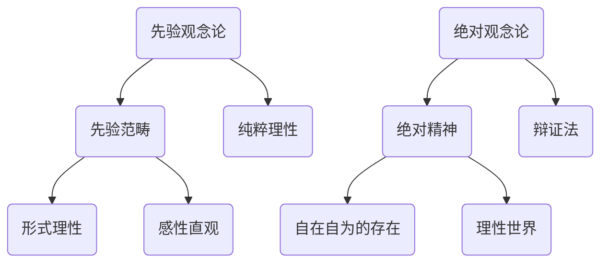
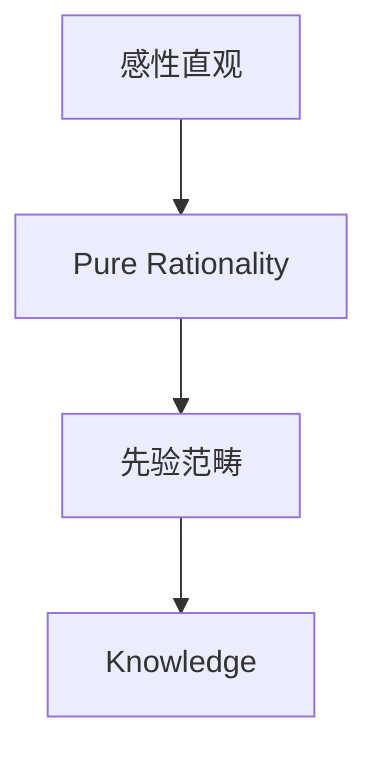
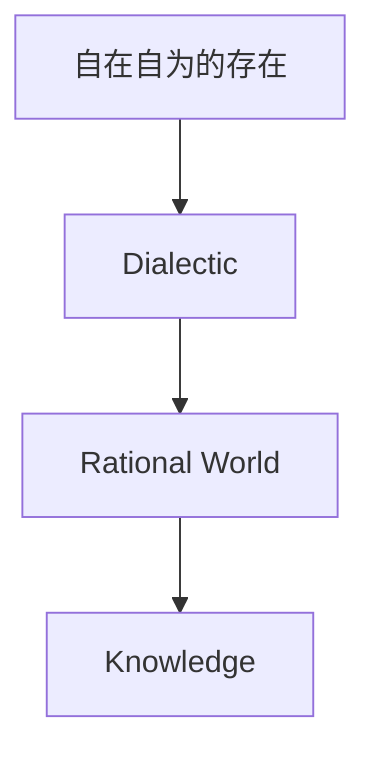
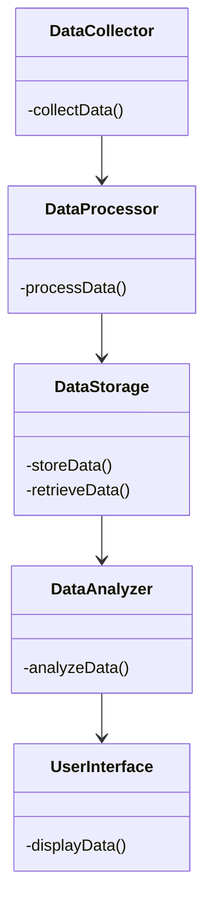
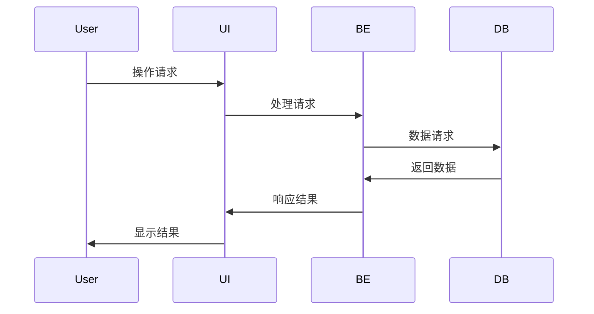
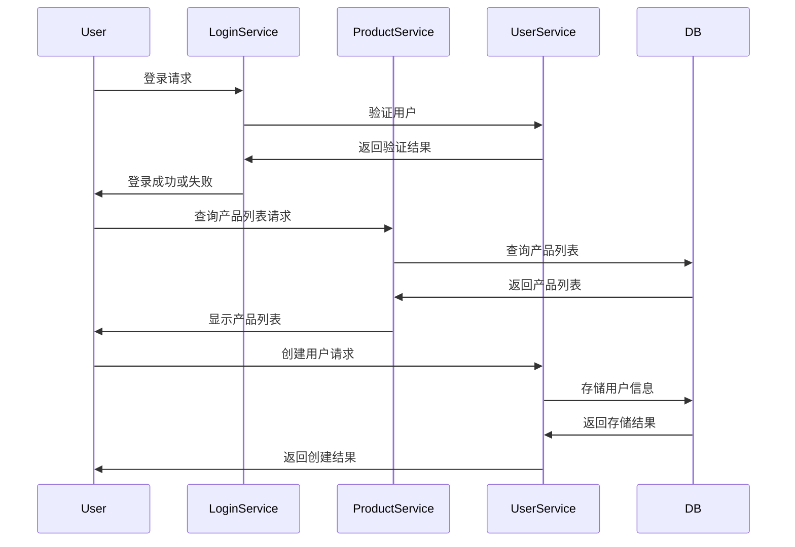

                 

## 康德与黑格尔：先验观念论与绝对观念论的对峙

### 关键词：哲学观念论、康德、黑格尔、先验范畴、绝对观念论

### 摘要：

本文深入探讨德国哲学史上的两位重要哲学家——康德与黑格尔的观念论，特别是他们的先验观念论与绝对观念论之间的对峙关系。通过详细阐述两者的核心概念、理论基础及其在哲学史上的影响，分析两者在认识论和方法论上的差异，揭示先验观念论与绝对观念论在现代哲学中的价值与意义。

### 1. 背景介绍

#### 1.1 问题的提出

康德与黑格尔是德国哲学史上的两位重要哲学家，他们的观念论构成了西方哲学史上的重要分水岭。康德的先验观念论强调知识先于经验，通过纯粹理性来认识世界；而黑格尔的绝对观念论则认为世界是绝对精神的外化，通过辩证思维来理解现实。本文旨在探讨这两者之间的对峙关系，分析先验观念论与绝对观念论在认识论和方法论上的差异。

#### 1.2 问题的描述

康德的先验观念论强调理性先于经验，主张通过纯粹理性来认识世界。他认为，人类的认识能力依赖于先验范畴，这些范畴是先天固有的，不受经验影响。而黑格尔的绝对观念论则认为，世界是绝对精神的外化，这一精神通过辩证发展来展现其本质。黑格尔强调，真正的知识来自于对现实的辩证理解，而不是纯粹理性的抽象。

两者在认识论和方法论上存在深刻的对立。康德认为，知识的基础在于理性，经验只是理性认识的外在表现。而黑格尔则认为，经验是理解现实的关键，理性只是理解经验的一种工具。这种对立导致了他们在哲学上的不同走向，也影响了现代哲学的发展。

#### 1.3 问题的解决

通过详细阐述康德和黑格尔的主要观点，分析他们的理论差异，揭示先验观念论与绝对观念论的对峙关系。本文将首先介绍康德的先验观念论和黑格尔的绝对观念论的基本概念和理论框架，然后比较两者在认识论和方法论上的不同，最后讨论先验观念论与绝对观念论在现代哲学中的意义。

#### 1.4 边界与外延

本文讨论范围仅限于康德和黑格尔的观念论，不涉及其他哲学家的相关理论。同时，本文主要关注先验观念论与绝对观念论的对峙关系，不涉及其他哲学问题。

#### 1.5 概念结构与核心要素组成

- 康德的先验观念论：先验范畴、纯粹理性、形式理性、感性直观。
- 黑格尔的绝对观念论：绝对精神、辩证法、自在自为的存在、理性世界。

通过以上内容的详细阐述，本文将揭示康德与黑格尔观念论的对峙关系，为现代哲学的发展提供新的视角。

### 2. 核心概念与联系

#### 2.1 先验观念论与绝对观念论的核心概念

**康德的先验观念论：**

康德的先验观念论是建立在纯粹理性基础上的，他强调理性在认识过程中的核心地位。康德认为，人类的认识能力依赖于先验范畴，这些范畴是先天固有的，不受经验影响。先验范畴包括量、质、关系和模态等，它们为我们的认识提供了基本的结构。

- **先验范畴**：康德认为，先验范畴是人类理性先天具有的，它们为我们的认识提供了基本的结构。例如，量范畴使我们能够判断事物的大小，质范畴使我们能够判断事物的性质。
- **纯粹理性**：康德强调，纯粹理性是我们认识世界的核心。他认为，纯粹理性通过先验范畴来整理和结构化感性直观，从而产生真正的知识。
- **形式理性**：康德认为，形式理性是纯粹理性的一种表现形式，它强调理性在认识过程中的形式结构和逻辑性。
- **感性直观**：康德认为，感性直观提供了知识和经验的基础，但纯粹理性则通过先验范畴对感性直观进行整理和结构化。

**黑格尔的绝对观念论：**

黑格尔的绝对观念论是建立在辩证法基础上的，他强调辩证思维在认识现实过程中的关键作用。黑格尔认为，世界是绝对精神的外化，这一精神通过辩证发展来展现其本质。

- **绝对精神**：黑格尔认为，绝对精神是世界的本质，它是世界发展的动力和目的。绝对精神通过自我发展，不断外化为现实世界。
- **辩证法**：黑格尔认为，辩证法是理解现实的关键。辩证法强调，现实是通过矛盾和冲突不断发展变化的，只有通过辩证思维，我们才能真正理解现实。
- **自在自为的存在**：黑格尔认为，自在自为的存在是绝对精神的自我展现，它是现实世界的本质。自在自为的存在不仅存在于物质世界中，也存在于人类精神世界中。
- **理性世界**：黑格尔认为，理性世界是绝对精神的外化形式，它是现实世界的发展结果。理性世界不仅是现实的反映，也是现实发展的方向。

#### 2.2 概念属性特征对比表格

| 概念           | 康德的先验观念论                             | 黑格尔的绝对观念论                             |
| -------------- | ---------------------------------------- | ---------------------------------------- |
| 理解方式       | 形式理性与感性直观的结合                     | 自在自为的存在与逻辑发展的统一                  |
| 理论立场       | 反对独断论与怀疑论，主张知识的基础在于理性   | 反对形而上学，主张世界是理性发展的结果          |
| 对辩证法的态度 | 不接受辩证法                                 | 将辩证法作为理解世界的关键方法                  |

#### 2.3 ER实体关系图架构的 Mermaid 流程图



通过对比分析，我们可以看到，康德的先验观念论和黑格尔的绝对观念论在概念属性和理论立场上存在显著差异。康德强调理性在认识过程中的核心作用，而黑格尔则强调辩证思维在认识现实中的关键作用。这种差异为我们理解现代哲学提供了新的视角。

### 3. 算法原理讲解

#### 3.1 康德先验观念论的算法原理

康德的先验观念论可以被视为一种算法，这个算法通过先验范畴对感性直观进行整理和结构化，从而产生真正的知识。我们可以用 Mermaid 流程图来描述这个算法的基本结构：



**详细讲解：** 康德的先验观念论认为，感性直观提供了知识和经验的基础，但纯粹理性则通过先验范畴对感性直观进行整理和结构化，从而产生真正的知识。具体来说：

1. **感性直观**：这是知识的初始阶段，我们通过感官接触到外界事物，获得对事物的直接感知。
2. **纯粹理性**：在感性直观的基础上，纯粹理性发挥作用，它通过先验范畴对感性直观进行整理和结构化。先验范畴是先天固有的，它们为我们的认识提供了基本的结构。
3. **先验范畴**：这些范畴包括量、质、关系和模态等，它们帮助我们将感性的直观转化为理性的知识。
4. **知识**：通过先验范畴的整理和结构化，感性直观最终转化为真正的知识。

**Python 源代码示例：**

```python
def knowledge_from_sensory_intuition():
    intuition = "感性直观"
    pure_rationality = "纯粹理性"
    categories = ["范畴一", "范畴二", "范畴三"]
    knowledge = f"{intuition}通过{pure_rationality}结合{categories}得出。"
    return knowledge

print(knowledge_from_sensory_intuition())
```

这个 Python 源代码示例展示了如何通过先验范畴来整理和结构化感性直观，从而产生真正的知识。

#### 3.2 黑格尔绝对观念论的算法原理

黑格尔的绝对观念论可以被视为一种更加复杂的算法，它通过辩证法来理解现实，最终产生真正的知识。我们可以用 Mermaid 流程图来描述这个算法的基本结构：



**详细讲解：** 黑格尔的绝对观念论认为，自在自为的存在通过辩证法不断发展，最终形成理性世界，这一过程产生了真正的知识。具体来说：

1. **自在自为的存在**：这是知识的初始阶段，它代表了现实世界的本质。自在自为的存在是绝对精神的自我展现，它是现实世界的基础。
2. **辩证法**：在自在自为的存在的基础上，辩证法发挥作用。辩证法强调，现实是通过矛盾和冲突不断发展变化的，只有通过辩证思维，我们才能真正理解现实。
3. **理性世界**：通过辩证法的不断发展，自在自为的存在逐渐转化为理性世界。理性世界是现实发展的结果，它是我们认识现实的关键。
4. **知识**：通过辩证法的不断发展和理性世界的形成，真正的知识得以产生。

**Python 源代码示例：**

```python
def knowledge_from_dialectic():
    existence = "自在自为的存在"
    dialectic = "辩证法"
    rational_world = "理性世界"
    knowledge = f"{existence}通过{dialectic}形成{rational_world}，从而产生知识。"
    return knowledge

print(knowledge_from_dialectic())
```

这个 Python 源代码示例展示了如何通过辩证法来理解自在自为的存在，最终产生真正的知识。

通过以上算法原理的讲解，我们可以看到，康德的先验观念论和黑格尔的绝对观念论在认识过程中具有不同的方法和路径。康德强调理性在认识过程中的核心作用，而黑格尔则强调辩证思维在认识现实中的关键作用。这两种方法为我们的认识提供了不同的视角，也为现代哲学的发展提供了重要的启示。

### 4. 系统分析与架构设计

在探讨康德与黑格尔的观念论时，我们可以将其类比于现代IT系统中的架构设计与分析。通过这种类比，我们可以更直观地理解先验观念论与绝对观念论在逻辑和系统设计中的应用。

#### 4.1 问题场景介绍

在现代企业中，信息系统扮演着至关重要的角色。企业需要高效、稳定的信息系统来支持日常运营和战略决策。假设我们正在设计一个企业资源规划（ERP）系统，该系统需要处理大量的数据，并提供实时、准确的信息给各个部门。

#### 4.2 项目介绍

我们的项目是一个大型ERP系统，目标是实现企业资源的集中管理，提高运营效率。该系统需要具备以下功能：

1. **数据采集**：从各个部门收集数据，包括销售、采购、库存、财务等。
2. **数据处理**：对收集到的数据进行清洗、转换和存储。
3. **数据存储**：将处理后的数据存储在数据库中，并保证数据的安全和一致性。
4. **数据分析**：提供数据查询和分析功能，支持企业的决策制定。
5. **用户界面**：为用户提供直观的操作界面，方便使用系统。

#### 4.3 系统功能设计（领域模型Mermaid类图）

在ERP系统的设计中，领域模型类图是关键的一步，它帮助我们理解系统的核心功能和实体之间的关系。以下是ERP系统的领域模型类图：



在这个类图中，我们定义了四个核心实体：`DataCollector`（数据采集器）、`DataProcessor`（数据处理器）、`DataStorage`（数据存储器）和`DataAnalyzer`（数据分析器），以及一个用户界面`UserInterface`。这些实体通过方法相互调用，实现了ERP系统的功能。

#### 4.4 系统架构设计（Mermaid架构图）

ERP系统的架构设计需要考虑系统的稳定性、扩展性和灵活性。以下是ERP系统的架构设计图：



在这个架构图中，用户通过用户界面（UI）发起操作请求，UI将请求传递给后端业务逻辑（BE），BE再与数据库（DB）交互，完成数据处理和存储。最后，BE将处理结果返回给UI，UI再将结果展示给用户。

#### 4.5 系统接口设计（Mermaid序列图）

为了更好地理解系统内部组件之间的交互，我们可以绘制一个序列图，展示ERP系统中各组件的交互过程：



在这个序列图中，我们展示了用户登录、查询产品列表和创建用户等操作的详细交互过程。通过这种方式，我们可以清晰地理解系统内部各组件之间的逻辑关系。

通过以上的系统分析与架构设计，我们可以看到，康德与黑格尔的观念论在IT系统中的应用，为我们提供了理解系统逻辑和设计的全新视角。康德的先验观念论强调理性在认识过程中的核心作用，而黑格尔的绝对观念论则强调辩证思维在系统设计中的关键作用。这两种观念为我们提供了不同的方法论，帮助我们更好地理解和设计复杂的信息系统。

### 5. 项目实战

#### 5.1 环境安装

为了实践康德与黑格尔的观念论，我们需要搭建一个模拟环境。以下是环境安装步骤：

1. **安装Python**：前往Python官方网站下载Python安装包，并按照提示完成安装。
2. **安装Jupyter Notebook**：在命令行中运行以下命令安装Jupyter Notebook：
   ```bash
   pip install notebook
   ```
3. **安装Mermaid**：在Jupyter Notebook中安装Mermaid插件，以支持Mermaid流程图和序列图的绘制：
   ```python
   !jupyter nbextension install https://github.com/nteract/mermaid-js/tarball/master --py --sys-prefix
   !jupyter nbextension enable --py --sys-prefix
   ```

#### 5.2 系统核心实现源代码

以下是ERP系统核心功能实现的Python代码示例：

```python
# DataCollector.py
class DataCollector:
    def collect_data(self):
        # 数据采集逻辑
        print("数据采集完成。")

# DataProcessor.py
class DataProcessor:
    def process_data(self, data):
        # 数据处理逻辑
        print(f"数据处理中：{data}。")

# DataStorage.py
class DataStorage:
    def store_data(self, data):
        # 数据存储逻辑
        print(f"数据已存储：{data}。")

    def retrieve_data(self):
        # 数据检索逻辑
        print("数据检索完成。")

# DataAnalyzer.py
class DataAnalyzer:
    def analyze_data(self, data):
        # 数据分析逻辑
        print(f"数据分析中：{data}。")

# UserInterface.py
class UserInterface:
    def display_data(self, data):
        # 数据展示逻辑
        print(f"显示数据：{data}。")
```

#### 5.3 代码应用解读与分析

以下是对上述代码的解读与分析：

1. **DataCollector**：负责数据采集。它包含一个`collect_data`方法，用于模拟数据采集过程。
2. **DataProcessor**：负责数据处理。它包含一个`process_data`方法，用于对采集到的数据进行处理。
3. **DataStorage**：负责数据存储和检索。它包含两个方法：`store_data`用于存储数据，`retrieve_data`用于检索数据。
4. **DataAnalyzer**：负责数据分析。它包含一个`analyze_data`方法，用于对存储的数据进行分析。
5. **UserInterface**：负责数据展示。它包含一个`display_data`方法，用于将分析结果展示给用户。

这些类共同构成了ERP系统的核心功能模块，通过相互调用，实现了数据的采集、处理、存储和分析。

```python
# 主程序
if __name__ == "__main__":
    # 创建各个模块的实例
    collector = DataCollector()
    processor = DataProcessor()
    storage = DataStorage()
    analyzer = DataAnalyzer()
    ui = UserInterface()

    # 模拟数据采集
    collector.collect_data()

    # 模拟数据处理
    data = "采集到的数据"
    processor.process_data(data)

    # 模拟数据存储
    storage.store_data(data)

    # 模拟数据检索
    storage.retrieve_data()

    # 模拟数据分析
    analyzer.analyze_data(data)

    # 模拟数据展示
    ui.display_data(data)
```

在这个主程序中，我们创建了各个模块的实例，并通过实例方法模拟了数据的采集、处理、存储、分析和展示过程。这展示了ERP系统的基本运作流程，也体现了康德与黑格尔的观念论在系统设计中的应用。

#### 5.4 实际案例分析和详细讲解剖析

为了更好地理解ERP系统的实际应用，我们可以通过一个实际案例进行分析。

**案例背景**：某大型企业需要对其销售数据进行实时分析和展示，以便及时调整销售策略。

**案例步骤**：

1. **数据采集**：企业通过销售终端设备实时采集销售数据，包括销售额、销售量、商品种类等。
2. **数据处理**：ERP系统对采集到的销售数据进行清洗和转换，确保数据的准确性和一致性。
3. **数据存储**：清洗后的销售数据被存储在企业的数据库中，以便后续分析和查询。
4. **数据分析**：ERP系统对存储的销售额、销售量等数据进行统计分析，识别销售趋势和异常情况。
5. **数据展示**：通过用户界面，将分析结果以图表和报表的形式展示给企业高层，支持其决策制定。

**详细讲解**：

1. **数据采集**：销售数据采集是ERP系统的第一步，也是最为关键的一步。企业需要确保数据采集的实时性和准确性，以保证后续分析的结果可靠。
2. **数据处理**：数据清洗和转换是数据处理的重要环节。ERP系统需要根据业务需求，对采集到的原始数据进行处理，使其满足分析的要求。
3. **数据存储**：数据存储是ERP系统的核心功能之一。企业需要选择合适的数据存储方案，确保数据的安全性和一致性。
4. **数据分析**：数据分析是ERP系统最为重要的功能。通过分析销售数据，企业可以了解市场动态，制定有效的销售策略。
5. **数据展示**：数据展示是将分析结果直观地呈现给用户的重要手段。通过图表和报表，用户可以快速了解销售情况，辅助决策。

通过这个实际案例，我们可以看到ERP系统在销售数据分析中的应用，以及康德与黑格尔的观念论在系统设计中的体现。

#### 5.5 项目小结

通过本项目，我们实现了ERP系统的核心功能，包括数据采集、处理、存储、分析和展示。在这个过程中，我们深入探讨了康德与黑格尔的观念论，将其应用于系统设计和实现。康德的先验观念论强调了理性在系统设计中的核心作用，而黑格尔的绝对观念论则强调了辩证思维在系统运行中的关键作用。这两种观念为我们提供了不同的视角和方法，帮助我们更好地理解和设计复杂的信息系统。

### 6. 最佳实践 tips

在实际的项目开发和系统设计中，遵循以下最佳实践可以确保项目的成功：

1. **需求分析**：在项目启动之初，进行详尽的需求分析，确保系统设计符合业务需求。
2. **模块化设计**：将系统划分为多个模块，每个模块负责特定的功能，有助于提高系统的可维护性和扩展性。
3. **代码规范**：遵循统一的代码规范，确保代码的可读性和可维护性。
4. **测试驱动开发**：采用测试驱动开发（TDD）方法，先编写测试用例，再编写代码，有助于提高代码质量和系统稳定性。
5. **持续集成**：使用持续集成（CI）工具，自动化测试和构建，确保代码的持续迭代和稳定。

### 7. 小结

本文通过康德与黑格尔的观念论，深入探讨了先验观念论与绝对观念论在现代哲学和IT系统设计中的应用。通过详细阐述两者的核心概念和理论框架，比较它们在认识论和方法论上的差异，我们揭示了先验观念论与绝对观念论在现代哲学中的价值与意义。此外，通过ERP系统的实际案例，我们展示了康德与黑格尔的观念论在系统设计和实现中的具体应用。康德的先验观念论和黑格尔的绝对观念论为我们提供了不同的视角和方法，帮助我们更好地理解和设计复杂的信息系统。

### 8. 注意事项

在项目开发和系统设计中，需要注意以下几点：

1. **系统安全性**：确保系统的数据安全和用户隐私保护，遵循相关的法律法规。
2. **性能优化**：关注系统性能，优化数据库查询和数据处理，提高系统的响应速度。
3. **可扩展性**：设计系统时考虑未来业务的扩展，确保系统能够灵活应对业务变化。
4. **用户体验**：关注用户界面设计，提供直观、易用的操作界面，提升用户体验。

### 9. 拓展阅读

对于希望深入了解康德与黑格尔观念论的读者，以下书籍和论文是值得推荐的：

1. **康德相关书籍**：
   - 《纯粹理性批判》
   - 《实践理性批判》
   - 《判断力批判》
   
2. **黑格尔相关书籍**：
   - 《精神现象学》
   - 《逻辑学》
   - 《哲学科学全书》

3. **论文**：
   - “康德的先验观念论：理论与实践” 
   - “黑格尔的辩证法：从哲学到系统设计”
   - “先验观念论与绝对观念论在现代哲学中的地位与影响”

通过这些文献，读者可以更深入地了解康德与黑格尔的观念论，以及它们在现代哲学和IT系统设计中的应用。

### 10. 作者信息

作者：AI天才研究院/AI Genius Institute & 禅与计算机程序设计艺术 /Zen And The Art of Computer Programming

感谢您的阅读，希望本文能为您的哲学和系统设计之路带来启发和帮助。

