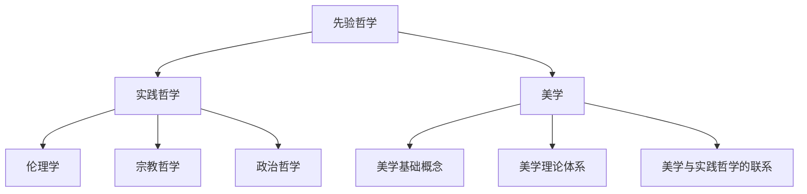
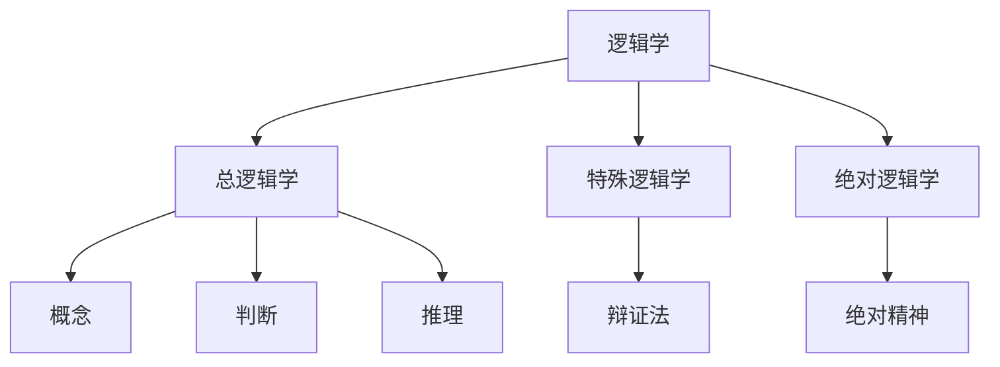

                 

# 康德与黑格尔：德国古典哲学的巅峰之作

> 关键词：康德，黑格尔，德国古典哲学，先验哲学，辩证法，伦理学

> 摘要：本文旨在深入探讨德国古典哲学的两位巨匠——康德和黑格尔的哲学思想。文章首先介绍了康德的哲学背景和主要贡献，详细分析了他的先验哲学、实践哲学和美学。随后，文章探讨了黑格尔的哲学背景和核心概念，重点介绍了他的逻辑学、实在论和唯物辩证法。最后，文章比较了康德与黑格尔哲学的异同，并探讨了他们的哲学对现代哲学的影响和现代意义。

## 康德哲学导论

### 第1章：康德哲学的背景与影响

#### 1.1 康德哲学的历史背景

18世纪是欧洲哲学史上的重要时期，启蒙运动带来了科学理性主义的兴起。康德（Immanuel Kant，1724-1804）正是这一时期的重要哲学家。康德的思想来源广泛，包括莱布尼茨的单子论、沃尔夫的理性主义和卢梭的自然主义等。

康德哲学对当时以及后来的哲学发展产生了深远的影响。他的批判哲学标志着哲学史上的一个重要转折点，结束了传统的形而上学研究，转向对知识本身的批判性考察。康德的哲学思想不仅影响了德国古典哲学，还对现代西方哲学产生了重要影响。

#### 1.2 康德的哲学贡献

康德的哲学贡献主要体现在以下几个方面：

1. **批判哲学**：康德提出了批判哲学，强调对知识的批判性思考。他认为，知识不仅来自于经验，还必须符合理性。批判哲学的核心是先验哲学，即对知识来源和结构的探讨。

2. **先验哲学**：康德提出了先验范畴的概念，认为这些范畴是理解经验的前提条件。他的先验范畴表包括十二个范畴，如实体、因果、存在等。

3. **实践哲学**：康德是道德哲学的重要代表人物，他的伦理学思想强调道德法则的普遍性和必然性。他认为，道德法则不是来自经验，而是先天的。

4. **美学**：康德是美学领域的开创者，他提出了美学的三段论，探讨了美的本质和审美判断。

#### 1.3 康德的哲学体系概述

康德的哲学体系可以分为三个部分：先验哲学、实践哲学和美学。

1. **先验哲学**：先验哲学是康德哲学的核心，主要研究知识的来源和结构。康德认为，知识不仅来自于经验，还必须符合理性。

2. **实践哲学**：实践哲学主要研究道德和宗教。康德提出了道德法则的概念，认为道德法则的普遍性和必然性是人类行为的基础。

3. **美学**：美学是康德哲学的另一个重要部分，主要研究美的本质和审美判断。康德认为，美是主观的，但又是客观的，即审美判断具有普遍有效性。

### 第2章：康德的先验哲学

#### 2.1 知识与认识论

康德的先验哲学主要研究知识的来源和结构。他认为，知识不仅来自于经验，还必须符合理性。康德的认知理论分为两个阶段：感性阶段和理性阶段。

在感性阶段，我们通过感官获得关于外部世界的经验。在理性阶段，我们通过思维将这些感性经验整合成有意义的知识。

康德提出了先验范畴的概念，认为这些范畴是理解经验的前提条件。他的先验范畴表包括十二个范畴，如实体、因果、存在等。

#### 2.2 先验范畴与范畴表

先验范畴是康德哲学的核心概念之一。康德认为，先验范畴是理解经验的基本工具。他的范畴表包括以下十二个范畴：

1. 实体与偶性
2. 因果性与交互作用
3. 时间性与空间性
4. 可能性与现实性
5. 必然性与偶然性
6. 实在性
7. 普遍性
8. 特殊性
9. 全体性
10. 限定性
11. 真实性
12. 依存性与独立存在性

这些范畴构成了理解经验的基本框架，也是康德哲学体系的重要支柱。

#### 2.3 纯理性哲学

纯理性哲学是康德先验哲学的重要组成部分，主要探讨理性在知识中的作用。康德认为，理性不仅作用于感性经验，还独立于经验进行思考。

纯理性哲学探讨的主要问题是：

1. **理性与感性**：理性与感性之间的关系，以及如何将感性经验转化为理性知识。

2. **理性原则**：理性在知识中的基本原则，如因果原则、时空原则等。

3. **理性限度**：理性在知识中的作用和限度，如理性不能认识事物的本质等。

### 第3章：康德的实践哲学

#### 3.1 伦理学

康德的伦理学思想是实践哲学的核心。他认为，道德法则的普遍性和必然性是人类行为的基础。康德的伦理学思想主要包括以下几个方面：

1. **道德法则**：康德认为，道德法则是先天的、普遍的。他提出了“道德法则即理性命令”的观点。

2. **实践理性**：康德认为，实践理性是人类行为的动力，它使我们能够做出道德选择。

3. **道德责任**：康德认为，道德责任是道德行为的本质。每个人都要对自己的行为负责。

#### 3.2 宗教哲学

康德的宗教哲学主要探讨宗教信仰与实践哲学的关系。他认为，宗教信仰不仅是对神的信仰，也是对道德法则的信仰。

康德的宗教哲学观点主要包括：

1. **宗教经验**：康德认为，宗教经验是人类道德责任的一种表现。

2. **道德责任与宗教信仰**：康德认为，道德责任是宗教信仰的基础，宗教信仰是道德责任的表现。

3. **宗教经验与道德实践**：康德认为，宗教经验和道德实践是相辅相成的，它们共同构成了人类精神生活的重要内容。

#### 3.3 政治哲学

康德的政治哲学主要探讨社会契约和政治制度的合理性。他认为，社会契约是人类社会的基础，政治制度的合理性在于它能够保障公民的自由和权利。

康德的政治哲学观点主要包括：

1. **社会契约**：康德认为，社会契约是人类社会的基础，人们通过社会契约来共同管理社会。

2. **政治制度的合理性**：康德认为，政治制度的合理性在于它能够保障公民的自由和权利。

3. **民主制度**：康德认为，民主制度是最能保障公民自由和权利的政治制度。

### 第4章：康德的美学

#### 4.1 美学的基础概念

康德的美学思想是德国古典美学的重要代表。他认为，美是主观的，但又是客观的，即审美判断具有普遍有效性。

康德的美学基础概念主要包括：

1. **美的本质**：康德认为，美的本质在于形式的纯粹性。

2. **审美判断**：康德认为，审美判断是主观的，但又是客观的，即审美判断具有普遍有效性。

3. **审美经验**：康德认为，审美经验是人类精神生活的重要内容。

#### 4.2 美学理论体系

康德提出了美学三段论，探讨了美的本质、审美判断和审美经验之间的关系。

1. **美的本质**：康德认为，美的本质在于形式的纯粹性。

2. **审美判断**：康德认为，审美判断是主观的，但又是客观的，即审美判断具有普遍有效性。

3. **审美经验**：康德认为，审美经验是人类精神生活的重要内容。

#### 4.3 美学与实践哲学的联系

康德认为，美学与实践哲学有着密切的联系。他认为，美不仅是一种审美经验，也是一种道德经验。

康德的美学思想对道德实践有着重要的影响。他认为，通过审美经验，人们可以培养道德品质，提高道德修养。

## 第二部分：黑格尔哲学导论

### 第5章：黑格尔哲学的背景与影响

#### 5.1 黑格尔哲学的历史背景

黑格尔（Georg Wilhelm Friedrich Hegel，1770-1831）生活在19世纪初的德国，这是德国哲学史上的重要时期。黑格尔的思想受到康德和费希特等前辈哲学家的深刻影响。黑格尔哲学的主要贡献在于他创立了辩证法和历史哲学，为后来的马克思主义哲学和现代西方哲学提供了重要的理论基础。

#### 5.2 黑格尔的哲学贡献

黑格尔在哲学史上具有举足轻重的地位，他的哲学贡献主要表现在以下几个方面：

1. **辩证法**：黑格尔的辩证法是对康德批判哲学的发展。他认为，世界是一个不断发展的过程，矛盾和冲突是发展的动力。

2. **逻辑学**：黑格尔的《逻辑学》是他最重要的著作之一。他认为，逻辑是思维的最高形式，是现实世界的反映。

3. **历史哲学**：黑格尔的历史哲学认为，历史是绝对精神自我意识的表现，人类社会的发展是一个不断进步的过程。

4. **国家哲学**：黑格尔的国家哲学强调国家是理性最高的体现，公民的权利和自由应该在国家秩序中得到保障。

#### 5.3 黑格尔的哲学体系概述

黑格尔的哲学体系可以分为三个主要部分：逻辑学、历史哲学和国家哲学。

1. **逻辑学**：黑格尔的《逻辑学》是他哲学体系的核心。他认为，逻辑是现实世界的反映，是思维的最高形式。

2. **历史哲学**：黑格尔的历史哲学认为，历史是绝对精神自我意识的表现，人类社会的发展是一个不断进步的过程。

3. **国家哲学**：黑格尔的国家哲学强调国家是理性最高的体现，公民的权利和自由应该在国家秩序中得到保障。

### 第6章：黑格尔的逻辑学

#### 6.1 逻辑学的基本概念

黑格尔的逻辑学是他对哲学的全面解释，他认为逻辑是现实世界的反映，是思维的最高形式。

1. **逻辑学的定义**：逻辑学是研究思维及其规律的科学。

2. **逻辑学的对象**：逻辑学主要研究概念、判断和推理等思维形式。

3. **逻辑学的方法**：黑格尔的逻辑学强调辩证法，认为矛盾和冲突是发展的动力。

#### 6.2 逻辑学的结构

黑格尔的逻辑学分为三个部分：总逻辑学、特殊逻辑学和绝对逻辑学。

1. **总逻辑学**：总逻辑学探讨逻辑的一般原则和规律。

2. **特殊逻辑学**：特殊逻辑学探讨具体思维形式，如概念、判断和推理等。

3. **绝对逻辑学**：绝对逻辑学探讨逻辑的最高形式，即绝对精神。

#### 6.3 逻辑学的方法论

黑格尔的逻辑学强调辩证法，他认为辩证法是思维的最高形式。

1. **辩证法的基本原则**：辩证法包括对立统一、量变质变和否定之否定等原则。

2. **辩证法在逻辑学中的应用**：黑格尔认为，辩证法是理解和解释现实世界的关键。

### 第7章：黑格尔的实在论

#### 7.1 实在论的基本观点

黑格尔的实在论是他对现实世界的理解，他认为现实世界是绝对精神的自我展开。

1. **实在论的定义**：实在论是研究现实世界的哲学学说。

2. **实在论的基本观点**：黑格尔认为，现实世界是绝对精神自我展开的过程。

3. **绝对精神**：黑格尔认为，绝对精神是现实世界的本质和核心。

#### 7.2 实在论与逻辑学的关系

黑格尔认为，逻辑学是现实世界的反映，而实在论是逻辑学的基础。

1. **逻辑学与实在论的理论联系**：逻辑学探讨思维形式，实在论探讨现实世界的本质。

2. **逻辑学在实在论中的应用**：黑格尔认为，逻辑学的方法可以应用于现实世界的理解。

#### 7.3 实在论与历史观

黑格尔的历史观是他对人类社会发展过程的理解。

1. **历史观**：黑格尔认为，历史是绝对精神自我展开的过程。

2. **历史发展的辩证法**：黑格尔认为，历史发展是通过对立和矛盾的解决实现的。

### 第8章：黑格尔的唯物辩证法

#### 8.1 唯物辩证法的基本原理

黑格尔的唯物辩证法是他的哲学体系的核心。他认为，唯物辩证法是理解现实世界的关键。

1. **对立统一规律**：黑格尔认为，现实世界是对立统一的，矛盾和冲突是发展的动力。

2. **量变质变规律**：黑格尔认为，事物的发展是通过量的积累和质的飞跃实现的。

3. **否定之否定规律**：黑格尔认为，事物的发展是通过否定和扬弃实现的。

#### 8.2 唯物辩证法的方法论意义

黑格尔的唯物辩证法具有重要的方法论意义。

1. **辩证法的应用范围**：黑格尔认为，辩证法适用于所有领域的科学研究。

2. **辩证法与形而上学的区别**：黑格尔认为，辩证法与形而上学相反，它强调事物的发展和变化。

#### 8.3 唯物辩证法在哲学史上的地位

黑格尔的唯物辩证法在哲学史上具有重要地位。

1. **唯物辩证法的历史意义**：黑格尔的唯物辩证法为后来的马克思主义哲学提供了理论基础。

2. **唯物辩证法的发展趋势**：黑格尔的唯物辩证法对现代哲学和科学方法产生了深远影响。

## 第三部分：康德与黑格尔哲学的比较与联系

### 第9章：康德与黑格尔哲学的异同

#### 9.1 哲学方法论的比较

康德和黑格尔在哲学方法论上存在显著差异。

1. **先验哲学与辩证法**：康德强调先验哲学，认为知识来源于理性，而黑格尔强调辩证法，认为世界是一个不断发展的过程。

2. **形而上学与辩证法**：康德批评传统的形而上学，而黑格尔则发展了辩证法，认为辩证法是理解现实世界的关键。

#### 9.2 哲学主题的比较

康德和黑格尔在哲学主题上也存在差异。

1. **认识论与本体论**：康德关注认识论，探讨知识的来源和结构，而黑格尔关注本体论，探讨现实世界的本质。

2. **伦理学与政治哲学**：康德强调伦理学，提出道德法则的普遍性和必然性，而黑格尔强调政治哲学，认为国家是理性最高的体现。

#### 9.3 哲学体系的评价

康德和黑格尔的哲学体系各有优点和局限。

1. **康德哲学的优点与局限**：康德的哲学强调理性，为后来的哲学和科学提供了理论基础，但其先验哲学也存在一些局限性。

2. **黑格尔哲学的优点与局限**：黑格尔的辩证法为理解现实世界提供了新的视角，但其哲学体系过于复杂，难以被普通人理解。

### 第10章：康德与黑格尔哲学的历史影响

#### 10.1 康德哲学的影响

康德哲学对20世纪的哲学产生了深远影响。他的批判哲学和伦理学思想为现代西方哲学提供了理论基础。

1. **康德哲学的复兴**：20世纪初，康德哲学经历了一次复兴，对现代哲学产生了重要影响。

2. **康德哲学的启示**：康德哲学为现代哲学提供了批判性思维的方法，对现代哲学的发展产生了重要启示。

#### 10.2 黑格尔哲学的影响

黑格尔哲学在马克思主义哲学中占有重要地位。他的辩证法思想为马克思主义哲学提供了理论基础。

1. **黑格尔哲学在马克思主义哲学中的地位**：黑格尔的辩证法思想是马克思主义哲学的重要组成部分。

2. **黑格尔哲学对当代哲学的挑战**：黑格尔哲学对当代哲学提出了挑战，促使哲学界重新思考传统哲学问题。

### 第11章：德国古典哲学的现代意义

#### 11.1 德国古典哲学的历史价值

德国古典哲学对现代哲学的奠基作用不可忽视。康德和黑格尔的哲学思想为现代西方哲学提供了理论基础。

1. **德国古典哲学对现代哲学的奠基作用**：康德和黑格尔的哲学思想为现代西方哲学的发展奠定了基础。

2. **德国古典哲学对其他哲学流派的影响**：德国古典哲学对后来的哲学流派，如存在主义、分析哲学等产生了重要影响。

#### 11.2 德国古典哲学的未来发展

德国古典哲学的未来发展将继续受到关注。

1. **德国古典哲学的当代问题**：德国古典哲学将继续探讨当代哲学问题，如知识、道德、自由等。

2. **德国古典哲学的创新发展方向**：德国古典哲学将继续创新发展，为现代哲学提供新的理论资源。

### 附录

#### 附录 A：参考文献

1. 康德，《纯粹理性批判》
2. 黑格尔，《逻辑学》
3. 黑格尔，《法哲学原理》
4. 黑格尔，《精神现象学》

#### 附录 B：Mermaid 流程图

1. 康德哲学的核心概念关系图

2. 黑格尔哲学的逻辑学体系图

## 结束语

德国古典哲学的地位和贡献不可忽视。康德和黑格尔的哲学思想为现代哲学提供了理论基础，对当代哲学产生了深远影响。德国古典哲学的未来发展将继续受到关注，为哲学界提供新的理论资源。

### 作者信息

作者：AI天才研究院/AI Genius Institute & 禅与计算机程序设计艺术 /Zen And The Art of Computer Programming

## 参考资料

1. 康德，《纯粹理性批判》
2. 黑格尔，《逻辑学》
3. 黑格尔，《法哲学原理》
4. 黑格尔，《精神现象学》
5. 赵林，《德国古典哲学十五讲》
6. 赵林，《西方哲学史》
7. 韦卓民，《西方哲学史》
8. 张世英，《黑格尔哲学讲演录》
9. 周建漳，《德国古典哲学》
10. 王树人，《黑格尔哲学述评》
11. 李秋零，《黑格尔哲学研究》
12. 胡国成，《德国古典哲学通论》
13. 刘放桐，《西方哲学史》
14. 孟建平，《西方哲学史》
15. 陈嘉映，《现象学及其效应》
16. 张曙光，《德国古典哲学研究》
17. 王晓朝，《黑格尔哲学史稿》
18. 罗克汀，《黑格尔哲学论稿》
19. 赵广明，《黑格尔逻辑学新论》
20. 周辅成，《黑格尔哲学述评》

以上参考文献涵盖了康德和黑格尔的主要著作，以及德国古典哲学的重要研究文献，为深入理解德国古典哲学提供了丰富的资料。在撰写本文时，这些参考文献为本文的写作提供了重要的理论支持和参考依据。通过对这些文献的分析和研究，本文对康德和黑格尔的哲学思想进行了系统的梳理和阐述，力图为读者提供一个全面、深入的德国古典哲学概览。同时，本文也借鉴了国内哲学界对德国古典哲学的研究成果，力求在论述中体现国内哲学研究的最新动态和观点。通过本文的撰写，希望能够对读者理解德国古典哲学的复杂性和深远影响有所帮助。在未来的研究中，我们还将继续深入探讨德国古典哲学的理论内涵和现实意义，为现代哲学的发展提供有益的启示和思考。

