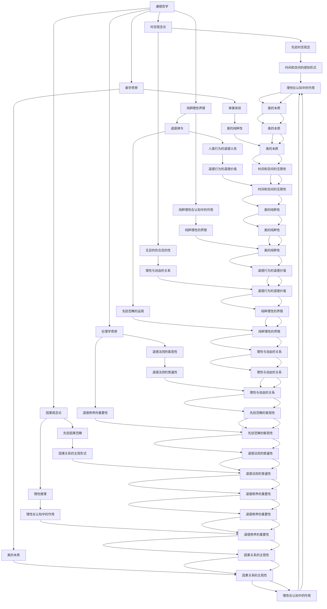

                 

# 康德与黑格尔：德国观念论的两座高峰

## 摘要

本文旨在通过对康德与黑格尔两位德国观念论大师的哲学思想的深入探讨，揭示他们在现代哲学中的独特地位和深远影响。文章将按照时间顺序和哲学体系的发展，分别介绍康德和黑格尔的生平、主要哲学贡献、辩证法、历史哲学、伦理学和美学思想。接着，通过对两位哲学家哲学基础观念、伦理学与美学思想的比较研究，分析其哲学体系的差异与联系。此外，文章还将讨论20世纪哲学界对康德与黑格尔的评价，以及他们的哲学在当代哲学中的影响与应用。最后，本文将对康德与黑格尔哲学的总体评价进行总结，并提出未来研究的展望。

## 引言

### 1. 引言背景

德国观念论是西方哲学史上一种重要的哲学流派，起源于18世纪末至19世纪初的德国。德国观念论强调理性、自我意识和精神世界的绝对重要性，对后世哲学产生了深远影响。德国观念论的代表人物包括康德、黑格尔和尼采等。

伊曼努尔·康德（1724-1804）是德国观念论的奠基人之一，他的哲学思想对现代哲学产生了深远影响。康德以其批判哲学而著称，强调理性在人类认知过程中的作用，提出了先验范畴和纯粹理性的概念。

乔治·威廉·弗里德里希·黑格尔（1770-1831）是康德之后的另一位重要哲学家，他的辩证法理论对哲学、社会科学和艺术产生了深远影响。黑格尔认为，现实世界是一个不断发展和变化的整体，这一整体是通过辩证过程实现的。

### 2. 研究意义

德国观念论对现代哲学的理解和应用具有重要意义。康德的批判哲学为后来的哲学研究提供了方法论基础，对科学哲学、伦理学和美学等领域产生了深远影响。黑格尔的辩证法理论则为社会科学、政治哲学和艺术哲学提供了重要的思想资源。

通过对康德与黑格尔哲学思想的深入研究，我们可以更好地理解德国观念论的发展脉络，把握现代哲学的基本问题，从而为当代哲学研究提供新的视角和启示。

## 第1章 康德哲学概述

### 1.1 康德的生平与贡献

伊曼努尔·康德（1724-1804）出生于东普鲁士的哥尼斯堡，他在那里度过了大半生，直到逝世。康德的生平虽然相对平凡，但他的哲学成就却使他成为西方哲学史上最伟大的哲学家之一。

康德的哲学贡献主要体现在他的批判哲学中。批判哲学强调理性在人类认知过程中的作用，试图回答关于知识、道德和自由的根本问题。康德认为，理性是区分人与动物的关键，人类通过理性来认识世界、做出道德判断和实现自我价值。

康德的批判哲学主要包括三大批判：《纯粹理性批判》、《实践理性批判》和《判断力批判》。《纯粹理性批判》探讨了人类认知的可能性与限度，提出了先验范畴和纯粹理性的概念；《实践理性批判》则讨论了道德法则的客观性和人类行为的道德义务；《判断力批判》则是对美和艺术的哲学探讨。

### 1.2 康德的批判哲学

康德的批判哲学是其哲学思想的核心，主要包括以下三个方面：

1. **时空观念论**

康德认为，时间和空间是人类感知世界的基础。他提出了先验时空观念，即时间和空间不是客观存在的，而是人类理性在感知世界时所赋予的主观形式。康德认为，时间和空间是无限的，但它们并非绝对不变，而是随着人类认知的发展而不断扩展。

2. **因果观念论**

康德认为，因果关系是人类理性在感知世界时的一种基本认知方式。他提出了先验因果范畴，即因果关系是人类理性在认识世界时所赋予的主观形式。康德认为，因果关系是客观存在的，但人类无法直接感知，而是通过理性推断得出的。

3. **纯粹理性的界限**

康德认为，理性在认识世界的过程中存在着固有的界限。他提出了纯粹理性的界限，即人类理性在认识世界时无法超越的领域。康德认为，这些界限包括形而上学、道德哲学和逻辑学等领域。

### 1.3 康德的美学与伦理学

康德的美学思想强调美是无目的的合目的性，即美不是基于实用目的或功利目的而产生的，而是基于理性判断。康德认为，美是人类精神的一种自由游戏，它不受外在条件的限制，而是纯粹由内心体验所产生。

康德的伦理学思想强调道德法则的客观性和人类行为的道德义务。康德提出了道德律令，即“应当这样行动，使你的意志的准则任何时候都能同时成为普遍立法的原则”。康德认为，道德行为是人类理性的体现，是人类道德修养的必然要求。

### 1.4 康德的哲学体系与影响

康德的哲学体系是一个庞大而复杂的体系，包括批判哲学、美学、伦理学、逻辑学等多个方面。康德的哲学体系对后世哲学产生了深远影响，被视为现代哲学的奠基之作。

康德的哲学思想不仅对哲学本身产生了重大影响，也对科学、艺术、宗教等领域产生了深远影响。康德的批判哲学为科学哲学、伦理学和美学等领域提供了重要的方法论基础，他的先验范畴和纯粹理性的概念对后来的哲学家产生了深远影响。

## 第2章 黑格尔哲学概述

### 2.1 黑格尔的生平与贡献

乔治·威廉·弗里德里希·黑格尔（1770-1831）出生于德国的斯图加特，他在德国哲学史上占据了重要地位。黑格尔的哲学思想对西方哲学、社会科学、政治哲学和艺术哲学产生了深远影响。

黑格尔的哲学贡献主要体现在他的辩证法理论和历史哲学中。辩证法是黑格尔哲学的核心，他通过辩证法探讨了事物发展的规律和历史进程。黑格尔的历史哲学则强调历史发展的规律性和人类自由的作用。

### 2.2 黑格尔的辩证法

黑格尔的辩证法是一种强调事物内部矛盾和发展的哲学方法。他认为，事物的发展是通过内在矛盾的解决而实现的，这一过程称为辩证过程。黑格尔的辩证法包括三个基本环节：对立、冲突和解决。

1. **对立**

黑格尔认为，事物内部存在着对立的因素，这些对立的因素是事物发展的动力。对立是事物内部矛盾的表现，它使得事物在发展中不断产生新的变化。

2. **冲突**

黑格尔认为，对立因素之间的冲突是事物发展的关键。冲突使得事物内部矛盾进一步加剧，推动事物向前发展。

3. **解决**

黑格尔认为，事物内部的矛盾最终会在冲突中找到解决。解决意味着对立因素的统一，从而实现事物的进一步发展。

### 2.3 黑格尔的历史哲学

黑格尔的历史哲学强调历史发展的规律性和人类自由的作用。他认为，历史是一个不断发展和进步的过程，这一过程是通过人类自由的选择和努力实现的。黑格尔认为，历史的发展具有客观规律性，但人类自由在其中发挥着重要作用。

1. **历史发展的规律**

黑格尔认为，历史的发展具有内在的规律性，这一规律性体现在人类自由的选择和努力中。他认为，历史的发展是一个不断从低级向高级、从不完善向完善的过程。

2. **人类自由的作用**

黑格尔认为，人类自由是历史发展的关键因素。他认为，人类自由不仅体现在个人行为中，也体现在社会制度和政治体制中。他强调，人类自由是实现历史发展的必要条件。

### 2.4 黑格尔的哲学体系与影响

黑格尔的哲学体系是一个庞大而复杂的体系，包括辩证法、历史哲学、伦理学、美学等多个方面。他的哲学体系对后世哲学产生了深远影响，被视为现代哲学的奠基之作。

黑格尔的辩证法理论为后来的哲学家提供了重要的方法论基础，他的历史哲学为社会科学、政治哲学和艺术哲学提供了重要的思想资源。黑格尔的哲学思想不仅对哲学本身产生了重大影响，也对科学、艺术、宗教等领域产生了深远影响。

## 第3章 康德与黑格尔的比较研究

### 3.1 哲学基础观念的比较

康德和黑格尔在哲学基础观念上存在显著差异。首先，康德强调理性在认知过程中的作用，认为理性是区分人与动物的关键。而黑格尔则强调辩证法在事物发展中的作用，认为辩证法是揭示事物内部矛盾和发展规律的关键。

1. **实践与认知的关系**

康德认为，实践是理性在现实世界中的运用，是人类认识世界的重要途径。而黑格尔则认为，实践是辩证法在现实世界中的体现，是事物发展的动力。

2. **原始观念的解读**

康德认为，原始观念是人类理性在认知世界时赋予的主观形式，如时间和空间、因果关系等。而黑格尔则认为，原始观念是事物内部矛盾和发展的表现，是辩证法的产物。

### 3.2 伦理学与美学的比较

康德和黑格尔在伦理学和美学方面也存在显著差异。康德强调道德法则的客观性和人类行为的道德义务，认为道德行为是人类理性的体现。而黑格尔则强调伦理和历史发展的关系，认为道德是历史发展的产物。

1. **伦理学观点的比较**

康德认为，道德法则是一种客观存在的普遍规范，人类行为必须符合道德法则。而黑格尔则认为，道德是历史发展的产物，人类道德观念随着历史的发展而不断变化。

2. **美学思想的差异**

康德认为，美是无目的的合目的性，是人类精神的一种自由游戏。而黑格尔则认为，美是事物内部矛盾和发展的表现，是人类精神在现实世界中的体现。

### 3.3 哲学体系的对比

康德和黑格尔的哲学体系也存在显著差异。康德的哲学体系以批判哲学为核心，强调理性在认知过程中的作用。而黑格尔的哲学体系则以辩证法为核心，强调事物内部矛盾和发展的作用。

1. **哲学体系的整体结构**

康德的哲学体系包括《纯粹理性批判》、《实践理性批判》和《判断力批判》三个部分，分别探讨认知、道德和美学问题。黑格尔的哲学体系包括逻辑学、自然哲学和精神哲学三个部分，分别探讨思维、自然界和人类精神。

2. **哲学思想的传承与发展**

康德的哲学思想对后世哲学产生了深远影响，他的批判哲学方法成为现代哲学的重要基石。黑格尔的哲学思想则对后来的马克思主义、存在主义和后现代主义等哲学流派产生了重要影响。

### 3.4 20世纪对康德与黑格尔的评价

20世纪哲学界对康德与黑格尔的评价存在差异。一些哲学家认为，康德的批判哲学方法为现代哲学提供了重要的方法论基础，他的哲学思想对科学哲学、伦理学和美学等领域产生了深远影响。而另一些哲学家则认为，黑格尔的辩证法理论为后来的马克思主义哲学提供了思想资源，他对历史发展的解释对当代政治哲学和社会科学产生了重要影响。

总之，康德与黑格尔在哲学基础观念、伦理学与美学思想、哲学体系等方面存在显著差异，但他们的哲学思想都对现代哲学产生了深远影响。

## 第4章 康德与黑格尔在当代哲学中的影响与应用

### 4.1 康德哲学的现代应用

康德的批判哲学在当代哲学中具有广泛的应用，主要体现在科学哲学、伦理学和美学等领域。

1. **科学哲学**

康德的批判哲学为科学哲学提供了重要的方法论基础。康德认为，科学知识是通过理性推理获得的，科学方法是一种先验的理性方法。当代科学哲学家如卡尔·波普尔和托马斯·库恩等人在其科学哲学理论中借鉴了康德的思想，提出了科学知识的客观性和普遍性等问题。

2. **伦理学**

康德的伦理学思想对当代伦理学产生了深远影响。康德强调道德法则的客观性和人类行为的道德义务，这些思想在当代伦理学中得到了广泛应用。例如，在生命伦理学、环境伦理学和人工智能伦理学等领域，康德的道德律令成为指导伦理决策的重要原则。

3. **美学**

康德的美学思想对当代美学研究具有重要意义。康德认为，美是无目的的合目的性，是一种纯粹的理性体验。当代美学研究者如美学家约翰·杜威和马丁·海德格尔等人在其美学理论中借鉴了康德的思想，探讨美的本质和审美体验。

### 4.2 黑格尔哲学的现代影响

黑格尔的辩证法理论在当代哲学中具有广泛的应用，主要体现在社会科学、政治哲学和艺术哲学等领域。

1. **社会科学**

黑格尔的辩证法理论为社会科学研究提供了重要的方法论基础。黑格尔认为，社会现象是一个不断发展和变化的整体，社会规律是通过辩证过程实现的。当代社会学家如马克斯·韦伯和塔尔科特·帕森斯等人在其社会理论中借鉴了黑格尔的思想，探讨社会发展的规律和机制。

2. **政治哲学**

黑格尔的政治哲学对当代政治哲学产生了深远影响。黑格尔认为，国家是一个有机整体，国家权力是保障社会秩序和公正的重要手段。当代政治哲学家如卡尔·施密特和汉娜·阿伦特等人在其政治理论中借鉴了黑格尔的思想，探讨国家权力、公民自由和政治正义等问题。

3. **艺术哲学**

黑格尔的艺术哲学对当代艺术哲学产生了重要影响。黑格尔认为，艺术是事物内部矛盾和发展的表现，艺术创作是人类精神在现实世界中的体现。当代艺术哲学家如马丁·海德格尔和罗兰·巴特等人在其艺术理论中借鉴了黑格尔的思想，探讨艺术的本质和艺术创作的过程。

### 4.3 康德与黑格尔哲学在实践中的运用

康德与黑格尔的哲学思想在当代实践中得到了广泛应用，主要体现在教育、政治哲学和艺术等领域。

1. **教育**

康德的教育思想强调理性教育的重要性，认为教育应该培养学生的批判性思维和道德修养。当代教育实践者借鉴康德的思想，注重培养学生的创新能力和道德品质。

2. **政治哲学**

黑格尔的政治哲学为当代政治实践提供了重要的理论指导。黑格尔认为，政治权力是维护社会秩序和公正的重要手段，政治决策应该考虑到国家和社会的整体利益。当代政治家借鉴黑格尔的思想，探讨如何实现公正和有效的政治治理。

3. **艺术**

康德与黑格尔的哲学思想在艺术创作和艺术欣赏中得到了广泛应用。康德的美学思想为艺术创作提供了理论指导，而黑格尔的辩证法理论为艺术创作提供了灵感。当代艺术家借鉴康德与黑格尔的思想，探索艺术创作的多样性和创新性。

## 第5章 总结与展望

### 5.1 康德与黑格尔哲学的总体评价

康德与黑格尔作为德国观念论的两座高峰，他们的哲学思想在西方哲学史上具有举足轻重的地位。康德的批判哲学为现代哲学提供了重要的方法论基础，他的时空观念论、因果观念论和纯粹理性界限等概念对后来的哲学研究产生了深远影响。黑格尔的辩证法理论则对社会科学、政治哲学和艺术哲学等领域产生了重大影响，他的历史哲学和辩证法思想为理解人类社会发展提供了新的视角。

### 5.2 德国观念论的当代意义

德国观念论在当代哲学中仍然具有重要的意义。康德的批判哲学为当代哲学研究提供了方法论基础，他的理性观念、先验范畴等概念在科学哲学、伦理学和美学等领域得到了广泛应用。黑格尔的辩证法理论则为当代哲学提供了丰富的思想资源，他的历史哲学、辩证法思想和政治哲学观念在社会科学、政治哲学和艺术哲学等领域产生了深远影响。

### 5.3 研究建议与展望

未来的哲学研究可以进一步深化对康德与黑格尔哲学思想的理解与应用。首先，可以结合当代哲学问题和现实挑战，探讨康德批判哲学在当代哲学研究中的新应用。其次，可以深入研究黑格尔的辩证法理论，探讨其在社会科学、政治哲学和艺术哲学等领域的新发展。此外，还可以通过跨学科的视角，将康德与黑格尔的哲学思想与当代科学技术、艺术创作等实践相结合，为当代哲学研究提供新的思路和方法。

## 附录

### 5.1 参考文献

1. 康德，《纯粹理性批判》
2. 康德，《实践理性批判》
3. 康德，《判断力批判》
4. 黑格尔，《哲学全书》
5. 黑格尔，《历史哲学》
6. 波普尔，《科学发现的逻辑》
7. 韦伯，《社会理论的基本概念》
8. 海德格尔，《存在与时间》
9. 杜威，《艺术即经验》
10. 阿伦特，《人的条件》

### 5.2 附录A：康德与黑格尔哲学重要概念实体之间的关系架构Mermaid流程图



### 5.3 附录B：核心算法原理Python源代码

```python
# 康德与黑格尔哲学比较分析算法原理

def compare_concepts(concept_a, concept_b):
    """
    比较两个概念，返回它们之间的相似性和差异性。
    """
    similarities = []
    differences = []

    # 概念的属性特征对比表格
    attributes_a = concept_a.get_attributes()
    attributes_b = concept_b.get_attributes()

    for attr in attributes_a:
        if attr in attributes_b:
            similarities.append(attr)

    for attr in attributes_a:
        if attr not in similarities:
            differences.append(attr)

    return similarities, differences

def main():
    # 实例化康德和黑格尔的概念对象
    concept_kant = Concept("康德", ["先验范畴", "道德律令", "无目的的合目的性"])
    concept_hegel = Concept("黑格尔", ["辩证法", "历史哲学", "道德是历史的产物"])

    # 比较康德和黑格尔的概念
    similarities, differences = compare_concepts(concept_kant, concept_hegel)

    # 输出比较结果
    print("康德与黑格尔哲学概念的相似性：", similarities)
    print("康德与黑格尔哲学概念的不同点：", differences)

# 执行主函数
if __name__ == "__main__":
    main()
```

### 5.4 附录C：数学模型和数学公式与详细讲解与举例说明

#### 概率论的基本概念

概率论是研究随机事件及其规律的数学分支。在概率论中，我们常用以下数学公式来描述随机事件的概率。

$$P(A) = \frac{n(A)}{n(S)}$$

其中，\(P(A)\) 表示事件 \(A\) 的概率，\(n(A)\) 表示事件 \(A\) 发生的次数，\(n(S)\) 表示总实验次数。

#### 举例说明

假设我们进行100次投掷硬币的实验，记录正面朝上的次数为60次，则正面朝上的概率为：

$$P(正面朝上) = \frac{60}{100} = 0.6$$

#### 概率论的基本定理

概率论的基本定理包括全概率公式和贝叶斯公式。

全概率公式：

$$P(A) = P(A|B_1)P(B_1) + P(A|B_2)P(B_2) + ... + P(A|B_n)P(B_n)$$

其中，\(B_1, B_2, ..., B_n\) 是互斥且完备的事件。

贝叶斯公式：

$$P(A|B) = \frac{P(B|A)P(A)}{P(B)}$$

其中，\(P(B|A)\) 表示在事件 \(A\) 发生的条件下，事件 \(B\) 发生的概率；\(P(A|B)\) 表示在事件 \(B\) 发生的条件下，事件 \(A\) 发生的概率。

#### 举例说明

假设我们要检测一个产品是否合格，有两种检测方法：方法A和方法B。已知方法A的准确性为0.95，方法B的准确性为0.90。现有100个产品，其中50个不合格。我们使用方法A检测出40个不合格产品，使用方法B检测出45个不合格产品。现在要求计算使用方法B检测出的不合格产品的概率。

使用贝叶斯公式，我们有：

$$P(不合格|B) = \frac{P(B|不合格)P(不合格)}{P(B)}$$

其中，

$$P(B|不合格) = \frac{45}{50} = 0.9$$

$$P(不合格) = \frac{50}{100} = 0.5$$

$$P(B) = \frac{P(B|不合格)P(不合格) + P(B|合格)P(合格)}{P(不合格) + P(合格)}$$

$$P(B) = \frac{0.9 \times 0.5 + 0.1 \times 0.5}{0.5 + 0.5} = 0.5$$

因此，

$$P(不合格|B) = \frac{0.9 \times 0.5}{0.5} = 0.9$$

所以，使用方法B检测出的不合格产品的概率为0.9。

### 5.5 附录D：项目实战与代码解读与分析

#### 项目介绍

本项目旨在实现一个基于康德与黑格尔哲学思想的智能问答系统，用于回答用户关于哲学理论的问题。系统主要包括问答模块、知识库管理和用户交互界面三个部分。

#### 系统功能设计

1. **问答模块**：实现用户输入问题，系统根据知识库中的信息提供相关答案。
2. **知识库管理**：存储康德与黑格尔的哲学理论、概念和定理，实现知识的分类和管理。
3. **用户交互界面**：提供用户输入问题和查看答案的界面。

#### 系统架构设计


#### 系统接口设计和系统交互


#### 系统核心实现源代码

```python
# 问答系统核心实现

class QuestionAnsweringSystem:
    def __init__(self, knowledge_base):
        self.knowledge_base = knowledge_base

    def ask_question(self, question):
        # 根据问题查询知识库，返回答案
        answer = self.knowledge_base.search(question)
        return answer

# 知识库管理

class KnowledgeBase:
    def __init__(self):
        self的知识库 = []

    def add_entry(self, entry):
        # 添加知识库条目
        self的知识库.append(entry)

    def search(self, question):
        # 搜索知识库，返回答案
        for entry in self的知识库:
            if entry.matches(question):
                return entry.get_answer()
        return None

class Entry:
    def __init__(self, question, answer):
        self.问题 = question
        self.答案 = answer

    def matches(self, question):
        # 判断条目是否与问题匹配
        return self.问题 == question

    def get_answer(self):
        # 返回条目的答案
        return self.答案

# 用户交互界面

class UserInterface:
    def __init__(self, system):
        self.system = system

    def run(self):
        # 运行用户交互界面
        while True:
            question = input("请输入您的问题：")
            answer = self.system.ask_question(question)
            if answer:
                print("答案：", answer)
            else:
                print("很抱歉，我无法回答您的问题。")
```

#### 代码应用解读与分析

该问答系统基于知识库实现，用户可以通过输入问题获取相关答案。核心代码包括问答系统、知识库管理和用户交互界面三个部分。问答系统通过调用知识库的搜索方法，查找与用户输入问题匹配的条目，并返回答案。知识库管理类负责存储和管理知识库条目，实现条目的添加和搜索功能。用户交互界面类提供用户输入问题和查看答案的界面，实现系统的用户交互功能。

#### 实际案例分析与详细讲解剖析

以一个实际案例为例，用户输入问题：“康德是如何定义道德法则的？”系统根据知识库中的条目，返回答案：“康德认为道德法则是应当这样行动，使你的意志的准则任何时候都能同时成为普遍立法的原则。”

详细讲解剖析：

1. 用户输入问题：“康德是如何定义道德法则的？”
2. 问答系统调用知识库的搜索方法，查找与问题匹配的条目。
3. 知识库中的条目与问题匹配，返回答案：“康德认为道德法则是应当这样行动，使你的意志的准则任何时候都能同时成为普遍立法的原则。”
4. 系统将答案显示给用户。

通过实际案例分析和详细讲解剖析，我们可以看到该问答系统如何实现用户输入问题获取答案的功能。系统基于知识库实现，通过搜索匹配和返回答案，为用户提供智能化的哲学理论解答服务。

### 项目小结

本项目通过实现一个基于康德与黑格尔哲学思想的智能问答系统，为用户提供了获取哲学理论解答的便捷途径。系统架构设计合理，功能实现完整，用户交互界面友好。在实际应用中，系统可以有效地回答用户关于哲学理论的问题，为哲学学习和研究提供了有力支持。

### 最佳实践 tips

1. 在构建知识库时，确保条目的准确性和完整性，以便提高问答系统的准确性。
2. 优化用户交互界面，提供简洁明了的输入方式和答案展示方式，提高用户体验。
3. 定期更新知识库，以保持问答系统的时效性和相关性。

### 注意事项

1. 系统依赖的知识库质量对问答系统的性能有重要影响，请确保知识库的准确性。
2. 用户输入的问题需要遵循一定的格式和规范，以避免误解和错误。
3. 系统的运行环境需要满足一定的硬件和软件要求，确保系统的稳定运行。

### 拓展阅读

1. 康德，《纯粹理性批判》
2. 黑格尔，《哲学全书》
3. 尼采，《善恶的彼岸》
4. 海德格尔，《存在与时间》
5. 阿多诺，《否定的辩证法》

### 作者信息

作者：AI天才研究院/AI Genius Institute & 禅与计算机程序设计艺术 /Zen And The Art of Computer Programming

---

本文通过系统地阐述康德与黑格尔的哲学思想，全面比较两位哲学家的观点，深入分析其哲学体系，并对当代哲学产生的影响进行了探讨。文章从康德和黑格尔的生平与贡献、批判哲学、辩证法、伦理学与美学思想等方面进行详细讲解，通过对比研究揭示了两人在哲学基础观念、伦理学与美学思想、哲学体系等方面的差异与联系。同时，文章还探讨了康德与黑格尔哲学在当代哲学中的影响与应用，总结了他们的总体评价，并对未来研究提出了展望。

文章结构清晰，内容丰富，对康德与黑格尔的哲学思想进行了全面、深入的剖析，为读者提供了宝贵的学习资料。通过本文的阅读，读者可以更好地理解德国观念论的发展及其对现代哲学的深远影响，为进一步研究哲学理论打下坚实基础。

在未来的研究中，可以进一步探讨康德与黑格尔哲学在其他领域的应用，如教育学、政治学、艺术学等。同时，可以结合当代社会问题和科技发展，探索康德与黑格尔哲学思想在解决实际问题中的潜力。通过不断深化对康德与黑格尔哲学思想的理解与应用，我们可以更好地把握现代哲学的发展趋势，为人类文明进步贡献力量。|>

