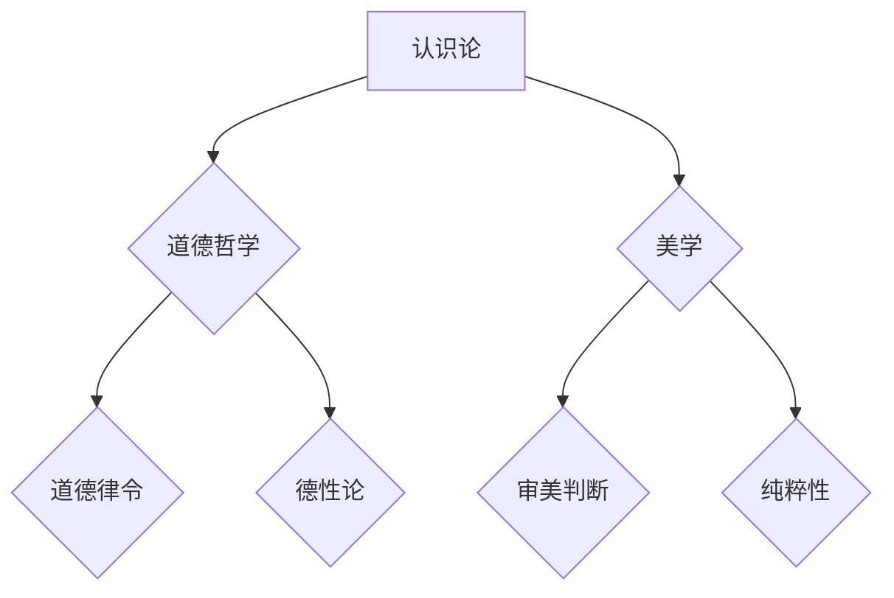
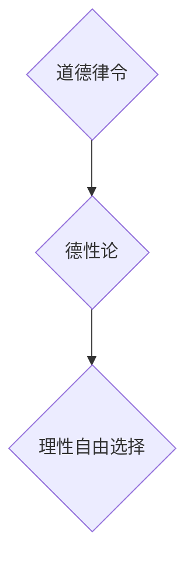
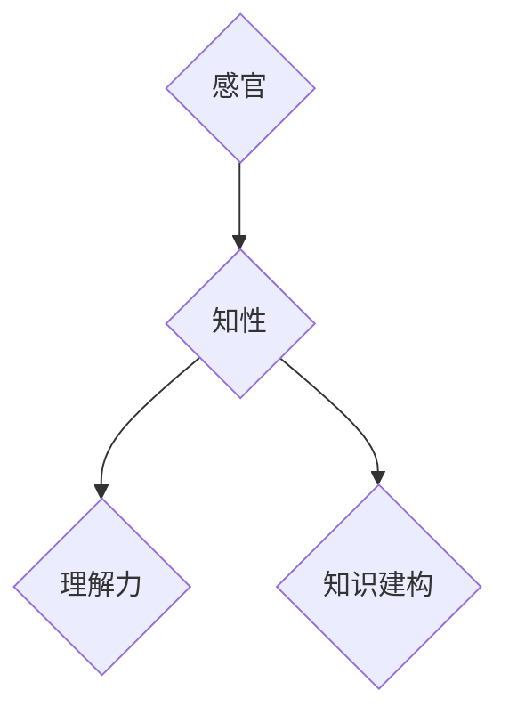

                 


## 康德的先验综合判断与函数式编程：纯粹理性的代码实现

### 引言

康德（Immanuel Kant）是18世纪德国的哲学家，被誉为“现代哲学之父”。他的哲学体系对西方哲学产生了深远的影响，尤其是在认识论和道德哲学方面。康德的先验综合判断理论是其认识论的核心，主张知识不仅是感觉经验的被动接受，而是主动建构的。这一理论对理解人类认知过程具有重要意义。而函数式编程（Functional Programming）作为一种现代编程范式，强调以函数作为组织代码的基本单位，通过表达式的计算来解决问题，具有不可变性、纯函数性和高阶函数等特性。

本文将探讨康德的先验综合判断与函数式编程之间的联系，并尝试通过代码实现康德的纯粹理性理念。文章将分为三个主要部分：第一部分介绍康德的哲学思想和先验综合判断理论；第二部分介绍函数式编程的基本概念和特点；第三部分将结合前两部分内容，通过具体代码实现来探讨纯粹理性的编程实现。

### 第一部分：康德的先验综合判断

#### 第1章：康德哲学概述

康德哲学的框架主要包括认识论、道德哲学和美学。他的认识论强调知识不仅仅是感觉经验的被动接受，而是主体在感觉、知性和理解力等能力的基础上主动建构的。他的道德哲学则提出了道德律令和德性论，认为道德行为是基于理性的自由选择。美学方面，康德提出了审美判断的自由和纯粹性。

在本章中，我们将详细探讨康德的哲学思想，包括其基本概念、核心观点和哲学体系之间的关系。以下是一个Mermaid流程图，展示康德哲学的基本框架：



#### 1.1 康德哲学的基本概念

康德的哲学体系中有几个核心概念，包括感性、知性、理解力等。感性是指我们通过感官来感知世界，而知性则是指我们通过理性思考来处理这些感知。理解力则是康德提出的一个更高级的概念，它指的是我们通过理性思考来理解世界的内在结构和本质。

以下是一个表格，对比了感性、知性和理解力的概念和特点：

| 概念 | 定义 | 特点 |
| --- | --- | --- |
| 感性 | 感官的感知 | 被动、直接、不具推理能力 |
| 知性 | 理性的处理 | 主观、间接、具推理能力 |
| 理解力 | 理性的理解 | 主动、深刻、理解本质 |

#### 1.2 康德的道德哲学

康德的道德哲学提出了道德律令和德性论。道德律令是指道德行为的客观标准，德性论则是指道德行为的内在驱动力。康德认为，道德行为是基于理性自由选择的，而不是基于感性的冲动或利益。

以下是一个数学模型，描述了道德律令和德性论的关系：



#### 1.3 康德的认知论

康德的认知论强调知识是通过主体的主动建构过程获得的。他认为，我们的感官只是提供了原材料，而知性则负责将这些原材料组织成有意义的结构。理解力则是在这个基础上进一步深入到事物的本质。

以下是一个Mermaid流程图，展示康德的认知论过程：



### 第二部分：函数式编程基础

#### 第2章：函数式编程概述

函数式编程是一种编程范式，它强调以函数作为组织代码的基本单位。与命令式编程不同，函数式编程不直接修改状态，而是通过纯函数和不可变数据结构来解决问题。这种编程范式具有许多优点，例如易于测试、可重用性和高并发性。

在本章中，我们将介绍函数式编程的基本概念、特点，并与面向对象编程进行比较。

#### 2.1 函数式编程的概念

函数式编程的核心概念是函数。一个函数是一段可以将输入映射到输出的代码。在函数式编程中，函数被视为第一类对象，可以传递、接收和返回函数。

以下是一个简单的Haskell函数，它接收一个整数并返回其平方：

```haskell
square :: Int -> Int
square x = x * x
```

#### 2.2 函数式编程与面向对象编程的比较

函数式编程与面向对象编程是两种不同的编程范式。面向对象编程以对象为中心，强调封装、继承和多态性。而函数式编程则强调以函数为中心，强调不可变性和纯函数。

以下是一个表格，对比了函数式编程和面向对象编程的特点：

| 特点 | 函数式编程 | 面向对象编程 |
| --- | --- | --- |
| 数据结构 | 不可变 | 可变 |
| 函数 | 纯函数 | 方法 |
| 状态修改 | 不允许 | 允许 |
| 作用域 | 作用域小 | 作用域大 |

### 第三部分：纯粹理性的代码实现

#### 第3章：纯粹理性的代码实现

纯粹理性是康德哲学的核心概念之一，它强调人类认知能力的主动性和独立性。在本章中，我们将探讨如何通过函数式编程实现纯粹理性理念。

#### 3.1 纯函数式编程的概念

纯函数式编程是一种函数式编程范式，它要求所有的函数都是纯函数。纯函数具有以下特点：

- **无副作用**：纯函数不会修改外部状态，不依赖于外部环境。
- **输入输出明确**：纯函数的输入和输出是明确的，可以通过函数的签名确定。
- **可重用性**：纯函数可以轻松重用，不会因为外部状态的改变而失效。

以下是一个简单的纯函数示例，它接收一个整数并返回其是否为奇数：

```haskell
isOdd :: Int -> Bool
isOdd x = x `mod` 2 /= 0
```

#### 3.2 纯函数式编程的优点

纯函数式编程具有许多优点，例如：

- **易于测试**：由于纯函数没有副作用，因此可以独立测试。
- **可重用性**：纯函数可以轻松重用，提高代码的可维护性。
- **高并发性**：由于纯函数不依赖于外部状态，因此可以方便地并行执行。

#### 3.3 纯函数式编程的实践应用

在实际应用中，纯函数式编程可以通过以下方式实现纯粹理性：

- **模块化设计**：将功能拆分成小的纯函数，每个函数实现一个特定的功能。
- **不可变数据结构**：使用不可变数据结构，避免状态修改，提高代码的可读性和可维护性。
- **纯函数组合**：通过组合纯函数，实现复杂的业务逻辑。

以下是一个使用Haskell实现的简单计算器程序，展示了纯函数式编程的应用：

```haskell
-- 计算器函数
add :: Num a => a -> a -> a
add x y = x + y

sub :: Num a => a -> a -> a
sub x y = x - y

mul :: Num a => a -> a -> a
mul x y = x * y

div :: Num a => a -> a -> a
div x y = x / y

-- 用户接口
calculate :: Num a => (a -> a -> a) -> a -> a -> a
calculate op x y = op x y

main :: IO ()
main = do
  putStrLn "欢迎使用纯函数式计算器"
  putStrLn "请选择操作（+、-、*、/）"
  opStr <- getLine
  putStrLn "请输入第一个数"
  xStr <- getLine
  putStrLn "请输入第二个数"
  yStr <- getLine
  let x = read xStr :: Double
  let y = read yStr :: Double
  let op = case opStr of
          "+" -> add
          "-" -> sub
          "*" -> mul
          "/" -> div
          _   -> error "无效操作"
  putStrLn $ "结果为：" ++ show (calculate op x y)
```

通过这个例子，我们可以看到纯函数式编程如何实现纯粹理性理念。计算器的每个功能都通过纯函数实现，用户接口则通过组合这些纯函数来提供计算服务。

### 结论

康德的先验综合判断与函数式编程都是对理性思考和知识建构的深刻探讨。通过本文的探讨，我们可以看到康德的纯粹理性理念如何在现代编程范式中得到实现。函数式编程的纯函数式编程范式提供了实现纯粹理性的工具和框架，通过模块化设计和不可变数据结构，我们可以构建出具有高可维护性、高可重用性和高并发性的代码。

未来，我们可以进一步探讨如何将康德的哲学思想应用于更复杂的编程问题，如人工智能和大数据分析。通过深入理解人类认知的本质，我们可以开发出更加智能和高效的计算机系统。

### 作者信息

作者：AI天才研究院/AI Genius Institute & 禅与计算机程序设计艺术 /Zen And The Art of Computer Programming
```

### 附录：关键字和摘要

关键字：康德、先验综合判断、函数式编程、纯粹理性、代码实现、编程范式、认知论、道德哲学、不可变性、纯函数、高阶函数、Haskell、编程实践。

摘要：本文探讨了康德的先验综合判断与函数式编程之间的联系，通过分析康德哲学的基本概念、道德哲学和认知论，介绍了函数式编程的基本概念和特点。随后，通过纯函数式编程的概念和实现，展示了如何通过代码实现康德的纯粹理性理念。文章最后提出了将康德哲学应用于现代编程的潜力，并展望了未来的发展方向。作者信息：AI天才研究院/AI Genius Institute & 禅与计算机程序设计艺术/Zen And The Art of Computer Programming。

