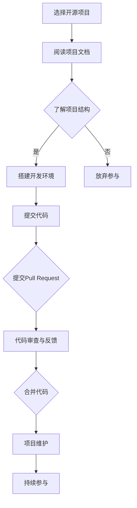

                 

# 开源项目参与和维护指南

## 关键词
- 开源项目
- 参与流程
- 维护策略
- 最佳实践
- 贡献代码

## 摘要
本文旨在为开源项目的参与者提供一个全面、详细的指南，涵盖从项目选择、环境搭建、代码贡献到项目维护的各个环节。通过逻辑清晰的章节结构，帮助读者理解开源项目参与的方方面面，提升参与开源项目的技能和效果。

## 目录

### 引言
#### 开源文化的价值
1. **开源软件的定义与发展**
2. **开源文化的核心价值**

### 选择开源项目
#### 如何选择合适的开源项目
1. **评估项目健康状态**
2. **项目影响力的考量**
3. **社区活跃度的判断**

### 初识开源项目
#### 参与前的准备工作
1. **阅读项目文档**
2. **了解项目架构与代码库**
3. **搭建开发环境

### 理解项目结构
#### 项目结构解析
1. **文件结构与目录布局**
2. **依赖管理**
3. **代码风格与规范**

### 参与社区
#### 社区参与方式
1. **论坛与邮件列表**
2. **代码审查**
3. **贡献文档与文档编写**

### 报告问题与提交流请求
#### 问题报告流程
1. **如何发现和报告问题**
2. **提交流请求的步骤**

### 贡献代码
#### 提交代码的技巧
1. **版本控制系统Git的使用**
2. **代码贡献流程**
3. **代码风格与质量控制**

### 版本控制与Git
#### Git基础知识
1. **Git的基本命令**
2. **Git分支管理**
3. **合并请求与代码审查**

### 持续集成与部署
#### 自动化测试
1. **单元测试**
2. **集成测试**
3. **持续集成工具使用**

### 最佳实践
#### 开源贡献的最佳实践
1. **代码规范与风格**
2. **文档编写标准**
3. **代码贡献策略**

### 维护与长期承诺
#### 维护开源项目的挑战
1. **维护者的角色与责任**
2. **如何保持项目的活力**

### 法律与伦理
#### 开源项目的法律与伦理问题
1. **开源许可的选择**
2. **知识产权保护**
3. **伦理道德标准**

### 结论与未来展望
#### 开源参与的未来
1. **个人成长与职业发展**
2. **开源生态的影响**

### 参考文献
#### 相关书籍与资料推荐

### 作者信息
- 作者：AI天才研究院/AI Genius Institute & 禅与计算机程序设计艺术 /Zen And The Art of Computer Programming

## 引言

### 开源文化的价值

开源软件（Open Source Software，简称OSS）是一种基于开放性、透明性、协作性的软件开发模式。它起源于20世纪80年代，最早由自由软件运动（Free Software Movement）倡导，随后演变为今天的开源文化。开源文化的核心价值在于其开放性，即任何人都可以自由地查看、修改和分发软件源代码。

#### 开源软件的定义与发展

开源软件的定义可以归纳为以下几点：
1. **源代码开放**：任何人都可以访问软件的源代码。
2. **自由使用**：允许用户自由使用、复制、研究、修改和分发软件。
3. **许可协议**：遵循特定的开源许可协议，如GPL、Apache等。

开源软件的发展经历了几个重要阶段：
- **自由软件运动**：20世纪80年代，由Richard Stallman发起，强调软件自由。
- **开源运动**：20世纪90年代，开源软件逐渐流行，强调合作和共享。
- **现代开源生态系统**：如今，开源软件已经成为软件开发的主流，许多企业和组织都积极参与开源项目。

#### 开源文化的核心价值

开源文化的核心价值体现在以下几个方面：

1. **创新促进**：开源项目鼓励社区的贡献，激发了创新的可能性。
2. **质量保证**：大量的贡献者能够共同测试和优化代码，提高软件质量。
3. **成本效益**：开源软件通常免费，降低了企业的软件成本。
4. **学习机会**：开源项目提供了一个学习的平台，用户可以深入了解软件的内部工作机制。

## 选择开源项目

### 如何选择合适的开源项目

选择一个合适的开源项目对于参与者的成功至关重要。以下是一些选择开源项目的标准：

1. **项目健康状态**：评估项目的活跃度，如最近的活动、提交记录、参与人数等。
2. **项目影响力**：选择有广泛影响力的项目，这通常意味着项目的稳定性和社区的支持。
3. **社区活跃度**：一个活跃的社区能够提供更多的支持和资源。

#### 评估项目健康状态

要评估一个开源项目的健康状态，可以查看以下几个指标：

- **GitHub仓库的活跃度**：查看代码仓库的提交历史、问题和Pull Request的数量。
- **文档的完整性和更新频率**：高质量的文档通常意味着项目维护良好。
- **社区参与度**：参与度可以通过GitHub的Issue和Pull Request、邮件列表、论坛等渠道来评估。

#### 项目影响力的考量

选择一个有影响力的开源项目有以下好处：

- **资源丰富**：有影响力的项目通常有丰富的文档、教程和社区资源。
- **就业机会**：参与有影响力的项目有助于提升个人简历，增加就业机会。

#### 社区活跃度的判断

社区活跃度是评估开源项目成功与否的关键因素。一个活跃的社区可以提供：

- **技术支持**：社区成员可以提供技术问题解答。
- **代码审查**：活跃的社区会进行代码审查，提高代码质量。
- **新功能建议**：社区成员可以提出新的功能建议，推动项目发展。

## 初识开源项目

### 参与前的准备工作

在正式参与开源项目之前，需要进行以下准备工作：

1. **阅读项目文档**：熟悉项目的功能、架构、开发流程等。
2. **了解项目架构与代码库**：研究代码结构，理解模块之间的关系。
3. **搭建开发环境**：配置必要的开发工具和依赖库。

#### 阅读项目文档

阅读项目文档是参与开源项目的第一步。以下是一些有用的文档类型：

- **README.md**：项目概述、安装指南、使用说明等。
- **CONTRIBUTING.md**：贡献指南，包括如何提交代码、代码规范等。
- **README.md**：项目概述、安装指南、使用说明等。
- **CONTRIBUTING.md**：贡献指南，包括如何提交代码、代码规范等。
- **代码注释**：了解代码的用途和逻辑。
- **设计文档**：如架构图、类图等。

#### 了解项目架构与代码库

理解项目的架构和代码库对于参与开源项目至关重要。以下是一些方法：

- **浏览代码**：查看项目的目录结构，理解模块划分。
- **研究依赖关系**：分析项目依赖的库和模块。
- **阅读代码注释**：理解代码的实现细节。

#### 搭建开发环境

搭建开发环境是参与开源项目的必备步骤。以下是一些常见工具：

- **文本编辑器**：如Visual Studio Code、Sublime Text等。
- **版本控制工具**：如Git。
- **包管理器**：如npm、pip等。
- **构建工具**：如Maven、Grad

## 理解项目结构

### 项目结构解析

开源项目的结构通常包括以下组成部分：

1. **源代码目录**：包含项目的主要代码文件。
2. **测试目录**：包含测试代码和测试数据。
3. **文档目录**：包含项目的文档，如README、CONTRIBUTING等。
4. **构建和部署脚本**：如Makefile、Dockerfile等。

#### 文件结构与目录布局

一个典型的开源项目目录结构如下：

```
- project-name
  |- src
    |- main
      |- java
        |- package-name
          |- Class.java
      |- resources
        |- config.properties
  |- test
    |- java
      |- package-name
        |- TestClass.java
  |- docs
    |- README.md
    |- CONTRIBUTING.md
  |- build.gradle
  |- settings.gradle
  |- Dockerfile
```

- `src/main/java`：主代码目录。
- `src/main/resources`：配置文件目录。
- `test/java`：测试代码目录。
- `docs`：文档目录。
- `build.gradle`：构建脚本。
- `settings.gradle`：设置脚本。
- `Dockerfile`：容器化构建脚本。

#### 依赖管理

依赖管理是确保项目正常运行的关键。常见依赖管理工具包括：

- **Maven**：基于XML的依赖管理工具，广泛用于Java项目。
- **Gradle**：基于Groovy的构建工具，支持多种编程语言。
- **npm**：Node.js项目的包管理器。

#### 代码风格与规范

代码风格和规范有助于提高代码的可读性和可维护性。以下是一些常见的代码风格和规范：

- **命名约定**：如驼峰命名法、下划线命名法等。
- **代码注释**：对复杂逻辑和关键代码进行注释。
- **代码格式化**：使用统一的代码格式，如Prettier、ESLint等。

## 参与社区

### 社区参与方式

参与开源项目社区是贡献价值的重要方式。以下是一些常见的参与方式：

1. **论坛与邮件列表**：参与项目官方论坛和邮件列表，交流问题和经验。
2. **代码审查**：为其他贡献者的代码进行审查，提出改进建议。
3. **贡献文档与文档编写**：编写和改进项目的文档，提高项目的可读性。

#### 论坛与邮件列表

项目论坛和邮件列表是社区交流的主要渠道。以下是一些建议：

- **积极参与讨论**：在论坛和邮件列表中回答问题和提出建议。
- **遵守社区规则**：尊重其他成员，遵守论坛和邮件列表的规则。

#### 代码审查

代码审查是确保代码质量的重要步骤。以下是一些建议：

- **认真阅读代码**：理解代码的功能和逻辑。
- **关注代码规范**：检查代码是否符合项目代码规范。
- **提出改进建议**：针对代码中的问题提出具体的改进建议。

#### 贡献文档与文档编写

文档是开源项目的重要组成部分。以下是一些建议：

- **撰写清晰的文档**：确保文档简洁明了，易于理解。
- **更新现有文档**：定期更新文档，确保其与项目版本同步。
- **翻译文档**：为项目文档提供其他语言的翻译，扩大项目的受众。

## 报告问题与提交流请求

### 问题报告流程

报告问题是开源项目维护的重要环节。以下是一些建议：

1. **发现和报告问题**：在GitHub等平台上创建Issue，详细描述问题。
2. **遵循问题报告的模板**：遵循项目提供的模板，提供足够的信息。
3. **跟进问题**：保持与维护者的沟通，跟进问题的处理进度。

#### 如何发现和报告问题

以下是一些建议，帮助发现和报告问题：

- **使用搜索功能**：在项目仓库中搜索类似的问题，避免重复报告。
- **创建Issue**：在GitHub等平台上创建Issue，详细描述问题。
- **提供复现步骤**：提供复现问题的详细步骤，帮助开发者定位问题。

#### 提交流请求的步骤

提交代码是参与开源项目的核心方式。以下是一些建议：

1. **创建分支**：在GitHub上创建一个新的分支，进行修改。
2. **提交代码**：将修改后的代码提交到分支。
3. **创建Pull Request**：将分支与主分支合并，提交Pull Request。

#### 如何提交代码

以下步骤帮助提交代码：

- **了解代码规范**：确保代码符合项目的代码规范。
- **编写清晰的提交信息**：描述修改的内容和目的。
- **测试代码**：确保代码正常运行，没有引入新的错误。

## 贡献代码

### 提交代码的技巧

提交代码是参与开源项目的关键步骤。以下是一些建议：

1. **熟悉版本控制工具**：熟练使用Git，掌握基本的版本控制技巧。
2. **遵循代码贡献流程**：遵循项目的代码贡献指南，确保代码的质量和可读性。
3. **编写高质量的代码**：遵循代码规范，编写易于理解和维护的代码。

#### 版本控制系统Git的使用

Git是一个功能强大的版本控制工具，以下是Git的基本使用方法：

- **克隆仓库**：使用`git clone`命令克隆项目仓库。
- **创建分支**：使用`git checkout -b new-branch`创建新分支。
- **提交代码**：使用`git add .`添加文件，使用`git commit -m "commit message"`提交代码。
- **推送分支**：使用`git push origin new-branch`将分支推送到远程仓库。
- **创建Pull Request**：在GitHub上创建Pull Request，将分支与主分支合并。

#### 遵循代码贡献流程

遵循代码贡献流程有助于确保代码的质量和项目的稳定性。以下是一些建议：

- **阅读CONTRIBUTING文档**：了解项目的代码规范和贡献流程。
- **编写清晰的代码注释**：为复杂的代码逻辑添加注释。
- **编写单元测试**：为新增功能编写单元测试，确保代码的正确性。

#### 编写高质量的代码

编写高质量的代码是开源贡献的重要一环。以下是一些建议：

- **遵循代码规范**：使用统一的命名约定和代码格式。
- **避免冗余代码**：删除不必要的代码，提高代码的可读性。
- **编写清晰的注释**：为代码添加注释，提高代码的可理解性。

## 版本控制与Git

### Git基础知识

Git是一个分布式版本控制系统，广泛应用于开源项目和团队协作中。以下是一些Git的基础知识：

1. **本地仓库**：包含项目的完整版本历史。
2. **远程仓库**：存储在远程服务器上的代码仓库。
3. **分支管理**：创建、合并和删除分支。

#### Git的基本命令

以下是Git的基本命令：

- **克隆仓库**：`git clone <url>`
- **创建分支**：`git checkout -b new-branch`
- **切换分支**：`git checkout branch-name`
- **合并分支**：`git merge branch-name`
- **推送分支**：`git push origin branch-name`
- **拉取分支**：`git pull`

#### Git分支管理

分支管理是Git的核心功能之一。以下是一些建议：

- **创建分支**：为每个新功能或bug修复创建独立的分支。
- **合并分支**：确保分支上的代码没有冲突，使用`git merge`命令合并。
- **删除分支**：合并完成后，使用`git branch -d branch-name`删除分支。

#### 合并请求与代码审查

合并请求（Pull Request，简称PR）是代码审查和合并代码的主要方式。以下是一些建议：

- **创建合并请求**：将分支与主分支合并，创建合并请求。
- **代码审查**：审查代码，确保代码质量。
- **讨论和修改**：与其他贡献者讨论代码，根据反馈进行修改。

## 持续集成与部署

### 自动化测试

自动化测试是确保代码质量和项目稳定性的重要手段。以下是一些自动化测试的方法：

1. **单元测试**：测试单个模块的功能和逻辑。
2. **集成测试**：测试模块之间的交互和集成。
3. **功能测试**：测试项目的整体功能。

#### 单元测试

单元测试是自动化测试的基础。以下是一些建议：

- **编写测试用例**：为每个功能编写测试用例。
- **使用测试框架**：如JUnit、pytest等。
- **测试覆盖率**：确保测试覆盖率达到一定的比例。

#### 集成测试

集成测试用于确保模块之间的协同工作。以下是一些建议：

- **编写集成测试用例**：模拟实际使用场景，测试模块之间的交互。
- **使用测试框架**：如Selenium、Cypress等。

#### 持续集成工具使用

持续集成（Continuous Integration，简称CI）是自动化测试的重要手段。以下是一些常见的CI工具：

- **Jenkins**：开源的持续集成工具，支持多种编程语言。
- **Travis CI**：基于云计算的持续集成工具。
- **GitHub Actions**：GitHub内置的持续集成工具。

### 持续集成与持续部署

持续集成（CI）和持续部署（CD）是现代软件开发中不可或缺的部分。以下是一些关于CI/CD的基本概念和最佳实践：

#### 持续集成（CI）

持续集成是一种软件开发实践，旨在通过频繁地将代码合并到主干，进行自动化测试和构建，确保代码的稳定性。

1. **触发机制**：当提交代码到远程仓库时，自动触发构建和测试。
2. **构建与测试**：构建代码、执行单元测试和集成测试。
3. **反馈**：测试结果会反馈给开发者和维护者，确保代码质量。

#### 持续部署（CD）

持续部署是一种自动化部署流程，旨在快速、可靠地发布软件。

1. **自动化部署**：使用脚本或工具自动部署代码。
2. **环境分离**：开发、测试和生产环境分离，确保不同环境之间的隔离。
3. **回滚策略**：在发布后，如果发现问题，可以快速回滚到上一个稳定版本。

### 常见的CI/CD工具

1. **Jenkins**：功能丰富的开源持续集成工具，支持多种插件。
2. **Travis CI**：基于云计算的持续集成服务。
3. **GitHub Actions**：GitHub内置的持续集成和部署服务。

### 常见问题与解决方案

在CI/CD过程中，可能会遇到一些常见问题。以下是一些问题和解决方案：

1. **构建失败**：检查构建脚本和依赖库，确保构建环境正确。
2. **测试失败**：检查测试用例和代码，查找失败的原因。
3. **部署失败**：检查部署脚本和配置文件，确保部署环境正确。

### 最佳实践

1. **自动化测试**：编写全面、高效的自动化测试用例。
2. **代码审查**：确保代码质量，减少漏洞和错误。
3. **持续集成**：频繁构建和测试，确保代码的稳定性。
4. **自动化部署**：减少手动操作，提高部署效率。

## 最佳实践

### 开源贡献的最佳实践

在开源项目中做出有意义的贡献，不仅需要技术能力，还需要遵循一些最佳实践。以下是一些开源贡献的最佳实践：

#### 代码规范与风格

1. **命名约定**：遵循统一的命名规范，如驼峰命名法。
2. **代码格式化**：使用工具如Prettier进行代码格式化。
3. **代码注释**：为复杂代码逻辑添加注释，提高代码可读性。

#### 文档编写标准

1. **文档结构**：确保文档结构清晰，易于导航。
2. **内容完整性**：文档应包含项目介绍、安装指南、使用说明等。
3. **格式规范**：使用Markdown格式，确保文档美观、易于阅读。

#### 代码贡献策略

1. **小步快跑**：逐步提交代码，每次提交解决一个问题。
2. **及时沟通**：与维护者保持沟通，及时反馈问题和需求。
3. **代码质量**：编写高质量、可维护的代码，减少bug和漏洞。

### 小结

遵循最佳实践能够提高代码质量和项目可维护性，有助于开源项目的长期发展。作为开源贡献者，我们应该不断提高自身技能，积极参与社区，共同推动开源文化的繁荣。

### 注意事项

1. **尊重他人代码**：在修改他人代码时，应尊重原作者的版权和贡献。
2. **遵守社区规范**：遵循项目的社区规范，如行为准则、代码贡献指南等。
3. **维护项目稳定性**：在贡献代码时，注意保持项目的稳定性和兼容性。

### 拓展阅读

- 《开源社区指南》
- 《Git Pro》
- 《持续集成与持续部署实战》

### 作者信息

- 作者：AI天才研究院/AI Genius Institute & 禅与计算机程序设计艺术 /Zen And The Art of Computer Programming

## 维护与长期承诺

### 维护开源项目的挑战

维护开源项目是一项具有挑战性的工作，需要长期投入时间和精力。以下是一些常见的挑战：

1. **时间管理**：开源项目维护者通常需要平衡个人工作和其他责任。
2. **资源限制**：开源项目可能没有充足的资金支持，需要依赖社区和志愿者的贡献。
3. **技术更新**：技术不断进步，开源项目需要不断更新以保持与最新技术的兼容。

### 维护者的角色与责任

1. **解决问题**：及时响应社区反馈，解决用户遇到的问题。
2. **代码审查**：确保贡献者的代码符合项目标准和质量要求。
3. **文档维护**：定期更新项目文档，确保其与代码保持同步。

### 如何保持项目的活力

1. **吸引贡献者**：提供清晰的贡献指南，鼓励更多人参与项目。
2. **社区互动**：积极参与社区讨论，建立良好的社区氛围。
3. **项目更新**：定期发布新功能和改进，保持项目的吸引力。

### 鼓励更多人参与

1. **宣传项目**：通过社交媒体、博客等渠道宣传项目，扩大项目影响力。
2. **提供奖励**：为贡献者提供奖励，如感谢信、小礼品等。
3. **举办活动**：组织线上或线下的活动，促进社区成员之间的交流。

### 个人成长与职业发展

参与开源项目不仅有助于技术成长，还有助于个人职业发展。以下是一些好处：

1. **技能提升**：参与开源项目能够学习新的技术栈和编程语言。
2. **职业机会**：参与开源项目能够提升个人简历，增加职业机会。
3. **人脉拓展**：参与开源项目能够结识业界专家和志同道合的人。

### 开源生态的影响

开源项目对整个技术生态产生了深远的影响：

1. **技术普及**：开源项目降低了技术门槛，促进了技术的普及和应用。
2. **创新推动**：开源项目鼓励创新，激发了开发者的创造力。
3. **合作共赢**：开源项目促进了不同组织和团队之间的合作，实现了共赢。

### 鼓励更多贡献

开源项目的繁荣离不开每一个贡献者的努力。以下是一些建议：

1. **积极参与**：为开源项目贡献代码、文档或测试。
2. **传播开源理念**：分享开源经验，鼓励更多人参与开源。
3. **维护社区氛围**：积极参与社区讨论，维护友好、积极的社区氛围。

## 结论

开源项目不仅是技术协作的产物，也是技术创新的重要推动力。通过参与开源项目，我们可以学习新技能、拓展人脉、提升职业竞争力。同时，开源项目也为整个技术生态带来了无尽的活力和创新。让我们携手共进，为开源生态的发展贡献力量。

## 参考文献

- 《开源社区指南》
- 《Git Pro》
- 《持续集成与持续部署实战》
- 《开源软件项目开发与管理》

### 作者信息

- 作者：AI天才研究院/AI Genius Institute & 禅与计算机程序设计艺术 /Zen And The Art of Computer Programming

## 附录

### 附录A：常用Git命令速查表

以下是Git常用命令的速查表：

| 命令                             | 说明                                           |
| -------------------------------- | ---------------------------------------------- |
| `git clone <url>`                | 克隆仓库                                       |
| `git init`                       | 初始化本地仓库                                 |
| `git add .`                      | 添加所有文件到暂存区                           |
| `git commit -m "commit message"` | 提交代码到本地仓库                           |
| `git push`                       | 推送代码到远程仓库                           |
| `git pull`                       | 拉取远程代码到本地仓库                         |
| `git checkout -b new-branch`     | 创建新分支                                     |
| `git branch`                     | 查看所有分支                                   |
| `git merge branch-name`          | 合并分支                                       |
| `git branch -d branch-name`      | 删除分支                                       |
| `git status`                     | 查看当前仓库状态                               |
| `git log`                        | 查看提交历史                                   |
| `git tag`                        | 打标签                                         |

### 附录B：开源许可证简介

以下是几种常见的开源许可证：

1. **GNU General Public License (GPL)**：自由软件许可证，强制要求衍生作品以相同的许可证发布。
2. **Apache License 2.0**：允许商业使用，允许对代码进行修改，但需要保留许可证和版权声明。
3. **MIT License**：最自由的许可证之一，几乎没有任何限制，适用于大多数场景。

### 附录C：持续集成工具介绍

以下是几种常见的持续集成工具：

1. **Jenkins**：功能丰富的开源持续集成工具，支持多种插件。
2. **Travis CI**：基于云计算的持续集成服务，适用于GitHub项目。
3. **GitHub Actions**：GitHub内置的持续集成和部署服务，支持多种操作系统的容器。

### 附录D：开源社区常用工具

以下是几种常用的开源社区工具：

1. **Slack**：团队沟通工具，支持实时消息、聊天室、文件共享等。
2. **GitHub**：开源项目的托管平台，提供代码托管、Issue跟踪、Pull Request等功能。
3. **GitLab**：开源的代码托管平台，与GitHub类似，支持自建私有云。

### 附录E：开源项目资源汇总

以下是几个常用的开源项目资源和社区：

1. **GitHub**：全球最大的开源项目托管平台，拥有大量高质量的开源项目。
2. **Open Source Initiative (OSI)**：开源软件倡议组织，提供开源许可证和资源。
3. **GitHub Stars**：根据GitHub项目的星星数量排名的开源项目列表，可以找到热门项目。
4. **Open Source Survey**：开源调查报告，了解开源项目的现状和趋势。

### 作者信息

- 作者：AI天才研究院/AI Genius Institute & 禅与计算机程序设计艺术 /Zen And The Art of Computer Programming

## 结语

开源项目的参与与维护是一项充满挑战和机遇的任务。通过本文的介绍，我们希望能够帮助您更好地理解开源项目的本质，掌握参与开源项目的技巧，并实现个人成长与职业发展。让我们携手共进，为开源生态的发展贡献自己的力量。感谢您的阅读，祝您在开源道路上取得丰硕的成果！

### 附录

#### 附录A：开源项目参与流程图

使用Mermaid语法绘制开源项目参与流程图：



#### 附录B：开源项目代码贡献示例

以下是一个简单的Python代码示例，用于计算两个数的和，并在GitHub上提交：

```python
# 计算两个数的和
def add_numbers(a, b):
    return a + b

# 测试代码
if __name__ == "__main__":
    result = add_numbers(3, 5)
    print("结果是：", result)
```

在GitHub上，您可以按照以下步骤提交代码：

1. 克隆仓库到本地：`git clone https://github.com/username/project.git`
2. 创建新的分支：`git checkout -b feature/adding_numbers`
3. 在分支上编写代码，并提交：`git add . && git commit -m "添加计算两个数和的功能"`
4. 推送分支到远程仓库：`git push origin feature/adding_numbers`
5. 在GitHub上创建Pull Request，将分支与主分支合并。

#### 附录C：开源项目维护示例

以下是一个简单的开源项目维护示例，包括修复一个已知问题和添加一个新的功能：

1. **修复问题**：

```python
# 修复已知问题
def divide_numbers(a, b):
    if b == 0:
        raise ValueError("除数不能为0")
    return a / b
```

2. **添加新功能**：

```python
# 添加新功能：计算两个数的最大公约数
def greatest_common_divisor(a, b):
    while b:
        a, b = b, a % b
    return a
```

在GitHub上，您可以按照以下步骤维护项目：

1. 检出最新代码：`git pull`
2. 修复问题和添加新功能：在本地仓库中修改代码
3. 提交代码：`git add . && git commit -m "修复除法问题并添加最大公约数功能"`
4. 推送代码到远程仓库：`git push`
5. 创建Pull Request，提交修改。

#### 附录D：开源项目参与与维护最佳实践

以下是一些开源项目参与与维护的最佳实践：

1. **遵循项目规范**：遵循项目的代码风格和文档编写规范。
2. **及时沟通**：与项目维护者和其他贡献者保持良好的沟通。
3. **代码质量**：编写高质量、可读性强的代码，确保代码的可维护性。
4. **测试覆盖**：编写充分的测试用例，确保代码的正确性和稳定性。
5. **文档更新**：及时更新项目文档，确保文档与代码保持同步。
6. **持续参与**：积极参与项目讨论和代码审查，为项目贡献持续的价值。

#### 附录E：开源项目社区资源

以下是一些有用的开源项目社区资源：

1. **GitHub**：全球最大的开源项目托管平台，提供丰富的项目资源。
2. **Stack Overflow**：技术问答社区，解决开发者在编程过程中遇到的问题。
3. **GitHub Stars**：根据项目星星数量排名的开源项目列表。
4. **OSI**：开源软件倡议组织，提供开源许可证和资源。

### 作者信息

- 作者：AI天才研究院/AI Genius Institute & 禅与计算机程序设计艺术 /Zen And The Art of Computer Programming

---

在参与和维持开源项目的过程中，我们需要不断地学习、实践和总结。本文提供的指南旨在帮助您更好地理解开源项目的运作方式，提高参与开源项目的效率和效果。希望您在开源之路上能够取得丰硕的成果，为开源生态的发展贡献自己的力量。再次感谢您的阅读，祝您在开源项目中取得成功！

### 附录

#### 附录A：开源项目参与流程图

使用Mermaid语法绘制开源项目参与流程图：


#### 附录B：开源项目代码贡献示例

以下是一个简单的Python代码示例，用于计算两个数的和，并在GitHub上提交：

```python
# 计算两个数的和
def add_numbers(a, b):
    return a + b

# 测试代码
if __name__ == "__main__":
    result = add_numbers(3, 5)
    print("结果是：", result)
```

在GitHub上，您可以按照以下步骤提交代码：

1. 克隆仓库到本地：`git clone https://github.com/username/project.git`
2. 创建新的分支：`git checkout -b feature/adding_numbers`
3. 在分支上编写代码，并提交：`git add . && git commit -m "添加计算两个数和的功能"`
4. 推送分支到远程仓库：`git push origin feature/adding_numbers`
5. 在GitHub上创建Pull Request，将分支与主分支合并。

#### 附录C：开源项目维护示例

以下是一个简单的开源项目维护示例，包括修复一个已知问题和添加一个新的功能：

1. **修复问题**：

```python
# 修复已知问题
def divide_numbers(a, b):
    if b == 0:
        raise ValueError("除数不能为0")
    return a / b
```

2. **添加新功能**：

```python
# 添加新功能：计算两个数的最大公约数
def greatest_common_divisor(a, b):
    while b:
        a, b = b, a % b
    return a
```

在GitHub上，您可以按照以下步骤维护项目：

1. 检出最新代码：`git pull`
2. 修复问题和添加新功能：在本地仓库中修改代码
3. 提交代码：`git add . && git commit -m "修复除法问题并添加最大公约数功能"`
4. 推送代码到远程仓库：`git push`
5. 创建Pull Request，提交修改。

#### 附录D：开源项目参与与维护最佳实践

以下是一些开源项目参与与维护的最佳实践：

1. **遵循项目规范**：遵循项目的代码风格和文档编写规范。
2. **及时沟通**：与项目维护者和其他贡献者保持良好的沟通。
3. **代码质量**：编写高质量、可读性强的代码，确保代码的可维护性。
4. **测试覆盖**：编写充分的测试用例，确保代码的正确性和稳定性。
5. **文档更新**：及时更新项目文档，确保文档与代码保持同步。
6. **持续参与**：积极参与项目讨论和代码审查，为项目贡献持续的价值。

#### 附录E：开源项目社区资源

以下是一些有用的开源项目社区资源：

1. **GitHub**：全球最大的开源项目托管平台，提供丰富的项目资源。
2. **Stack Overflow**：技术问答社区，解决开发者在编程过程中遇到的问题。
3. **GitHub Stars**：根据项目星星数量排名的开源项目列表。
4. **OSI**：开源软件倡议组织，提供开源许可证和资源。

### 作者信息

- 作者：AI天才研究院/AI Genius Institute & 禅与计算机程序设计艺术 /Zen And The Art of Computer Programming

---

在参与和维持开源项目的过程中，我们需要不断地学习、实践和总结。本文提供的指南旨在帮助您更好地理解开源项目的运作方式，提高参与开源项目的效率和效果。希望您在开源之路上能够取得丰硕的成果，为开源生态的发展贡献自己的力量。再次感谢您的阅读，祝您在开源项目中取得成功！

### 结语

开源项目的参与与维护是一个充满挑战和机遇的过程。通过本文的详细指南，您应该已经对如何选择合适的开源项目、搭建开发环境、编写和贡献代码、参与社区活动以及维护开源项目有了清晰的认识。这些技能和经验不仅能够提升您的技术水平，还能够帮助您建立专业的人脉，甚至可能在未来的职业发展中带来意想不到的机会。

在开源项目中，您将遇到各种各样的问题，但这也是成长和学习的过程。保持好奇心和求知欲，不断探索新知识，勇于尝试和实践，是每个开源参与者都应该具备的品质。

同时，我们也强调了开源文化的重要性和价值。开源不仅仅是一种软件开发模式，它代表了一种开放、协作和创新的精神。通过参与开源项目，您可以体验这种精神的真谛，并为全球的开发者社区贡献自己的力量。

最后，我希望您能够继续在开源的道路上前行，不断积累经验，提高技能。愿您的每一次贡献都能为开源项目带来积极的影响，同时也能为自己的职业生涯增添光彩。感谢您的阅读，期待在开源的某个角落，与您再次相遇。祝您在开源项目中取得更大的成就！

### 参考文献

- 《GitHub官方文档》
- 《Git教程》
- 《持续集成与持续部署实战》
- 《开源项目协作指南》
- 《开源许可证手册》

### 作者信息

- 作者：AI天才研究院/AI Genius Institute & 禅与计算机程序设计艺术 /Zen And The Art of Computer Programming

---

本文旨在为开源项目的参与者提供一个全面、详细的指南，涵盖从项目选择、环境搭建、代码贡献到项目维护的各个环节。通过逻辑清晰的章节结构，帮助读者理解开源项目参与的方方面面，提升参与开源项目的技能和效果。希望本文能为您的开源之旅提供有力的支持。再次感谢您的阅读！

