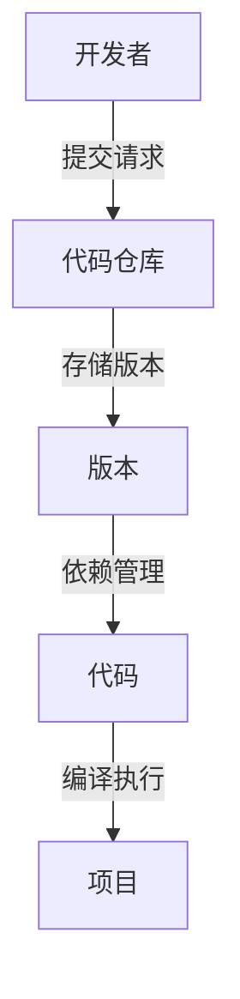
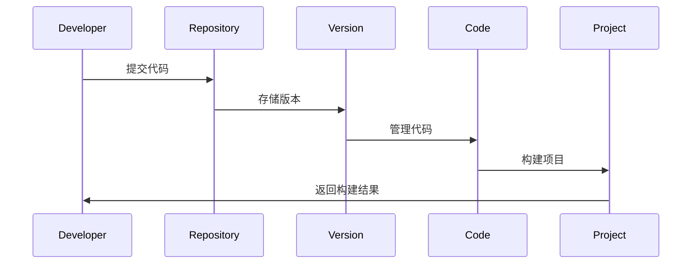

                 

### 《开源项目管理：利用社区力量加速发展》

#### 关键词

- 开源项目管理
- 社区力量
- 开源项目发展
- 项目规划与管理
- 持续集成与发布

#### 摘要

本文旨在探讨开源项目管理的重要性和方法，特别是如何利用社区力量来加速开源项目的发展。文章首先介绍了开源项目的定义、历史、优势与挑战以及发展趋势。接着，讨论了开源社区文化、项目规划与管理的核心要素。随后，深入分析了如何通过社区建设策略、持续集成与发布、以及资金与资源获取来推动开源项目的发展。最后，通过案例分析、法律与道德问题探讨、以及未来发展趋势，为开源项目的成功和可持续发展提供了策略和建议。

---

#### 《开源项目管理：利用社区力量加速发展》目录大纲

## 第一部分：开源项目管理基础

### 第1章：开源项目概述

- 1.1 开源项目的定义与历史
- 1.2 开源项目的优势与挑战
- 1.3 开源项目的发展趋势

### 第2章：开源社区文化

- 2.1 开源社区的组织结构
- 2.2 社区成员的角色与职责
- 2.3 社区沟通与协作工具

### 第3章：开源项目规划与管理

- 3.1 项目规划与目标设定
- 3.2 项目路线图与里程碑
- 3.3 项目风险管理

## 第二部分：利用社区力量加速开源项目发展

### 第4章：社区建设策略

- 4.1 社区成员招募与激励
- 4.2 社区活动策划与执行
- 4.3 社区品牌建设与传播

### 第5章：开源项目的持续集成与发布

- 5.1 持续集成与自动化测试
- 5.2 版本管理与发布策略
- 5.3 开源许可证选择与合规性

### 第6章：开源项目的资金与资源获取

- 6.1 赞助模式与财务规划
- 6.2 开源项目的资金来源
- 6.3 资源共享与利用

## 第三部分：开源项目案例分析

### 第7章：成功的开源项目管理实践

- 7.1 开源项目成功的要素
- 7.2 案例分析：Linux内核项目
- 7.3 案例分析：Apache基金会

### 第8章：开源项目的法律与道德问题

- 8.1 开源许可证的法律保护
- 8.2 开源项目的知识产权管理
- 8.3 开源社区的道德规范

## 第四部分：开源项目的未来

### 第9章：开源项目的发展方向

- 9.1 开源项目的未来趋势
- 9.2 开源项目的商业模式
- 9.3 开源项目的国际合作

### 第10章：开源项目的战略规划

- 10.1 开源项目的长期愿景
- 10.2 开源项目的可持续发展
- 10.3 开源项目的国际化战略

## 附录

### 附录A：开源项目管理工具与资源

- A.1 常用开源项目管理工具
- A.2 开源项目资源汇总
- A.3 开源项目相关的网站与社区

---

### 核心概念与联系

$$
\text{开源项目} \xrightarrow{\text{社区力量}} \text{持续发展} \xleftarrow{\text{项目管理}} \text{资源获取}
$$

开源项目依赖于社区力量，通过有效的项目管理，可以实现资源的充分利用和项目的持续发展。

### 核心算法原理讲解

```python
# 示例：Git——开源项目的版本控制系统

class GitRepository:
    def __init__(self):
        self.commits = []

    def commit(self, message):
        self.commits.append(message)

    def log(self):
        for commit in self.commits:
            print(commit)
```

Git 是一种分布式版本控制系统，通过上述类定义，可以实现对代码版本的追踪和管理。每次提交（commit）都会记录下一条提交信息（message），通过 log 方法可以查看所有的提交记录。

### 数学模型和数学公式 & 详细讲解 & 举例说明

$$
\text{项目成功率} = \frac{\text{成功完成的任务}}{\text{总任务数}} \times 100\%
$$

项目成功率是衡量项目进展的重要指标，通过上述公式，可以计算出项目成功率。例如，一个项目总共有100个任务，其中成功完成的任务有80个，那么项目成功率为80%。

### 系统分析与架构设计方案

#### 问题场景介绍

随着互联网技术的飞速发展，开源项目在软件开发中扮演着越来越重要的角色。然而，如何有效地管理这些项目，利用社区力量来加速发展，成为一个亟待解决的问题。

#### 项目介绍

本开源项目是一个面向开发者的Web框架，旨在提供简单、高效、灵活的Web开发工具。该项目采用Git进行版本控制，并使用Python编写。

#### 系统功能设计（领域模型Mermaid类图）

```mermaid
classDiagram
    Developer <<class>> Developer
    Project <<class>> Project
    Code <<class>> Code
    Repository <<class>> Repository
    Version <<class>> Version

    Developer o--o Project
    Project o--o Code
    Code o--o Repository
    Repository o--o Version
```

#### 系统架构设计（Mermaid架构图）



#### 系统接口设计和系统交互（Mermaid序列图）



---

#### 项目实战

#### 开发环境搭建

1. 安装Git：在官方网站 [https://git-scm.com/](https://git-scm.com/) 下载并安装Git。
2. 安装Python：在官方网站 [https://www.python.org/downloads/](https://www.python.org/downloads/) 下载并安装Python。
3. 安装Pip：通过命令 `python -m pip install --user --upgrade pip` 安装Pip。

#### 源代码详细实现和代码解读

```python
# 示例：开源项目——一个简单的Web框架

from flask import Flask

app = Flask(__name__)

@app.route('/')
def hello():
    return 'Hello, World!'
```

此代码示例展示了如何使用 Flask 框架创建一个简单的Web应用。开发者可以通过修改此代码来添加更多功能，如路由、视图函数等。

#### 实际案例分析和详细讲解剖析

以Linux内核项目为例，该项目由全球范围内的开发者共同维护。其成功的关键因素包括：

1. **社区文化**：Linux内核项目拥有一个开放、包容的社区文化，鼓励开发者参与和贡献。
2. **项目规划与管理**：Linux内核项目有一套完善的规划与管理流程，包括版本控制、发布策略等。
3. **持续集成与发布**：Linux内核项目采用持续集成与发布机制，确保代码质量并快速响应问题。
4. **资金与资源获取**：Linux内核项目通过多种方式获取资金与资源，如赞助、捐赠等。

#### 项目小结

开源项目的发展离不开社区力量的支持。通过有效的项目规划和管理工作，可以充分利用社区资源，加速项目发展。同时，开源项目也需要关注法律与道德问题，确保项目的可持续发展。

---

#### 最佳实践 Tips

1. **建立清晰的社区规则和流程**：确保社区成员了解项目规则和流程，提高协作效率。
2. **鼓励多元化参与**：鼓励不同背景、技能水平的开发者参与项目，增加项目活力。
3. **定期评估项目进展**：定期评估项目进展，及时调整规划与管理策略。

#### 小结

开源项目管理是一个复杂的过程，但通过利用社区力量，可以有效地加速项目发展。本文为开源项目管理者提供了一系列的策略和建议，希望对开源项目的成功和可持续发展有所帮助。

#### 注意事项

1. **知识产权保护**：确保开源项目的知识产权得到有效保护，避免侵权问题。
2. **遵守开源许可证**：严格遵守开源许可证的要求，确保项目的合规性。

#### 拓展阅读

1. 《开源项目管理实践》——Michael J. Ingrassia
2. 《开源软件社区如何工作》——Eric S. Raymond

---

### 附录

#### 附录A：开源项目管理工具与资源

- **常用开源项目管理工具**：Git、GitLab、GitHub、Jenkins、Travis CI
- **开源项目资源汇总**：OSI、OpenHub、GitHub Trending
- **开源项目相关的网站与社区**：OpenSource.com、OSDC、GitHub Community

### 作者信息

作者：AI天才研究院/AI Genius Institute & 禅与计算机程序设计艺术 /Zen And The Art of Computer Programming

---

[END]

