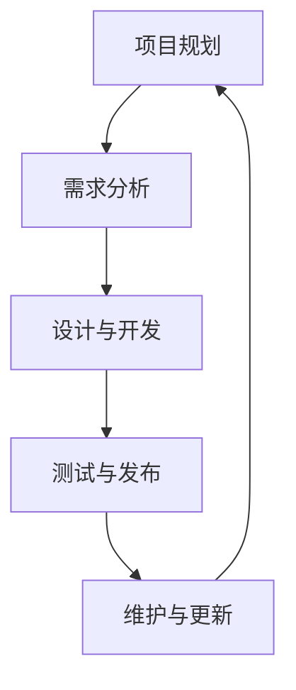

                 

# 开源项目管理：社区建设与维护之道

## 关键词

- 开源项目管理
- 社区建设
- 社区维护
- 法律伦理
- 持续发展

## 摘要

本文旨在深入探讨开源项目管理的核心要素，特别是社区建设与维护的策略。通过对开源项目的基本概念、组织与管理、法律与伦理的全面解析，本文为读者提供了一个系统化的开源项目管理框架。同时，文章将重点分析社区成员的角色与职责、社区沟通与协作、社区成长与维护，以及开源项目的持续维护与扩展推广策略。最后，通过案例分析总结开源项目的成功与失败经验，为开源项目的可持续发展提供实践指导。

## 目录大纲

### 第一部分：开源项目管理基础

#### 第1章：开源项目概述

##### 1.1 开源项目的定义与特点

##### 1.2 开源项目的历史与发展

##### 1.3 开源项目的重要性和影响

#### 第2章：开源项目的组织与管理

##### 2.1 开源社区的运作模式

##### 2.2 项目章程和目标

##### 2.3 项目管理流程

##### 2.4 项目风险管理

#### 第3章：开源项目的法律与伦理

##### 3.1 开源许可证的类型与选择

##### 3.2 版权声明与知识产权保护

##### 3.3 遵守开源伦理和社区规则

### 第二部分：社区建设

#### 第4章：社区成员的角色与职责

##### 4.1 捐赠者与赞助商

##### 4.2 开发者与贡献者

##### 4.3 用户与反馈者

##### 4.4 测试者与文档者

#### 第5章：社区沟通与协作

##### 5.1 选择合适的沟通工具

##### 5.2 搭建协作平台

##### 5.3 社区活动与互动

##### 5.4 项目决策与投票机制

#### 第6章：社区成长与维护

##### 6.1 社区成员的培养与激励

##### 6.2 社区问题的解决与反馈

##### 6.3 社区的可持续发展

### 第三部分：开源项目的维护与持续发展

#### 第7章：开源项目的持续维护

##### 7.1 代码质量的保障

##### 7.2 代码库的维护与更新

##### 7.3 项目的性能与优化

##### 7.4 项目的长期规划

#### 第8章：开源项目的扩展与推广

##### 8.1 开源项目的市场定位

##### 8.2 营销与品牌建设

##### 8.3 合作伙伴与生态系统建设

##### 8.4 项目国际化与多语言支持

#### 第9章：开源项目的影响与回报

##### 9.1 开源项目的商业价值

##### 9.2 开源项目的社区回馈

##### 9.3 开源项目的社会影响

##### 9.4 开源项目的可持续发展策略

#### 第10章：开源项目案例分析

##### 10.1 成功的开源项目案例

##### 10.2 失败的开源项目教训

##### 10.3 开源项目的发展趋势与挑战

### 附录：开源项目管理工具与资源

#### A.1 常用开源项目管理工具

##### A.1.1 版本控制系统

##### A.1.2 Issue跟踪系统

##### A.1.3 持续集成工具

##### A.1.4 文档生成工具

#### A.2 开源项目管理资源

##### A.2.1 开源项目指南

##### A.2.2 开源社区论坛

##### A.2.3 开源项目搜索引擎

##### A.2.4 开源项目评估标准

**Mermaid 流程图示例：**

### 第一部分：开源项目管理基础

#### 第1章：开源项目概述

##### 1.1 开源项目的定义与特点

开源项目是指那些允许用户查看、使用、修改和分发软件源代码的软件项目。这种模式基于共享精神和协作理念，旨在促进技术的创新和发展。开源项目的特点包括：

1. **透明性**：源代码对所有用户开放，使得项目的改进和优化更加透明和高效。
2. **可定制性**：用户可以根据自己的需求修改和定制软件。
3. **协作性**：多个贡献者共同参与，协作开发。
4. **社区驱动**：社区成员的参与和反馈是项目发展的关键。

##### 1.2 开源项目的历史与发展

开源项目的概念起源于1983年，Richard Stallman提出了“自由软件”的理念，并创建了GNU项目，旨在开发一个兼容Unix的自由操作系统。1991年，Linus Torvalds发布了Linux内核，标志着现代开源项目的崛起。随着互联网的普及，开源项目得到了快速发展，成为技术创新的重要力量。

近年来，开源项目在技术、商业、社会等领域的影响力不断扩大。例如，云计算领域的OpenStack、大数据领域的Hadoop、编程语言Python等，都在开源社区的支持下取得了巨大成功。

##### 1.3 开源项目的重要性和影响

开源项目对技术发展、商业创新和社会进步都有着深远的影响：

1. **技术发展**：开源项目促进了技术的共享和创新，为科研和开发提供了丰富的资源。
2. **商业创新**：许多企业通过开源项目实现了商业价值，如Red Hat、SUSE等。
3. **社会进步**：开源项目使得软件更加开放、透明，降低了技术门槛，促进了信息化和数字化社会的建设。

#### 第2章：开源项目的组织与管理

##### 2.1 开源社区的运作模式

开源社区的运作模式基于自愿原则和协作精神。通常，开源项目由一个核心团队领导，成员包括开发者、贡献者、用户等。他们通过邮件列表、论坛、聊天室等渠道进行沟通和协作。

开源社区通常采用以下几种运作模式：

1. **集中式管理**：由核心团队负责项目的管理和决策。
2. **分布式管理**：项目由多个小组共同管理，每个小组负责特定的模块或功能。
3. **共识决策**：社区成员通过讨论和投票达成共识，决定项目的方向和策略。

##### 2.2 项目章程和目标

项目章程是项目的纲领性文件，明确了项目的目的、范围、目标、期限和资源。对于开源项目，章程通常包括以下内容：

1. **项目愿景**：描述项目的长期目标和意义。
2. **项目范围**：定义项目的边界和包含的工作。
3. **项目目标**：列出项目的具体目标和里程碑。
4. **资源分配**：明确项目所需的资源和预算。

##### 2.3 项目管理流程

开源项目通常采用敏捷开发模式，以适应快速变化的需求和灵活的迭代开发。项目管理流程包括以下步骤：

1. **需求分析**：收集和分析用户需求，明确项目的目标。
2. **设计与开发**：根据需求进行系统设计和开发。
3. **测试与发布**：进行系统测试，确保质量，然后发布新版本。
4. **维护与更新**：持续优化和更新项目，以适应不断变化的环境。

##### 2.4 项目风险管理

开源项目面临多种风险，包括技术风险、法律风险、商业风险等。项目管理流程中，需要重视风险管理和控制：

1. **识别风险**：分析项目可能面临的风险。
2. **评估风险**：评估风险的可能性和影响。
3. **制定策略**：制定风险应对策略，包括规避、转移、缓解和接受。
4. **监控和报告**：持续监控风险，及时报告和处理风险事件。

#### 第3章：开源项目的法律与伦理

##### 3.1 开源许可证的类型与选择

开源项目需要选择合适的开源许可证，以保护作者权益，同时允许用户自由使用、修改和分发软件。常见的开源许可证包括：

1. **GPL（GNU General Public License）**：最流行的开源许可证之一，要求用户对修改后的代码也采用GPL许可证。
2. **BSD（Berkeley Software Distribution License）**：较为宽松的许可证，允许用户自由使用、修改和分发代码，但不要求开源修改后的代码。
3. **Apache License**：类似于BSD许可证，但增加了版权声明的要求。

选择合适的开源许可证需要考虑项目的目标、需求和风险，以确保作者权益和用户自由。

##### 3.2 版权声明与知识产权保护

开源项目需要明确版权声明，保护作者和贡献者的知识产权。通常，项目会在代码中包含版权声明，说明代码的版权归属和许可方式。

此外，开源项目还需要建立知识产权保护机制，防止未经授权的使用和分发。这包括：

1. **签署贡献者协议**：确保贡献者同意将其贡献的代码开源，并授权项目使用。
2. **审查代码贡献**：确保贡献的代码符合开源许可证的要求，避免侵权行为。

##### 3.3 遵守开源伦理和社区规则

开源项目需要遵守开源伦理和社区规则，以维护社区的和谐和项目的可持续发展。这包括：

1. **尊重贡献者**：感谢贡献者的工作和努力，尊重他们的权益。
2. **公平对待所有成员**：避免偏见和歧视，公平对待所有社区成员。
3. **遵守社区规范**：遵守社区的沟通规范和行为准则，积极参与社区活动。
4. **开源成果共享**：鼓励社区成员分享开源成果，促进技术进步和创新。

### 第二部分：社区建设

#### 第4章：社区成员的角色与职责

##### 4.1 捐赠者与赞助商

捐赠者与赞助商是开源社区的重要支持者，他们通过资金、资源或服务支持开源项目的发展。捐赠者可以是个人、组织或企业，他们的贡献有助于项目维护、改进和推广。

捐赠者与赞助商的职责包括：

1. **提供资金支持**：为项目提供必要的资金，确保项目持续运作。
2. **提供资源支持**：为项目提供服务器、带宽、存储等资源，减轻项目维护压力。
3. **推广项目**：通过宣传、活动等手段推广项目，提高项目知名度和影响力。

##### 4.2 开发者与贡献者

开发者与贡献者是开源社区的核心成员，他们负责项目的开发、维护和改进。开发者通常具有丰富的技术经验，贡献者可以是开发者、用户或其他有兴趣参与社区的人。

开发者与贡献者的职责包括：

1. **编写代码**：编写高质量的代码，实现项目功能和需求。
2. **修复漏洞**：及时修复项目中发现的漏洞，确保项目安全。
3. **改进文档**：撰写和更新项目文档，提高项目的可读性和易用性。
4. **参与讨论**：积极参与社区讨论，提供技术支持和意见建议。

##### 4.3 用户与反馈者

用户是开源项目的重要受益者，他们通过使用开源项目获得技术支持和价值。用户与反馈者是社区的重要成员，他们的反馈对项目改进和发展具有重要意义。

用户与反馈者的职责包括：

1. **使用项目**：积极使用开源项目，体验项目功能和性能。
2. **提供反馈**：向社区反馈项目使用中的问题和建议，帮助项目改进。
3. **报告漏洞**：及时报告项目中发现的安全漏洞，确保项目安全。
4. **参与社区**：积极参与社区活动，与其他成员交流经验。

##### 4.4 测试者与文档者

测试者与文档者是开源社区的重要支持者，他们负责项目的测试和文档工作。测试者负责验证项目功能，确保项目质量；文档者负责撰写和更新项目文档，提高项目的可读性和易用性。

测试者与文档者的职责包括：

1. **测试代码**：进行系统测试和功能测试，确保项目稳定可靠。
2. **编写文档**：撰写和更新项目文档，包括用户手册、开发文档等。
3. **提供反馈**：向社区反馈测试结果和文档问题，促进项目改进。
4. **参与社区**：积极参与社区讨论，分享测试经验和文档编写技巧。

#### 第5章：社区沟通与协作

##### 5.1 选择合适的沟通工具

良好的沟通是社区协作的基础，选择合适的沟通工具至关重要。常见的沟通工具有：

1. **邮件列表**：用于大规模消息传递，适合项目公告、讨论和决策。
2. **聊天室**：如Slack、Telegram等，适合实时交流、讨论和协作。
3. **论坛**：如GitHub Issues、Reddit等，适合项目问题反馈、讨论和交流。
4. **文档工具**：如GitLab、Confluence等，适合项目文档编写、存储和分享。

选择合适的沟通工具需要考虑项目的规模、成员的分布和沟通的需求。

##### 5.2 搭建协作平台

搭建协作平台是社区建设的重要环节，平台应具备以下功能：

1. **代码管理**：支持版本控制，如Git、SVN等。
2. **问题跟踪**：支持Bug报告、需求跟踪和任务管理。
3. **文档管理**：支持文档编写、存储和分享。
4. **聊天和讨论**：支持实时沟通和讨论。
5. **权限管理**：支持成员角色和权限设置，确保项目安全。

常用的协作平台包括GitHub、GitLab、Bitbucket等。

##### 5.3 社区活动与互动

社区活动与互动是增强社区凝聚力和成员参与度的重要手段。常见的社区活动有：

1. **线上会议**：如Zoom、Google Meet等，用于项目讨论、分享和交流。
2. **代码评审**：通过代码评审，提高代码质量，促进技术交流。
3. **技术讲座**：邀请专家进行技术讲座，分享经验和知识。
4. **线下聚会**：组织线下聚会，增进成员之间的交流与合作。

社区活动与互动能够激发成员的积极性，提高项目的活力和影响力。

##### 5.4 项目决策与投票机制

项目决策与投票机制是社区管理的重要环节，有助于确保项目发展的方向和策略。常见的决策和投票机制有：

1. **共识决策**：通过讨论和协商，达成共识，决定项目方向。
2. **民主投票**：通过投票，决定项目的具体策略和方案。
3. **项目管理委员会**：设立项目管理委员会，负责项目的决策和管理。
4. **社区投票**：向全体社区成员征求

