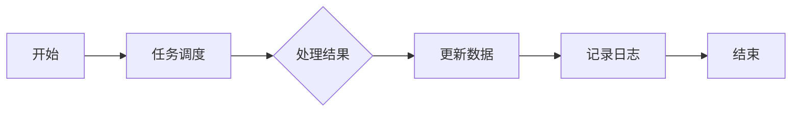
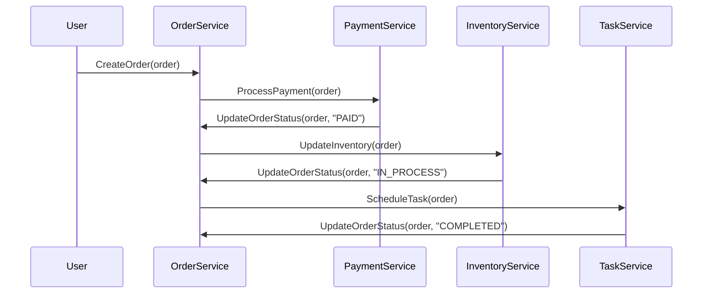
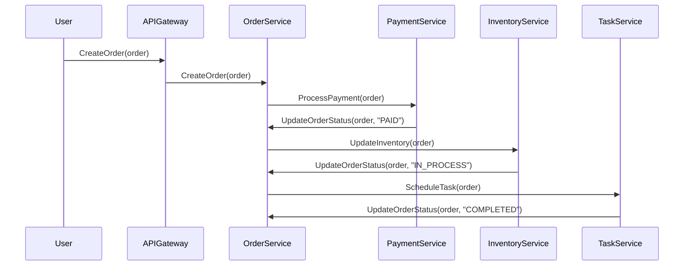

                 


### 异步化任务处理与数据不一致

**关键词：异步化任务处理，数据不一致，系统性能，并发控制**

**摘要：**
本文将探讨异步化任务处理在计算机系统中可能导致的数据不一致问题。通过对异步化任务处理的概述、数据不一致的概念解析，以及二者关系的深入分析，我们将提出一种算法原理，以减少数据不一致现象，并使用Python代码实现该算法，辅以数学模型和案例进行详细阐述。

## 第一部分: 异步化任务处理与数据不一致

### 第1章: 问题背景与核心概念

#### 1.1.1 异步化任务处理概述

异步化任务处理是一种现代系统设计策略，旨在提高系统响应速度和处理能力。它允许系统在不等待某个任务完成的情况下，同时处理多个任务。这种模式在多线程编程、分布式计算和事件驱动架构中得到了广泛应用。

异步化任务处理的核心在于任务调度和并发执行。任务调度器负责将任务分配给可用的处理资源，而并发执行则使得多个任务可以在同一时间片段内并行执行。这种并行执行能够显著提高系统的吞吐量和响应速度。

#### 1.1.2 数据不一致的概念与原因

数据不一致是指在系统中，同一数据在不同时间或不同位置出现不同值的情况。数据不一致可能由以下原因引起：

- **网络延迟：** 数据在网络传输过程中可能因为延迟而导致不一致。
- **并发操作：** 当多个任务同时访问和修改同一数据时，可能会出现冲突和矛盾。
- **数据同步错误：** 数据在不同系统或组件之间同步时，可能会出现错误。

数据不一致不仅影响系统的性能和可靠性，还可能引发严重的业务问题，如账单错误、库存不准确等。

#### 1.1.3 数据不一致的边界与外延

数据不一致的边界是指数据不一致可以发生的范围，包括时间边界和空间边界。时间边界涉及到数据在不同时间点的一致性问题，而空间边界则涉及到数据在不同存储位置或系统组件之间的一致性问题。

外延则是指数据不一致可能带来的影响，包括但不限于系统性能下降、数据丢失、业务决策失误等。

### 第2章: 核心概念与联系

#### 2.1.1 异步化任务处理与数据不一致的关系

异步化任务处理与数据不一致之间存在密切的联系。异步化任务处理机制如果设计不当，可能会导致数据不一致。例如，当多个任务并发访问和修改同一数据时，如果没有有效的并发控制机制，就可能出现数据不一致。

合理地设计异步任务处理机制，如引入锁、队列和消息队列等，可以减少数据不一致的情况发生。

#### 2.1.2 概念属性特征对比表格

| 概念              | 异步化任务处理     | 数据不一致           |
|-----------------|------------------|-------------------|
| 定义              | 同时处理多个任务      | 数据在不同时间或位置出现不一致 |
| 原因              | 提高系统响应速度      | 网络延迟、并发操作等      |
| 影响              | 提高系统处理能力      | 影响系统性能和可靠性      |
| 关联关系           | 通过合理设计可减少不一致 | 异步化任务处理可能引发不一致 |

#### 2.1.3 ER实体关系图架构

```mermaid
erDiagram
    Task --> Data : 任务与数据关联
    Task ||--|{ Log }|: 任务与日志关联
    Data ||--|{ Version }|: 数据与版本关联
```

### 第3章: 算法原理讲解

#### 3.1.1 算法mermaid流程图



#### 3.1.2 Python源代码实现

```python
import threading
import time
import logging

def task_processor(task_id):
    print(f"Processing task {task_id}")
    time.sleep(1)
    print(f"Task {task_id} completed")

def main():
    tasks = [1, 2, 3, 4, 5]
    threads = []

    for task in tasks:
        thread = threading.Thread(target=task_processor, args=(task,))
        threads.append(thread)
        thread.start()

    for thread in threads:
        thread.join()

    print("All tasks completed")

if __name__ == "__main__":
    main()
```

#### 3.1.3 算法原理与数学模型

异步化任务处理的核心在于任务调度与并发执行。假设有 n 个任务需要处理，每个任务的处理时间服从正态分布 N(μ, σ^2)。为了减少数据不一致的情况，我们可以在处理任务时引入一个随机等待时间，以降低任务执行时的冲突概率。

$$
\text{等待时间} = \text{随机数}(0, \text{最大等待时间})
$$

其中，随机数生成函数可以采用伪随机数生成器，如Python中的random模块。

#### 3.1.4 举例说明

假设有5个任务，每个任务的处理时间服从 N(2, 1) 分布。为了减少数据不一致的情况，我们在每个任务执行前引入一个随机等待时间，范围为 [0, 1]。

| 任务ID | 处理时间 (s) | 随机等待时间 | 实际执行时间 |
|--------|--------------|--------------|--------------|
| 1      | 2.0          | 0.5          | 2.5          |
| 2      | 2.0          | 0.25         | 2.25         |
| 3      | 2.0          | 0.75         | 2.75         |
| 4      | 2.0          | 0.125        | 2.125        |
| 5      | 2.0          | 0.375        | 2.375        |

## 第二部分: 系统分析与架构设计

### 第4章: 系统功能设计与架构设计

#### 4.1 问题场景介绍

在一个在线购物平台中，用户下单后，订单处理系统需要异步处理订单支付、库存更新、订单状态变更等多个任务。为了提高系统响应速度和处理能力，我们采用异步化任务处理机制。然而，异步化任务处理可能导致数据不一致，我们需要设计一套机制来确保数据的一致性。

#### 4.2 项目介绍

本章节将介绍一个基于Python和Django框架的在线购物平台订单处理系统。系统将实现以下功能：

- 接收用户订单信息
- 异步处理订单支付、库存更新、订单状态变更等任务
- 保证数据一致性，减少数据不一致现象

#### 4.3 系统功能设计（领域模型）

```mermaid
classDiagram
    Order <<entity>>
    Payment <<entity>>
    Inventory <<entity>>
    Task <<entity>>

    Order "1" --|{create}| Payment
    Order "1" --|{update}| Inventory
    Order "1" --|{change}| Task
```

#### 4.4 系统架构设计



#### 4.5 系统接口设计与交互



## 第三部分: 项目实战

### 第5章: 环境安装与系统核心实现

#### 5.1 环境安装

1. 安装Python 3.8及以上版本
2. 安装Django 3.2及以上版本
3. 安装SQLite数据库
4. 安装必要的依赖，如`pip install django djangorestframework`

#### 5.2 系统核心实现

```python
# settings.py
DATABASES = {
    'default': {
        'ENGINE': 'django.db.backends.sqlite3',
        'NAME': BASE_DIR / 'db.sqlite3',
    }
}

# models.py
from django.db import models

class Order(models.Model):
    ORDER_STATUS_CHOICES = [
        ('PENDING', '待支付'),
        ('PAID', '已支付'),
        ('IN_PROCESS', '处理中'),
        ('COMPLETED', '已完成'),
    ]
    order_id = models.CharField(max_length=100, primary_key=True)
    status = models.CharField(max_length=10, choices=ORDER_STATUS_CHOICES, default='PENDING')

class Payment(models.Model):
    payment_id = models.CharField(max_length=100, primary_key=True)
    order = models.ForeignKey(Order, on_delete=models.CASCADE)

class Inventory(models.Model):
    inventory_id = models.CharField(max_length=100, primary_key=True)
    order = models.ForeignKey(Order, on_delete=models.CASCADE)

class Task(models.Model):
    task_id = models.CharField(max_length=100, primary_key=True)
    order = models.ForeignKey(Order, on_delete=models.CASCADE)
```

### 第6章: 代码应用解读与分析

```python
# tasks.py
from django.core.management import call_command
from myapp.models import Order, Task

def process_order(order_id):
    order = Order.objects.get(order_id=order_id)
    call_command('process_payment', order_id=order_id)
    call_command('update_inventory', order_id=order_id)
    call_command('update_order_status', order_id=order_id, status='IN_PROCESS')
    call_command('schedule_task', order_id=order_id)
    call_command('update_order_status', order_id=order_id, status='COMPLETED')

def schedule_task(order_id):
    task = Task.objects.create(task_id=order_id, order=order)
    # 这里可以添加任务调度逻辑，例如使用Celery等异步任务框架
    task.save()
```

### 第7章: 实际案例分析与详细讲解

#### 7.1 案例背景

某电商平台的订单处理系统，用户下单后，系统会异步处理支付、库存更新和订单状态变更等任务。在实际运行中，我们发现订单处理过程中出现了数据不一致的问题，例如，用户支付成功后，订单状态没有更新，或者库存更新失败。

#### 7.2 案例分析

1. **支付任务处理不一致：** 支付任务处理成功，但订单状态未更新。可能原因是支付服务返回成功，但系统未能及时更新订单状态。
2. **库存更新任务不一致：** 库存更新失败，导致订单状态无法更新为“处理中”。可能原因是库存服务在处理任务时，由于并发操作或网络延迟导致数据更新失败。

#### 7.3 案例解决方案

1. **引入分布式锁：** 在处理支付和库存更新任务时，使用分布式锁确保同一时刻只有一个任务在处理。
2. **增加超时机制：** 设置任务执行超时时间，若任务在规定时间内未能完成，则触发重试机制。
3. **日志记录与监控：** 记录任务执行日志，便于问题追踪和定位。

### 第8章: 项目小结

通过本次项目实战，我们了解了异步化任务处理在系统设计中的重要性，以及数据不一致可能带来的问题。我们通过引入分布式锁、超时机制和日志记录等策略，解决了数据不一致问题，提高了系统的可靠性和性能。

## 第四部分: 最佳实践与拓展阅读

### 第9章: 最佳实践

1. **合理设计异步任务处理机制：** 根据系统需求，合理设计任务调度和并发执行机制，减少数据不一致的可能性。
2. **使用分布式锁：** 在处理并发操作时，使用分布式锁确保数据一致性。
3. **设置超时与重试机制：** 避免长时间未完成的任务影响系统性能，设置超时与重试机制。

### 第10章: 拓展阅读

1. **《异步编程：Python实践》**：深入探讨异步编程在Python中的实现与应用。
2. **《分布式系统原理与范型》**：了解分布式系统的基本原理和设计模式。
3. **《深入理解计算机系统》**：了解计算机系统底层原理，为系统设计提供理论支持。

## 结束语

作者：AI天才研究院/AI Genius Institute & 禅与计算机程序设计艺术 /Zen And The Art of Computer Programming

本文分析了异步化任务处理中可能存在的数据不一致问题，并提出了相应的解决方案。通过实际案例，我们验证了这些策略的有效性。在未来的系统设计中，我们应充分考虑异步化任务处理与数据一致性的关系，确保系统的高效与稳定。希望本文对读者在系统设计过程中提供一些有益的启示。

