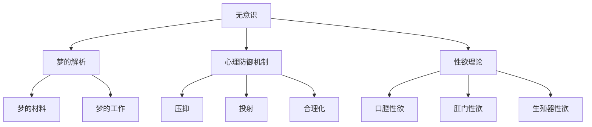

                 

### 文章标题

《弗洛伊德与拉康：精神分析的古典与后现代诠释》

### 关键词

精神分析、古典精神分析、后现代精神分析、弗洛伊德、拉康、无意识、心理防御机制、性欲理论、语言与身份、象征秩序、现实秩序、后现代主义

### 摘要

本文深入探讨了弗洛伊德和拉康两位精神分析大师的理论，通过古典与后现代的视角，对精神分析的核心概念进行了系统性的梳理和解读。文章首先回顾了弗洛伊德精神分析的基础理论，包括无意识理论、梦的解析、心理防御机制和性欲理论。接着，文章分析了拉康对弗洛伊德理论的继承与发展，重点介绍了象征秩序与现实秩序、语言与身份等关键概念。最后，文章探讨了精神分析在当代文化中的地位及其在多个领域中的应用，并对弗洛伊德与拉康精神分析的未来发展进行了展望。通过本文，读者可以全面了解精神分析的理论框架及其在心理学、社会学和文化研究中的深远影响。

### 弗洛伊德精神分析的基础理论

#### 第1章 弗洛伊德精神分析概述

#### 1.1 精神分析的历史背景

精神分析作为一种心理学理论，起源于19世纪末。其创始人西格蒙德·弗洛伊德（Sigmund Freud）是一位奥地利的神经学家和精神病学家。在当时的医学背景下，精神分析作为一种治疗心理疾病的方法逐渐受到关注。弗洛伊德在其早期的医学实践中，通过观察和治疗方法，发现了很多关于人类心理行为的不合理和矛盾之处，这促使他开始深入研究人类的心理结构。

#### 1.2 弗洛伊德精神分析的核心概念

弗洛伊德精神分析的核心概念包括无意识、梦的解析、心理防御机制和性欲理论。无意识是指人类心理活动中未被意识到的部分，是心理活动的基础。梦的解析是弗洛伊德研究无意识的重要方法，他认为梦是欲望的满足。心理防御机制是人类为了应对心理冲突和压力而形成的一系列心理策略，常见的防御机制包括压抑、投射、合理化等。性欲理论则认为人类的性欲望是一个基本的心理动力，影响个体的行为和心理健康。

#### 1.3 弗洛伊德与精神分析学派的发展

弗洛伊德的精神分析理论在诞生之初受到了广泛的质疑和争议，但随着时间的推移，其理论逐渐被接受，并形成了独立的精神分析学派。弗洛伊德的学生和追随者们对精神分析进行了进一步的深化和发展，如安娜·弗洛伊德（Anna Freud）对儿童心理的分析、阿尔弗雷德·阿德勒（Alfred Adler）的个体心理学等。20世纪中叶，精神分析理论开始与其他心理学流派进行对话和融合，形成了多元化的心理学理论体系。

#### 第2章 无意识理论

#### 2.1 无意识的定义与作用

无意识是指那些没有被我们意识到的心理活动和内容。弗洛伊德认为，无意识是心理活动的重要部分，它包含了许多我们未能察觉到的欲望、冲突和动机。无意识的作用不仅限于心理防御，还影响个体的行为和情绪。例如，某些行为可能看似无意义，但实际上是潜意识欲望的体现。

#### 2.2 梦的解析

梦是弗洛伊德研究无意识的另一个重要领域。他认为梦是无意识欲望的象征性表达。通过梦的解析，我们可以探索和了解隐藏在无意识深处的心理动机和冲突。例如，一个常见的梦境可能是关于失去或害怕失去所爱的人，这可能反映了个体内心深处的焦虑和恐惧。

#### 2.3 梦的材料与梦的工作

梦的材料分为显梦和潜梦两部分。显梦是我们在清醒状态下能够记忆和描述的梦境内容，而潜梦则是我们无法意识和记忆的梦境内容。弗洛伊德认为，梦的工作包括压抑、替代、象征和组合等过程，这些过程使得潜梦转化为显梦，并通过象征性语言来表达无意识的内容。

#### 第3章 心理防御机制

#### 3.1 防御机制的定义

心理防御机制是指个体在面对心理冲突和压力时，为了保护自己免受心理痛苦而采取的心理策略。弗洛伊德认为，防御机制是人类心理适应机制的一部分，它帮助个体应对生活中的困难和挑战。

#### 3.2 常见的防御机制

常见的防御机制包括压抑、投射、合理化、反向形成、转移等。例如，压抑是指个体将不愉快的经历或欲望压抑到无意识中，避免面对和承认。投射则是指个体将自己的不良特质或情感归咎于他人。合理化则是指个体通过找借口或解释来缓解内心的冲突和焦虑。

#### 3.3 防御机制的作用与影响

防御机制的作用在于帮助个体应对心理压力，保护个体的自尊和自我认同。然而，过度使用防御机制可能导致心理问题和行为障碍。例如，长期的压抑可能导致抑郁症和焦虑症等心理疾病。

#### 第4章 性欲理论

#### 4.1 性欲的定义与分类

性欲是指个体对性行为的渴望和兴趣。弗洛伊德将性欲分为三种形式：口腔性欲、肛门性欲和生殖器性欲。这三种性欲形式在不同的生命阶段和个体发展中起着不同的作用。

#### 4.2 性欲的发展阶段

弗洛伊德认为，性欲的发展分为五个阶段：口唇期、肛门期、性器期、潜伏期和生殖期。每个阶段都有特定的心理发展和行为特征。例如，在口唇期，婴儿通过吸吮和吞咽来获得满足感。

#### 4.3 性欲与心理健康

性欲不仅影响个体的生理健康，还与心理健康密切相关。健康的性欲有助于个体的情感满足和自我认同，但过度的性欲或性功能障碍可能导致心理问题和行为障碍。例如，性无能或性焦虑可能导致个体的自尊心受损和人际关系问题。

### 拉康精神分析的理论发展

#### 第5章 拉康与弗洛伊德的差异

#### 5.1 拉康对弗洛伊德理论的继承与发展

拉康（Jacques Lacan）是20世纪最具有影响力的精神分析学家之一。他批判性地继承了弗洛伊德的理论，并提出了一系列新的概念和理论。拉康认为，弗洛伊德的精神分析理论过于强调性欲的作用，而忽略了语言和符号系统的重要性。拉康将语言视为人类心理结构的决定性因素，提出了象征秩序和现实秩序的概念。

#### 5.2 拉康的关键概念

拉康提出了许多重要的概念，包括象征秩序、现实秩序、镜像阶段、语言与身份等。象征秩序是指由语言和文化符号构成的系统，它对个体的心理和行为产生深远的影响。现实秩序则是指现实世界的逻辑和规则，它是象征秩序在现实中的体现。镜像阶段是儿童心理发展的重要阶段，个体通过镜像认同来建立自我认同。语言与身份则表明，个体的身份是由语言和符号系统所建构的。

#### 5.3 拉康与弗洛伊德的哲学对话

拉康与弗洛伊德在许多方面存在哲学上的对话和争论。拉康批评弗洛伊德忽视了语言的重要性，他认为语言是人类心理结构的根本。弗洛伊德则强调无意识和性欲的作用，认为这些是心理动力的重要组成部分。尽管存在分歧，但两位大师的理论都为精神分析的发展做出了重要贡献。

### 第6章 象征秩序与现实秩序

#### 6.1 象征秩序的构建

象征秩序是由语言和文化符号构成的系统，它对个体的心理和行为产生深远的影响。在象征秩序中，个体通过符号和语言来理解和表达现实，从而建立自我认同和社会关系。象征秩序的构建始于儿童阶段，通过镜像认同和社会化过程，个体逐渐融入社会和文化。

#### 6.2 现实秩序的构成

现实秩序是指现实世界的逻辑和规则，它是象征秩序在现实中的体现。现实秩序由社会规范、法律、道德和文化传统等构成，它为个体提供了行为的准则和限制。现实秩序的构成受到历史、文化和政治等多种因素的影响。

#### 6.3 象征秩序与现实秩序的关系

象征秩序与现实秩序相互关联，相互作用。象征秩序为现实秩序提供了符号和语言的基础，而现实秩序则通过符号和语言来体现和实施。个体在象征秩序和现实秩序中寻求平衡，以实现自我认同和社会适应。

### 第7章 语言与身份

#### 7.1 语言在精神分析中的地位

语言在精神分析中具有极其重要的地位。拉康认为，语言是人类心理结构的决定性因素，它不仅影响个体的思想、情感和行为，还塑造了个体的身份。语言使个体能够表达和沟通，同时也使个体面临语言和现实的矛盾。

#### 7.2 语言与身份的形成

语言与身份的形成是象征秩序和现实秩序的相互作用结果。个体通过语言学习和使用，逐渐建立自我认同和社会角色。身份的形成是一个复杂的过程，受到文化、社会和家庭等多种因素的影响。

#### 7.3 语言实践在精神分析中的应用

语言实践在精神分析中具有重要的应用价值。通过对话和交流，精神分析师可以帮助个体探索无意识和心理冲突，从而促进个体的心理成长和自我认同。语言实践还包括对梦境、幻觉和症状的分析，以揭示隐藏在语言背后的心理内容。

### 第8章 拉康与后现代精神分析

#### 8.1 后现代主义与精神分析

后现代主义是一种哲学和文化运动，强调解构权威、批判理性主义和多元主义。后现代主义与精神分析在许多方面存在共鸣，特别是在对语言、身份和社会关系的探讨上。拉康的理论为后现代主义提供了重要的理论基础，两者共同挑战了传统的现代性观念。

#### 8.2 拉康理论与后现代理论的交汇

拉康理论与后现代理论的交汇体现在对语言、符号系统和权力结构的批判上。拉康认为，语言和符号系统是社会建构的产物，它们不仅影响个体的心理和行为，还塑造了社会关系和权力结构。后现代主义则进一步强调解构和批判，挑战了传统的知识体系和价值观念。

#### 8.3 后现代精神分析的应用

后现代精神分析在当代文化研究中得到了广泛的应用。通过分析语言、符号和权力结构，后现代精神分析帮助人们理解当代社会和文化现象，如消费文化、媒体和互联网等。后现代精神分析还为解决社会问题提供了新的思路和方法。

### 第9章 精神分析在当代文化中的地位

#### 9.1 精神分析与当代心理学

精神分析在当代心理学中仍然具有重要地位。尽管存在争议，但精神分析理论为理解人类心理和行为提供了独特的视角。精神分析在临床心理学、心理咨询和心理健康领域发挥了重要作用，帮助个体解决心理问题和提升心理健康。

#### 9.2 精神分析与当代社会学

精神分析在当代社会学中也具有深远的影响。通过分析社会关系、文化和权力结构，精神分析为理解社会现象提供了新的工具。例如，精神分析可以解释社会冲突、不平等和文化认同等社会问题。

#### 9.3 精神分析与当代文化研究

精神分析在当代文化研究中具有重要地位。通过分析语言、符号和意识形态，精神分析帮助人们理解文化现象和流行文化。例如，精神分析可以解释电影、文学和广告等文化产品中的深层心理内容。

### 第10章 精神分析在教育、医疗与咨询中的应用

#### 10.1 精神分析在临床咨询中的应用

精神分析在临床咨询中具有广泛的应用。通过深入探讨个体的无意识和心理冲突，精神分析师可以帮助个体理解自己的行为和情绪，从而实现心理成长和自我认同。精神分析疗法包括自由联想、梦境解析和移情等。

#### 10.2 精神分析在儿童教育中的应用

精神分析在儿童教育中也发挥着重要作用。通过理解儿童的心理发展，教育工作者可以更好地指导儿童的行为和情感。精神分析理论为儿童教育提供了新的思路和方法，如早期干预、亲子关系和情绪管理。

#### 10.3 精神分析在医疗健康中的应用

精神分析在医疗健康领域也具有应用价值。通过分析患者的无意识和心理冲突，精神分析师可以帮助患者理解自己的疾病和症状，从而促进康复。精神分析还可以为医护人员提供心理支持和心理健康指导。

### 第11章 弗洛伊德与拉康精神分析的未来

#### 11.1 精神分析的理论创新

弗洛伊德与拉康精神分析的未来在于不断的理论创新。随着社会和科技的发展，精神分析理论需要不断更新和扩展，以适应新的挑战和需求。例如，数字时代的精神分析、网络心理学和跨文化精神分析等新兴领域为精神分析提供了新的研究方向。

#### 11.2 精神分析的跨学科研究

精神分析的未来还在于跨学科研究。通过与其他学科如哲学、社会学、文化研究等领域的对话和融合，精神分析可以拓展其研究领域和理论深度。例如，精神分析与社会心理学、认知科学和文化研究的交叉研究，将为理解人类心理和行为提供新的视角和方法。

#### 11.3 精神分析的未来发展趋势

精神分析的未来发展趋势将更加注重实践和应用。精神分析不仅将继续在心理治疗、心理咨询和医疗健康领域发挥重要作用，还将扩展到教育、文化研究和公共政策等领域。例如，精神分析在预防心理疾病、促进社会和谐和提升文化素养等方面的应用前景广阔。

### 附录

#### 附录A：精神分析核心概念架构图

#### 附录B：弗洛伊德与拉康主要著作列表

- 弗洛伊德：
  - 《梦的解析》（The Interpretation of Dreams）
  - 《日常生活的心理病理学》（The Psychopathology of Everyday Life）
  - 《性学三论》（Three Essays on the Theory of Sexuality）

- 拉康：
  - 《语言的秩序》（The Order of Language）
  - 《镜像阶段》（The Mirror Stage as Formative of the I Function as Revealed in Psychoanalytic Experience）
  - 《哲学访谈》（Philosophical Interview）

#### 附录C：精神分析相关术语表

- 无意识（Unconscious）
- 梦的解析（Dream Analysis）
- 心理防御机制（Psychological Defense Mechanisms）
- 性欲理论（Sexual Theory）
- 象征秩序（Symbolic Order）
- 现实秩序（Real Order）
- 语言与身份（Language and Identity）

#### 附录D：参考书目与资源

- 弗洛伊德，S. (1899). 《梦的解析》。纽约：麦克米伦出版社。
- 拉康，J. (1964). 《语言的秩序》。巴黎：塞伊出版社。
- 米德，M. (1934). 《文化与承诺》。芝加哥：芝加哥大学出版社。
- 约翰·贝特曼，J. (2001). 《精神分析简史》。纽约：纽约大学出版社。
- 阿布拉莫维茨，M. (1991). 《拉康之后的心理学》。纽约：剑桥大学出版社。

### 结语

精神分析作为一种心理学理论，经历了从古典到后现代的演变。弗洛伊德和拉康作为精神分析的重要代表，他们的理论对心理学、社会学和文化研究产生了深远的影响。通过本文的探讨，我们可以看到精神分析在理解人类心理和行为方面的重要作用。然而，精神分析也面临着许多挑战和争议，未来需要继续探索和创新。我们期待精神分析在未来的发展中能够为人类心理和文化的进步做出更大的贡献。

