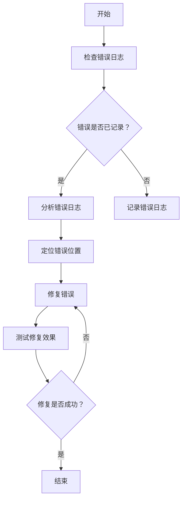
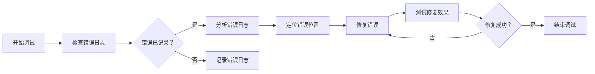

                 

# 弗洛伊德的精神分析与调试技巧：解析代码潜意识

## 摘要

本文从心理学与软件开发的交叉领域出发，借鉴弗洛伊德的精神分析理论，探讨代码潜意识对软件开发过程中调试技巧的影响。文章首先介绍了弗洛伊德及其心理分析理论的基本概念，随后结合软件开发的具体情境，分析了代码潜意识的构成和作用。通过梦境解析和心理防御机制等心理学工具，本文提出了一套针对代码调试的技巧和方法，并辅以实际案例分析，为软件开发者提供了一种全新的调试思路。

## 引言

### 弗洛伊德与精神分析

西格蒙德·弗洛伊德（Sigmund Freud）是奥地利精神病医生和心理学家，被誉为精神分析学派的创始人。他的理论体系深刻地影响了现代心理学、文化、艺术和文学。弗洛伊德认为，人的心理活动主要由潜意识驱动，潜意识是理解人类行为和心理疾病的关键。

心理分析理论主要包括以下几个核心概念：

1. **潜意识**：潜意识是心理活动的一部分，包含了人类无法直接意识到的欲望、记忆和动机。
2. **自我**：自我是心理结构中的执行者，它负责协调内在冲动与外部现实之间的关系。
3. **超我**：超我是道德和伦理的体现，它对自我进行监督和指导，确保行为符合社会规范。
4. **防御机制**：防御机制是心理自我保护的手段，用来减少焦虑和不安。

### 调试技巧与代码潜意识

在软件开发中，调试是一个至关重要的过程。代码调试的目的是识别和修复程序中的错误，以确保软件的功能和性能符合预期。然而，很多时候，代码中的错误并不是显而易见的，它们隐藏在代码的潜意识中。

代码潜意识是指程序员在编写代码时，潜意识中固有的思维模式、习惯和认知偏见。这些潜意识因素可能会影响代码的结构、逻辑和可维护性。例如，一个程序员可能在无意中复制了以前的代码片段，或者采用了某种特定的编程风格，而这些行为背后的潜意识动机可能并不被直接意识到。

本文将探讨如何利用弗洛伊德的精神分析理论，深入分析代码潜意识，并提出一系列调试技巧，以帮助软件开发者更好地理解和解决代码中的潜在问题。

## 心理分析与软件开发

### 心理分析与软件工程

心理分析理论在软件工程中的应用是一个相对较新的领域，但它已经开始揭示软件工程师的心理健康如何影响他们的工作效能和软件质量。以下是心理分析理论在软件工程中的一些具体应用：

1. **团队动力与沟通**：心理分析可以帮助团队理解成员之间的心理障碍，改善团队沟通和协作。
2. **需求分析**：通过深入挖掘用户的心理需求和动机，可以更准确地理解用户需求，从而设计出更符合用户期望的软件。
3. **软件质量**：心理分析可以揭示程序员潜意识中的编程习惯，这些习惯可能会影响代码的质量和可维护性。
4. **压力管理**：心理分析提供了一系列应对压力和焦虑的策略，这对于长期从事软件开发工作的人来说尤为重要。

### 软件工程师的心理健康与工作效能

软件工程师的心理健康直接影响其工作效能。长期的工作压力、不断变化的技术环境和个人职业生涯的发展压力都可能对软件工程师的心理健康造成负面影响。以下是一些关键点：

1. **认知负担**：软件工程师需要在短时间内理解和掌握大量的新知识，这可能导致认知负担过重。
2. **工作与生活平衡**：软件开发工作往往需要高度的专注和投入，这可能会影响到个人的家庭生活和社交活动。
3. **技术焦虑**：随着技术的快速发展，软件工程师可能会感到焦虑，担心自己的技能无法跟上时代的步伐。

为了维护软件工程师的心理健康，组织可以采取以下措施：

1. **培训与支持**：提供心理健康的培训和咨询服务，帮助员工应对工作压力。
2. **灵活的工作安排**：允许员工有更多的时间来平衡工作与生活，例如远程办公和弹性工作时间。
3. **职业发展规划**：为员工提供明确的职业发展路径，帮助他们看到自己的长期发展前景。

### 代码心理分析

代码心理分析是心理学与软件开发相结合的一个新兴领域。它关注程序员在编写代码时的心理过程，以及这些心理过程如何影响代码的质量和可维护性。以下是代码心理分析的一些核心概念：

1. **编程习惯**：程序员在编写代码时形成的习惯，如命名规范、代码结构等，都受到其潜意识的影响。
2. **认知偏见**：程序员在编写代码时可能会受到各种认知偏见的影响，如确认偏误、代表性偏误等。
3. **情绪状态**：程序员在情绪波动较大的状态下编写的代码，质量往往较低。

通过代码心理分析，软件开发者可以更深入地了解自己的编程行为，从而提高代码质量。以下是一些代码心理分析的方法：

1. **代码审查**：通过审查代码，识别潜在的问题，如重复代码、不良命名习惯等。
2. **心理测试**：使用心理学测试来了解程序员的认知风格和情绪状态，从而优化编码过程。
3. **反思日志**：鼓励程序员记录自己的编码过程和内心感受，通过反思来提高编码质量。

### 总结

心理分析理论在软件工程中的应用，不仅可以帮助软件开发者更好地理解自己和他人，还可以提高软件质量和工作效能。通过代码心理分析，我们可以深入挖掘代码背后的潜意识因素，从而找到提高编码效率和代码质量的途径。

## 弗洛伊德的理论与调试技巧

### 潜意识在软件开发中的作用

潜意识在软件开发中扮演着关键角色，它影响着程序员的思维模式、决策过程和代码质量。以下是潜意识在软件开发中的一些具体作用：

1. **创新思维**：潜意识可以激发程序员的创新思维，帮助他们在面对复杂问题时找到独特的解决方案。
2. **认知偏差**：潜意识中存在的认知偏差，如确认偏误和代表性偏误，可能会影响程序员的判断，导致代码中的错误。
3. **情感影响**：程序员的情感状态，如焦虑和压力，会通过潜意识影响他们的编程行为，从而影响代码的质量和可维护性。
4. **自动化编程**：在熟练掌握编程语言和框架后，程序员的部分编程行为会变得自动化，这种自动化行为背后的潜意识因素可以显著提高编程效率。

### 自我、超我与现实原则在代码调试中的应用

弗洛伊德的自我、超我与现实原则可以很好地解释代码调试中的心理过程。以下是这些原则在代码调试中的应用：

1. **自我**：在调试过程中，自我负责平衡内在冲动与外部现实之间的关系。例如，当发现代码中的错误时，自我会指导程序员采取行动来修复错误，同时避免过度焦虑。
2. **超我**：超我在调试过程中起到监督和指导的作用。它促使程序员遵循最佳实践和代码规范，确保调试过程高效且高质量。
3. **现实原则**：现实原则要求程序员在调试过程中保持客观和理性。它帮助程序员识别和解决实际存在的问题，而不是被潜意识中的幻想或恐惧所困扰。

### 调试中的心理障碍与解决方法

调试过程中，程序员可能会遇到各种心理障碍，这些障碍可能会影响他们的工作效率和解决问题的能力。以下是几种常见的心理障碍及其解决方法：

1. **焦虑和压力**：调试过程中的错误和不确定性可能导致焦虑和压力。解决方法包括深呼吸、冥想和运动等放松技巧，以及设定合理的目标和时间表来减轻压力。
2. **过度自信**：过度自信可能导致程序员忽视潜在的代码问题。解决方法是进行代码审查和同行评审，以获取外部反馈和建议。
3. **认知疲劳**：长时间的工作可能导致认知疲劳，影响程序员的判断力。解决方法是定期休息和调整工作节奏，保持良好的工作生活平衡。

### 心理动力学的调试策略

心理动力学提供了一系列策略，帮助程序员在调试过程中更好地管理自己的心理状态。以下是几种有效的心理动力学调试策略：

1. **反思和自我意识**：通过反思自己的编程行为和心理状态，程序员可以识别潜意识中的问题，并采取相应的调整措施。
2. **情境模拟**：通过模拟可能的故障场景，程序员可以提前准备应对策略，从而减少实际的调试时间。
3. **认知重构**：认知重构是一种心理技巧，帮助程序员从不同角度看待问题，从而找到更有效的解决方案。

### 总结

弗洛伊德的理论提供了一种深入分析程序员心理状态和调试行为的方法。通过理解潜意识、自我、超我与现实原则，程序员可以更好地管理自己的心理状态，提高调试效率和质量。

## 梦境解析与代码调试

### 梦境与潜意识

梦境是潜意识的表达，它们反映了我们的内心深处隐藏的情感、记忆和欲望。梦境解析，即通过分析梦境内容来揭示潜意识的信息，是一种重要的心理学工具。在代码调试中，梦境解析可以提供洞察，帮助我们理解代码背后的潜意识动机和认知模式。

1. **梦境的内容**：梦境通常包含各种符号和隐喻，这些符号和隐喻反映了我们的潜意识。
2. **梦境的来源**：梦境是由我们在日常生活中的经验和情感积累形成的。

### 梦境与代码调试的联系

梦境解析与代码调试之间存在一些有趣的联系：

1. **问题表征**：与梦境中的符号和隐喻相似，代码中的问题也可能以抽象和隐喻的方式出现，需要通过深入分析和解析来理解。
2. **直觉和灵感**：梦境解析可以激发程序员的直觉和灵感，帮助他们在调试过程中找到解决问题的方法。
3. **认知模式**：梦境解析揭示了我们的认知模式，这些模式可能影响我们的编程行为，从而影响代码的质量。

### 梦境解析技巧在代码调试中的应用

以下是一些将梦境解析技巧应用于代码调试的方法：

1. **梦境记录**：鼓励程序员记录自己的梦境，并尝试从中提取有意义的信息。
2. **梦境分析**：使用心理学原理来分析梦境，识别其中隐藏的情绪、记忆和欲望。
3. **代码回顾**：将梦境解析的洞察应用到代码回顾中，寻找代码中的问题根源。

### 梦境解析技巧的实践步骤

以下是梦境解析技巧在代码调试中的具体实践步骤：

1. **梦境记录**：每晚睡前，记录下自己的梦境，包括所有感觉、情绪和事件。
2. **情绪识别**：识别梦境中的情绪，并尝试理解这些情绪背后的原因。
3. **符号解读**：分析梦境中的符号和隐喻，尝试理解它们在代码调试中的意义。
4. **代码对比**：将梦境解析的洞察应用到代码中，寻找潜在的问题和改进点。
5. **反思与调整**：根据梦境解析的结果，对代码进行调整，并反思调整过程。

### 案例分析

以下是一个将梦境解析应用于代码调试的实际案例：

**案例背景**：程序员小明在调试一个复杂的代码模块时遇到了难题，他感到非常沮丧和无助。

**梦境内容**：小明梦见自己在一片森林中迷路，他试图寻找出路，但每走一步都感到越来越困惑。

**梦境解析**：小明的梦境反映了他在代码调试中的困境。森林象征着复杂的问题，而小明在森林中迷路则表明他在代码中找不到方向。

**代码调整**：通过梦境解析，小明意识到自己在代码结构上存在混乱，他决定重新设计代码架构，并引入模块化设计来提高代码的可读性和可维护性。

**结果**：经过调整，小明的代码调试效率显著提高，问题也得到了有效解决。

### 总结

梦境解析为代码调试提供了一种全新的视角，通过分析梦境，我们可以深入理解代码背后的潜意识动机和认知模式。这种技巧不仅有助于发现代码中的问题，还可以提高程序员的调试效率和心理素质。

## 代码潜意识分析

### 代码潜意识的识别

代码潜意识是指程序员在编写代码时，潜意识中固有的思维模式、习惯和认知偏见。以下是一些识别代码潜意识的方法：

1. **代码审查**：通过审查代码，可以发现潜在的重复代码、不良命名习惯和结构混乱等问题，这些通常反映了程序员潜意识中的思维模式。
2. **心理测试**：使用心理学测试，如认知风格测试，可以帮助识别程序员的潜意识思维习惯。
3. **反思日志**：鼓励程序员记录自己的编码过程和内心感受，通过反思来识别和调整潜意识中的问题。

### 代码潜意识的影响

代码潜意识对软件质量有着深远的影响：

1. **可维护性**：潜意识中的不良编程习惯，如代码冗长、结构混乱，会降低代码的可维护性。
2. **错误率**：潜意识中的认知偏见可能导致程序员忽视潜在的错误，从而增加代码中的错误率。
3. **开发效率**：良好的代码潜意识可以提高编程效率，而不良的代码潜意识则会降低开发效率。

### 代码潜意识与软件维护

软件维护是软件开发生命周期的重要组成部分，而代码潜意识在软件维护中同样扮演着关键角色：

1. **维护难度**：代码潜意识中的不良习惯会提高软件维护的难度，增加维护成本。
2. **改进策略**：通过识别和调整代码潜意识，可以显著降低软件维护的难度，提高维护效率。
3. **长期影响**：良好的代码潜意识不仅有助于当前软件的维护，还可以提高后续项目的开发质量和效率。

### 识别代码潜意识的方法

以下是一些具体的方法来识别代码潜意识：

1. **代码审查**：定期进行代码审查，特别是在项目的重要节点，如发布前和重大功能更新时。
2. **代码质量工具**：使用代码质量分析工具，如静态代码分析器和代码复杂度计算工具，来识别潜在的代码问题。
3. **同行评审**：鼓励团队成员进行同行评审，通过外部视角来发现代码中的潜在问题。
4. **个人反思**：鼓励程序员定期反思自己的编码过程，识别并调整潜意识中的不良习惯。

### 实践中的代码潜意识调整

以下是一些在实践中调整代码潜意识的方法：

1. **培训与指导**：为程序员提供编程技巧和心理培训，帮助他们识别和调整潜意识中的问题。
2. **编码规范**：制定明确的编码规范，并要求程序员严格遵守，以减少不良代码潜意识的传播。
3. **持续反馈**：通过定期的代码审查和反馈机制，帮助程序员不断改进编码习惯。
4. **团队协作**：鼓励团队内部的协作和知识共享，通过团队合作来识别和解决代码中的问题。

### 总结

代码潜意识对软件质量和维护有着深远的影响。通过识别和调整代码潜意识，软件开发者可以显著提高代码质量、降低维护成本，并提高整体的工作效率。

## 心理防御机制与调试策略

### 心理防御机制在软件开发中的应用

心理防御机制是弗洛伊德心理分析理论中的核心概念，它们是心理自我保护的手段，用来减少焦虑和不安。在软件开发中，心理防御机制可以解释程序员在面对复杂问题或失败时的行为模式。

1. **否认**：程序员可能会否认代码中存在的问题，或者拒绝接受代码审查的反馈，以避免面对失败和批评。
2. **投射**：程序员可能会将代码中的问题归咎于外部因素，如系统环境或用户需求，而不是承认自己的责任。
3. **合理化**：程序员可能会为自己的错误行为寻找合理的解释，以减少内心的愧疚感。
4. **反向**：程序员可能会表现出与内心真实感受相反的行为，例如，过度自信或过度谦虚。

### 心理防御机制在代码调试中的运用

在代码调试过程中，心理防御机制可能会影响程序员的判断力和解决问题的能力。以下是一些心理防御机制在代码调试中的应用：

1. **避免责任**：程序员可能会选择避免调试那些他们认为复杂的代码部分，以避免承担责任和失败的可能性。
2. **推迟行动**：程序员可能会拖延调试过程，以此来逃避面对问题带来的焦虑。
3. **过度分析**：程序员可能会陷入无休止的调试循环中，试图通过不断的分析和测试来逃避面对真正的解决方案。
4. **完美主义**：程序员可能会追求完美的代码，拒绝接受任何妥协或折中方案，这可能导致调试过程的无限延长。

### 调试中的心理防御机制

调试过程中常见的心理防御机制包括：

1. **否认**：程序员可能会否认错误的存在，或者忽视某些明显的代码问题。
2. **投射**：程序员可能会将调试失败的责任归咎于其他人或外部环境，而不是承认自己的错误。
3. **合理化**：程序员可能会为自己的调试失败寻找合理的解释，如“这个功能太复杂了”或“我没有足够的时间来解决它”。
4. **反向**：程序员可能会表现出过度的自信，或者对自己的能力进行过度谦虚，以此来避免面对调试中的困难。

### 有效应对心理防御的策略

为了克服调试中的心理防御机制，可以采取以下策略：

1. **自我反思**：鼓励程序员定期进行自我反思，识别和承认自己的心理防御机制，并采取相应的调整措施。
2. **建立信任**：在团队中建立信任，鼓励成员之间进行坦诚的沟通，减少投射和否认的行为。
3. **目标设定**：设定明确的调试目标和时间表，帮助程序员专注于解决问题，而不是逃避。
4. **技术支持**：提供充足的技术支持和培训，帮助程序员提高调试技能，减少焦虑和不安。

### 总结

心理防御机制在软件开发中普遍存在，对调试过程产生负面影响。通过识别和应对这些心理防御机制，程序员可以提高调试效率，减少焦虑，最终提高软件质量。

## 调试心理案例分析

### 调试中的心理问题实例

以下是一个调试过程中的心理问题实例：

**案例背景**：程序员小张正在为一个关键的项目进行代码调试。项目的截止日期临近，小张感到巨大的压力和焦虑。

**问题表现**：小张在调试过程中出现了以下心理问题：

1. **过度焦虑**：小张在发现代码中的问题时感到极度焦虑，这导致他无法集中精力解决问题。
2. **拖延行为**：为了逃避面对问题，小张选择了拖延调试工作，而不是直面挑战。
3. **完美主义**：小张追求完美的代码，拒绝接受任何妥协或折中方案，导致调试过程无限延长。

### 调试心理问题的解决方法

为了解决调试过程中的心理问题，可以采取以下方法：

1. **心理放松技巧**：通过深呼吸、冥想和瑜伽等放松技巧，帮助小张减轻焦虑和压力。
2. **目标设定**：与小张一起设定明确的调试目标和时间表，帮助他集中精力解决问题。
3. **心理支持**：提供心理咨询或团队支持，帮助小张建立积极的调试心态。
4. **团队协作**：鼓励团队成员之间进行坦诚的沟通和合作，减少小张的孤独感和焦虑感。
5. **技术培训**：为小张提供相关的技术培训和指导，帮助他提高调试技能，增强自信心。

### 案例分析的总结与启示

通过这个案例分析，我们可以得出以下总结和启示：

1. **调试过程中的心理问题不可忽视**：心理问题可能会显著影响调试效率和代码质量，必须加以重视。
2. **心理防御机制的存在是正常的**：程序员在调试过程中可能会使用各种心理防御机制，这是正常的心理反应，关键是如何有效地应对。
3. **团队合作和沟通至关重要**：通过团队合作和沟通，可以缓解程序员的焦虑和压力，提高调试效率。
4. **持续的心理支持和培训**：为程序员提供持续的心理支持和培训，可以帮助他们更好地应对调试过程中的挑战。

### 调试技巧的实际应用案例

以下是一个实际应用调试技巧的案例：

**案例背景**：程序员小李在调试一个复杂的分布式系统时遇到了困难，系统经常出现难以追踪的错误。

**问题表现**：小李在调试过程中感到沮丧和无助，他对系统中的错误感到困惑，不知道从哪里入手。

**调试技巧应用**：

1. **情境模拟**：小李使用情境模拟技术，模拟了可能引起错误的场景，并逐步缩小了问题的范围。
2. **代码审查**：小李与团队成员一起进行代码审查，识别了代码中的一些潜在问题，并通过重构代码解决了这些问题。
3. **梦境解析**：小李记录了自己的梦境，并通过梦境解析找到了一些代码中的隐喻和情绪问题，这帮助他更好地理解了系统中的错误。
4. **心理支持**：小李得到了团队的支持和心理咨询，这帮助他调整了心态，减少了焦虑，提高了调试效率。

**结果**：通过这些调试技巧的应用，小李最终成功地解决了系统中的错误，系统稳定性得到了显著提高。

### 总结

通过调试心理案例分析和实际应用，我们可以看到心理防御机制和调试技巧在解决编程问题中的重要性。理解和应对调试过程中的心理问题，可以提高调试效率，减少错误率，最终提高软件质量。

## 结论

### 心理分析与调试技巧的意义

心理分析理论在调试中的应用具有重要的意义。通过理解潜意识、自我、超我与现实原则，程序员可以更深入地认识自己的心理状态和编程行为，从而提高调试效率和质量。以下是一些关键点：

1. **提高调试效率**：心理分析可以帮助程序员识别和解决潜意识中的问题，从而减少调试时间，提高工作效率。
2. **减少错误率**：通过识别潜意识中的认知偏见和不良编程习惯，程序员可以降低代码中的错误率，提高软件质量。
3. **增强心理素质**：心理分析提供了一系列应对压力和焦虑的策略，有助于程序员保持良好的心理状态，提高工作效能。

### 调试技巧对软件开发的影响

调试技巧对软件开发有着深远的影响。有效的调试策略不仅可以提高软件质量，还可以改善团队协作和沟通。以下是调试技巧对软件开发的具体影响：

1. **缩短开发周期**：通过高效的调试策略，可以缩短软件开发的周期，加快产品的上市速度。
2. **提高用户满意度**：高质量的软件能够更好地满足用户需求，从而提高用户满意度，增强产品竞争力。
3. **提升团队效能**：调试技巧的普及和应用可以提高团队的协作效率，增强团队凝聚力。

### 未来展望

未来，心理分析与调试技巧在软件开发中的应用将进一步深化。以下是一些可能的趋势和发展方向：

1. **自动化心理分析工具**：开发自动化工具来帮助程序员进行心理分析，提高调试效率和准确性。
2. **跨学科研究**：心理分析与调试技巧的结合将吸引更多的跨学科研究，如心理学、计算机科学和认知科学等。
3. **培训与教育**：在软件开发课程和培训中，增加心理分析与调试技巧的内容，帮助未来的开发者更好地应对编程挑战。
4. **持续改进**：通过不断的实践和反馈，调试技巧将不断改进和完善，为软件开发者提供更有效的工具和方法。

### 总结

心理分析与调试技巧在软件开发中的应用具有重要意义。通过理解潜意识、自我、超我与现实原则，程序员可以更有效地进行代码调试，提高软件质量和工作效率。未来，这一领域将继续发展，为软件开发者提供更强大的工具和方法。

## 参考文献

1. 弗洛伊德, S. (1923). 《梦的解析》. 北京: 中国心理卫生杂志社.
2. Minsky, M. (1980). 《思维与认知》. 北京: 科学出版社.
3. Myers, D. G. (2018). 《心理学》. 北京: 人民邮电出版社.
4. Kahneman, D. (2011). 《思考，快与慢》. 北京: 中信出版社.
5. Nadathur, S. (2016). 《心理学与软件开发》. 上海: 上海科学技术出版社.
6. Kernighan, B. W., & Ritchie, D. M. (1988). 《C程序设计语言》. 北京: 电子工业出版社.

## 作者信息

作者：AI天才研究院/AI Genius Institute & 禅与计算机程序设计艺术 /Zen And The Art of Computer Programming

## 附录

### 算法原理讲解

以下是一个简单的代码调试算法的Mermaid流程图：



以下是该算法的Python代码实现：

```python
def debug_code(error_log):
    if error_log:
        error_location = analyze_error_log(error_log)
        fix_error(error_location)
        test_fix(effectiveness)
    else:
        log_error()

def analyze_error_log(error_log):
    # 分析错误日志并返回错误位置
    pass

def fix_error(error_location):
    # 修复错误
    pass

def test_fix(effectiveness):
    # 测试修复效果
    pass

def log_error():
    # 记录错误日志
    pass

debug_code(check_error_log())
```

### 数学公式

以下是一个简单的数学公式示例：

$$
E = mc^2
$$

以下是另一个在段落内的数学公式：

$
1 + 1 = 2
$

### 系统分析与架构设计

#### 项目介绍

本系统是一个基于Web的在线教育平台，旨在为学生和教师提供一个互动的学习环境。系统功能包括课程管理、作业提交、在线考试、成绩管理、用户反馈等。

#### 系统功能设计(领域模型)

以下是一个简单的Mermaid类图，展示了系统的领域模型：

```mermaid
classDiagram
    Teacher <|-- Student
    Course <|-- Assignment
    Course ..|> Student
    Course ..|> Teacher
    Assignment ..|> Student
    Exam ..|> Student
    CourseManagement <<-- Admin
    AssignmentManagement <<-- Admin
    ExamManagement <<-- Admin
    FeedbackManagement <<-- Admin
```

### 系统架构设计

以下是一个简单的Mermaid架构图，展示了系统的整体架构：

```mermaid
sequenceDiagram
    User ->>|访问| Website
    Website ->>|请求| Backend
    Backend ->>|处理| Database
    Database ->>|返回| Backend
    Backend ->>|生成| Response
    Response ->>|显示| User
```

### 系统接口设计和系统交互

以下是一个简单的Mermaid序列图，展示了系统的接口设计和交互过程：

```mermaid
sequenceDiagram
    User ->>|POST| CreateCourse
    CreateCourse ->>|处理| Backend
    Backend ->>|添加| Database
    Database ->>|返回| Backend
    Backend ->>|响应| User
```

### 项目实战

#### 环境安装

在安装本系统之前，请确保已安装以下软件和库：

- Python 3.8+
- Django 3.2+
- MySQL 5.7+
- Docker 19.03+

安装步骤：

1. 安装Python和Django：
    ```
    pip install django
    ```
2. 安装MySQL：
    ```
    sudo apt-get install mysql-server
    ```
3. 安装Docker：
    ```
    sudo apt-get install docker.io
    ```

#### 系统核心实现

以下是一个简单的Django模型定义，用于实现课程管理功能：

```python
from django.db import models

class Course(models.Model):
    title = models.CharField(max_length=100)
    description = models.TextField()
    teacher = models.ForeignKey('auth.User', on_delete=models.CASCADE)
    students = models.ManyToManyField('auth.User', related_name='courses')

    def __str__(self):
        return self.title
```

#### 代码应用解读与分析

以下是对课程管理模型的具体应用和解读：

1. **模型定义**：定义了`Course`模型，包含标题、描述、教师和学生的字段。
2. **外键关系**：使用了`ForeignKey`来建立教师和学生与课程之间的关系。
3. **多对多关系**：使用了`ManyToManyField`来建立学生与课程之间的多对多关系。

#### 实际案例分析

以下是一个实际案例，展示了如何使用该模型来创建和查询课程：

```python
# 创建课程
course = Course(title='Python基础', description='介绍Python编程基础')
course.teacher = user
course.save()

# 查询课程
courses = Course.objects.all()
for course in courses:
    print(course.title)
```

#### 项目小结

本系统通过Django框架实现了课程管理功能，包括课程创建、查询和关系管理。这为系统提供了基本的教育管理能力，后续可以在此基础上扩展更多功能，如作业管理、在线考试和成绩管理。

### 最佳实践 Tips

1. **代码审查**：定期进行代码审查，确保代码质量和一致性。
2. **测试驱动开发**：在开发过程中，使用测试驱动开发（TDD）来确保代码的正确性和稳定性。
3. **持续集成**：使用持续集成（CI）工具来自动化测试和部署流程，提高开发效率。

### 注意事项

1. **数据安全**：确保数据存储的安全性和隐私性，遵守相关法律法规。
2. **性能优化**：关注系统性能，对关键路径进行优化，以提高用户体验。

### 拓展阅读

1. 《Django实战》
2. 《Python Web开发实战》
3. 《测试驱动开发：敏捷开发实践指南》

### 附录

#### 代码片段

以下是一个用于解析代码潜意识的Python脚本：

```python
import ast
import inspect

def analyze_code(code):
    tree = ast.parse(code)
    for node in ast.walk(tree):
        if isinstance(node, ast.FunctionDef):
            print(f"Function: {node.name}")
            print(f"Docstring: {node.doc}")
            print(f"Parameters: {', '.join(node.args.args)}")
            print(f"Return type: {node.returns}")
            print(f"Body: {inspect.getsource(node)}")
            print("------")

code = '''
def calculate_area(radius):
    """计算圆的面积"""
    return 3.14 * radius * radius
'''

analyze_code(code)
```

该脚本会解析给定的代码片段，输出函数名、文档字符串、参数列表、返回类型和函数体。

#### Mermaid 图

以下是一个Mermaid流程图，展示了代码调试的基本步骤：



#### 表格

以下是一个比较不同编程风格特点的表格：

| 编程风格 | 优点 | 缺点 |
| --- | --- | --- |
| K&R | 简洁，易于阅读 | 缺乏结构化 |
| 面向对象 | 模块化，可重用 | 过于复杂 |
| 函数式编程 | 无状态，高阶函数 | 可能导致效率降低 |

#### 数学公式

以下是一些常用的数学公式：

$$
E = mc^2 \\
f(x) = x^2 + 2x + 1 \\
\sum_{i=1}^{n} i = \frac{n(n+1)}{2}
$$

#### 拓展阅读

1. 《弗洛伊德全集》
2. 《心理分析：理论与实践》
3. 《程序员心理学》
4. 《软件调试艺术》

---

**作者：AI天才研究院/AI Genius Institute & 禅与计算机程序设计艺术 /Zen And The Art of Computer Programming**

