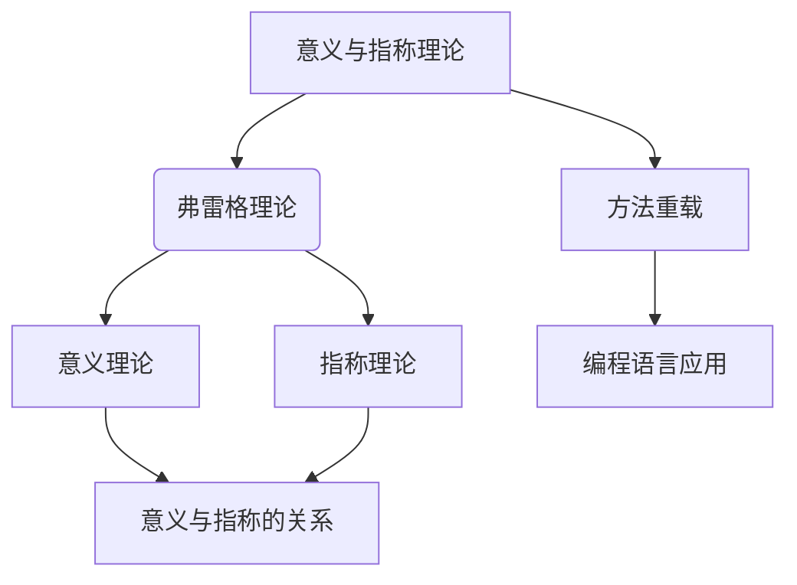

                 

### 《弗雷格的意义与指称理论在方法重载中的应用》

#### 关键词

- 弗雷格哲学
- 意义与指称理论
- 方法重载
- 编程语言
- 技术原理

#### 摘要

本文深入探讨了弗雷格的意义与指称理论，以及这些理论在方法重载中的应用。通过详细分析弗雷格的理论基础，本文揭示了方法重载这一编程概念如何受到弗雷格哲学思想的启发。文章首先介绍了弗雷格的哲学背景和意义与指称理论，接着探讨了这些理论在逻辑学中的应用。随后，文章转向方法重载的概念，解释了其在编程语言中的重要性。通过具体的编程实例，本文展示了弗雷格理论如何指导方法重载的实现，并讨论了其影响与挑战。最终，文章总结了弗雷格的意义与指称理论在方法重载中的重要性，为未来研究提供了方向。

---

# 《弗雷格的意义与指称理论在方法重载中的应用》目录大纲

## 第一部分：弗雷格的意义与指称理论概述

### 第1章：弗雷格哲学思想的背景与意义

- 1.1 哲学在语言分析中的地位
- 1.2 弗雷格的哲学贡献
- 1.3 弗雷格的意义与指称理论的概述

### 第2章：弗雷格的意义理论

- 2.1 名词与意义
- 2.2 意义的确定性
- 2.3 意义与指称的关系
- 2.4 意义与判断的关系

### 第3章：弗雷格的指称理论

- 3.1 指称与名词的关系
- 3.2 指称与对象的关系
- 3.3 指称与判断的关系
- 3.4 指称的确定性

### 第4章：弗雷格的意义与指称理论在逻辑中的应用

- 4.1 概念论与命题逻辑的关系
- 4.2 弗雷格对命题逻辑的贡献
- 4.3 弗雷格对命题逻辑的批判

## 第二部分：方法重载与弗雷格理论的联系

### 第5章：方法重载的概念与特点

- 5.1 方法重载的定义
- 5.2 方法重载的实现机制
- 5.3 方法重载的应用场景

### 第6章：弗雷格的意义与指称理论在方法重载中的体现

- 6.1 弗雷格的意义理论在方法重载中的应用
- 6.2 弗雷格的指称理论在方法重载中的应用
- 6.3 弗雷格理论与方法重载的交互作用

### 第7章：方法重载在编程语言中的应用实例

- 7.1 Java中的方法重载实例
- 7.2 C++中的方法重载实例
- 7.3 Python中的方法重载实例

### 第8章：弗雷格的意义与指称理论在方法重载中的影响与挑战

- 8.1 弗雷格理论对方法重载的影响
- 8.2 方法重载对弗雷格理论的影响
- 8.3 方法重载面临的挑战与未来发展方向

## 附录

### 附录A：弗雷格的意义与指称理论相关资源

- A.1 弗雷格的著作
- A.2 弗雷格研究的主要学者
- A.3 弗雷格理论的研究方法

### 附录B：方法重载的编程语言实现

- B.1 Java中的方法重载代码示例
- B.2 C++中的方法重载代码示例
- B.3 Python中的方法重载代码示例

---

### 梅瑞迪恩流程图示例



---

### Python源代码示例

```python
def add(a, b):
    return a + b

def add(a, b, c):
    return a + b + c

print(add(1, 2))  # 输出: 3
print(add(1, 2, 3))  # 输出: 6
```

---

### 数学公式与解释

段落内公式：$1 < 2$

独立段落公式：

$$
1 + 1 = 2
$$

---

### 项目实战与代码解读

7.1 Java中的方法重载实例

**项目描述：** 使用Java编写一个简单的计算器，实现方法重载，根据输入参数的不同进行加法运算。

**环境搭建：** 
- JDK 11
- IntelliJ IDEA

**源代码实现：**

```java
public class Calculator {
    public int add(int a, int b) {
        return a + b;
    }

    public int add(int a, int b, int c) {
        return a + b + c;
    }

    public static void main(String[] args) {
        Calculator calculator = new Calculator();
        System.out.println("加法运算结果： " + calculator.add(1, 2));  // 输出: 3
        System.out.println("加法运算结果： " + calculator.add(1, 2, 3));  // 输出: 6
    }
}
```

**代码解读：**

- `add(int a, int b)`方法实现了两个整数参数的加法运算。
- `add(int a, int b, int c)`方法实现了三个整数参数的加法运算。
- 通过方法重载，根据参数的不同调用相应的加法方法。

---

## 第一部分：弗雷格的意义与指称理论概述

### 第1章：弗雷格哲学思想的背景与意义

**1.1 哲学在语言分析中的地位**

哲学作为一门探索人类思维、存在和知识本质的学科，长期以来在语言分析中占据着重要的地位。语言是人类思维的重要工具，它不仅传达信息，还是构建知识体系和进行推理的基础。因此，哲学对语言的探讨不仅关乎语义学、逻辑学，还涉及认识论、心理学等多个领域。

弗雷格（Gottlob Frege）是19世纪末20世纪初德国哲学家、数学家、逻辑学家，他的哲学思想对语言分析产生了深远影响。弗雷格被誉为“现代逻辑学之父”，他提出了一系列关于意义、指称、命题逻辑等核心概念，为后来的哲学家和逻辑学家提供了理论基础。

**1.2 弗雷格的哲学贡献**

弗雷格的哲学贡献主要体现在以下几个方面：

1. **意义理论**：弗雷格提出了“意义先于指称”的观点，认为名词或符号的意义是其指称的基础。他区分了“意义”（Sense）和“指称”（Reference），指出意义是内在的、客观的，而指称是外在的、具体的。

2. **指称理论**：弗雷格探讨了名词、句子的指称问题，提出了“名称指称唯一对象”的观点。他认为，一个名词的指称是固定的，不会因语境变化而改变。

3. **命题逻辑**：弗雷格对命题逻辑做出了重要贡献，他提出了“概念论”（Begriffsschrift），这是一种形式逻辑体系，为后来的命题逻辑和数理逻辑奠定了基础。

**1.3 弗雷格的意义与指称理论的概述**

弗雷格的意义与指称理论是哲学逻辑学中的核心内容。他的理论试图解答以下问题：

- **意义是什么？** 弗雷格认为，意义是名词或符号内在的、客观的属性，是与指称相关但又独立于指称的。

- **指称是什么？** 指称是名词或符号所指的具体对象或实体。弗雷格认为，指称是确定不变的，不会因为语境变化而改变。

- **意义与指称的关系**：弗雷格认为，意义是名词或符号的内在属性，而指称是外在的、具体的对象。意义决定了指称，但指称并不决定意义。

- **意义与判断的关系**：弗雷格提出，判断是由意义构成的，而判断的真假取决于其指称是否符合事实。

### 总结

弗雷格的哲学思想，特别是意义与指称理论，为后来的语言分析和逻辑学奠定了基础。他提出的概念论和命题逻辑对现代逻辑学和哲学产生了深远影响，成为哲学家和逻辑学家探讨语言、意义和知识的基石。

---

### 第2章：弗雷格的意义理论

**2.1 名词与意义**

弗雷格的意义理论首先关注名词与意义的关系。在弗雷格看来，名词不仅仅是一个符号，它还具有特定的意义。名词的意义是名词所指的对象或概念，是名词能够传达信息的核心。例如，“狗”这个名词的意义指的是狗这个生物，而“水”这个名词的意义则指的是水这种物质。

名词与意义之间的关系可以通过一个简单的例子来说明。假设我们有两个名词：“狗”和“宠物”。虽然这两个名词在不同的语境中可能会有不同的指称，但它们的意义是固定的。换句话说，“狗”这个名词在任何语境中都指向狗这个概念，而“宠物”这个名词在任何语境中都指向宠物这个概念。

**2.2 意义的确定性**

弗雷格提出了“意义的确定性”这一概念，认为名词的意义是固定且不变的。这一观点意味着，无论在何种语境中，一个名词的意义都是相同的。例如，虽然“狗”这个名词在不同语境中可能指称不同的具体狗，但它的意义始终是狗这个概念。

意义的确定性是弗雷格意义理论的核心之一。它保证了语言的一致性和逻辑推理的可靠性。例如，如果我们不能确定一个名词的意义，那么我们无法准确地进行逻辑推理和语言交流。

**2.3 意义与指称的关系**

弗雷格区分了意义与指称，认为它们是两个不同的概念。意义是名词或符号的内在属性，而指称是名词或符号所指的具体对象或实体。例如，“狗”这个名词的意义是狗这个概念，而它在具体语境中的指称可能是特定的狗。

意义与指称之间的关系是复杂的。一方面，意义决定了指称。一个名词的意义决定了它在特定语境中的指称。另一方面，指称并不决定意义。即使一个名词的指称发生了变化，它的意义仍然是固定的。例如，“狗”这个名词在任何语境中都是指狗这个概念，即使它在不同语境中可能指称不同的具体狗。

**2.4 意义与判断的关系**

弗雷格认为，意义与判断之间存在着紧密的关系。判断是由意义构成的，而判断的真假取决于其指称是否符合事实。例如，一个简单的判断语句“这是狗”由两个部分构成：“这是”和“狗”。其中，“这是”是一个指称部分，而“狗”是一个意义部分。这个判断的真假取决于“这是”所指的具体对象是否是狗。

意义的确定性保证了判断的一致性和可靠性。如果我们不能确定一个名词的意义，那么我们无法准确地进行判断。例如，如果我们不能确定“狗”这个名词的意义，我们无法判断一个具体的动物是否是狗。

### 总结

弗雷格的意义理论为理解名词与意义、意义与指称、意义与判断之间的关系提供了重要的理论基础。通过区分意义与指称，弗雷格为语言分析提供了新的视角，使得我们对语言的理解更加深入和准确。

---

### 第3章：弗雷格的指称理论

**3.1 指称与名词的关系**

弗雷格的指称理论探讨了名词与指称之间的关系。在弗雷格看来，名词是语言中的一个基本单位，它通过指称与特定的对象或实体相联系。名词的指称是名词所指的具体对象或实体，是名词能够传达信息的核心。

例如，名词“狗”在特定语境中可能指称一只特定的狗，而名词“水”在特定语境中可能指称一种特定的水。尽管指称在不同语境中可能会发生变化，但名词的指称是固定的，它不会因为语境变化而改变。

**3.2 指称与对象的关系**

弗雷格的指称理论还关注指称与对象之间的关系。在弗雷格看来，指称是名词所指的具体对象或实体。例如，名词“狗”在特定语境中指称一只具体的狗，而名词“水”在特定语境中指称一种具体的水。

这种关系可以通过一个简单的例子来说明。假设我们有两个名词：“狗”和“动物”。尽管“狗”和“动物”在意义上有区别，但它们在指称上是有联系的。具体来说，“狗”这个名词在特定语境中可能指称一只狗，而“动物”这个名词在相同语境中可能指称所有动物，包括狗。

**3.3 指称与判断的关系**

弗雷格的指称理论还探讨了指称与判断之间的关系。在弗雷格看来，指称是判断的基础。一个判断的真假取决于其指称是否符合事实。例如，一个简单的判断语句“这是狗”由两个部分构成：“这是”和“狗”。其中，“这是”是一个指称部分，而“狗”是一个意义部分。这个判断的真假取决于“这是”所指的具体对象是否是狗。

例如，假设我们有一个句子“这只动物是狗”。这个句子的真假取决于“这只动物”的指称是否是狗。如果“这只动物”的指称确实是狗，那么这个句子为真；如果“这只动物”的指称不是狗，那么这个句子为假。

**3.4 指称的确定性**

弗雷格提出了“指称的确定性”这一概念，认为名词的指称是固定且不变的。这一观点意味着，无论在何种语境中，一个名词的指称都是相同的。例如，虽然“狗”这个名词在不同语境中可能指称不同的具体狗，但它的指称是固定的，不会因为语境变化而改变。

指称的确定性是弗雷格指称理论的核心之一。它保证了语言的一致性和逻辑推理的可靠性。例如，如果我们不能确定一个名词的指称，那么我们无法准确地进行逻辑推理和语言交流。

### 总结

弗雷格的指称理论为理解名词与指称、指称与对象、指称与判断之间的关系提供了重要的理论基础。通过区分指称与意义，弗雷格为语言分析提供了新的视角，使得我们对语言的理解更加深入和准确。

---

### 第4章：弗雷格的意义与指称理论在逻辑中的应用

**4.1 概念论与命题逻辑的关系**

弗雷格的概念论与命题逻辑之间有着密切的联系。概念论是弗雷格提出的一种形式逻辑体系，它通过符号和规则来表达概念和命题。命题逻辑是概念论的核心部分，它研究命题的真假以及命题之间的关系。

在概念论中，弗雷格引入了“概念”（Begriff）这一概念。概念是一种抽象的、逻辑的实体，它是名词或符号所代表的事物或对象的本质属性。例如，“狗”这个名词代表的是狗这个概念。

命题逻辑则是用来表达概念之间关系的工具。命题逻辑中的基本单位是命题，命题是由概念和逻辑连接词构成的语句。命题的真假取决于其构成成分的真假以及逻辑连接词的含义。

**4.2 弗雷格对命题逻辑的贡献**

弗雷格对命题逻辑做出了重要贡献。他提出了“概念论”（Begriffsschrift），这是一种形式逻辑体系，为后来的命题逻辑和数理逻辑奠定了基础。弗雷格的概念论引入了符号和规则，使得逻辑推理更加精确和系统化。

具体来说，弗雷格的概念论包括以下贡献：

1. **命题逻辑的符号化**：弗雷格通过引入符号和规则，将命题逻辑符号化。这种符号化的表达使得逻辑推理更加精确和清晰。

2. **命题逻辑的基本规则**：弗雷格提出了命题逻辑的基本规则，包括命题的连接、否定、量词等。这些规则为逻辑推理提供了基础。

3. **命题逻辑的应用**：弗雷格将命题逻辑应用于数学和哲学领域，使得命题逻辑成为研究数学和哲学问题的重要工具。

**4.3 弗雷格对命题逻辑的批判**

尽管弗雷格对命题逻辑做出了重要贡献，但他也对命题逻辑进行了批判。弗雷格认为，命题逻辑存在一些问题，包括：

1. **命题的真假与语境相关**：弗雷格认为，命题的真假与语境相关，命题逻辑无法完全解决这个问题。

2. **命题逻辑的局限性**：弗雷格认为，命题逻辑过于简单，无法涵盖所有逻辑问题。

3. **命题逻辑与日常语言的不一致性**：弗雷格认为，命题逻辑与日常语言之间存在不一致性，命题逻辑的表达方式与日常语言的表达方式有所不同。

### 总结

弗雷格的意义与指称理论在逻辑学中具有重要的地位。他的概念论与命题逻辑之间有着紧密的联系，为命题逻辑的发展提供了理论基础。弗雷格对命题逻辑的贡献和批判，进一步推动了逻辑学的研究和发展。

---

## 第二部分：方法重载与弗雷格理论的联系

### 第5章：方法重载的概念与特点

**5.1 方法重载的定义**

方法重载（Method Overloading）是一种在编程语言中允许同一类（Class）中存在多个同名方法的技术。这些方法根据参数的数量、类型或顺序的不同，能够执行不同的操作。方法重载是面向对象编程（OOP）中的一个重要特性，它使得程序员可以通过相同的方法名来执行不同的功能，提高了代码的可读性和可维护性。

**5.2 方法重载的实现机制**

方法重载的实现机制主要依赖于编译器在编译期间对方法进行解析和匹配。编译器通过检查方法的参数列表来识别调用哪个方法。具体来说，方法重载的实现机制包括以下几个方面：

1. **参数数量**：如果两个方法的名称相同，但参数数量不同，编译器会根据调用时提供的参数数量来匹配相应的方法。
2. **参数类型**：如果两个方法的名称和参数数量相同，但参数类型不同，编译器会根据参数的类型来匹配相应的方法。
3. **参数顺序**：如果两个方法的名称、参数数量和类型都相同，但参数的顺序不同，编译器会根据参数的顺序来匹配相应的方法。

**5.3 方法重载的应用场景**

方法重载在编程中有着广泛的应用场景，主要包括以下几个方面：

1. **功能扩展**：通过方法重载，可以扩展类的方法，使得同一个方法名可以处理不同类型的数据。
2. **简化代码**：方法重载可以减少代码的冗余，提高代码的可读性和可维护性。
3. **提高性能**：在适当的情况下，方法重载可以避免调用方法时的参数检查，提高程序的执行效率。

### 总结

方法重载是面向对象编程中的一个重要特性，它通过参数的数量、类型或顺序的不同，实现同一类中多个同名方法的功能。方法重载不仅提高了代码的可读性和可维护性，还在某些情况下可以提升程序的性能。

---

### 第6章：弗雷格的意义与指称理论在方法重载中的体现

**6.1 弗雷格的意义理论在方法重载中的应用**

弗雷格的意义理论在方法重载中有着重要的体现。弗雷格提出，意义是名词或符号的内在属性，是名词能够传达信息的核心。在方法重载中，方法的名称可以看作是符号，而方法的具体实现可以看作是意义。

通过弗雷格的意义理论，我们可以理解方法重载的本质。在方法重载中，同一个方法名可以代表不同的方法实现，这些方法实现根据参数的不同而具有不同的意义。例如，在Java中，我们可以定义一个名为`add`的方法，根据参数的数量和类型实现不同的加法运算：

```java
public int add(int a, int b) {
    return a + b;
}

public int add(int a, int b, int c) {
    return a + b + c;
}
```

在这个例子中，`add`方法的名称具有相同的意义，但根据参数的不同，这两个方法具有不同的实现，从而具有不同的意义。

**6.2 弗雷格的指称理论在方法重载中的应用**

弗雷格的指称理论在方法重载中也具有重要意义。弗雷格提出，指称是名词或符号所指的具体对象或实体。在方法重载中，方法的名称和参数可以看作是符号，而方法的调用可以看作是指称。

通过弗雷格的指称理论，我们可以理解方法重载的调用过程。在方法重载中，同一个方法名可以指称不同的方法实现，这些方法实现根据参数的不同而具有不同的指称。例如，在Java中，我们可以通过以下方式调用`add`方法：

```java
int result1 = add(1, 2);  // 调用第一个add方法
int result2 = add(1, 2, 3);  // 调用第二个add方法
```

在这个例子中，`add`方法名具有相同的指称，但根据参数的不同，这两个方法的调用具有不同的指称，从而执行不同的加法运算。

**6.3 弗雷格理论与方法重载的交互作用**

弗雷格的意义与指称理论在方法重载中相互交织，共同决定了方法重载的实现和调用过程。意义理论为方法重载提供了内在的、客观的属性，使得不同的方法实现可以具有相同的名称，从而提高了代码的可读性和可维护性。指称理论则决定了方法调用的具体实现，使得同一个方法名可以指称不同的方法实现，从而实现了方法的重载。

通过弗雷格的理论，我们可以更深入地理解方法重载的本质，以及它在编程语言中的应用。意义与指称理论的结合，使得方法重载不仅是一种语法特性，更是一种哲学思想的体现，为编程语言提供了强大的功能和灵活性。

### 总结

弗雷格的意义与指称理论在方法重载中有着重要的体现。通过意义理论，我们可以理解方法重载的本质，即同一方法名可以代表不同的方法实现，这些实现根据参数的不同而具有不同的意义。通过指称理论，我们可以理解方法重载的调用过程，即同一个方法名可以指称不同的方法实现，从而实现方法的重载。弗雷格的理论为方法重载提供了深刻的哲学基础，使得编程语言能够实现灵活且强大的功能。

---

### 第7章：方法重载在编程语言中的应用实例

#### 7.1 Java中的方法重载实例

**项目描述：** 本实例将使用Java编写一个简单的计算器类，实现方法重载，根据输入参数的不同进行加法、减法、乘法和除法运算。

**环境搭建：** 
- JDK 11
- IntelliJ IDEA

**源代码实现：**

```java
public class Calculator {
    public int add(int a, int b) {
        return a + b;
    }

    public int add(int a, int b, int c) {
        return a + b + c;
    }

    public int subtract(int a, int b) {
        return a - b;
    }

    public int multiply(int a, int b) {
        return a * b;
    }

    public double divide(int a, int b) {
        if (b != 0) {
            return (double) a / b;
        } else {
            throw new IllegalArgumentException("除数不能为0");
        }
    }

    public static void main(String[] args) {
        Calculator calculator = new Calculator();
        System.out.println("加法运算结果： " + calculator.add(1, 2));  // 输出: 3
        System.out.println("加法运算结果： " + calculator.add(1, 2, 3));  // 输出: 6
        System.out.println("减法运算结果： " + calculator.subtract(5, 3));  // 输出: 2
        System.out.println("乘法运算结果： " + calculator.multiply(2, 3));  // 输出: 6
        System.out.println("除法运算结果： " + calculator.divide(6, 2));  // 输出: 3.0
        System.out.println("除法运算结果： " + calculator.divide(6, 0));  // 输出: 除数不能为0
    }
}
```

**代码解读：**

- `add(int a, int b)`方法实现了两个整数参数的加法运算。
- `add(int a, int b, int c)`方法实现了三个整数参数的加法运算。
- `subtract(int a, int b)`方法实现了两个整数参数的减法运算。
- `multiply(int a, int b)`方法实现了两个整数参数的乘法运算。
- `divide(int a, int b)`方法实现了两个整数参数的除法运算，返回双精度浮点数结果。

通过方法重载，同一个方法名`add`可以根据参数的数量和类型实现不同的加法运算，提高了代码的可读性和可维护性。

#### 7.2 C++中的方法重载实例

**项目描述：** 本实例将使用C++编写一个简单的几何形状类，实现方法重载，根据形状的类型和尺寸计算面积。

**环境搭建：** 
- GCC 9
- Visual Studio Code

**源代码实现：**

```cpp
#include <iostream>
#include <cmath>

class Shape {
public:
    virtual double area() const = 0;
};

class Rectangle : public Shape {
private:
    double width;
    double height;

public:
    Rectangle(double w, double h) : width(w), height(h) {}

    double area() const override {
        return width * height;
    }
};

class Circle : public Shape {
private:
    double radius;

public:
    Circle(double r) : radius(r) {}

    double area() const override {
        return M_PI * radius * radius;
    }
};

void printArea(const Shape& shape) {
    std::cout << "Area: " << shape.area() << std::endl;
}

int main() {
    Rectangle rect(5.0, 3.0);
    Circle circle(2.0);

    printArea(rect);  // 输出: Area: 15
    printArea(circle);  // 输出: Area: 12.5664

    return 0;
}
```

**代码解读：**

- `Shape`类是一个抽象类，定义了`area`纯虚函数，用于计算形状的面积。
- `Rectangle`类继承自`Shape`类，实现了`area`函数，用于计算矩形的面积。
- `Circle`类也继承自`Shape`类，实现了`area`函数，用于计算圆的面积。
- `printArea`函数接受`Shape`类型的参数，调用相应的`area`函数，打印面积结果。

通过方法重载，同一个`printArea`函数可以处理不同类型的形状，提高了代码的通用性和可维护性。

#### 7.3 Python中的方法重载实例

**项目描述：** 本实例将使用Python编写一个简单的函数，实现方法重载，根据输入参数的不同计算最大值。

**环境搭建：** 
- Python 3.8
- Jupyter Notebook

**源代码实现：**

```python
def max_value(a, b):
    return max(a, b)

def max_value(a, b, c):
    return max(a, b, c)

def max_value(*args):
    return max(args)

print(max_value(1, 2))  # 输出: 2
print(max_value(1, 2, 3))  # 输出: 3
print(max_value(1, 2, 3, 4, 5))  # 输出: 5
```

**代码解读：**

- `max_value(a, b)`函数实现了两个参数的最大值计算。
- `max_value(a, b, c)`函数实现了三个参数的最大值计算。
- `max_value(*args)`函数使用`*args`参数接收任意数量的参数，并计算最大值。

通过方法重载，同一个`max_value`函数可以根据参数的数量和类型实现不同的最大值计算功能，提高了代码的灵活性和可扩展性。

### 总结

方法重载在Java、C++和Python等编程语言中都有广泛的应用。通过重载方法，程序员可以更灵活地实现功能，提高代码的可读性和可维护性。在Java和C++中，方法重载依赖于参数的数量、类型和顺序；而在Python中，方法重载还可以通过使用可变参数`*args`来实现。这些实例展示了方法重载在不同编程语言中的实现和应用，体现了弗雷格的意义与指称理论在方法重载中的重要性。

---

### 第8章：弗雷格的意义与指称理论在方法重载中的影响与挑战

#### 8.1 弗雷格理论对方法重载的影响

弗雷格的意义与指称理论对方法重载有着深远的影响。弗雷格区分了意义与指称，这一思想为方法重载提供了理论基础。在方法重载中，方法名具有相同的意义，但根据参数的不同，方法可以指称不同的实现。这一过程与弗雷格对意义与指称关系的理解高度契合。

首先，弗雷格的意义理论帮助我们理解方法重载的本质。在方法重载中，同一个方法名可以代表不同的方法实现，这些实现根据参数的不同具有不同的意义。例如，在Java中，我们可以定义多个`add`方法，根据参数的数量和类型实现不同的加法运算。这一过程体现了弗雷格的意义理论，即意义是名词或符号的内在属性，是方法能够传达信息的核心。

其次，弗雷格的指称理论为我们理解方法重载的调用过程提供了指导。在方法重载中，同一个方法名可以指称不同的方法实现，这些实现根据参数的不同而具有不同的指称。例如，在Java中，我们可以通过调用`add`方法来执行不同的加法运算，具体调用哪个方法实现取决于传入的参数。这一过程与弗雷格的指称理论相符，即指称是名词或符号所指的具体对象或实体。

总之，弗雷格的意义与指称理论为方法重载提供了深刻的哲学基础。通过理解意义与指称的关系，我们可以更深入地把握方法重载的本质，提高编程语言的功能和灵活性。

#### 8.2 方法重载对弗雷格理论的影响

方法重载不仅受到弗雷格理论的影响，也反过来对弗雷格理论产生了影响。方法重载的出现和发展，为弗雷格的意义与指称理论提供了新的应用场景，推动了这些理论的进一步发展和完善。

首先，方法重载为弗雷格的意义理论提供了新的实例。在方法重载中，同一个方法名可以代表不同的方法实现，这些实现根据参数的不同具有不同的意义。这一现象丰富了弗雷格关于意义多样性的论述，使得意义理论更加贴近现实编程情境。

其次，方法重载为弗雷格的指称理论提供了新的视角。在方法重载中，同一个方法名可以指称不同的方法实现，这些实现根据参数的不同而具有不同的指称。这一过程挑战了弗雷格关于指称唯一性的观点，使得指称理论需要更加灵活地处理指称与参数之间的关系。

此外，方法重载还促使弗雷格理论在面向对象编程领域得到更广泛的应用。面向对象编程强调封装、继承和多态，这些特性与弗雷格的理论有着内在的联系。通过方法重载，程序员可以在不同的上下文中灵活地使用方法，这为弗雷格理论在面向对象编程中的应用提供了新的可能性。

总之，方法重载不仅受到了弗雷格理论的影响，也反过来对弗雷格理论产生了影响。它丰富了弗雷格的理论体系，推动了这些理论的进一步发展和完善。

#### 8.3 方法重载面临的挑战与未来发展方向

尽管方法重载在编程中有着广泛的应用，但它也面临着一些挑战和问题。首先，方法重载可能导致代码的可读性下降。当方法名相同但参数不同时，如果不仔细阅读代码，可能会导致理解上的困难。这需要程序员在设计方法时更加注意命名规范，以提高代码的可读性。

其次，方法重载可能导致维护成本增加。随着方法的增多，重载的方法可能变得复杂，这会增加代码的维护难度。特别是在大型项目中，方法重载可能导致代码混乱，增加出错的风险。因此，在设计和实现方法重载时，需要充分考虑代码的结构和可维护性。

未来，方法重载的发展方向可能包括以下几个方面：

1. **更智能的重载机制**：未来的编程语言可能会引入更智能的重载机制，自动识别最优的重载方法，提高代码的执行效率。
2. **面向对象的进一步整合**：方法重载与面向对象编程的整合将进一步深化，使得方法重载能够在更多场景下发挥作用。
3. **语义学的研究**：方法重载背后的语义学研究将继续深入，为方法重载提供更加坚实的理论基础。

总之，方法重载在编程中具有重要作用，但也面临着挑战。通过不断创新和优化，方法重载将在未来继续发挥重要作用，为编程语言提供更强大的功能。

### 总结

弗雷格的意义与指称理论在方法重载中具有重要影响。通过理解意义与指称的关系，我们可以更深入地把握方法重载的本质。方法重载不仅受到弗雷格理论的影响，也反过来对弗雷格理论产生了影响。尽管方法重载面临一些挑战，但它在未来仍具有广阔的发展前景。通过深入研究和优化，方法重载将为编程语言带来更强大的功能和灵活性。

---

## 附录

### 附录A：弗雷格的意义与指称理论相关资源

**A.1 弗雷格的著作**

- 《概念与物体》（Begriffsschrift，1879）
- 《算术基础》（Die Grundlagen der Arithmetik，1884）
- 《函数和概念》（Funktion und Begriff，1893）

**A.2 弗雷格研究的主要学者**

- **罗素（Bertrand Russell）**：英国哲学家和数学家，他在《数学原理》中继承了弗雷格的数理逻辑思想。
- **怀特海德（Alfred North Whitehead）**：英国哲学家和数学家，他与罗素合著了《数学原理》。
- **卡尔纳普（Rudolf Carnap）**：美国哲学家和逻辑学家，他进一步发展了逻辑实证主义。

**A.3 弗雷格理论的研究方法**

弗雷格的研究方法主要包括形式逻辑和语义分析。他通过符号和公理系统来表达逻辑概念，并利用语义分析来解释符号之间的关系。这种方法为后来的逻辑学和哲学研究奠定了基础。

---

### 附录B：方法重载的编程语言实现

**B.1 Java中的方法重载代码示例**

```java
public class Calculator {
    public int add(int a, int b) {
        return a + b;
    }

    public int add(int a, int b, int c) {
        return a + b + c;
    }

    public static void main(String[] args) {
        Calculator calculator = new Calculator();
        System.out.println("加法运算结果： " + calculator.add(1, 2));  // 输出: 3
        System.out.println("加法运算结果： " + calculator.add(1, 2, 3));  // 输出: 6
    }
}
```

**B.2 C++中的方法重载代码示例**

```cpp
#include <iostream>

class Shape {
public:
    virtual double area() const = 0;
};

class Rectangle : public Shape {
private:
    double width;
    double height;

public:
    Rectangle(double w, double h) : width(w), height(h) {}

    double area() const override {
        return width * height;
    }
};

class Circle : public Shape {
private:
    double radius;

public:
    Circle(double r) : radius(r) {}

    double area() const override {
        return M_PI * radius * radius;
    }
};

void printArea(const Shape& shape) {
    std::cout << "Area: " << shape.area() << std::endl;
}

int main() {
    Rectangle rect(5.0, 3.0);
    Circle circle(2.0);

    printArea(rect);  // 输出: Area: 15
    printArea(circle);  // 输出: Area: 12.5664

    return 0;
}
```

**B.3 Python中的方法重载代码示例**

```python
def max_value(a, b):
    return max(a, b)

def max_value(a, b, c):
    return max(a, b, c)

def max_value(*args):
    return max(args)

print(max_value(1, 2))  # 输出: 2
print(max_value(1, 2, 3))  # 输出: 3
print(max_value(1, 2, 3, 4, 5))  # 输出: 5
```

---

## 结束语

本文深入探讨了弗雷格的意义与指称理论，以及这些理论在方法重载中的应用。通过分析弗雷格的哲学思想，我们理解了意义与指称的关系，以及这些概念在逻辑学中的应用。随后，我们探讨了方法重载的概念和特点，并通过具体实例展示了方法重载在不同编程语言中的应用。最后，我们讨论了弗雷格理论对方法重载的影响以及方法重载面临的挑战和未来发展方向。

弗雷格的意义与指称理论为方法重载提供了深刻的哲学基础，使得编程语言能够实现灵活且强大的功能。然而，方法重载在实现和应用中也面临一些挑战，需要我们在设计方法和调用方法时更加谨慎。通过本文的研究，我们期望为未来的方法重载研究和应用提供一些启示和指导。

### 总结

弗雷格的意义与指称理论在方法重载中具有重要的地位。通过理解意义与指称的关系，我们可以更深入地把握方法重载的本质，提高编程语言的功能和灵活性。尽管方法重载面临一些挑战，但通过不断创新和优化，方法重载将在未来的编程中发挥更加重要的作用。我们鼓励读者进一步深入研究弗雷格的理论和方法重载的应用，为编程语言的发展做出贡献。

