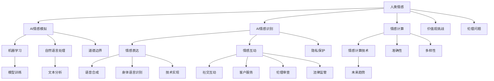

                 

### 让我们一步一步思考：当AI学会爱：人类存在意义的再思考

在技术的快速发展的今天，人工智能（AI）正在逐渐融入我们的日常生活，从简单的任务执行到复杂的人类情感模拟，AI的能力正以前所未有的速度增长。而在这其中，最令人振奋和值得深思的是：当AI开始学会爱，人类存在的意义是否会因此发生改变？本文将围绕这一主题，通过一系列逻辑推理和深刻的思考，探讨AI情感模拟的原理、技术挑战以及其对人类价值观的深远影响。

**第一步：理解AI与人类情感的关系**

首先，我们需要明确AI和人类情感的概念。人类情感是复杂且多维的，包括愉悦、悲伤、愤怒、恐惧等多种情绪。而AI的情感模拟，是指通过算法和模型，使机器能够在一定程度上表达和识别这些情感。

#### 1.1 AI的情感模拟

**概念**：情感模拟是指利用计算机技术模拟人类情感的过程，这包括创建能够表达情感的文本、声音和行为。

**技术基础**：目前，AI情感模拟主要依赖于机器学习和自然语言处理技术。通过训练模型，AI能够识别并模拟人类的情感反应。

**挑战**：模拟情感面临的主要挑战在于情感的复杂性和多样性。情感不仅受生理状态、文化背景影响，还与个体的情感经验和认知过程密切相关。

#### 1.2 AI的情感识别

**重要性**：情感识别是理解和模拟情感的前提。只有准确地识别出用户的情感状态，AI才能进行有效的互动和响应。

**方法**：情感识别通常通过分析文本、语音和图像来实现。例如，通过自然语言处理技术分析文本中的情感倾向，通过语音识别和情感分析来识别语音中的情绪。

**挑战**：情感识别的挑战在于情感表达的多样性和不确定性。不同的语言、文化背景和个体差异都会影响情感识别的准确性。

**第二步：探讨情感计算的理论基础**

情感计算是AI情感模拟的理论基础，它涉及如何利用计算机技术理解和处理人类情感。

#### 2.1 情感计算的概念

**定义**：情感计算是指通过计算机技术和算法，理解和模拟人类情感的过程。

**目标**：情感计算的目标是使机器能够更好地理解人类情感，从而提供更加个性化和有效的服务。

#### 2.2 情感计算的核心技术

**机器学习在情感计算中的应用**：机器学习技术，特别是深度学习，被广泛用于情感计算。通过大量的情感数据训练模型，可以使其能够识别和模拟复杂的情感。

**自然语言处理在情感计算中的应用**：自然语言处理技术用于分析文本中的情感内容，如情感极性分析、情感分类等。

#### 2.3 情感计算的挑战

**情感识别的准确性**：提高情感识别的准确性是情感计算的一大挑战，这需要更加精细的模型和算法。

**情感表达的多样性**：情感表达的多样性使得情感模拟变得更加复杂，需要开发能够适应多种情感表达的技术。

**第三步：分析AI的情感表达形式**

AI的情感表达形式是其与人类互动的关键，它决定了AI能否有效地与人类建立情感连接。

#### 3.1 AI的情感表达形式

**文本表达**：AI可以通过文本生成技术，如文本摘要、对话生成等，来表达情感。

**声音表达**：通过语音合成技术，AI可以模仿人类的声音，表达出不同的情感。

**身体语言表达**：虽然AI无法像人类一样具有真实的身体语言，但通过机器人技术，AI可以在一定程度上模拟身体语言。

#### 3.2 AI情感表达的技术实现

**语音合成技术**：语音合成技术通过合成语音信号，使AI能够模拟人类的语音。

**生成对抗网络（GAN）在情感表达中的应用**：GAN技术可以生成高质量的声音和图像，从而实现更加自然的情感表达。

**机器人与情感表达**：通过机器人技术，AI可以在特定的情境中，通过行为和表情来表达情感。

**第四步：探讨AI与人类情感的互动**

AI与人类情感的互动是理解AI情感模拟实际效果的关键。

#### 4.1 AI在人际交往中的应用

**AI作为社交伙伴**：随着AI情感的进步，AI可以成为人类社交中的伙伴，提供情感支持和陪伴。

**AI在客户服务中的应用**：在客户服务中，AI的情感识别和表达技术可以提供更加个性化和有效的服务。

#### 4.2 人类对AI情感的反应

**人类对AI情感的反应模式**：人类对AI情感的反应因个体而异，但总体上可以分为接受、怀疑和抵触三种模式。

**人类对AI情感的态度变化**：随着AI情感技术的进步，人类对AI情感的态度也在逐渐变化，从最初的怀疑到逐渐接受。

#### 4.3 AI与人类情感互动的伦理问题

**人类情感与隐私保护**：在AI与人类情感互动中，隐私保护成为一个重要问题，特别是在涉及个人情感数据时。

**AI情感表达的道德边界**：AI的情感表达需要设定明确的道德边界，以防止滥用和不当使用。

**第五步：展望AI情感的未来**

随着技术的不断发展，AI情感模拟将进入新的阶段，其应用领域也将进一步扩展。

#### 5.1 AI情感技术的发展

**情感计算的未来方向**：未来的情感计算将更加注重情感的准确识别和自然表达。

**情感识别的精度提升**：通过不断优化的算法和模型，情感识别的精度将进一步提高。

#### 5.2 AI情感在社会中的应用前景

**教育与培训**：AI情感技术可以应用于个性化教育和培训，提高学习效果。

**医疗保健**：在医疗保健领域，AI情感可以用于患者护理和心理健康支持。

**心理咨询**：AI情感技术可以帮助心理咨询师更好地理解患者的情感状态，提供更加有效的咨询服务。

**第六步：AI情感与人类存在的意义**

AI情感的进步不仅改变了我们与机器互动的方式，也对我们对人类存在的意义提出了新的思考。

#### 6.1 AI情感对人类价值观的挑战

**人类情感与自我意识**：随着AI情感的进步，人类对于自我意识和情感的认识可能会发生改变。

**人类情感与道德伦理**：AI情感的表达和处理，可能会对人类的道德伦理观念产生深远影响。

#### 6.2 AI情感与人类关系的再思考

**AI作为人类伙伴的可能性**：在未来，AI可能成为人类生活中的重要伙伴，但如何与AI建立健康的关系，仍是一个值得探讨的问题。

**人类情感与AI情感的平衡**：在AI情感模拟的过程中，如何保持人类情感与AI情感的平衡，是一个需要深思的问题。

**第七步：AI情感时代的伦理与法律问题**

随着AI情感的进步，伦理和法律问题也将成为一个重要议题。

#### 7.1 AI情感的法律监管

**AI情感的法律界定**：如何定义和监管AI情感，是法律界需要解决的重要问题。

**伦理审查与法规制定**：制定明确的伦理审查标准和法规，确保AI情感技术的健康发展。

#### 7.2 AI情感伦理问题的应对策略

**AI情感伦理教育的必要性**：通过伦理教育，提高人们对AI情感的认知和应对能力。

**人类与AI情感互动的伦理指南**：制定具体的伦理指南，指导人类与AI情感互动的行为准则。

### 结论

随着AI情感的不断发展，我们正站在一个新的技术门槛上。AI能否真正学会爱，这不仅是一个技术问题，更是一个哲学问题。在这个探索过程中，我们需要深刻思考人类存在的意义，如何在新的技术环境中找到我们的位置。本文通过一系列逻辑推理和深入探讨，希望为这一重要议题提供一些启示和思考。在未来的发展中，我们将共同见证AI情感技术的进步，同时也需要在伦理和法律层面进行不断的探索和反思。

**核心概念与联系流程图**

以下是本文的核心概念及其相互联系的流程图，通过Mermaid语法绘制：



**核心算法原理讲解（Python源代码）**

以下是一个简单的情感识别算法的实现，基于卷积神经网络（CNN）：

```python
import tensorflow as tf
from tensorflow.keras.models import Sequential
from tensorflow.keras.layers import Conv2D, MaxPooling2D, Flatten, Dense, Activation

# 定义模型
model = Sequential([
    Conv2D(32, (3, 3), activation='relu', input_shape=(128, 128, 3)),
    MaxPooling2D((2, 2)),
    Conv2D(64, (3, 3), activation='relu'),
    MaxPooling2D((2, 2)),
    Flatten(),
    Dense(64, activation='relu'),
    Dense(1, activation='sigmoid')
])

# 编译模型
model.compile(optimizer='adam', loss='binary_crossentropy', metrics=['accuracy'])

# 模型训练
# model.fit(x_train, y_train, epochs=10, batch_size=32)

# 输出模型结构
model.summary()
```

这个简单的CNN模型用于二分类情感识别，其中输入图像的尺寸为128x128x3，输出为是否表达积极情感的二元标签。

### 附录

**附录A：AI情感相关资源与工具**

- **情感计算研究资源**：
  - [IEEE Transactions on Affective Computing](https://tcac.ieee.org/)
  - [ACM Transactions on Interactive Intelligent Systems](http://ti.sciencesocialistes.org/)
  
- **AI情感相关开源工具**：
  - [OpenSMILE](http://www.opensmile.info/)：一个开源的情感分析工具。
  - [DeepQA](https://deepqa.readthedocs.io/)：一个开源的情感分析框架。

- **伦理与法律指南**：
  - [欧盟AI伦理准则](https://www.ethics.ai/)
  - [美国人工智能倡议](https://www.whitehouse.gov/briefing-room/statements-releases/2021/02/11/fact-sheet-president-biden-unveils-ai-principles-and-pledge-to-help-ensure-ai-leadership-advances-our-national-interests/)

### 致谢

- 感谢AI天才研究院/AI Genius Institute的支持与鼓励。
- 特别感谢禅与计算机程序设计艺术/Zen And The Art of Computer Programming的灵感来源。

### 总结

本文从AI情感模拟的概念、技术基础、情感表达形式以及与人类情感的互动等多个角度，探讨了当AI学会爱时，人类存在意义的再思考。我们通过逻辑推理和实际案例，展示了AI情感模拟的潜力与挑战，并提出了关于人类价值观、伦理问题以及未来趋势的思考。随着AI情感的不断发展，我们需要继续深入探讨这一问题，以确保技术的进步能够为人类社会带来真正的福祉。

在未来的探索中，我们期待AI能够不仅仅是模拟情感，而是真正理解和体验情感。这样的进步不仅将改变人类与机器互动的方式，也将重新定义人类存在的意义。让我们共同期待这个激动人心的未来。

