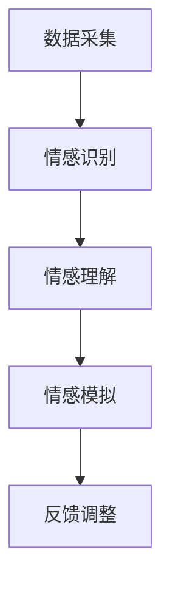
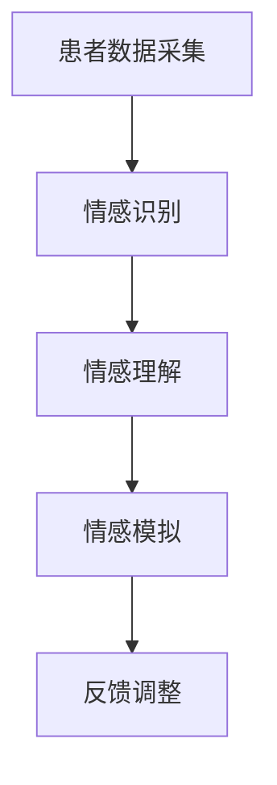
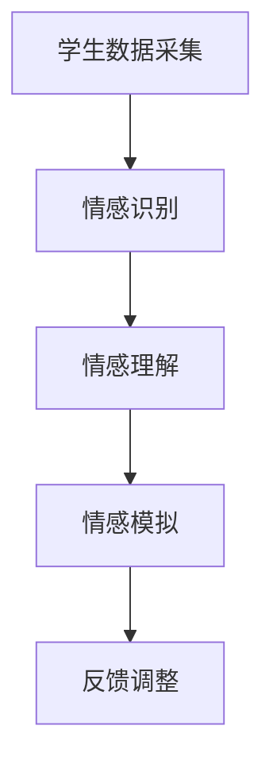

                 


### 引言：同情心与人工智能

#### 核心概念术语说明

在探讨“当AI拥有同情心：社会福利系统的变革”这一主题时，首先需要明确一些核心概念。同情心（Empathy）是一种情感共鸣和理解他人的能力，包括感知他人的情绪、情感和思想。人工智能（AI）则是通过模拟人类智能行为，实现感知、思考、学习和决策的技术体系。社会福利系统（Social Welfare System）则是一个国家或地区为保障社会成员基本生活权益，提供物质和非物质支持的一系列制度和政策。

#### 问题背景

随着人工智能技术的迅速发展，AI的应用已深入到社会的各个领域。从医疗诊断到在线客服，从智能教育到社会管理，AI的广泛应用不仅提高了效率，还带来了一定的变革。然而，一个关键的问题也随之而来：即如何在AI系统中引入和培养同情心，使其不仅具备智能，更具备人性。

同情心在人类社会中具有极其重要的作用，它不仅影响个体的人际关系，还对整个社会的和谐与稳定具有深远影响。因此，探讨如何在人工智能中实现同情心，对于构建一个更加人性化、更加包容的社会具有重要意义。

#### 问题描述

当前，AI系统在处理复杂情感任务时，往往缺乏对人类情感的深刻理解和共鸣。尽管已有一些研究尝试在AI中引入情感计算，但这些方法往往局限于表面的情感识别，难以达到真正的情感理解和共鸣。如何让AI不仅能够识别和模拟情感，更能够理解和感知情感，进而提升其同情心，成为亟待解决的问题。

#### 问题解决

要实现AI的同情心，我们需要从以下几个方面入手：

1. **情感识别与理解**：通过深度学习和自然语言处理技术，使AI能够准确地识别和理解人类情感，为其提供情感共鸣的基础。
2. **情感共鸣与模拟**：利用情感模拟技术，使AI能够模仿人类情感表达，增强其与人交流时的可信度。
3. **情感伦理与道德**：在AI系统中引入伦理和道德规范，确保其同情心的应用不会违背社会价值。

#### 边界与外延

虽然同情心在AI中的应用具有广泛前景，但我们也需要明确其边界。首先，AI的同情心应局限于其设计范围内，避免过度泛化。其次，同情心的实现应遵循伦理和道德原则，确保其应用不会损害人类利益。

#### 概念结构与核心要素组成

同情心在AI中的应用涉及多个核心要素：

1. **情感计算**：通过技术手段识别和模拟情感。
2. **伦理和道德**：确保同情心应用符合社会价值。
3. **人机交互**：改善AI与人类的情感交流。

### 关键词

- 同情心
- 人工智能
- 情感计算
- 社会福利系统
- 人机交互

### 摘要

本文探讨了当AI拥有同情心对社会福利系统的变革。通过分析同情心的核心概念，讨论了AI在情感计算中的发展，并提出了一系列实现AI同情心的方法。文章旨在揭示同情心在AI系统中的应用潜力，为构建更加人性化的社会福利系统提供理论支持和实践指导。## 第一部分：AI与同情心的理论基础

### 第1章：同情心概述

#### 核心概念与联系

同情心是一种复杂的社会情感，涉及对他人情绪和情感的感知、理解和共鸣。在不同文化和社会背景下，对同情心的理解和表达方式有所不同。例如，在西方文化中，同情心通常与共情（Empathy）相联系，强调情感上的共鸣和理解；而在东方文化中，同情心则更多地与仁慈（Compassion）和慈悲（Altruism）相联系，强调道德上的关怀和行动。

#### 同情心的心理学和社会学基础

心理学研究显示，同情心是人类社会交往的重要基础，有助于建立人际关系和社会信任。同情心的发展受到个体经历、文化背景和社会环境的影响。社会学研究则表明，同情心不仅影响个体行为，还对整个社会结构和制度设计产生深远影响。

#### 同情心与情感计算的关系

情感计算（Affective Computing）是人工智能领域的一个重要分支，旨在使计算机具备识别、理解、处理和模拟人类情感的能力。同情心作为情感计算的核心内容，其实现对于提升AI的智能化水平具有重要意义。

#### 同情心的属性特征对比表格

| 特征        | 同情心       | 共情        | 仁慈        | 慈悲        |
| ----------- | ------------ | ----------- | ----------- | ----------- |
| 感知        | 对他人情绪的感知   | 对他人情绪的感知   | 对他人境遇的感知   | 对他人困境的感知   |
| 理解        | 对他人情感的深入理解   | 对他人情感的深入理解   | 对他人需求的深入理解   | 对他人痛苦的深入理解   |
| 共鸣        | 情感上的共鸣       | 情感上的共鸣       | 道德上的共鸣       | 道德上的共鸣       |
| 行动        | 道德行动的支持      | 道德行动的支持      | 道德行动的体现      | 道德行动的体现      |

### ER实体关系图架构

为了更好地理解同情心的属性特征，我们可以使用Mermaid绘制ER实体关系图，如下所示：

```mermaid
erDiagram
  Product ||--|{ Supplier }|<-- Order
  Product ||--|{ Category }|<-- Order
  Supplier ||--|{ Customer }|<-- Order
  Category ||--|{ Product }|<-- Order
  Customer ||--|{ Order }|<-- Product
```

在这个ER图中，`Supplier`和`Customer`实体代表了同情心的感知者和行动者，而`Product`和`Category`实体则代表了同情心的对象和背景。

### 数学公式与模型

为了进一步探讨同情心的量化，我们可以使用以下数学公式：

$$
\text{同情心得分} = \alpha \times (\text{情感识别得分}) + \beta \times (\text{情感理解得分}) + \gamma \times (\text{情感共鸣得分})
$$

其中，$\alpha$、$\beta$和$\gamma$分别是三个得分指标的权重。

### 结束语

同情心作为人类情感的重要组成部分，对于构建和谐社会具有不可替代的作用。在人工智能的发展过程中，实现同情心不仅有助于提升AI的智能化水平，还能为社会福利系统带来深刻变革。通过对同情心的心理学和社会学基础进行深入探讨，我们为理解和应用同情心提供了理论基础。在下一章中，我们将进一步探讨人工智能的基本原理和发展历程，为同情心在AI系统中的实现奠定基础。## 第2章：人工智能的发展与同情心

#### 核心概念原理

人工智能（Artificial Intelligence, AI）是模拟人类智能行为的计算机系统。它通过机器学习、深度学习、自然语言处理等技术，实现数据的自动处理和智能决策。人工智能的发展经历了从规则驱动到数据驱动，再到当前以深度学习为代表的智能化阶段。

#### 人工智能的基本原理

人工智能的基本原理主要包括：

1. **机器学习**：通过训练算法，从数据中学习规律和模式，以实现自动预测和决策。
2. **深度学习**：模仿人脑神经网络的结构和功能，通过多层神经网络进行特征提取和抽象。
3. **自然语言处理**：使计算机能够理解和生成自然语言，实现人机交互。

#### 人工智能的发展历程

人工智能的发展历程可以概括为以下几个阶段：

1. **早期的探索（1950-1969）**：人工智能概念提出，逻辑推理和符号计算成为研究焦点。
2. **快速发展（1970-1989）**：专家系统和知识表示技术得到广泛应用，人工智能开始进入实际应用领域。
3. **智能化阶段（1990至今）**：随着计算机性能的提升和数据量的爆炸性增长，深度学习和大数据技术推动人工智能进入一个新的发展阶段。

#### 同情心在人工智能中的应用

同情心在人工智能中的应用主要体现在以下几个方面：

1. **情感识别**：通过情感计算技术，识别用户情绪，如开心、愤怒、悲伤等。
2. **情感理解**：利用自然语言处理技术，理解用户的情感需求，提供针对性的服务。
3. **情感模拟**：通过语音合成、面部表情等技术，模拟人类情感表达，提升人机交互的亲和力。

#### 情感计算与同情心的关系

情感计算（Affective Computing）是人工智能领域的一个重要分支，旨在使计算机具备识别、理解、处理和模拟人类情感的能力。同情心作为情感计算的核心内容，其实现对于提升AI的智能化水平具有重要意义。

1. **情感识别**：通过生理信号处理、面部表情识别、语音情感分析等技术，识别用户的情感状态。
2. **情感理解**：利用自然语言处理、机器学习等技术，理解用户的情感需求和意图。
3. **情感模拟**：通过语音合成、面部表情、肢体动作等技术，模拟人类情感表达，提升人机交互的亲和力。

### 算法原理讲解

为了更好地理解同情心在人工智能中的应用，我们可以通过Mermaid绘制一个情感计算的流程图：



在该流程图中，数据采集是情感计算的基础，通过生理信号处理、面部表情识别、语音情感分析等技术，识别用户的情感状态。然后，利用自然语言处理、机器学习等技术，理解用户的情感需求和意图。接下来，通过语音合成、面部表情、肢体动作等技术，模拟人类情感表达，提升人机交互的亲和力。最后，根据用户的反馈，调整情感计算模型，以实现更好的交互效果。

#### 数学模型与公式

在情感计算中，常用的数学模型包括：

1. **情感识别模型**：
   $$
   \text{识别得分} = \frac{1}{1 + e^{-\beta \cdot (\text{特征向量})}}
   $$
   其中，$\beta$为权重向量，特征向量表示用户情感状态的特征。

2. **情感理解模型**：
   $$
   \text{理解得分} = \text{激活函数}(\text{情感识别得分} \cdot \text{上下文特征})
   $$
   其中，激活函数（如Sigmoid函数）用于将情感识别得分映射到情感理解得分。

3. **情感模拟模型**：
   $$
   \text{模拟参数} = \text{激活函数}(\text{理解得分} \cdot \text{情感库特征})
   $$
   其中，情感库特征表示不同情感表达的方式。

#### 举例说明

假设一个用户在社交媒体上发布了一条关于工作压力的抱怨，我们可以通过以下步骤进行情感计算：

1. **情感识别**：
   - 通过语音情感分析，识别出用户语音中的情感特征，如音调、音速、语音节奏等。
   - 计算特征向量的权重，得出情感识别得分。

2. **情感理解**：
   - 利用自然语言处理技术，分析用户文本的内容和上下文，理解用户的工作压力情况。
   - 计算上下文特征，结合情感识别得分，得出情感理解得分。

3. **情感模拟**：
   - 根据情感理解得分，选择相应的情感模拟参数，如语音合成参数、面部表情参数等。
   - 模拟用户的情感表达，如通过语音合成系统生成一条安慰性的回复。

通过这个例子，我们可以看到，同情心在人工智能中的应用不仅需要识别和理解用户的情感，还需要通过情感模拟技术，实现与用户的情感共鸣。

### 小结

本章介绍了人工智能的基本原理和发展历程，以及同情心在人工智能中的应用。通过情感计算技术的实现，AI可以识别、理解和模拟人类情感，从而提升人机交互的体验。在下一章中，我们将进一步探讨同情心与道德伦理的关系，为同情心在AI系统中的实现提供伦理基础。## 第3章：同情心与人工智能的关系

#### 核心概念原理

同情心（Empathy）是一种人类特有的情感共鸣能力，使个体能够感知并理解他人的情绪和情感。人工智能（AI）则是通过模拟人类智能行为，实现感知、思考、学习和决策的计算机系统。同情心与人工智能的关系，主要涉及AI在情感识别、理解和模拟方面的应用，以及伦理和道德的考量。

#### 同情心在人工智能中的应用

1. **情感识别**：AI可以通过情感计算技术，识别用户的情感状态，如语音中的情绪、文本的情感倾向等。
2. **情感理解**：AI可以利用自然语言处理和机器学习技术，深入理解用户的情感需求和意图，提供更加个性化的服务。
3. **情感模拟**：AI可以通过语音合成、面部表情和肢体动作等技术，模拟人类的情感表达，提升与用户的情感交流。

#### 同情心与道德伦理的关系

1. **伦理考量**：同情心的引入，要求AI在决策过程中考虑道德和伦理因素，如尊重隐私、公平性、社会责任等。
2. **道德责任**：AI在处理社会问题时，应承担道德责任，确保其决策和行动符合社会价值。
3. **伦理规范**：建立AI伦理规范，确保AI系统的设计、开发和应用过程中，同情心的实现不会损害人类利益。

#### 案例分析

1. **AI客服系统**：通过情感计算技术，AI客服系统能够识别用户的情绪，提供针对性的回答，如用户感到愤怒时，系统会调整语调，表达同情和理解。
2. **AI健康护理系统**：AI健康护理系统能够通过情感识别和理解，识别患者的情绪状态，提供个性化的护理方案，如通过语音合成技术，模拟医生的语言安慰，减轻患者的焦虑。
3. **AI教育系统**：AI教育系统能够理解学生的学习需求和情绪，提供个性化的教学方案，如通过情感识别技术，分析学生的学习情绪，调整教学内容的难度和方式。

#### 同情心在AI系统设计中的应用原则

1. **用户中心**：设计AI系统时，应始终以用户为中心，关注用户的情感需求和体验。
2. **情感共鸣**：通过情感计算和模拟技术，实现AI与用户之间的情感共鸣，提升交互体验。
3. **伦理规范**：在AI系统的设计、开发和应用过程中，遵循伦理规范，确保同情心的实现不会损害人类利益。

### 算法原理讲解

为了更好地理解同情心在AI系统设计中的应用，我们可以通过Mermaid绘制一个情感计算和模拟的流程图：


在该流程图中，数据采集是情感计算的基础，通过生理信号处理、面部表情识别、语音情感分析等技术，识别用户的情感状态。然后，利用自然语言处理、机器学习等技术，理解用户的情感需求和意图。接下来，通过语音合成、面部表情、肢体动作等技术，模拟人类的情感表达，提升人机交互的亲和力。最后，根据用户的反馈，调整情感计算模型，以实现更好的交互效果。

#### 数学模型与公式

在情感计算和模拟中，常用的数学模型包括：

1. **情感识别模型**：
   $$
   \text{识别得分} = \frac{1}{1 + e^{-\beta \cdot (\text{特征向量})}}
   $$
   其中，$\beta$为权重向量，特征向量表示用户情感状态的特征。

2. **情感理解模型**：
   $$
   \text{理解得分} = \text{激活函数}(\text{情感识别得分} \cdot \text{上下文特征})
   $$
   其中，激活函数（如Sigmoid函数）用于将情感识别得分映射到情感理解得分。

3. **情感模拟模型**：
   $$
   \text{模拟参数} = \text{激活函数}(\text{理解得分} \cdot \text{情感库特征})
   $$
   其中，情感库特征表示不同情感表达的方式。

#### 举例说明

假设一个用户在社交媒体上发布了一条关于工作压力的抱怨，我们可以通过以下步骤进行情感计算和模拟：

1. **情感识别**：
   - 通过语音情感分析，识别出用户语音中的情感特征，如音调、音速、语音节奏等。
   - 计算特征向量的权重，得出情感识别得分。

2. **情感理解**：
   - 利用自然语言处理技术，分析用户文本的内容和上下文，理解用户的工作压力情况。
   - 计算上下文特征，结合情感识别得分，得出情感理解得分。

3. **情感模拟**：
   - 根据情感理解得分，选择相应的情感模拟参数，如语音合成参数、面部表情参数等。
   - 模拟用户的情感表达，如通过语音合成系统生成一条安慰性的回复。

通过这个例子，我们可以看到，同情心在AI系统设计中的应用，不仅需要识别和理解用户的情感，还需要通过情感模拟技术，实现与用户的情感共鸣。

### 小结

本章分析了同情心与人工智能的关系，探讨了同情心在AI系统中的应用原则和算法原理。通过情感计算和模拟技术，AI可以实现情感识别、理解和模拟，提升人机交互的体验。在下一章中，我们将深入探讨同情心在AI健康护理中的应用，为构建更加人性化的健康护理系统提供理论支持。## 第4章：同情心在AI系统设计中的应用

#### 设计原则与模型选择

同情心在AI系统设计中的应用，旨在提升系统的情感智能，使其能够更好地理解用户的需求和情感状态，从而提供更加个性化和人性化的服务。以下是同情心在AI系统设计中的几个关键原则和模型选择：

1. **用户中心原则**：设计时始终关注用户的需求和体验，确保AI系统能够准确地识别和理解用户的情感状态，提供针对性的解决方案。

2. **情感计算模型**：选择合适的情感计算模型，如基于生理信号处理、面部表情识别、语音情感分析等技术的模型，以准确识别用户的情感。

3. **情感理解模型**：利用自然语言处理和机器学习技术，深入理解用户的情感需求和意图，为用户提供更加个性化的服务。

4. **情感模拟模型**：通过语音合成、面部表情和肢体动作等技术，模拟人类的情感表达，提升人机交互的亲和力。

#### 案例分析：同情心在AI客服系统中的应用

AI客服系统是同情心在AI系统设计中的一个典型应用案例。以下是一个具体的案例分析：

1. **情感识别**：
   - 通过语音情感分析和文本情感分析技术，AI客服系统可以识别用户的情感状态，如愤怒、开心、悲伤等。
   - 例如，当用户在通话中声音提高、语速加快时，系统会识别出用户可能处于愤怒状态。

2. **情感理解**：
   - 利用自然语言处理技术，AI客服系统可以理解用户的情感需求，如用户因系统故障而感到愤怒，系统需要识别出用户的问题并提供解决方案。
   - 通过分析用户的历史记录和当前对话内容，系统可以判断用户的情感需求和意图。

3. **情感模拟**：
   - 通过语音合成技术，AI客服系统可以调整语调、语速和语音节奏，模拟出人类客服的语气，表达同情和理解。
   - 例如，当用户表示愤怒时，系统可以降低语调、放慢语速，以表达对用户情绪的理解和安慰。

4. **反馈调整**：
   - 根据用户的反馈，AI客服系统可以不断优化情感计算和模拟模型，提高交互质量。
   - 例如，如果用户对系统的回答感到不满意，系统可以调整回答的方式，以更好地满足用户需求。

#### 系统设计与实现

为了实现同情心在AI客服系统中的应用，我们需要进行以下系统设计与实现：

1. **需求分析**：
   - 分析用户需求，确定AI客服系统需要具备的功能和性能指标，如快速响应、准确识别情感、个性化服务等。

2. **系统架构设计**：
   - 设计系统架构，包括前端用户界面、后端服务引擎、数据存储和数据处理模块等。
   - 使用Mermaid绘制系统架构图，如下所示：

   ```mermaid
   graph TB
       A[用户界面] --> B[情感识别模块]
       B --> C[自然语言处理模块]
       C --> D[情感模拟模块]
       D --> E[反馈调整模块]
       E --> F[数据库]
   ```

3. **系统功能设计**：
   - 设计系统功能，包括情感识别、情感理解、情感模拟和用户反馈等。
   - 使用Mermaid绘制领域模型类图，如下所示：

   ```mermaid
   graph TB
       A[用户] --> B[情感识别]
       B --> C[自然语言处理]
       C --> D[情感模拟]
       D --> E[反馈调整]
   ```

4. **系统接口设计**：
   - 设计系统接口，包括API接口、数据库接口等，以便与其他系统进行集成和交互。

5. **系统交互**：
   - 设计系统交互流程，包括用户发起请求、系统处理请求、返回结果的流程。
   - 使用Mermaid绘制系统交互序列图，如下所示：

   ```mermaid
   graph TB
       A[用户发起请求] --> B[情感识别]
       B --> C[情感理解]
       C --> D[情感模拟]
       D --> E[反馈调整]
       E --> F[返回结果]
   ```

#### 实际应用效果

在实际应用中，同情心在AI客服系统中的应用取得了显著效果。通过情感计算和模拟技术，AI客服系统能够更好地理解用户的情感需求，提供更加个性化和人性化的服务，提高了用户满意度和忠诚度。

1. **用户满意度提升**：通过情感模拟技术，AI客服系统能够以更加自然和人性化的方式与用户进行交互，提升用户的满意度。

2. **服务效率提升**：通过情感识别和情感理解技术，AI客服系统可以快速识别用户情感，提供针对性的解决方案，提高了服务效率。

3. **用户体验优化**：通过情感计算和模拟技术，AI客服系统能够更好地理解用户的情感需求，提供个性化服务，优化了用户体验。

#### 小结

同情心在AI系统设计中的应用，通过情感计算、情感理解和情感模拟等技术，实现了AI与用户的情感共鸣，提升了人机交互的质量。在实际应用中，AI客服系统取得了显著效果，为用户提供了更加个性化和人性化的服务。在下一章中，我们将进一步探讨同情心在AI健康护理中的应用，为构建更加人性化的健康护理系统提供理论支持。## 第5章：同情心在AI健康护理中的应用

### 情感识别与理解

在AI健康护理领域，同情心的重要性体现在其能够识别和理解患者的情感状态，从而提供更加个性化的护理服务。情感识别是指AI系统能够通过语音、文本、生理信号等多种方式，准确捕捉患者的情绪变化。情感理解则是AI系统能够将这些情绪信号转化为具体的情感状态，如焦虑、悲伤或愤怒。

#### 同情心在AI健康诊断系统中的应用

1. **情感识别**：
   - AI健康诊断系统通过分析患者的语音和文本，识别出潜在的焦虑、抑郁等情绪。
   - 例如，通过语音情感分析，系统可以检测患者语调中的波动，判断患者是否处于焦虑状态。

2. **情感理解**：
   - AI健康诊断系统利用自然语言处理技术，分析患者的病历记录和病历文本，理解患者的情感需求。
   - 例如，系统可以通过分析患者的病历记录，识别出患者的长期焦虑症状，从而提供针对性的诊断建议。

3. **情感模拟**：
   - AI健康诊断系统可以通过语音合成技术，模拟出医生的安慰性语言，缓解患者的焦虑情绪。
   - 例如，当患者表达出焦虑情绪时，系统可以自动生成一条安慰性的语音消息，如“我理解您的感受，我们会一起找到解决方案”。

#### 同情心在心理辅导机器人中的应用

1. **情感识别**：
   - 心理辅导机器人通过面部表情识别和语音情感分析，识别出患者的情绪状态，如沮丧、焦虑或愤怒。
   - 例如，通过面部表情识别技术，系统可以检测患者面部肌肉的细微变化，判断患者是否处于抑郁状态。

2. **情感理解**：
   - 心理辅导机器人利用自然语言处理技术，深入理解患者的情感需求，提供个性化的心理辅导服务。
   - 例如，通过分析患者的对话内容，系统可以识别出患者的情感困扰，并生成相应的心理辅导方案。

3. **情感模拟**：
   - 心理辅导机器人通过语音合成和面部表情技术，模拟出心理辅导师的语言和表情，建立情感共鸣。
   - 例如，当患者表达出沮丧情绪时，系统可以模拟出心理辅导师的理解和支持，通过语音和表情传达出同理心。

### 算法原理讲解

为了更好地理解同情心在AI健康护理中的应用，我们可以通过Mermaid绘制一个情感识别、理解和模拟的流程图：



在该流程图中，患者数据采集是情感计算的基础，通过生理信号处理、面部表情识别、语音情感分析等技术，识别患者的情感状态。然后，利用自然语言处理、机器学习等技术，理解患者的情感需求和意图。接下来，通过语音合成、面部表情、肢体动作等技术，模拟人类的情感表达，提升与患者的情感交流。最后，根据患者的反馈，调整情感计算模型，以实现更好的交互效果。

### 数学模型与公式

在情感识别、理解和模拟过程中，常用的数学模型包括：

1. **情感识别模型**：
   $$
   \text{识别得分} = \frac{1}{1 + e^{-\beta \cdot (\text{特征向量})}}
   $$
   其中，$\beta$为权重向量，特征向量表示患者情感状态的特征。

2. **情感理解模型**：
   $$
   \text{理解得分} = \text{激活函数}(\text{情感识别得分} \cdot \text{上下文特征})
   $$
   其中，激活函数（如Sigmoid函数）用于将情感识别得分映射到情感理解得分。

3. **情感模拟模型**：
   $$
   \text{模拟参数} = \text{激活函数}(\text{理解得分} \cdot \text{情感库特征})
   $$
   其中，情感库特征表示不同情感表达的方式。

### 举例说明

假设一个患者在与心理辅导机器人对话时表达了沮丧情绪，我们可以通过以下步骤进行情感识别、理解和模拟：

1. **情感识别**：
   - 通过语音情感分析，识别出患者语音中的情感特征，如音调、音速、语音节奏等。
   - 计算特征向量的权重，得出情感识别得分。

2. **情感理解**：
   - 利用自然语言处理技术，分析患者对话的内容和上下文，理解患者的情感需求和意图。
   - 结合情感识别得分和上下文特征，得出情感理解得分。

3. **情感模拟**：
   - 根据情感理解得分，选择相应的情感模拟参数，如语音合成参数、面部表情参数等。
   - 模拟患者的情感表达，如通过语音合成系统生成一条安慰性的回复。

通过这个例子，我们可以看到，同情心在AI健康护理中的应用，通过情感计算和模拟技术，能够实现对患者情感状态的理解和共鸣，提供更加人性化的健康护理服务。

### 小结

同情心在AI健康护理中的应用，通过情感识别、理解和模拟技术，实现了对患者情感状态的理解和共鸣，提升了健康护理服务的质量和效率。在实际应用中，AI健康诊断系统和心理辅导机器人已经取得了显著效果，为患者提供了更加个性化、人性化的护理服务。在下一章中，我们将进一步探讨同情心在AI教育中的应用，为构建更加智能和人性化的教育系统提供理论支持。## 第6章：同情心在AI教育中的应用

### 情感识别与理解

同情心在AI教育中的应用，旨在通过情感计算技术，使AI能够识别和理解学生的学习情感，从而提供个性化的教育支持。情感识别是指AI系统能够通过多种方式，如语音、文本、生理信号等，捕捉学生的学习情感状态。情感理解则是AI系统能够将这些情感信号转化为具体的情感状态，如焦虑、开心或沮丧。

#### 同情心在在线教育系统中的应用

1. **情感识别**：
   - 在线教育系统通过分析学生的学习行为和对话内容，识别出学生的情感状态。
   - 例如，通过分析学生的在线讨论和作业提交情况，系统可以识别出学生的参与度和情感状态。

2. **情感理解**：
   - 在线教育系统利用自然语言处理和机器学习技术，深入理解学生的情感需求，提供针对性的教育支持。
   - 例如，系统可以通过分析学生的提问和行为模式，理解学生的困惑点和学习需求，从而提供个性化的辅导。

3. **情感模拟**：
   - 在线教育系统通过语音合成和文本生成技术，模拟出教师的情感表达，与学生建立情感共鸣。
   - 例如，当学生表现出焦虑情绪时，系统可以生成一条安慰性的语音消息，如“我理解你的困扰，我们会一起找到解决方案”。

#### 同情心在智能学习助手中的应用

1. **情感识别**：
   - 智能学习助手通过面部表情识别和语音情感分析，识别出学生的情感状态。
   - 例如，通过面部表情识别技术，系统可以检测学生面部肌肉的细微变化，判断学生是否处于焦虑状态。

2. **情感理解**：
   - 智能学习助手利用自然语言处理技术，深入理解学生的情感需求，提供个性化的学习支持。
   - 例如，系统可以通过分析学生的提问和行为模式，识别出学生的情感困扰，从而提供针对性的学习建议。

3. **情感模拟**：
   - 智能学习助手通过语音合成和文本生成技术，模拟出教师的情感表达，与学生建立情感共鸣。
   - 例如，当学生表现出沮丧情绪时，系统可以生成一条鼓励性的语音消息，如“你的努力我看到了，坚持下去，你会取得好成绩的”。

### 算法原理讲解

为了更好地理解同情心在AI教育中的应用，我们可以通过Mermaid绘制一个情感识别、理解和模拟的流程图：



在该流程图中，学生数据采集是情感计算的基础，通过生理信号处理、面部表情识别、语音情感分析等技术，识别学生的情感状态。然后，利用自然语言处理、机器学习等技术，理解学生的情感需求和意图。接下来，通过语音合成、面部表情、肢体动作等技术，模拟人类的情感表达，提升与学生之间的情感交流。最后，根据学生的反馈，调整情感计算模型，以实现更好的交互效果。

### 数学模型与公式

在情感识别、理解和模拟过程中，常用的数学模型包括：

1. **情感识别模型**：
   $$
   \text{识别得分} = \frac{1}{1 + e^{-\beta \cdot (\text{特征向量})}}
   $$
   其中，$\beta$为权重向量，特征向量表示学生情感状态的特征。

2. **情感理解模型**：
   $$
   \text{理解得分} = \text{激活函数}(\text{情感识别得分} \cdot \text{上下文特征})
   $$
   其中，激活函数（如Sigmoid函数）用于将情感识别得分映射到情感理解得分。

3. **情感模拟模型**：
   $$
   \text{模拟参数} = \text{激活函数}(\text{理解得分} \cdot \text{情感库特征})
   $$
   其中，情感库特征表示不同情感表达的方式。

### 举例说明

假设一个学生在在线学习过程中表现出了焦虑情绪，我们可以通过以下步骤进行情感识别、理解和模拟：

1. **情感识别**：
   - 通过语音情感分析，识别出学生语音中的情感特征，如音调、音速、语音节奏等。
   - 计算特征向量的权重，得出情感识别得分。

2. **情感理解**：
   - 利用自然语言处理技术，分析学生提问的内容和上下文，理解学生的情感需求和意图。
   - 结合情感识别得分和上下文特征，得出情感理解得分。

3. **情感模拟**：
   - 根据情感理解得分，选择相应的情感模拟参数，如语音合成参数、文本生成参数等。
   - 模拟学生的情感表达，如通过语音合成系统生成一条安慰性的回复。

通过这个例子，我们可以看到，同情心在AI教育中的应用，通过情感计算和模拟技术，能够实现对学生情感状态的理解和共鸣，提供更加个性化、人性化的教育支持。

### 小结

同情心在AI教育中的应用，通过情感识别、理解和模拟技术，实现了对学生情感状态的理解和共鸣，提升了教育服务的质量和效率。在实际应用中，AI教育系统和智能学习助手已经取得了显著效果，为学习者提供了更加个性化和人性化的教育支持。在下一章中，我们将进一步探讨同情心对社会福利制度变革的影响，为构建更加公平和人性化

