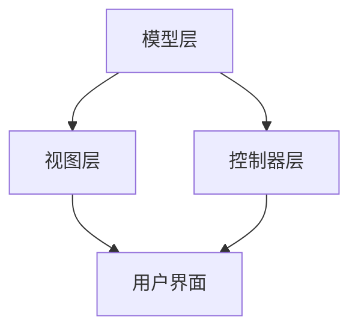

                 

### 文章标题

**形式与内容的统一:MVC模式的哲学解读**

> 关键词：MVC模式、模型层、视图层、控制器层、哲学解读、软件架构

> 摘要：本文将深入探讨MVC（Model-View-Controller）模式的形式与内容的统一，通过其历史背景、基本架构、核心概念、哲学解读和实际应用等多个维度，阐述MVC模式在软件开发中的重要性及其哲学意义。本文旨在帮助读者理解MVC模式的核心原理和哲学内涵，并掌握其在实际项目中的应用技巧。

---

### 引言

MVC模式是软件开发中广泛应用的一种架构模式，它不仅解决了传统程序设计中视图与数据之间的耦合问题，还极大地提高了软件的可维护性和扩展性。然而，MVC模式并不仅仅是技术的集合，更是一种哲学思想的体现。本文将从形式与内容的统一这一哲学视角出发，逐步解析MVC模式的内涵和外在表现，旨在为读者提供一种全新的理解和应用MVC模式的方法。

文章将分为三个主要部分：

1. **MVC模式概述**：介绍MVC模式的历史背景、核心概念和基本架构。
2. **MVC模式的核心概念与联系**：详细讲解模型层、视图层和控制器层的原理及其相互联系。
3. **MVC模式的哲学解读**：探讨MVC模式中的形式与内容统一及其哲学意义。

通过本文的阅读，读者将能够：

- 理解MVC模式的历史发展和核心概念。
- 掌握MVC模式的基本架构和工作流程。
- 深入理解MVC模式中的形式与内容的统一。
- 学会应用MVC模式进行实际软件开发。

### MVC模式概述

#### 第1章：MVC模式的历史与背景

##### 1.1 MVC模式的起源与发展

MVC模式最早由Trygve Reenskaug在1978年提出，当时他在Xerox帕克理工学院（Xerox PARC）的Alto项目团队中工作。MVC模式的设计初衷是为了解决用户界面开发中视图与数据之间的耦合问题。在传统的程序设计中，视图和数据的更新往往是通过直接操作来实现的，这种做法容易导致代码的复杂性和维护困难。

随着计算机技术的发展，特别是图形用户界面（GUI）的兴起，MVC模式逐渐得到了广泛的应用。1988年，Smalltalk社区对MVC模式进行了进一步的完善和推广，使其成为面向对象编程中的一个重要概念。在随后的几十年中，MVC模式不断演化，不仅应用在桌面应用程序中，还扩展到了Web开发和移动应用程序开发等多个领域。

##### 1.2 MVC模式的核心概念

MVC模式由三个核心组件组成：模型（Model）、视图（View）和控制器（Controller）。每个组件都有其特定的职责和功能。

- **模型（Model）**：负责管理应用程序的数据和业务逻辑。模型组件是MVC模式中的核心，它包含了应用程序的业务规则和数据结构。
- **视图（View）**：负责呈现用户界面和数据。视图组件根据模型中的数据生成用户界面，并响应用户的操作。
- **控制器（Controller）**：负责处理用户输入，更新模型和视图。控制器组件是MVC模式中的协调者，它连接模型和视图，确保数据的流动和用户界面的更新。

##### 1.3 MVC模式的优势与应用领域

MVC模式具有以下几个显著的优势：

- **高内聚、低耦合**：通过将应用程序分为三个独立的组件，MVC模式实现了数据和视图之间的低耦合，提高了代码的可维护性和可扩展性。
- **易于测试和复用**：由于各个组件职责明确，MVC模式使得单元测试和集成测试变得更加容易。同时，组件的独立性也促进了代码的复用。
- **良好的用户体验**：MVC模式使得用户界面与业务逻辑分离，开发者可以专注于优化用户体验，而不必担心数据的处理和存储。

MVC模式广泛应用于以下领域：

- **Web开发**：例如，在Web应用程序中，模型层负责处理数据库操作，视图层负责生成HTML页面，控制器层则负责处理用户请求和页面跳转。
- **桌面应用程序**：在桌面应用程序中，MVC模式可以帮助开发者分离用户界面和业务逻辑，提高应用程序的稳定性和可扩展性。
- **移动应用程序**：在移动应用程序开发中，MVC模式同样被广泛采用，以实现应用程序的快速开发和维护。

通过以上对MVC模式的历史、核心概念和优势的介绍，我们可以初步了解到MVC模式在软件开发中的重要性和应用价值。接下来，我们将进一步探讨MVC模式的基本架构和工作流程。

---

#### 第2章：MVC模式的基本架构

MVC模式的基本架构由三个核心组件组成：模型（Model）、视图（View）和控制器（Controller）。每个组件都有其特定的职责和作用，它们之间通过明确的交互方式协同工作，以实现软件应用程序的高内聚、低耦合和可维护性。

##### 2.1 MVC模式的三层结构

MVC模式通常被划分为三层结构，每一层都有其特定的职责和功能。

###### 2.1.1 模型层

**模型层（Model）**：模型层负责管理应用程序的数据和业务逻辑。它是MVC模式中的核心组件，包含了应用程序的业务规则和数据结构。模型层通常由一个或多个类组成，这些类实现了数据存储、数据检索和业务逻辑处理等功能。

**职责**：

- **数据管理**：模型层负责数据的存储、检索和更新。它通常包含一个或多个数据库表，以及用于与数据库交互的类和方法。
- **业务逻辑处理**：模型层包含了应用程序的业务规则和逻辑。例如，在一个电子商务网站中，模型层可能会处理商品库存管理、订单处理和支付等业务逻辑。

**特点**：

- **独立性**：模型层与其他层（视图层和控制器层）之间的耦合度较低，这使得模型层可以被独立地开发和测试。
- **可复用性**：由于模型层实现了数据的抽象和业务逻辑的封装，因此它可以被复用于不同的应用程序或项目。

**实现技术**：

- **数据库技术**：模型层通常使用数据库来存储数据，常见的技术包括关系型数据库（如MySQL、PostgreSQL）和非关系型数据库（如MongoDB、Redis）。
- **ORM框架**：对象关系映射（ORM）框架如Hibernate和Entity Framework可以帮助开发者更方便地实现数据层的功能，减少对数据库原始SQL语句的依赖。

###### 2.1.2 视图层

**视图层（View）**：视图层负责呈现用户界面和数据。它是用户与应用程序的交互界面，通过展示模型层的数据和状态，为用户提供直观的交互体验。视图层通常由HTML、CSS和JavaScript等前端技术实现。

**职责**：

- **数据展示**：视图层负责将模型层的数据以友好的方式展示给用户。例如，在电子商务网站中，视图层会显示商品列表、购物车和订单详情等。
- **用户交互**：视图层处理用户的输入和操作，并将这些操作传递给控制器层。例如，当用户点击“购买”按钮时，视图层会捕获这个事件，并将其传递给控制器层处理。

**特点**：

- **动态性**：视图层可以根据模型层的数据动态更新，以提供实时反馈和交互体验。
- **分离性**：视图层与模型层和控制器层之间的分离使得视图层可以独立开发和测试，提高了应用程序的可维护性和可扩展性。

**实现技术**：

- **前端框架**：例如React、Vue.js和Angular等前端框架可以帮助开发者快速构建响应式和动态的视图层。
- **CSS和JavaScript**：CSS用于控制页面布局和样式，JavaScript用于实现页面交互和动态效果。

###### 2.1.3 控制器层

**控制器层（Controller）**：控制器层负责处理用户输入，更新模型和视图。它是MVC模式中的协调者，连接模型层和视图层，确保数据的流动和用户界面的更新。控制器层通常由一个或多个类和方法组成。

**职责**：

- **输入处理**：控制器层接收用户的输入，并将其转换为相应的操作指令。例如，当用户在表单中输入数据并提交时，控制器层会捕获这些数据，并进行验证和处理。
- **数据更新**：控制器层根据输入指令更新模型层的数据。例如，当用户点击“保存”按钮时，控制器层会调用模型层的相应方法更新数据。
- **视图更新**：控制器层通知视图层更新用户界面。例如，当数据更新完成后，控制器层会触发视图层的更新，以显示新的数据。

**特点**：

- **独立性**：控制器层与其他层之间的耦合度较低，使得控制器层可以被独立地开发和测试。
- **灵活性**：控制器层可以根据需求灵活地处理不同的输入和操作，从而实现复杂的业务逻辑。

**实现技术**：

- **路由和中间件**：控制器层通常使用路由和中间件来处理HTTP请求和响应，例如Express.js和Spring MVC等框架。
- **事件驱动**：控制器层可以通过事件驱动的方式处理用户输入和操作，从而实现更灵活和动态的交互体验。

##### 2.2 MVC模式的工作流程

MVC模式的工作流程可以分为以下几个步骤：

1. **用户操作**：用户通过视图层与应用程序进行交互，例如输入数据或点击按钮。
2. **视图层处理**：视图层捕获用户操作，并将其传递给控制器层。
3. **控制器层处理**：控制器层接收用户操作，根据业务逻辑调用模型层的方法进行数据处理。
4. **模型层处理**：模型层根据控制器层的方法调用，更新数据并返回结果。
5. **视图更新**：控制器层通知视图层更新用户界面，以显示最新的数据。

通过以上工作流程，MVC模式实现了数据与视图之间的分离和交互，提高了应用程序的可维护性和可扩展性。在接下来的章节中，我们将进一步深入探讨MVC模式中的核心概念和相互关系。

---

#### 第3章：模型层原理讲解

模型层是MVC模式中的核心组件，负责管理应用程序的数据和业务逻辑。它不仅承担了数据的存储和处理任务，还实现了业务规则的抽象和封装。在本章中，我们将详细讲解模型层的原理，包括数据模型的设计与实现、模型层的算法原理以及算法的性能优化。

##### 3.1 数据模型的设计与实现

数据模型是模型层的核心组成部分，它定义了应用程序的数据结构、属性和行为。数据模型的设计与实现直接影响到应用程序的性能、可维护性和扩展性。

###### 3.1.1 数据模型的概念

数据模型是一种抽象的数据结构，用于描述应用程序中的数据及其关系。数据模型通常由以下几部分组成：

- **实体（Entity）**：实体是数据模型中最基本的组成部分，它代表应用程序中的数据对象。例如，在电子商务网站中，实体可能包括用户、商品和订单等。
- **属性（Attribute）**：属性是实体的特征或特性，用于描述实体的具体信息。例如，用户实体的属性可能包括用户名、密码和电子邮件等。
- **关系（Relationship）**：关系描述了实体之间的关联关系，例如用户和订单之间的一对多关系。

###### 3.1.2 数据模型的设计方法

数据模型的设计方法主要包括以下几种：

- **实体-关系模型（Entity-Relationship Model）**：实体-关系模型是常用的数据模型设计方法，通过实体和关系来描述数据结构。设计过程中通常使用ER图（Entity-Relationship Diagram）来表示实体和关系。
- **面向对象模型（Object-Oriented Model）**：面向对象模型基于面向对象编程的思想，将数据和行为封装为对象。面向对象模型可以更好地支持数据的抽象和复用。
- **文档模型（Document Model）**：文档模型主要用于处理非结构化数据，例如JSON和XML等。文档模型通常使用文档对象模型（DOM）来表示和操作数据。

###### 3.1.3 数据模型的实现技术

数据模型的实现技术主要包括以下几种：

- **关系型数据库（Relational Database）**：关系型数据库使用表（Table）来存储数据，通过SQL（Structured Query Language）进行数据操作。常见的数据库管理系统（DBMS）包括MySQL、PostgreSQL和Oracle等。
- **非关系型数据库（NoSQL Database）**：非关系型数据库适用于处理大规模和多样化的数据，例如MongoDB、Redis和Cassandra等。非关系型数据库通常使用文档、键值对或图等数据结构来存储数据。
- **ORM框架（Object-Relational Mapping Framework）**：ORM框架用于将对象模型映射到关系型数据库，从而简化数据访问和操作。常见的ORM框架包括Hibernate、Entity Framework和MyBatis等。

##### 3.2 模型层的算法原理

模型层的算法原理主要涉及数据的存储、检索和处理。以下是一些常见的算法原理：

###### 3.2.1 算法的基本原理

算法是解决问题的步骤集合，用于处理数据模型中的操作。常见的算法原理包括：

- **查找算法（Search Algorithm）**：用于在数据集中查找特定的元素。常见的查找算法包括线性查找和二分查找。
- **排序算法（Sorting Algorithm）**：用于对数据集进行排序。常见的排序算法包括冒泡排序、插入排序和快速排序等。
- **哈希算法（Hash Algorithm）**：用于将数据映射到特定的哈希值，以实现快速检索。常见的哈希算法包括MD5、SHA-1和SHA-256等。

###### 3.2.2 算法的设计与实现

算法的设计与实现主要包括以下步骤：

- **需求分析**：确定算法的应用场景和性能要求。
- **算法选择**：根据需求分析选择合适的算法。
- **算法实现**：使用编程语言实现算法，并进行调试和测试。

常见的算法实现技术包括：

- **递归（Recursion）**：递归是一种常见的算法实现技术，通过递归调用实现复杂问题的求解。
- **迭代（Iteration）**：迭代是一种通过循环实现算法的技术，通常用于处理大规模数据集。
- **动态规划（Dynamic Programming）**：动态规划是一种用于解决最优化问题的算法技术，通过将问题分解为子问题，并利用子问题的解来求解原问题。

###### 3.2.3 算法的性能优化

算法的性能优化是提高应用程序性能的重要手段。以下是一些常见的性能优化技术：

- **缓存（Caching）**：通过缓存减少数据库的访问次数，从而提高数据检索速度。
- **索引（Indexing）**：通过创建索引来加快数据的查找和排序操作。
- **分页（Pagination）**：通过分页技术将大量数据分批次加载，从而减少内存消耗和响应时间。
- **并行处理（Parallel Processing）**：通过并行处理技术将计算任务分布在多个处理器上，从而提高处理速度。

通过以上对模型层的原理讲解，我们可以看到模型层在MVC模式中的重要性。模型层不仅承担了数据管理和业务逻辑处理的任务，还为应用程序提供了强大的数据处理能力。在接下来的章节中，我们将进一步探讨视图层和控制器层的原理和相互关系。

---

#### 第4章：视图层原理讲解

视图层是MVC模式中直接与用户交互的部分，其主要职责是展示数据、响应用户操作并提供友好的用户界面。在本章中，我们将详细讲解视图层的实现技术、用户界面设计原则以及视图层的性能优化。

##### 4.1 视图层的实现技术

视图层的实现技术主要涉及前端开发，前端技术是构建用户界面和实现用户交互的关键。以下是一些常见的前端实现技术：

###### 4.1.1 前端技术概述

前端技术主要包括HTML、CSS和JavaScript，它们是构建现代网页的基础：

- **HTML（HyperText Markup Language）**：HTML是超文本标记语言，用于定义网页的结构和内容。HTML元素通过标签表示，例如`<div>`、`<p>`和`<a>`等。
- **CSS（Cascading Style Sheets）**：CSS用于控制网页的布局和样式，通过选择器和属性设置HTML元素的样式。CSS可以帮助开发者实现页面美化和响应式布局。
- **JavaScript**：JavaScript是一种客户端脚本语言，用于实现动态效果和与用户的交互。JavaScript可以操作DOM（Document Object Model）来动态修改页面内容，并响应用户操作。

###### 4.1.2 常用前端框架

前端框架是用于简化前端开发和提高开发效率的工具。以下是一些常用前端框架：

- **React**：React是由Facebook开发的一个用于构建用户界面的JavaScript库。React通过组件化开发思想，实现了组件的复用和状态的统一管理，是现代前端开发的代表框架之一。
- **Vue.js**：Vue.js是一个渐进式的前端框架，易于上手且具有高灵活性。Vue.js通过双向数据绑定和组件化开发，使得开发者可以更加高效地构建复杂的用户界面。
- **Angular**：Angular是由Google开发的一个全功能前端框架。Angular通过模块化开发、依赖注入和数据绑定等特性，实现了高效的代码管理和数据驱动开发。

###### 4.1.3 视图层的交互设计

视图层的交互设计是确保用户能够顺畅地使用应用程序的关键。以下是一些交互设计的原则：

- **直观性**：用户界面应该简洁直观，使用户能够轻松理解和使用。
- **一致性**：界面元素和交互方式应该保持一致性，以减少用户的学习成本。
- **反馈**：界面应该及时响应用户操作，并提供清晰的反馈，以增强用户的使用体验。
- **易访问性**：界面设计应该考虑到不同用户的需求，包括视力障碍者和行动不便者。

##### 4.2 视图层的用户界面设计原则

用户界面设计（UI Design）是视图层的重要组成部分，其设计原则直接影响用户的使用体验和满意度。以下是一些用户界面设计的原则：

###### 4.2.1 用户体验的重要性

用户体验（User Experience, UX）是用户在使用产品或服务过程中所感受到的总体体验。良好的用户体验可以提高用户满意度、忠诚度和产品的市场竞争力。以下是一些影响用户体验的因素：

- **可用性**：界面应易于使用，用户能够快速完成任务。
- **易学性**：界面设计应直观，用户能够快速学会如何使用。
- **可访问性**：界面应考虑到不同用户的需求，包括视力障碍者和行动不便者。
- **情感化**：界面设计应体现人文关怀，使用户感到温馨和舒适。

###### 4.2.2 设计原则与案例分析

以下是一些用户界面设计的原则，并结合实际案例进行说明：

- **简洁性**：界面设计应简洁明了，避免过度设计。例如，Google的首页设计简洁清晰，用户可以快速找到所需信息。
- **响应式设计**：界面应适应不同设备和屏幕尺寸，提供一致的体验。例如，淘宝网的移动端界面采用了响应式设计，在不同设备上都能保持良好的视觉效果。
- **互动性**：界面设计应鼓励用户参与和互动，提供动态效果和反馈。例如，Facebook的动态效果和即时反馈功能增强了用户的互动体验。

###### 4.2.3 视图层的性能优化

视图层的性能优化是确保应用程序快速响应和流畅运行的关键。以下是一些性能优化技巧：

- **减少HTTP请求**：通过合并CSS和JavaScript文件，减少HTTP请求次数，提高页面加载速度。
- **懒加载**：对图片、视频等大文件使用懒加载技术，仅在需要时才加载，以减少初始加载时间。
- **缓存**：利用浏览器缓存技术，减少重复资源的加载次数，提高访问速度。
- **代码优化**：优化JavaScript和CSS代码，减少重绘和回流次数，提高渲染性能。

通过以上对视图层原理的详细讲解，我们可以看到视图层在MVC模式中的重要性和复杂性。视图层的实现技术、用户界面设计原则和性能优化技巧都是构建高质量用户界面的重要环节。在接下来的章节中，我们将继续探讨控制器层的原理和相互关系。

---

#### 第5章：控制器层原理讲解

控制器层是MVC模式中的核心协调器，负责处理用户输入，更新模型和视图。在本章中，我们将详细讲解控制器层的职责与功能、控制器层的交互设计与实现，以及控制器层的性能优化。

##### 5.1 控制器层的职责与功能

控制器层是连接用户界面和业务逻辑的关键桥梁，其职责包括：

###### 5.1.1 控制器的职责

- **处理用户输入**：控制器接收用户通过视图层发送的请求，例如表单提交或按钮点击事件。
- **协调模型层**：控制器与模型层进行交互，根据用户请求执行相应的业务逻辑和数据操作。
- **更新视图层**：控制器将处理结果传递给视图层，并通知视图层进行更新，以反映最新的数据状态。

###### 5.1.2 控制器的实现方法

控制器层的实现方法因开发框架和语言的不同而有所差异，但通常包括以下几个步骤：

- **接收请求**：控制器通过HTTP请求或其他方式接收用户输入，并将其转换为相应的操作指令。
- **调用模型层**：控制器根据用户请求调用模型层的业务逻辑方法，执行数据处理和业务规则验证。
- **更新模型层**：控制器将处理结果（如新的数据状态）更新到模型层，以便后续操作和查询。
- **通知视图层**：控制器通过触发视图层的更新，将新的数据状态呈现给用户。

###### 5.1.3 控制器的模式识别

控制器层的模式识别是提高其灵活性和可扩展性的关键。以下是一些常见的控制器模式：

- **命令模式（Command Pattern）**：命令模式将请求封装为对象，使开发者可以灵活地控制请求的执行、记录日志或添加撤销功能。
- **策略模式（Strategy Pattern）**：策略模式用于定义一系列算法，将每个算法封装起来，并使它们可以相互替换。控制器层可以使用策略模式来实现业务规则的灵活切换。
- **工厂模式（Factory Pattern）**：工厂模式用于创建对象，将对象的创建过程封装在工厂类中，使控制器层可以更加灵活地选择和管理不同的业务逻辑实现。

##### 5.2 控制器层的交互设计与实现

控制器层的交互设计与实现是确保MVC模式高效运行的关键。以下是一些交互设计与实现要点：

###### 5.2.1 控制器与模型层、视图层的交互

控制器层与模型层和视图层的交互是MVC模式的核心。以下是一些关键点：

- **单向数据流**：MVC模式强调数据流向控制器层，然后由控制器层更新模型和视图。这种方式保证了数据流动的清晰性和可控性。
- **解耦**：控制器层通过清晰的接口与模型层和视图层交互，降低了各层的耦合度，提高了系统的可维护性和可扩展性。
- **路由**：路由是控制器层接收用户请求的重要机制。通过路由，控制器层可以识别并处理不同的请求，实现动态页面生成和资源管理。

###### 5.2.2 控制器的设计模式

控制器层的设计模式是提高其灵活性和可维护性的重要手段。以下是一些常用的设计模式：

- **拦截器模式（Interceptor Pattern）**：拦截器模式用于在请求处理过程中插入额外的逻辑，例如权限验证、日志记录等。
- **管道模式（Pipeline Pattern）**：管道模式将请求处理过程分解为一系列处理步骤，每个步骤都可以独立开发和测试，提高了系统的模块化和可扩展性。
- **适配器模式（Adapter Pattern）**：适配器模式用于将不兼容的接口转换为兼容的接口，使控制器层可以与不同的模型层和视图层组件进行交互。

###### 5.2.3 控制器的性能优化

控制器层的性能优化是确保应用程序响应速度和用户体验的重要环节。以下是一些性能优化策略：

- **减少请求处理时间**：优化控制器层的代码逻辑，减少不必要的计算和数据库操作，以提高请求处理速度。
- **缓存**：使用缓存技术减少对模型层的重复查询，提高数据访问速度。例如，可以使用内存缓存或分布式缓存系统。
- **异步处理**：对于耗时的操作，使用异步处理技术将任务分配给后台线程，以提高用户界面的响应速度。
- **负载均衡**：通过负载均衡技术，将请求分配到多个服务器节点，以减少单点瓶颈，提高系统的整体性能。

通过以上对控制器层原理的详细讲解，我们可以看到控制器层在MVC模式中的关键作用。控制器层不仅负责处理用户输入和协调模型层与视图层之间的交互，还通过灵活的设计模式实现高性能和高可维护性的系统。在接下来的章节中，我们将进一步探讨MVC模式中的形式与内容的统一。

---

#### 第6章：MVC模式的形式与内容的统一

在软件工程中，形式与内容的统一是一个重要的哲学概念。形式通常指的是软件的架构、设计和技术实现，而内容则是指软件的功能、业务逻辑和数据结构。MVC模式通过其独特的架构设计，成功地实现了形式与内容的统一。在本章中，我们将深入探讨MVC模式如何实现形式与内容的统一，以及这一统一带来的优势与局限。

##### 6.1 形式与内容的哲学概念

**形式的定义**：

形式指的是软件的结构和组织方式，包括架构设计、模块划分、接口定义等。形式关注的是软件的内部逻辑和组织结构，旨在实现高效、可维护和可扩展的代码。

**内容的定义**：

内容指的是软件的功能、业务逻辑和数据结构。内容关注的是软件的实际应用和业务需求，旨在实现业务目标和用户价值。

**形式与内容的关系**：

形式与内容是相辅相成的。形式为内容提供了一个结构化的实现框架，使得内容可以更加高效地实现和扩展。而内容则为形式提供了实际的业务场景和应用背景，使得形式能够真正发挥其作用。

形式与内容的统一，即是指软件的设计和实现能够同时满足结构化、高效性和业务需求，使得软件既具有良好的内部结构，又能够有效地实现业务功能。

##### 6.2 MVC模式中的形式与内容

MVC模式通过其三层架构实现了形式与内容的统一。模型层、视图层和控制器层各自负责不同的功能，但又紧密协作，共同实现软件的完整功能。

**模型层（Model）**：

模型层负责业务逻辑和数据管理。它是MVC模式中的核心，实现了内容的实现。模型层包含了数据模型和业务逻辑，独立于视图和控制器，保证了内容的纯粹性。

**视图层（View）**：

视图层负责用户界面和数据展示。它实现了形式的表现，将模型层的数据以用户友好的方式展示给用户。视图层与模型层解耦，保证了内容的独立性和可维护性。

**控制器层（Controller）**：

控制器层负责处理用户输入和协调模型层与视图层的交互。它是形式与内容之间的桥梁，连接了用户界面和业务逻辑，实现了形式与内容的统一。

**MVC模式如何实现形式与内容的统一**：

MVC模式通过以下方式实现了形式与内容的统一：

1. **分离职责**：MVC模式将应用程序划分为三个独立的层，每个层都有明确的职责。这种职责分离确保了形式和内容的独立性，使得两者可以独立开发、测试和优化。
2. **单向数据流**：MVC模式中的数据流从模型层流向视图层，再通过控制器层进行处理。这种单向数据流保证了数据的清晰性和可控性，减少了数据的混乱和冲突。
3. **解耦**：通过将模型层、视图层和控制器层分离，MVC模式实现了各层的解耦。这种解耦使得形式和内容可以独立变化，提高了系统的可维护性和可扩展性。

##### 6.3 MVC模式的优势与局限

**优势**：

1. **高内聚、低耦合**：MVC模式通过职责分离和单向数据流，实现了高内聚、低耦合的系统结构，提高了代码的可维护性和可扩展性。
2. **易于测试和复用**：由于各层职责明确，MVC模式使得单元测试和集成测试更加容易。同时，各层的独立性也促进了代码的复用。
3. **良好的用户体验**：MVC模式使得用户界面与业务逻辑分离，开发者可以专注于优化用户体验，而不必担心数据的处理和存储。

**局限**：

1. **复杂性**：MVC模式引入了多个层和组件，使得系统结构和代码复杂性增加，需要开发者具备较强的架构设计能力。
2. **性能问题**：在一些情况下，MVC模式可能会引入额外的性能开销，例如视图层的渲染和控制器层的请求处理。
3. **过度设计**：在某些简单的应用场景中，MVC模式可能会引入过度设计，使得系统结构复杂，不必要的组件和层增加了维护成本。

通过以上对MVC模式形式与内容统一的探讨，我们可以看到MVC模式在实现形式与内容统一方面具有独特的优势。尽管存在一定的局限性，但MVC模式依然是软件开发中广泛应用的一种架构模式，其核心思想和原则为开发者提供了宝贵的经验和启示。

---

#### 第7章：MVC模式的实践与应用

MVC模式在软件开发中的应用非常广泛，从传统的桌面应用程序到现代的Web和移动应用程序，MVC模式都展现出了强大的适应性和实用性。在本章中，我们将通过具体的应用案例，详细讲解MVC模式在不同领域的实践过程。

##### 7.1 MVC模式的实践过程

MVC模式的实践过程可以分为以下几个阶段：

###### 7.1.1 MVC模式的设计过程

设计过程是MVC模式实践的第一步，它涉及到应用程序的架构设计、模块划分和接口定义。

1. **需求分析**：首先，需要明确应用程序的需求，包括功能需求和非功能需求。需求分析是设计过程的基础，它为后续的设计和开发提供了明确的指导。
2. **架构设计**：根据需求分析的结果，设计应用程序的架构。架构设计包括确定模型层、视图层和控制器层的结构，以及它们之间的交互方式。
3. **模块划分**：将应用程序划分为多个模块，每个模块负责不同的功能。模块划分有助于提高代码的可维护性和可扩展性。
4. **接口定义**：定义各模块之间的接口，确保模块之间的高内聚和低耦合。接口定义是设计过程中的重要环节，它为后续的开发和测试提供了明确的指导。

###### 7.1.2 MVC模式的开发过程

开发过程是MVC模式实践的核心阶段，它涉及到具体代码的编写、测试和优化。

1. **编码**：根据设计过程的成果，开始编写具体的代码。在编码过程中，需要遵循MVC模式的规范，确保模型层、视图层和控制器层的职责分离。
2. **测试**：进行单元测试、集成测试和系统测试，确保代码的正确性和稳定性。测试是软件开发的重要环节，它有助于发现和修复代码中的错误和缺陷。
3. **优化**：在测试阶段结束后，对应用程序进行性能优化和用户体验优化。性能优化包括代码优化、数据库优化和缓存优化等，用户体验优化包括界面设计和交互设计的优化。

###### 7.1.3 MVC模式的测试过程

MVC模式的测试过程主要包括单元测试、集成测试和系统测试。

1. **单元测试**：单元测试是针对模型层、视图层和控制器层的每个模块进行的独立测试。单元测试旨在验证模块的功能是否正确实现。
2. **集成测试**：集成测试是针对模块之间的交互和协作进行的测试。集成测试旨在验证模块之间的接口是否正确，以及各模块是否能够协同工作。
3. **系统测试**：系统测试是对整个应用程序进行的全面测试，包括功能测试、性能测试和用户验收测试等。系统测试旨在验证应用程序是否符合需求，并能够稳定运行。

##### 7.2 MVC模式的实际应用案例

以下是一些MVC模式的实际应用案例，通过这些案例，我们可以更好地理解MVC模式在软件开发中的应用过程。

**案例1：Web开发中的MVC模式**

在Web开发中，MVC模式被广泛应用于构建动态网站和Web应用程序。以下是一个简单的Web开发案例：

1. **需求分析**：需要开发一个在线书店，用户可以浏览图书、购买图书和查看订单。
2. **架构设计**：将应用程序划分为模型层、视图层和控制器层。模型层负责管理图书数据和订单数据，视图层负责生成用户界面，控制器层负责处理用户请求和页面跳转。
3. **编码**：编写模型层、视图层和控制器层的代码。模型层实现数据存储和检索功能，视图层实现用户界面和交互，控制器层实现请求处理和页面跳转。
4. **测试**：进行单元测试、集成测试和系统测试，确保应用程序的功能正确、界面友好和性能良好。

**案例2：移动开发中的MVC模式**

在移动应用程序开发中，MVC模式同样被广泛应用。以下是一个简单的移动开发案例：

1. **需求分析**：需要开发一个移动购物应用，用户可以浏览商品、添加商品到购物车和完成订单。
2. **架构设计**：将应用程序划分为模型层、视图层和控制器层。模型层负责管理商品数据和订单数据，视图层负责生成用户界面，控制器层负责处理用户请求和页面跳转。
3. **编码**：编写模型层、视图层和控制器层的代码。模型层实现数据存储和检索功能，视图层实现用户界面和交互，控制器层实现请求处理和页面跳转。
4. **测试**：进行单元测试、集成测试和系统测试，确保应用程序的功能正确、界面友好和性能良好。

**案例3：桌面应用程序开发中的MVC模式**

在桌面应用程序开发中，MVC模式同样发挥着重要作用。以下是一个简单的桌面应用程序开发案例：

1. **需求分析**：需要开发一个图书管理系统，管理员可以管理图书信息、订单信息和用户信息。
2. **架构设计**：将应用程序划分为模型层、视图层和控制器层。模型层负责管理图书数据、订单数据和用户数据，视图层负责生成用户界面，控制器层负责处理用户请求和页面跳转。
3. **编码**：编写模型层、视图层和控制器层的代码。模型层实现数据存储和检索功能，视图层实现用户界面和交互，控制器层实现请求处理和页面跳转。
4. **测试**：进行单元测试、集成测试和系统测试，确保应用程序的功能正确、界面友好和性能良好。

通过以上实际应用案例的讲解，我们可以看到MVC模式在不同领域的实践过程。MVC模式的设计过程、开发过程和测试过程为软件开发提供了清晰的指导，使得开发者能够更加高效、规范地构建高质量的应用程序。

---

#### 第8章：MVC模式的未来发展趋势

随着技术的不断进步和软件开发的不断演进，MVC模式也在不断发展和进化。在未来，MVC模式将面临新的机遇和挑战，其发展趋势包括新型MVC架构的出现、与其他模式的融合以及在新兴技术中的应用。

##### 8.1 MVC模式的演变

MVC模式自1978年提出以来，经历了多年的发展和完善。在早期，MVC模式主要应用于桌面应用程序开发。随着Web技术的兴起，MVC模式逐渐在Web开发中占据主导地位，特别是在使用诸如Ruby on Rails等Web框架时。这些框架将MVC模式的核心思想融入到开发流程中，使得开发者可以更加高效地构建Web应用程序。

在移动应用程序开发方面，MVC模式也逐渐得到应用。随着移动设备的普及和性能的提升，MVC模式被引入到移动开发中，例如在iOS和Android应用程序中。移动MVC框架如MVVM（Model-View-ViewModel）在移动开发中得到了广泛应用，它们进一步优化了MVC模式，使其更适合移动应用的开发。

##### 8.2 MVC模式的新趋势

**新型MVC架构**

随着技术的发展，MVC模式也在不断进化，出现了一些新型MVC架构。这些新型架构在原有MVC模式的基础上，增加了新的组件和功能，以适应现代软件开发的需求。

- **MVVM（Model-View-ViewModel）**：MVVM模式是MVC模式的进一步扩展，引入了ViewModel组件。ViewModel负责管理视图的状态和行为，通过数据绑定机制与视图层交互。MVVM模式在数据更新和界面渲染方面提供了更高的效率和灵活性。
- **MVP（Model-View-Presenter）**：MVP模式是MVC模式的变种，将控制器层进一步拆分为视图层和Presenter层。Presenter层负责处理业务逻辑，并与视图层和模型层交互。MVP模式在提高代码可维护性和可测试性方面具有显著优势。

**MVC模式与其他模式的融合**

在软件开发中，单一模式往往难以满足复杂应用的需求。因此，MVC模式与其他模式的融合成为了一种趋势。

- **MVC + Service-Oriented Architecture（SOA）**：SOA是一种面向服务的架构模式，通过将应用程序划分为多个服务，实现模块化和分布式计算。将MVC模式与SOA结合，可以构建高可扩展性和高可维护性的大型应用程序。
- **MVC + Event-Driven Architecture**：事件驱动架构通过事件和事件处理器实现应用程序的交互。将MVC模式与事件驱动架构结合，可以构建响应更快、更灵活的应用程序，特别适合实时系统和复杂交互的应用。

**MVC模式在新兴技术中的应用**

随着新兴技术的不断涌现，MVC模式也在这些领域中找到了新的应用场景。

- **云计算和容器化**：在云计算和容器化技术中，MVC模式可以帮助开发者构建分布式和可扩展的应用程序。通过容器化和微服务架构，MVC模式可以应用于大规模分布式系统中，实现高效的资源利用和服务管理。
- **人工智能和机器学习**：在人工智能和机器学习领域，MVC模式可以应用于数据建模、模型训练和模型部署。模型层负责管理数据集和算法，视图层负责展示训练结果，控制器层负责处理用户交互和模型优化。

通过以上对MVC模式未来发展趋势的探讨，我们可以看到MVC模式在软件开发中的重要地位和广阔的应用前景。随着技术的不断进步，MVC模式将继续发展和创新，为开发者提供更加高效、灵活和可靠的软件开发解决方案。

---

### 附录

在本章中，我们将介绍MVC模式开发所需的一些常用工具和资源，以帮助开发者更好地掌握MVC模式的开发技巧。

##### 9.1 MVC模式的开发工具

**9.1.1 常用开发工具介绍**

- **集成开发环境（IDE）**：IDE是开发者编写和调试代码的重要工具。常用的IDE包括Eclipse、IntelliJ IDEA和Visual Studio等。这些IDE提供了丰富的功能，如代码补全、代码调试和版本控制等，大大提高了开发效率。

- **前端框架**：前端框架如React、Vue.js和Angular等是构建MVC模式前端视图层的关键工具。这些框架提供了组件化开发、数据绑定和路由等功能，使得开发者可以更快速地构建高质量的视图层。

- **后端框架**：后端框架如Spring、Django和Express.js等是构建MVC模式后端模型层和控制器层的重要工具。这些框架提供了数据访问、业务逻辑处理和HTTP请求处理等功能，使得开发者可以更高效地开发后端逻辑。

**9.1.2 开发工具的选择与使用**

选择合适的开发工具是成功开发MVC模式应用程序的关键。以下是一些选择和使用的建议：

- **根据项目需求选择工具**：不同的项目可能需要不同的开发工具。例如，大型项目可能需要功能强大的IDE，而小型项目可能只需要简单的文本编辑器。

- **掌握常用工具的功能**：熟练掌握所选开发工具的基本功能和高级特性，可以大大提高开发效率。例如，熟悉Eclipse的代码补全和调试功能，可以提高代码编写和调试的效率。

- **工具之间的协作**：在实际开发过程中，不同工具之间的协作也非常重要。例如，在使用前端框架和后端框架时，需要确保它们之间的数据交互和功能集成。

##### 9.2 MVC模式的资源

**9.2.1 教程与文档**

- **官方文档**：每个开发工具和框架都有自己的官方文档，这些文档通常包含了详细的安装教程、使用方法和最佳实践。例如，React和Vue.js的官方文档就提供了丰富的教程和示例。

- **在线教程**：许多网站和博客提供了免费的MVC模式教程，这些教程涵盖了从基础知识到高级应用的各个方面。例如，Codecademy和MDN Web Docs等网站提供了丰富的MVC模式教程。

- **书籍**：一些经典的书籍也对MVC模式进行了详细的讲解。例如，《MVC模式：原理与实践》（Pro MVC）和《Web开发的MVC模式》（Pro ASP.NET MVC 5）等书籍都是MVC模式的优秀资源。

**9.2.2 社区与论坛**

- **开发者社区**：开发者社区是获取MVC模式相关资源和帮助的重要途径。例如，Stack Overflow、GitHub和Reddit等平台上的MVC模式相关讨论区，聚集了大量的MVC模式专家和开发者，他们可以提供宝贵的经验和解决方案。

- **技术论坛**：一些技术论坛如CSDN、博客园和V2EX等，也是获取MVC模式资源和交流的平台。在这些论坛上，开发者可以提问、回答问题和分享经验。

- **博客**：许多开发者和技术专家在个人博客上分享MVC模式的教程、案例和心得。这些博客提供了丰富的知识和见解，是学习和应用MVC模式的好资源。

**9.2.3 开源项目与案例**

- **开源项目**：MVC模式的许多实现和框架都是开源的，开发者可以在GitHub等平台上找到这些项目的源代码，进行学习和修改。例如，React、Vue.js和Django等框架的源代码都是开源的，开发者可以通过阅读源代码来深入了解这些框架的实现原理。

- **案例研究**：一些优秀的开源项目和应用案例也是学习MVC模式的宝贵资源。通过分析这些案例，开发者可以了解如何在实际项目中应用MVC模式，并从中学习最佳实践。

通过以上对MVC模式开发工具和资源的介绍，开发者可以更好地掌握MVC模式的开发技巧，并在实际项目中实现高效的软件开发。无论你是初学者还是经验丰富的开发者，这些工具和资源都将帮助你提升开发水平，构建高质量的应用程序。

---

# 形式与内容的统一:MVC模式的哲学解读

作者：AI天才研究院/AI Genius Institute & 禅与计算机程序设计艺术 /Zen And The Art of Computer Programming

在软件开发领域，MVC（Model-View-Controller）模式作为一种经典的架构设计模式，已被广泛接受和应用。MVC模式不仅在形式上体现了良好的软件架构设计，更在内容上实现了形式与内容的统一，体现了哲学思想的深刻内涵。本文将从形式与内容的统一这一哲学视角出发，逐步解析MVC模式的内涵和外在表现，阐述其在软件开发中的重要性及其哲学意义。

## 形式与内容的哲学概念

在哲学中，形式与内容是两个基本的范畴。形式指的是事物的外在表现和组织结构，内容则指的是事物的内在本质和实质。在软件开发中，形式通常指的是软件的架构、设计和实现方式，而内容则指的是软件的功能、业务逻辑和数据结构。形式与内容的统一，即是指软件的设计和实现能够同时满足结构化、高效性和业务需求，使得软件既具有良好的内部结构，又能够有效地实现业务功能。

## MVC模式的形式与内容

MVC模式由模型（Model）、视图（View）和控制器（Controller）三个核心组件构成。每个组件都有其特定的职责和功能，它们相互协作，共同实现了软件应用程序的完整功能。

### 模型层（Model）

模型层是MVC模式的核心，负责管理应用程序的数据和业务逻辑。它是形式与内容统一的基础。在模型层，数据结构和业务逻辑得到了高度抽象和封装，使得数据和业务逻辑可以独立变化，不影响其他层。模型层实现了内容的实现，为应用程序提供了稳定的数据管理和业务逻辑支持。

### 视图层（View）

视图层负责呈现用户界面和数据，是形式的表现。视图层通过数据绑定和模板引擎等技术，将模型层的数据以用户友好的方式展示给用户。视图层实现了形式的表现，通过良好的用户体验，增强了用户对应用程序的满意度。

### 控制器层（Controller）

控制器层是连接模型层和视图层的桥梁，负责处理用户输入和协调模型层与视图层的交互。控制器层实现了形式与内容的统一。通过控制器层，用户输入可以转化为具体的业务操作，模型层的数据更新后，再通过控制器层通知视图层进行更新，实现了数据的流动和用户界面的动态变化。

### MVC模式中的形式与内容的统一

MVC模式通过其三层架构，实现了形式与内容的统一。模型层、视图层和控制器层各司其职，但又紧密协作，共同实现了软件应用程序的完整功能。模型层的独立性和抽象性，使得业务逻辑和数据结构可以独立变化，不受其他层的影响。视图层的动态性和响应性，提供了良好的用户体验。控制器层则通过协调各层之间的交互，实现了形式与内容的统一。

### MVC模式的优势与局限

MVC模式在软件开发中具有以下优势：

1. **高内聚、低耦合**：通过将应用程序划分为模型层、视图层和控制器层，实现了高内聚、低耦合的系统结构，提高了代码的可维护性和可扩展性。
2. **易于测试和复用**：由于各层职责明确，MVC模式使得单元测试和集成测试更加容易。同时，组件的独立性也促进了代码的复用。
3. **良好的用户体验**：MVC模式使得用户界面与业务逻辑分离，开发者可以专注于优化用户体验，而不必担心数据的处理和存储。

然而，MVC模式也存在一些局限：

1. **复杂性**：MVC模式引入了多个层和组件，使得系统结构和代码复杂性增加，需要开发者具备较强的架构设计能力。
2. **性能问题**：在一些情况下，MVC模式可能会引入额外的性能开销，例如视图层的渲染和控制器层的请求处理。
3. **过度设计**：在某些简单的应用场景中，MVC模式可能会引入过度设计，使得系统结构复杂，不必要的组件和层增加了维护成本。

### MVC模式的哲学意义

MVC模式不仅在技术上具有优势，更在哲学上体现了深刻的内涵。MVC模式的形式与内容的统一，体现了哲学中的形式与内容的统一原则。形式与内容的统一，即是在软件开发中，既关注软件的内部结构和技术实现，又关注软件的功能和业务需求，使得软件既具有良好的内部结构，又能够有效地实现业务功能。这种形式与内容的统一，不仅提高了软件的可维护性和可扩展性，更体现了软件开发的本质——通过技术和方法，实现业务需求和用户价值。

### 总结

MVC模式是软件开发中广泛应用的一种架构模式，其形式与内容的统一体现了哲学思想的深刻内涵。通过MVC模式，开发者可以构建高内聚、低耦合的软件系统，提高代码的可维护性和可扩展性，同时提供良好的用户体验。MVC模式不仅是一种技术实现，更是一种哲学思想的体现，它为软件开发提供了深刻的启示和指导。在未来的软件开发中，MVC模式将继续发展和完善，为开发者提供更加高效、灵活和可靠的软件开发解决方案。

---

# MVC模式的核心概念关系

为了更好地理解MVC模式的核心概念及其相互关系，我们可以通过一个Mermaid流程图来展示模型层、视图层和控制器层之间的交互。



在上述流程图中：

- **模型层（A）** 负责管理应用程序的数据和业务逻辑，独立于视图层和控制器层。
- **视图层（B）** 负责呈现用户界面和数据，是用户与应用程序交互的界面。
- **控制器层（C）** 负责处理用户输入，协调模型层和视图层的交互。
- **用户界面（D）** 是视图层的组成部分，直接与用户进行交互。

通过这个简单的Mermaid流程图，我们可以清晰地看到MVC模式中各层的职责和它们之间的数据流动和交互方式。

---

# MVC模式的基本实现

为了更好地理解MVC模式的基本实现，我们可以通过一个Python示例来展示模型层、视图层和控制器层的基本结构和功能。

首先，我们需要定义模型层（Model），视图层（View）和控制器层（Controller）的类和函数。

```python
class Model:
    def __init__(self):
        self.data = []

    def add_data(self, item):
        self.data.append(item)

    def get_data(self):
        return self.data


class View:
    def display_data(self, data):
        print("Data received:", data)


class Controller:
    def __init__(self, model, view):
        self.model = model
        self.view = view

    def on_button_click(self):
        # 模拟用户输入数据
        self.model.add_data("Item 1")
        self.model.add_data("Item 2")

        # 更新视图层
        data = self.model.get_data()
        self.view.display_data(data)
```

### 模型层（Model）

模型层负责管理应用程序的数据和业务逻辑。以下是一个简单的`Model`类实现：

```python
class Model:
    def __init__(self):
        # 初始化模型数据
        self.data = []

    def add_data(self, new_data):
        # 更新模型数据
        self.data.append(new_data)

    def get_data(self):
        # 获取模型数据
        return self.data
```

模型层的基本功能包括：

- **初始化数据**：在`__init__`方法中初始化模型数据。
- **添加数据**：通过`add_data`方法向模型中添加数据。
- **获取数据**：通过`get_data`方法获取模型中的数据。

### 视图层（View）

视图层负责呈现用户界面和数据。以下是一个简单的`View`类实现：

```python
class View:
    def display_data(self, data):
        # 显示数据
        print("Data to display:", data)
```

视图层的基本功能包括：

- **显示数据**：通过`display_data`方法将数据以用户友好的方式展示出来。

### 控制器层（Controller）

控制器层负责处理用户输入，更新模型和视图。以下是一个简单的`Controller`类实现：

```python
class Controller:
    def __init__(self, model, view):
        self.model = model
        self.view = view

    def handle_user_input(self):
        # 模拟用户输入数据
        self.model.add_data("Item 1")
        self.model.add_data("Item 2")

        # 更新视图层
        data = self.model.get_data()
        self.view.display_data(data)
```

控制器层的基本功能包括：

- **初始化模型和视图**：在`__init__`方法中初始化模型和视图对象。
- **处理用户输入**：通过`handle_user_input`方法处理用户输入，并更新模型和视图。

### 完整的MVC实现示例

现在，我们可以将这些类组合起来，创建一个完整的MVC实现示例：

```python
# 创建模型、视图和控制器实例
model = Model()
view = View()
controller = Controller(model, view)

# 模拟用户操作，控制器接收请求并更新模型和视图
controller.handle_user_input()
```

运行上述代码，我们将看到输出结果：

```
Data to display: ['Item 1', 'Item 2']
```

这个简单的示例展示了MVC模式的基本原理和实现。在现实世界的应用中，每个层都会包含更加复杂的功能和更丰富的交互逻辑。

通过上述Python示例，我们可以清楚地看到MVC模式中各层之间的关系和职责分配。模型层负责数据管理，视图层负责数据展示，而控制器层负责协调各层之间的交互。这种职责分离和协作机制，使得MVC模式在提高代码的可维护性和可扩展性方面发挥了重要作用。在实际开发中，开发者可以根据需求对这三层进行扩展和定制，以实现更复杂的业务逻辑和用户交互。

