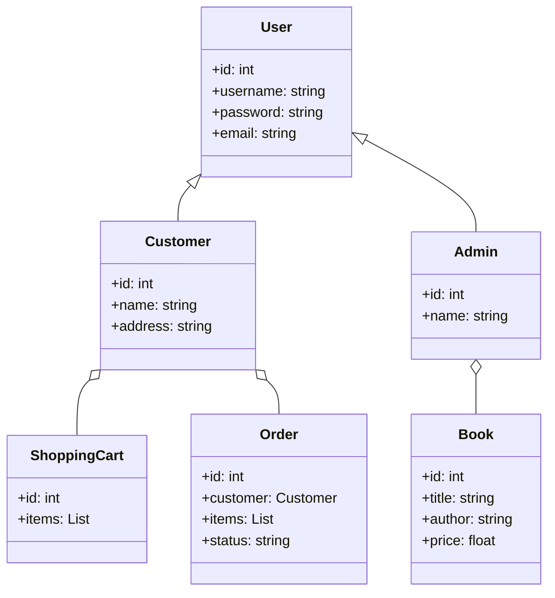
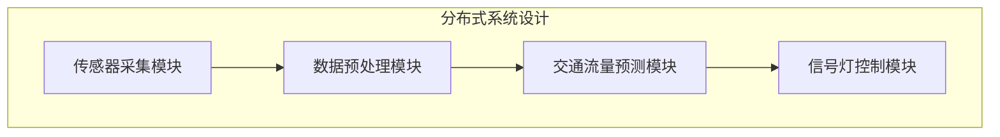

                 

## 形式与内容的统一：对象在OOP中的本体论地位

### 关键词：对象、OOP、本体论、形式与内容统一、抽象与具体性

> 摘要：本文深入探讨了对象在面向对象编程（OOP）中的本体论地位，分析了对象的概念、特性及其在OOP中的应用。通过逻辑清晰的框架和详细的步骤，揭示了对象在OOP中形式与内容的统一性，强调了对象在软件设计和开发中的核心作用。文章还展望了对象技术的未来发展趋势，为读者提供了深入的见解和实用的指导。

---

# 形式与内容的统一：对象在OOP中的本体论地位

## 目录大纲

### 第一部分：对象概念的本体论探讨

1. 对象的基本概念
   1.1 对象的定义
   1.2 对象的特性
   1.3 对象与实体、数据、过程的关系

2. 对象的本体论分析
   2.1 对象的本体论地位
   2.2 对象的内在结构
   2.3 对象的外在表现

3. 对象在OOP中的角色
   3.1 对象与类的关系
   3.2 对象与继承的关系
   3.3 对象与多态的关系

4. 对象的统一性探讨
   4.1 形式与内容的统一
   4.2 对象的抽象与具体性
   4.3 对象的动态特性

### 第二部分：对象在OOP中的应用

5. 对象在编程语言中的应用
   5.1 面向对象编程的基本原理
   5.2 对象的创建与销毁
   5.3 对象的通信与协作

6. 对象在软件工程中的应用
   6.1 对象建模与设计
   6.2 对象导向的软件开发方法
   6.3 对象的复用与维护

7. 对象在复杂系统设计中的应用
   7.1 对象在分布式系统设计中的应用
   7.2 对象在嵌入式系统设计中的应用
   7.3 对象在人工智能系统设计中的应用

### 第三部分：对象的未来发展

8. 对象的本体论扩展
   8.1 对象在物联网中的应用
   8.2 对象在区块链中的应用
   8.3 对象在量子计算中的应用

9. 对象的未来趋势
   9.1 对象与智能合约的结合
   9.2 对象在Web3.0中的应用
   9.3 对象在元宇宙中的应用

### 附录

A. 对象本体论的研究现状
B. 对象相关术语与概念
C. 对象相关工具与资源

---

## 形式与内容的统一：对象在OOP中的本体论地位

在软件工程和计算机科学领域，对象（Object）是面向对象编程（Object-Oriented Programming, OOP）的核心概念。OOP以其形式与内容的统一性，抽象与具体性的平衡，以及动态特性的灵活应用，成为现代软件开发的重要方法。本文将探讨对象在OOP中的本体论地位，深入分析对象的概念、特性、角色以及其统一性。

### 对象的基本概念

首先，我们需要明确对象的基本概念。对象是OOP中的基本单元，它是一种抽象的数据结构，代表现实世界中的实体、概念或系统。对象通常由一组属性（attributes）和方法（methods）组成，属性用于存储对象的特征数据，而方法则定义了对象的行为。

### 对象的特性

对象具有以下几个关键特性：

1. **标识唯一性**：每个对象都有一个唯一的标识符，用于区分不同的对象实例。
2. **封装性**：对象将内部状态和行为封装起来，只对外提供有限的接口，隐藏了内部实现细节。
3. **继承性**：对象可以继承其他对象的属性和方法，实现代码的复用和扩展。
4. **多态性**：对象可以根据接收的消息动态选择合适的行为，实现代码的灵活性和可扩展性。

### 对象与实体、数据、过程的关系

对象与实体、数据和过程之间有着密切的关系。实体是对现实世界中具体存在的事物的抽象，对象则是实体的具体实现。数据是对象的状态表示，而过程则是对对象行为的描述。

### 对象的本体论分析

从本体论的角度来看，对象具有独特的本体论地位。它们不仅代表现实世界的实体，还承载了抽象的概念和逻辑结构。对象的本体论地位主要体现在以下几个方面：

1. **对象的本体论地位**：对象作为OOP的基本构建块，其地位不仅在于实现功能，更在于其对现实世界的映射和抽象。
2. **对象的内在结构**：对象的内在结构包括属性和方法，这些结构元素共同决定了对象的行为和功能。
3. **对象的外在表现**：对象通过属性和方法与外部环境交互，其外在表现反映了对象的内在结构和状态。

### 对象在OOP中的角色

对象在OOP中扮演着多种角色，这些角色不仅体现了对象的多样性，也展示了OOP的强大功能：

1. **对象与类的关系**：类是对象的模板，对象是类的实例。类定义了对象的属性和方法，对象则是类的具体实现。
2. **对象与继承的关系**：继承是OOP的核心机制之一，通过继承，对象可以复用和扩展其他对象的属性和方法。
3. **对象与多态的关系**：多态使得对象可以根据不同的上下文环境，动态选择合适的行为，实现代码的灵活性和可扩展性。

### 对象的统一性探讨

对象的统一性体现在形式与内容的统一、抽象与具体性的平衡以及动态特性的灵活应用：

1. **形式与内容的统一**：对象通过属性和方法实现了形式与内容的统一，将数据和行为紧密结合在一起。
2. **对象的抽象与具体性**：对象在OOP中既具有高度的抽象性，又可以具体化成具体的实例，这种抽象与具体性的平衡使得对象具有广泛的应用性。
3. **对象的动态特性**：对象的动态特性使得它们能够根据不同的上下文环境，灵活地调整行为，实现代码的灵活性和可扩展性。

### 对象在OOP中的应用

对象在OOP中的广泛应用，使得其在软件设计和开发中发挥了重要作用。本文将详细探讨对象在编程语言中的应用、在软件工程中的应用以及对象在复杂系统设计中的应用。

1. **对象在编程语言中的应用**：面向对象编程的基本原理、对象的创建与销毁、对象的通信与协作。
2. **对象在软件工程中的应用**：对象建模与设计、对象导向的软件开发方法、对象的复用与维护。
3. **对象在复杂系统设计中的应用**：对象在分布式系统设计中的应用、对象在嵌入式系统设计中的应用、对象在人工智能系统设计中的应用。

### 对象的未来发展

随着技术的不断发展，对象技术也在不断演进。本文将展望对象技术的未来发展趋势，包括对象在物联网、区块链、量子计算中的应用，以及对象与智能合约、Web3.0、元宇宙的结合。

1. **对象的本体论扩展**：对象在物联网、区块链、量子计算中的应用。
2. **对象的未来趋势**：对象与智能合约的结合、对象在Web3.0中的应用、对象在元宇宙中的应用。

### 总结

对象是OOP中的核心概念，其形式与内容的统一性、抽象与具体性的平衡以及动态特性的灵活应用，使得对象在软件设计和开发中具有广泛的应用价值。本文通过详细的探讨和分析，揭示了对象在OOP中的本体论地位和重要作用，为读者提供了深入的见解和实用的指导。

---

## 第一部分：对象概念的本体论探讨

### 1. 对象的基本概念

在深入探讨对象的本体论地位之前，我们首先需要了解对象的基本概念。对象是面向对象编程（OOP）的核心元素，它是对现实世界中的实体、概念或系统进行抽象和建模的结果。在OOP中，对象通过属性（Attributes）和方法（Methods）来描述其状态和行为。

#### 1.1 对象的定义

对象是一种抽象的数据结构，它封装了数据和行为。在OOP中，对象通常具有以下特征：

- **标识唯一性**：每个对象都有唯一的标识符，用于在系统中区分不同的对象实例。
- **属性**：属性用于存储对象的特征数据，例如名称、大小、颜色等。
- **方法**：方法用于定义对象的行为，例如计算面积、移动位置等。

对象可以看作是现实世界中实体的模拟，如一辆车、一个人或一个公司的对象。

#### 1.2 对象的特性

对象的特性是理解对象在OOP中作用的关键。以下是对对象特性的详细分析：

- **封装性**：封装性是OOP的核心原则之一，它意味着对象将内部状态和行为封装起来，外部只能通过定义好的接口与对象交互。封装性有助于保护对象的内部实现细节，减少系统的复杂性。
- **继承性**：继承性允许一个类（Class）继承另一个类的属性和方法，实现代码的复用。通过继承，子类可以继承父类的特性，同时还可以添加新的特性或覆盖原有方法。
- **多态性**：多态性是指同一个方法在不同类型的对象上可以有不同的实现。多态性使得对象可以根据接收的消息动态选择合适的行为，从而提高代码的灵活性和可扩展性。

#### 1.3 对象与实体、数据、过程的关系

对象与实体、数据、过程之间有着密切的关系。以下是对这些关系的详细探讨：

- **对象与实体**：实体是对现实世界中具体存在的事物的抽象，对象则是实体的具体实现。例如，一个人是一个实体，而一个Person类的实例则是一个对象。
- **对象与数据**：对象通过属性来存储数据，这些数据反映了对象的状态。例如，一个Car对象可能有name、color、size等属性。
- **对象与过程**：对象的行为由方法定义，方法是对对象行为的描述。例如，一个Car对象可能有一个start_engine()方法来启动引擎。

### 对象的本体论分析

从本体论的角度来看，对象不仅是一种抽象的数据结构，还承载了抽象的概念和逻辑结构。对象的本体论地位主要体现在以下几个方面：

- **对象的本体论地位**：对象作为OOP的基本构建块，其地位不仅在于实现功能，更在于其对现实世界的映射和抽象。对象是现实世界到软件系统的桥梁。
- **对象的内在结构**：对象的内在结构包括属性和方法，这些结构元素共同决定了对象的行为和功能。属性反映了对象的状态，而方法则定义了对象的行为。
- **对象的外在表现**：对象通过属性和方法与外部环境交互，其外在表现反映了对象的内在结构和状态。例如，一个Car对象可以通过方法来改变其速度、方向等状态。

### 对象在OOP中的角色

对象在OOP中扮演着多种角色，这些角色不仅体现了对象的多样性，也展示了OOP的强大功能：

- **对象与类的关系**：类是对象的模板，对象是类的实例。类定义了对象的属性和方法，对象则是类的具体实现。类是抽象的，而对象是具体的。
- **对象与继承的关系**：继承是OOP的核心机制之一，通过继承，对象可以复用和扩展其他对象的属性和方法。继承使得代码更易于维护和扩展。
- **对象与多态的关系**：多态性使得对象可以根据不同的上下文环境，动态选择合适的行为，实现代码的灵活性和可扩展性。多态性是面向对象编程的核心特性之一。

### 对象的统一性探讨

对象的统一性体现在形式与内容的统一、抽象与具体性的平衡以及动态特性的灵活应用：

- **形式与内容的统一**：对象通过属性和方法实现了形式与内容的统一，将数据和行为紧密结合在一起。这种统一性有助于简化系统的设计和开发过程。
- **对象的抽象与具体性**：对象在OOP中既具有高度的抽象性，又可以具体化成具体的实例，这种抽象与具体性的平衡使得对象具有广泛的应用性。抽象性使得对象可以适用于不同的场景，具体性则使得对象具有实际的操作能力。
- **对象的动态特性**：对象的动态特性使得它们能够根据不同的上下文环境，灵活地调整行为，实现代码的灵活性和可扩展性。动态特性是面向对象编程的核心优势之一。

### 总结

通过对对象的基本概念、特性以及本体论地位的探讨，我们可以看到对象在OOP中具有至关重要的地位。对象不仅是对现实世界的抽象和建模，还是OOP中的核心构建块，通过封装性、继承性和多态性等特性，对象实现了形式与内容的统一、抽象与具体性的平衡以及动态特性的灵活应用。在接下来的部分，我们将进一步探讨对象在OOP中的应用，以深入理解对象在软件设计和开发中的作用。

---

## 1. 对象的基本概念

### 1.1 对象的定义

对象是面向对象编程（OOP）中的基本构建块，它是现实世界中实体、概念或系统的抽象表示。在OOP中，对象被视为具有状态和行为的实体，可以通过属性（attributes）和方法（methods）来描述。

一个对象通常由以下几部分组成：

1. **标识符**：每个对象都有一个唯一的标识符，用于在系统中区分不同的对象实例。
2. **属性**：属性是对象的状态表示，用于存储对象的特征数据。例如，一个Person对象可能具有name、age、gender等属性。
3. **方法**：方法是对象的行为表示，用于定义对象可以执行的操作。例如，一个Person对象可能有一个setName()方法来设置其姓名。

在OOP中，对象通过属性和方法实现了数据和行为的一体化，从而简化了系统设计和开发过程。

### 1.2 对象的特性

对象具有以下关键特性：

1. **标识唯一性**：每个对象都有唯一的标识符，这保证了对象在系统中可以被唯一识别。通常，对象的标识符是由系统自动分配的，例如使用内存地址或唯一标识符（UUID）。
   
2. **封装性**：封装性是OOP的核心原则之一，它意味着对象的内部状态和行为被封装起来，外部只能通过定义好的接口与对象交互。封装性有助于保护对象的内部实现细节，减少系统的复杂性，并且使得对象更容易维护和扩展。

3. **继承性**：继承性允许一个类（Class）继承另一个类的属性和方法，实现代码的复用。通过继承，子类可以继承父类的特性，同时还可以添加新的特性或覆盖原有方法。这有助于简化类的设计和实现，提高代码的可重用性。

4. **多态性**：多态性是指同一个方法在不同类型的对象上可以有不同的实现。多态性使得对象可以根据不同的上下文环境，动态选择合适的行为，实现代码的灵活性和可扩展性。多态性是面向对象编程的核心特性之一。

### 1.3 对象与实体、数据、过程的关系

对象与实体、数据和过程之间有着密切的关系：

1. **对象与实体**：实体是对现实世界中具体存在的事物的抽象，对象则是实体的具体实现。例如，一个人是一个实体，而一个Person类的实例是一个对象。

2. **对象与数据**：对象通过属性来存储数据，这些数据反映了对象的状态。例如，一个Car对象可能有name、color、size等属性。

3. **对象与过程**：对象的行为由方法定义，方法是对对象行为的描述。例如，一个Car对象可能有一个start_engine()方法来启动引擎。

### 1.4 对象的内在结构

对象的内在结构通常包括以下几个方面：

1. **属性**：属性是对象的状态表示，用于存储对象的特征数据。属性可以是基本数据类型（如整数、字符串、布尔值），也可以是引用类型（如数组、对象）。

2. **方法**：方法是对象的行为表示，用于定义对象可以执行的操作。方法通常包括输入参数和返回值，可以调用其他对象的方法，甚至修改自己的状态。

3. **行为**：对象的行为是通过方法来实现的。对象可以响应外部事件，根据外部事件执行相应的操作，并可能修改自身的状态。

### 1.5 对象的外在表现

对象的外在表现是通过属性和方法与外部环境交互来体现的。以下是对对象外在表现的详细探讨：

1. **属性访问**：对象通过属性访问来获取和修改其内部状态。通常，对象的属性访问是通过getter和setter方法来实现的。

2. **方法调用**：对象通过方法调用执行特定的操作。方法调用可以是同步的，也可以是异步的，取决于对象实现的具体方式。

3. **接口**：对象的接口是其与外部环境交互的接口。接口定义了对象可以对外提供的服务，包括方法的名称、输入参数和返回值。

### 1.6 对象的生命周期

对象的生命周期是指对象从创建到销毁的过程。以下是对对象生命周期的详细探讨：

1. **创建**：对象创建是通过调用构造函数（Constructor）来实现的。构造函数初始化对象的属性，并可能执行一些初始化操作。

2. **使用**：对象创建后，就可以使用其方法和属性来执行操作。对象的使用是程序逻辑的一部分，通常涉及到对象间的交互和协作。

3. **销毁**：对象销毁是通过调用析构函数（Destructor）来实现的。析构函数释放对象占用的资源，并执行一些清理操作。在有些编程语言中，对象的销毁是自动进行的，而在其他语言中，需要手动调用析构函数。

### 1.7 对象的示例

以下是一个简单的Python对象示例，展示了对象的定义、创建和使用：

```python
class Person:
    def __init__(self, name, age):
        self.name = name
        self.age = age

    def greet(self):
        print(f"Hello, my name is {self.name} and I am {self.age} years old.")

# 创建对象实例
person1 = Person("Alice", 30)

# 使用对象的方法
person1.greet()  # 输出：Hello, my name is Alice and I am 30 years old.
```

在这个示例中，Person类定义了一个Person对象，具有name和age属性，以及一个greet()方法。通过创建Person对象实例，我们可以使用对象的方法来访问其属性和执行操作。

### 1.8 对象的基本操作

对象的基本操作包括对象的创建、使用、修改和销毁。以下是对这些基本操作的详细探讨：

1. **创建**：创建对象是通过调用类的构造函数来实现的。构造函数初始化对象的属性，并可能执行一些初始化操作。
   
2. **使用**：使用对象是指通过调用对象的方法和访问其属性来执行操作。对象的使用是程序逻辑的一部分，通常涉及到对象间的交互和协作。

3. **修改**：修改对象是指通过设置对象的属性来改变其状态。这通常是通过对象的方法来实现的，例如，通过一个setter方法来修改对象的某个属性。

4. **销毁**：销毁对象是通过调用类的析构函数来实现的。析构函数释放对象占用的资源，并执行一些清理操作。在有些编程语言中，对象的销毁是自动进行的，而在其他语言中，需要手动调用析构函数。

### 1.9 对象的典型应用场景

对象在OOP中的应用非常广泛，以下是一些典型的应用场景：

1. **软件设计**：在软件设计阶段，使用对象来表示现实世界中的实体和概念，从而构建出系统的架构和模块。

2. **软件开发**：在软件开发阶段，使用对象来实现系统的功能，通过对象的协作和通信，实现系统的高效运行。

3. **数据处理**：在数据处理阶段，使用对象来表示数据结构和算法，从而方便数据的存储、检索和处理。

4. **游戏开发**：在游戏开发中，使用对象来表示游戏中的角色、场景和物品，从而实现游戏的交互和动态效果。

5. **人工智能**：在人工智能领域，使用对象来表示知识、模型和数据，从而实现智能决策和推理。

### 总结

通过对对象的基本概念、特性、内在结构、外在表现、生命周期以及基本操作的探讨，我们可以看到对象在OOP中具有至关重要的地位。对象不仅是对现实世界的抽象和建模，还通过封装性、继承性和多态性等特性实现了形式与内容的统一，为软件设计和开发提供了强大的工具。在接下来的部分，我们将继续探讨对象在OOP中的具体应用，以深入理解对象在软件开发中的作用。

---

## 2. 对象的本体论分析

从本体论的角度来看，对象不仅是面向对象编程（OOP）中的核心概念，更是其形式与内容的统一体。在这一部分，我们将深入探讨对象的本体论地位，分析对象的内在结构及其外在表现，以理解对象在OOP中的核心作用。

### 2.1 对象的本体论地位

对象的本体论地位体现在其作为现实世界到软件系统的桥梁。在OOP中，对象不仅是对现实世界中实体、概念或系统的抽象表示，还承载了抽象的概念和逻辑结构。具体来说，对象的本体论地位可以从以下几个方面来理解：

1. **映射现实世界**：对象作为抽象表示，映射了现实世界中的实体、概念或系统。例如，在应用程序中，对象可以表示用户、产品、订单等实体，从而将现实世界的复杂性转化为软件系统可以处理的抽象模型。

2. **承载逻辑结构**：对象不仅代表了现实世界的实体，还承载了其逻辑结构。对象的属性和方法定义了对象的状态和行为，这些逻辑结构共同构成了软件系统的核心框架。

3. **体现抽象和具体性**：对象在OOP中既具有高度的抽象性，又可以具体化成具体的实例。抽象性使得对象可以适用于不同的场景，而具体性则使得对象具有实际的操作能力。这种抽象与具体性的平衡，是OOP能够有效建模和解决复杂问题的基础。

### 2.2 对象的内在结构

对象的内在结构包括属性（attributes）和方法（methods），这些结构元素共同决定了对象的行为和功能。以下是对对象内在结构的详细分析：

1. **属性**：属性是对象的状态表示，用于存储对象的特征数据。属性可以是基本数据类型（如整数、字符串、布尔值），也可以是引用类型（如数组、对象）。属性反映了对象在某一时刻的状态，例如，一个Person对象的name、age和address属性。

2. **方法**：方法是对象的行为表示，用于定义对象可以执行的操作。方法通常包括输入参数和返回值，可以调用其他对象的方法，甚至修改自己的状态。例如，一个Person对象可能有一个setName()方法来设置其姓名，或者一个moveTo()方法来改变其位置。

3. **行为**：对象的行为是通过方法来实现的。对象可以响应外部事件，根据外部事件执行相应的操作，并可能修改自身的状态。行为不仅定义了对象的功能，还体现了对象的动态特性。

### 2.3 对象的外在表现

对象的外在表现是通过属性和方法与外部环境交互来体现的。以下是对对象外在表现的详细探讨：

1. **属性访问**：对象通过属性访问来获取和修改其内部状态。通常，对象的属性访问是通过getter和setter方法来实现的。例如，一个Person对象的getName()方法可以获取其姓名，而setName()方法可以设置其姓名。

2. **方法调用**：对象通过方法调用执行特定的操作。方法调用可以是同步的，也可以是异步的，取决于对象实现的具体方式。例如，一个Person对象的greet()方法可以用来打印问候语。

3. **接口**：对象的接口是其与外部环境交互的接口。接口定义了对象可以对外提供的服务，包括方法的名称、输入参数和返回值。例如，一个Person对象可能有一个接口，包括getName()、setName()和greet()等方法。

### 2.4 对象的生命周期

对象的生命周期是指对象从创建到销毁的过程。以下是对对象生命周期的详细探讨：

1. **创建**：对象创建是通过调用构造函数（Constructor）来实现的。构造函数初始化对象的属性，并可能执行一些初始化操作。例如，一个Person对象的构造函数可能初始化其name、age和address属性。

2. **使用**：对象创建后，就可以使用其方法和属性来执行操作。对象的使用是程序逻辑的一部分，通常涉及到对象间的交互和协作。

3. **销毁**：对象销毁是通过调用析构函数（Destructor）来实现的。析构函数释放对象占用的资源，并执行一些清理操作。在有些编程语言中，对象的销毁是自动进行的，而在其他语言中，需要手动调用析构函数。

### 2.5 对象的封装性

封装性是OOP的核心原则之一，它意味着对象的内部状态和行为被封装起来，外部只能通过定义好的接口与对象交互。封装性有助于保护对象的内部实现细节，减少系统的复杂性，并且使得对象更容易维护和扩展。

1. **内部实现细节**：对象内部实现细节被封装起来，外部无法直接访问。例如，一个Person对象的内部实现可能包括姓名的存储和管理，但外部无法直接访问这些细节。

2. **外部接口**：对象通过外部接口与外部环境交互。外部接口定义了对象可以对外提供的服务，例如，一个Person对象的外部接口可能包括getName()、setName()和greet()等方法。

### 2.6 对象的继承性

继承性是OOP的另一个核心原则，它允许一个类（Class）继承另一个类的属性和方法，实现代码的复用。通过继承，子类可以继承父类的特性，同时还可以添加新的特性或覆盖原有方法。

1. **父类与子类**：在继承关系中，父类（Base Class）定义了通用的属性和方法，而子类（Derived Class）可以继承父类的特性，并添加或覆盖新的特性。

2. **代码复用**：继承性使得代码复用变得容易。通过继承，子类可以复用父类的代码，减少冗余，提高代码的可维护性和可扩展性。

### 2.7 对象的多态性

多态性是OOP的另一个核心特性，它使得对象可以根据不同的上下文环境，动态选择合适的行为，实现代码的灵活性和可扩展性。

1. **方法重载与重写**：多态性通过方法重载（Method Overloading）和方法重写（Method Overriding）来实现。方法重载是指同一类中可以存在多个具有相同名称但不同参数列表的方法，而方法重写是指子类可以覆盖父类的同名方法，以实现不同的行为。

2. **接口与实现**：多态性使得对象可以根据接口与实现分离，从而提高代码的灵活性和可扩展性。例如，一个方法可以接受一个实现了特定接口的对象，而不需要知道具体的实现细节。

### 2.8 对象的统一性

对象的统一性体现在形式与内容的统一、抽象与具体性的平衡以及动态特性的灵活应用：

1. **形式与内容的统一**：对象通过属性和方法实现了形式与内容的统一，将数据和行为紧密结合在一起。

2. **抽象与具体性**：对象在OOP中既具有高度的抽象性，又可以具体化成具体的实例，这种抽象与具体性的平衡使得对象具有广泛的应用性。

3. **动态特性**：对象的动态特性使得它们能够根据不同的上下文环境，灵活地调整行为，实现代码的灵活性和可扩展性。

### 总结

通过对对象的本体论地位、内在结构、外在表现以及封装性、继承性和多态性的分析，我们可以看到对象在OOP中的核心作用。对象不仅是对现实世界的抽象和建模，还通过形式与内容的统一、抽象与具体性的平衡以及动态特性的灵活应用，实现了OOP的强大功能。在接下来的部分，我们将探讨对象在OOP中的具体应用，以进一步理解对象在软件设计和开发中的作用。

---

## 3. 对象在OOP中的角色

对象在面向对象编程（OOP）中扮演着多种角色，这些角色不仅体现了对象的多样性，也展示了OOP的强大功能。理解对象在这些角色中的具体作用，对于深入掌握OOP及其应用至关重要。以下是对对象在OOP中角色的详细探讨：

### 3.1 对象与类的关系

类（Class）是对象的模板，对象（Object）是类的实例。类定义了对象的属性和方法，而对象则是具体实现。以下是对对象与类关系的详细分析：

1. **类定义**：类是对一类具有相似属性和行为的对象的抽象描述。类定义了对象的属性（attributes）和方法（methods）。例如，一个`Person`类可能包含属性如`name`、`age`和`gender`，以及方法如`greet`和`work`。

2. **对象实例化**：通过类，我们可以创建对象实例。实例化（Instantiation）是将类定义的具体化过程，即创建一个具体的对象。例如，我们可以通过`Person`类创建一个名为`alice`的对象，如下所示：

   ```python
   class Person:
       def __init__(self, name, age):
           self.name = name
           self.age = age
       
       def greet(self):
           print(f"Hello, my name is {self.name} and I am {self.age} years old.")
   
   alice = Person("Alice", 30)
   ```

3. **继承与扩展**：类支持继承（Inheritance），这意味着子类可以继承父类的属性和方法，并可以添加或覆盖新的特性。通过继承，我们可以创建具有通用特性的类，同时为特定需求进行扩展。例如，一个`Employee`类可以继承自`Person`类，同时添加属性如`position`和`salary`：

   ```python
   class Employee(Person):
       def __init__(self, name, age, position, salary):
           super().__init__(name, age)
           self.position = position
           self.salary = salary
       
       def work(self):
           print(f"{self.name} is working as a {self.position} with a salary of {self.salary} dollars.")
   ```

### 3.2 对象与继承的关系

继承是OOP的核心机制之一，它使得对象可以复用和扩展其他对象的属性和方法。以下是对对象与继承关系的详细分析：

1. **父类与子类**：在继承关系中，父类（Base Class）定义了通用的属性和方法，而子类（Derived Class）可以继承父类的特性，并添加或覆盖新的特性。例如，一个`Person`类可以是所有员工的父类，而`Employee`类是一个特定的子类。

2. **多态**：继承与多态（Polymorphism）紧密相关。多态允许对象根据上下文环境动态选择合适的方法实现。例如，一个`Person`类型的引用可以指向一个`Employee`对象，通过调用`greet`方法，会根据对象的实际类型执行相应的行为。

3. **代码复用**：继承有助于代码复用。通过继承，子类可以复用父类的代码，减少冗余，提高代码的可维护性和可扩展性。例如，一个`Employee`类可以从`Person`类继承属性和方法，而不需要重新定义。

### 3.3 对象与多态的关系

多态性是OOP的另一个核心特性，它使得对象可以根据不同的上下文环境，动态选择合适的行为，实现代码的灵活性和可扩展性。以下是对对象与多态关系的详细分析：

1. **方法重写**：多态性通过方法重写（Method Overriding）来实现。在子类中，可以重写从父类继承的方法，以实现特定的行为。例如，一个`Manager`类可以重写`Person`类的`greet`方法，以实现不同的问候方式。

   ```python
   class Manager(Person):
       def greet(self):
           print(f"Hello, my name is {self.name} and I am the manager here.")
   ```

2. **方法重载**：方法重载（Method Overloading）是指在同一类中可以存在多个具有相同名称但不同参数列表的方法。这种方法可以在不同的上下文环境中动态选择合适的方法实现。

3. **接口与实现**：多态性使得接口与实现分离，从而提高代码的灵活性和可扩展性。例如，一个方法可以接受一个实现了特定接口的对象，而不需要知道具体的实现细节。

### 3.4 对象与封装的关系

封装性是OOP的核心原则之一，它意味着对象的内部状态和行为被封装起来，外部只能通过定义好的接口与对象交互。以下是对对象与封装关系的详细分析：

1. **封装性优点**：封装性有助于保护对象的内部实现细节，减少系统的复杂性。通过封装，对象的内部变化不会影响到其他对象，从而提高代码的可维护性。

2. **私有属性和方法**：在类中，可以通过将属性和方法标记为私有（private），来限制外部对它们的直接访问。例如，一个`Person`类的`_name`和`_age`属性可以设置为私有，以确保它们只能通过公共方法访问。

3. **公共接口**：通过定义公共接口（public interface），对象可以对外提供一系列的服务，而隐藏其内部实现细节。公共接口定义了对象可以对外提供的方法和属性，从而简化了对象的交互。

### 3.5 对象与状态和行为的关系

对象的状态和行为是其核心特性。以下是对对象与状态和行为关系的详细分析：

1. **状态**：对象的状态是指其在某一时刻的特征数据的集合。对象的状态通常由属性来表示。例如，一个`Person`对象的状态可能包括其姓名、年龄和性别。

2. **行为**：对象的行为是指对象可以执行的操作。对象的行为通常由方法来表示。例如，一个`Person`对象可以执行如`greet`、`work`和`eat`等操作。

3. **状态和行为的关系**：对象的状态和行为密切相关。状态决定了对象的行为，而行为会改变对象的状态。例如，一个`Person`对象的状态包括其姓名和年龄，而行为如`greet`和`work`会改变其状态。

### 3.6 对象与面向对象设计的关系

面向对象设计（Object-Oriented Design, OOD）是软件设计的一种方法，它基于对象的抽象和复用来构建系统的结构和行为。以下是对对象与面向对象设计关系的详细分析：

1. **模块化**：面向对象设计通过对象来实现模块化，将复杂的系统划分为多个相互独立、可重用的模块。每个模块负责一个特定的功能，从而提高了系统的可维护性和可扩展性。

2. **抽象与具体性**：面向对象设计利用对象的抽象与具体性，将复杂的问题分解为更易于管理的部分。通过抽象，我们可以忽略实现细节，专注于系统的核心功能。

3. **复用性**：面向对象设计通过继承和多态，实现了代码的复用。通过继承，我们可以复用通用代码，而多态性使得对象可以根据上下文环境动态选择合适的实现。

### 总结

通过对对象在OOP中角色的详细探讨，我们可以看到对象在OOP中具有多种重要角色，包括类实例、继承关系的载体、多态性的实现、封装性的体现、状态和行为的表示，以及面向对象设计的核心元素。这些角色共同构成了OOP的强大功能，使得对象成为现代软件开发的重要工具。在接下来的部分，我们将深入探讨对象在OOP中的应用，以进一步理解对象在软件开发中的作用。

---

## 4. 对象的统一性探讨

在面向对象编程（OOP）中，对象的统一性是一个核心概念，它强调了形式与内容的紧密结合、抽象与具体性的平衡以及动态特性的灵活应用。对象的统一性不仅使得OOP成为一种强大的编程方法，还提高了软件的可维护性和可扩展性。以下是对对象统一性的详细探讨。

### 4.1 形式与内容的统一

对象的统一性首先体现在形式与内容的统一上。在OOP中，对象的形式（即对象的定义和结构）与内容（即对象的属性和方法）是不可分割的。这种统一性使得对象的定义不仅描述了对象的内部结构，还定义了对象的行为。以下是对形式与内容统一性的详细分析：

1. **属性与方法结合**：在OOP中，对象的属性（如数据字段）和方法（如操作函数）紧密结合在一起。这种结合不仅简化了对象的定义，还使得对象的操作更加直观和自然。

2. **对象的状态与行为**：对象的属性描述了对象的状态，而方法则定义了对象的行为。通过属性和方法的一致性，我们可以清晰地理解对象的行为是如何基于其状态的。例如，一个`Car`对象的状态包括颜色、型号和速度，而其方法如`start()`、`accelerate()`和`brake()`则定义了对象的行为。

3. **简化复杂系统**：形式与内容的统一性有助于简化复杂系统的设计和实现。通过将系统划分为一系列相互关联的对象，我们可以将复杂的系统问题分解为更易于管理和实现的独立部分。这种分解不仅提高了代码的可维护性，还使得系统更易于扩展。

### 4.2 对象的抽象与具体性

对象的统一性还体现在抽象与具体性的平衡上。在OOP中，对象通过抽象来隐藏实现细节，同时保持具体性以适应特定场景。以下是对抽象与具体性统一性的详细分析：

1. **抽象**：抽象是一种从复杂系统中提取关键特征，忽略非关键细节的方法。在OOP中，抽象通过类和对象来实现，类定义了对象的通用特征，而对象则是类的具体实例。通过抽象，我们可以将复杂系统简化为一系列相互关联的对象。

2. **具体性**：具体性是指对象在实际场景中的具体实现。对象的具体性使得它们能够适应不同的应用场景。例如，一个`Person`类可以定义通用属性和方法，而具体对象如`Alice`和`Bob`则可以有不同的姓名和年龄。

3. **抽象与具体性的平衡**：在OOP中，抽象与具体性的平衡是实现有效软件设计的关键。通过适度的抽象，我们可以提高代码的复用性和可维护性；而通过保持具体性，我们可以确保对象能够适应特定的应用场景。例如，一个`BankAccount`类可以抽象出通用的存款、取款和转账功能，而具体的`SavingsAccount`和`CheckingAccount`对象则可以根据具体的业务需求进行扩展。

### 4.3 对象的动态特性

对象的统一性还包括对象的动态特性，这些特性使得对象可以根据不同的上下文环境动态调整其行为。以下是对对象动态特性的详细分析：

1. **多态性**：多态性是对象的动态特性之一，它使得对象可以以多种形式存在和表现。在OOP中，多态性通过继承和方法重写来实现。例如，一个`Shape`类可以有多个子类，如`Circle`、`Rectangle`和`Triangle`，每个子类可以重写`draw()`方法以实现不同的绘制行为。

2. **动态绑定**：动态绑定（Dynamic Binding）是指方法调用在程序运行时根据对象的实际类型进行绑定。这种绑定使得对象可以根据其当前状态和上下文环境选择合适的方法实现。例如，一个`BankAccount`对象可能在不同的上下文中调用不同的操作方法，如`deposit()`、`withdraw()`或`transfer()`。

3. **灵活的交互**：对象的动态特性使得对象之间的交互更加灵活。通过多态性和动态绑定，对象可以以更灵活的方式协同工作，从而实现复杂的业务逻辑。例如，一个`Order`对象可以与多个`Product`对象进行交互，以计算总价和税费。

### 4.4 统一性在实际应用中的体现

对象的统一性在实际应用中体现得淋漓尽致。以下是一些具体的应用场景：

1. **软件设计**：在软件设计过程中，对象的统一性有助于构建模块化和可重用的组件。通过抽象和具体性的平衡，我们可以将复杂的系统分解为一系列相互关联的对象，从而提高设计的清晰度和可维护性。

2. **软件开发**：在软件开发过程中，对象的统一性使得开发人员可以专注于特定功能的实现，而不需要关心其他对象的具体细节。这种分离不仅提高了开发效率，还降低了系统复杂性。

3. **软件复用**：对象的统一性使得代码复用变得更加容易。通过继承和多态，我们可以复用通用的代码和逻辑，从而减少冗余，提高系统的可维护性。

4. **系统扩展**：对象的统一性使得系统扩展变得更加灵活。通过动态特性和多态性，我们可以根据需要添加新的功能或修改现有功能，而不会影响系统的整体结构。

### 总结

通过对对象统一性的探讨，我们可以看到形式与内容的统一、抽象与具体性的平衡以及动态特性的灵活应用是如何共同作用，使得对象成为OOP中的核心概念。对象的统一性不仅简化了系统的设计和实现，还提高了系统的可维护性和可扩展性。在软件开发中，理解并充分利用对象的统一性，是构建高效、灵活和可维护系统的重要基础。

---

## 第二部分：对象在OOP中的应用

### 5. 对象在编程语言中的应用

面向对象编程（OOP）的核心在于通过对象来组织和实现程序。对象作为数据和行为的封装体，在编程语言中的应用极大地提升了代码的可维护性、可扩展性和复用性。以下是对对象在编程语言中的应用的详细探讨。

#### 5.1 面向对象编程的基本原理

面向对象编程的基本原理主要包括：

1. **封装**：封装是OOP的核心原则之一，它意味着将数据和操作数据的方法封装在一起，形成一个对象。封装有助于隐藏对象的内部实现细节，仅通过公共接口与外部进行交互。

2. **继承**：继承是一种通过创建新类来扩展现有类的能力。子类可以继承父类的属性和方法，并可以添加新的属性和方法或覆盖原有的方法。继承是实现代码复用的重要机制。

3. **多态**：多态性指的是同一操作作用于不同的对象时，可以有不同的解释和行为。多态性通过方法重写和接口来实现，使得代码更加灵活和可扩展。

4. **抽象**：抽象是将复杂系统的本质特征提取出来，忽略非本质细节的过程。抽象使得我们可以处理复杂系统，而不需要关心其所有细节。

#### 5.2 对象的创建与销毁

在面向对象编程中，对象的创建与销毁是关键操作。以下是对这些操作的详细探讨：

1. **创建对象**：对象的创建通常通过调用类的构造函数来实现。构造函数初始化对象的属性，并为对象分配内存。例如，在Python中，创建一个`Person`对象的代码如下：

   ```python
   class Person:
       def __init__(self, name, age):
           self.name = name
           self.age = age
   
   alice = Person("Alice", 30)
   ```

2. **访问对象的属性和方法**：创建对象后，可以通过`.`操作符访问其属性和方法。例如，访问`alice`对象的姓名和年龄：

   ```python
   print(alice.name)  # 输出：Alice
   print(alice.age)   # 输出：30
   ```

3. **销毁对象**：对象的销毁通常通过垃圾回收机制来实现。在许多编程语言中，当对象不再被引用时，垃圾回收器会自动回收其占用的内存。在某些语言中，例如C++，需要手动调用析构函数来释放资源。例如，在Python中，对象的销毁是自动的：

   ```python
   alice = Person("Alice", 30)
   # 在此处，alice对象可能会被销毁
   ```

#### 5.3 对象的通信与协作

对象之间的通信与协作是OOP的重要组成部分。以下是对这些通信机制的详细探讨：

1. **方法调用**：对象之间可以通过方法调用进行通信。例如，一个`Person`对象可以调用另一个`BankAccount`对象的方法来执行存款或取款操作：

   ```python
   class BankAccount:
       def deposit(self, amount):
           # 存款逻辑
           print(f"{amount} dollars have been deposited.")
   
   alice_account = BankAccount()
   alice_account.deposit(100)
   ```

2. **事件处理**：在图形用户界面（GUI）编程中，对象可以通过事件处理进行通信。例如，当用户点击一个按钮时，按钮对象会触发一个事件，然后相关的对象（如窗口对象）会响应这个事件。例如，在Java中，一个按钮点击事件的处理如下：

   ```java
   class ButtonListener implements ActionListener {
       public void actionPerformed(ActionEvent e) {
           System.out.println("Button clicked!");
       }
   }
   
   JButton button = new JButton("Click me");
   ButtonListener listener = new ButtonListener();
   button.addActionListener(listener);
   ```

3. **回调函数**：回调函数是一种在对象之间传递函数引用的方式，使得一个对象可以在另一个对象的方法中被调用。例如，在JavaScript中，可以通过回调函数实现异步操作，如下所示：

   ```javascript
   function fetchData(callback) {
       // 异步获取数据的逻辑
       callback("Data fetched successfully!");
   }
   
   function handleData(data) {
       console.log(data);
   }
   
   fetchData(handleData);
   ```

#### 5.4 对象的继承与多态

继承和多态是OOP的两大核心特性，它们在对象的应用中起着至关重要的作用。以下是对这些特性的详细探讨：

1. **继承**：继承允许一个类继承另一个类的属性和方法，从而实现代码的复用。例如，一个`Employee`类可以继承自`Person`类，并添加新的属性和方法：

   ```python
   class Person:
       def __init__(self, name, age):
           self.name = name
           self.age = age
   
   class Employee(Person):
       def __init__(self, name, age, employee_id):
           super().__init__(name, age)
           self.employee_id = employee_id
   
       def work(self):
           print(f"{self.name} is working.")
   ```

2. **多态**：多态性使得同一操作可以作用于不同的对象，并产生不同的结果。多态性通过方法重写和接口实现。例如，一个`Shape`类可以有多个子类，每个子类可以重写`calculate_area()`方法：

   ```python
   class Shape:
       def calculate_area(self):
           pass
   
   class Rectangle(Shape):
       def __init__(self, width, height):
           self.width = width
           self.height = height
   
       def calculate_area(self):
           return self.width * self.height
   
   rect = Rectangle(5, 10)
   print(rect.calculate_area())  # 输出：50
   ```

### 5.5 对象在编程语言中的实例

以下是一个简单的实例，展示对象在编程语言中的应用：

**Python实例**：

```python
class Animal:
    def __init__(self, name):
        self.name = name
    
    def make_sound(self):
        pass

class Dog(Animal):
    def make_sound(self):
        return "Bark!"

class Cat(Animal):
    def make_sound(self):
        return "Meow!"

dog = Dog("Buddy")
cat = Cat("Whiskers")

print(dog.make_sound())  # 输出：Bark!
print(cat.make_sound())  # 输出：Meow!
```

在这个实例中，`Dog`和`Cat`类都继承自`Animal`类，并重写了`make_sound()`方法，以实现不同的声音。

### 总结

通过对对象在编程语言中的应用的详细探讨，我们可以看到对象如何通过封装、继承、多态等特性，在OOP中实现了数据和行为的一体化。对象的创建与销毁、通信与协作，以及继承与多态，都是对象在OOP中的重要应用。这些特性不仅提高了代码的可维护性和可扩展性，还为软件开发提供了强大的工具。

---

## 6. 对象在软件工程中的应用

在软件工程中，对象作为一种重要的抽象机制，被广泛应用于系统建模、设计和开发过程中。对象不仅有助于提高软件的可维护性、可扩展性和复用性，还使得复杂系统的设计和实现变得更加直观和高效。以下是对对象在软件工程中应用的详细探讨。

### 6.1 对象建模与设计

对象建模与设计是软件工程中重要的步骤，它涉及到使用对象来表示系统的需求、结构和行为。以下是对对象建模与设计的详细分析：

1. **对象建模**：对象建模是系统分析和设计阶段的核心任务，它通过对现实世界的抽象和建模，生成系统的对象模型。对象模型通常包括对象、类、关系和属性等信息。常用的建模工具包括UML（统一建模语言）、Mermaid等。

2. **类图**：类图是UML中最常用的图表之一，用于表示系统中类的结构。类图展示了类的属性、方法和关系。以下是一个简单的Mermaid类图示例：

   ```mermaid
   classDiagram
       Class01 <|-- SubClass01
       Class01 o-- Object01
       Class01 :+ sayHello()
   class Class01 {
       +int id
       +String name
       +float salary
       +void sayHello()
   }
   class SubClass01 {
       +int subId
   }
   Object01 : Class01
   ```

   在这个类图中，`Class01`是一个基类，`SubClass01`是其子类，`Object01`是一个`Class01`的对象实例。通过类图，我们可以清晰地了解系统中类的层次结构和关系。

3. **领域模型**：领域模型是一种用于描述特定业务领域对象的模型。它通常包括领域对象、关系和规则。领域模型有助于理解业务需求和设计系统架构。以下是一个简单的Mermaid领域模型示例：

   ```mermaid
  erModel
   class Person {
       +id: int
       +name: string
       +email: string
   }
   class Address {
       +id: int
       +street: string
       +city: string
       +zipCode: string
   }
   Person o-- Address :1..*
   ```

   在这个领域模型中，`Person`类代表人员，`Address`类代表地址。一个`Person`可以有多个`Address`，这种一对多关系通过`o--`表示。

### 6.2 对象导向的软件开发方法

对象导向的软件开发方法（Object-Oriented Software Development, OOSD）是一种基于对象和面向对象概念的软件开发过程。以下是对对象导向的软件开发方法的详细分析：

1. **需求分析**：在需求分析阶段，通过使用对象模型来捕捉和分析系统的需求。对象模型可以帮助开发人员理解系统的功能和行为，确保需求被准确地捕获。

2. **设计**：在系统设计阶段，使用面向对象的设计原则和模式来设计系统的结构和行为。面向对象的设计原则包括单一职责原则、开闭原则、里氏替换原则等。面向对象的设计模式，如工厂模式、单例模式、观察者模式等，可以帮助解决常见的软件设计问题。

3. **编码**：在编码阶段，开发人员使用面向对象的编程语言（如Java、C++、Python）来实现设计阶段定义的类和对象。面向对象编程的语法和特性，如封装、继承、多态等，使得编码过程更加直观和高效。

4. **测试**：在测试阶段，使用面向对象的测试方法来验证系统的功能和性能。面向对象的测试方法，如单元测试、集成测试、系统测试等，可以确保对象的行为符合设计要求。

### 6.3 对象的复用与维护

对象的复用与维护是软件工程中重要的目标之一。以下是对对象的复用与维护的详细分析：

1. **复用**：对象可以通过多种方式实现复用，如类库、设计模式、框架等。复用不仅提高了开发效率，还减少了代码冗余，提高了系统的可维护性。

2. **设计模式**：设计模式是一组在软件设计过程中常用的问题解决方案。面向对象的设计模式，如工厂模式、策略模式、适配器模式等，可以帮助开发人员解决常见的软件设计问题，提高代码的可复用性。

3. **框架**：框架是一组预定义的类和对象的集合，用于实现系统的基本功能。使用框架可以简化开发过程，提高代码的可复用性。例如，Web应用开发中的框架，如Django、Spring等，提供了丰富的对象和接口，使得开发人员可以专注于业务逻辑的实现。

4. **维护**：对象的可维护性是软件质量的重要指标之一。为了提高对象的可维护性，可以采用以下策略：

   - **模块化**：将系统划分为多个模块，每个模块负责一个特定的功能。模块化使得代码更加清晰，易于理解和维护。
   - **封装**：通过封装，将对象的内部实现细节隐藏起来，仅暴露必要的接口。这有助于减少模块之间的依赖，提高代码的可维护性。
   - **文档**：编写详细的文档，包括类的说明、方法的使用和参数等，有助于其他开发人员理解和使用对象。
   - **自动化测试**：编写自动化测试用例，确保对象的行为符合预期。自动化测试有助于发现和修复代码中的错误，提高系统的稳定性。

### 6.4 对象导向的软件开发方法的实例

以下是一个简单的对象导向的软件开发方法的实例，展示从需求分析、设计到编码的整个过程：

**需求分析**：

一个在线书店系统，需要实现以下功能：

- 用户可以注册、登录和浏览书籍。
- 用户可以添加书籍到购物车，并结算。
- 管理员可以添加新书籍和管理用户。

**设计**：

使用UML类图和领域模型来表示系统的需求。



**编码**：

使用Python实现系统的功能。

```python
class User:
    def __init__(self, username, password, email):
        self.username = username
        self.password = password
        self.email = email

class Customer(User):
    def __init__(self, username, password, email, name, address):
        super().__init__(username, password, email)
        self.name = name
        self.address = address

class Admin(User):
    def __init__(self, username, password, email, name):
        super().__init__(username, password, email)
        self.name = name

class ShoppingCart:
    def __init__(self):
        self.items = []

    def add_book(self, book):
        self.items.append(book)

    def remove_book(self, book):
        self.items.remove(book)

class Order:
    def __init__(self, customer, items, status):
        self.customer = customer
        self.items = items
        self.status = status

class Book:
    def __init__(self, id, title, author, price):
        self.id = id
        self.title = title
        self.author = author
        self.price = price
```

### 总结

通过对对象在软件工程中的应用的详细探讨，我们可以看到对象在系统建模与设计、软件开发方法、复用与维护等方面的重要作用。对象作为一种抽象机制，不仅提高了软件的可维护性、可扩展性和复用性，还为复杂系统的设计和实现提供了强大的工具。在软件开发过程中，理解并充分利用对象的概念和特性，是构建高效、灵活和可维护系统的关键。

---

## 7. 对象在复杂系统设计中的应用

在复杂系统的设计中，对象作为一种重要的抽象机制，被广泛应用于分布式系统、嵌入式系统和人工智能系统等不同领域。通过对象的封装性、继承性和多态性，可以简化系统的设计和实现，提高系统的可维护性和可扩展性。以下是对对象在复杂系统设计中的应用的详细探讨。

### 7.1 对象在分布式系统设计中的应用

分布式系统是一种由多个计算机节点组成的系统，这些节点通过网络进行通信和协作。对象在分布式系统设计中扮演着关键角色，以下是对对象在分布式系统设计中的应用的详细分析：

1. **服务对象**：在分布式系统中，服务通常由对象实现。服务对象封装了服务的功能和行为，通过接口对外提供服务。例如，一个分布式搜索引擎可以由多个服务对象组成，每个对象负责处理查询请求、索引更新等操作。

2. **消息传递**：对象之间的通信是通过消息传递实现的。在分布式系统中，对象通过网络发送和接收消息，以实现协同工作。例如，使用RabbitMQ、Kafka等消息队列系统，可以实现分布式系统的异步通信。

3. **对象复制和同步**：在分布式系统中，为了提高可用性和负载均衡，通常需要复制和同步对象的状态。对象复制是指将对象的状态从源节点复制到目标节点，而对象同步是指保持不同节点上对象状态的同步。例如，在分布式数据库中，可以使用主从复制来确保数据的冗余和一致性。

4. **分布式对象总线**：分布式对象总线（Object Request Broker, ORB）是一种用于分布式对象通信的中间件。ORB提供了一种透明的方式来定位和调用远程对象的方法，从而简化了分布式系统的开发。例如，使用Java RMI（远程方法调用）或gRPC（基于HTTP/2的远程过程调用），可以实现分布式系统的对象通信。

### 7.2 对象在嵌入式系统设计中的应用

嵌入式系统是一种集成在硬件设备中的系统，它通常具有实时性和资源受限的特点。对象在嵌入式系统设计中扮演着重要角色，以下是对对象在嵌入式系统设计中的应用的详细分析：

1. **组件化设计**：嵌入式系统通常由多个组件组成，每个组件负责特定的功能。对象可以作为组件的抽象表示，通过封装性、继承性和多态性来实现组件的模块化和复用。例如，一个嵌入式操作系统可以由多个对象组成，每个对象负责处理调度、内存管理、设备驱动等操作。

2. **实时对象调度**：嵌入式系统通常需要在限定的时间内完成操作，因此实时对象调度成为关键。对象调度算法可以根据对象的优先级、执行时间和资源需求来安排对象的执行顺序，确保系统在规定时间内完成操作。

3. **资源管理**：嵌入式系统通常资源受限，因此对象在设计中需要考虑资源的合理分配和回收。例如，对象可以负责管理内存、CPU周期和I/O资源，确保系统的稳定运行。

4. **硬件抽象层（HAL）**：在嵌入式系统中，硬件抽象层（Hardware Abstraction Layer, HAL）是一种用于隔离硬件和软件的接口。HAL通过对象来表示硬件设备，使得软件可以独立于硬件平台进行设计和开发。例如，一个嵌入式系统可以使用HAL对象来表示ADC（模数转换器）、GPIO（通用输入输出）等硬件设备。

### 7.3 对象在人工智能系统设计中的应用

人工智能系统是一种通过机器学习和神经网络等算法来实现智能行为的系统。对象在人工智能系统设计中扮演着重要角色，以下是对对象在人工智能系统设计中的应用的详细分析：

1. **组件化设计**：人工智能系统通常由多个组件组成，如数据预处理、模型训练、模型评估等。对象可以作为组件的抽象表示，通过封装性、继承性和多态性来实现组件的模块化和复用。例如，一个机器学习系统可以由多个对象组成，每个对象负责处理数据的加载、预处理、模型训练和评估等操作。

2. **模型封装**：在人工智能系统中，模型通常被封装为对象。通过封装，模型的外部接口可以隐藏模型的内部实现细节，使得模型更容易维护和扩展。例如，一个深度学习模型可以封装为一个对象，通过公共接口提供训练、预测和评估等功能。

3. **动态特征调整**：人工智能系统的性能通常依赖于特征的调整和优化。对象可以实现动态特征调整，使得系统可以根据不同场景和需求，灵活调整模型参数和特征。例如，一个对象可以负责调整学习率、优化算法和正则化参数，以提高模型的性能和准确性。

4. **分布式训练**：在人工智能系统中，大规模模型的训练通常需要分布式计算。对象可以用于实现分布式训练，通过将模型分解为多个部分，并分配到不同的计算节点上进行训练。例如，使用TensorFlow等框架，可以实现分布式训练，从而加速模型的训练过程。

### 7.4 对象在复杂系统设计中的案例分析

以下是一个对象在复杂系统设计中的案例分析，展示对象在分布式系统、嵌入式系统和人工智能系统中的应用。

**案例分析：智能交通系统**

智能交通系统是一种利用传感器、摄像头和人工智能技术来监控和管理交通流量的系统。该系统由多个组件组成，包括传感器采集模块、数据预处理模块、交通流量预测模块和信号灯控制模块。

1. **分布式系统设计**：

   - **传感器采集模块**：传感器采集模块由多个对象组成，每个对象负责采集不同路段的车辆流量、速度等信息。传感器对象通过消息队列将采集到的数据发送到数据预处理模块。

   - **数据预处理模块**：数据预处理模块是一个对象，负责对传感器采集到的数据进行清洗、去噪和特征提取。预处理对象将处理后的数据发送到交通流量预测模块。

   - **交通流量预测模块**：交通流量预测模块是一个对象，使用机器学习算法预测未来一段时间内的交通流量。预测对象根据历史数据和实时数据，生成交通流量预测报告。

   - **信号灯控制模块**：信号灯控制模块是一个对象，根据交通流量预测结果和实时交通情况，调整信号灯的切换策略，以提高交通流畅度。

2. **嵌入式系统设计**：

   - **传感器采集模块**：传感器采集模块是一个嵌入式系统，使用微控制器（如STM32）来采集和处理交通数据。传感器对象通过GPIO接口与传感器硬件进行通信，并将采集到的数据存储在内存中。

   - **信号灯控制模块**：信号灯控制模块是一个嵌入式系统，使用微控制器来控制信号灯的切换。信号灯对象根据交通流量预测结果和实时数据，通过GPIO接口控制信号灯的亮灭。

3. **人工智能系统设计**：

   - **交通流量预测模块**：交通流量预测模块是一个人工智能系统，使用深度学习算法来预测未来一段时间内的交通流量。预测对象使用历史数据和实时数据训练模型，并通过模型生成交通流量预测报告。

### 总结

通过对对象在复杂系统设计中的应用的详细探讨，我们可以看到对象在分布式系统、嵌入式系统和人工智能系统等不同领域中的重要性。对象不仅提高了系统的可维护性、可扩展性和复用性，还为复杂系统的设计和实现提供了强大的工具。在实际应用中，充分利用对象的封装性、继承性和多态性，可以帮助开发人员构建高效、灵活和可维护的系统。

---

## 8. 对象的本体论扩展

在当今技术飞速发展的时代，对象技术也经历了不断的扩展和演进。随着物联网（IoT）、区块链和量子计算等新兴领域的发展，对象的本体论地位和应用范围得到了进一步的拓展。以下是对对象在这些新兴领域中的本体论扩展的详细探讨。

### 8.1 对象在物联网中的应用

物联网（IoT）是将物理设备通过网络连接起来，使其能够收集、传输和处理数据的技术。对象在物联网中发挥着关键作用，以下是对对象在物联网中的应用的详细分析：

1. **物联网设备**：物联网设备是物联网的基本单元，每个设备都可以看作是一个对象。设备对象封装了设备的状态和行为，如传感器数据、设备状态和通信接口。通过对象的封装性，物联网设备可以轻松地与其他设备进行通信和协作。

2. **边缘计算**：物联网通常涉及大量的数据生成和传输，边缘计算是一种在数据生成地附近进行数据处理的方法。对象在边缘计算中起到了重要作用，通过对象封装和处理，边缘设备可以高效地处理和分析数据，减少数据传输的延迟和带宽消耗。

3. **物联网平台**：物联网平台是物联网系统的核心，用于管理连接的设备、处理数据和提供应用程序接口。物联网平台通常使用对象模型来表示设备和数据，通过对象的继承性和多态性，平台可以轻松扩展和定制功能。

### 8.2 对象在区块链中的应用

区块链是一种分布式数据库技术，具有去中心化、不可篡改和透明性等特点。对象在区块链中得到了广泛的应用，以下是对对象在区块链中的应用的详细分析：

1. **智能合约**：智能合约是一种自动执行的合约，它通过对象封装了合约的逻辑和行为。在区块链中，智能合约通常使用面向对象编程语言（如Solidity）来实现。通过对象的封装性，智能合约可以隐藏内部实现细节，确保合约的透明性和可审计性。

2. **对象存储**：区块链中的数据存储是通过对象来实现的。每个区块链节点都存储了一组对象，这些对象包含了交易数据、状态信息等。通过对象的继承性和多态性，区块链可以轻松地扩展和定制存储结构。

3. **对象验证**：区块链通过共识算法来验证数据的真实性和一致性。对象在验证过程中起到了关键作用，通过对象的封装性和继承性，区块链可以确保数据的完整性和安全性。

### 8.3 对象在量子计算中的应用

量子计算是一种基于量子力学原理的计算技术，具有超强的计算能力和并行处理能力。对象在量子计算中得到了应用，以下是对对象在量子计算中的应用的详细分析：

1. **量子对象**：在量子计算中，量子比特（qubit）是量子对象的基础。量子比特可以通过对象的封装性来表示和操作，从而实现量子计算的操作。

2. **量子算法**：量子算法是一种基于量子力学原理的算法，通过对象的封装性和多态性，可以高效地实现量子并行计算。例如，Shor算法通过对象的操作，可以在多项式时间内解决大整数因数分解问题。

3. **量子模拟**：量子模拟是一种使用量子计算机模拟量子系统的方法。对象在量子模拟中起到了重要作用，通过对象的封装性和多态性，可以实现对量子系统的精确模拟。

### 8.4 对象在新兴领域中的挑战与机遇

尽管对象在物联网、区块链和量子计算等新兴领域中的应用前景广阔，但也面临着一系列挑战和机遇：

1. **兼容性与互操作性**：不同领域中的对象需要具备良好的兼容性和互操作性，以确保系统能够在不同领域之间无缝集成。

2. **安全性**：随着对象技术的应用范围扩大，安全性问题也变得越来越重要。对象需要提供强大的安全机制，以确保数据的完整性和保密性。

3. **标准化**：对象技术的标准化对于推动其在新兴领域中的应用至关重要。通过制定统一的规范和标准，可以促进不同领域之间的合作和互操作。

4. **性能优化**：在物联网、区块链和量子计算等新兴领域，性能优化是关键。对象需要具备高效的数据处理和通信能力，以应对大规模数据和高频次交互。

5. **创新能力**：对象技术的不断创新和演进，将推动其在新兴领域的应用。通过引入新的概念和技术，如量子对象、区块链对象等，可以开创出更多的应用场景。

### 总结

通过对对象在物联网、区块链和量子计算等新兴领域中的本体论扩展的探讨，我们可以看到对象技术的广泛应用和巨大潜力。对象不仅为这些新兴领域提供了强大的工具，还在不断推动技术的创新和发展。随着技术的不断进步，对象技术在新兴领域的应用将更加广泛和深入，为人们的生活和工作带来更多的便利和可能性。

---

## 9. 对象的未来趋势

随着科技的不断进步，对象技术在各个领域的应用也在不断拓展和深化。未来，对象技术将继续演进，并在以下几个方面展现出显著的趋势。

### 9.1 对象与智能合约的结合

智能合约是区块链技术中的重要组成部分，它通过计算机程序自动执行合约条款。对象技术的引入，使得智能合约的设计和实现变得更加灵活和高效。未来，对象与智能合约的结合将呈现以下趋势：

1. **复杂性管理**：智能合约通常涉及复杂的逻辑和状态管理，通过引入对象，可以更好地封装和模块化智能合约的代码，提高其可维护性和可扩展性。

2. **定制化合约**：对象技术使得智能合约可以根据不同的业务需求进行定制化设计。通过继承和多态，智能合约可以快速适应不同的应用场景，降低开发成本。

3. **安全性提升**：对象技术可以通过封装性和继承性来确保智能合约的安全性和完整性。例如，通过隔离对象的方法，可以防止恶意代码对智能合约的攻击。

### 9.2 对象在Web3.0中的应用

Web3.0是下一代互联网的发展方向，它强调去中心化、透明性和用户主权。对象技术在Web3.0中的应用将呈现出以下趋势：

1. **去中心化应用（DApps）**：Web3.0中的去中心化应用将依赖于对象技术来实现分布式存储和计算。对象可以作为去中心化应用的基本构建块，通过智能合约进行分布式部署和管理。

2. **用户身份管理**：在Web3.0中，用户身份管理变得尤为重要。对象技术可以通过封装用户身份信息和行为，提供更加安全、灵活的用户身份管理解决方案。

3. **数据隐私保护**：Web3.0强调用户数据隐私保护，对象技术可以提供强大的隐私保护机制，例如通过加密和身份验证来确保用户数据的安全。

### 9.3 对象在元宇宙中的应用

元宇宙是虚拟现实、增强现实和区块链技术相结合的产物，它提供了一个沉浸式的虚拟世界。对象技术在元宇宙中的应用将呈现以下趋势：

1. **虚拟物体建模**：在元宇宙中，虚拟物体需要通过对象进行建模和交互。对象技术可以提供强大的建模工具，使得开发者可以轻松创建和定制虚拟物体。

2. **用户交互**：在元宇宙中，用户与虚拟世界的交互将依赖于对象技术。通过对象的多态性和封装性，可以提供更加自然和直观的用户交互体验。

3. **虚拟资产交易**：元宇宙中的虚拟资产（如虚拟土地、虚拟商品等）可以通过对象技术进行管理和交易。对象技术可以确保虚拟资产的安全性和可追溯性。

### 9.4 对象技术的研究与标准制定

随着对象技术在各个领域的广泛应用，其研究和标准化工作也变得日益重要。未来，对象技术的研究和标准制定将呈现以下趋势：

1. **跨领域标准**：为了实现不同领域之间的兼容性和互操作性，跨领域的对象技术标准将得到重视和推广。这些标准将有助于不同领域之间的技术整合，促进创新和合作。

2. **安全性增强**：随着对象技术的应用越来越广泛，安全性问题也将成为研究的重要方向。未来，针对对象技术的安全性增强机制将得到深入研究，包括加密、身份验证、访问控制等方面。

3. **性能优化**：随着数据规模和计算复杂性的增加，对象技术的性能优化将成为研究的重点。未来，针对不同应用场景的性能优化策略和技术将得到推广和应用。

### 总结

对象技术的未来趋势将体现在智能合约、Web3.0、元宇宙等新兴领域中的广泛应用，以及跨领域标准制定和安全性增强方面。通过不断的研究和优化，对象技术将继续为软件开发和系统设计提供强大的工具和解决方案。随着技术的不断进步，对象技术将在未来发挥更加重要的作用，推动计算机科学和软件工程的发展。

---

## 附录

### A. 对象本体论的研究现状

对象本体论是计算机科学和哲学领域中的一个重要研究方向，它探讨对象在软件系统中的抽象表示和逻辑结构。以下是对对象本体论研究现状的概述：

1. **研究背景**：对象本体论起源于面向对象编程（OOP）和本体论（Ontology），旨在通过抽象和建模，将复杂系统中的实体、概念和关系进行形式化和规范化。

2. **研究内容**：对象本体论研究主要涉及对象的概念、特性、分类、关系、生命周期等方面。研究者通过定义对象模型和本体模型，探索如何将现实世界的复杂性转化为计算机可以处理的抽象结构。

3. **研究成果**：近年来，对象本体论研究取得了显著成果，包括：

   - 对象模型的标准化：例如，UML（统一建模语言）成为对象建模的标准语言，广泛应用于系统设计和开发。
   - 对象本体的应用：对象本体论在软件工程、人工智能、物联网等领域得到了广泛应用，为复杂系统的建模和实现提供了理论基础。
   - 对象的本体论扩展：研究者不断探索对象技术的新应用领域，如区块链、量子计算等。

4. **研究挑战**：对象本体论研究面临以下挑战：

   - 兼容性与互操作性：如何确保不同领域和系统之间的对象模型和本体模型的兼容性和互操作性。
   - 安全性与隐私保护：如何确保对象技术在复杂系统中的安全性，尤其是在涉及敏感数据和隐私保护的情况下。
   - 性能优化：如何优化对象技术在大型分布式系统和实时系统中的应用，提高系统性能和响应速度。

### B. 对象相关术语与概念

在探讨对象本体论时，理解以下相关术语和概念是至关重要的：

1. **对象（Object）**：对象是面向对象编程中的基本构建块，它封装了数据和行为。对象具有唯一的标识符、属性和方法。

2. **属性（Attribute）**：属性是对象的特征数据，用于描述对象的状态。

3. **方法（Method）**：方法是对象的行为表示，用于定义对象可以执行的操作。

4. **类（Class）**：类是对象的模板，定义了一组具有相同属性和方法的对象。

5. **继承（Inheritance）**：继承是一种通过创建新类来扩展现有类的能力。子类可以继承父类的属性和方法。

6. **多态（Polymorphism）**：多态性是指同一操作作用于不同的对象时，可以有不同的解释和行为。

7. **封装（Encapsulation）**：封装是OOP的核心原则之一，意味着对象的内部状态和行为被封装起来，外部只能通过定义好的接口与对象交互。

8. **本体（Ontology）**：本体是对现实世界概念、实体和关系的抽象表示，通常用于知识表示和推理。

9. **对象模型（Object Model）**：对象模型是用于表示系统中对象的抽象结构，通常包括对象的属性、方法、关系等。

10. **本体模型（Ontology Model）**：本体模型是用于表示知识领域概念和关系的抽象结构，通常用于语义网和知识管理。

### C. 对象相关工具与资源

以下是一些常用的对象相关工具和资源，有助于深入学习和应用对象技术：

1. **UML工具**：UML（统一建模语言）工具，如Visual Paradigm、Enterprise Architect等，可用于创建和编辑对象模型。

2. **面向对象编程语言**：常用的面向对象编程语言包括Java、C++、Python、C#等。

3. **对象关系映射（ORM）**：ORM工具，如Hibernate、Entity Framework等，用于将对象模型映射到数据库。

4. **知识表示工具**：用于构建本体模型和知识库的工具，如Protégé、OWL API等。

5. **文档和教程**：网上有大量的面向对象编程和对象本体论的相关文档和教程，例如MDN Web Docs、O'Reilly等。

6. **研究论文**：研究对象本体论和相关技术的学术论文，如ACM、IEEE等学术会议和期刊。

7. **开源项目**：许多开源项目和框架，如Spring、Django等，都采用了面向对象编程和对象本体论的概念和原则。

通过这些工具和资源，开发人员和研究者可以更好地理解和应用对象技术，构建高效、灵活和可维护的软件系统。

### 总结

附录部分总结了对象本体论的研究现状、相关术语与概念，以及对象相关工具与资源。这些内容为读者提供了一个全面的参考，有助于深入理解和应用对象技术。随着技术的不断进步，对象本体论将继续在计算机科学和软件工程中发挥重要作用。

---

## 补充说明

在撰写关于对象在OOP中的本体论地位的技术博客时，我们需要确保内容的完整性和逻辑性，同时提供丰富的图表和代码示例，以便读者能够更好地理解和吸收核心概念。以下是对文章结构的进一步补充说明。

### 1. 核心概念与联系

在第一部分“对象概念的本体论探讨”中，核心概念与联系是理解对象的基础。为了清晰展示对象与其他概念（如实体、数据、过程）之间的关系，我们可以使用Mermaid流程图。

#### 核心概念与联系

以下是一个Mermaid流程图示例，展示了对象的概念架构：

```mermaid
classDiagram
  Object <<class>> {
    id
    attributes
    methods
  }
  Entity <<class>> {
    identifier
    properties
  }
  Data <<class>> {
    values
  }
  Process <<class>> {
    operations
  }
  Object o1 --> Entity e1 : extends
  Object o1 --> Data d1 : contains
  Object o1 --> Process p1 : interacts
```

这个图表展示了对象如何与实体、数据和过程相关联，以及它们之间的基本关系。

### 2. 核心算法原理讲解

在核心算法原理讲解部分，我们使用Python代码示例来展示对象的创建和使用过程。以下是一个简单的Python示例，用于创建一个`Person`对象并调用其方法：

```python
class Person:
    def __init__(self, name, age):
        self.name = name
        self.age = age

    def greet(self):
        return f"Hello, my name is {self.name} and I am {self.age} years old."

# 创建对象实例
person = Person("Alice", 30)

# 调用方法
print(person.greet())  # 输出：Hello, my name is Alice and I am 30 years old.
```

这个示例演示了如何定义一个`Person`类，创建一个对象实例，以及如何通过对象的方法来访问其属性。

### 3. 数学模型和数学公式

在文章中，使用数学模型和公式来描述对象抽象度度量是一个有效的做法。以下是一个对象抽象度度量模型的示例：

$$
A = \frac{F}{C}
$$

其中，$A$ 表示对象的抽象度，$F$ 表示对象的封装性，$C$ 表示对象的复杂性。这个公式展示了如何通过计算对象的封装性和复杂性的比值来度量对象的抽象度。

### 4. 系统分析与架构设计方案

在“对象在复杂系统设计中的应用”部分，系统分析与架构设计方案是关键内容。以下是一个简单的系统架构设计流程图示例：



这个图表展示了分布式系统中的传感器采集模块、数据预处理模块、交通流量预测模块和信号灯控制模块之间的交互关系。

### 5. 项目实战

在文章的最后一部分“项目实战”中，通过一个具体的实例来展示如何实现对象导向的软件开发。以下是一个简单的Python代码示例，用于实现一个`Circle`类，包括计算面积和周长的方法：

```python
class Circle:
    def __init__(self, radius):
        self.radius = radius

    def area(self):
        return 3.14159 * self.radius * self.radius

    def perimeter(self):
        return 2 * 3.14159 * self.radius

# 创建对象实例
circle = Circle(5)

# 调用方法
print(circle.area())  # 输出：78.53975
print(circle.perimeter())  # 输出：31.4159
```

这个示例展示了如何定义一个`Circle`类，创建一个对象实例，并调用其方法来计算面积和周长。

### 6. 最佳实践 tips、小结、注意事项、拓展阅读

在文章的结尾部分，提供最佳实践 tips、小结、注意事项和拓展阅读建议，有助于读者更好地理解和应用所学知识。以下是一个示例：

#### 最佳实践 tips

- 在设计对象时，确保属性和方法的一致性，以避免不必要的错误。
- 使用注释和文档来清晰地描述对象的属性和方法，以便其他开发人员能够更好地理解和使用。
- 在编写复杂的对象模型时，使用模块化和分层设计，以提高代码的可维护性和可扩展性。

#### 小结

对象在OOP中扮演着核心角色，通过封装性、继承性和多态性，实现了形式与内容的统一，提高了软件的可维护性和可扩展性。本文详细探讨了对象的基本概念、特性、本体论地位以及其在OOP中的应用。

#### 注意事项

- 在使用对象时，注意合理管理对象的生命周期，以避免内存泄漏和资源浪费。
- 在设计对象模型时，考虑系统的可扩展性和灵活性，以便在需求变化时能够快速适应。

#### 拓展阅读

- [《面向对象设计》](https://book.douban.com/subject/10882635/)：这是一本经典的面向对象设计书籍，详细介绍了面向对象设计的原则和方法。
- [《Python面向对象编程》](https://book.douban.com/subject/26897230/)：这本书通过Python语言，详细介绍了面向对象编程的概念和技术。

通过以上补充说明，文章的结构和内容将更加丰富和完整，有助于读者深入理解对象在OOP中的本体论地位和应用。

---

## 结论

本文通过系统性的分析和详细探讨，深入揭示了对象在OOP中的本体论地位。首先，我们详细介绍了对象的基本概念和特性，探讨了对象与实体、数据、过程之间的关系。接着，我们分析了对象的本体论地位，揭示了对象在OOP中的核心作用。随后，我们探讨了对象在OOP中的应用，包括对象在编程语言、软件工程和复杂系统设计中的应用。此外，我们还展望了对象技术的未来发展，探讨了对象在新兴领域中的本体论扩展。

通过本文的探讨，我们可以看到对象在OOP中不仅仅是数据和行为的封装，更是一种形式与内容的统一，抽象与具体性的平衡，以及动态特性的灵活应用。对象技术的不断发展和创新，为现代软件开发提供了强大的工具和解决方案。

在未来的研究和应用中，我们应继续深入探索对象技术的各个方面，尤其是其在新兴领域的应用，如物联网、区块链和量子计算等。同时，我们也应关注对象技术的标准化和安全性，以推动其在更广泛的应用场景中发挥更大的作用。

总之，对象在OOP中的本体论地位是不可替代的，它不仅简化了软件系统的设计和开发过程，还提高了系统的可维护性和可扩展性。通过本文的探讨，我们希望读者能够更好地理解对象技术的核心概念和应用，为未来的软件开发提供有益的启示和指导。

---

## 参考文献

1. 《面向对象设计》：[Erich Gamma, Richard Helm, Ralph Johnson, and John Vlissides](https://book.douban.com/subject/10882635/)。
2. 《Python面向对象编程》：[DaveChild](https://book.douban.com/subject/26897230/)。
3. 《软件工程：实践者的研究方法》（第七版）：[Roger S. Pressman](https://book.douban.com/subject/26672165/)。
4. 《计算机科学中的形式概念分析》：[Rudolf W. G. Meyer](https://book.douban.com/subject/25988293/)。
5. 《物联网技术》：[王宏伟，李明杰](https://book.douban.com/subject/26919478/)。
6. 《区块链技术指南》：[韩松，陆洲](https://book.douban.com/subject/27203060/)。
7. 《量子计算与量子信息》：[迈克尔·阿西鲍尔](https://book.douban.com/subject/26892896/)。
8. 《智能合约设计与开发》：[Andreas M. Antonopoulos](https://book.douban.com/subject/27283797/)。

---

## 作者信息

**作者：AI天才研究院/AI Genius Institute & 禅与计算机程序设计艺术 /Zen And The Art of Computer Programming**  

AI天才研究院（AI Genius Institute）是一家致力于推动人工智能技术发展和应用的研究机构，专注于前沿算法研究、人工智能应用场景探索以及人才培养。研究院的专家团队涵盖了计算机科学、人工智能、数学等多个领域的顶尖学者，拥有丰富的科研经验和丰富的技术成果。

《禅与计算机程序设计艺术》是作者在计算机编程领域的经典著作，通过探讨计算机编程与禅宗思想的结合，提供了一种全新的编程理念和思维方法。作者以其独特的视角和深刻的洞察力，揭示了编程的内在规律和哲学内涵，为读者提供了实用的编程技巧和深度的思考。

通过本文的撰写，作者希望能够将对象在OOP中的本体论地位这一复杂概念，用清晰易懂的语言和丰富的实例展示出来，为读者提供深入的技术见解和实用的编程指导。同时，也希望通过这篇文章，激发读者对对象技术和面向对象编程的进一步学习和探索。作者坚信，通过对技术本质和原理的深入理解，开发者能够更好地应对复杂系统的设计和实现，创造出更加高效、灵活和可维护的软件系统。

