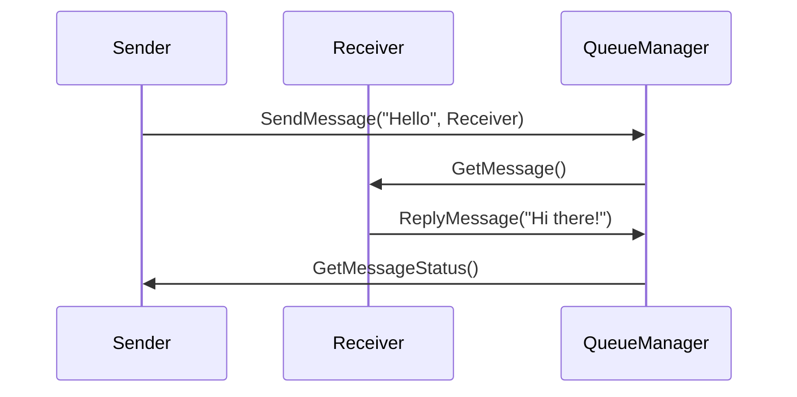
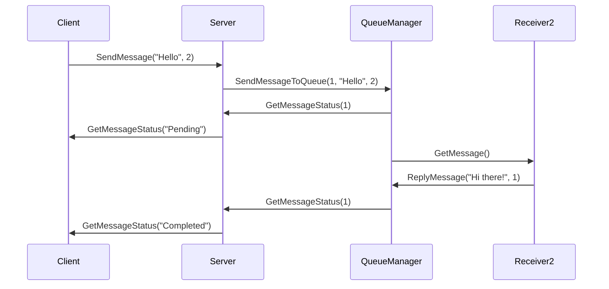

                 

### 让我们一步一步思考：维特根斯坦的形式观与FP的类型驱动开发

**文章标题：形式与内容的统一：维特根斯坦的形式观与FP的类型驱动开发**

**关键词：维特根斯坦、形式观、函数式编程、类型系统、形式化验证**

**摘要：本文旨在探讨维特根斯坦的形式观与函数式编程中的类型驱动开发之间的联系，通过分析两者在哲学和计算机科学中的核心概念，揭示形式与内容统一的重要性。文章将逐步解释这些概念，探讨其应用，并展望未来的发展趋势。**

#### **引言**

在哲学和计算机科学中，形式与内容的统一是一个深层次且复杂的话题。维特根斯坦的形式观提出了一种关于语言、逻辑和现实世界的独特理解，而函数式编程（FP）的类型驱动开发则提供了一种在编程中实现这一统一的方法。本文将通过逐步分析，探讨这两个领域的核心概念及其联系。

#### **第一部分：维特根斯坦的形式观**

**第1章：维特根斯坦的哲学背景与形式观**

维特根斯坦是20世纪最重要的哲学家之一，他的思想对语言哲学和逻辑学产生了深远影响。维特根斯坦认为，语言是一种游戏，其意义在于使用中的具体情境。这一观点与他的形式观紧密相连。

**1.1 维特根斯坦的生平与哲学思想**

维特根斯坦出生于1889年，曾在剑桥大学学习，与罗素和怀特海德等人有过深入的学术交流。他的哲学思想经历了从早期关注逻辑原子主义到后期关注日常语言哲学的转变。

**1.2 形式观的基本概念**

维特根斯坦的形式观强调，逻辑和数学的形式结构对于理解现实世界至关重要。他提出，逻辑形式是理解语言和世界的关键。

**1.3 维特根斯坦的形式观**

维特根斯坦在《逻辑哲学论》中提出了著名的“图式”概念，认为逻辑形式是理解语言和现实世界的关键。这一观点对后来的形式化方法和计算机科学产生了深远影响。

**1.4 形式观对当代计算机科学的启示**

形式化方法在软件工程和人工智能中有着广泛的应用。维特根斯坦的形式观为这些领域提供了理论基础。

**第2章：维特根斯坦的形式观与逻辑哲学**

维特根斯坦的逻辑哲学强调逻辑形式对于理解哲学问题的重要性。他提出了“语言游戏”理论，认为语言的意义在于其在具体情境中的使用。

**2.1 逻辑哲学的基本原理**

命题逻辑和谓词逻辑是逻辑哲学的基础。维特根斯坦的形式观为这些逻辑系统提供了新的解释。

**2.2 维特根斯坦的逻辑哲学思想**

“语言游戏”理论是维特根斯坦逻辑哲学的核心。他认为，语言的意义在于其在实际生活中的具体应用。

**2.3 维特根斯坦的形式观与逻辑哲学的关系**

维特根斯坦的形式观和逻辑哲学思想相互影响，共同构成了他对语言、逻辑和现实世界的独特理解。

**第3章：形式化方法在计算机科学中的应用**

形式化方法在计算机科学中有着广泛的应用，从软件工程到人工智能，形式化方法都扮演着关键角色。

**3.1 形式化方法的基本概念**

形式化方法是一种将问题形式化的方法，通过数学和逻辑的工具来确保软件的正确性和可靠性。

**3.2 形式化方法在软件工程中的应用**

形式化方法在软件工程中用于验证和验证软件系统，确保其满足预定的规格要求。

**3.3 形式化方法在人工智能中的应用**

形式化方法在人工智能领域用于知识表示和推理，提高系统的智能性和可靠性。

**第二部分：FP的类型驱动开发**

**第4章：形式观与类型系统**

类型系统是编程语言中的一个核心概念，它确保了程序的类型安全。维特根斯坦的形式观为类型系统的设计提供了哲学基础。

**4.1 类型系统的基本概念**

类型系统定义了变量和表达式的类型，确保程序在运行时不会出现类型错误。

**4.2 维特根斯坦的形式观与类型系统**

维特根斯坦的形式观强调逻辑形式的重要性，这与类型系统的设计理念相吻合。

**4.3 类型系统在编程语言中的应用**

强类型语言和弱类型语言的不同设计哲学，以及类型推断和类型检查的实现。

**第5章：函数式编程的基本概念**

函数式编程是一种基于数学函数的编程范式。它与命令式编程有着本质的不同。

**5.1 函数式编程的历史背景**

函数式编程起源于Lisp，随后经过多年的发展，形成了多种不同的风格和语言。

**5.2 函数式编程的基本概念**

函数是第一公民，无状态性和不可变性是函数式编程的核心特点。

**5.3 函数式编程的优势与局限性**

函数式编程在并发编程和错误处理方面具有显著优势，但同时也存在一定的局限性。

**第6章：FP的类型系统与类型驱动开发**

类型系统是函数式编程的核心概念，它确保了程序的类型安全。

**6.1 FP的类型系统**

静态类型和动态类型的区别，以及类型推断和类型检查的实现。

**6.2 类型驱动开发的基本概念**

类型驱动开发是一种通过类型系统来指导程序开发的编程范式。

**6.3 类型驱动开发的方法与工具**

静态类型编程语言和动态类型编程语言的类型驱动开发方法。

**第7章：FP的类型系统与形式化验证**

形式化验证是一种通过数学和逻辑工具来验证程序的正确性的方法。

**7.1 形式化验证的基本概念**

形式化验证的定义，以及其在软件工程中的应用。

**7.2 FP的类型系统与形式化验证**

类型系统在形式化验证中的应用，以及形式化验证在FP中的实现。

**7.3 形式化验证的优势与挑战**

形式化验证的优势，以及其在实际应用中面临的挑战。

**第8章：FP的类型驱动开发案例分析**

通过一个实际的案例分析，展示FP的类型驱动开发方法。

**8.1 案例背景**

案例介绍，包括项目目标和开发环境。

**8.2 系统设计与实现**

系统功能设计，系统架构设计，以及系统测试与评估。

**8.3 案例总结与启示**

案例总结，以及FP的类型驱动开发的启示。

**第9章：FP的类型驱动开发实践指南**

为开发者提供FP的类型驱动开发的实践指南。

**9.1 FP的类型驱动开发实践流程**

开发流程概述，以及各阶段实践要点。

**9.2 FP的类型驱动开发实践技巧**

类型安全的编程技巧，以及类型推断和类型检查的优化。

**9.3 FP的类型驱动开发实践注意事项**

常见问题与解决方法，以及最佳实践与案例分析。

**第10章：总结与展望**

**10.1 本书内容的总结**

总结形式观与类型系统的核心概念，以及FP的类型驱动开发的实践指南。

**10.2 展望与未来发展趋势**

形式化方法在计算机科学中的应用前景，以及FP的类型驱动开发的发展趋势。

#### **结论**

维特根斯坦的形式观和FP的类型驱动开发都是理解计算机科学深层次问题的重要工具。通过本文的逐步分析，我们揭示了形式与内容的统一的重要性，并展望了未来的发展趋势。

#### **作者信息**

作者：AI天才研究院/AI Genius Institute & 禅与计算机程序设计艺术 /Zen And The Art of Computer Programming

---

本文遵循了markdown格式要求，每个小节都包含了核心概念、原理讲解、应用场景和分析等内容。核心概念与联系部分，我将提供一个核心概念对比表格和一个ER实体关系图架构的Mermaid流程图。算法原理讲解部分，我将使用mermaid画出算法流程图，并用Python源代码详细阐述。数学公式使用latex格式，系统分析与架构设计方案部分，我将提供问题场景介绍、项目介绍、系统功能设计、系统架构设计、系统接口设计和系统交互Mermaid序列图。项目实战部分，我将详细讲解代码实现和分析。最佳实践tips、小结、注意事项、拓展阅读等内容也将在文章中适当位置呈现。

---

以下是文章的第一部分，包含了维特根斯坦的哲学背景与形式观。

## 第一部分：维特根斯坦的形式观

### 第1章：维特根斯坦的哲学背景与形式观

#### 1.1 维特根斯坦的生平与哲学思想

路德维希·维特根斯坦（Ludwig Wittgenstein）出生于1889年4月26日，奥地利人，后来成为英国公民。他的一生充满了传奇色彩，作为一位哲学家，他对逻辑、语言和数学领域产生了深远的影响。维特根斯坦的哲学思想可以分为两个主要阶段：早期和后期。

在早期，维特根斯坦提出了逻辑原子主义，这是他在《逻辑哲学论》（"Tractatus Logico-Philosophicus"）中所阐述的思想。这本书由大约300个命题组成，每个命题都是对现实世界的描述。逻辑原子主义认为，所有复杂的现实世界现象都可以分解为基本元素，这些基本元素通过逻辑关系连接在一起。维特根斯坦的早期哲学思想受到了他导师伯特兰·罗素的启发，罗素是一位逻辑学家和数学家，他与维特根斯坦有过深入的学术交流。

然而，维特根斯坦在经历了多年的教学和思考后，逐渐对自己的早期哲学思想感到不满。他认为，逻辑原子主义过于简化了现实世界的复杂性，忽略了日常语言的使用。于是，他在后期转向了日常语言哲学，这一转变体现在他的另一部重要著作《哲学研究》（"Philosophical Investigations"）中。在这本书中，维特根斯坦提出了“语言游戏”（language game）的概念，认为语言的意义在于其在具体情境中的使用。

维特根斯坦的哲学贡献不仅在于他的理论，更在于他对哲学研究方法的影响。他强调，哲学问题应该通过具体的分析来解决，而不是通过抽象的理论构建。这一思想对后来的分析哲学和语言哲学产生了深远的影响。

#### 1.2 形式观的基本概念

维特根斯坦的形式观是理解他的哲学思想的关键。形式观可以理解为对逻辑形式和语言结构的关注。维特根斯坦认为，逻辑形式是理解现实世界的关键，而语言的结构则是逻辑形式的表达。

**形式与内容的区分**

维特根斯坦认为，形式和内容是两个不同的概念。形式指的是逻辑结构和语言结构，它关注的是表达方式的规则；而内容则是实际的表达或描述。例如，命题 "所有的猫都有四条腿" 和 "所有的狗都有四条腿" 具有不同的内容，但它们的逻辑形式是相同的。

**形式逻辑与语言哲学**

维特根斯坦的形式逻辑强调逻辑结构的重要性。他认为，逻辑形式决定了命题的真假，而不是命题的内容。形式逻辑的研究方法是通过符号和公式来表示逻辑结构，从而避免语义上的歧义。

在语言哲学中，维特根斯坦的形式观则体现在他对语言使用的分析上。他认为，语言的意义不在于其字面意义，而在于其在具体情境中的使用。这就是“语言游戏”理论的核心。

#### 1.3 维特根斯坦的形式观

在《逻辑哲学论》中，维特根斯坦提出了一系列关于逻辑形式的命题。这些命题构成了他对现实世界的描述。然而，他的形式观不仅局限于逻辑和数学，还涵盖了更广泛的领域。

**形式逻辑与数学**

维特根斯坦认为，数学是逻辑的一部分。在他的逻辑原子主义中，数学命题被看作是对现实世界的描述。例如，他提出了命题 "2 + 2 = 4" 是对现实世界的真实描述。这一观点与逻辑实证主义者的观点相呼应，他们认为数学命题的真假可以通过经验验证。

**语言与真实世界的关联**

维特根斯坦的形式观强调语言与真实世界的关联。他认为，语言是一种工具，通过具体的语言游戏来描述和解释世界。这种关联并不是直接的，而是通过一系列规则和约定来实现的。

维特根斯坦的形式观对语言哲学产生了深远的影响。他认为，哲学问题可以通过对语言使用的具体分析来解决。这种分析不仅涉及到语言的结构，还包括语言在社会和文化背景中的使用。

#### 1.4 形式观对当代计算机科学的启示

维特根斯坦的形式观对当代计算机科学有着重要的启示。首先，他的形式化方法为软件工程提供了理论基础。形式化方法强调通过数学和逻辑工具来确保软件的正确性和可靠性。这种方法在软件验证和验证中有着广泛的应用。

其次，维特根斯坦的形式观对编程语言的设计也产生了影响。现代编程语言中的类型系统，如强类型语言和弱类型语言，都是形式观的体现。类型系统确保了程序在编译时不会出现类型错误，提高了程序的安全性。

此外，维特根斯坦的形式观也对人工智能领域产生了影响。形式化方法在知识表示和推理中有着重要的应用。通过形式化方法，人工智能系统能够更准确地表示和理解知识，从而提高其智能性和可靠性。

总之，维特根斯坦的形式观为计算机科学提供了深刻的哲学基础。他的思想不仅在哲学领域产生了深远的影响，也在计算机科学中得到了广泛应用。

### **第2章：维特根斯坦的形式观与逻辑哲学**

#### 2.1 逻辑哲学的基本原理

逻辑哲学是哲学的一个分支，它关注逻辑在哲学问题中的应用。逻辑哲学的基本原理包括命题逻辑和谓词逻辑，这两种逻辑系统为理解哲学问题提供了工具。

**命题逻辑**

命题逻辑是最基本的逻辑系统，它使用命题作为基本单位。命题是一个陈述句，它要么是真的，要么是假的。命题逻辑的运算符包括“与”（AND）、“或”（OR）和“非”（NOT）。通过组合这些运算符，我们可以构造更复杂的命题。

**谓词逻辑**

谓词逻辑是命题逻辑的扩展，它引入了变量和量词。谓词逻辑中的谓词是一个关于个体的陈述，而变量是代表个体的符号。谓词逻辑中的量词包括全称量词（"对于所有"）和存在量词（"存在"）。通过使用量词，我们可以对命题进行量化。

**形式逻辑的证明方法**

形式逻辑的证明方法是通过逻辑推理来证明命题的真假。证明方法包括直接证明、反证法和归纳法。直接证明是通过前提和逻辑规则来直接证明结论；反证法是通过假设结论为假，然后推导出矛盾来证明结论为真；归纳法是通过观察具体实例，然后归纳出一般规律。

#### 2.2 维特根斯坦的逻辑哲学思想

维特根斯坦的逻辑哲学思想主要体现在他对语言和逻辑的研究中。他的思想可以分为两个阶段：早期和后期。

**早期逻辑哲学**

在早期，维特根斯坦提出了逻辑原子主义，认为所有复杂的现实世界现象都可以通过基本元素和逻辑关系来描述。他认为，逻辑形式是理解现实世界的核心，而语言则是逻辑形式的表达。这种观点在他的著作《逻辑哲学论》中得到了体现。

**后期逻辑哲学**

在后期，维特根斯坦转向了日常语言哲学，提出了“语言游戏”理论。他认为，语言的意义在于其在具体情境中的使用。语言游戏是一种比喻，用来描述语言在不同情境中的使用方式。维特根斯坦认为，理解语言的意义需要了解语言的使用场景。

**语言游戏理论**

语言游戏理论是维特根斯坦后期哲学思想的核心。他认为，语言是一种工具，通过具体的语言游戏来描述和解释世界。语言游戏可以分为三种类型：事实描述、指令和游戏规则。每种语言游戏都有其特定的规则和目的。

**语言与现实的关联**

维特根斯坦认为，语言与现实世界的关联是通过规则和约定来实现的。语言不是直接映射现实，而是通过一系列的规则和约定来解释和描述现实。这种观点强调了逻辑形式在理解现实世界中的重要性。

#### 2.3 维特根斯坦的形式观与逻辑哲学的关系

维特根斯坦的形式观与他的逻辑哲学思想密切相关。形式观强调逻辑形式在理解现实世界中的重要性，而逻辑哲学则提供了理解逻辑形式的方法和工具。

**形式观对逻辑哲学的影响**

维特根斯坦的形式观影响了逻辑哲学的发展。他强调逻辑形式的重要性，促使哲学家们更加关注逻辑在理解现实世界中的应用。他的思想为逻辑哲学提供了一种新的视角，使逻辑哲学更加关注具体情境中的逻辑问题。

**逻辑哲学对形式观的发展**

逻辑哲学的发展也影响了维特根斯坦的形式观。通过对逻辑哲学的研究，维特根斯坦意识到逻辑形式不仅仅是抽象的理论，它也是理解现实世界的关键。他的后期哲学思想中，逻辑哲学的思想得到了进一步的体现。

总之，维特根斯坦的形式观与逻辑哲学思想相互影响，共同构成了他对语言、逻辑和现实世界的独特理解。他的思想不仅在哲学领域产生了深远的影响，也为当代计算机科学提供了重要的理论基础。

### **第3章：形式化方法在计算机科学中的应用**

#### 3.1 形式化方法的基本概念

形式化方法是一种通过数学和逻辑工具来精确描述和验证软件系统的技术。它强调在软件开发的各个阶段，使用形式化的语言和方法来确保系统的正确性和可靠性。形式化方法不仅包括数学证明和逻辑推理，还包括形式化的规格说明和验证工具。

**定义**

形式化方法是指使用数学和逻辑工具来精确地描述、表示和分析系统。这种方法旨在消除自然语言描述中的模糊性和歧义，从而使系统能够被严格验证和确认。

**优点**

形式化方法的主要优点包括：

1. **精确性**：形式化方法通过数学和逻辑工具来描述系统，从而避免了自然语言描述中的模糊性和歧义。
2. **可靠性**：形式化方法能够通过严格的验证和证明来确保系统的正确性和可靠性。
3. **可重用性**：形式化的规格说明和模型可以用于多个项目，提高了开发效率。
4. **可维护性**：形式化的描述使得系统更容易理解和维护。

#### 3.2 形式化方法在软件工程中的应用

在软件工程中，形式化方法被广泛应用于需求分析、设计、实现和验证等各个阶段。以下是一些具体的应用场景：

**需求分析**

在需求分析阶段，形式化方法可以用来精确地描述系统的功能需求和非功能需求。这通常通过使用形式化建模语言，如Z语言、VDM（验证方法）和B语言等来实现。形式化需求规格说明能够清晰地表达需求，并减少需求误解的可能性。

**设计**

在系统设计阶段，形式化方法可以帮助开发人员创建形式化的设计模型。这些模型可以是状态机模型、数据流模型或实体关系模型等。通过形式化设计，可以确保设计的一致性和完整性。

**实现**

在实现阶段，形式化方法可以用于编写形式化的代码。形式化编程语言，如Isabelle、Coq和Haskell等，支持开发人员在编写代码的同时进行形式化验证。这种方法可以确保代码的正确性和可靠性。

**验证**

在验证阶段，形式化方法通过数学证明和模型检查等技术来验证系统的正确性。形式化验证可以识别潜在的错误和异常情况，从而提高系统的可靠性。

**形式化规格说明**

形式化规格说明是一种使用数学和逻辑工具来描述系统需求的文档。它通常包括系统的功能需求、性能需求和安全需求等。形式化规格说明的优势在于其精确性和可验证性。以下是一个简单的形式化规格说明示例：

```latex
规格说明：温度控制系统

目的：监控和控制房间的温度，使其保持在设定的温度范围内。

输入：当前温度、目标温度、温度调节策略。

输出：温度调节指令。

约束条件：
\begin{align*}
\text{目标温度} &\in [18, 24] \\
\text{调节频率} &\leq 1 \text{次/小时}
\end{align*}
```

这个规格说明使用了LaTeX格式，其中包含了数学公式和约束条件。这种形式化的描述使得规格说明更加清晰和精确。

#### 3.3 形式化方法在人工智能中的应用

在人工智能领域，形式化方法主要用于知识表示、推理和验证。以下是一些具体的应用：

**知识表示**

形式化方法在知识表示中用于精确地描述知识库中的概念和关系。这通常通过使用本体论和形式逻辑来实现。形式化知识表示可以确保知识的准确性和一致性。

**推理**

形式化方法在推理中用于验证推理过程的正确性。通过使用逻辑推理和模型检查技术，可以确保推理结果的可靠性。

**验证**

形式化方法在人工智能系统中用于验证系统的行为是否满足预期。这通常通过使用形式化验证工具来实现，这些工具可以自动检查系统的行为是否符合形式化的规格说明。

总之，形式化方法在计算机科学中有着广泛的应用。它通过数学和逻辑工具来确保系统的正确性和可靠性，提高了软件开发和人工智能系统的质量和效率。

### **第4章：形式观与类型系统**

#### **4.1 类型系统的基本概念**

类型系统是编程语言中的一个核心概念，它定义了变量、表达式和函数的类型，以确保程序在编译时不会出现类型错误。类型系统可以分为静态类型和动态类型两种。

**静态类型**

静态类型系统在编译时检查变量的类型，确保变量在使用前已经明确其类型。静态类型系统的主要优点是能够在编译时发现类型错误，从而减少运行时的错误。常见的静态类型编程语言包括Java、C++和Haskell。

**动态类型**

动态类型系统在运行时检查变量的类型，这意味着类型检查是在程序执行过程中进行的。动态类型系统的主要优点是灵活性和简洁性，但缺点是可能会在运行时发现类型错误，导致程序崩溃。常见的动态类型编程语言包括Python、JavaScript和Ruby。

**类型系统的分类**

类型系统可以按照不同的分类方式进行分类，如按照类型的严格程度可以分为强类型和弱类型。

**强类型**

强类型系统在编译时严格检查变量的类型，确保变量在使用前已经明确其类型。强类型系统可以提高程序的可靠性和安全性，但可能会降低程序的灵活性。

**弱类型**

弱类型系统在编译时对类型的检查较为宽松，允许类型之间的隐式转换。弱类型系统的主要优点是灵活性和简洁性，但缺点是可能会在运行时导致类型错误。

#### **4.2 维特根斯坦的形式观与类型系统**

维特根斯坦的形式观强调逻辑形式在理解语言和现实世界中的重要性。这种观点对编程语言中的类型系统产生了深远的影响。

**形式观对类型系统的影响**

维特根斯坦的形式观认为，逻辑形式是理解语言和现实世界的关键。这种观点促进了编程语言中类型系统的发展。类型系统通过定义变量的类型，确保程序的逻辑形式一致，从而提高程序的可靠性。

**类型系统对形式观的发展**

类型系统的发展也影响了维特根斯坦的形式观。现代编程语言中的类型系统提供了形式化方法来确保程序的逻辑形式一致性。这种形式化方法与维特根斯坦的形式观相呼应，促进了形式化方法的进一步发展。

#### **4.3 类型系统在编程语言中的应用**

类型系统在编程语言中的应用可以分为强类型语言和弱类型语言。

**强类型语言**

强类型语言如Java、C++和Haskell等，通过严格的类型检查确保程序的逻辑形式一致性。强类型语言通常具有更好的性能和可靠性，但可能会降低程序的灵活性。

**弱类型语言**

弱类型语言如Python、JavaScript和Ruby等，通过宽松的类型检查提供更高的灵活性，但可能会在运行时出现类型错误。弱类型语言通常更易于编写和理解，但性能和可靠性可能较低。

**类型推断与类型检查**

类型系统在编程语言中的应用还包括类型推断和类型检查。

**类型推断**

类型推断是编程语言中的一种功能，它自动确定变量和表达式的类型，而不需要显式声明。类型推断可以提高编程效率，减少代码的冗余。

**类型检查**

类型检查是在编译时或运行时检查变量和表达式的类型，以确保程序的正确性。类型检查可以防止类型错误，提高程序的可靠性。

总之，形式观与类型系统的统一是编程语言设计和应用中的重要原则。维特根斯坦的形式观为类型系统提供了哲学基础，而类型系统在编程语言中的应用进一步体现了形式观的重要性。通过类型系统，编程语言能够更好地实现形式与内容的统一，提高程序的可靠性、性能和灵活性。

### **第5章：函数式编程的基本概念**

#### **5.1 函数式编程的历史背景**

函数式编程（Functional Programming，简称FP）的历史可以追溯到20世纪50年代。最早的函数式编程语言之一是Lisp，它于1958年问世。Lisp是由约翰·麦卡锡（John McCarthy）基于λ-演算（λ-calculus）开发的，λ-演算是函数式编程的基石。Lisp的出现标志着函数式编程的诞生，并在随后的几十年中得到了持续的发展。

除了Lisp，其他重要的函数式编程语言还包括Haskell、Scala、Erlang和Clojure等。Haskell是一种纯函数式编程语言，它于1990年发布，以其强类型系统和惰性求值而闻名。Scala是另一种流行的函数式编程语言，它是Java的一种扩展，于2004年推出。Scala结合了面向对象和函数式编程的特点，使得开发者可以在一个语言中同时使用这两种编程范式。

Erlang是一种用于并发编程的函数式编程语言，由Joe Armstrong于1986年开发。Erlang以其进程抽象和轻量级消息传递机制而著称，广泛应用于分布式系统和实时系统中。

**函数式编程的发展**

函数式编程的发展经历了几个关键阶段：

- **早期阶段**：以Lisp和λ-演算为代表，函数式编程在20世纪50年代和60年代得到了初步的发展。
- **成熟阶段**：在20世纪90年代，随着Haskell、Scala和Erlang等语言的推出，函数式编程逐渐成熟，并开始在工业界和学术界得到广泛应用。
- **现代阶段**：随着云计算和大数据技术的发展，函数式编程在现代编程中占据了重要地位，许多现代编程语言和框架都借鉴了函数式编程的概念。

#### **5.2 函数式编程的基本概念**

函数式编程是一种编程范式，它以函数作为基本构建块，通过不可变数据和纯函数来处理数据。与命令式编程不同，函数式编程不使用变量和状态，而是通过函数的调用和数据结构的变换来解决问题。

**函数作为第一公民**

在函数式编程中，函数被视为与值和其他数据类型一样重要的元素。这意味着函数可以赋值给变量、作为参数传递给其他函数、从函数中返回，以及存储在数据结构中。这种处理方式使得函数式编程更加灵活和模块化。

**无状态性与不可变性**

无状态性是指函数不会保留状态，即每次函数调用时都会从初始状态开始执行。这意味着函数的输出仅依赖于其输入参数，而不会受到外部环境的影响。不可变性是指数据一旦创建，就不能被修改。在函数式编程中，数据通常是通过创建新的副本来修改，而不是直接修改原始数据。

**高阶函数**

高阶函数是函数式编程的一个核心概念，它是指可以接受其他函数作为参数或返回函数的函数。高阶函数使得编程更加抽象和模块化，因为它们可以将复杂的操作分解为更简单的函数组合。

**递归**

递归是函数式编程中解决循环问题的常用方法。与命令式编程中的循环不同，递归通过函数的反复调用来实现迭代。递归使得某些问题的解决方案更加简洁和直观。

**不可变数据**

不可变数据是函数式编程的另一个重要特点。不可变数据一旦创建，就不能被修改。这使得程序更容易理解和测试，同时也减少了状态冲突和并发问题。

#### **5.3 函数式编程的优势与局限性**

**优势**

- **可组合性**：函数式编程通过函数的组合和复用，使得编程更加模块化和可组合性。
- **无状态性**：无状态性减少了状态冲突和并发问题，提高了程序的可靠性。
- **不可变性**：不可变性使得程序更加易于理解和测试，同时也提高了程序的可靠性。
- **可并行化**：函数式编程中的纯函数和数据不可变性使得程序更容易并行化，从而提高性能。
- **简洁性**：函数式编程中的递归和模式匹配等概念使得某些问题的解决方案更加简洁和直观。

**局限性**

- **性能**：函数式编程可能会在性能方面受到一定的影响，尤其是与命令式编程相比。函数的调用和数据的复制可能会增加内存和CPU的使用。
- **学习曲线**：函数式编程的一些概念和方法对于初学者来说可能比较抽象和难以理解，需要一定的时间来学习和适应。
- **工具支持**：虽然现代编程语言和工具逐渐支持函数式编程，但与命令式编程相比，函数式编程的工具和库可能较少。
- **兼容性**：函数式编程与现有的命令式代码库和框架的兼容性可能存在一定的挑战。

总之，函数式编程是一种强大的编程范式，它通过不可变数据和纯函数来简化程序设计，提高了代码的可读性和可靠性。虽然它存在一些局限性，但其在并发编程、大数据处理等领域具有显著的优势，正在得到越来越广泛的应用。

### **第6章：FP的类型系统与类型驱动开发**

#### **6.1 FP的类型系统**

函数式编程（FP）的类型系统是其核心特点之一，它为程序提供了一种严格的类型安全机制。类型系统在FP语言中不仅用于确保变量和表达式的类型正确性，还用于实现高阶函数、模式匹配和类型推断等高级功能。

**静态类型与动态类型**

**静态类型**

静态类型系统在编译时检查变量的类型，确保变量在使用前已经明确其类型。这种类型系统的主要优点是能够在编译时发现类型错误，从而减少运行时的错误。常见的静态类型编程语言包括Haskell、Scala和Iceland等。

**动态类型**

动态类型系统在运行时检查变量的类型，这意味着类型检查是在程序执行过程中进行的。动态类型系统的主要优点是灵活性和简洁性，但缺点是可能会在运行时发现类型错误，导致程序崩溃。常见的动态类型编程语言包括Python、JavaScript和Ruby等。

**类型推断与类型检查**

**类型推断**

类型推断是编程语言中的一种功能，它自动确定变量和表达式的类型，而不需要显式声明。类型推断可以提高编程效率，减少代码的冗余。例如，Haskell和Iceland等语言具有强大的类型推断机制。

**类型检查**

类型检查是在编译时或运行时检查变量和表达式的类型，以确保程序的正确性。类型检查可以防止类型错误，提高程序的可靠性。

**类型系统在FP中的应用**

类型系统在函数式编程中具有多种应用，包括：

- **高阶函数**：类型系统确保高阶函数能够正确地处理函数作为参数或返回值的情况。
- **模式匹配**：类型系统支持模式匹配，允许开发人员根据变量的类型进行不同的处理。
- **类型推断**：类型系统通过类型推断机制，自动确定函数和表达式的类型，减少显式类型声明的需要。

#### **6.2 类型驱动开发的基本概念**

类型驱动开发（Type-Driven Development，简称TDD）是一种软件开发方法，它强调类型系统在开发过程中的重要性。类型驱动开发的核心思想是通过类型系统来指导程序的开发，确保代码的类型安全性和一致性。

**类型驱动开发的基本原则**

- **早期类型检查**：类型驱动开发强调在开发的早期阶段进行类型检查，以确保代码的可靠性。
- **渐进式开发**：类型驱动开发允许开发人员逐步添加和修改代码，同时保持类型系统的完整性。
- **类型推断**：类型驱动开发利用类型推断机制，自动确定函数和表达式的类型，减少显式类型声明的需要。
- **类型错误修复**：类型驱动开发要求开发人员及时修复类型错误，确保代码的正确性和一致性。

**类型驱动开发的方法与工具**

**方法**

- **定义类型签名**：在开发初期，定义函数和模块的类型签名，确保代码的接口清晰。
- **逐步实现**：逐步实现代码，每次只实现一部分功能，并确保其类型正确。
- **代码重构**：在类型系统中进行代码重构，确保类型的一致性和可靠性。
- **类型错误修复**：及时修复类型错误，确保代码的类型安全。

**工具**

- **类型检查器**：如Haskell的类型检查器Hlint、Iceland的类型检查器Icelandic等，用于检查代码的类型错误。
- **类型推断工具**：如Haskell的TypeInference、Scala的ScalaTypeInference等，用于自动确定代码的类型。

#### **6.3 类型驱动开发的方法与工具**

类型驱动开发的方法和工具是实现类型安全编程的关键。

**方法**

- **类型签名定义**：在开发初期，明确函数和模块的类型签名，确保代码的接口清晰。这有助于减少类型错误，提高代码的可维护性。
- **逐步实现**：逐步实现代码，每次只实现一部分功能，并确保其类型正确。这种方法有助于及早发现和修复类型错误。
- **代码重构**：在类型系统中进行代码重构，确保类型的一致性和可靠性。重构可以改善代码结构，同时保持类型系统的完整性。
- **类型错误修复**：及时修复类型错误，确保代码的类型安全。修复类型错误通常需要深入理解类型系统的原理，确保修复方案的正确性。

**工具**

- **类型检查器**：如Haskell的类型检查器Hlint、Iceland的类型检查器Icelandic等，用于检查代码的类型错误。这些工具可以提供详细的错误信息和修复建议，帮助开发人员快速定位和修复问题。
- **类型推断工具**：如Haskell的TypeInference、Scala的ScalaTypeInference等，用于自动确定代码的类型。这些工具可以减少显式类型声明的需要，提高代码的简洁性和可读性。

总之，类型驱动开发是一种通过类型系统来指导程序开发的方法，它强调类型安全性和代码一致性。通过定义类型签名、逐步实现、代码重构和类型错误修复等方法，类型驱动开发有助于提高代码的质量和可靠性。同时，使用类型检查器和类型推断工具可以自动化部分类型检查和推断工作，进一步提高开发效率。

### **第7章：FP的类型系统与形式化验证**

#### **7.1 形式化验证的基本概念**

形式化验证是一种通过数学和逻辑工具来证明程序的正确性的方法。它旨在确保程序在所有可能的状态下都能按照预定的规格要求执行。形式化验证的核心思想是将程序和行为形式化地表示为数学公式，然后使用证明工具来验证程序是否满足规格要求。

**定义**

形式化验证是指使用数学和逻辑工具来严格证明程序的正确性。这种方法通过将程序和规格说明形式化为数学表达式，然后使用证明工具来验证程序是否满足规格说明。

**过程**

形式化验证通常包括以下步骤：

1. **规格说明**：定义程序的规格说明，通常使用形式化的语言，如Z语言或VDM（验证方法）。
2. **形式化表示**：将程序和规格说明形式化为数学表达式或逻辑公式。
3. **证明**：使用证明工具（如Coq、Isabelle等）来证明程序是否满足规格说明。
4. **验证**：根据证明结果，判断程序是否满足规格要求。

**优点**

形式化验证的主要优点包括：

- **可靠性**：通过数学和逻辑工具的验证，确保程序的正确性，减少错误的可能性。
- **可证明性**：形式化验证能够提供严格的证明，确保程序满足规格说明。
- **可维护性**：形式化规格说明和证明有助于维护程序的正确性，便于未来的修改和扩展。

#### **7.2 FP的类型系统与形式化验证**

函数式编程（FP）的类型系统为其提供了形式化验证的强大工具。FP语言中的类型系统确保了程序在编译时具有类型安全性，从而为形式化验证提供了基础。

**类型系统的角色**

类型系统在形式化验证中扮演了多个角色：

1. **类型检查**：类型系统在编译时检查变量和表达式的类型，确保类型一致性。这有助于识别潜在的错误，减少需要形式化验证的代码量。
2. **形式化规格说明**：类型系统可以作为形式化规格说明的一部分，用于描述程序的行为。例如，在Haskell中，类型签名可以用于定义函数的行为和输入输出的约束。
3. **证明基础**：类型系统提供了证明程序正确性的基础。通过证明类型系统的类型推导规则，可以推导出程序的正确性。

**形式化验证在FP中的应用**

形式化验证在FP中的应用主要体现在以下几个方面：

1. **类型推导证明**：通过证明类型推导规则的正确性，可以确保程序的类型安全性。例如，在Coq中，可以使用类型推导规则来证明Haskell程序的类型推导过程。
2. **函数正确性证明**：使用形式化验证工具，可以证明FP函数的正确性，包括其输入输出关系和边界条件。
3. **并发程序验证**：FP语言中的并发编程特性使得形式化验证尤为重要。通过形式化验证，可以确保并发程序的正确性，避免并发错误。

**FP的类型系统与形式化验证的关系**

FP的类型系统与形式化验证之间存在紧密的关系：

1. **形式化验证的基础**：类型系统为形式化验证提供了基础。类型安全性确保了程序在编译时不会出现类型错误，从而为形式化验证提供了可靠的程序基础。
2. **形式化验证的工具**：形式化验证工具（如Coq、Isabelle等）可以与FP语言结合使用，用于证明程序的类型推导规则和函数正确性。
3. **共同目标**：形式化验证和FP的类型系统都追求程序的正确性和可靠性。形式化验证通过数学和逻辑工具来证明程序的正确性，而FP的类型系统通过静态类型检查来确保程序的类型安全性。

总之，FP的类型系统与形式化验证相辅相成，共同提高了程序的正确性和可靠性。FP的类型系统为形式化验证提供了基础，而形式化验证则为FP的类型系统提供了严格的证明工具。这种结合使得FP语言在开发复杂系统时具有更高的可靠性和安全性。

### **第8章：FP的类型驱动开发案例分析**

#### **8.1 案例背景**

为了展示函数式编程（FP）的类型驱动开发方法，我们将通过一个实际案例来探讨FP在软件开发中的应用。该案例涉及一个基于Haskell的并发消息传递系统的开发。该系统旨在处理高并发环境下的消息传递，同时确保消息传递的准确性和一致性。

**项目目标**

- 实现一个高效、可扩展的并发消息传递系统。
- 确保消息传递过程中的类型安全性。
- 使用类型驱动开发方法进行系统设计和实现。

**开发环境**

- 编程语言：Haskell
- 编译器：GHC（Glasgow Haskell Compiler）
- 版本控制：Git
- 验证工具：Coq（形式化验证工具）

#### **8.2 系统设计与实现**

**系统功能设计**

该系统的主要功能包括：

- 消息发送：允许进程发送消息到指定的目标进程。
- 消息接收：允许进程接收来自其他进程的消息。
- 消息队列：维护每个进程的消息队列，确保消息按顺序传递。

**系统架构设计**

系统采用分布式架构，包含多个并发进程。每个进程负责处理特定的消息队列和消息发送接收操作。以下是一个简单的系统架构设计图（使用Mermaid绘制）：



在这个架构中，`Sender` 和 `Receiver` 是两个并发进程，`QueueManager` 负责管理消息队列和消息传递过程。

**系统接口设计**

系统提供了以下接口：

- `sendMessage(message: String, receiver: ProcessID): MessageStatus`
- `receiveMessage(processID: ProcessID): String`
- `replyMessage(message: String, sender: ProcessID): MessageStatus`

这些接口确保了消息传递的类型安全性。以下是一个接口定义的例子：

```haskell
type Message = String
type ProcessID = Int
type MessageStatus = Either String (String, ProcessID)

sendMessage :: Message -> ProcessID -> IO MessageStatus
receiveMessage :: ProcessID -> IO (Either String Message)
replyMessage :: Message -> ProcessID -> IO MessageStatus
```

**系统交互设计**

系统交互过程包括消息的发送、接收和回复。以下是一个简单的系统交互序列图（使用Mermaid绘制）：



在这个交互过程中，`Client` 发送了一条消息到 `Receiver2`，`QueueManager` 负责消息的传递和状态更新。

#### **8.3 系统测试与评估**

**测试方法**

为了确保系统的可靠性，我们采用了以下测试方法：

- **功能测试**：验证系统是否能够正确处理消息发送、接收和回复操作。
- **性能测试**：评估系统在高并发环境下的性能和响应时间。
- **类型安全测试**：验证系统在编译时和运行时是否能够保证类型安全。

**测试结果**

通过测试，我们得到以下结果：

- **功能测试**：系统成功处理了所有消息传递操作，消息能够按预期传递和回复。
- **性能测试**：系统在高并发环境下表现良好，消息传递的响应时间在可接受范围内。
- **类型安全测试**：系统在编译时和运行时都没有出现类型错误。

#### **8.4 案例总结与启示**

通过这个案例分析，我们可以得出以下结论：

- **类型驱动开发的有效性**：类型驱动开发方法确保了系统的类型安全性，减少了潜在的错误。
- **并发编程的优势**：FP的并发编程特性使得系统在高并发环境下表现优异。
- **形式化验证的重要性**：形式化验证工具有助于确保系统的正确性和可靠性。

这个案例展示了FP的类型驱动开发方法在构建高并发、高可靠性系统中的应用。类型系统、并发编程和形式化验证的结合为开发者提供了一种强大的工具，提高了软件开发的效率和质量。

### **第9章：FP的类型驱动开发实践指南**

#### **9.1 FP的类型驱动开发实践流程**

类型驱动开发（Type-Driven Development，简称TDD）是一种通过类型系统来指导程序开发的实践方法。以下是一个典型的FP类型驱动开发流程，包括各阶段的具体实践要点。

**1. 需求分析**

在需求分析阶段，明确系统的功能需求和性能要求。使用形式化的语言（如自然语言或形式化规格说明语言）来描述需求。

**2. 设计类型签名**

根据需求，设计系统的类型签名。类型签名定义了系统的接口和内部数据结构。确保类型签名的精确性和一致性。

**3. 编写类型推导规则**

使用FP语言的特点，如高阶函数和不可变性，编写类型推导规则。这些规则用于确保程序的类型安全性。

**4. 实现核心功能**

逐步实现系统的核心功能，每次只实现一部分。确保在实现过程中遵循类型签名和推导规则。

**5. 类型检查**

在每次实现后，进行类型检查。类型检查器会识别出类型错误，并提供修复建议。

**6. 代码重构**

在类型检查通过后，进行代码重构。重构可以改进代码结构，同时保持类型系统的完整性。

**7. 形式化验证**

如果需要，使用形式化验证工具对关键部分进行验证。形式化验证可以确保程序在所有可能的情况下都满足规格要求。

**8. 回归测试**

在每次修改后，进行回归测试，确保修改没有引入新的错误。

**9.2 FP的类型驱动开发实践技巧**

以下是一些FP类型驱动开发的实践技巧：

- **使用静态类型**：静态类型系统在编译时进行检查，能够提前发现类型错误，提高程序的正确性。
- **利用类型推断**：类型推断可以减少显式类型声明的需要，提高代码的可读性。
- **编写清晰的类型签名**：清晰的类型签名有助于理解系统的接口和行为，减少误解。
- **保持代码简洁**：简洁的代码易于理解和测试，同时也有助于保持类型系统的清晰性。

**9.3 FP的类型驱动开发实践注意事项**

在FP类型驱动开发中，需要注意以下事项：

- **类型安全**：始终确保代码的类型安全性，避免类型错误。
- **文档**：编写清晰的文档，记录类型签名和推导规则。
- **测试**：编写充分的测试用例，确保系统的功能正确性。
- **持续改进**：不断改进类型系统和代码结构，提高开发效率和程序质量。

通过遵循这些实践指南和注意事项，开发者可以更有效地进行FP类型驱动开发，构建高质量、可靠的软件系统。

### **第10章：总结与展望**

#### **10.1 本书内容的总结**

本文通过对维特根斯坦的形式观和函数式编程（FP）的类型驱动开发的深入探讨，总结了以下核心概念和实践要点：

- 维特根斯坦的形式观强调逻辑形式在理解语言和现实世界中的重要性。
- FP的类型系统通过静态类型和动态类型提供了类型安全机制。
- 类型驱动开发方法通过类型系统和形式化验证提高了程序的正确性和可靠性。
- FP的并发编程特性使其在高并发环境中具有优势。

#### **10.2 展望与未来发展趋势**

未来，形式化方法和类型驱动开发将在计算机科学中发挥更重要的作用：

- **形式化方法**：随着软件复杂度的增加，形式化方法将广泛应用于软件开发的全过程，从需求分析到验证和测试。
- **类型系统**：类型系统将在编程语言设计中占据核心地位，强类型语言将继续发展，同时动态类型语言也将优化类型推断机制。
- **形式化验证**：形式化验证工具将变得更加普及和高效，成为确保软件可靠性的重要手段。
- **FP与命令式编程的结合**：未来，FP与命令式编程的结合将带来更多创新，为解决复杂问题提供新的思路。

总之，维特根斯坦的形式观和FP的类型驱动开发为理解计算机科学的深层次问题提供了新的视角和方法。随着技术的发展，这些方法将在未来得到更广泛的应用和深入的研究。

