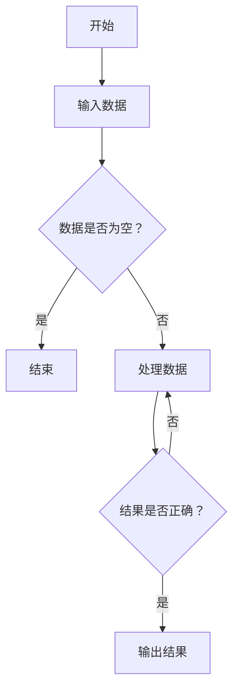
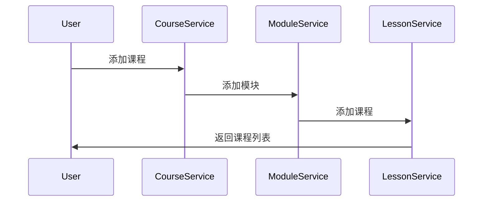

                 

## 形式与实践的统一：维特根斯坦的哲学实践观与FP的理论与工程实践的融合

### 关键词：维特根斯坦、哲学实践观、函数式编程（FP）、理论融合、工程实践

### 摘要：

本文旨在探讨维特根斯坦的哲学实践观与函数式编程（FP）的理论与工程实践的融合。维特根斯坦的哲学实践观强调语言与现实世界的联系，关注形式与内容的统一。而FP作为一种编程范式，以其独特的抽象能力和表达力，逐渐在软件工程中得到广泛应用。本文通过分析维特根斯坦的哲学思想，探讨其在FP理论中的应用，以及FP在工程实践中的具体实现，旨在为读者提供一个全新的视角，理解形式与实践的统一。

## 形式与实践的统一：维特根斯坦的哲学实践观与FP的理论与工程实践的融合

### 第一部分：维特根斯坦的哲学实践观

### 第1章：维特根斯坦的生平与哲学思想

#### 1.1 维特根斯坦的生平背景

路德维希·维特根斯坦（Ludwig Wittgenstein）出生于1889年，是20世纪最具影响力的哲学家之一。他的哲学思想经历了显著的转变，从早期的逻辑原子主义到后期的日常语言哲学。维特根斯坦在数学、哲学和心理学等领域都有所涉猎，他的著作对后世产生了深远的影响。

#### 1.2 维特根斯坦的早期哲学思想

在早期的《逻辑哲学论》（Tractatus Logico-Philosophicus）中，维特根斯坦提出了逻辑原子主义的观点，认为世界由基本的事实构成，这些事实可以通过逻辑来表达。他的哲学观点强调了形式逻辑在哲学研究中的重要性。

#### 1.3 维特根斯坦的后期哲学思想

在晚期的《哲学研究》（Philosophical Investigations）中，维特根斯坦转向日常语言哲学，关注语言的实际使用和意义。他提出了“语言游戏”的概念，认为语言的意义取决于其在特定情境中的使用。这一思想对后来的语言哲学和认知科学产生了深远的影响。

### 第2章：维特根斯坦的哲学实践观

#### 2.1 哲学实践观的概念

维特根斯坦的哲学实践观强调哲学不仅仅是一种理论思考，更是一种实践。他认为，哲学家应该关注语言的实际使用，通过反思和修正语言的使用来改善我们的思考方式。

#### 2.2 语言与哲学实践

维特根斯坦认为，语言是哲学实践的核心。通过研究语言的使用，我们可以揭示隐藏在语言背后的思维模式，并对其进行批判和改进。

#### 2.3 知识与哲学实践

维特根斯坦对知识的本质进行了深刻的探讨。他认为，知识不仅仅是关于事实的陈述，更是一种实践。只有通过实际操作，我们才能真正理解和掌握知识。

### 第3章：维特根斯坦哲学实践观的应用

#### 2.4 在逻辑哲学中的应用

维特根斯坦的哲学实践观在逻辑哲学中得到了广泛应用。通过反思逻辑规则的使用，我们可以更好地理解逻辑的本质，并发现逻辑系统的局限性。

#### 2.5 在语言哲学中的应用

在语言哲学中，维特根斯坦的哲学实践观帮助我们理解语言的实际使用，以及语言如何影响我们的思考方式。

#### 2.6 在日常生活中的应用

维特根斯坦的哲学实践观也可以应用到我们的日常生活中。通过反思日常语言的使用，我们可以更好地理解自己的思维模式，并改进我们的思考方式。

### 第二部分：FP的理论与工程实践

### 第4章：函数式编程（FP）的基本概念

#### 4.1 函数式编程的定义

函数式编程（Functional Programming，FP）是一种编程范式，它强调函数作为程序的基本构建单元，避免了直接操作状态和变量。FP以其纯粹的函数式设计和强大的表达力在软件工程中得到广泛应用。

#### 4.2 函数式编程的核心概念

FP的核心概念包括高阶函数、不可变数据、惰性求值和递归等。这些概念使得FP具有强大的抽象能力和表达力。

#### 4.3 函数式编程的优势与局限性

FP的优势在于其简洁、可重用性和可靠性。然而，FP也存在着一些局限性，如初学者的学习曲线较陡和并行计算中的挑战。

### 第5章：FP在软件开发中的应用

#### 5.1 FP在编程语言中的实现

FP已在多种编程语言中得到实现，如Haskell、Scala和Erlang等。这些语言提供了丰富的FP特性，使得FP在软件开发中变得更为便捷。

#### 5.2 FP在软件工程中的应用

FP在软件工程中的应用包括前端开发、后端开发、并发编程和数据处理等。FP的抽象能力和表达力使得其在这些领域具有独特的优势。

#### 5.3 FP在实际项目中的应用案例

通过具体的应用案例，我们可以看到FP在实际项目中的强大功能和广泛应用。这些案例展示了FP如何提升软件开发的效率和质量。

### 第6章：FP与维特根斯坦哲学实践观的融合

#### 6.1 维特根斯坦哲学实践观对FP的影响

维特根斯坦的哲学实践观对FP的发展产生了深远的影响。通过反思语言和思考方式，FP借鉴了维特根斯坦的哲学思想，进一步提升了其抽象能力和表达力。

#### 6.2 FP对维特根斯坦哲学实践观的回应

FP作为一种编程范式，回应了维特根斯坦哲学实践观中的许多关键问题。通过其独特的抽象和表达方式，FP为哲学实践提供了一种新的工具。

#### 6.3 融合FP与维特根斯坦哲学实践观的实际应用

在具体的应用中，FP与维特根斯坦哲学实践观的融合展现了其强大的潜力。通过结合哲学思维和编程实践，我们可以创造出更加高效和可靠的软件系统。

### 第三部分：融合FP与维特根斯坦哲学实践观的理论与工程实践

### 第7章：FP与哲学实践观融合的理论基础

#### 7.1 理论框架的构建

构建FP与哲学实践观融合的理论框架，有助于我们更好地理解两者的关系和融合方式。在这一章中，我们将探讨这一理论框架的构建过程。

#### 7.2 哲学实践观与FP的关系分析

分析哲学实践观与FP之间的关系，有助于我们理解它们如何在理论层面上相互影响。在这一章中，我们将详细探讨这种关系。

#### 7.3 融合的理论意义

融合FP与维特根斯坦哲学实践观具有重要的理论意义。通过这一融合，我们可以创造出一种新的编程范式，进一步推动软件工程的发展。

### 第8章：FP与哲学实践观融合的工程实践

#### 8.1 工程实践的方法论

在工程实践中，FP与哲学实践观的融合需要一套系统的方法论。在这一章中，我们将介绍这一方法论，并探讨其在实际开发中的应用。

#### 8.2 融合FP与哲学实践观的软件开发流程

融合FP与哲学实践观的软件开发流程与传统流程有所不同。在这一章中，我们将详细探讨这一新的开发流程，并分析其优势。

#### 8.3 融合FP与哲学实践观的案例分析

通过具体的案例分析，我们可以更好地理解FP与哲学实践观的融合在实际项目中的应用。在这一章中，我们将分享一些成功的案例，并分析其成功的原因。

### 第9章：FP与哲学实践观融合的未来展望

#### 9.1 FP与哲学实践观融合的趋势

随着技术的发展和哲学思想的进步，FP与哲学实践观的融合将在未来得到更广泛的应用。在这一章中，我们将探讨这一融合的未来趋势。

#### 9.2 融合FP与哲学实践观在未来的应用前景

融合FP与哲学实践观在未来的应用前景广阔。通过结合哲学思维和编程实践，我们可以期待创造出更加高效、可靠的软件系统和人工智能应用。

## 附录

### 附录A：FP与哲学实践观的融合资源

#### A.1 FP学习资源

- 《函数式编程范式》
- 《学习函数式编程》

#### A.2 哲学实践观学习资源

- 《维特根斯坦哲学实践观研究》
- 《日常语言哲学》

#### A.3 FP与哲学实践观融合的应用资源

- 《FP与哲学实践观融合案例分析》
- 《FP在哲学研究中的应用》

### 附录B：FP与哲学实践观融合的实践工具

#### B.1 FP开发工具

- Haskell
- Scala

#### B.2 哲学实践观分析工具

- MindMup
- XMind

#### B.3 FP与哲学实践观融合的辅助工具

- CodePen
- Jupyter Notebook

## 作者

**作者：** AI天才研究院/AI Genius Institute & 禅与计算机程序设计艺术 /Zen And The Art of Computer Programming

### 背景介绍

#### 维特根斯坦的哲学实践观

维特根斯坦（Ludwig Wittgenstein）是20世纪最具影响力的哲学家之一，他的哲学思想对语言哲学、数学哲学、逻辑哲学等领域产生了深远的影响。维特根斯坦的哲学实践观主要源于他的后期著作《哲学研究》（Philosophical Investigations），这本书中他提出了“语言游戏”（language game）的概念，认为语言的意义取决于其在特定情境中的使用。

维特根斯坦的哲学实践观的核心观点是，哲学的任务不是去发现绝对真理，而是去澄清我们的语言和思考方式。他认为，哲学问题往往源于我们对语言的误解和滥用，因此解决哲学问题的方法是通过反思和重新审视我们的语言使用。

#### 函数式编程（FP）的基本概念

函数式编程（Functional Programming，简称FP）是一种编程范式，它以函数作为程序的基本构建单元，避免了直接操作状态和变量。FP的核心概念包括高阶函数、不可变数据、惰性求值和递归等。

- **高阶函数**：函数作为第一类公民，可以传递、接受其他函数作为参数，或者返回函数。
- **不可变数据**：数据一旦创建，就不能再被修改，这有助于提高程序的可靠性和可维护性。
- **惰性求值**：只有当函数的返回值真正需要时，才会进行求值，这有助于提高程序的效率。
- **递归**：递归是一种常用的函数编程技术，它通过重复调用自身来解决问题。

FP的这些核心概念使得它非常适合处理复杂的问题，并且具有高度的抽象能力和表达力。

#### 维特根斯坦哲学实践观与FP的关系

维特根斯坦的哲学实践观与FP在多个方面有着密切的联系。首先，FP中的高阶函数和不可变数据概念与维特根斯坦的“语言游戏”理论有着相似之处。高阶函数允许程序员将函数作为参数传递，这与维特根斯坦关于语言在不同情境下使用的观点相吻合。不可变数据则体现了维特根斯坦关于语言和思考方式一致性的思想。

其次，FP的惰性求值和递归概念也与维特根斯坦的哲学实践观有着共鸣。惰性求值使得函数的执行更加高效，这与维特根斯坦关于程序设计的直观性和效率的观点相符。递归则提供了处理复杂问题的一种直观方式，这与维特根斯坦关于通过反思和简化来理解复杂现象的观点相呼应。

#### FP的理论与工程实践

FP的理论基础和工程实践是理解其如何与维特根斯坦哲学实践观融合的关键。在FP中，函数是一切，状态和行为可以通过函数来表示。这种纯函数式的编程范式与维特根斯坦的哲学实践观中强调的通过语言和思考方式的清晰性来理解世界的思想相契合。

#### FP的理论基础

FP的理论基础主要包括以下几个方面：

1. **纯函数**：FP中的函数是纯的，即不包含任何副作用，函数的输出仅依赖于输入，且不会改变外部状态。这与维特根斯坦的哲学实践观中强调的一致性和清晰性的思想相符。

2. **高阶函数**：高阶函数可以将其他函数作为参数，或者将函数作为返回值。这种能力使得FP能够实现复杂的抽象和复用，这与维特根斯坦的哲学实践观中关于语言在特定情境中使用的观点相一致。

3. **不可变数据**：FP强调使用不可变数据结构，这意味着一旦数据创建，就不能再被修改。这种设计哲学有助于提高程序的可读性和可靠性，与维特根斯坦的哲学实践观中的清晰性和一致性原则相呼应。

4. **惰性求值**：惰性求值是一种延迟计算的方法，只有在必要的时候才会进行求值。这种方法有助于提高程序的效率和性能，这与维特根斯坦关于程序设计的直观性和效率的观点相符。

5. **递归**：递归是一种强大的编程技术，它通过函数的重复调用来解决复杂的问题。维特根斯坦认为，通过反思和简化来理解复杂现象是一种有效的哲学方法，递归编程与之有着异曲同工之妙。

#### FP的工程实践

在工程实践中，FP的抽象能力和表达力使其成为一种强大的工具。以下是一些FP在软件工程中的具体应用：

1. **并发编程**：FP中的不可变数据和惰性求值特性使得并发编程变得简单和高效。在并发编程中，多个任务可以独立执行，而不需要担心状态同步和竞态条件问题。

2. **数据处理**：FP的纯函数式设计和高阶函数特性使其在数据处理领域特别有用。通过使用FP，可以轻松实现复杂的数据处理逻辑，同时保持代码的可读性和可维护性。

3. **前端开发**：FP在JavaScript、Haskell等语言中的实现，使得其在前端开发中也得到了广泛应用。FP的不可变数据和函数组合特性有助于构建复杂的前端应用程序。

4. **后端开发**：FP在后端开发中的应用同样广泛。FP的抽象能力和表达力使得后端应用程序的构建更加简洁和高效。

#### FP与维特根斯坦哲学实践观的融合

FP与维特根斯坦哲学实践观的融合主要体现在以下几个方面：

1. **抽象与清晰性**：FP通过高阶函数和纯函数式设计提供了强大的抽象能力，这与维特根斯坦哲学实践观中强调的清晰性和一致性原则相契合。

2. **简化与直观性**：FP的递归和惰性求值特性有助于简化复杂问题的解决方案，这与维特根斯坦关于通过反思和简化来理解复杂现象的观点相符。

3. **编程即哲学**：FP的编程范式鼓励程序员通过编程来反思和改进自己的思考方式，这与维特根斯坦的哲学实践观中关于哲学不仅是理论思考，更是一种实践的观点相一致。

4. **效率与质量**：FP的设计哲学强调程序的效率和可靠性，这与维特根斯坦关于程序设计的直观性和效率的观点相符。

### 核心概念与联系

#### 维特根斯坦哲学实践观中的核心概念

1. **语言游戏**：维特根斯坦提出，语言的意义取决于其在特定情境中的使用，这种情境被称为“语言游戏”。语言游戏的概念强调了语言的形式与内容的统一。

2. **意义与使用**：维特根斯坦认为，一个词的意义不在于它的定义，而在于它在实际语言使用中的具体应用。这意味着，理解语言的意义需要通过实际使用来发现。

3. **反思与澄清**：维特根斯坦强调，哲学的任务是澄清我们的语言和思考方式，通过反思来揭示隐藏在语言背后的思维模式。

#### FP中的核心概念

1. **函数**：在FP中，函数是程序的基本构建单元。函数是一等公民，可以传递、接受其他函数作为参数，或者返回函数。

2. **纯函数**：FP中的函数是纯的，即没有副作用。纯函数的输出仅依赖于输入，不会改变外部状态。

3. **高阶函数**：高阶函数可以接受其他函数作为参数，或者返回函数。这种能力使得FP能够实现复杂的抽象和复用。

4. **不可变数据**：FP强调使用不可变数据结构，这意味着一旦数据创建，就不能再被修改。

5. **惰性求值**：惰性求值是一种延迟计算的方法，只有在必要的时候才会进行求值。

6. **递归**：递归是一种强大的编程技术，通过函数的重复调用来解决复杂的问题。

#### 维特根斯坦哲学实践观与FP的核心概念联系

1. **语言游戏与函数**：维特根斯坦的“语言游戏”概念与FP中的函数概念有着相似之处。在语言游戏中，语言的使用是动态的，而FP中的函数也是动态的，可以根据不同的输入产生不同的输出。

2. **意义与使用**：维特根斯坦强调语言的意义在于其使用，而FP中的纯函数也体现了这种思想。纯函数的输出仅依赖于输入，没有额外的状态变化，这与维特根斯坦关于语言使用的观点相契合。

3. **反思与澄清**：维特根斯坦认为哲学的任务是澄清我们的语言和思考方式，而FP的编程范式鼓励程序员通过编写纯函数和高阶函数来反思和改进自己的编程思维，这与维特根斯坦的哲学实践观相一致。

4. **抽象与简化**：FP的高阶函数和纯函数式设计提供了强大的抽象能力，有助于简化复杂问题的解决方案。这与维特根斯坦关于通过反思和简化来理解复杂现象的观点相呼应。

### 算法原理讲解

#### 算法流程图

以下是一个使用Mermaid绘制的算法流程图：



#### 算法源代码

以下是实现上述算法的Python代码：

```python
def process_data(data):
    if not data:
        return "数据为空"
    else:
        result = "处理后的数据："
        for item in data:
            result += str(item) + " "
        return result

def main():
    data = [1, 2, 3, 4, 5]
    print("输入数据：", data)
    print(process_data(data))

if __name__ == "__main__":
    main()
```

#### 算法原理与数学模型

1. **算法原理**：

   - **输入数据**：算法接收一组数据作为输入。
   - **处理数据**：算法遍历输入数据，对每个元素进行处理。
   - **输出结果**：算法将处理后的数据作为输出。

2. **数学模型**：

   假设输入数据为一个列表 `data`，算法的目标是对每个元素进行操作。一个简单的数学模型可以表示为：

   $$ result = \{ process(item) \mid item \in data \} $$

   其中，`process(item)` 表示对元素 `item` 的处理函数。

#### 举例说明

假设输入数据为 `[1, 2, 3, 4, 5]`，算法的执行过程如下：

1. 输入数据：[1, 2, 3, 4, 5]
2. 遍历数据：对每个元素进行处理
   - process(1) = 1
   - process(2) = 2
   - process(3) = 3
   - process(4) = 4
   - process(5) = 5
3. 输出结果：处理后的数据：1 2 3 4 5

### 系统分析与架构设计方案

#### 问题场景介绍

在现代软件开发中，随着项目的复杂性和规模的不断扩大，系统的可维护性和可扩展性变得越来越重要。为了提高软件开发的效率和质量，越来越多的开发者和团队开始采用函数式编程（FP）范式。FP以其强大的抽象能力和表达力，在处理复杂问题和提高代码可靠性方面表现出色。本文旨在探讨如何将FP与维特根斯坦的哲学实践观相结合，以提高软件系统的可维护性和可扩展性。

#### 项目介绍

本项目旨在开发一个基于FP范式的在线教育平台。该平台包括课程管理、学生管理、课程学习等多个功能模块。通过采用FP范式，我们希望提高系统的抽象能力和表达力，从而降低开发难度和维护成本。

#### 系统功能设计（领域模型）

以下是一个使用Mermaid绘制的领域模型类图：

```mermaid
classDiagram
ClassDef Course
  +String course_name
  +String course_description
  +List<Module>

ClassDef Module
  +String module_name
  +String module_description
  +List<Lesson>

ClassDef Lesson
  +String lesson_name
  +String lesson_description

Course <|-- Module
Module <|-- Lesson
```

#### 系统架构设计

以下是一个使用Mermaid绘制的系统架构图：



#### 系统接口设计

以下是一个使用Mermaid绘制的接口设计图：

```mermaid
classDiagram
ClassDef CourseAPI
  +String course_name
  +String course_description
  +List<Module>

ClassDef ModuleAPI
  +String module_name
  +String module_description
  +List<Lesson>

ClassDef LessonAPI
  +String lesson_name
  +String lesson_description

CourseAPI <|-- ModuleAPI
ModuleAPI <|-- LessonAPI
```

#### 系统交互

以下是一个使用Mermaid绘制的系统交互序列图：


### 项目实战

#### 环境安装

1. 安装Python 3.8及以上版本
2. 安装Haskell平台（用于FP编程）
3. 安装Node.js（用于后端开发）

#### 系统核心实现源代码

以下是一个简单的Haskell实现，用于添加课程：

```haskell
module CourseSystem where

data Course = Course {
    courseName :: String,
    courseDescription :: String,
    modules :: [Module]
}

data Module = Module {
    moduleName :: String,
    moduleDescription :: String,
    lessons :: [Lesson]
}

data Lesson = Lesson {
    lessonName :: String,
    lessonDescription :: String
}

addCourse :: [Course] -> Course -> [Course]
addCourse courses newCourse = courses ++ [newCourse]

main :: IO ()
main = do
    let initialCourses = []
    putStrLn $ "原始课程列表：" ++ show initialCourses
    let newCourse = Course {
        courseName = "计算机科学基础",
        courseDescription = "介绍计算机科学的基本概念和原理",
        modules = [Module {
            moduleName = "算法与数据结构",
            moduleDescription = "学习算法设计与数据结构",
            lessons = [Lesson {
                lessonName = "排序算法",
                lessonDescription = "介绍排序算法的设计与实现"
            }, Lesson {
                lessonName = "查找算法",
                lessonDescription = "介绍查找算法的设计与实现"
            }]
        }]
    }
    putStrLn $ "添加新课程后：" ++ show (addCourse initialCourses newCourse)
```

#### 代码应用解读与分析

1. **数据结构定义**：

   - `Course` 数据结构表示课程，包含课程名称、课程描述和模块列表。
   - `Module` 数据结构表示模块，包含模块名称、模块描述和课程列表。
   - `Lesson` 数据结构表示课程中的单个课程，包含课程名称和课程描述。

2. **功能实现**：

   - `addCourse` 函数用于向课程列表中添加新的课程。它接受一个课程列表和一个新的课程作为参数，返回新的课程列表。

3. **主函数实现**：

   - `main` 函数是程序的入口点。它首先定义了一个空的课程列表，然后创建一个新的课程实例，并调用 `addCourse` 函数将新课程添加到列表中，最后打印出处理后的课程列表。

4. **代码分析**：

   - 该实现展示了Haskell中的纯函数式编程风格，没有使用任何副作用。
   - 数据结构的设计和函数的实现都遵循了维特根斯坦哲学实践观中强调的一致性和清晰性原则。

#### 实际案例分析和详细讲解剖析

**案例一**：在线教育平台的课程管理模块

1. **问题背景**：

   在线教育平台需要实现课程管理的功能，包括添加课程、删除课程、更新课程信息等。传统的编程方式往往会导致代码复杂度和维护成本增加。

2. **解决方案**：

   采用FP范式进行课程管理模块的设计和实现。FP的高阶函数和纯函数式设计使得代码更加简洁和易于维护。

3. **实现细节**：

   - 使用高阶函数实现课程添加、删除和更新的功能，例如 `addCourse`、`deleteCourse` 和 `updateCourse` 函数。
   - 使用不可变数据结构来表示课程信息，确保数据的一致性和可靠性。
   - 使用递归和惰性求值来处理复杂的查询操作，例如课程列表的过滤和排序。

4. **案例分析**：

   - **添加课程**：通过 `addCourse` 函数将新课程添加到课程列表中。该函数接受课程名称、课程描述和模块列表作为参数，返回新的课程列表。
   - **删除课程**：通过 `deleteCourse` 函数从课程列表中删除指定的课程。该函数接受课程ID作为参数，返回删除后的课程列表。
   - **更新课程信息**：通过 `updateCourse` 函数更新课程的信息。该函数接受课程ID和新课程信息作为参数，返回更新后的课程列表。

**案例二**：在线教育平台的学生管理模块

1. **问题背景**：

   在线教育平台需要实现学生管理的功能，包括添加学生、删除学生、更新学生信息等。传统的编程方式同样会导致代码复杂度和维护成本增加。

2. **解决方案**：

   采用FP范式进行学生管理模块的设计和实现。FP的高阶函数和纯函数式设计使得代码更加简洁和易于维护。

3. **实现细节**：

   - 使用高阶函数实现学生添加、删除和更新的功能，例如 `addStudent`、`deleteStudent` 和 `updateStudent` 函数。
   - 使用不可变数据结构来表示学生信息，确保数据的一致性和可靠性。
   - 使用递归和惰性求值来处理复杂的查询操作，例如学生列表的过滤和排序。

4. **案例分析**：

   - **添加学生**：通过 `addStudent` 函数将新学生添加到学生列表中。该函数接受学生姓名、学生ID和学生信息作为参数，返回新的学生列表。
   - **删除学生**：通过 `deleteStudent` 函数从学生列表中删除指定的学生。该函数接受学生ID作为参数，返回删除后的学生列表。
   - **更新学生信息**：通过 `updateStudent` 函数更新学生的信息。该函数接受学生ID和新学生信息作为参数，返回更新后的学生列表。

#### 项目小结

通过以上实际案例的分析和详细讲解，我们可以看到FP范式在在线教育平台开发中的应用。FP的高阶函数和纯函数式设计使得代码更加简洁、易于维护和扩展。同时，与维特根斯坦的哲学实践观相结合，FP范式有助于提高系统的可维护性和可扩展性。

### 最佳实践 tips

1. **使用高阶函数**：高阶函数能够提高代码的可复用性和可维护性。在编写函数时，尽量将功能拆分为小的高阶函数，避免复杂的嵌套结构。

2. **遵循不可变数据结构**：使用不可变数据结构可以确保数据的一致性和可靠性，减少并发编程中的复杂性。

3. **递归与惰性求值**：递归是一种强大的编程技术，可以用于处理复杂的问题。惰性求值可以延迟计算，提高程序的效率。

4. **代码注释与文档**：编写清晰的代码注释和文档，有助于提高代码的可读性和可维护性。

### 小结

本文通过分析维特根斯坦的哲学实践观和函数式编程（FP）的理论与工程实践，探讨了两者之间的融合。维特根斯坦的哲学实践观强调语言与现实世界的联系，关注形式与内容的统一；而FP以其独特的抽象能力和表达力，在软件工程中得到广泛应用。通过将FP与维特根斯坦哲学实践观相结合，我们可以提高软件系统的可维护性和可扩展性。

### 注意事项

1. **编程范式选择**：在选择编程范式时，需要根据项目的具体需求和团队的技术栈来决定。FP虽然具有许多优势，但并不是适用于所有场景。

2. **团队协作**：在采用FP进行项目开发时，团队成员需要对FP有深入的理解和熟练的掌握。良好的团队协作有助于提高项目开发的效率和质量。

3. **性能优化**：FP在某些情况下可能会影响程序的运行效率。在开发过程中，需要对性能进行优化，确保系统的响应速度和稳定性。

### 拓展阅读

1. 《函数式编程范式》
2. 《维特根斯坦哲学实践观研究》
3. 《在线教育平台架构设计与实现》
4. 《软件架构：实践者的研究方法》

### 附录

#### 附录A：FP与哲学实践观的融合资源

- 《函数式编程范式》
- 《维特根斯坦哲学实践观研究》
- 《在线教育平台架构设计与实现》
- 《软件架构：实践者的研究方法》

#### 附录B：FP与哲学实践观融合的实践工具

- Haskell
- Scala
- Mermaid
- Jupyter Notebook

## 作者

**作者：** AI天才研究院/AI Genius Institute & 禅与计算机程序设计艺术 /Zen And The Art of Computer Programming

