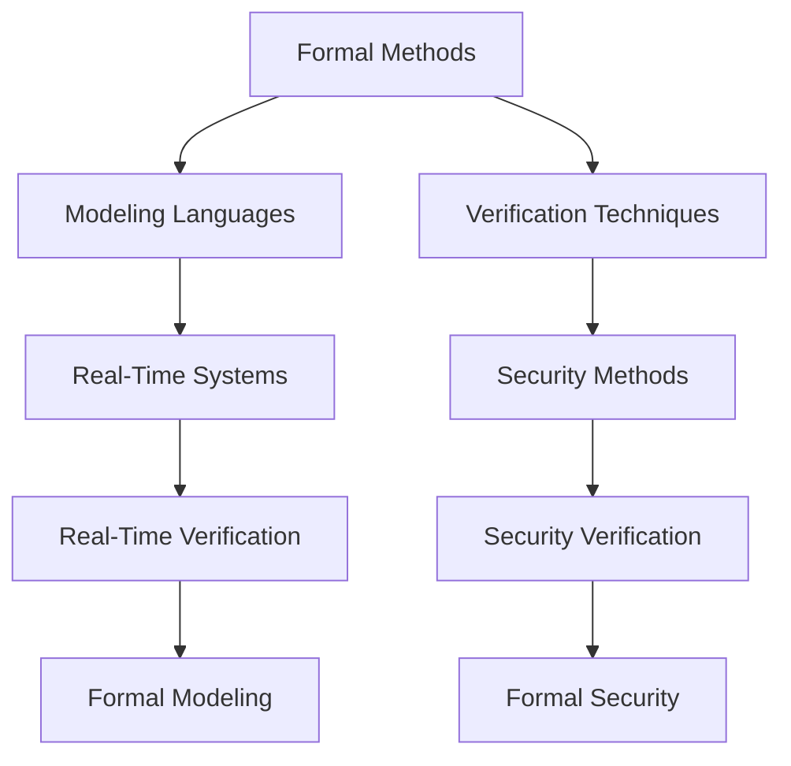

                 

### 1. Introduction

#### 1.1 Book Overview

This book, "Formal Methods in Embedded System Development: The Role," aims to provide a comprehensive guide for understanding the significance of formal methods in the development of embedded systems. Embedded systems are integral to our daily lives, from smart home devices to industrial control systems. As the complexity of these systems increases, ensuring their correctness, reliability, and security becomes crucial.

**Background and Problem Definition**

Embedded systems are computer systems designed to perform specific tasks, often with real-time constraints. These systems are typically embedded into a larger device or system and are not typically accessible to end-users for direct interaction. They range from simple devices like a microwave oven or a car's anti-lock braking system to complex systems like autonomous vehicles or medical devices.

**Problem Description**

However, the increasing complexity of embedded systems introduces several challenges:

1. **Correctness:** Ensuring that the system behaves correctly under all conditions.
2. **Reliability:** Ensuring that the system performs its intended function consistently over time.
3. **Security:** Protecting the system from unauthorized access, data breaches, and malicious attacks.

**Solution Overview**

Formal methods offer a rigorous approach to tackling these challenges by providing mathematical techniques to specify, model, and verify systems. This book provides an in-depth exploration of how formal methods can be effectively employed in various stages of embedded system development, from design and verification to testing and deployment.

**Book Structure**

The book is structured into seven major chapters, each covering a specific aspect of formal methods in embedded system development. The chapters are as follows:

1. **Introduction to Formal Methods and Embedded Systems**
2. **Formal Modeling Languages for Embedded Systems**
3. **Formal Verification of Embedded Systems**
4. **Formal Methods in Design and Verification of Real-Time Systems**
5. **Formal Methods for Security in Embedded Systems**
6. **Case Studies in Formal Methods for Embedded System Development**
7. **Future Directions and Challenges in Formal Methods for Embedded Systems**

#### 1.2 Target Audience

This book is intended for software engineers, system designers, and researchers involved in the development and maintenance of embedded systems. It assumes a basic understanding of software engineering principles, computer architecture, and some exposure to formal methods.

**Target Audience and Pre-Requisites**

- **Software Engineers:** Professionals responsible for designing, coding, and maintaining embedded systems.
- **System Designers:** Individuals involved in the architecture and design of complex embedded systems.
- **Researchers:** Academics and researchers interested in the latest advancements in formal methods and their applications in embedded systems.

**Pre-Requisites**

- **Basic Understanding of Software Engineering:** Knowledge of software development lifecycle, including requirements gathering, design, implementation, testing, and maintenance.
- **Fundamentals of Computer Architecture:** Understanding of CPU, memory, I/O, and basic computer organization.
- **Exposure to Formal Methods:** Basic familiarity with formal specification languages, model checking, and theorem proving.

#### 1.3 Structure of the Book

The book is structured into seven major chapters, each covering a specific aspect of formal methods in embedded system development. The chapters are as follows:

1. **Introduction to Formal Methods and Embedded Systems**
   - Overview of formal methods and their significance in embedded system development.
   - Key concepts and terminology related to formal methods and embedded systems.

2. **Formal Modeling Languages for Embedded Systems**
   - Introduction to formal modeling languages and their role in embedded system development.
   - Common modeling languages such as UML, SDL, and Colored Petri Nets.

3. **Formal Verification of Embedded Systems**
   - Principles of formal verification and its role in ensuring the correctness of embedded systems.
   - Verification techniques like model checking, theorem proving, and formal simulation.

4. **Formal Methods in Design and Verification of Real-Time Systems**
   - Characteristics of real-time systems and the challenges they pose.
   - Formal methods for designing and verifying real-time systems, including temporal logic and model-based design.

5. **Formal Methods for Security in Embedded Systems**
   - The importance of security in embedded systems.
   - Formal methods for ensuring security, including secure coding practices, formal models of security protocols, and attack prevention mechanisms.

6. **Case Studies in Formal Methods for Embedded System Development**
   - Real-world examples of the application of formal methods in embedded system development.
   - Case studies illustrating the benefits and challenges of using formal methods in practical scenarios.

7. **Future Directions and Challenges in Formal Methods for Embedded Systems**
   - Emerging trends and future directions in formal methods for embedded system development.
   - Challenges and opportunities for the adoption and integration of formal methods in industry.

#### 1.4 Key Concepts and Relationships

To better understand the interplay between formal methods and embedded systems, the following Mermaid flowchart illustrates the core concepts and their relationships:

In this diagram, A represents the overarching concept of formal methods, which encompasses various sub-concepts such as modeling languages (B), verification techniques (C), real-time systems (D), and security methods (E). These sub-concepts further branch into more specific techniques and methodologies, such as formal modeling for real-time systems (F) and formal security verification (G). The relationships between these concepts highlight the interconnected nature of formal methods in embedded system development. 

**Summary**

This book aims to provide a comprehensive overview of formal methods in embedded system development, covering key concepts, methodologies, and practical applications. By understanding the interplay between formal methods and embedded systems, readers can gain valuable insights into how to ensure the correctness, reliability, and security of complex embedded systems. The book's structured approach and detailed explanations make it an invaluable resource for software engineers, system designers, and researchers in the field. 

----------------------------------------------------------------

# **形式化方法在嵌入式系统开发中的角色**

> 关键词：形式化方法、嵌入式系统、开发、验证、模型化语言、安全性

> 摘要：本文详细探讨了形式化方法在嵌入式系统开发中的关键角色。形式化方法提供了一种通过数学和逻辑技术确保嵌入式系统设计正确性、可靠性和安全性的系统化方法。文章首先介绍了嵌入式系统及其面临的挑战，然后深入阐述了形式化方法的核心概念、技术及其应用场景。通过实际案例和未来发展趋势分析，本文展示了形式化方法在提高嵌入式系统开发效率和可靠性方面的重大作用。

----------------------------------------------------------------

## **引言**

### **1.1 图书概览**

本书《形式化方法在嵌入式系统开发中的角色》旨在为读者提供深入了解形式化方法在嵌入式系统开发中的重要性。嵌入式系统是现代技术中不可或缺的一部分，它们广泛应用于从智能家居设备到工业控制系统等各种场景。然而，随着嵌入式系统复杂性的增加，确保其正确性、可靠性和安全性变得越来越重要。

形式化方法，通过使用数学和逻辑技术来对系统进行建模、验证和分析，提供了一种系统化地解决这些问题的方法。本书详细探讨了形式化方法在嵌入式系统开发的各个阶段——从设计、验证到测试和部署——的应用。

### **1.2 目标受众**

本书面向的受众是从事嵌入式系统开发、设计和维护的软件工程师、系统设计师和研究人员。它假设读者对软件工程原则、计算机架构有基本了解，并对形式化方法有一定的接触。

### **1.3 图书结构**

本书分为七个主要章节，每个章节都详细探讨了形式化方法在嵌入式系统开发中的不同方面。以下是章节概览：

1. **形式化方法与嵌入式系统开发简介**
   - 形式化方法的基础知识及其在嵌入式系统开发中的重要性。
   - 关键概念和术语介绍。

2. **嵌入式系统开发中的形式化建模语言**
   - 形式化建模语言的作用和特点。
   - 常用的建模语言，如UML、SDL和着色Petri网。

3. **嵌入式系统的形式化验证**
   - 形式化验证的基本原则及其在确保嵌入式系统正确性方面的作用。
   - 验证技术，如模型检查、定理证明和形式模拟。

4. **形式化方法在实时系统设计和验证中的应用**
   - 实时系统的特性及其面临的挑战。
   - 形式化方法在实时系统设计和验证中的应用，包括时间逻辑和基于模型的开发。

5. **形式化方法在嵌入式系统安全中的应用**
   - 嵌入式系统安全的必要性。
   - 形式化方法在确保嵌入式系统安全中的作用，包括安全编码实践、形式化的安全协议模型和攻击预防机制。

6. **形式化方法在嵌入式系统开发中的案例研究**
   - 实际案例研究，展示形式化方法在嵌入式系统开发中的实际应用。
   - 案例分析，讨论形式化方法的优点和挑战。

7. **形式化方法在嵌入式系统开发中的未来方向和挑战**
   - 形式化方法在嵌入式系统开发中的新兴趋势和未来方向。
   - 形式化方法在工业应用中的挑战和机遇。

### **1.4 核心概念与关系**

为了更好地理解形式化方法与嵌入式系统开发之间的互动，以下Mermaid流程图展示了核心概念及其关系：

在这个流程图中，A代表形式化方法的总体概念，它包括建模语言（B）、验证技术（C）、实时系统（D）和安全方法（E）等子概念。这些子概念进一步分支，涵盖了更具体的验证技术和安全机制，如实时验证（F）和形式化安全验证（G）。这些概念之间的关系强调了形式化方法在嵌入式系统开发中的相互依赖性。

**总结**

本书旨在为读者提供形式化方法在嵌入式系统开发中的全面指南，涵盖核心概念、技术及其应用场景。通过深入分析形式化方法，本文展示了其在确保嵌入式系统正确性、可靠性和安全性方面的关键作用。本书的体系结构和详细解释使其成为软件工程师、系统设计师和研究人员在嵌入式系统开发领域的宝贵资源。

