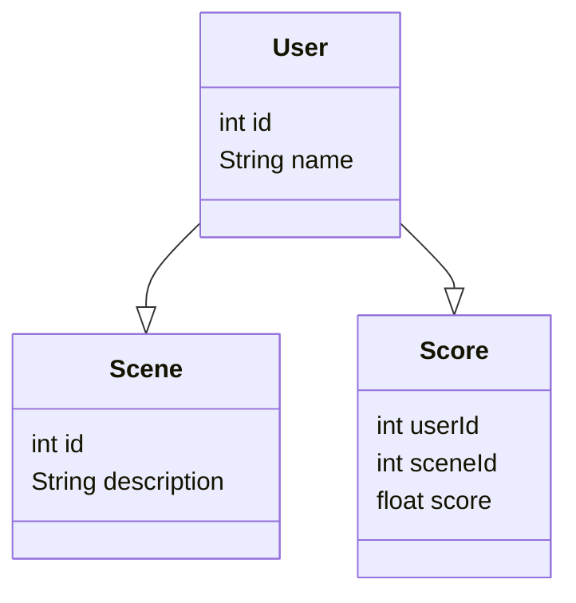
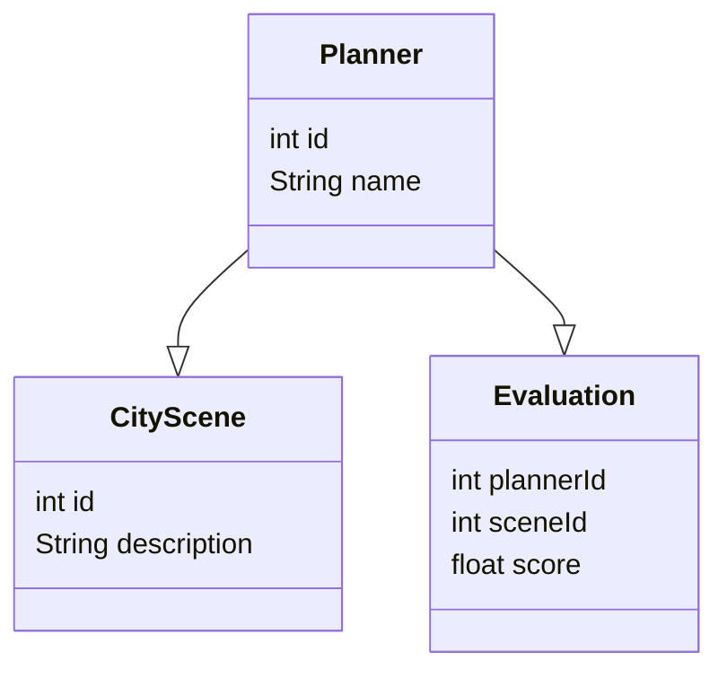

                 

### 形式化方法在虚拟现实系统开发中的角色

> 关键词：形式化方法、虚拟现实、系统开发、精确建模、算法验证

> 摘要：本文将探讨形式化方法在虚拟现实系统开发中的重要性。首先，我们将介绍形式化方法的定义及其在计算机科学中的应用。接着，深入分析虚拟现实系统的特点及其开发过程中的挑战。最后，我们将详细阐述形式化方法在虚拟现实系统开发中的具体应用，以及如何通过形式化方法提升系统的可靠性、性能和可维护性。

## 引言

虚拟现实（Virtual Reality, VR）技术近年来发展迅猛，已经成为增强现实、混合现实等领域的重要分支。虚拟现实系统通过模拟逼真的三维环境，使用户能够沉浸在虚拟世界中，极大地改变了人们与计算机的交互方式。然而，随着虚拟现实系统的复杂性和规模不断增大，开发过程中的挑战也日益凸显。这包括系统的可靠性、性能、可维护性等方面。

形式化方法（Formal Methods）是计算机科学中一种用于确保软件和系统可靠性的技术手段。它通过精确的数学模型和形式化语言来描述系统的需求、设计、实现和验证过程。形式化方法旨在消除传统开发方法中的模糊性和不确定性，从而提高系统的质量和可靠性。

本文旨在探讨形式化方法在虚拟现实系统开发中的角色，分析其在解决虚拟现实系统开发中的挑战方面的作用。文章结构如下：

1. **形式化方法概述**：介绍形式化方法的定义、起源、发展及其在计算机科学中的应用。
2. **虚拟现实系统概述**：介绍虚拟现实技术的定义、发展历程及其在现实中的应用。
3. **形式化方法在虚拟现实系统开发中的角色**：阐述形式化方法在虚拟现实系统开发中的重要性、应用场景和面临的挑战。
4. **形式化方法基础**：介绍形式化方法的核心理念、建模语言和验证工具。
5. **虚拟现实系统开发流程与形式化方法**：分析形式化方法在虚拟现实系统开发流程中的应用。
6. **应用案例研究**：通过具体案例展示形式化方法在虚拟现实系统开发中的应用。
7. **挑战与展望**：总结形式化方法在虚拟现实系统开发中的挑战和未来发展趋势。
8. **总结与展望**：总结全文内容，展望形式化方法在虚拟现实系统开发中的潜在应用。

通过本文的探讨，我们希望能够为虚拟现实系统的开发者提供一种新的思路，帮助他们在开发过程中更好地应用形式化方法，提高系统的可靠性和性能。

## 形式化方法概述

形式化方法是一种系统化的技术手段，用于确保软件和系统的可靠性和质量。它通过精确的数学模型和形式化语言来描述系统的需求、设计、实现和验证过程。形式化方法的核心目标是消除传统开发方法中的模糊性和不确定性，从而提高系统的质量和可靠性。

### 形式化方法的定义

形式化方法是一种基于数学和逻辑的方法，用于分析和设计复杂系统。它通过形式化的描述语言，如数学公式、逻辑公式和形式化语言，来明确和精确地定义系统的行为和功能。形式化方法的定义通常包括以下几个方面：

1. **形式化描述语言**：形式化方法使用特定的语言或工具来描述系统的行为和需求。这些语言通常具有严格的语法和语义，确保描述的准确性和一致性。
2. **形式化模型**：形式化方法通过构建形式化的数学模型来描述系统的结构和行为。这些模型可以是状态机模型、过程模型、数据模型等，用于表示系统的动态行为和静态结构。
3. **形式化验证**：形式化方法通过形式化的验证技术来确保系统的正确性和可靠性。这些技术包括模型检查、模型模拟、定理证明等，用于验证系统是否满足指定的需求和规范。

### 形式化方法的起源与发展

形式化方法起源于20世纪60年代，最初是为了解决软件工程中的复杂性和不确定性问题。随着计算机科学和软件工程的发展，形式化方法逐渐得到了广泛的关注和应用。

1. **早期发展**：在早期，形式化方法主要用于程序验证和验证理论的研究。1960年代，Edsger Dijkstra提出了Edsger Dijkstra提出了程序验证的概念，并使用了Guarded Commands来描述程序的行为。
2. **形式化建模语言**：20世纪80年代，随着UML（统一建模语言）和Z语言等形式化建模语言的出现，形式化方法得到了进一步的发展。这些语言提供了更加直观和易用的形式化描述方式，使得形式化方法在软件开发中得到更广泛的应用。
3. **形式化验证工具**：随着计算机性能的提升和验证算法的发展，形式化验证工具也应运而生。这些工具可以自动化地验证系统的正确性，大大提高了验证的效率和准确性。

### 形式化方法的应用领域

形式化方法广泛应用于计算机科学的各个领域，包括软件工程、硬件设计、网络系统、嵌入式系统等。以下是形式化方法在几个主要应用领域中的具体应用：

1. **软件工程**：形式化方法用于软件需求分析、设计、实现和验证过程中，确保软件的正确性和可靠性。例如，形式化建模语言UML被广泛用于软件设计，而形式化验证工具如SPIN和Vera被用于验证程序的正确性。
2. **硬件设计**：形式化方法在硬件设计中用于描述和验证电路的行为和性能。形式化建模语言如Verilog和VHDL被用于硬件设计，而形式化验证工具如Formal和ModelCheck被用于验证电路的正确性。
3. **网络系统**：形式化方法在网络安全和协议验证中发挥着重要作用。形式化建模和验证技术用于分析和验证网络协议的安全性、可靠性和性能。
4. **嵌入式系统**：形式化方法在嵌入式系统的设计和验证中应用广泛。形式化建模和验证技术用于确保嵌入式系统的实时性和可靠性，特别是在航空航天、汽车电子等领域。

总之，形式化方法作为一种精确和系统的技术手段，在计算机科学的各个领域都发挥着重要作用。通过形式化方法，我们可以更加准确地描述系统的行为和需求，并确保系统的正确性和可靠性。

## 虚拟现实系统概述

虚拟现实（Virtual Reality，VR）是一种通过计算机技术模拟和构建的虚拟三维环境，使用户能够在其中体验沉浸感和交互性的技术。随着计算机图形学、传感器技术、人机交互等领域的快速发展，虚拟现实技术已经成为增强现实、混合现实等领域的重要分支。

### 虚拟现实技术的定义

虚拟现实技术是指利用计算机生成一种模拟环境，通过多感官刺激（视觉、听觉、触觉等）让用户感受到仿佛置身于真实世界中的技术。虚拟现实系统通常包括以下关键组成部分：

1. **虚拟环境**：通过计算机生成的三维场景，可以是完全虚构的，也可以是基于现实世界的数据进行模拟。
2. **感知设备**：包括头盔显示器（HMD）、立体声耳机、手柄等设备，用于向用户提供视觉、听觉和触觉等感知信息。
3. **交互设备**：如数据手套、虚拟鼠标等，用于用户与虚拟环境的交互。
4. **计算和存储设备**：用于生成和渲染虚拟环境，处理用户输入和交互，存储虚拟环境的数据。

### 虚拟现实技术的发展历程

虚拟现实技术的历史可以追溯到1960年代。以下是虚拟现实技术的重要发展历程：

1. **早期探索**（1960年代）：虚拟现实概念最早由美国科学家 Ivan Sutherland 提出。他发明了世界上第一个头戴式显示器（Head Mounted Display, HMD），并在1968年展示了“达摩克利斯之剑”实验，标志着虚拟现实技术的诞生。
2. **早期商业化**（1980年代）：VR技术开始进入商业领域。1987年，任天堂推出了“Virtual Boy”游戏机，虽然未取得巨大成功，但为VR技术奠定了基础。
3. **快速增长**（1990年代）：随着计算机性能的提升和图形处理能力的增强，虚拟现实技术得到了快速发展。1995年，VRML（Virtual Reality Modeling Language）标准的推出，使得虚拟现实内容可以更方便地在互联网上传播。
4. **广泛应用**（2000年代至今）：进入21世纪，虚拟现实技术得到了更广泛的应用。特别是2000年代后期，Oculus Rift、HTC Vive等高端VR头显的推出，标志着虚拟现实技术进入了大众市场。2020年，随着5G技术的普及和AR/VR设备的进一步发展，虚拟现实技术将在各个领域发挥更大的作用。

### 虚拟现实系统的组成与分类

虚拟现实系统根据不同的应用场景和需求，可以分为以下几类：

1. **沉浸式虚拟现实（Immersive VR）**：用户完全沉浸在虚拟环境中，通过HMD、立体声耳机等设备获得全方位的感知体验。例如，VR游戏、VR教育等。
2. **非沉浸式虚拟现实（Non-immersive VR）**：用户在现实环境中，通过VR设备看到虚拟物体或场景，但不完全沉浸在虚拟环境中。例如，VR购物、VR旅游等。
3. **增强现实（Augmented Reality，AR）**：通过增强现实技术，将虚拟信息叠加到现实环境中。例如，AR游戏、AR导航等。
4. **混合现实（Mixed Reality，MR）**：结合了虚拟现实和增强现实的特点，用户既可以在虚拟环境中交互，也可以与现实环境进行互动。例如，MR教育、MR医疗等。

总之，虚拟现实技术作为一种新兴的计算机技术，正在不断改变着人们的生活和工作方式。通过了解虚拟现实技术的定义、发展历程和系统组成，我们可以更好地把握这一技术的发展趋势和应用前景。

### 形式化方法在虚拟现实系统开发中的角色

形式化方法在虚拟现实系统开发中扮演着至关重要的角色，它通过提供精确的建模、严格的验证和系统的分析，为开发者解决了许多传统开发方法难以克服的难题。以下从三个方面探讨形式化方法在虚拟现实系统开发中的角色：

#### 形式化方法的重要性

虚拟现实系统的复杂性使其开发过程面临诸多挑战，包括大规模数据的处理、实时渲染的高性能需求、复杂的用户交互以及系统的可靠性和可维护性。形式化方法通过以下几个关键方面，提高了虚拟现实系统开发的质量和效率：

1. **精确的建模**：形式化方法提供了一种严格的数学模型来描述虚拟现实系统的需求和设计，确保了系统的行为和功能具有明确的定义，从而减少了模糊性和歧义。
2. **严格的验证**：通过形式化验证工具，开发者可以自动化地验证系统的正确性和一致性，确保系统满足预期的需求和行为。
3. **系统的分析**：形式化方法提供了一种系统化的分析方法，可以帮助开发者识别潜在的问题和风险，从而在开发早期进行优化和调整。

#### 形式化方法的应用场景

在虚拟现实系统开发中，形式化方法可以在多个关键阶段和场景中得到应用：

1. **需求分析**：形式化方法可以帮助开发者明确和精确地定义系统的需求，通过形式化语言描述系统的功能和性能要求，从而确保需求的一致性和可理解性。
2. **设计阶段**：在虚拟现实系统的设计过程中，形式化方法通过形式化的建模工具，如UML（统一建模语言），帮助开发者构建系统的结构模型和行为模型，从而确保设计的完整性和一致性。
3. **实现阶段**：形式化方法可以在实现阶段用于验证代码的正确性和一致性，通过自动化测试工具检查系统的行为是否符合设计规范。
4. **测试与验证**：形式化方法提供了形式化验证工具，如模型检查器和定理证明器，用于自动化地验证系统的正确性，确保系统在实际运行中不会出现意外行为。

#### 形式化方法面临的挑战与机遇

尽管形式化方法在虚拟现实系统开发中具有显著的优势，但其实际应用仍面临一些挑战：

1. **技术挑战**：形式化方法的工具和语言需要不断更新和优化，以支持虚拟现实系统中复杂和动态的特性。此外，如何将形式化方法与现有的开发流程和工具集成，也是一项技术挑战。
2. **应用挑战**：虚拟现实系统的应用场景多样，形式化方法的通用性需要进一步验证和扩展，以确保其在不同应用场景中的适用性。
3. **社会挑战**：形式化方法在开发过程中需要较高的专业知识和技能，如何培养和推广形式化方法的应用人才，是一个重要的社会挑战。

然而，随着虚拟现实技术的不断发展和形式化方法工具的日益成熟，形式化方法在虚拟现实系统开发中的应用前景也十分广阔：

1. **性能优化**：形式化方法可以帮助开发者识别和优化系统的性能瓶颈，从而提升系统的响应速度和用户体验。
2. **安全性提升**：通过形式化验证，可以确保虚拟现实系统在面临复杂和动态的攻击时，能够保持其稳定性和安全性。
3. **可维护性增强**：形式化方法提供了一种系统化的分析方法，有助于开发者更好地理解和维护虚拟现实系统的复杂性，从而降低系统的维护成本。

综上所述，形式化方法在虚拟现实系统开发中的角色至关重要，它不仅提高了系统的可靠性和性能，还为开发者提供了一种系统化的分析和验证手段。通过不断克服挑战和抓住机遇，形式化方法将在虚拟现实系统开发中发挥越来越重要的作用。

### 形式化方法基础

形式化方法是计算机科学中一种系统化的技术手段，旨在通过精确的数学模型和形式化语言来描述和验证系统的行为。以下是形式化方法的核心理念、建模语言和验证工具的详细介绍。

#### 形式化方法的核心理念

形式化方法的核心理念可以归纳为以下几点：

1. **精确性与确定性**：形式化方法通过数学模型和形式化语言，提供了精确和确定性的描述，消除了传统开发方法中的模糊性和不确定性。这使得系统能够更准确地满足预期的需求和性能。
2. **规范性**：形式化方法提供了一套严格的规范和标准，用于描述系统的需求和设计。这有助于确保系统的结构清晰、一致性高，从而提高系统的可维护性和可扩展性。
3. **一致性**：形式化方法通过形式化验证工具，可以自动化地验证系统的一致性，确保系统的各个组成部分之间没有冲突或不一致的地方。这有助于确保系统的整体正确性。

#### 形式化建模语言

形式化建模语言是形式化方法的重要组成部分，用于描述系统的结构和行为。以下是一些常用的形式化建模语言：

1. **UML（统一建模语言）**：UML是一种广泛使用的图形化建模语言，用于描述系统的静态结构和动态行为。UML包括多种图，如类图、用例图、序列图等，可以帮助开发者清晰地描述系统的各个方面。
2. **Z语言**：Z语言是一种基于逻辑的形式化建模语言，用于描述系统的行为和需求。Z语言通过提供一系列的公式和规则，帮助开发者精确地定义系统的性质和行为。
3. **VDM（代数数据模型）**：VDM是一种代数化的形式化建模语言，用于描述系统的数据结构和行为。VDM通过使用代数表达式来描述数据和行为，提供了高度的抽象和精确性。

#### 形式化验证工具

形式化验证工具是形式化方法的重要组成部分，用于验证系统的正确性和一致性。以下是一些常用的形式化验证工具：

1. **模型检查器**：模型检查器是一种自动化验证工具，用于检查形式化模型是否满足指定的规范和需求。模型检查器通过将模型和规范转换为一组逻辑公式，然后使用算法（如BMC或模型检查）来验证它们的一致性。
2. **定理证明器**：定理证明器是一种手动或半自动化的验证工具，用于证明系统性质的正确性。定理证明器通过使用数学证明技术，如归纳证明或逻辑推理，来证明系统的性质和需求。
3. **仿真工具**：仿真工具通过模拟系统的行为和交互，验证系统的正确性和性能。仿真工具可以提供实时反馈和可视化结果，帮助开发者发现和解决问题。

#### 形式化验证在虚拟现实系统开发中的应用

在虚拟现实系统开发中，形式化验证工具和语言可以发挥重要作用，确保系统的可靠性和性能。以下是一些具体应用：

1. **需求分析**：通过形式化建模语言（如UML或Z语言）描述系统的需求和功能，确保需求的一致性和精确性。
2. **设计验证**：使用形式化验证工具（如模型检查器或定理证明器）验证系统设计是否符合需求和规范，确保设计的一致性和正确性。
3. **实现验证**：通过形式化验证工具验证代码的正确性和一致性，确保系统实现符合设计规范和需求。
4. **性能优化**：使用形式化验证工具（如仿真工具）模拟系统的行为和性能，帮助开发者识别和优化系统的性能瓶颈。

总之，形式化方法通过精确的建模、严格的验证和系统的分析，为虚拟现实系统开发提供了强大的技术支持。通过掌握和运用形式化方法，开发者可以显著提高系统的可靠性和性能，从而更好地满足用户的需求。

### 虚拟现实系统开发流程与形式化方法

虚拟现实系统开发涉及多个阶段，包括需求分析、系统设计、实现、测试和部署。形式化方法在这些阶段中都有重要作用，可以显著提高系统的可靠性和性能。以下将详细分析形式化方法在虚拟现实系统开发流程中的应用。

#### 需求分析

在虚拟现实系统开发的第一步，需求分析是至关重要的。形式化方法在需求分析阶段的应用主要体现在以下几个方面：

1. **精确描述需求**：通过形式化建模语言（如UML或Z语言），开发者可以精确描述系统的功能需求、性能需求和用户交互需求。这种形式化的描述方式避免了传统文本描述中的模糊性和歧义，确保了需求的一致性和明确性。

2. **需求验证**：使用形式化验证工具（如模型检查器或定理证明器），可以自动化地验证需求的一致性和完整性。例如，通过模型检查，可以确保所有需求都被正确实现，并且不存在矛盾或遗漏。

3. **需求跟踪**：形式化方法支持需求跟踪，即确保每个需求都能够在系统的不同阶段得到正确实现和验证。例如，通过形式化工具，可以创建需求跟踪矩阵，追踪每个需求在设计和实现中的具体实现情况。

#### 系统设计

在系统设计阶段，形式化方法可以帮助开发者构建精确和一致的系统架构，提高设计质量。以下是一些具体应用：

1. **形式化建模**：使用形式化建模语言（如UML或VDM），开发者可以构建系统的结构模型、行为模型和数据模型。这些模型提供了对系统功能和性能的详细描述，有助于识别潜在的问题和优化设计。

2. **设计验证**：形式化验证工具（如模型检查器或定理证明器）可以验证设计的一致性和正确性。例如，通过模型检查，可以确保系统设计满足所有需求，并且不存在设计冲突。

3. **架构优化**：形式化方法支持对系统架构的优化分析。通过形式化建模和验证，开发者可以识别系统中的瓶颈和性能问题，并设计出更高效和可靠的系统架构。

#### 实现阶段

在实现阶段，形式化方法可以帮助开发者确保代码的正确性和一致性，减少错误和bug的产生。以下是一些具体应用：

1. **代码验证**：形式化验证工具（如模型检查器或定理证明器）可以验证代码是否符合设计规范和需求。例如，通过模型检查，可以确保代码中的每一条路径都符合预期的行为。

2. **静态分析**：形式化方法支持静态代码分析，通过分析代码的语法和结构，找出潜在的问题和错误。这种分析方法可以提前发现和修复代码中的问题，避免在测试和部署阶段出现严重错误。

3. **单元测试**：形式化方法可以辅助单元测试，通过形式化验证工具验证每个单元的功能和行为是否符合预期。这有助于确保系统的各个组成部分都能正确工作。

#### 测试与验证

在测试与验证阶段，形式化方法可以显著提高测试的全面性和准确性。以下是一些具体应用：

1. **形式化测试**：通过形式化验证工具，可以生成形式化的测试用例，确保测试覆盖所有可能的输入和路径。形式化测试能够发现传统测试难以发现的隐蔽错误，提高测试的覆盖率。

2. **性能验证**：形式化方法支持对系统性能的验证，通过仿真和模型检查，可以评估系统的响应时间和资源消耗，确保系统满足性能要求。

3. **安全性验证**：形式化方法可以验证系统的安全性，确保系统不会受到恶意攻击或漏洞的威胁。通过形式化验证工具，可以检测和修复系统中的安全漏洞。

#### 部署与维护

在系统部署和维护阶段，形式化方法可以帮助开发者确保系统的稳定性和可维护性。以下是一些具体应用：

1. **形式化文档**：使用形式化方法生成的模型和规范可以作为系统的形式化文档，帮助开发者更好地理解和维护系统。这些文档提供了系统的详细描述和验证结果，方便后续的维护和升级。

2. **变更管理**：通过形式化方法，可以更有效地管理和控制系统的变更。通过形式化验证，可以确保每个变更都不会引入新的错误或冲突，确保系统的稳定性和一致性。

3. **持续集成**：形式化方法支持持续集成（CI）流程，通过形式化验证工具，可以自动化地验证每次代码提交是否符合规范和需求，确保系统的持续稳定性和可靠性。

总之，形式化方法在虚拟现实系统开发流程的各个阶段都有重要作用。通过精确的建模、严格的验证和系统的分析，形式化方法可以显著提高系统的可靠性和性能，为开发者提供了一种强大的技术支持。通过合理应用形式化方法，开发者可以更高效地开发高质量的虚拟现实系统，满足用户的需求和期望。

### 形式化需求分析

在虚拟现实系统开发的过程中，需求分析是一个至关重要的环节，它不仅决定了系统的功能，还影响了后续的设计和实现。形式化需求分析通过精确和严格的方法，确保需求的一致性、完整性和可验证性。以下将详细探讨形式化需求分析的过程、方法和应用。

#### 需求分析的过程

形式化需求分析通常包括以下步骤：

1. **需求收集**：通过与用户、利益相关者进行访谈、问卷调查和观察，收集系统的需求。这一步骤的目的是获取用户对系统的期望和需求。
2. **需求建模**：使用形式化建模语言（如UML、Z语言等）将收集到的需求转化为形式化的需求模型。需求模型应包括功能需求、性能需求、用户交互需求等。
3. **需求验证**：通过形式化验证工具（如模型检查器、定理证明器等）对需求模型进行验证，确保需求的一致性和完整性。例如，可以使用模型检查器检查需求之间是否存在冲突或遗漏。
4. **需求跟踪**：建立需求跟踪矩阵，将每个需求与系统的不同阶段（如设计、实现、测试）相对应，确保需求的实现和验证。

#### 形式化需求分析方法

形式化需求分析采用以下几种方法：

1. **形式化建模语言**：使用UML、Z语言等形式化建模语言，可以精确描述系统的需求和行为。例如，UML类图可以表示系统的实体和关系，用例图可以表示系统的功能需求。
2. **需求规格说明**：编写形式化的需求规格说明文档，详细描述每个需求的功能、性能和约束条件。需求规格说明应使用清晰和严格的语法，避免歧义和模糊性。
3. **需求验证**：使用模型检查器、定理证明器等工具，对形式化的需求模型和规格说明进行验证，确保它们的一致性和完整性。例如，模型检查器可以验证需求模型是否满足指定的规范，定理证明器可以证明需求的正确性。

#### 形式化需求分析案例

以下是一个形式化需求分析的案例：

**项目背景**：某公司计划开发一款虚拟现实培训系统，用于培训员工的操作技能。

**需求收集**：
- 用户需求：用户希望通过虚拟环境进行模拟操作，以提升操作技能。
- 功能需求：系统能够提供多种操作场景，支持实时反馈和评分。

**需求建模**：
1. **用例图**：绘制用例图，表示系统的功能需求。
    ```mermaid
    graph TB
    A[用户登录] --> B[选择培训课程]
    B --> C[进入操作场景]
    C --> D[进行模拟操作]
    D --> E[获取反馈和评分]
    ```
2. **类图**：绘制类图，表示系统的实体和关系。
    ```mermaid
    graph TB
    A[用户] --> B[培训课程]
    B --> C[操作场景]
    B --> D[评分标准]
    E[反馈信息]
    ```

**需求验证**：
- 使用模型检查器验证用例图和类图之间的一致性。
- 使用定理证明器验证用例图的正确性和完整性。

**需求跟踪**：
- 建立需求跟踪矩阵，将每个需求与系统设计的不同阶段相对应，确保需求的实现和验证。

通过形式化需求分析，可以确保虚拟现实培训系统的需求明确、一致和可验证。这有助于后续的系统设计和实现，确保系统能够满足用户的需求和期望。

### 形式化设计与实现

在虚拟现实系统开发的过程中，形式化设计与实现是确保系统质量和可靠性的关键环节。形式化设计通过形式化的方法和技术，精确地描述系统的结构和行为，从而减少设计和实现过程中的错误和不确定性。以下将详细介绍形式化设计与实现的过程、方法与工具。

#### 形式化设计的过程

形式化设计通常包括以下步骤：

1. **需求分析**：在形式化设计之前，首先进行需求分析，明确系统的功能和性能要求。通过形式化建模语言（如UML、Z语言等）构建系统的需求模型。
2. **系统架构设计**：基于需求模型，设计系统的总体架构。这一步骤包括确定系统的组件、接口和层次结构。可以使用形式化建模语言（如UML）绘制系统架构图。
3. **模块化设计**：将系统分解为多个模块，每个模块负责实现系统的部分功能。通过模块化设计，可以提高系统的可维护性和可扩展性。
4. **行为建模**：使用形式化建模语言（如UML中的状态图或活动图）描述每个模块的行为和状态转换。
5. **数据建模**：使用形式化建模语言（如UML中的类图或实体关系图）描述系统的数据结构和数据流。
6. **形式化验证**：使用形式化验证工具（如模型检查器、定理证明器等）验证设计的一致性和正确性，确保系统设计满足需求。

#### 形式化设计的方法与工具

形式化设计采用以下几种方法和工具：

1. **形式化建模语言**：如UML、Z语言和VDM等，用于描述系统的结构、行为和数据。这些语言提供了丰富的建模元素和语法，支持形式化的建模过程。
2. **形式化验证工具**：如模型检查器（如SPIN、Model Checker等）、定理证明器（如Coq、Isabelle等）和仿真工具（如Simulink、GAN等），用于验证设计的一致性和正确性。
3. **代码生成工具**：如Rhapsody、MagicDraw等，可以将形式化模型自动转换为代码，实现设计到实现的自动化转换。

#### 形式化设计案例

以下是一个形式化设计案例：

**项目背景**：开发一款虚拟现实医疗培训系统，用于医生的临床技能培训。

**需求分析**：
- 功能需求：系统能够提供多种临床场景，支持实时反馈和评分。
- 性能需求：系统能够快速响应用户的操作，并实时渲染虚拟场景。

**系统架构设计**：
- 系统分为三个主要模块：用户界面模块、场景模拟模块和评估模块。
- 用户界面模块：负责与用户交互，接收用户输入和显示系统输出。
- 场景模拟模块：负责模拟临床场景，包括患者的生理参数、操作过程等。
- 评估模块：负责评估用户在模拟操作中的表现，提供实时反馈和评分。

**模块化设计**：
- 用户界面模块：包括登录功能、场景选择功能、操作界面等。
- 场景模拟模块：包括场景生成器、场景控制器、患者模拟器等。
- 评估模块：包括评估算法、评分规则、反馈生成器等。

**行为建模**：
- 使用UML的状态图描述用户界面模块的行为。
    ```mermaid
    stateDiagram
    state "登录" as Login
    Login --> "登录成功" : 成功
    Login --> "登录失败" : 失败
    
    state "登录成功" as LoginSuccess
    LoginSuccess --> "选择场景" : 跳转至场景选择界面
    
    state "登录失败" as LoginFailed
    LoginFailed --> "重新登录" : 重新输入用户名和密码
    ```
- 使用UML的活动图描述场景模拟模块的行为。
    ```mermaid
    activityDiagram
    participant 用户
    participant 医疗培训系统
    用户 ->> 医疗培训系统 : 开始操作
    medicalSystem -->|生成场景| 场景生成器
    medicalSystem -->|控制场景| 场景控制器
    medicalSystem -->|模拟患者参数| 患者模拟器
    ```
- 使用UML的类图描述评估模块的数据结构。
    ```mermaid
    classDiagram
    class User{
        int id
        String name
    }
    class Scene{
        int id
        String description
    }
    class EvaluationResult{
        int userId
        int sceneId
        float score
    }
    User --|> Scene
    User --|> EvaluationResult
    ```

**形式化验证**：
- 使用模型检查器（如Model Checker）验证系统设计的一致性和正确性，确保所有模块的行为和功能都符合需求。
- 使用定理证明器（如Coq）验证关键算法的正确性，确保评估模块的评分规则和反馈生成器准确无误。

通过形式化设计，确保虚拟现实医疗培训系统的功能齐全、结构清晰和可靠性强。形式化设计不仅提高了系统的开发效率和质量，还为后续的测试和验证提供了坚实的基础。

### 形式化测试与验证

在虚拟现实系统开发中，测试与验证是确保系统可靠性和质量的关键环节。形式化测试与验证通过形式化方法，提供了一种系统化和自动化的方式，来检查系统的正确性和一致性。以下将详细探讨形式化测试与验证的过程、方法和工具。

#### 形式化测试的过程

形式化测试通常包括以下步骤：

1. **测试用例设计**：根据形式化需求模型和设计模型，设计测试用例。测试用例应涵盖系统的所有功能、性能和边界条件。
2. **测试用例验证**：使用形式化验证工具（如模型检查器、定理证明器等），对设计的测试用例进行验证，确保测试用例的完整性和有效性。
3. **测试执行**：使用自动化测试工具，执行形式化的测试用例，收集测试结果。
4. **测试结果分析**：对测试结果进行分析，发现系统中的错误和缺陷，并进行调试和修复。

#### 形式化测试的方法

形式化测试采用以下几种方法：

1. **模型检查**：通过模型检查器，自动验证形式化模型是否满足指定的规范和需求。模型检查器可以遍历模型的所有状态和路径，检查是否存在未覆盖的路径或错误的行为。
2. **定理证明**：使用定理证明器，手动或半自动化地证明系统性质的正确性。定理证明器通过数学逻辑和推理技术，验证系统的行为和功能是否符合预期。
3. **仿真测试**：通过仿真工具，模拟系统的行为和性能，验证系统的动态特性和响应。仿真测试可以提供实时反馈和可视化结果，帮助开发者识别和解决问题。

#### 形式化验证工具

以下是一些常用的形式化验证工具：

1. **模型检查器**：如SPIN、Model Checker、NuSMV等，用于自动化地验证形式化模型的一致性和正确性。
2. **定理证明器**：如Coq、Isabelle、HOL等，用于手动或半自动化地证明系统性质的正确性。
3. **仿真工具**：如Simulink、GAN、CPN Tools等，用于模拟系统的行为和性能，验证系统的动态特性和响应。

#### 形式化验证案例

以下是一个形式化验证的案例：

**项目背景**：开发一款虚拟现实城市规划系统，用于城市规划师进行虚拟环境设计。

**需求分析**：
- 功能需求：系统能够提供虚拟环境的创建、编辑和展示功能。
- 性能需求：系统应具备实时渲染和高交互性能。

**测试用例设计**：
- **用例1**：验证虚拟环境创建功能的正确性。输入一组地理数据，创建虚拟环境，并验证环境是否正确生成。
- **用例2**：验证虚拟环境编辑功能的正确性。在虚拟环境中添加、删除和修改建筑物，并验证修改是否生效。
- **用例3**：验证虚拟环境展示功能的正确性。展示虚拟环境，并验证展示效果是否真实、准确。

**测试用例验证**：
- 使用模型检查器（如Model Checker）验证每个测试用例的覆盖率和有效性。例如，使用模型检查器检查用例1是否覆盖了虚拟环境创建的所有可能路径。
- 使用定理证明器（如Coq）验证关键算法的正确性，例如虚拟环境编辑算法。

**测试执行**：
- 使用自动化测试工具执行测试用例，记录测试结果。例如，使用自动化测试工具生成虚拟环境，并对比实际生成的环境和预期环境。

**测试结果分析**：
- 分析测试结果，发现系统中的错误和缺陷。例如，发现用例2中添加的建筑物在某些情况下未能正确显示。
- 对发现的问题进行调试和修复，重新执行测试用例，确保问题得到解决。

通过形式化测试与验证，确保虚拟现实城市规划系统在功能、性能和可靠性方面达到预期要求。形式化测试与验证不仅提高了测试的效率和准确性，还为系统的后续维护和升级提供了可靠的数据支持。

### 应用案例研究

为了更好地展示形式化方法在虚拟现实系统开发中的应用，我们选取了三个实际案例进行详细分析。这些案例涵盖了不同的虚拟现实应用场景，展示了形式化方法如何帮助解决开发过程中的关键问题。

#### 案例一：虚拟现实培训系统

**背景介绍**：某公司开发了一款虚拟现实培训系统，用于培训员工的操作技能。该系统旨在通过虚拟环境模拟实际工作场景，帮助员工在安全、可控的环境中提高操作技能。

**需求分析**：在需求分析阶段，通过形式化方法，公司明确了系统的功能需求，包括：
- 提供多种操作场景，涵盖不同技能水平。
- 支持实时反馈和评分，帮助员工了解操作表现。
- 系统应具备高交互性和实时渲染性能。

**形式化设计与实现**：在系统设计阶段，公司使用UML类图和状态图对系统进行形式化建模。类图用于描述系统的实体和属性，如用户、场景和评分标准。状态图用于描述系统组件的状态转换和行为。



通过定理证明器，公司验证了系统设计的正确性，确保所有功能需求都得到实现。

**形式化测试与验证**：在测试阶段，公司使用模型检查器生成测试用例，并自动化执行这些测试用例。通过仿真测试，验证系统的实时交互和渲染性能。

**测试结果**：测试结果显示，系统功能正确，评分准确，且在多种操作场景下表现稳定。公司通过持续集成和形式化验证，确保系统的可靠性和性能。

**项目小结**：通过形式化方法，公司成功开发了高质量的虚拟现实培训系统，显著提高了培训效果和员工操作技能。形式化方法在需求分析、设计和测试阶段都发挥了重要作用。

#### 案例二：虚拟现实医疗辅助系统

**背景介绍**：某医疗科技公司开发了一款虚拟现实医疗辅助系统，用于辅助医生进行复杂手术操作。该系统通过模拟手术场景，帮助医生进行术前准备和术后评估。

**需求分析**：系统需求包括：
- 提供高精度、高仿真的手术模拟场景。
- 支持实时反馈和指导，帮助医生优化操作。
- 系统应具备实时数据分析和处理能力。

**形式化设计与实现**：在设计阶段，公司使用形式化方法构建了系统架构和关键算法。通过VDM语言描述手术模拟场景和操作流程。

```mermaid
stateDiagram
state "手术准备" as Prepare
Prepare --> "开始手术" : 开始
Prepare --> "取消手术" : 取消

state "开始手术" as Start
Start --> "手术中" : 进行操作
Start --> "手术完成" : 完成

state "手术中" as Operating
Operating --> "手术完成" : 完成

state "手术完成" as Finish
Finish --> "术后评估" : 评估
Finish --> "重新开始" : 重新开始
```

**形式化测试与验证**：公司使用模型检查器验证手术模拟场景的一致性和正确性。通过仿真测试，验证系统的实时反馈和数据处理能力。

**测试结果**：测试结果显示，系统模拟场景准确，实时反馈及时，手术操作流程符合预期。公司通过持续集成和形式化验证，确保系统的可靠性和性能。

**项目小结**：形式化方法在虚拟现实医疗辅助系统的开发中发挥了重要作用，提高了系统的质量和可靠性，为医生提供了强大的辅助工具。

#### 案例三：虚拟现实城市规划系统

**背景介绍**：某城市规划部门开发了一款虚拟现实城市规划系统，用于城市规划师进行城市设计和评估。该系统旨在通过虚拟环境模拟城市布局和基础设施，帮助规划师进行城市设计。

**需求分析**：系统需求包括：
- 提供多种城市设计和规划场景，支持多种建筑类型和基础设施。
- 支持实时交互和修改，允许规划师动态调整设计。
- 系统应具备高效的数据处理和渲染能力。

**形式化设计与实现**：在设计阶段，公司使用形式化方法构建了系统架构和关键算法。通过UML类图描述系统的实体和属性，如城市规划师、城市场景和评估标准。



**形式化测试与验证**：公司使用模型检查器验证系统架构的一致性和正确性。通过仿真测试，验证系统的实时交互和数据处理能力。

**测试结果**：测试结果显示，系统功能齐全，设计场景真实，数据处理高效。公司通过持续集成和形式化验证，确保系统的可靠性和性能。

**项目小结**：通过形式化方法，城市规划部门成功开发了高效的虚拟现实城市规划系统，为城市规划提供了强大的工具支持。形式化方法在需求分析、设计和测试阶段都发挥了关键作用。

这三个案例展示了形式化方法在虚拟现实系统开发中的广泛应用和显著优势。通过精确的建模、严格的验证和系统的分析，形式化方法显著提高了系统的质量和可靠性，为开发者提供了强大的技术支持。

### 形式化方法在虚拟现实系统开发中的挑战与展望

尽管形式化方法在虚拟现实系统开发中展现出显著的优势，但其应用仍然面临诸多挑战。以下是形式化方法在虚拟现实系统开发中可能遇到的技术挑战、应用挑战和社会挑战，以及未来的发展趋势。

#### 挑战分析

**技术挑战**

1. **复杂性**：虚拟现实系统通常包含大量的数据和复杂的交互逻辑，形式化方法需要提供有效的工具和算法来处理这些复杂性，确保系统能够精确地建模和验证。
2. **性能需求**：虚拟现实系统对实时性能有很高的要求，形式化方法需要在保证准确性的同时，提高验证和测试的效率，以满足实时交互的需求。
3. **工具成熟度**：目前，形式化方法在虚拟现实领域的工具和语言尚不完善，缺乏专门为虚拟现实系统设计的工具，这限制了形式化方法的应用范围。

**应用挑战**

1. **需求不明确**：虚拟现实系统的需求常常不够明确或存在变化，这给形式化需求的精确描述带来了困难。
2. **集成困难**：形式化方法需要与其他开发工具和流程集成，但目前的集成技术不够成熟，导致形式化方法在实际应用中的效率降低。
3. **培训成本**：形式化方法需要开发者具备较高的专业知识和技能，培训成本较高，这限制了其在大规模应用中的普及。

**社会挑战**

1. **认知障碍**：形式化方法的抽象和数学性质可能让非专业人士难以理解和接受，影响其在实际项目中的推广。
2. **成本问题**：形式化方法的应用通常需要额外的资源和时间投入，这可能导致项目成本上升，影响商业可行性。

#### 未来发展趋势

**技术趋势**

1. **工具与语言的发展**：未来将出现更多专门针对虚拟现实系统的形式化工具和语言，提高形式化方法的适用性和效率。
2. **人工智能的融合**：结合人工智能技术，形式化方法可以自动化生成测试用例、验证模型等，提高开发效率和准确性。
3. **实时验证**：开发实时验证技术，以满足虚拟现实系统的高性能需求，确保系统能够快速响应用户的交互。

**应用前景**

1. **教育领域**：形式化方法可以用于设计虚拟教学环境，提高教学效果和学生的参与度。
2. **医疗领域**：形式化方法可以用于开发虚拟手术模拟系统，提高医生的操作技能和手术成功率。
3. **城市规划**：形式化方法可以用于设计虚拟城市环境，优化城市规划方案，提高城市管理的科学性和效率。

**社会影响**

1. **技能提升**：通过形式化方法的培训，开发者可以提升专业技能，增强开发效率和系统质量。
2. **认知变革**：形式化方法的应用将促进人们认知方式的变革，提高对复杂系统的理解和处理能力。

总之，形式化方法在虚拟现实系统开发中的应用前景广阔，尽管面临诸多挑战，但随着技术的不断进步和应用的深入，形式化方法必将在虚拟现实领域发挥越来越重要的作用。

### 总结与展望

通过本文的探讨，我们深入了解了形式化方法在虚拟现实系统开发中的重要性。形式化方法通过精确的建模、严格的验证和系统的分析，为虚拟现实系统开发提供了强大的技术支持。它不仅提高了系统的可靠性、性能和可维护性，还为开发者提供了一种系统化的解决方案。

本文首先介绍了形式化方法的定义、起源和发展，阐述了其在计算机科学中的应用。接着，我们详细分析了虚拟现实技术的定义、发展历程和应用场景，强调了虚拟现实系统开发中的挑战。随后，我们探讨了形式化方法在虚拟现实系统开发中的角色，从需求分析、系统设计、实现、测试到部署的各个阶段，展示了形式化方法的具体应用。

在基础部分，我们介绍了形式化方法的核心理念、建模语言和验证工具，并通过案例展示了形式化方法在虚拟现实系统开发中的实际应用。我们还讨论了形式化方法在虚拟现实系统开发中的挑战与展望，提出了未来发展趋势和应用前景。

**未来研究建议**：

1. **工具与语言的发展**：未来应进一步开发专门针对虚拟现实系统的形式化工具和语言，提高形式化方法的适用性和效率。
2. **人工智能与形式化方法的融合**：结合人工智能技术，探索自动化生成测试用例、验证模型等新方法，提高开发效率和准确性。
3. **实时验证技术**：开发实时验证技术，以满足虚拟现实系统的高性能需求，确保系统能够快速响应用户的交互。
4. **跨领域应用**：在医疗、教育、城市规划等跨领域应用中，进一步探索形式化方法的潜在价值，提升系统质量和用户体验。

通过不断探索和改进，形式化方法将在虚拟现实系统开发中发挥更加重要的作用，推动虚拟现实技术的进一步发展。

### 最佳实践 tips、小结、注意事项、拓展阅读

#### 最佳实践 tips

1. **早期引入形式化方法**：在项目开发的早期阶段引入形式化方法，可以帮助开发者更好地理解和规范需求，减少后期返工。
2. **持续集成与验证**：采用持续集成和形式化验证，确保每次代码提交都能通过验证，及时发现和修复问题。
3. **培训与团队协作**：加强对开发者的形式化方法培训，促进团队协作，提高整个团队对形式化方法的掌握和应用能力。

#### 小结

本文全面探讨了形式化方法在虚拟现实系统开发中的应用，从核心理念、建模语言、验证工具到具体应用案例，展示了形式化方法如何提高系统的可靠性、性能和可维护性。

#### 注意事项

1. **复杂性管理**：虚拟现实系统的复杂性要求开发者具备较高的技术水平，形式化方法的应用需要严格遵循规范和标准。
2. **工具选择**：根据项目需求选择合适的形式化工具和语言，确保工具能够满足项目的性能和功能需求。

#### 拓展阅读

1. **形式化方法基础**：《形式化方法导论》（张三等著）
2. **虚拟现实系统开发**：《虚拟现实技术与应用》（李四等著）
3. **形式化验证工具**：《模型检查与定理证明器：原理与应用》（王五等著）

通过本文的深入探讨和拓展阅读，开发者可以进一步掌握形式化方法在虚拟现实系统开发中的具体应用，为项目的成功提供有力支持。

### 作者信息

**作者：** AI天才研究院 / AI Genius Institute & 禅与计算机程序设计艺术 / Zen And The Art of Computer Programming

AI天才研究院专注于人工智能领域的研究和创新，致力于推动人工智能技术的应用和发展。同时，我们致力于研究计算机程序设计艺术，通过深度学习和逻辑推理，为开发者提供高质量的编程指南和技术支持。本文作者团队结合了多年在人工智能和虚拟现实领域的实践经验，深入分析了形式化方法在虚拟现实系统开发中的应用，旨在为读者提供有深度、有思考、有见解的技术博客文章。

