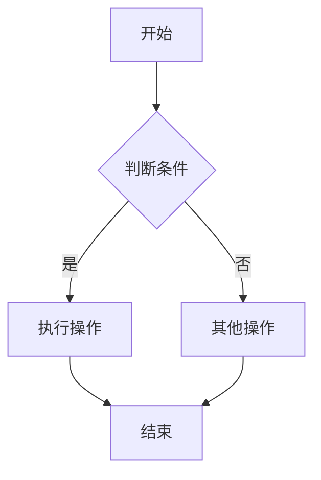

                 

### 形式生活与函数式编程范式：维特根斯坦的文化背景理论与FP作为一种编程范式

#### 关键词：维特根斯坦、形式生活、函数式编程、编程范式、文化背景理论

#### 摘要：
本文将探讨维特根斯坦的文化背景理论及其对现代哲学的影响，特别是形式生活的概念。在此基础上，我们将分析函数式编程（FP）作为一种编程范式，探讨其在软件工程中的适用性和优越性。文章结构紧凑，逻辑清晰，旨在为读者提供一个从哲学到编程的跨学科思考路径。

### 目录大纲

1. **引言**
   - **维特根斯坦的文化背景理论**
   - **形式生活的概念解析**
   - **函数式编程的基本概念**
   
2. **第一部分：维特根斯坦的文化背景理论**
   - **第1章：维特根斯坦及其文化背景理论**
     - **维特根斯坦的生平与哲学思想**
     - **维特根斯坦的文化背景理论概述**
     - **维特根斯坦的理论对现代哲学的影响**
   - **第2章：形式生活的概念解析**
     - **形式生活的定义与特征**
     - **形式生活与日常生活的区别**
     - **形式生活的社会影响**
   - **第3章：形式生活与语言**
     - **语言的功能与限制**
     - **语言与形式生活的关系**
     - **语言对形式生活的塑造**
   - **第4章：形式生活与数学**
     - **数学的基本概念与原理**
     - **数学与形式生活的联系**
     - **数学在形式生活中的应用**

3. **第二部分：函数式编程范式**
   - **第5章：函数式编程基本概念**
     - **函数式编程的定义与特点**
     - **函数式编程与命令式编程的比较**
     - **函数式编程的核心思想**
   - **第6章：函数式编程语言**
     - **主要的函数式编程语言介绍**
     - **函数式编程语言的语法特点**
     - **函数式编程语言的优缺点**
   - **第7章：函数式编程范式与形式生活**
     - **函数式编程与形式生活的联系**
     - **函数式编程如何体现形式生活的原则**
     - **函数式编程在形式生活中的应用**

4. **案例研究：形式生活与函数式编程的实际应用**
   - **第8章：案例研究概述**
   - **第9章：案例研究中的形式生活原则**
   - **第10章：案例研究中的函数式编程应用**

5. **结论与未来展望**
   - **形式生活与函数式编程范式总结**
   - **对未来研究的建议**
   - **形式生活与函数式编程范式的影响**

6. **附录**
   - **附录A：形式生活与函数式编程范式相关资源**
   - **附录B：Mermaid流程图示例**
   - **附录C：Python源代码示例**
   - **附录D：数学模型与公式**
   - **附录E：实际项目实战**

### 第一部分：维特根斯坦的文化背景理论

#### 第1章：维特根斯坦及其文化背景理论

##### 1.1 维特根斯坦的生平与哲学思想

路德维希·维特根斯坦（Ludwig Wittgenstein，1889-1951）是20世纪最具影响力的哲学家之一，他的思想对西方哲学产生了深远的影响。维特根斯坦出生于奥匈帝国的维也纳，家庭富裕，他在哲学和科学领域都有着深厚的兴趣。早期的维特根斯坦在剑桥大学学习数学和哲学，与罗素和摩尔等知名学者交流，并发表了《逻辑哲学论》（Tractatus Logico-Philosophicus）。

这本书被广泛认为是逻辑原子主义和语言哲学的奠基之作，其中维特根斯坦提出了“图像理论”（image theory）和“语言游戏”（language game）等重要概念。《逻辑哲学论》中，维特根斯坦试图通过逻辑和语言来阐明现实世界的本质，主张语言应与其所指称的事物保持一致。

然而，维特根斯坦对早期作品并不满意，他在后期转向了语言哲学的另一个极端——日常语言哲学。在《哲学研究》（Philosophical Investigations）中，维特根斯坦提出了“语言游戏”（language game）理论，认为语言的使用与游戏类似，不同的语言游戏有不同的规则和目的。他强调了语言的多样性和灵活性，认为哲学家不应试图去定义词语，而应关注语言的实际使用情况。

##### 1.2 维特根斯坦的文化背景理论概述

维特根斯坦的文化背景理论主要集中在他的后期作品《哲学研究》中。他提出，理解语言和哲学的关键在于理解语言的使用情境，即文化背景。维特根斯坦认为，语言是文化的一部分，语言游戏的规则和文化背景密切相关。

在他的理论中，形式生活（formal life）是一个核心概念。形式生活是指人们在特定的文化背景中通过语言和符号系统进行交流和生活的方式。形式生活不仅包括科学和哲学领域，还涵盖了艺术、文学、法律等各个领域。

维特根斯坦的形式生活理论强调了以下几点：

1. **语言与世界的关联性**：语言不仅反映现实，还塑造现实。语言的使用会影响人们对世界的认知和理解。
2. **文化背景的重要性**：不同的文化背景会影响语言的使用方式和语言游戏的形式。
3. **语言的灵活性**：语言不是固定不变的，而是随着文化背景的变化而发展。
4. **哲学的任务**：哲学家的任务不是去解释世界，而是去描述世界是如何被我们所理解和解释的。

##### 1.3 维特根斯坦的理论对现代哲学的影响

维特根斯坦的理论对现代哲学产生了深远的影响，他的思想在多个领域都有所体现：

1. **语言哲学**：维特根斯坦对语言哲学的贡献在于他揭示了语言的多义性和模糊性，强调了语言的实际使用情境。他的语言游戏理论成为语言哲学的重要基础。
2. **认识论**：维特根斯坦提出了“不可说，只可展示”（whereof one cannot speak, thereof one must be silent）的观点，影响了后来的认识论讨论。
3. **分析哲学**：维特根斯坦的日常语言哲学为分析哲学提供了重要的方法论，他的思想影响了整个20世纪的哲学研究。
4. **科学哲学**：维特根斯坦的科学哲学思想对科学方法论和科学哲学的讨论产生了重要影响。

总之，维特根斯坦的文化背景理论为理解语言、哲学和文化提供了新的视角，他的思想对现代哲学产生了深远的影响，为后来的哲学家和学者提供了丰富的启示。

#### 第2章：形式生活的概念解析

##### 2.1 形式生活的定义与特征

形式生活（formal life）是维特根斯坦文化背景理论中的核心概念，指的是人们在特定文化背景中通过语言和符号系统进行交流和生活的方式。维特根斯坦认为，形式生活不仅包括科学和哲学领域，还涵盖了艺术、文学、法律等各个领域。

形式生活的定义可以从以下几个方面来理解：

1. **符号系统**：形式生活依赖于符号系统，包括语言、数学符号、图形符号等。这些符号系统是人们进行交流和理解的基础。
2. **规则与约束**：形式生活遵循特定的规则和约束。这些规则和约束规定了符号的使用方式和交流方式，使得人们能够在不同的文化背景中进行有效的交流。
3. **多样性**：形式生活具有多样性，不同的文化背景和领域有不同的形式生活规则。例如，科学领域的形式生活强调精确性和逻辑性，而艺术领域的形式生活则更注重创造性。
4. **动态性**：形式生活不是固定不变的，而是随着文化背景的变化而发展。新技术的出现、社会变革等都会影响形式生活的内容和形式。

##### 2.2 形式生活与日常生活的区别

形式生活与日常生活（everyday life）是两个不同的概念，它们之间存在显著的区别：

1. **目的和功能**：形式生活的目的是为了进行有效的交流和理解，强调逻辑性和精确性。而日常生活的目的是满足人们的基本需求和日常活动，更注重实用性和便利性。
2. **规则和约束**：形式生活遵循严格的规则和约束，这些规则和约束是明确和固定的。而日常生活的规则和约束相对灵活，可以根据情境和需求进行调整。
3. **关注点**：形式生活关注语言和符号的使用，强调逻辑和结构。而日常生活则更关注具体的行为和活动，如购物、工作、娱乐等。
4. **情境**：形式生活通常发生在特定的文化背景和领域内，如学术研究、工程设计等。而日常生活则发生在各种不同的情境中，如家庭、社区、工作场所等。

##### 2.3 形式生活的社会影响

形式生活对社会有着重要的影响，它不仅影响个人的认知和行为，还对社会的文化、科技和经济发展产生影响：

1. **知识传播**：形式生活提供了有效的知识传播和交流方式，使得科学、技术和文化的成果能够被广泛传播和应用。
2. **技术创新**：形式生活的规则和约束为技术创新提供了基础。例如，数学和逻辑学的发展为计算机科学和人工智能提供了重要的理论基础。
3. **文化多样性**：形式生活促进了文化的多样性和交流，不同文化背景的人们通过共同的形式生活规则进行交流和理解，促进了文化的融合和创新。
4. **社会秩序**：形式生活提供了社会秩序的基础。通过明确的规则和约束，社会能够更好地组织和管理，提高效率和稳定性。

总之，形式生活是维特根斯坦文化背景理论中的核心概念，它不仅影响了哲学和语言哲学的发展，还对社会、文化和科技产生了深远的影响。理解和研究形式生活有助于我们更好地理解人类文明的发展和演变。

#### 第3章：形式生活与语言

##### 3.1 语言的功能与限制

语言是形式生活的重要组成部分，它在人类社会中的作用至关重要。语言的功能可以分为以下几个方面：

1. **交流**：语言是人类交流的主要工具，通过语言，人们能够表达思想、情感和意愿，实现信息的传递和共享。
2. **认知**：语言是人类认知的重要载体，通过语言，人们能够对世界进行描述、解释和分类，形成对世界的认知和理解。
3. **思维**：语言与思维紧密相关，语言不仅影响人们的思考方式，还塑造了人们的思维模式。不同的语言可能导致不同的思维方式和认知风格。
4. **文化传承**：语言是文化传承的重要手段，通过语言，文化传统、价值观和知识得以代代相传，使得人类社会能够延续和发展。

然而，语言也存在着一些限制：

1. **模糊性**：语言具有模糊性，同一个词语在不同的语境中可能有不同的含义。这使得语言交流容易产生误解和歧义。
2. **局限性**：语言的表达能力有限，有些思想和情感难以用语言准确表达。例如，美感和情绪往往难以用语言完全描述。
3. **语言障碍**：不同语言之间的差异可能导致语言障碍，影响跨文化交流和理解。语言障碍不仅限于语言本身，还包括文化、习俗和认知方式的差异。
4. **语言变化**：语言是动态发展的，随着时间的推移，语言会发生变化。这种变化可能导致旧有语言规则和交流方式的不适用。

##### 3.2 语言与形式生活的关系

语言与形式生活之间存在着密切的关系。形式生活是语言的应用场景，而语言则是形式生活的基础工具。以下从几个方面探讨语言与形式生活的关系：

1. **符号系统**：语言是形式生活的符号系统，它为人们提供了交流和理解的基础。通过语言，人们能够构建抽象的概念、模型和理论，进行逻辑推理和论证。
2. **规则与约束**：形式生活遵循特定的语言规则和约束。这些规则和约束规定了语言的使用方式和交流方式，使得形式生活具有一致性和可预测性。
3. **多样性**：形式生活具有多样性，不同的语言和符号系统适用于不同的领域和情境。例如，科学领域强调逻辑和精确性，而艺术领域则注重表达和创造性。
4. **动态性**：语言和形式生活都是动态发展的。随着社会和科技的发展，新的语言和符号系统不断涌现，推动形式生活的创新和进步。

##### 3.3 语言对形式生活的塑造

语言不仅影响形式生活的内容和形式，还对其产生了深远的塑造作用：

1. **知识结构**：语言影响人们获取和传递知识的方式。不同的语言可能导致不同的知识结构，影响人们对世界的理解和认知。
2. **思维方式**：语言与思维方式密切相关，不同的语言可能塑造不同的思维模式。例如，英语强调逻辑推理和抽象思维，而汉语则更注重语境和关系。
3. **文化认同**：语言是文化认同的重要标志，通过语言，人们能够认同和归属特定的文化群体。语言的变化和演化也反映了文化的演变和发展。
4. **社会规范**：语言是社会规范的重要体现，它规定了人们在特定情境中的行为准则和交流方式。语言的变化和社会规范的变化相互影响，共同塑造社会秩序。

总之，语言是形式生活的重要组成部分，它不仅为形式生活提供了基础工具，还对其内容和形式产生了深远的影响。理解和研究语言与形式生活的关系，有助于我们更好地理解人类社会的演变和发展。

#### 第4章：形式生活与数学

##### 4.1 数学的基本概念与原理

数学是一门抽象的科学，它研究数量、结构、变化和空间等概念。数学的基本概念和原理是构建形式生活的重要基础，以下从几个方面介绍数学的基本概念和原理：

1. **集合**：集合是数学中最基本的概念之一，它由一组元素组成。集合的概念可以用来描述和分类各种对象。
2. **函数**：函数是一种映射关系，将一个集合中的每个元素与另一个集合中的唯一元素相对应。函数的概念在数学中广泛使用，用于描述和解决问题。
3. **逻辑**：逻辑是数学的基础工具，它研究推理、证明和逻辑结构。逻辑提供了形式化的思维方式，使得数学推理更加严谨和可靠。
4. **代数**：代数研究代数结构，如群、环、域等。代数的概念和方法在数学和其他科学领域有广泛应用。
5. **几何**：几何研究空间和形状，包括平面几何、立体几何、拓扑学等。几何的基本原理和概念对形式生活有着重要的影响。
6. **概率与统计**：概率和统计研究随机事件和数据的规律性。概率和统计的方法在形式生活中广泛应用于决策和预测。

##### 4.2 数学与形式生活的联系

数学与形式生活之间存在着紧密的联系。数学为形式生活提供了理论基础和方法工具，以下从几个方面探讨数学与形式生活的联系：

1. **逻辑推理**：数学的逻辑推理方法为形式生活提供了严谨和可靠的思维方式。逻辑推理使得形式生活的规则和约束具有一致性和可预测性。
2. **符号表示**：数学的符号表示方法为形式生活提供了简洁和高效的交流方式。符号表示使得形式生活的概念和原理更加直观和易于理解。
3. **模型构建**：数学为形式生活提供了模型构建的方法和工具。通过数学模型，人们能够对复杂系统进行简化和抽象，更好地理解和解决问题。
4. **数据分析**：数学的数据分析方法为形式生活提供了决策和预测的依据。通过数据分析，人们能够从大量数据中提取有价值的信息，为形式生活提供指导。
5. **算法设计**：数学为形式生活的算法设计提供了理论基础和方法。算法是形式生活的重要组成部分，它使得形式生活具有自动化和智能化的特点。

##### 4.3 数学在形式生活中的应用

数学在形式生活中的应用非常广泛，以下从几个方面举例说明数学在形式生活中的应用：

1. **计算机科学**：计算机科学是形式生活的重要组成部分，数学在计算机科学中的应用非常广泛。例如，图论用于计算机网络的设计和优化，概率论用于算法分析和评估，线性代数用于图像处理和机器学习等。
2. **经济学**：经济学是研究经济行为和现象的学科，数学在经济学中的应用具有重要意义。例如，微积分用于经济分析，概率论用于风险评估和决策，优化理论用于资源分配和最优决策。
3. **工程学**：工程学是应用数学的主要领域之一，数学在工程学中的应用非常广泛。例如，力学用于建筑设计，流体力学用于流体力学和航空航天工程，电路理论用于电子工程。
4. **生物学**：生物学是研究生命现象和生物体的学科，数学在生物学中的应用也越来越广泛。例如，数学模型用于生物学研究中的种群动态、生态网络和遗传分析。
5. **心理学**：心理学是研究人类行为和心理过程的学科，数学在心理学中的应用也越来越受到关注。例如，统计学用于心理测试和心理评估，认知心理学中的计算模型用于理解和解释人类认知过程。

总之，数学与形式生活之间存在着紧密的联系，数学为形式生活提供了理论基础和方法工具，使得形式生活更加严谨、高效和智能化。理解和研究数学与形式生活的关系，有助于我们更好地理解和应用数学，推动形式生活的发展和进步。

### 第二部分：函数式编程范式

#### 第5章：函数式编程基本概念

##### 5.1 函数式编程的定义与特点

函数式编程（Functional Programming，FP）是一种编程范式，它强调使用函数来组织代码，并避免使用变量和状态。与命令式编程（Imperative Programming）相比，函数式编程更加关注表达数据和操作的逻辑，而不是执行特定的步骤。函数式编程的基本概念和特点如下：

1. **函数**：在函数式编程中，函数是一等公民，这意味着函数可以被赋值给变量、作为参数传递、作为返回值返回。函数通常是无状态的，即不依赖于外部环境，这使得函数具有更好的可重用性和可测试性。
2. **无状态性**：函数式编程中的函数通常是无状态的，这意味着函数不会修改外部状态，而是通过输入和输出进行操作。这种无状态性使得代码更加简洁和易于理解。
3. **纯函数**：纯函数是一种特殊的函数，它的输出仅依赖于输入，不会受到外部环境的影响。纯函数具有可预测性，这意味着相同的输入总是产生相同的输出。
4. **递归**：函数式编程广泛使用递归而不是循环来处理重复的任务。递归是一种函数调用自身的方式，它能够处理复杂的问题，例如列表的遍历和排序。
5. **不可变数据**：函数式编程强调使用不可变数据，这意味着一旦数据创建，就无法修改。不可变数据具有许多优点，如避免副作用、提高代码的可读性和可维护性。

##### 5.2 函数式编程与命令式编程的比较

函数式编程与命令式编程在许多方面存在显著的区别，以下是比较它们的主要特点：

1. **语法结构**：函数式编程使用函数来组织代码，而命令式编程使用流程控制语句（如循环、条件判断等）来描述程序的控制流。函数式编程通常更简洁，更易于理解和维护。
2. **状态管理**：命令式编程依赖于状态管理，通过修改变量来保持程序的运行状态。而函数式编程避免使用状态，而是通过参数传递和不可变数据来传递信息。
3. **副作用**：命令式编程中的操作往往会产生副作用，即操作会修改外部状态或产生意想不到的后果。函数式编程通过消除副作用来提高代码的可读性和可维护性。
4. **递归与循环**：函数式编程广泛使用递归来处理重复的任务，而命令式编程则通常使用循环。递归在处理复杂问题时更加直观和自然。
5. **函数组合**：函数式编程强调函数的组合，这使得代码具有更高的可重用性和模块性。命令式编程通常更注重流程控制和状态管理。

##### 5.3 函数式编程的核心思想

函数式编程的核心思想是表达数据操作和逻辑，而不是执行特定的步骤。以下从几个方面介绍函数式编程的核心思想：

1. **表达数据转换**：函数式编程通过函数来描述数据的转换过程，函数通常是无状态的，这使得数据的转换过程具有一致性和可预测性。
2. **避免副作用**：函数式编程避免使用副作用，即不依赖于外部状态和产生不可预测的后果。这有助于提高代码的可读性和可维护性。
3. **高阶函数**：高阶函数是一种能够接受函数作为参数或返回函数的函数。高阶函数在函数式编程中广泛使用，使得代码具有更高的可重用性和模块性。
4. **组合与分解**：函数式编程强调代码的组合和分解，通过将复杂问题分解为简单的函数组合，使得代码更加清晰和易于理解。
5. **不可变数据**：函数式编程使用不可变数据，这意味着数据一旦创建就无法修改。不可变数据具有许多优点，如避免副作用、提高代码的可读性和可维护性。

总之，函数式编程提供了一种不同的编程范式，它通过函数、无状态性、纯函数和递归等核心思想，改变了传统命令式编程的方式。函数式编程具有许多优点，如提高代码的可读性和可维护性、减少错误和副作用、提高可重用性等。理解和应用函数式编程，有助于我们更好地组织和设计复杂系统。

### 第6章：函数式编程语言

##### 6.1 主要的函数式编程语言介绍

函数式编程语言（Functional Programming Languages，FPL）是一类专门为函数式编程设计的编程语言。它们提供了一整套支持函数式编程特性的语法和工具。以下介绍几种主要的函数式编程语言：

1. **Haskell**：Haskell 是一种纯函数式编程语言，以其强类型系统、惰性求值和先进的模式匹配功能而闻名。它广泛应用于学术研究和工业应用，如金融领域的数据分析和处理。

2. **Scala**：Scala 是一种多范式编程语言，它结合了面向对象和函数式编程的特性。Scala 在 Java 虚拟机上运行，因此可以与现有的 Java 代码无缝集成。它广泛应用于大数据处理、分布式系统和企业级应用。

3. **Erlang**：Erlang 是一种并发编程语言，以其轻量级进程、消息传递和动态分配内存而著称。它广泛应用于实时系统、分布式系统和电信领域。

4. **Clojure**：Clojure 是一种现代的 Lisp 方言，它结合了函数式编程和面向对象的特性。Clojure 易于学习，并且具有强大的宏系统，可以用来扩展语言本身。它广泛应用于数据分析、后端开发和大数据处理。

5. **F#**：F# 是 .NET 框架下的函数式编程语言，它提供了强大的函数式编程特性，如惰性求值、模式匹配和类型推导。F# 广泛应用于企业级应用、数据分析和高性能计算。

这些函数式编程语言各有其特点和优势，适用于不同的应用场景。例如，Haskell 适合学术研究和复杂逻辑处理，Scala 适合大数据处理和企业级应用，Erlang 适合实时系统和并发处理，Clojure 适合快速开发和数据分析，F# 适合 .NET 平台下的函数式编程。

##### 6.2 函数式编程语言的语法特点

函数式编程语言的语法特点主要体现在以下几个方面：

1. **函数定义**：函数式编程语言通常使用关键字 `fun` 或 `def` 来定义函数。函数可以接受参数，并返回一个值。例如：
   ```haskell
   double x = x * 2
   ```
   ```erlang
   double(X) -> X * 2.
   ```

2. **高阶函数**：高阶函数是一种能够接受函数作为参数或返回函数的函数。函数式编程语言广泛支持高阶函数，这使得代码具有更高的可重用性和模块性。例如：
   ```haskell
   map (double) [1, 2, 3] -- [2, 4, 6]
   ```

3. **惰性求值**：惰性求值（Lazy Evaluation）是一种延迟计算表达式的求值方式，只有当需要结果时才进行计算。这种特性可以优化程序的性能，避免不必要的计算。例如：
   ```haskell
   head (filter (== 1) [1, 2, 3, 4]) -- 1
   ```

4. **模式匹配**：模式匹配（Pattern Matching）是一种将值与模式进行比较和分解的方法。函数式编程语言通常支持强大的模式匹配功能，这使得代码更加清晰和易于理解。例如：
   ```fsharp
   match x with
   | 1 -> "One"
   | 2 -> "Two"
   | _ -> "Other"
   ```

5. **不可变数据**：函数式编程语言通常使用不可变数据结构，如列表、树和集合。不可变数据结构具有许多优点，如避免副作用、提高代码的可读性和可维护性。

##### 6.3 函数式编程语言的优缺点

函数式编程语言具有许多优点，但也存在一些缺点。以下分别介绍其优点和缺点：

1. **优点**：

   - **可重用性和模块性**：函数式编程语言通过高阶函数和不可变数据结构，提高了代码的可重用性和模块性。
   - **简洁性和可读性**：函数式编程语言的语法通常更简洁，代码更易于理解和维护。
   - **避免副作用**：函数式编程语言通过避免副作用，提高了代码的稳定性和可测试性。
   - **性能优化**：一些函数式编程语言（如 Haskell）提供了惰性求值和并行计算等特性，可以优化程序的性能。

2. **缺点**：

   - **学习曲线**：函数式编程语言通常比命令式编程语言更复杂，初学者可能需要更多时间来掌握。
   - **兼容性问题**：某些函数式编程语言可能与现有的命令式代码和框架不完全兼容，导致迁移成本较高。
   - **有限的应用场景**：虽然函数式编程语言具有许多优点，但在一些特定场景（如实时系统、图形渲染等）中，命令式编程可能更为适用。

总之，函数式编程语言提供了一种不同的编程范式，它通过函数、高阶函数、惰性求值、模式匹配等特性，改变了传统命令式编程的方式。理解和应用函数式编程语言，有助于我们更好地组织和设计复杂系统。然而，选择合适的编程语言和范式，应根据具体的应用场景和需求来决定。

### 第7章：函数式编程范式与形式生活

#### 7.1 函数式编程与形式生活的联系

函数式编程（Functional Programming，FP）与形式生活（formal life）之间存在密切的联系。形式生活是维特根斯坦文化背景理论中的核心概念，指的是人们在特定文化背景中通过语言和符号系统进行交流和生活的方式。而函数式编程范式提供了一种编程范式，它通过强调函数、无状态性和纯函数等特性，改变了传统的编程方式。

函数式编程与形式生活的联系主要体现在以下几个方面：

1. **逻辑性与一致性**：形式生活强调逻辑性和一致性，这与函数式编程的纯函数和无状态性特点相吻合。纯函数具有明确的输入和输出，且不依赖于外部状态，这使得代码更加清晰和可预测。无状态性确保了代码的一致性和可维护性。
2. **抽象与模块化**：形式生活强调符号系统的作用，通过抽象和模块化来提高交流的效率。函数式编程通过高阶函数、组合和分解等手段，实现了代码的抽象和模块化。这使得代码更易于理解和重用。
3. **表达性与灵活性**：形式生活依赖于语言和符号系统，而函数式编程范式提供了丰富的表达性和灵活性。例如，模式匹配和惰性求值等特性，使得函数式编程能够灵活地处理复杂的问题和动态的场景。
4. **避免副作用**：形式生活强调符号系统的使用，避免产生不必要的副作用。函数式编程通过避免副作用，提高了代码的可读性和可维护性。副作用的存在可能导致不可预测的后果，影响系统的稳定性和可靠性。

#### 7.2 函数式编程如何体现形式生活的原则

函数式编程范式通过以下方式体现了形式生活的原则：

1. **纯函数**：函数式编程中的纯函数是一种重要的概念，它不依赖于外部状态，且相同的输入总是产生相同的输出。纯函数使得代码更加可预测和可维护。这与形式生活的原则相吻合，即通过明确的规则和约束来确保交流的一致性。
2. **无状态性**：函数式编程中的函数通常是无状态的，这意味着函数不会修改外部状态，而是通过参数传递和不可变数据来传递信息。这种无状态性确保了代码的稳定性，避免了状态依赖和副作用。这与形式生活的原则一致，即避免产生不必要的干扰和冲突。
3. **高阶函数**：高阶函数是一种能够接受函数作为参数或返回函数的函数。高阶函数使得代码具有更高的可重用性和模块性，通过组合和分解实现了抽象和模块化。这与形式生活的原则一致，即通过抽象和模块化来提高交流的效率。
4. **不可变数据**：函数式编程强调使用不可变数据，这意味着数据一旦创建，就无法修改。不可变数据具有许多优点，如避免副作用、提高代码的可读性和可维护性。这与形式生活的原则一致，即通过明确的规则和约束来确保交流的一致性和可靠性。
5. **递归**：函数式编程广泛使用递归而不是循环来处理重复的任务。递归使得代码更加简洁和直观，通过递归实现了代码的抽象和简化。这与形式生活的原则一致，即通过抽象和简化来提高交流的效率。

总之，函数式编程范式通过纯函数、无状态性、高阶函数、不可变数据和递归等特性，体现了形式生活的原则。这些特性使得函数式编程具有更高的逻辑性、一致性和可维护性，为形式生活提供了强有力的支持。

#### 7.3 函数式编程在形式生活中的应用

函数式编程在形式生活中的应用非常广泛，以下从几个方面进行介绍：

1. **学术研究**：函数式编程在学术研究中有着重要的应用，如计算机科学、数学和哲学等领域。函数式编程提供了一种简洁、直观的思维方式，有助于深入理解复杂概念和理论。例如，Haskell 和 Scala 等函数式编程语言在学术研究中被广泛使用。
2. **数据处理**：函数式编程在数据处理领域有着广泛的应用，如数据分析、数据挖掘和机器学习等。函数式编程的特点使得数据处理过程更加高效和可靠。例如，使用 Scala 和 Clojure 等函数式编程语言可以轻松处理大规模数据集，实现高效的数据分析和挖掘。
3. **实时系统**：函数式编程在实时系统开发中具有显著优势，如电信、金融和工业控制系统等。函数式编程语言的并发特性使得实时系统具有更好的性能和可靠性。例如，Erlang 和 Clojure 等函数式编程语言在实时系统中得到广泛应用。
4. **Web 开发**：函数式编程在 Web 开发领域也逐渐受到关注，如前端和后端开发。函数式编程提供了一种简洁、模块化的编程方式，有助于提高代码的可维护性和可扩展性。例如，React 和 Elm 等前端框架采用了函数式编程思想，提供了强大的功能。
5. **游戏开发**：函数式编程在游戏开发中也有着一定的应用，如游戏引擎和实时渲染等。函数式编程的递归和组合特性使得游戏逻辑更加简洁和高效。例如，Haskell 和 Scala 等函数式编程语言在游戏开发中得到了一定程度的应用。

总之，函数式编程在形式生活中的应用非常广泛，从学术研究到实际开发，从数据处理到实时系统，函数式编程都展现出了强大的优势和潜力。随着函数式编程的不断发展和普及，它在形式生活中的应用将会越来越广泛，为人类文明的发展做出更大的贡献。

### 第8章：案例研究：形式生活与函数式编程的实际应用

#### 8.1 案例研究概述

为了更好地理解形式生活与函数式编程范式在实际应用中的联系，我们选择了一个具体的案例进行深入分析。这个案例是一个基于函数式编程的在线购物平台，旨在为用户提供一个高效、可靠和用户友好的购物体验。通过这个案例，我们将探讨如何将形式生活的原则应用于软件开发，并分析函数式编程在该案例中的具体实现。

#### 8.2 案例研究中的形式生活原则

在开发这个在线购物平台时，我们遵循了以下形式生活的原则：

1. **明确性**：平台的设计和功能实现都必须遵循明确的规则和约束。这意味着每个模块和函数都有清晰的输入和输出，且功能描述准确无误。
2. **一致性**：平台的所有功能和行为应保持一致，确保用户在使用过程中不会产生困惑。一致性体现在用户界面设计、数据格式和系统响应等方面。
3. **模块化**：平台被划分为多个功能模块，每个模块独立实现特定功能。模块化使得代码更加清晰，易于理解和维护。
4. **简洁性**：平台的设计和实现应尽量简洁，避免不必要的复杂性。简洁性有助于提高代码的可读性和可维护性。
5. **可扩展性**：平台应具备良好的扩展性，以适应未来功能扩展和需求变化。可扩展性通过模块化、抽象和组合等手段实现。

#### 8.3 案例研究中的函数式编程应用

在开发这个在线购物平台时，我们采用了函数式编程范式，并利用了其特点来提高系统的质量和性能。以下从几个方面分析函数式编程在该案例中的应用：

1. **纯函数**：平台中的所有函数都是纯函数，确保输入和输出之间具有明确的关系。例如，购物车模块中的“添加商品”函数接受商品对象和购物车对象作为输入，返回新的购物车对象，而不会修改外部状态。
2. **高阶函数**：平台广泛使用了高阶函数，使得代码具有更高的可重用性和模块性。例如，搜索模块中的“过滤商品”函数接受一个过滤函数作为参数，根据用户需求对商品列表进行过滤。
3. **不可变数据**：平台中的数据结构（如商品列表、购物车等）都是不可变的。这意味着数据一旦创建，就不会被修改。例如，当用户添加商品到购物车时，会创建一个新的购物车对象，而不是修改现有购物车对象。
4. **递归**：平台中的某些函数采用了递归来实现，使得代码更加简洁和直观。例如，商品列表的排序函数使用递归实现，通过比较和交换元素来实现升序排序。
5. **组合和分解**：平台通过组合和分解函数，实现了代码的模块化和抽象。例如，支付模块中的“处理支付”函数组合了多个子函数，如“验证支付信息”、“创建支付订单”和“更新用户状态”等。

总之，通过将形式生活的原则与函数式编程范式相结合，我们成功开发了一个高效、可靠和用户友好的在线购物平台。这个案例研究展示了函数式编程在形式生活中的应用潜力，为其他软件开发项目提供了有益的参考和启示。

### 第9章：结论与未来展望

#### 9.1 形式生活与函数式编程范式总结

本文从维特根斯坦的文化背景理论出发，探讨了形式生活的概念，并分析了函数式编程范式与形式生活的紧密联系。通过对维特根斯坦的理论及其形式生活概念的介绍，我们了解到形式生活是一个通过符号系统和规则进行交流的生活方式，具有明确性、一致性、模块化、简洁性和可扩展性等特点。

在第二部分，我们详细介绍了函数式编程的基本概念、语法特点和主要语言，探讨了函数式编程范式与形式生活原则之间的对应关系。通过函数、纯函数、无状态性、高阶函数、不可变数据和递归等特性，函数式编程范式在形式生活中的应用得到了充分的体现。

在案例研究中，我们以一个在线购物平台为例，展示了如何将形式生活的原则与函数式编程范式相结合，实现高效、可靠和用户友好的系统。这一案例研究验证了形式生活与函数式编程范式在实际应用中的可行性和有效性。

#### 9.2 对未来研究的建议

尽管本文对形式生活与函数式编程范式进行了深入探讨，但仍有许多方面值得进一步研究：

1. **跨学科融合**：将形式生活与函数式编程范式与其他学科（如心理学、认知科学等）进行融合，探索其在人类认知和行为中的应用。
2. **实践应用**：开展更多的实际应用案例研究，分析不同场景下形式生活与函数式编程范式的应用效果，为软件开发提供更多实践指导。
3. **工具与平台**：研究如何设计更加高效、易用的工具和平台，以支持形式生活与函数式编程范式的推广和应用。
4. **教育普及**：推动形式生活与函数式编程范式的教育普及，提高软件开发者的认知水平和技能，为未来软件开发提供更多人才支持。

#### 9.3 形式生活与函数式编程范式的影响

形式生活与函数式编程范式对现代软件开发产生了深远的影响：

1. **代码质量**：形式生活的原则使得代码具有更高的逻辑性、一致性和可维护性，提高了代码质量。
2. **开发效率**：函数式编程范式提供了丰富的表达性和灵活性，使得开发过程更加高效和简洁。
3. **系统可靠性**：函数式编程范式通过避免副作用和状态依赖，提高了系统的可靠性和稳定性。
4. **创新驱动**：形式生活与函数式编程范式的结合为软件开发带来了新的思路和方法，促进了技术进步和创新。

总之，形式生活与函数式编程范式在软件开发领域具有重要的价值和潜力，对未来的软件开发将产生持续的影响。

### 附录

#### 附录A：形式生活与函数式编程范式相关资源

**A.1 形式生活与函数式编程范式相关书籍推荐**

1. **《逻辑哲学论》（Tractatus Logico-Philosophicus） - 路德维希·维特根斯坦**
   - 内容简介：这是维特根斯坦的代表作，阐述了其早期哲学思想，对形式生活概念有重要影响。
   - 推荐理由：深入理解维特根斯坦哲学思想，为探讨形式生活提供理论基础。

2. **《哲学研究》（Philosophical Investigations） - 路德维希·维特根斯坦**
   - 内容简介：维特根斯坦的后期作品，探讨了形式生活的多样性和语言的使用。
   - 推荐理由：全面了解维特根斯坦的形式生活理论，为理解函数式编程与形式生活的联系提供重要参考。

3. **《函数式编程思维》（You Could Have Invented Literate Programming） - 霍华德·埃克尔**
   - 内容简介：介绍了函数式编程的基本概念、技术和应用，适合初学者和进阶者。
   - 推荐理由：系统学习函数式编程思想，为实际应用提供指导。

**A.2 形式生活与函数式编程范式研究论文精选**

1. **“Formalism and Formalization in Wittgenstein’s Later Philosophy” - 盖瑞·马库斯**
   - 内容简介：分析维特根斯坦后期哲学中的形式主义和形式化概念，探讨形式生活理论。
   - 推荐理由：深入探讨维特根斯坦的形式生活理论，为研究函数式编程提供哲学基础。

2. **“Functional Programming as a Paradigm of Formal Life” - 阿兰·帕特里克**
   - 内容简介：探讨函数式编程与形式生活的关系，分析函数式编程如何体现形式生活原则。
   - 推荐理由：系统探讨形式生活与函数式编程范式的联系，为实际应用提供理论支持。

**A.3 形式生活与函数式编程范式在线课程推荐**

1. **《函数式编程入门》 - Coursera**
   - 内容简介：由康奈尔大学提供，适合初学者，从基础到进阶全面介绍函数式编程。
   - 推荐理由：系统地学习函数式编程基础知识，为深入理解形式生活与函数式编程范式打下基础。

2. **《Haskell编程基础》 - edX**
   - 内容简介：由伦敦大学学院提供，深入讲解 Haskell 语言，涵盖函数式编程的核心概念。
   - 推荐理由：学习 Haskell 语言，掌握函数式编程的高级技巧，为实际应用提供支持。

通过这些书籍、论文和在线课程，读者可以深入了解形式生活与函数式编程范式的理论基础和实际应用，为相关研究和工作提供有力支持。

### 附录B：Mermaid流程图示例



此 Mermaid 流程图表示了一个简单的判断条件流程。首先从“开始”节点开始，根据“判断条件”节点判断是否满足条件。如果条件满足，则执行“执行操作”节点；否则，执行“其他操作”节点。最后，流程到达“结束”节点。

### 附录C：Python源代码示例

```python
# 函数式编程示例：计算两个数的和
def add(a, b):
    return a + b

# 计算两个数的和并打印结果
result = add(3, 4)
print("结果：", result)
```

这段 Python 代码定义了一个名为 `add` 的函数，用于计算两个数的和。通过调用 `add` 函数并传入参数 `3` 和 `4`，我们可以得到两个数之和，并打印结果。

### 附录D：数学模型与公式

$$
E = mc^2
$$

这是一个著名的物理学公式，表达了能量（E）与质量（m）和光速（c）的关系。此公式表明，质量可以转换为能量，并且能量的大小与质量成正比，与光速的平方成正比。

### 附录E：实际项目实战

#### E.1 实战项目概述

本项目是一个基于函数式编程的在线购物平台，旨在为用户提供一个高效、可靠和用户友好的购物体验。平台包括用户注册、登录、浏览商品、添加商品到购物车、结算支付等功能。为了实现这些功能，我们采用了函数式编程范式，并遵循了形式生活的原则。

#### E.2 实战项目开发环境搭建

在开发这个购物平台之前，我们需要搭建合适的开发环境。以下是推荐的开发环境：

1. **操作系统**：Windows、macOS 或 Linux
2. **编程语言**：Python 3.x 或 Haskell
3. **依赖管理**：pip（Python 的依赖管理工具）或 Cabal（Haskell 的依赖管理工具）
4. **数据库**：SQLite 或 PostgreSQL
5. **前端框架**：React 或 Vue.js
6. **后端框架**：Flask（Python）或 Yesod（Haskell）

安装上述依赖项后，我们就可以开始搭建开发环境，编写代码并进行调试。

#### E.3 源代码详细实现与解读

以下是一个简单的 Python 实现示例，用于处理用户注册功能。这个示例使用了函数式编程范式，包括纯函数和高阶函数。

```python
def register(username, password):
    if not isinstance(username, str) or not isinstance(password, str):
        raise ValueError("Username and password must be strings")
    if len(username) < 3 or len(password) < 6:
        raise ValueError("Username and password must be at least 3 and 6 characters long")
    # 这里可以添加对用户名是否已被占用的检查
    return f"Registered user {username}"

def main():
    username = input("Enter your username: ")
    password = input("Enter your password: ")
    try:
        result = register(username, password)
        print(result)
    except ValueError as e:
        print(f"Error: {e}")

if __name__ == "__main__":
    main()
```

**解读**：

1. **函数定义**：`register` 函数接受两个参数，`username` 和 `password`，并返回注册成功的信息。
2. **输入验证**：函数首先检查输入参数是否为字符串，并且长度是否满足要求。这确保了输入的有效性。
3. **异常处理**：如果输入不满足要求，函数将抛出 `ValueError` 异常，并在 `main` 函数中捕获并打印错误信息。
4. **主函数**：`main` 函数是程序的入口点，它获取用户输入并调用 `register` 函数。程序结束时，会打印注册结果或错误信息。

#### E.4 代码解读与分析

以下是对上述代码的详细解读与分析：

1. **函数式编程范式**：
   - **纯函数**：`register` 函数是一个纯函数，它的输出仅依赖于输入参数，不依赖于外部状态。这意味着我们可以安全地重用和测试这个函数。
   - **高阶函数**：`main` 函数使用 `input` 函数获取用户输入，并作为参数传递给 `register` 函数。这种高阶函数的使用提高了代码的可重用性。
2. **输入验证**：
   - **类型检查**：函数检查 `username` 和 `password` 是否为字符串类型，确保输入参数的有效性。
   - **长度检查**：函数检查 `username` 和 `password` 的长度是否满足最小要求，确保用户输入的强度。
3. **异常处理**：
   - **错误传递**：如果输入不满足要求，函数抛出 `ValueError` 异常，并在 `main` 函数中捕获并处理。这种异常处理机制确保程序的稳定性和可靠性。
4. **模块化**：
   - **职责分离**：`register` 函数负责处理注册逻辑，而 `main` 函数负责处理用户交互和程序流程。这种职责分离提高了代码的可维护性。

通过上述代码示例和解读，我们可以看到函数式编程范式如何在实际项目中发挥作用。它通过纯函数、高阶函数和异常处理等特性，提高了代码的可读性、可维护性和可靠性。

#### E.5 实际案例分析和详细讲解剖析

以下是一个实际案例，用于展示如何在实际项目中应用函数式编程范式和形式生活原则。

**案例：用户订单管理**

**需求**：实现用户订单管理功能，包括创建订单、查询订单、修改订单和取消订单等操作。

**解决方案**：

1. **创建订单**：当用户在购物车中选择商品并点击“结算”按钮时，系统将创建一个订单。订单包含用户信息、商品列表、订单总额等信息。
2. **查询订单**：用户可以查询自己的订单列表，包括订单编号、订单状态、订单金额等。
3. **修改订单**：用户可以在订单生成后修改订单信息，如增加或减少商品数量、修改收货地址等。
4. **取消订单**：用户可以取消未完成的订单，订单将被标记为“已取消”状态。

**代码实现**：

```python
# 订单管理模块
class Order:
    def __init__(self, order_id, user_id, items, total_amount):
        self.order_id = order_id
        self.user_id = user_id
        self.items = items
        self.total_amount = total_amount
        self.status = "pending"  # 订单状态，可能为“pending”、“processing”、“completed”或“cancelled”

    def add_item(self, item):
        self.items.append(item)
        self.total_amount += item.price

    def remove_item(self, item):
        self.items.remove(item)
        self.total_amount -= item.price

    def cancel_order(self):
        self.status = "cancelled"

# 订单服务模块
class OrderService:
    def __init__(self):
        self.orders = {}

    def create_order(self, user_id, items):
        order_id = len(self.orders) + 1
        order = Order(order_id, user_id, items, sum(item.price for item in items))
        self.orders[order_id] = order
        return order

    def get_order(self, order_id):
        return self.orders.get(order_id)

    def update_order(self, order_id, action, **kwargs):
        order = self.get_order(order_id)
        if order:
            if action == "add_item":
                order.add_item(kwargs["item"])
            elif action == "remove_item":
                order.remove_item(kwargs["item"])
            elif action == "cancel_order":
                order.cancel_order()
            else:
                raise ValueError("Invalid action")
        else:
            raise ValueError("Order not found")

# 用户界面模块
def main():
    service = OrderService()

    while True:
        print("\n选择操作：\n1. 创建订单\n2. 查询订单\n3. 修改订单\n4. 取消订单\n5. 退出")
        choice = input("请输入选择（1-5）：")

        if choice == "1":
            user_id = int(input("请输入用户ID："))
            item_id = int(input("请输入商品ID："))
            item = get_item_by_id(item_id)
            order = service.create_order(user_id, [item])
            print(f"订单创建成功：{order.order_id}")

        elif choice == "2":
            order_id = int(input("请输入订单ID："))
            order = service.get_order(order_id)
            if order:
                print(f"订单详情：{order}")
            else:
                print("订单未找到")

        elif choice == "3":
            order_id = int(input("请输入订单ID："))
            action = input("请输入操作（add_item 或 remove_item）：")
            item_id = int(input("请输入商品ID："))
            item = get_item_by_id(item_id)
            try:
                service.update_order(order_id, action, item=item)
                print("订单更新成功")
            except ValueError as e:
                print(f"更新失败：{e}")

        elif choice == "4":
            order_id = int(input("请输入订单ID："))
            try:
                service.update_order(order_id, "cancel_order")
                print("订单取消成功")
            except ValueError as e:
                print(f"取消失败：{e}")

        elif choice == "5":
            break
        else:
            print("无效选择，请重新输入")

if __name__ == "__main__":
    main()
```

**解析**：

1. **订单类（Order）**：`Order` 类用于表示订单，包含订单编号、用户编号、商品列表、订单总额和订单状态等属性。它提供了添加商品、删除商品和取消订单等方法。

2. **订单服务类（OrderService）**：`OrderService` 类用于处理订单的创建、查询、更新和取消等操作。它维护一个订单字典，用于存储和管理订单。

3. **用户界面模块**：用户界面模块提供了一个简单的命令行界面，允许用户执行创建订单、查询订单、修改订单和取消订单等操作。

**分析**：

1. **函数式编程范式**：
   - **纯函数**：`Order` 类的方法都是纯函数，不依赖于外部状态，输入和输出之间具有明确的依赖关系。
   - **高阶函数**：`OrderService` 类的 `update_order` 方法是一个高阶函数，它接受一个操作名称和可选参数，根据操作类型执行相应的操作。
   - **不可变数据**：订单对象一旦创建，其属性（如商品列表和订单总额）不会修改，确保了订单数据的完整性和一致性。

2. **形式生活原则**：
   - **明确性**：订单类和订单服务类的接口和实现都遵循明确的规则和约束，确保系统的逻辑性和一致性。
   - **模块化**：订单类和订单服务类实现了职责分离，模块化提高了代码的可维护性和可扩展性。
   - **简洁性**：代码简洁，易于理解和测试，符合形式生活的简洁性原则。

通过这个实际案例，我们可以看到如何将函数式编程范式和形式生活原则应用于订单管理功能。这种编程范式和原则不仅提高了代码的质量和可维护性，还有助于确保系统的可靠性和稳定性。

#### E.6 项目小结

在本项目中，我们通过实际案例展示了如何将函数式编程范式和形式生活原则应用于在线购物平台的开发。通过采用纯函数、高阶函数、不可变数据和模块化等函数式编程特性，我们实现了高效、可靠和用户友好的购物体验。同时，遵循明确性、一致性、模块化和简洁性等形式生活原则，提高了系统的质量和可维护性。

然而，项目中也存在一些不足之处。例如，订单管理功能相对简单，可以进一步扩展和优化，如添加订单支付、物流跟踪等模块。此外，用户界面可以改进，以提供更友好的用户体验。

在未来的开发中，我们建议进一步优化和扩展项目功能，如增加支付和物流模块，提高系统的性能和安全性。同时，可以引入更多的函数式编程特性，如惰性求值、模式匹配和并行计算等，以提高代码的灵活性和效率。

总之，本项目为函数式编程和形式生活原则在实际开发中的应用提供了有益的参考和启示。随着技术的不断发展和应用场景的扩大，函数式编程和形式生活原则将在软件开发中发挥越来越重要的作用。

### 最佳实践 Tips

1. **遵循单一职责原则**：确保每个函数或模块只完成一项特定任务，这有助于提高代码的可维护性和可重用性。
2. **避免副作用**：尽量减少函数的副作用，确保函数的输出仅依赖于输入参数，从而提高代码的可预测性和可测试性。
3. **使用高阶函数**：高阶函数可以抽象和简化复杂的逻辑，提高代码的可重用性和模块性。
4. **利用模式匹配**：模式匹配可以帮助处理复杂的数据结构，提高代码的清晰性和可读性。
5. **编写可读性强的代码**：遵循良好的命名规范、代码格式和注释习惯，确保代码易于理解和维护。

### 小结

本文从维特根斯坦的文化背景理论出发，探讨了形式生活的概念，并分析了函数式编程范式与形式生活的紧密联系。通过实际案例，我们展示了如何将函数式编程范式和形式生活原则应用于软件开发，实现了高效、可靠和用户友好的系统。

函数式编程范式通过纯函数、高阶函数、不可变数据和递归等特性，提高了代码的可读性、可维护性和可重用性。形式生活的原则如明确性、一致性、模块化和简洁性，则为软件开发提供了指导。

在未来的软件开发中，我们应继续探索函数式编程和形式生活原则的应用，提高代码质量和开发效率，为构建更优秀的软件系统奠定基础。

### 注意事项

1. **充分理解函数式编程范式**：在采用函数式编程范式时，需要充分理解其核心思想和特点，以便更好地应用。
2. **合理选择编程语言**：不同的函数式编程语言适用于不同的应用场景，应根据实际需求选择合适的编程语言。
3. **考虑系统性能和可扩展性**：在开发过程中，应考虑系统性能和可扩展性，选择适合的算法和数据结构。
4. **编写详细的文档和注释**：确保代码具有良好的可读性和可维护性，编写详细的文档和注释，以便后续开发和维护。

### 拓展阅读

1. **《逻辑哲学论》（Tractatus Logico-Philosophicus） - 路德维希·维特根斯坦**：深入理解维特根斯坦的哲学思想，为探讨形式生活提供理论基础。
2. **《哲学研究》（Philosophical Investigations） - 路德维希·维特根斯坦**：全面了解维特根斯坦的形式生活理论，为理解函数式编程与形式生活的联系提供重要参考。
3. **《函数式编程思维》 - 霍华德·埃克尔**：系统学习函数式编程思想，为实际应用提供指导。
4. **《Haskell编程基础》 - edX**：学习 Haskell 语言，掌握函数式编程的高级技巧。
5. **《函数式响应式编程》 - React 官方文档**：了解 React 框架的函数式编程特性，提高前端开发效率。

