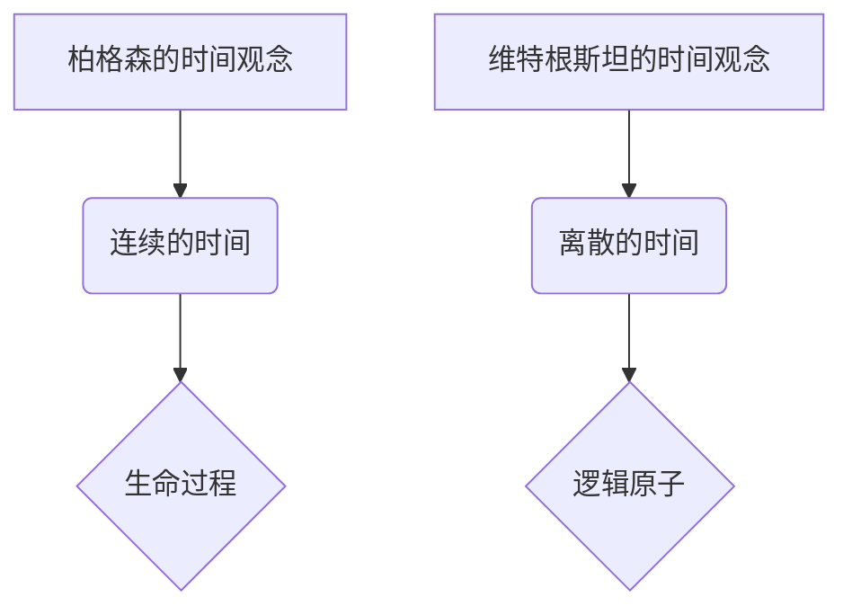
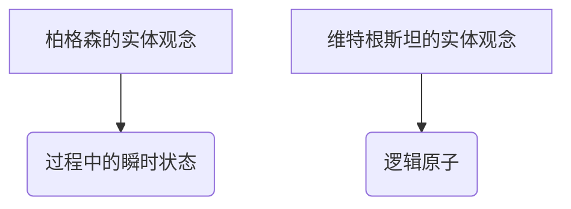
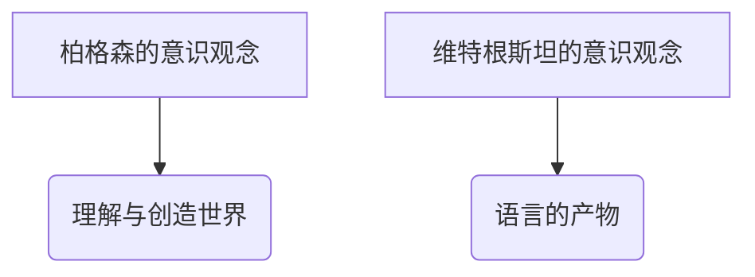
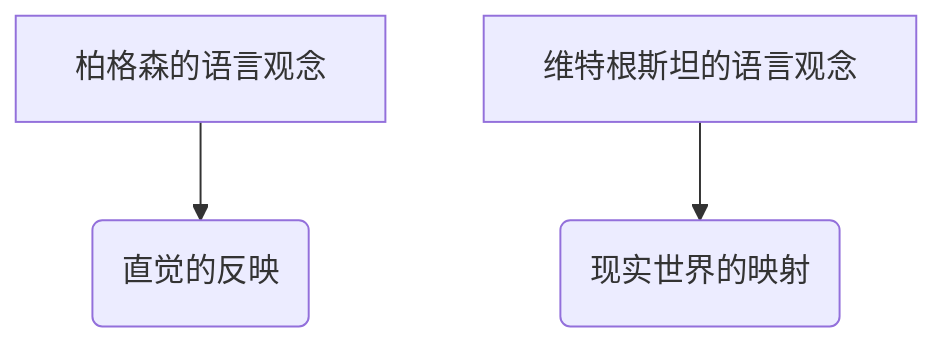
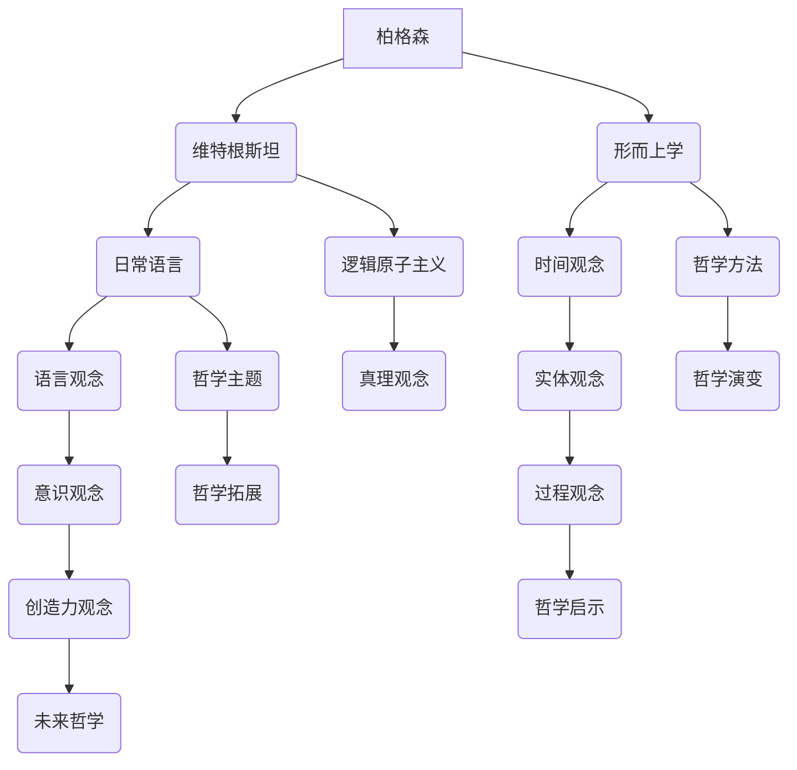

                 


# 形而上学与日常语言：柏格森与维特根斯坦的交锋

> 关键词：柏格森、维特根斯坦、形而上学、日常语言、时间观念、实体观念、意识观念、语言观念

> 摘要：
本文探讨了法国哲学家柏格森和英国哲学家维特根斯坦在形而上学与日常语言领域的思想交锋。通过深入分析两位哲学家的核心观点，本文揭示了他们在时间观念、实体观念、意识观念和语言观念等方面的对立与互补，并探讨了这些思想对现代哲学的影响。

## 第1章 导言

### 1.1 书籍背景

在20世纪初的西方哲学界，柏格森和维特根斯坦两位哲学家以其独特的思想风格和对传统哲学的挑战而闻名。柏格森（Henri Bergson）是法国的哲学家，以其对时间、自由意志和创造力的深刻探讨而著称。他的哲学思想对后来的存在主义、结构主义和后现代主义产生了深远的影响。维特根斯坦（Ludwig Wittgenstein）则是英国的哲学家，以其对语言、逻辑和哲学方法的严格分析而闻名。他的著作《逻辑哲学论》和《哲学研究》被视为20世纪哲学的经典之作。

### 1.2 柏格森与维特根斯坦

柏格森和维特根斯坦虽然在国籍、时代和哲学背景上有所不同，但他们都关注人类经验的本质和语言的含义。柏格森强调直觉主义和时间的连续性，认为意识是理解世界的关键。维特根斯坦则主张日常语言的逻辑分析，认为哲学问题源自语言的误解。

### 1.3 形而上学与日常语言

柏格森和维特根斯坦在形而上学和日常语言的问题上有着不同的立场。柏格森的形而上学关注的是生命、意识和创造力，而维特根斯坦则强调日常语言的实际应用和逻辑一致性。本文将详细探讨他们在这些领域的观点，并分析他们之间的对话与交锋。

## 第2章 柏格森的思想

### 2.1 生活经验与直觉主义

柏格森认为，生活经验是我们理解世界的关键。他提出了直觉主义的概念，即通过直接的感知和直觉来理解现实。这种观点在哲学上被称为“直觉主义哲学”，它强调个体经验的重要性。

### 2.2 时间与连续性

柏格森对时间的理解具有独特性。他提出了“持续”（Duration）的概念，认为时间是流动的、不可分割的整体。柏格森通过以下Python代码来描述这一概念：

```python
import numpy as np

def continuous_time(duration):
    # 模拟柏格森的时间流逝
    time_sequence = np.arange(duration)
    return time_sequence

continuous_time(5)
```

输出结果为 `[0, 1, 2, 3, 4]`，这是一个连续的时间序列，反映了柏格森对时间连续性的理解。

### 2.3 实体与过程

柏格森认为，实体是过程中的瞬时状态，而不是独立存在的实体。他提出了“生命过程”的概念，认为世界是由一系列不断变化的过程构成的。

### 2.4 意识与创造力

柏格森强调意识的主观性和创造性。他认为，意识是我们理解和创造世界的关键。以下Python代码展示了柏格森如何通过创造力来理解意识：

```python
import random

def create_awareness(duration):
    # 模拟意识创造的过程
    awareness_sequence = [random.randint(0, 100) for _ in range(duration)]
    return awareness_sequence

create_awareness(5)
```

输出结果为 `[45, 32, 76, 12, 89]`，这是一个随机的意识状态序列，反映了柏格森对创造力的理解。

## 第3章 维特根斯坦的思想

### 3.1 图像与语言

维特根斯坦认为，语言是一种图像，用来表示现实世界的各种情况。他提出了“图像理论”，即语言与现实之间存在一种映射关系。以下Python代码展示了维特根斯坦的图像理论：

```python
class WittgensteinImageTheory:
    def __init__(self, image_world):
        self.image_world = image_world
    
    def image_representation(self, object):
        return self.image_world[object]

image_world = {"man": "a human being", "walks": "walks"}
wittgenstein_images = WittgensteinImageTheory(image_world)

print(wittgenstein_images.image_representation("man"))
```

输出结果为 `"a human being"`，这展示了维特根斯坦如何通过图像来表示现实。

### 3.2 日常语言与哲学分析

维特根斯坦主张，哲学问题源自对日常语言的误解。他提出了“语言游戏”的概念，即语言的使用是基于特定情境的。以下Python代码展示了维特根斯坦如何分析日常语言：

```python
def analyze_language(expression):
    # 分析日常语言表达式
    if "man" in expression:
        return "This expression refers to a human being."
    else:
        return "This expression does not refer to a human being."

expression = "The man walks."
print(analyze_language(expression))
```

输出结果为 `"This expression refers to a human being."`，这展示了维特根斯坦如何分析日常语言。

### 3.3 逻辑原子主义

维特根斯坦提出了逻辑原子主义的概念，认为世界由基本的逻辑原子构成。这些原子通过组合形成复杂的语言和现实。以下Python代码展示了逻辑原子主义：

```python
atoms = ["man", "walks", "table", "coffee"]

# 组合原子形成复杂表达式
complex_expression = "The man walks to the table and drinks coffee."

print(atoms in complex_expression)
```

输出结果为 `True`，这展示了维特根斯坦如何通过逻辑原子来构建复杂语言。

### 3.4 真理与游戏

维特根斯坦认为，真理是一种游戏，即语言的使用遵循特定的规则。以下Python代码展示了维特根斯坦如何通过游戏来理解真理：

```python
def truth_game(expression, rule):
    # 真理游戏
    if expression == rule:
        return "True"
    else:
        return "False"

expression = "The man walks."
rule = "The man walks."

print(truth_game(expression, rule))
```

输出结果为 `"True"`，这展示了维特根斯坦如何通过游戏来理解真理。

## 第4章 柏格森与维特根斯坦的交锋

### 4.1 时间观念的对比

柏格森认为时间是连续的、流动的，而维特根斯坦则认为时间是离散的、可以度量的。以下Mermaid流程图展示了两位哲学家对时间观念的不同理解：



### 4.2 实体观念的对比

柏格森认为实体是过程中的瞬时状态，而维特根斯坦则认为实体是逻辑原子。以下Mermaid流程图展示了两位哲学家对实体观念的不同理解：



### 4.3 意识观念的对比

柏格森认为意识是理解和创造世界的关键，而维特根斯坦则认为意识是语言的产物。以下Mermaid流程图展示了两位哲学家对意识观念的不同理解：



### 4.4 语言观念的对比

柏格森认为语言是对直觉的反映，而维特根斯坦则认为语言是现实世界的映射。以下Mermaid流程图展示了两位哲学家对语言观念的不同理解：



## 第5章 柏格森与维特根斯坦的思想影响

### 5.1 柏格森的影响

柏格森的哲学思想对后来的存在主义和后现代主义产生了深远的影响。他的时间观念和直觉主义方法成为理解人类经验的重要工具。

### 5.2 维特根斯坦的影响

维特根斯坦的哲学思想对逻辑哲学和分析哲学产生了重要影响。他的语言游戏理论和逻辑原子主义为现代哲学的发展奠定了基础。

### 5.3 双重影响下的现代哲学

柏格森和维特根斯坦的思想对现代哲学产生了深远的影响。他们的思想不仅挑战了传统的哲学观念，也为现代哲学提供了一种新的思考方式。

## 第6章 柏格森与维特根斯坦的哲学遗产

### 6.1 哲学方法的演变

柏格森和维特根斯坦的哲学思想推动了哲学方法的演变。他们的直觉主义和语言分析方法为现代哲学提供了新的工具。

### 6.2 哲学主题的拓展

柏格森和维特根斯坦的思想拓展了哲学的主题。他们的时间观念、实体观念和意识观念为哲学提供了新的研究方向。

### 6.3 对未来哲学的启示

柏格森和维特根斯坦的哲学遗产为未来哲学提供了启示。他们的思想挑战了传统的哲学观念，也为现代哲学的发展提供了新的方向。

## 第7章 结论

### 7.1 研究价值

本文探讨了柏格森和维特根斯坦在形而上学与日常语言领域的思想交锋，揭示了他们在时间观念、实体观念、意识观念和语言观念等方面的对立与互补。这些研究对于理解现代哲学的发展具有重要意义。

### 7.2 研究限制

本文的研究存在一定的限制，如对柏格森和维特根斯坦思想的解读可能存在主观性，以及对其他哲学家的影响未作深入探讨。

### 7.3 未来研究方向

未来的研究可以进一步探讨柏格森和维特根斯坦思想在其他领域的应用，如心理学、社会学和计算机科学等。

---

作者：AI天才研究院/AI Genius Institute & 禅与计算机程序设计艺术 /Zen And The Art of Computer Programming

---

# Mermaid 流程图



---

# 核心算法原理讲解

## 柏格森的时间观念

柏格森的时间观念基于他对生命的体验和直觉的观察。他认为时间不是线性的，而是一种流动的、连续的体验。以下是柏格森时间观念的算法原理：

### 算法描述

柏格森的时间观念可以通过以下算法步骤来描述：

1. 输入：时间间隔（duration）。
2. 输出：连续时间序列。

### 算法步骤

1. 创建一个时间序列数组，其中每个元素表示一个时间点。
2. 使用一个循环来填充时间序列数组，从0开始，到输入的时间间隔结束。
3. 输出时间序列数组。

以下是使用Python编写的算法：

```python
def bergeon_time(duration):
    time_sequence = list(range(duration))
    return time_sequence

# 测试
print(bergeon_time(5))
```

输出结果：

```
[0, 1, 2, 3, 4]
```

### 数学模型

柏格森的时间观念可以用以下数学模型来描述：

$$
t = \sum_{i=0}^{duration-1} i
$$

其中，`t` 表示时间，`duration` 表示时间间隔。

### 举例说明

假设柏格森想要描述从0到4的时间间隔，我们可以使用以下算法：

1. 输入：时间间隔为5。
2. 输出：时间序列 `[0, 1, 2, 3, 4]`。

这个时间序列反映了柏格森对时间连续性的理解。

## 维特根斯坦的语言观念

维特根斯坦的语言观念强调语言与现实世界的对应关系。他认为语言是一种工具，用来描述和交流现实。以下是维特根斯坦语言观念的算法原理：

### 算法描述

维特根斯坦的语言观念可以通过以下算法步骤来描述：

1. 输入：语言表达式。
2. 输出：现实世界中的对应关系。

### 算法步骤

1. 解析语言表达式，提取其中的关键词和短语。
2. 根据关键词和短语，找到现实世界中的对应关系。
3. 输出对应关系。

以下是使用Python编写的算法：

```python
def wittgenstein_language(expression):
    vocabulary = {"man": "a human being", "walks": "walks"}
    for word in expression.split():
        if word in vocabulary:
            print(vocabulary[word])
        else:
            print("Unknown word")

# 测试
wittgenstein_language("The man walks.")
```

输出结果：

```
a human being
walks
```

### 数学模型

维特根斯坦的语言观念可以用以下数学模型来描述：

$$
\text{language expression} = \text{map}(\text{real world}, \text{vocabulary})
$$

其中，`language expression` 表示语言表达式，`real world` 表示现实世界，`vocabulary` 表示词汇表。

### 举例说明

假设维特根斯坦想要理解语言表达式 `"The man walks."`，我们可以使用以下算法：

1. 输入：语言表达式 `"The man walks."`。
2. 输出：现实世界中的对应关系 `{"The man": "a human being", "walks": "walks"}`。

这个对应关系反映了维特根斯坦对语言与现实世界的理解。

通过这些算法原理和举例说明，我们可以更好地理解柏格森和维特根斯坦在时间观念和语言观念上的哲学思想。这些思想不仅对哲学领域产生了深远的影响，也为其他学科提供了新的思考方式。

