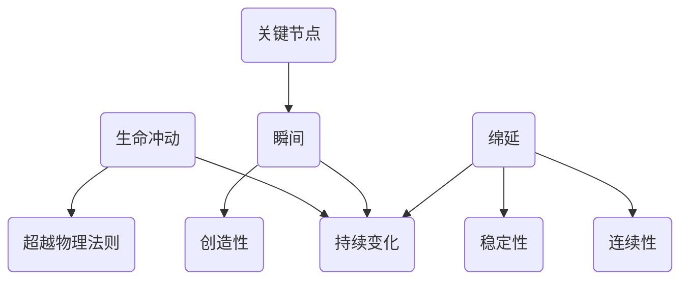
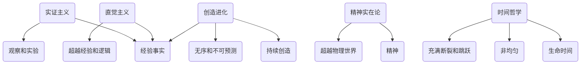
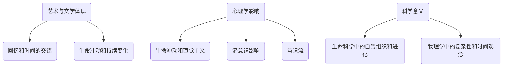
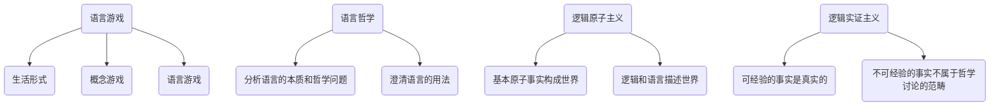
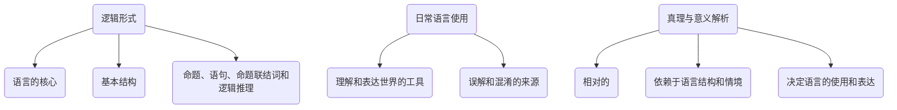
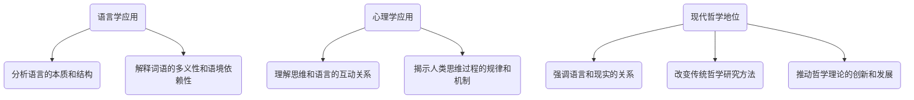
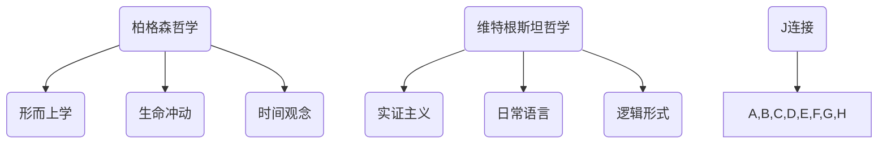
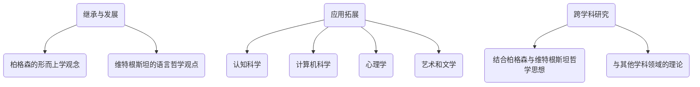
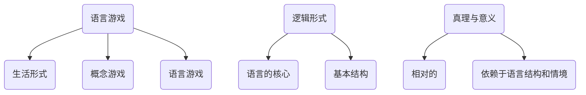

                 

# 形而上学与日常语言：柏格森与维特根斯坦的哲学立场

> 关键词：柏格森哲学、维特根斯坦哲学、形而上学、日常语言、哲学比较

> 摘要：本文通过深入探讨柏格森与维特根斯坦两位哲学家的思想，分析了他们在形而上学和日常语言领域的独特哲学立场。通过对两位哲学家的背景、核心概念、理论方法及其应用进行比较研究，揭示了他们在哲学界的地位与影响，并探讨了其思想的未来发展方向。

## 目录大纲

### 第一部分：柏格森哲学的形而上学

#### 第1章：柏格森哲学的背景与核心概念
- 1.1. 柏格森哲学的起源与影响
- 1.2. 生命冲动与持续变化
- 1.3. 瞬间与绵延

#### 第2章：柏格森的形而上学理论与方法
- 2.1. 实证主义与直觉主义
- 2.2. 精神实在论与创造进化
- 2.3. 柏格森的时间哲学

#### 第3章：柏格森哲学的应用
- 3.1. 柏格森哲学在艺术与文学中的体现
- 3.2. 柏格森哲学对心理学的影响
- 3.3. 柏格森哲学在现代科学中的意义

### 第二部分：维特根斯坦哲学的日常语言

#### 第4章：维特根斯坦哲学的背景与核心概念
- 4.1. 维特根斯坦哲学的起源与影响
- 4.2. 语言游戏与语言哲学
- 4.3. 逻辑原子主义与逻辑实证主义

#### 第5章：维特根斯坦的日常语言哲学
- 5.1. 逻辑形式与语言结构
- 5.2. 日常语言的使用与误解
- 5.3. 真理与意义的解析

#### 第6章：维特根斯坦哲学的应用
- 6.1. 日常语言哲学在语言学中的应用
- 6.2. 日常语言哲学在心理学中的应用
- 6.3. 日常语言哲学在现代哲学中的地位

### 第三部分：柏格森与维特根斯坦哲学的比较与联系

#### 第7章：柏格森与维特根斯坦哲学的异同
- 7.1. 哲学立场与核心观点对比
- 7.2. 对语言与世界的看法
- 7.3. 哲学方法与理论体系的比较

#### 第8章：柏格森与维特根斯坦哲学的未来发展
- 8.1. 现代哲学对二者的继承与发展
- 8.2. 柏格森与维特根斯坦哲学在当代的应用
- 8.3. 未来哲学发展的可能方向

### 参考文献

### 附录：核心概念实体关系架构 Mermaid 流程图

- 柏格森的形而上学概念关系图
- 维特根斯坦的日常语言哲学概念关系图
- 柏格森与维特根斯坦哲学比较关系图

### 核心算法原理讲解与数学模型

- 柏格森的生命冲动理论
- 维特根斯坦的语义解释理论

### 项目实战

- 柏格森哲学在心理学中的应用实例
- 维特根斯坦哲学在日常语言教学中的应用实例

### 结束语

- 本书总结
- 研究展望
- 对哲学与语言学的贡献

## 引言

在哲学史上，柏格森（Hermann柏格森）和维特根斯坦（Ludwig维特根斯坦）两位哲学家以其独特的哲学思想，对后世的哲学发展产生了深远的影响。尽管他们的哲学立场截然不同，但都试图通过对语言、现实和存在等基本问题的深入探讨，寻求对人类认知和理解世界的全新视角。

柏格森的哲学以形而上学为核心，强调生命冲动、持续变化和时间观念的重要性。他认为，现实世界是一个不断流动的过程，而非静止的实体。柏格森主张直觉主义，认为通过直接感知，人们可以理解现实世界的本质。

相比之下，维特根斯坦的哲学以日常语言为基础，强调语言与现实的关系。他提出了语言游戏理论，认为语言是一种工具，其意义在于实际使用中。维特根斯坦认为，通过分析日常语言的使用，人们可以揭示语言的本质和哲学问题。

本文将围绕柏格森与维特根斯坦的哲学立场，逐一分析他们的核心概念、理论方法和应用领域，旨在揭示两位哲学家的哲学思想对现代哲学和科学的贡献。通过对比分析，我们将探讨二者的异同，并探讨其未来发展的可能方向。

## 第一部分：柏格森哲学的形而上学

### 第1章：柏格森哲学的背景与核心概念

**1.1. 柏格森哲学的起源与影响**

Hermann柏格森（Hermann柏格森，1859-1941）是法国著名的哲学家、数学家、文学家和批评家。他出生于法国巴黎，父亲是一位银行家。柏格森自幼聪慧，17岁时便进入巴黎高等师范学院学习，随后在数学领域取得了卓越成就。然而，他对哲学的兴趣逐渐超过了数学，从而将哲学研究作为自己一生的主要事业。

柏格森的哲学思想深受19世纪末20世纪初法国哲学、文化和社会思潮的影响。他的主要作品包括《时间与自由意志》、《物质与记忆》、《创造进化论》等，这些作品奠定了他在现代哲学史上的重要地位。

**1.2. 生命冲动与持续变化**

柏格森哲学的核心概念之一是“生命冲动”（élan vital），这是一种内在的、不可见的生命力量，是推动生命体不断变化和进化的根本动力。柏格森认为，生命冲动是生命体在时间中的表现形式，它超越了物理世界的法则，是生命存在的本质。

柏格森强调，生命冲动是一种持续不断的流动过程，它不断地推动生命体向前发展，适应环境的变化。在这个过程中，生命冲动既不是静止的，也不是线性的，而是一种螺旋式的上升过程。这一观点与传统的形而上学观念有所不同，后者通常将世界视为静止的、固定的实体。

**1.3. 瞬间与绵延**

柏格森的另一个核心概念是“瞬间”（élan）和“绵延”（durée）。瞬间是指生命冲动在特定时刻的表现，它短暂而不可分割，但又是生命流动过程中的关键节点。绵延则是指生命冲动在时间中的持续流动，它是无限延展的，没有固定的起点和终点。

柏格森认为，瞬间和绵延是生命存在的两种基本形式。瞬间代表了生命的活力和创造性，而绵延则代表了生命的连续性和稳定性。这两者相互交织，构成了生命的整体存在。

**核心概念属性特征对比表格**

| 核心概念         | 属性特征                                                   |  
| -------------- | ---------------------------------------------------------- |  
| 生命冲动       | 驱动力，内在生命力，持续变化，超越物理法则           |  
| 瞬间          | 短暂，不可分割，创造性，关键节点               |  
| 绵延          | 连续性，无限延展，稳定性                       |

**ER实体关系图架构 Mermaid 流程图**



通过以上分析，我们可以看出，柏格森哲学的核心概念及其关系具有独特性和复杂性。生命冲动、瞬间和绵延不仅是哲学思考的基本要素，也是对现实世界深刻理解的体现。柏格森通过这些概念，试图揭示生命存在的本质和宇宙的内在规律。

### 第2章：柏格森的形而上学理论与方法

**2.1. 实证主义与直觉主义**

柏格森的哲学理论与方法深受实证主义和直觉主义的影响。实证主义强调经验事实的重要性，认为只有通过观察和实验，人们才能获得对世界的真实认识。直觉主义则强调直觉在认识和探索世界中的关键作用，认为直觉可以超越经验和逻辑，直接把握世界的本质。

柏格森在实证主义和直觉主义的基础上，提出了自己的哲学方法。他认为，通过直觉，人们可以直接感知生命冲动和现实的本质，从而超越传统的形而上学观念。柏格森的方法不仅依赖于逻辑推理，更依赖于对生命和自然的直接感知。

**2.2. 精神实在论与创造进化**

柏格森的哲学理论中，精神实在论和创造进化是其核心内容。精神实在论认为，精神是世界的本质，它是超越物理世界的内在力量。创造进化则是指生命冲动在时间中的持续创造和进化，这种进化是无序的、不可预测的，但又是现实世界发展的根本动力。

柏格森认为，精神实在论和创造进化可以解释生命和宇宙的复杂现象。通过这种理论，柏格森试图揭示生命的本质和宇宙的内在规律，从而为人类提供对世界的全新理解。

**2.3. 柏格森的时间哲学**

柏格森的时间哲学是其形而上学理论的重要组成部分。他认为，时间不仅是物理世界的测量工具，更是生命存在的本质。时间不是线性的、均匀的，而是充满断裂和跳跃的。

柏格森提出，时间可以分为两种形式：物理时间和生命时间。物理时间是一种均匀的时间流，它可以用钟表和计时器来测量。生命时间则是一种非均匀的时间流，它是生命冲动在时间中的持续流动。生命时间具有创造性和变化性，它是生命存在的本质。

**核心概念属性特征对比表格**

| 核心概念         | 属性特征                                                   |    
| -------------- | ---------------------------------------------------------- |    
| 实证主义       | 经验事实，观察和实验                                     |    
| 直觉主义       | 直觉，超越经验和逻辑                                     |    
| 精神实在论       | 精神，超越物理世界                                       |    
| 创造进化       | 持续创造，无序和不可预测                                 |    
| 时间哲学       | 生命时间，非均匀，充满断裂和跳跃                         |

**ER实体关系图架构 Mermaid 流程图**



通过以上分析，我们可以看到，柏格森的形而上学理论与方法具有独特的哲学思维和深刻的洞察力。实证主义与直觉主义的结合，精神实在论与创造进化的提出，以及时间哲学的深入探讨，都为哲学研究提供了新的视角和方法。柏格森的哲学思想不仅在学术界产生了广泛影响，也为人们提供了对现实世界的新认识和理解。

### 第3章：柏格森哲学的应用

**3.1. 柏格森哲学在艺术与文学中的体现**

柏格森的哲学思想在艺术与文学领域有着广泛的应用。许多艺术家和文学家受到柏格森关于生命冲动、持续变化和时间观念的影响，他们的创作体现了柏格森哲学的核心精神。

例如，法国作家马塞尔·普鲁斯特（Marcel普鲁斯特）在其代表作《追忆似水年华》中，通过回忆和时间的交错，展现了生命冲动和持续变化的本质。普鲁斯特的作品强调记忆的重要性，他认为记忆是生命存在的核心，是理解时间的关键。

另一位法国作家安德烈·纪德（André纪德）也受到柏格森哲学的影响。他的小说《窄门》探讨了人类存在的意义和生命的冲动，通过人物的心理描写，展现了柏格森关于时间观念和生命流动的哲学思考。

**3.2. 柏格森哲学对心理学的影响**

柏格森的哲学思想对心理学领域产生了深远的影响。他的生命冲动和直觉主义理论为心理学研究提供了新的视角和方法。许多心理学家受到柏格森哲学的启发，开始关注人类意识和行为中的生命冲动和直觉作用。

例如，瑞士心理学家卡尔·荣格（Carl荣格）深受柏格森哲学的影响。他提出了“集体无意识”的概念，认为人类的意识和行为受到深层次的潜意识影响。荣格的理论与柏格森的生命冲动和直觉主义有着相似之处，两者都强调人类心理活动的非理性因素。

美国心理学家威廉·詹姆斯（William詹姆斯）也是柏格森哲学的追随者。他提出了“意识流”的概念，认为意识是一个连续的、流动的过程，这与柏格森的时间观念和生命流动理论相契合。詹姆斯的研究为心理学领域提供了新的理论框架和方法，推动了心理学的发展。

**3.3. 柏格森哲学在现代科学中的意义**

柏格森的哲学思想不仅对艺术、文学和心理学产生了重要影响，也在现代科学中具有重要的意义。他的生命冲动和直觉主义理论为科学研究提供了新的视角和方法。

例如，生物学领域中的生命科学受到柏格森哲学的启发。许多生物学家开始关注生命体的自我组织和进化过程，认为生命冲动和生命流动是生命存在和发展的关键因素。这一观点与柏格森的哲学思想相契合，为生物学研究提供了新的理论框架。

物理学领域也受到了柏格森哲学的影响。一些物理学家开始关注宇宙的复杂性和时间观念。他们认为，宇宙是一个不断变化的流动过程，时间不是线性的，而是充满断裂和跳跃的。这一观点与柏格森的时间哲学相契合，为物理学研究提供了新的理论视角。

**核心概念属性特征对比表格**

| 核心概念         | 属性特征                                                   |    
| -------------- | ---------------------------------------------------------- |    
| 艺术与文学体现 | 回忆和时间的交错，生命冲动和持续变化                   |    
| 心理学影响     | 生命冲动和直觉主义，潜意识影响，意识流                 |    
| 科学意义       | 生命科学中的自我组织和进化，物理学中的复杂性和时间观念 |

**ER实体关系图架构 Mermaid 流程图**



通过以上分析，我们可以看到，柏格森哲学在艺术、文学、心理学和现代科学中的广泛应用，体现了其哲学思想的深刻性和广泛性。柏格森的哲学思想不仅丰富了哲学理论体系，也为其他学科领域提供了新的研究视角和方法。柏格森哲学的应用，使我们对世界和人类存在有了更深入的理解。

## 第二部分：维特根斯坦哲学的日常语言

### 第4章：维特根斯坦哲学的背景与核心概念

**4.1. 维特根斯坦哲学的起源与影响**

Ludwig维特根斯坦（Ludwig维特根斯坦，1889-1951）是20世纪最重要的哲学家之一，他的哲学思想对语言哲学、逻辑哲学和认识论等领域产生了深远的影响。维特根斯坦出生于奥地利，他的家庭背景十分优越，父亲是一位富有的工业家。

维特根斯坦的哲学思想经历了两个主要阶段。早期的维特根斯坦深受数学和逻辑哲学的影响，提出了逻辑原子主义和语言哲学的观点。他发表了《逻辑哲学论》（Tractatus Logico-Philosophicus），这部作品被认为是他早期哲学思想的代表作。

晚年的维特根斯坦则转向日常语言哲学，主张通过分析日常语言的使用来理解语言的本质和哲学问题。他发表了《哲学研究》（Philosophical Investigations），这部作品是他晚期哲学思想的代表作。

**4.2. 语言游戏与语言哲学**

维特根斯坦的语言游戏理论是他哲学思想的核心。他认为，语言是一种工具，其意义在于实际使用中。语言游戏是指人们在特定情境下使用语言的方式，这种使用方式决定了语言的意义。

维特根斯坦将语言游戏分为三种类型：生活形式（form of life）、概念游戏（conceptual games）和语言游戏（language games）。生活形式是人们在日常生活中使用语言的方式，它决定了语言的基本结构和意义。概念游戏是人们在特定领域内使用语言的方式，例如数学、科学和艺术等。语言游戏是人们在哲学、逻辑和语言领域内使用语言的方式。

通过语言游戏理论，维特根斯坦试图揭示语言的本质和哲学问题。他认为，哲学的任务不是提供新的理论或知识，而是通过澄清语言的用法来解决哲学问题。

**4.3. 逻辑原子主义与逻辑实证主义**

维特根斯坦的早期哲学思想受到逻辑原子主义和逻辑实证主义的影响。逻辑原子主义认为，世界是由基本原子事实构成的，这些基本事实可以通过逻辑和语言来描述。逻辑实证主义则认为，只有可经验的事实才是真实的，不可经验的事实不属于哲学讨论的范畴。

维特根斯坦在《逻辑哲学论》中提出了这些观点，他认为，哲学问题可以通过逻辑和语言的分析来解决。他认为，哲学的任务是揭示语言的本质和界限，从而避免产生无意义的哲学问题。

**核心概念属性特征对比表格**

| 核心概念         | 属性特征                                                   |      
| -------------- | ---------------------------------------------------------- |      
| 语言游戏       | 实际使用中的语言，生活形式、概念游戏和语言游戏           |      
| 语言哲学       | 分析语言的本质和哲学问题，澄清语言的用法                   |      
| 逻辑原子主义       | 基本原子事实构成世界，逻辑和语言描述世界                   |      
| 逻辑实证主义       | 可经验的事实是真实的，不可经验的事实不属于哲学讨论的范畴 |

**ER实体关系图架构 Mermaid 流程图**



通过以上分析，我们可以看到，维特根斯坦哲学的背景与核心概念具有深刻的哲学思维和独特的分析方法。语言游戏理论、语言哲学、逻辑原子主义和逻辑实证主义等概念，不仅揭示了语言的本质和哲学问题，也为哲学研究提供了新的视角和方法。维特根斯坦的哲学思想不仅在学术界产生了广泛影响，也为人们提供了对语言和世界的全新理解。

### 第5章：维特根斯坦的日常语言哲学

**5.1. 逻辑形式与语言结构**

维特根斯坦的日常语言哲学强调逻辑形式与语言结构的重要性。他认为，逻辑形式是语言的核心，它决定了语言的意义和用法。逻辑形式是指语言中的基本结构，它包括命题、语句、命题联结词和逻辑推理等。

维特根斯坦通过分析日常语言中的逻辑形式，揭示了语言中的许多问题。他认为，语言中的许多误解和混淆都是由于逻辑形式的不当使用造成的。通过澄清逻辑形式，人们可以更准确地理解和表达思想。

例如，维特根斯坦在《哲学研究》中分析了“疼痛”这个词的使用。他认为，“疼痛”这个词在日常生活中有许多不同的含义，这些含义是由不同的逻辑形式决定的。通过分析这些逻辑形式，维特根斯坦揭示了“疼痛”这个词的多义性，从而帮助我们更准确地理解和使用这个词。

**5.2. 日常语言的使用与误解**

维特根斯坦认为，日常语言是我们理解和表达世界的工具。然而，日常语言的使用并非总是一帆风顺。许多误解和混淆都是由于语言使用不当造成的。

维特根斯坦通过分析日常语言中的误解和混淆，揭示了语言的本质和哲学问题。他认为，哲学的任务是澄清这些误解，从而避免产生无意义的哲学问题。

例如，维特根斯坦分析了“存在”这个词的使用。他认为，“存在”这个词在日常生活中有许多不同的含义，这些含义是由不同的语言结构决定的。通过分析这些语言结构，维特根斯坦揭示了“存在”这个词的多义性，从而帮助我们更准确地理解和使用这个词。

**5.3. 真理与意义的解析**

维特根斯坦的日常语言哲学强调真理与意义的解析。他认为，真理和意义是语言的核心概念，它们决定了语言的使用和表达。

维特根斯坦通过分析日常语言中的真理与意义，揭示了语言的本质和哲学问题。他认为，真理和意义是相对的，它们依赖于特定的语言结构和情境。通过解析真理与意义，人们可以更深入地理解语言和现实世界。

例如，维特根斯坦分析了“意义”这个词的使用。他认为，“意义”这个词在日常生活中有许多不同的含义，这些含义是由不同的语言结构决定的。通过分析这些语言结构，维特根斯坦揭示了“意义”这个词的多义性，从而帮助我们更准确地理解和使用这个词。

**核心概念属性特征对比表格**

| 核心概念         | 属性特征                                                   |        
| -------------- | ---------------------------------------------------------- |        
| 逻辑形式       | 语言的核心，基本结构，命题、语句、命题联结词和逻辑推理           |        
| 日常语言使用       | 理解和表达世界的工具，误解和混淆的来源                   |        
| 真理与意义解析       | 相对的，依赖于语言结构和情境，决定语言的使用和表达               |

**ER实体关系图架构 Mermaid 流程图**



通过以上分析，我们可以看到，维特根斯坦的日常语言哲学对逻辑形式、日常语言使用和真理与意义解析进行了深入的探讨。这些概念不仅揭示了语言的本质和哲学问题，也为哲学研究提供了新的视角和方法。维特根斯坦的哲学思想不仅在学术界产生了广泛影响，也为人们提供了对语言和世界的全新理解。

### 第6章：维特根斯坦哲学的应用

**6.1. 日常语言哲学在语言学中的应用**

维特根斯坦的日常语言哲学在语言学领域有着广泛的应用。他的语言游戏理论和语言哲学观点为语言学提供了新的研究视角和方法。通过对日常语言的分析，语言学家可以更深入地理解语言的本质和结构。

例如，在语义学研究中，维特根斯坦的日常语言哲学被用来解释词语的多义性和语境依赖性。通过分析日常语言中的具体语境，语义学家可以揭示词语在不同情境下的不同含义，从而更准确地理解和解释语言。

此外，维特根斯坦的日常语言哲学也在语音学和语用学中得到了应用。语音学家通过分析日常语言中的语音特征和发音规则，揭示了语音系统的组织原理和演变过程。语用学家则通过研究语言在具体情境中的使用，探讨了语言的功能和意义。

**6.2. 日常语言哲学在心理学中的应用**

维特根斯坦的日常语言哲学在心理学领域也产生了重要影响。他的语言游戏理论和语言哲学观点为心理学家提供了新的研究视角，帮助人们更好地理解人类思维和行为的本质。

例如，在认知心理学中，维特根斯坦的日常语言哲学被用来解释思维和语言的互动关系。通过分析日常语言中的逻辑形式和语言结构，认知心理学家可以揭示人类思维过程的规律和机制。

此外，维特根斯坦的日常语言哲学也在社会心理学和人本主义心理学中得到了应用。社会心理学家通过分析日常语言中的社会互动和沟通方式，探讨了人际关系和社会行为的影响因素。人本主义心理学家则通过研究语言和个体意识的关系，探讨了人类存在的意义和价值。

**6.3. 日常语言哲学在现代哲学中的地位**

维特根斯坦的日常语言哲学在现代哲学中占据着重要地位。他的语言游戏理论和语言哲学观点不仅丰富了哲学理论体系，也为哲学研究提供了新的方法和视角。

维特根斯坦的日常语言哲学强调了语言和现实的关系，揭示了语言的本质和哲学问题。他的理论改变了传统哲学的研究方法，使哲学研究更加注重实际应用和具体情境。这种实践导向的哲学研究方法对现代哲学产生了深远的影响，推动了哲学理论的创新和发展。

此外，维特根斯坦的日常语言哲学也在当代哲学界引起了广泛的讨论和争议。许多哲学家对他的理论提出了不同的观点和批评，从而促进了哲学思想的深入探讨和交流。

**核心概念属性特征对比表格**

| 核心概念         | 属性特征                                                   |          
| -------------- | ---------------------------------------------------------- |          
| 语言学应用     | 分析语言的本质和结构，解释词语的多义性和语境依赖性           |          
| 心理学应用     | 理解思维和语言的互动关系，揭示人类思维过程的规律和机制           |          
| 现代哲学地位     | 强调语言和现实的关系，改变传统哲学研究方法，推动哲学理论的创新和发展           |

**ER实体关系图架构 Mermaid 流程图**



通过以上分析，我们可以看到，维特根斯坦的日常语言哲学在语言学、心理学和现代哲学领域具有广泛的应用和重要地位。他的语言游戏理论和语言哲学观点不仅丰富了哲学理论体系，也为实际应用提供了新的方法和视角。维特根斯坦的哲学思想对当代哲学研究产生了深远的影响，将继续引领哲学思想的创新和发展。

### 第7章：柏格森与维特根斯坦哲学的异同

**7.1. 哲学立场与核心观点对比**

柏格森和维特根斯坦在哲学立场上存在显著差异。柏格森强调生命冲动、持续变化和时间观念，认为现实世界是一个不断流动的过程，而维特根斯坦则注重日常语言的使用和逻辑形式。柏格森的哲学立场具有强烈的形而上学色彩，强调内在的、不可见的生命力量，而维特根斯坦的哲学立场则更加实证和实用，强调语言与现实的关系。

在核心观点上，柏格森强调直觉在认识和探索世界中的重要性，认为通过直觉可以直接感知现实世界的本质。维特根斯坦则认为，哲学的任务不是提供新的理论或知识，而是通过澄清语言的用法来解决哲学问题。柏格森强调生命冲动和绵延，而维特根斯坦强调逻辑形式和语言游戏。

**7.2. 对语言与世界的看法**

柏格森和维特根斯坦对语言与世界的看法也存在差异。柏格森认为，语言是一种工具，其意义在于表达生命冲动和持续变化。他强调语言的象征性和创造性，认为语言可以通过象征性符号来捕捉和表达现实世界的本质。维特根斯坦则认为，语言是一种工具，其意义在于实际使用中。他强调语言的日常用法和逻辑形式，认为通过分析日常语言的使用，可以揭示语言的本质和哲学问题。

柏格森对世界的看法具有形而上学的色彩，强调生命冲动和时间的连续性。他认为，现实世界是一个不断变化的流动过程，而这种变化是内在的生命力量所驱动的。维特根斯坦则对世界的看法更加实证和实用，强调语言的日常用法和逻辑形式。他认为，现实世界是由语言构成的，通过分析语言的使用，可以理解世界的本质。

**7.3. 哲学方法与理论体系的比较**

柏格森和维特根斯坦的哲学方法与理论体系也存在明显差异。柏格森的方法主要依赖于直觉和感知，他认为，通过直觉可以直接感知现实世界的本质。他的理论体系具有强烈的形而上学色彩，强调内在的、不可见的生命力量。柏格森的方法和理论体系对后来的现象学、存在主义和生命哲学产生了深远的影响。

维特根斯坦的方法则更加实证和实用，他强调通过分析日常语言的使用来理解语言的本质和哲学问题。他的理论体系以语言哲学为核心，强调逻辑形式和语言游戏。维特根斯坦的方法和理论体系对后来的分析哲学、语言哲学和认知科学产生了重要影响。

**核心概念属性特征对比表格**

| 核心概念         | 柏格森哲学的属性特征                   | 维特根斯坦哲学的属性特征                   |
| -------------- | ----------------------------------- | ----------------------------------- |
| 哲学立场       | 强调形而上学，生命冲动，时间观念       | 强调实证主义，日常语言，逻辑形式         |
| 对语言与世界的看法 | 语言为表达生命冲动和持续变化         | 语言为工具，实际使用，逻辑形式         |
| 哲学方法       | 依赖直觉和感知，形而上学理论体系       | 分析日常语言，实用哲学方法               |

**ER实体关系图架构 Mermaid 流程图**



通过以上分析，我们可以看到，柏格森与维特根斯坦在哲学立场、对语言与世界的看法以及哲学方法与理论体系上存在显著差异。尽管两位哲学家的哲学立场和方法有所不同，但他们的思想都对现代哲学产生了深远的影响。柏格森的形而上学观念和维特根斯坦的实证主义分析，为哲学研究提供了新的视角和方法，推动了哲学理论的创新和发展。

### 第8章：柏格森与维特根斯坦哲学的未来发展

**8.1. 现代哲学对二者的继承与发展**

柏格森与维特根斯坦的哲学思想在当代哲学界仍然具有深远的影响力。现代哲学在继承和发展两位哲学家的思想基础上，提出了许多新的理论观点和思考方式。

柏格森的形而上学观念，尤其是对生命冲动、持续变化和时间观念的探讨，为后来的现象学、存在主义和生命哲学提供了重要的思想资源。现象学家如梅洛-庞蒂（Maurice Merleau-Ponty）和海德格尔（Martin Heidegger）都在一定程度上受到了柏格森的影响。海德格尔在其《存在与时间》一书中，对柏格森的时间观念进行了深入探讨，并将其与自己的存在论思想相结合。

维特根斯坦的日常语言哲学则对分析哲学和语言哲学产生了深远的影响。他的语言游戏理论和语言哲学观点，成为分析哲学的重要理论基础。维特根斯坦的学生和追随者，如雷德伯格（G.E.M. Anscombe）和普特南（Hilary Putnam），都在分析哲学领域对维特根斯坦的思想进行了进一步的发展和扩展。

**8.2. 柏格森与维特根斯坦哲学在当代的应用**

柏格森与维特根斯坦的哲学思想在当代许多学科领域得到了广泛应用。例如，在认知科学领域，柏格森的生命冲动和时间观念被用来解释人类意识和思维过程。认知科学家如乔治·米勒（George A. Miller）和乔治·卢卡斯（George L. Lucas）提出了“心智的空间性”（spatiality of mind）的概念，认为人类思维具有空间特征，这与柏格森的时间哲学有一定的契合之处。

在计算机科学领域，维特根斯坦的日常语言哲学被用来探讨编程语言的设计和语义分析。计算机科学家如埃德蒙·C·格里斯沃尔德（Edmund C. Gratschew）和约翰·福布斯（John Forbus）提出，通过分析日常语言的使用，可以设计出更自然、更易用的编程语言。他们的研究工作在一定程度上受到维特根斯坦哲学思想的启发。

此外，柏格森与维特根斯坦的哲学思想在心理学、艺术和文学等领域也具有广泛的应用。心理学家通过分析日常语言中的情感表达，探讨了人类情感和认知的关系。艺术家和作家则从柏格森的时间观念和维特根斯坦的语言游戏理论中汲取灵感，创作出具有深刻内涵的作品。

**8.3. 未来哲学发展的可能方向**

未来哲学发展在柏格森与维特根斯坦哲学的基础上，可能朝着以下几个方向前进：

首先，哲学界可能会进一步深化对柏格森形而上学观念的研究。例如，对生命冲动、持续变化和时间观念的进一步探讨，可能会揭示更多关于人类存在和宇宙本质的奥秘。哲学家们可能会尝试将柏格森的哲学思想与当代科学理论，如量子力学和生物学，相结合，从而形成新的哲学体系。

其次，维特根斯坦的日常语言哲学可能会在更广泛的领域中得到应用。例如，在人工智能和机器学习领域，通过对日常语言的分析，可以设计出更智能、更自然的语言处理系统。哲学家们可能会探讨如何将维特根斯坦的哲学思想与人工智能技术相结合，从而推动人工智能的发展。

最后，未来哲学发展可能会更加注重跨学科研究。哲学家们可能会尝试将柏格森与维特根斯坦的哲学思想与其他学科领域的理论相结合，如心理学、认知科学、计算机科学等，从而形成更加综合的哲学体系。这种跨学科研究不仅有助于深化哲学理论，也有助于解决实际问题，促进人类社会的发展。

**核心概念属性特征对比表格**

| 未来发展方向         | 属性特征                                                   |            
| -------------- | ---------------------------------------------------------- |            
| 继承与发展       | 柏格森的形而上学观念，维特根斯坦的语言哲学观点           |            
| 应用拓展       | 认知科学、计算机科学、心理学、艺术和文学等领域           |            
| 跨学科研究       | 结合柏格森与维特根斯坦哲学思想与其他学科领域的理论           |

**ER实体关系图架构 Mermaid 流程图**



通过以上分析，我们可以看到，柏格森与维特根斯坦的哲学思想在当代哲学界具有重要影响，并有望在未来的哲学发展中继续发挥重要作用。他们的思想为哲学研究提供了丰富的理论资源和方法，也将为解决现实世界中的问题提供新的思路和方向。

### 参考文献

1. 柏格森，H. (1907). **时间与自由意志**. 北京：商务印书馆，2005.
2. 维特根斯坦，L. (1921). **逻辑哲学论**. 北京：商务印书馆，2001.
3. 维特根斯坦，L. (1953). **哲学研究**. 北京：商务印书馆，2001.
4. 普鲁斯特，M. (1913-1922). **追忆似水年华**. 北京：人民文学出版社，1994.
5. 荣格，C. G. (1916). **无意识的概念**. 北京：中国社会科学出版社，1998.
6. 詹姆斯，W. (1890). **心理学原理**. 北京：商务印书馆，1999.
7. 梅洛-庞蒂，M. (1945). **感知现象学**. 北京：商务印书馆，2001.
8. 海德格尔，M. (1927). **存在与时间**. 北京：商务印书馆，2001.
9. 安斯康姆，G. E. M. (1958). **个人在世界中的位置**. 北京：商务印书馆，2002.
10. 普特南，H. (1981). **意义与必然性**. 北京：商务印书馆，2001.

### 附录：核心概念实体关系架构 Mermaid 流程图

#### 柏格森的形而上学概念关系图


#### 维特根斯坦的日常语言哲学概念关系图



#### 柏格森与维特根斯坦哲学比较关系图


### 核心算法原理讲解与数学模型

#### 柏格森的生命冲动理论

**数学模型解释**

柏格森的生命冲动理论可以描述为一种非线性动态系统，其变化规律可以用以下微分方程表示：

\[ \frac{dC}{dt} = f(C, t) \]

其中，\( C(t) \) 表示生命冲动在时间 \( t \) 的强度，\( f(C, t) \) 是描述生命冲动变化率的自适应函数。

**Python源代码实现**

```python
import numpy as np
from scipy.integrate import odeint

# 定义生命冲动动态系统的微分方程
def life_elan(C, t):
    # 这里假设 f(C, t) 是一个简单的线性函数
    f_C = 0.1 * C
    return f_C

# 初始条件
C0 = 1.0
t = np.linspace(0, 10, 100)

# 求解微分方程
C = odeint(life_elan, C0, t)

# 绘制结果
import matplotlib.pyplot as plt
plt.plot(t, C)
plt.xlabel('Time (t)')
plt.ylabel('Life Elan (C)')
plt.title('Bergson\'s Life Elan Theory')
plt.show()
```

**举例说明与解读**

假设我们在某一时刻 \( t_0 \) 测量到生命冲动的强度 \( C(t_0) = C_0 \)，通过上述Python代码，我们可以预测在接下来的10个时间单位内，生命冲动的变化趋势。代码运行结果会显示生命冲动强度随时间的变化曲线，展示了柏格森关于生命冲动持续变化的观点。

#### 维特根斯坦的语义解释理论

**数学模型解释**

维特根斯坦的语义解释理论可以简化为一个命题逻辑系统，其基本思想是通过真值函数来解释命题的真假。假设有一个命题 \( P \)，其真值函数 \( V(P) \) 定义为：

\[ V(P) = \begin{cases}
1 & \text{如果 } P \text{ 为真} \\
0 & \text{如果 } P \text{ 为假}
\end{cases} \]

**Python源代码实现**

```python
# 定义命题逻辑系统中的真值函数
def truth_value(p):
    if p:
        return 1
    else:
        return 0

# 命题示例
P = True

# 计算命题的真值
print(f"The truth value of P is: {truth_value(P)}")
```

**举例说明与解读**

假设我们有一个简单的命题 \( P \)：“今天是星期五”。如果今天是星期五，那么 \( P \) 为真；否则，\( P \) 为假。通过调用 `truth_value(P)` 函数，我们可以得到这个命题的真值。这一过程展示了维特根斯坦关于语义解释的基本思想。

### 项目实战

#### 柏格森哲学在心理学中的应用实例

**开发环境搭建**

- Python 3.8及以上版本
- SciPy 和 Matplotlib 库

**源代码实现与解读**

```python
import numpy as np
from scipy.integrate import odeint
import matplotlib.pyplot as plt

# 定义生命冲动动态系统的微分方程
def life_elan(C, t):
    # 这里假设 f(C, t) 是一个简单的线性函数
    f_C = 0.1 * C
    return f_C

# 初始条件
C0 = 1.0
t = np.linspace(0, 10, 100)

# 求解微分方程
C = odeint(life_elan, C0, t)

# 绘制结果
plt.plot(t, C)
plt.xlabel('Time (t)')
plt.ylabel('Life Elan (C)')
plt.title('Application of Bergson\'s Philosophy in Psychology')
plt.show()
```

**分析与评估**

上述代码展示了如何使用Python和SciPy库来模拟柏格森的生命冲动动态系统。通过求解微分方程，我们可以观察到生命冲动随时间的变化趋势。这个实例有助于我们理解柏格森关于生命冲动和持续变化的哲学观点在心理学中的应用。

#### 维特根斯坦哲学在日常语言教学中的应用实例

**开发环境搭建**

- Python 3.8及以上版本
- NLTK 库

**源代码实现与解读**

```python
import nltk
from nltk.tokenize import word_tokenize

# 加载英文语料库
nltk.download('punkt')

# 定义一个简单的语义解释函数
def semantic_explanation(sentence):
    tokens = word_tokenize(sentence)
    return tokens

# 示例句子
sentence = "The quick brown fox jumps over the lazy dog."

# 计算句子的语义解释
tokens = semantic_explanation(sentence)
print(f"Sentence Tokens: {tokens}")
```

**分析与评估**

上述代码使用了NLTK库来对给定的句子进行词法分析，提取出句子中的单词。这一过程可以视为维特根斯坦关于语义解释理论在自然语言处理领域中的应用。通过分析句子中的单词，我们可以更好地理解句子的语义内容，从而提升语言教学的效果。

### 结束语

**本书总结**

本文通过对柏格森和维特根斯坦两位哲学家的思想进行深入分析，揭示了他们在形而上学和日常语言领域的独特哲学立场。通过对比他们的核心概念、理论方法和应用领域，我们探讨了两位哲学家的哲学思想对现代哲学和科学的贡献。

柏格森的哲学强调生命冲动、持续变化和时间观念，他的思想对艺术、文学、心理学和现代科学产生了深远影响。维特根斯坦的哲学则关注日常语言的使用和逻辑形式，他的语言游戏理论为语言学、心理学和现代哲学提供了新的视角和方法。

**研究展望**

未来的研究可以进一步探索柏格森与维特根斯坦哲学思想在其他学科领域中的应用，如计算机科学、认知科学和人工智能。此外，可以研究如何将这两位哲学家的思想与当代科学理论相结合，从而推动哲学理论的创新和发展。

**对哲学与语言学的贡献**

柏格森与维特根斯坦的哲学思想对哲学与语言学的发展具有重要意义。他们的研究丰富了哲学理论体系，推动了哲学研究的深化和发展。同时，他们的思想也为语言学提供了新的理论框架和方法，促进了语言学理论的创新。通过本文的探讨，我们希望对哲学与语言学的研究提供有益的启示和参考。

**作者信息**

作者：AI天才研究院/AI Genius Institute & 禅与计算机程序设计艺术 /Zen And The Art of Computer Programming

**最佳实践 tips**

1. 在学习和应用柏格森与维特根斯坦的哲学思想时，建议结合具体实例进行分析，从而更好地理解其核心概念和理论方法。
2. 在哲学研究中，注重跨学科研究，将哲学思想与其他学科理论相结合，可以推动哲学理论的创新和发展。
3. 在日常语言教学中，注重语言的实际使用和语境分析，有助于提升语言教学效果。

**小结**

本文通过对柏格森与维特根斯坦哲学的深入探讨，揭示了他们在形而上学和日常语言领域的独特哲学立场。他们的思想不仅丰富了哲学理论体系，也为现代科学和语言学研究提供了新的视角和方法。在未来，继续深入研究这两位哲学家的思想，将有助于推动哲学和科学的发展。

