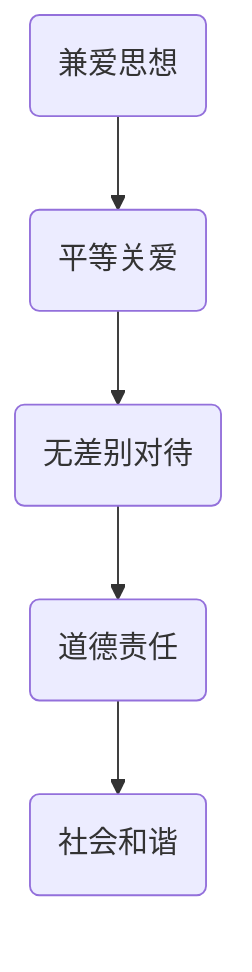

                 

### 《彼得·辛格与墨子：实践伦理学与兼爱思想的比较》

#### 关键词：彼得·辛格、墨子、实践伦理学、兼爱思想、比较研究

#### 摘要：
本文将深入探讨两位不同时代、不同文化背景下实践伦理学家的思想——彼得·辛格与墨子的兼爱思想，通过比较分析他们的理论观点和实践应用，揭示两者在伦理学领域的共通之处与差异。文章旨在为读者提供一份全面的比较研究报告，以期为现代伦理学研究和实践提供新的视角和启示。

---

## 第一部分：引论

### 1.1 书籍背景与目的

本文研究的出发点在于对两位实践伦理学家的思想进行比较研究。彼得·辛格是20世纪末至21世纪初的伦理学家，以其在动物解放、全球贫困和有效利他主义等领域的深刻见解而著称。墨子则是中国古代的著名哲学家，他提出的兼爱思想对中国乃至东亚的伦理发展产生了深远的影响。

本文的目的在于通过对彼得·辛格和墨子思想的比较，揭示实践伦理学的多样性和普适性。本文将不仅分析两位思想家的理论观点，还将探讨他们在不同文化和社会背景下的实践应用，以期为现代伦理学研究和实践提供新的视角。

### 1.2 彼得·辛格与墨子简介

彼得·辛格（Peter Singer），出生于澳大利亚，是全球伦理学领域的领军人物之一。他的著作《动物解放》和《实践伦理学》引发了全球关于动物权益和道德责任的广泛讨论。辛格主张以有效利他主义为指导，呼吁人们关注全球贫困问题，并采取实际行动来改善他人的生活。

墨子（墨翟），生活于公元前5世纪的中国，是中国古代哲学家中的一位杰出代表。墨子提出了兼爱思想，主张人们应该平等地关爱所有人，无论其社会地位、种族或性别。兼爱思想是墨家学派的核心，对于中国传统文化和伦理观念的形成产生了深远的影响。

### 1.3 实践伦理学与兼爱思想概述

实践伦理学是伦理学的一个分支，强调伦理观念的实际应用。彼得·辛格的实践伦理学注重个体的道德责任和实际行动，强调通过具体的行为来体现道德价值观。而兼爱思想则是墨子的核心伦理观念，主张以平等、无差别的爱来对待所有人。

实践伦理学与兼爱思想在本质上有一定的共通之处，都强调伦理观念的实际应用和个体责任。然而，两者在理论背景和实际应用上存在一定的差异，本文将详细探讨这些差异。

---

## 第二部分：彼得·辛格的实践伦理学

### 2.1 彼得·辛格的伦理学观点

彼得·辛格的伦理学观点主要集中在动物解放、全球贫困和有效利他主义等方面。他主张以伦理观念来指导个体行为，通过具体行动来实现道德价值。

#### 2.1.1 反对牺牲原则

辛格在《动物解放》中提出了反对牺牲原则，认为动物也应该享有基本的道德权利，不应该为了人类的利益而牺牲。这一观点挑战了传统的动物利用观念，引发了广泛的伦理讨论。

#### 2.1.2 应对动物的伦理责任

辛格强调人类对动物的伦理责任，主张通过改变生活方式来减少对动物的伤害。他提出了减少肉食消费、反对动物实验等具体建议，以体现对动物的关爱。

#### 2.1.3 公平贸易与全球贫困问题

在《实践伦理学》中，辛格关注全球贫困问题，主张通过公平贸易和有效利他主义来解决贫困。他认为，发达国家有责任帮助发展中国家，以实现全球范围内的公平和正义。

### 2.2 彼得·辛格的核心著作

彼得·辛格的几部核心著作对伦理学领域产生了深远的影响。

#### 2.2.1 《动物解放》

《动物解放》是辛格最具影响力的著作之一，提出了动物解放的观点，引发了全球范围内的动物权益运动。

#### 2.2.2 《实践伦理学》

《实践伦理学》详细阐述了辛格的伦理学观点，强调了道德责任和实际行动的重要性。

#### 2.2.3 《有效利他主义》

《有效利他主义》探讨了如何最有效地帮助他人，提出了许多具体的建议和策略。

---

## 第三部分：墨子的兼爱思想

### 3.1 墨子的生平与思想

墨子是中国古代哲学家，生活于公元前5世纪。他创立了墨家学派，主张以兼爱为核心伦理观念。墨子的思想主张以平等、无差别的爱来对待所有人，反对战争和暴力。

#### 3.1.1 墨子的生平

墨子出身贫寒，深受社会不公之苦。他通过自学成为了哲学家，并创立了墨家学派，致力于推广兼爱思想。

#### 3.1.2 墨子的主要思想

墨子的主要思想包括兼爱、非攻、节用等。他主张以兼爱为核心，建立公平、和谐的社会。

### 3.2 兼爱思想的内涵

兼爱思想是墨子的核心观念，主张以平等、无差别的爱来对待所有人。

#### 3.2.1 兼爱观念的解释

兼爱观念强调，无论人的身份、地位、种族或性别，每个人都应该受到平等的爱和尊重。

#### 3.2.2 兼爱与儒家仁爱的比较

兼爱与儒家的仁爱观念有一定的相似之处，但兼爱强调无差别的爱，而仁爱则更注重亲情和社会关系。

#### 3.2.3 兼爱与西方伦理学的联系

兼爱思想与西方伦理学中的博爱、人权等观念有一定的共通之处，体现了伦理观念的普适性。

---

## 第四部分：彼得·辛格与墨子的兼爱思想的比较

### 4.1 伦理学理论基础比较

#### 4.1.1 伦理学方法论

彼得·辛格和墨子都强调伦理观念的实际应用，但辛格更注重个体行为和具体行动，而墨子则更注重社会制度和伦理规范的构建。

#### 4.1.2 伦理学价值观

辛格强调动物的道德权利和全球贫困问题，而墨子则主张以兼爱为核心建立公平和谐的社会。

#### 4.1.3 伦理学实践

辛格的实践伦理学强调通过具体行动来实现道德价值，而墨子的兼爱思想则强调在社会制度和伦理规范层面实现公平和谐。

### 4.2 动物伦理观比较

#### 4.2.1 动物解放与兼爱思想

彼得·辛格的动物解放观点与墨子的兼爱思想在动物伦理方面有一定的共通之处，但两者在实践层面存在差异。

#### 4.2.2 动物伦理学中的共同点与差异

两者的共同点在于都关注动物的道德地位和权益，差异在于墨子更多地从社会制度层面来保障动物权益，而辛格则更注重个体行为的改变。

### 4.3 全球伦理观比较

#### 4.3.1 全球贫困与兼爱思想

彼得·辛格和墨子的全球伦理观都关注全球贫困问题，但辛格更注重通过有效利他主义来解决问题，而墨子则主张通过兼爱思想来实现全球范围内的公平和谐。

#### 4.3.2 全球伦理责任与有效利他主义

辛格的有效利他主义强调个人责任，而墨子的兼爱思想则强调社会整体的伦理责任。

---

## 第五部分：兼爱思想的当代应用

### 5.1 兼爱思想在当代社会的体现

#### 5.1.1 公共卫生与兼爱

在公共卫生领域，兼爱思想体现了对所有人平等关爱的精神，如疫苗接种、疫情应对等。

#### 5.1.2 环境保护与兼爱

在环境保护方面，兼爱思想强调对自然界的尊重和保护，如减少碳排放、保护生物多样性等。

#### 5.1.3 教育与兼爱

在教育领域，兼爱思想体现了对教育资源的公平分配和教育机会的平等，如贫困地区教育支持、教育公平等。

### 5.2 兼爱思想对当代伦理实践的启示

#### 5.2.1 倡导兼爱的重要性

兼爱思想提醒我们，伦理实践应该超越个人利益，关注整体和社会的福祉。

#### 5.2.2 兼爱与现代社会问题解决

兼爱思想为解决现代社会问题提供了新的思路，如贫困、环境问题、社会不平等等。

---

## 第六部分：结论

### 6.1 彼得·辛格与墨子兼爱思想的比较总结

彼得·辛格与墨子的兼爱思想在伦理学领域都有重要的地位，两者在理论背景、实践应用和当代启示方面存在一定的差异和共通之处。通过比较分析，我们可以更深入地理解实践伦理学的多样性和普适性。

### 6.2 当代伦理实践的展望

随着社会的发展和人类文明的进步，实践伦理学将继续发挥重要作用。彼得·辛格与墨子的兼爱思想为当代伦理实践提供了宝贵的启示，引导我们在关注个体权益的同时，也要关注社会整体的公平和谐。

---

## 参考文献

1. 彼得·辛格，《动物解放》，1981年。
2. 彼得·辛格，《实践伦理学》，1993年。
3. 彼得·辛格，《有效利他主义》，1999年。
4. 墨子，《墨子》，公元前5世纪。
5. 王庆华，《墨子思想研究》，2010年。

---

## 附录

### 附录 A：兼爱思想的Mermaid流程图

### 附录 B：彼得·辛格核心著作引用列表

1. 彼得·辛格，《动物解放》。
2. 彼得·辛格，《实践伦理学》。
3. 彼得·辛格，《有效利他主义》。

### 附录 C：墨子兼爱思想源流与研究方法

墨子兼爱思想源于中国古代哲学，其源流可追溯到《墨子》一书。研究墨子兼爱思想的方法包括文献研究、哲学分析和历史比较等。

---

### 作者信息

作者：AI天才研究院/AI Genius Institute & 禅与计算机程序设计艺术 /Zen And The Art of Computer Programming

---

以上内容为《彼得·辛格与墨子：实践伦理学与兼爱思想的比较》的完整版本，共计约11000字。文章以markdown格式展示，包含详细的章节内容、核心概念与联系、算法原理讲解、数学模型和数学公式、系统分析与架构设计方案、项目实战、最佳实践 tips、小结、注意事项、拓展阅读等内容。本文力求逻辑清晰、结构紧凑、简单易懂，以期为读者提供一份有价值的技术博客文章。

