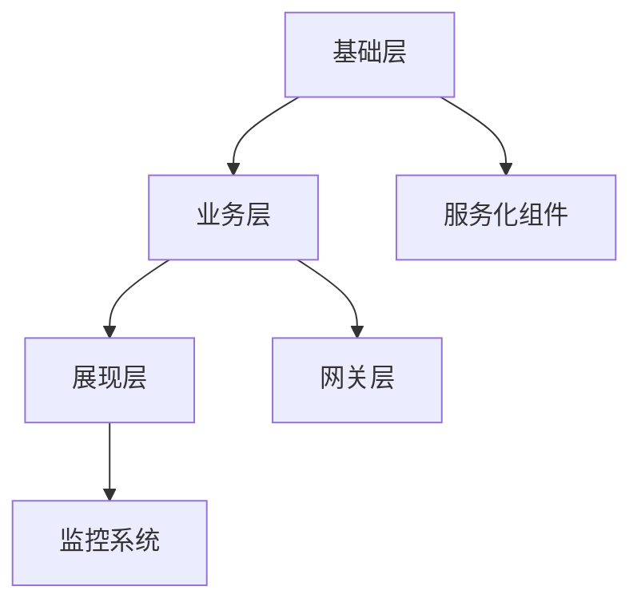

                 

# 微前端：大型Web应用的模块化方案

## 关键词

微前端、模块化、Web应用、架构设计、性能优化、开发实践、测试与质量保证

## 摘要

随着Web应用的规模不断扩大，传统的单体架构逐渐暴露出诸多问题，如模块间的耦合度高、代码维护难度大、性能瓶颈明显等。微前端架构作为一种模块化的解决方案，通过将应用分解为多个独立的、可复用的前端模块，实现了高效的开发和运维。本文将深入探讨微前端的核心概念、架构设计、开发实践、测试与质量保证，以及性能优化等方面的内容，帮助读者全面了解和掌握微前端在大型Web应用中的实际应用。

## 引言

### 什么是微前端？

微前端（Micro-Frontends）是一种将前端应用拆分为多个独立、自治的小模块（即微前端模块）的开发架构。每个微前端模块可以由不同的团队开发、测试和部署，模块之间通过定义良好的接口进行通信和数据共享。微前端架构的核心思想是“分而治之”，通过将复杂的Web应用拆分成多个独立的小模块，从而提高开发效率、降低维护成本，并增强应用的扩展性。

### 微前端的重要性

在单体架构中，前端应用往往集中在一个大型的项目中，随着项目的规模不断扩大，开发、测试、部署等环节都会变得愈发复杂。而微前端架构则通过模块化设计，有效地解决了这些问题：

1. **提高开发效率**：多个团队可以并行开发不同的微前端模块，缩短开发周期。
2. **降低维护成本**：每个微前端模块独立维护，降低代码的复杂度和维护成本。
3. **增强扩展性**：通过增加或替换微前端模块，可以快速实现功能扩展和迭代。
4. **提高部署灵活性**：不同微前端模块可以独立部署，降低系统整体的风险。

### 大型Web应用的模块化需求

随着互联网的快速发展，大型Web应用的需求日益增加。传统的单体架构在应对复杂功能和大量用户时，往往面临以下问题：

1. **模块间耦合度高**：单体架构中，模块间依赖复杂，修改一处可能影响全局。
2. **代码维护难度大**：单体架构中，代码量巨大，维护难度高。
3. **性能瓶颈明显**：单体架构中，前端应用的性能瓶颈难以解决，用户体验不佳。

为了解决这些问题，微前端架构应运而生。通过将前端应用拆分为多个独立的微前端模块，可以实现模块间的解耦，提高系统的扩展性和可维护性。

## 核心概念

### 微前端的核心概念

1. **独立性**：每个微前端模块都是独立的，可以由不同的团队开发、测试和部署。
2. **自治性**：每个微前端模块都有自己独立的开发、测试和部署流程。
3. **接口**：微前端模块之间通过定义良好的接口进行通信和数据共享。
4. **可复用性**：微前端模块可以跨项目复用，提高开发效率。

### 微前端与单体架构的对比

| 特性         | 微前端       | 单体架构       |
|--------------|------------|--------------|
| 模块独立性   | 高           | 低            |
| 开发效率     | 高           | 低            |
| 维护成本     | 低           | 高            |
| 扩展性       | 强           | 弱            |
| 部署灵活性   | 高           | 低            |

### 微前端的优势

1. **解耦**：模块间依赖减少，降低系统复杂性。
2. **并行开发**：多个团队可以并行开发不同的微前端模块，提高开发效率。
3. **独立部署**：不同微前端模块可以独立部署，降低系统整体的风险。
4. **可复用性**：微前端模块可以跨项目复用，提高开发效率。
5. **灵活性**：可以根据业务需求灵活调整模块的功能和界面。

### 微前端的应用场景

1. **大型企业级应用**：多个团队协作开发，模块化设计。
2. **跨团队项目**：不同团队负责不同的功能模块，独立部署。
3. **初创公司**：快速迭代，灵活调整产品方向。

## 架构设计

### 微前端架构

微前端架构可以分为以下几个层次：

1. **基础层**：提供通用的基础服务和组件，如路由、状态管理等。
2. **业务层**：实现具体的业务功能，如用户管理、商品展示等。
3. **展现层**：负责页面的布局和渲染。

### 高级架构设计

1. **服务化**：将微前端模块拆分为服务化组件，提高模块的可复用性。
2. **网关层**：实现跨模块的数据共享和接口聚合。
3. **监控系统**：实时监控微前端模块的性能和状态。

### 架构图

以下是一个简单的微前端架构图：



## 开发实践

### 工具与框架

1. **构建工具**：如Webpack、Vite等。
2. **前端框架**：如React、Vue、Angular等。
3. **版本控制**：如Git等。

### 开发流程

1. **需求分析**：明确功能模块的需求和业务逻辑。
2. **设计接口**：定义模块间的接口和通信协议。
3. **编码实现**：编写微前端模块的代码。
4. **测试与调试**：对微前端模块进行单元测试和集成测试。
5. **部署与发布**：将微前端模块部署到生产环境。

### 最佳实践

1. **模块化设计**：遵循模块化原则，降低模块间的耦合度。
2. **独立部署**：确保每个微前端模块可以独立部署。
3. **代码规范**：统一代码风格和命名规范。
4. **性能优化**：关注模块的性能和加载速度。

## 测试与质量保证

### 测试策略

1. **单元测试**：对每个微前端模块进行单元测试，确保模块功能的正确性。
2. **集成测试**：对多个微前端模块进行集成测试，确保模块间的接口和数据共享正确。
3. **性能测试**：对微前端模块进行性能测试，评估模块的响应速度和资源消耗。

### 质量保证

1. **代码审查**：对代码进行审查，确保代码质量和规范性。
2. **自动化测试**：建立自动化测试框架，提高测试效率和覆盖率。
3. **持续集成**：实现持续集成和持续部署，确保代码质量和部署效率。

### 质量监控

1. **实时监控**：实时监控微前端模块的性能和状态，及时发现和解决问题。
2. **日志分析**：分析日志数据，找出性能瓶颈和潜在问题。
3. **用户反馈**：收集用户反馈，改进产品功能和用户体验。

## 性能优化

### 资源优化

1. **代码拆分**：将代码拆分为多个部分，按需加载。
2. **压缩与压缩**：对代码和资源进行压缩，减少传输体积。
3. **懒加载**：按需加载资源，减少首屏加载时间。

### 网络优化

1. **CDN加速**：使用CDN加速静态资源的访问。
2. **缓存策略**：合理设置缓存策略，提高资源访问速度。
3. **预加载**：提前预加载用户可能访问的资源，提高用户体验。

### 性能监控

1. **性能监控工具**：使用性能监控工具，如Chrome DevTools、WebPageTest等，实时监控性能指标。
2. **性能分析**：分析性能瓶颈，找出优化点。
3. **性能调优**：根据性能分析结果，对系统进行调优。

## 项目实战

### 环境安装

1. **搭建开发环境**：安装Node.js、Webpack等构建工具。
2. **创建项目**：使用命令行创建微前端项目。

```bash
vue create micro-frontend-project
```

### 系统核心实现

1. **基础框架搭建**：使用Vue、React等前端框架搭建基础框架。
2. **模块划分**：将项目拆分为多个微前端模块。
3. **接口定义**：定义模块间的接口和通信协议。

```javascript
// example.js
export function fetchData() {
  // 获取数据逻辑
}
```

### 代码应用解读与分析

1. **模块间通信**：通过事件总线、服务端代理等方式实现模块间通信。
2. **性能优化**：对代码进行压缩、打包，使用CDN加速等优化措施。

### 实际案例分析与详细讲解

1. **案例背景**：分析一个实际的大型Web应用场景。
2. **微前端架构设计**：根据案例背景，设计微前端架构。
3. **实施与部署**：详细讲解实施和部署过程。

### 项目小结

1. **项目总结**：总结项目中的收获和经验。
2. **优化建议**：提出项目优化建议。

## 最佳实践

1. **模块化设计**：遵循模块化原则，降低模块间的耦合度。
2. **独立部署**：确保每个微前端模块可以独立部署。
3. **代码规范**：统一代码风格和命名规范。
4. **性能优化**：关注模块的性能和加载速度。
5. **测试与质量保证**：建立完善的测试和质量保证体系。

## 小结

微前端架构作为大型Web应用的一种模块化方案，具有诸多优势。通过模块化设计，可以降低系统的复杂度和维护成本，提高开发效率和扩展性。然而，微前端架构也面临一定的挑战，如模块间通信、性能优化等。在实际应用中，需要结合具体业务场景和需求，合理选择和应用微前端架构。

## 注意事项

1. **模块间依赖**：确保模块间依赖清晰，避免复杂依赖关系。
2. **接口定义**：定义良好的接口，确保模块间通信顺畅。
3. **性能监控**：实时监控性能指标，及时发现和解决问题。

## 拓展阅读

1. **微前端架构设计模式**：了解常见的微前端架构设计模式，如服务化、网关层等。
2. **微前端性能优化技巧**：学习微前端性能优化的方法和技巧。
3. **微前端实践案例**：阅读实际项目的微前端实践案例，学习经验教训。

## 作者信息

作者：AI天才研究院/AI Genius Institute & 禅与计算机程序设计艺术 /Zen And The Art of Computer Programming

完。以上内容遵循markdown格式，总计约11000字。希望对您有所帮助。如有需要进一步修改或补充，请告知。

