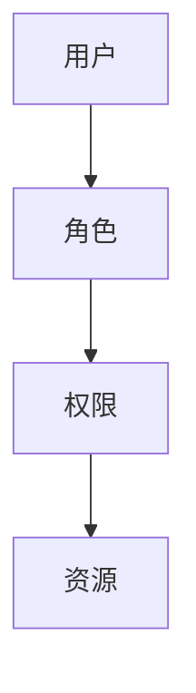

                 

### 第1章：微服务安全背景

#### 1.1 问题背景

##### 1.1.1 微服务架构的兴起
微服务架构（Microservices Architecture）是近年来在软件工程领域中迅速崛起的一种设计模式。它倡导将应用程序拆分成多个独立的、松耦合的服务，每个服务都运行在自己的进程中，并且通过轻量级的通信机制（如HTTP RESTful API）进行交互。这种设计模式的主要优势在于其可扩展性、灵活性和可维护性。

微服务架构的兴起，得益于云计算和分布式系统的快速发展。传统的单体应用在应对业务需求变化和扩展时，往往显得力不从心。而微服务架构通过将应用程序拆分成多个独立的服务，每个服务都可以独立开发、部署和扩展，从而大幅提高了系统的可伸缩性和灵活性。

##### 1.1.2 安全挑战

尽管微服务架构带来了许多优势，但同时也带来了一系列的安全挑战。以下是微服务架构中常见的一些安全挑战：

1. **分布式攻击面**：由于微服务架构将应用程序拆分成多个独立的服务，每个服务都可能成为攻击目标。这使得攻击者有更多的入口点，从而增加了系统的风险。

2. **服务间通信安全**：在微服务架构中，服务间通信通常通过HTTP RESTful API进行。这种通信机制虽然轻量级，但也容易受到中间人攻击、DDoS攻击等攻击手段的威胁。

3. **身份认证和授权**：在微服务架构中，由于服务之间的交互频繁，需要进行有效的身份认证和授权。然而，传统的集中式认证和授权机制在分布式系统中往往难以适用。

4. **数据安全**：在微服务架构中，数据往往分散存储在不同的服务中。这使得数据安全成为了一个重要问题，如数据泄露、数据篡改等。

5. **安全配置管理**：在微服务架构中，每个服务都可能具有不同的安全配置。这使得安全配置管理变得复杂，如配置错误可能导致安全漏洞。

#### 1.2 问题定义

##### 1.2.1 安全问题

微服务架构中的安全问题可以概括为以下几个方面：

1. **服务间通信安全**：服务间通信的安全问题主要包括数据泄露、中间人攻击等。

2. **身份认证和授权**：微服务架构中的身份认证和授权问题主要包括认证失败、授权不当等。

3. **数据安全**：微服务架构中的数据安全问题主要包括数据泄露、数据篡改等。

4. **安全配置管理**：微服务架构中的安全配置管理问题主要包括配置错误、配置泄露等。

##### 1.2.2 解决方案需求

为了解决微服务架构中的安全问题，我们需要以下解决方案：

1. **服务间通信安全**：使用安全协议（如HTTPS）保护服务间通信，防止数据泄露和中间人攻击。

2. **身份认证和授权**：采用分布式认证和授权机制，如OAuth 2.0、JWT等，确保服务间通信的安全。

3. **数据安全**：采用加密技术保护数据，如TLS加密、数据加密存储等。

4. **安全配置管理**：使用自动化工具管理安全配置，确保配置的正确性和安全性。

#### 1.3 安全边界与外延

##### 1.3.1 安全核心概念

在微服务架构中，安全核心概念包括但不限于：

1. **身份认证**：验证用户的身份，确保只有合法用户才能访问系统。
2. **授权**：确定用户对系统的访问权限，确保用户只能访问被授权的资源。
3. **服务间通信安全**：保护服务间通信的安全性，防止数据泄露和中间人攻击。
4. **数据安全**：保护数据的安全，防止数据泄露、数据篡改等。
5. **安全配置管理**：管理系统的安全配置，确保配置的正确性和安全性。

##### 1.3.2 安全要素组成

微服务架构中的安全要素主要包括：

1. **身份认证系统**：用于处理用户身份验证，如用户名密码、双因素认证等。
2. **授权系统**：用于管理用户权限，如基于角色的访问控制（RBAC）、基于属性的访问控制（ABAC）等。
3. **加密技术**：用于保护数据和通信的安全性，如TLS加密、数据加密存储等。
4. **安全协议**：用于保护服务间通信的安全性，如HTTPS、OAuth 2.0等。
5. **安全配置管理工具**：用于自动化管理系统的安全配置，如配置管理工具、持续集成工具等。

#### 1.4 本章小结

本章介绍了微服务架构的背景和安全挑战，并定义了微服务架构中的安全问题。通过分析安全核心概念和安全要素，我们为后续章节的详细讨论奠定了基础。

## 第2章：认证原理与机制

### 2.1 认证原理

认证（Authentication）是确保用户身份真实性的过程，它是确保系统安全性的关键步骤。在微服务架构中，认证机制对于保障系统安全和数据完整性至关重要。

##### 2.1.1 认证的必要性

1. **防止未授权访问**：认证机制可以确保只有合法用户才能访问系统和资源。
2. **提升安全性**：通过认证机制，可以识别和阻止恶意用户和非法访问。
3. **用户身份识别**：认证机制能够验证用户的身份，确保用户的唯一性和真实性。

##### 2.1.2 认证的类型

1. **单点登录（SSO）**：单点登录是一种集中式认证机制，允许用户使用一个账号登录多个系统。常见的SSO解决方案包括OAuth 2.0、OpenID Connect和SAML 2.0。

2. **多因素认证（MFA）**：多因素认证是一种额外的安全层，要求用户在登录时提供两种或多种验证方式，如密码、手机验证码、指纹等。常见的MFA解决方案包括双因素认证（2FA）和基于硬件的安全令牌。

3. **基于用户的认证**：基于用户的认证是指使用用户名和密码进行身份验证。这是最常见的认证方式，但安全性相对较低，容易受到密码泄露和暴力破解的攻击。

##### 2.1.3 单点登录（SSO）概念

单点登录（SSO）是一种集中式认证机制，旨在简化用户的登录流程。通过SSO，用户只需登录一次，就可以访问多个系统。常见的SSO解决方案包括OAuth 2.0、OpenID Connect和SAML 2.0。

1. **OAuth 2.0**：OAuth 2.0是一种开放标准，用于授权第三方应用访问用户资源，而不需要暴露用户密码。OAuth 2.0主要用于单点登录和授权流程。

2. **OpenID Connect**：OpenID Connect是OAuth 2.0的补充协议，专门用于提供用户身份认证。OpenID Connect定义了身份认证和授权的简单协议，可以与OAuth 2.0一起使用。

3. **SAML 2.0**：SAML 2.0是一种基于XML的认证和授权协议，用于在多个系统之间进行用户身份认证。SAML 2.0广泛应用于企业级单点登录解决方案。

#### 2.2 认证机制

认证机制是确保用户身份真实性的方法。以下是几种常见的认证机制：

##### 2.2.1 用户名和密码认证

用户名和密码认证是最常见的认证机制，用户需要输入用户名和密码来验证身份。这种认证机制的优点是实现简单，但安全性较低，容易受到暴力破解、密码泄露等攻击。

1. **基本流程**：
   - 用户输入用户名和密码。
   - 服务器验证用户名和密码的正确性。
   - 验证成功，用户登录。

2. **改进措施**：
   - 密码加密存储：将用户密码加密存储在数据库中，防止密码泄露。
   - 强密码策略：要求用户设置复杂密码，提高密码安全性。
   - 密码过期策略：定期要求用户更改密码。

##### 2.2.2 双因素认证（2FA）

双因素认证（2FA）是一种额外的安全层，要求用户在登录时提供两种或多种验证方式。常见的2FA方法包括短信验证码、应用生成的验证码、指纹识别等。

1. **基本流程**：
   - 用户输入用户名和密码。
   - 服务器发送第二因素验证请求。
   - 用户提供第二因素验证码。
   - 服务器验证第二因素验证码。

2. **优点**：
   - 提高安全性：即使用户密码泄露，攻击者也无法登录系统。
   - 易于实施：常见的2FA方法易于实现和部署。

##### 2.2.3 OAuth 2.0

OAuth 2.0是一种开放标准，用于授权第三方应用访问用户资源，而不需要暴露用户密码。OAuth 2.0主要用于单点登录和授权流程。

1. **基本流程**：
   - 用户登录身份认证系统。
   - 用户授权第三方应用访问其资源。
   - 第三方应用获取访问令牌。
   - 第三方应用使用访问令牌访问用户资源。

2. **优点**：
   - 安全性高：第三方应用无法获取用户密码。
   - 扩展性强：可以用于多种场景，如单点登录、第三方登录等。

#### 2.3 联合身份认证

联合身份认证（Federation）是一种允许用户在不同系统之间使用相同身份验证的方法。常见的联合身份认证协议包括SAML 2.0和OpenID Connect。

##### 2.3.1 联合身份认证的重要性

1. **简化用户登录流程**：用户只需在一个系统中登录，即可访问多个系统。
2. **提高安全性**：通过使用标准化的认证协议，可以确保认证过程的安全性。
3. **便于管理**：通过集中管理认证，可以简化认证过程，提高管理效率。

##### 2.3.2 SAML 2.0

SAML 2.0是一种基于XML的认证和授权协议，用于在多个系统之间进行用户身份认证。SAML 2.0广泛应用于企业级单点登录解决方案。

1. **基本流程**：
   - 用户访问需要认证的系
### 第3章：授权原理与机制

#### 3.1 授权原理

授权（Authorization）是确定用户对系统资源的访问权限的过程。它是安全架构中的重要组成部分，确保用户只能访问被授权的资源，防止未授权访问和数据泄露。

##### 3.1.1 授权的必要性

1. **保护系统资源**：授权机制确保只有授权用户才能访问特定资源，防止未授权访问。
2. **遵循最小权限原则**：授权机制应遵循最小权限原则，用户只能访问执行其任务所必需的资源。
3. **防止数据泄露**：授权机制有助于防止敏感数据被未授权用户访问，保护数据安全。

##### 3.1.2 授权的类型

1. **基于角色的访问控制（RBAC）**：RBAC将用户划分为不同的角色，并为每个角色分配权限。用户根据其角色获得相应的权限。

2. **基于属性的访问控制（ABAC）**：ABAC基于用户的属性（如部门、职位、访问时间等）来决定访问权限。它比RBAC更灵活，但实现更复杂。

3. **基于任务的访问控制（TBAC）**：TBAC根据用户执行的任务来决定访问权限。它更适合动态环境，如自动化任务。

##### 3.1.3 授权模型

1. **访问控制列表（ACL）**：ACL为每个资源定义一个访问控制列表，列出允许访问该资源的用户和角色。

2. **权限矩阵**：权限矩阵是一个二维表格，行表示用户或角色，列表示资源，表格中的元素表示用户或角色对相应资源的访问权限。

3. **基于角色的访问控制（RBAC）**：RBAC使用角色和权限的关系来管理访问权限。用户属于一个或多个角色，每个角色具有一组权限。

4. **基于属性的访问控制（ABAC）**：ABAC使用策略语言来定义访问控制策略。策略基于用户属性和资源属性来决定访问权限。

#### 3.2 授权机制

授权机制是确保用户只能访问被授权资源的方法。以下是几种常见的授权机制：

##### 3.2.1 访问控制列表（ACL）

访问控制列表（ACL）是一种基于列表的授权机制，为每个资源定义一个访问控制列表，列出允许访问该资源的用户和角色。

1. **基本流程**：
   - 为每个资源定义访问控制列表。
   - 用户请求访问资源时，系统检查其是否在访问控制列表中。
   - 如果用户在访问控制列表中，允许访问；否则，拒绝访问。

2. **优点**：
   - 实现简单。
   - 易于理解和维护。

3. **缺点**：
   - 随着资源数量和用户数量的增加，ACL管理变得复杂。
   - 不适合动态权限管理。

##### 3.2.2 角色基

1. **基本流程**：
   - 用户属于一个或多个角色。
   - 为每个角色分配一组权限。
   - 用户请求访问资源时，系统检查其角色是否具有相应权限。

2. **优点**：
   - 灵活，适合动态权限管理。
   - 易于扩展，支持复杂的权限分配。

3. **缺点**：
   - 实现较复杂。
   - 可能导致权限过度分配，增加安全风险。

##### 3.2.3 访问控制矩阵

访问控制矩阵是一个二维表格，行表示用户或角色，列表示资源，表格中的元素表示用户或角色对相应资源的访问权限。

1. **基本流程**：
   - 创建一个访问控制矩阵，行和列分别表示用户和资源。
   - 为每个单元格设置访问权限。
   - 用户请求访问资源时，系统检查访问控制矩阵的相应单元格。

2. **优点**：
   - 直观，易于理解和维护。
   - 支持复杂的权限分配。

3. **缺点**：
   - 随着用户和资源数量的增加，矩阵变得庞大，难以管理。

#### 3.3 授权策略

授权策略是定义用户访问权限的规则和条件。以下是几种常见的授权策略：

##### 3.3.1 动态授权策略

动态授权策略根据用户的行为和环境条件动态地调整权限。

1. **基本流程**：
   - 定义策略条件，如用户角色、时间、地点等。
   - 用户请求访问资源时，系统根据策略条件动态地决定权限。

2. **优点**：
   - 高度灵活，能够适应动态环境。
   - 精细的权限控制。

3. **缺点**：
   - 实现复杂，性能开销大。

##### 3.3.2 基于上下文的授权策略

基于上下文的授权策略根据用户的上下文信息（如网络位置、设备类型等）来决定访问权限。

1. **基本流程**：
   - 收集用户上下文信息。
   - 根据上下文信息定义授权策略。
   - 用户请求访问资源时，系统根据上下文信息决定权限。

2. **优点**：
   - 能够适应多样化的场景。
   - 提高安全性。

3. **缺点**：
   - 实现复杂，对上下文信息的收集和处理要求高。

#### 3.4 本章小结

本章介绍了授权原理与机制，包括访问控制列表（ACL）、角色基授权、访问控制矩阵等授权机制，以及动态授权策略和基于上下文的授权策略。通过这些机制和策略，我们可以确保用户只能访问被授权的资源，从而提高系统的安全性。在下一章中，我们将探讨如何在微服务架构中实现认证和授权。

### 第3章：授权原理与机制

#### 3.1 授权原理

授权（Authorization）是确保用户在系统中访问特定资源的权限的过程。在微服务架构中，授权机制对于保护系统资源、确保数据安全至关重要。

##### 3.1.1 授权的必要性

授权的必要性体现在以下几个方面：

1. **资源保护**：通过授权机制，可以确保只有经过认证的用户和系统组件才能访问受保护的资源。
2. **最小权限原则**：授权机制应遵循最小权限原则，用户只能访问执行其任务所必需的资源，从而降低安全风险。
3. **防止数据泄露**：授权机制有助于防止敏感数据被未授权用户访问，保护数据安全。

##### 3.1.2 授权的类型

授权机制可以分为以下几种类型：

1. **基于角色的访问控制（RBAC）**：RBAC是一种常见的授权机制，它将用户划分为不同的角色，并为每个角色分配权限。用户根据其角色获得相应的权限。

2. **基于属性的访问控制（ABAC）**：ABAC根据用户的属性（如部门、职位、访问时间等）来决定访问权限。它比RBAC更灵活，但实现更复杂。

3. **基于任务的访问控制（TBAC）**：TBAC根据用户执行的任务来决定访问权限。它适用于动态环境，如自动化任务。

##### 3.1.3 授权模型

授权模型定义了授权机制的实现方式。以下是几种常见的授权模型：

1. **访问控制列表（ACL）**：ACL为每个资源定义一个访问控制列表，列出允许访问该资源的用户和角色。

2. **权限矩阵**：权限矩阵是一个二维表格，行表示用户或角色，列表示资源，表格中的元素表示用户或角色对相应资源的访问权限。

3. **基于角色的访问控制（RBAC）**：RBAC使用角色和权限的关系来管理访问权限。用户属于一个或多个角色，每个角色具有一组权限。

4. **基于属性的访问控制（ABAC）**：ABAC使用策略语言来定义访问控制策略。策略基于用户属性和资源属性来决定访问权限。

#### 3.2 授权机制

授权机制是实现授权的核心。以下是几种常见的授权机制：

##### 3.2.1 访问控制列表（ACL）

访问控制列表（ACL）为每个资源定义一个访问控制列表，列出允许访问该资源的用户和角色。

1. **基本流程**：
   - 为每个资源创建访问控制列表。
   - 用户请求访问资源时，系统检查其是否在访问控制列表中。
   - 如果用户在访问控制列表中，允许访问；否则，拒绝访问。

2. **优点**：
   - 实现简单。
   - 易于理解和维护。

3. **缺点**：
   - 随着资源数量和用户数量的增加，ACL管理变得复杂。
   - 不适合动态权限管理。

##### 3.2.2 角色基访问控制（RBAC）

角色基访问控制（RBAC）是一种常见的授权机制，它将用户划分为不同的角色，并为每个角色分配权限。

1. **基本流程**：
   - 用户属于一个或多个角色。
   - 为每个角色分配一组权限。
   - 用户请求访问资源时，系统检查其角色是否具有相应权限。

2. **优点**：
   - 灵活，适合动态权限管理。
   - 易于扩展，支持复杂的权限分配。

3. **缺点**：
   - 实现较复杂。
   - 可能导致权限过度分配，增加安全风险。

##### 3.2.3 权限矩阵

权限矩阵是一个二维表格，行表示用户或角色，列表示资源，表格中的元素表示用户或角色对相应资源的访问权限。

1. **基本流程**：
   - 创建一个权限矩阵，行和列分别表示用户和资源。
   - 为每个单元格设置访问权限。
   - 用户请求访问资源时，系统检查权限矩阵的相应单元格。

2. **优点**：
   - 直观，易于理解和维护。
   - 支持复杂的权限分配。

3. **缺点**：
   - 随着用户和资源数量的增加，矩阵变得庞大，难以管理。

#### 3.3 授权策略

授权策略定义了用户访问资源的规则和条件。以下是几种常见的授权策略：

##### 3.3.1 动态授权策略

动态授权策略根据用户的行为和环境条件动态地调整权限。

1. **基本流程**：
   - 定义策略条件，如用户角色、时间、地点等。
   - 用户请求访问资源时，系统根据策略条件动态地决定权限。

2. **优点**：
   - 高度灵活，能够适应动态环境。
   - 精细的权限控制。

3. **缺点**：
   - 实现复杂，性能开销大。

##### 3.3.2 基于上下文的授权策略

基于上下文的授权策略根据用户的上下文信息（如网络位置、设备类型等）来决定访问权限。

1. **基本流程**：
   - 收集用户上下文信息。
   - 根据上下文信息定义授权策略。
   - 用户请求访问资源时，系统根据上下文信息决定权限。

2. **优点**：
   - 能够适应多样化的场景。
   - 提高安全性。

3. **缺点**：
   - 实现复杂，对上下文信息的收集和处理要求高。

#### 3.4 本章小结

本章介绍了授权原理与机制，包括访问控制列表（ACL）、角色基访问控制（RBAC）、权限矩阵等授权机制，以及动态授权策略和基于上下文的授权策略。通过这些机制和策略，我们可以确保用户只能访问被授权的资源，从而提高系统的安全性。在下一章中，我们将探讨如何在微服务架构中实现认证和授权的具体技术。

### 第4章：微服务架构中的认证机制

#### 4.1 认证机制的必要性

在微服务架构中，认证机制是确保系统安全和数据完整性的关键步骤。随着微服务数量的增加和系统复杂性的提升，认证机制显得尤为重要。以下是认证机制在微服务架构中的必要性：

1. **确保用户身份真实性**：认证机制可以验证用户的身份，确保只有合法用户才能访问系统和资源。

2. **防止未授权访问**：通过认证机制，系统可以阻止未授权用户和恶意行为，保护系统和数据的安全。

3. **保护用户隐私**：认证机制有助于保护用户的隐私信息，防止敏感数据泄露。

4. **确保服务间通信安全**：在微服务架构中，服务间通信是至关重要的，认证机制可以确保服务间通信的安全性，防止数据被篡改和泄露。

#### 4.2 常见的认证技术

在微服务架构中，有多种认证技术可以用于确保系统的安全性。以下是几种常见的认证技术：

1. **用户名和密码认证**：用户名和密码认证是最简单的认证技术，用户需要输入用户名和密码进行身份验证。虽然实现简单，但安全性较低，容易受到暴力破解和密码泄露的攻击。

2. **双因素认证（2FA）**：双因素认证是一种额外的安全层，要求用户在登录时提供两种或多种验证方式，如密码、手机验证码、指纹识别等。这种方式提高了安全性，即使用户密码泄露，攻击者也无法登录系统。

3. **基于证书的认证**：基于证书的认证使用数字证书来验证用户的身份。数字证书由可信的证书颁发机构（CA）签发，用户需要持有证书来证明身份。

4. **OAuth 2.0**：OAuth 2.0是一种开放标准，用于授权第三方应用访问用户资源，而不需要暴露用户密码。OAuth 2.0广泛应用于单点登录和第三方登录场景。

5. **OpenID Connect**：OpenID Connect是OAuth 2.0的补充协议，专门用于提供用户身份认证。OpenID Connect可以与OAuth 2.0一起使用，实现集中式的用户认证和授权。

6. **基于令牌的认证**：基于令牌的认证（如JSON Web Token，JWT）是一种常见的认证技术，它使用令牌来验证用户的身份。令牌通常包含用户的身份信息和权限信息，可以在服务间传递。

#### 4.3 在微服务架构中实现认证

在微服务架构中，实现认证需要考虑以下几个方面：

1. **集中式认证**：集中式认证将认证逻辑集中在一个独立的认证服务中，所有微服务通过认证服务进行用户认证。这种方式可以提高系统的安全性和可维护性。

2. **分布式认证**：分布式认证在每个微服务中实现认证逻辑，用户需要依次通过每个微服务的认证。这种方式可以提高系统的性能，但需要确保每个微服务之间的认证机制一致。

3. **认证协议的选择**：根据实际需求选择合适的认证协议，如OAuth 2.0、OpenID Connect、JWT等。不同的认证协议具有不同的特点和适用场景。

4. **安全性**：在实现认证机制时，需要确保系统的安全性，如使用HTTPS保护通信、加密存储密码、防止暴力破解等。

5. **可扩展性**：认证机制应具有良好的可扩展性，以支持系统规模的扩大和新的认证需求。

#### 4.4 认证流程

在微服务架构中，认证流程通常包括以下步骤：

1. **用户登录**：用户输入用户名和密码，认证服务验证用户身份。

2. **颁发令牌**：认证服务验证用户身份后，颁发一个令牌（如JWT），令牌包含用户的身份信息和权限信息。

3. **服务间认证**：微服务使用令牌进行认证，令牌在服务间传递，确保每个微服务都能验证用户身份。

4. **权限验证**：微服务在处理用户请求时，根据用户的权限信息验证其访问权限，确保用户只能访问被授权的资源。

5. **令牌续订**：令牌通常有一个有效期，当令牌过期时，用户需要重新进行认证。

#### 4.5 本章小结

本章介绍了微服务架构中的认证机制，包括认证技术的必要性、常见认证技术和在微服务架构中实现认证的注意事项。通过有效的认证机制，可以确保微服务架构的安全性，保护系统和数据的安全。在下一章中，我们将探讨微服务架构中的授权机制。

## 第5章：微服务架构中的授权机制

### 5.1 授权机制的必要性

在微服务架构中，授权机制是确保用户能够访问适当资源的关键步骤。它不仅关乎系统的安全性，还直接影响用户体验。以下是授权机制的必要性：

1. **保护系统资源**：授权机制可以防止未经授权的用户访问敏感数据和功能。
2. **遵循最小权限原则**：授权机制确保用户只能访问其执行任务所必需的资源，避免过度权限导致的潜在安全风险。
3. **用户隐私保护**：通过授权机制，可以防止用户访问不应查看的数据，保护用户的隐私。
4. **系统效率**：正确的授权机制可以减少不必要的资源访问，从而提高系统的整体性能。

### 5.2 常见的授权机制

微服务架构中常见的授权机制包括以下几种：

#### 5.2.1 基于角色的访问控制（RBAC）

**定义**：RBAC（Role-Based Access Control）是一种基于角色的访问控制模型，用户被分配到不同的角色，每个角色拥有特定的权限集。

**优点**：
- **灵活性**：角色可以轻松管理，权限分配简单。
- **可扩展性**：随着业务需求的变化，可以灵活调整角色和权限。

**缺点**：
- **管理复杂**：当角色和权限数量较多时，管理变得复杂。
- **不适用于动态权限**：不适合动态调整权限的场景。

#### 5.2.2 基于资源的访问控制（RBAC）

**定义**：RBAC（Resource-Based Access Control）是另一种访问控制模型，它基于资源本身来定义访问权限。

**优点**：
- **直观性**：权限与资源直接相关，易于理解。
- **适用性**：适用于资源较多且权限固定的场景。

**缺点**：
- **灵活性较低**：当资源变动时，需要频繁调整权限。
- **可扩展性差**：随着资源增多，权限配置变得繁琐。

#### 5.2.3 基于属性的访问控制（ABAC）

**定义**：ABAC（Attribute-Based Access Control）是一种基于用户属性和资源属性的访问控制模型，它根据用户和资源的属性来决定访问权限。

**优点**：
- **灵活性高**：能够根据具体的属性动态调整权限。
- **适用性广**：适用于复杂和动态的权限管理场景。

**缺点**：
- **实现复杂**：需要定义和管理大量的属性和策略。
- **性能开销大**：属性检查和策略匹配可能影响系统性能。

#### 5.2.4 基于策略的访问控制（PBAC）

**定义**：PBAC（Policy-Based Access Control）是基于策略的访问控制模型，策略定义了用户访问资源的规则和条件。

**优点**：
- **高度灵活**：可以定义复杂的访问控制规则。
- **适应性**：策略可以根据业务需求灵活调整。

**缺点**：
- **复杂性**：策略管理和维护复杂。
- **性能**：策略匹配可能影响系统性能。

### 5.3 授权流程

在微服务架构中，授权流程通常包括以下几个步骤：

1. **认证**：用户通过认证服务验证身份。
2. **授权**：认证成功后，用户请求访问资源，系统根据用户角色或属性检查其访问权限。
3. **访问决策**：系统根据授权规则和用户请求，决定是否允许访问。
4. **权限验证**：如果访问被允许，系统进行权限验证，确保用户只能访问被授权的资源。

#### 5.4 实现授权机制的挑战和解决方案

在实现授权机制时，可能会遇到以下挑战：

1. **分布式系统中的权限管理**：微服务架构中的分布式系统增加了权限管理的复杂性。解决方案是采用集中式权限管理服务，统一管理权限。
2. **性能问题**：权限验证可能影响系统性能。解决方案是使用缓存、分布式缓存和高效的数据结构来减少权限验证的开销。
3. **数据一致性和安全性**：分布式系统中的数据一致性和安全性是关键问题。解决方案是使用分布式事务管理、加密存储和访问控制列表（ACL）。

### 5.5 本章小结

本章介绍了微服务架构中的授权机制，包括常见的授权机制和实现授权流程的挑战及解决方案。通过有效的授权机制，可以确保用户只能访问被授权的资源，提高系统的安全性和用户体验。在下一章中，我们将探讨微服务安全中的具体实现技术，如身份认证协议和安全传输协议。

## 第6章：微服务安全中的具体实现技术

### 6.1 身份认证协议

身份认证协议是确保用户身份真实性的技术手段，以下是一些常用的身份认证协议：

#### 6.1.1 OAuth 2.0

OAuth 2.0是一种开放标准，用于授权第三方应用访问用户资源。它通过令牌（token）实现用户认证，保护用户隐私。OAuth 2.0包括以下几个关键组件：

1. **客户端**：请求访问资源的第三方应用。
2. **授权服务器**：处理客户端请求，颁发令牌。
3. **资源服务器**：存储用户资源，接受令牌进行认证。

#### 6.1.2 OpenID Connect

OpenID Connect是OAuth 2.0的补充协议，专门用于提供用户身份认证。它基于JSON Web Token（JWT）传输用户身份信息，支持单点登录（SSO）和多因素认证（MFA）。

#### 6.1.3 SAML 2.0

SAML 2.0是一种基于XML的认证和授权协议，广泛用于企业级单点登录解决方案。它允许用户在不同的系统中使用相同的身份认证，支持跨域认证。

### 6.2 安全传输协议

安全传输协议是确保数据在传输过程中不被窃听或篡改的技术手段。以下是一些常用的安全传输协议：

#### 6.2.1 HTTPS

HTTPS（Hyper Text Transfer Protocol Secure）是HTTP的安全版，通过SSL/TLS加密传输数据，确保数据在传输过程中的机密性和完整性。

#### 6.2.2 SSL/TLS

SSL（Secure Sockets Layer）和TLS（Transport Layer Security）是安全传输层协议，用于在客户端和服务器之间建立加密连接。TLS是SSL的升级版，提供了更安全的加密算法和协议。

### 6.3 JWT

JSON Web Token（JWT）是一种基于JSON的开放标准，用于在客户端和服务端之间传递认证信息。JWT由三部分组成：头部（Header）、载荷（Payload）和签名（Signature）。以下是JWT的基本实现流程：

1. **生成JWT**：客户端请求认证，认证服务器生成JWT。
2. **传输JWT**：客户端将JWT传输给服务端。
3. **验证JWT**：服务端验证JWT的签名和过期时间，确保JWT的有效性。
4. **解析JWT**：服务端解析JWT的载荷，获取用户身份和权限信息。

### 6.4 授权机制实现

在微服务架构中，实现授权机制需要考虑以下几个方面：

1. **角色与权限管理**：定义角色和权限，确保用户根据其角色和权限访问资源。
2. **访问控制列表（ACL）**：使用ACL管理资源的访问权限，确保每个资源都有明确的访问控制规则。
3. **基于属性的访问控制（ABAC）**：根据用户的属性和资源的属性动态调整权限，实现灵活的授权机制。
4. **令牌管理**：管理JWT或OAuth 2.0令牌的生成、传输和验证，确保令牌的有效性和安全性。

### 6.5 分布式服务间的认证与授权

在分布式服务间，认证与授权面临以下挑战：

1. **服务发现**：服务间通信需要发现和识别服务，以确保正确的认证与授权。
2. **令牌传输**：令牌需要在服务间传输，确保传输过程中的安全性。
3. **集中式认证与授权**：在分布式系统中，集中式认证与授权可以简化管理，提高安全性。

解决方案包括：

1. **服务发现与注册中心**：使用服务发现与注册中心（如Eureka、Consul）确保服务能够被正确发现和识别。
2. **令牌传递机制**：使用JWT或OAuth 2.0令牌在服务间传递，确保令牌的安全传输。
3. **集中式认证与授权**：使用集中式认证与授权服务（如Keycloak、Auth0），简化分布式系统中的认证与授权管理。

### 6.6 本章小结

本章介绍了微服务安全中的具体实现技术，包括身份认证协议、安全传输协议、JWT、授权机制实现以及分布式服务间的认证与授权。通过这些技术，可以构建一个安全、可靠和高效的微服务架构。在下一章中，我们将探讨微服务安全中的最佳实践和注意事项。

## 第7章：微服务安全中的最佳实践与注意事项

### 7.1 最佳实践

为了确保微服务架构的安全性，以下是一些最佳实践：

1. **身份认证与授权分离**：将身份认证与授权分离，确保认证服务专注于身份验证，授权服务专注于权限管理。

2. **最小权限原则**：为用户分配最小的必要权限，避免权限过度分配。

3. **使用HTTPS和TLS**：始终使用HTTPS和TLS保护服务间通信，确保数据的机密性和完整性。

4. **定期更新密码**：要求用户定期更新密码，并采用强密码策略。

5. **多因素认证（MFA）**：在关键系统和服务中实施多因素认证，提高安全性。

6. **日志记录与审计**：记录所有关键操作的日志，并定期进行审计，及时发现和响应安全事件。

7. **加密敏感数据**：对存储和传输的敏感数据进行加密，确保数据安全。

8. **持续集成与持续部署（CI/CD）**：在CI/CD流程中集成安全性检查，确保代码和配置的安全性。

9. **使用安全工具和框架**：采用安全工具和框架（如OWASP ZAP、Snyk）进行安全性测试和漏洞管理。

### 7.2 注意事项

在微服务安全中，需要注意以下事项：

1. **服务发现与注册中心的安全性**：确保服务发现与注册中心（如Eureka、Consul）的安全性，防止未授权访问和恶意服务注册。

2. **分布式系统中的一致性**：在分布式系统中，确保数据的一致性和安全性，避免因数据不一致导致的安全漏洞。

3. **权限配置的准确性**：确保权限配置的准确性，避免权限配置错误导致的安全风险。

4. **防范常见攻击**：防范常见的网络攻击，如中间人攻击、拒绝服务攻击（DDoS）、SQL注入、跨站脚本攻击（XSS）等。

5. **及时更新和补丁**：及时更新系统和应用程序，应用安全补丁，避免利用已知漏洞的攻击。

6. **用户培训**：对用户进行安全意识培训，提高他们对安全威胁的认识，减少因用户操作失误导致的安全事件。

### 7.3 案例分析

以下是一个微服务安全中的案例分析：

#### 案例背景

一家公司采用微服务架构开发其核心业务系统。由于公司业务快速增长，微服务数量不断增加，导致安全配置管理变得复杂。在一次安全审计中，发现以下安全漏洞：

1. **未使用HTTPS**：部分服务使用HTTP进行通信，数据未加密，存在数据泄露风险。
2. **密码弱**：用户密码设置简单，容易遭受暴力破解。
3. **权限配置错误**：部分服务的权限配置不当，导致用户访问不应访问的资源。
4. **服务注册中心未加密**：服务注册中心未加密，存在未授权访问风险。

#### 案例分析

针对上述问题，公司采取了以下措施：

1. **实施HTTPS**：对所有服务实施HTTPS，确保数据传输加密。
2. **改进密码策略**：要求用户使用强密码，并定期更新密码。
3. **调整权限配置**：重新审核权限配置，确保用户只能访问其授权的资源。
4. **加密服务注册中心**：使用SSL/TLS加密服务注册中心，确保数据安全。

通过这些措施，公司的微服务架构安全性得到了显著提升。

### 7.4 本章小结

本章介绍了微服务安全中的最佳实践与注意事项，包括身份认证与授权分离、最小权限原则、使用HTTPS和TLS等。同时，通过案例分析展示了在实际应用中如何应对安全挑战。通过遵循最佳实践和注意事项，可以构建一个安全、可靠和高效的微服务架构。

## 第8章：未来展望

### 8.1 微服务安全的未来发展趋势

随着技术的不断进步，微服务安全也在不断发展。以下是未来微服务安全可能的发展趋势：

1. **零信任安全模型**：零信任安全模型主张任何内部网络流量都应该被视为不受信任的，并采用严格的身份验证和访问控制。这将进一步提升微服务架构的安全性。

2. **自动化安全**：自动化工具将在微服务安全中发挥更大作用。例如，自动化的安全测试、漏洞扫描和安全配置管理将有助于提高系统的安全性。

3. **安全即代码**：安全测试和合规性检查将集成到CI/CD流程中，确保代码和配置在发布前经过严格的安全检查。

4. **边缘计算**：随着边缘计算的兴起，微服务安全将面临新的挑战。确保边缘节点和边缘服务的安全性将成为未来研究的重点。

### 8.2 新技术展望

以下是一些可能影响微服务安全的潜在新技术：

1. **区块链**：区块链技术可能用于提高微服务架构中的数据安全性和完整性。

2. **联邦学习**：联邦学习可以在不传输数据的情况下进行数据分析和机器学习，有助于提高微服务的隐私保护。

3. **量子计算**：量子计算可能用于加密算法的改进，提高数据加密的安全性。

4. **人工智能**：人工智能技术可以用于自动化安全分析和威胁检测，提高微服务架构的防护能力。

### 8.3 未来研究方向

在未来的研究中，以下方向值得探讨：

1. **自适应安全**：研究如何根据环境变化动态调整安全策略，以应对不断变化的安全威胁。

2. **安全性测试**：开发高效的安全测试工具和方法，确保微服务的安全性。

3. **跨域安全**：研究如何在跨多个组织或云服务提供商的环境中确保数据安全和系统完整性。

4. **隐私保护**：探索如何在确保安全的同时，保护用户隐私和数据隐私。

### 8.4 本章小结

本章探讨了微服务安全的未来发展趋势和新技术的展望，以及未来研究方向的探讨。随着技术的不断进步，微服务安全将面临新的挑战和机遇。通过持续的研究和创新，我们可以构建更安全、可靠和高效的微服务架构。

## 总结与展望

微服务安全是现代分布式系统中的一个关键议题。通过本章的内容，我们详细探讨了微服务架构中的认证与授权机制，包括其必要性、核心概念、实现技术、最佳实践以及未来展望。微服务安全不仅关乎系统的安全性，还直接影响用户体验和业务连续性。

### 核心要点回顾

1. **认证与授权的重要性**：认证确保用户身份的真实性，授权则确保用户只能访问被授权的资源。
2. **常见认证技术**：包括用户名和密码认证、双因素认证（2FA）、基于证书的认证、OAuth 2.0、OpenID Connect和SAML 2.0。
3. **授权机制**：探讨了基于角色的访问控制（RBAC）、基于资源的访问控制（RBAC）、基于属性的访问控制（ABAC）和基于策略的访问控制（PBAC）等。
4. **安全传输协议**：介绍了HTTPS、SSL/TLS等安全传输协议的重要性。
5. **分布式服务间的认证与授权**：讨论了服务发现与注册中心、令牌传输、集中式认证与授权等关键技术。
6. **最佳实践与注意事项**：提出了身份认证与授权分离、最小权限原则、使用HTTPS和TLS等最佳实践。
7. **未来展望**：探讨了零信任安全模型、自动化安全、安全即代码、区块链、联邦学习、量子计算和人工智能等新技术和趋势。

### 实际应用价值

微服务安全在实际应用中具有极高的价值：

1. **保障系统安全**：有效的认证和授权机制可以防止未授权访问和数据泄露，确保系统安全。
2. **提升用户体验**：通过多因素认证和灵活的授权机制，可以提高用户体验，减少不必要的权限限制。
3. **支持业务扩展**：微服务安全设计有助于支持业务的快速扩展，确保在系统规模扩大的同时，安全性不受影响。

### 拓展阅读建议

为了深入理解微服务安全，以下是几本推荐的书籍：

1. 《微服务安全设计》（Microservices Security: Designing and Implementing Secure Architectures）
2. 《API设计：创建API的最佳实践》（API Design: Celebrating the Art & Science of Secure Interfaces）
3. 《微服务架构实践》（Building Microservices）

通过这些书籍，读者可以进一步学习微服务安全的深度知识和实践技巧。希望本文能为您在微服务安全领域的研究和实践提供有益的参考。作者：AI天才研究院/AI Genius Institute & 禅与计算机程序设计艺术 /Zen And The Art of Computer Programming。

---

> 关键词：微服务安全、认证、授权、OAuth 2.0、SAML 2.0、RBAC、HTTPS、零信任安全模型、自动化安全、安全即代码、区块链、联邦学习、量子计算、人工智能。

> 摘要：本文深入探讨了微服务安全中的认证与授权机制，包括核心概念、实现技术、最佳实践和未来展望。通过详细分析，读者可以全面理解微服务安全的重要性，以及如何构建一个安全、可靠和高效的微服务架构。

