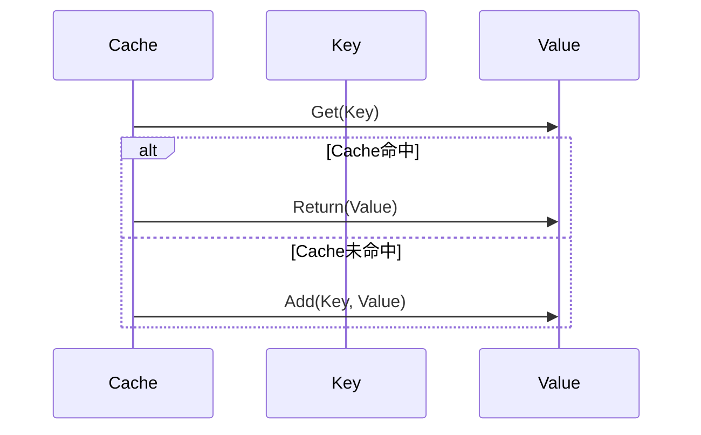
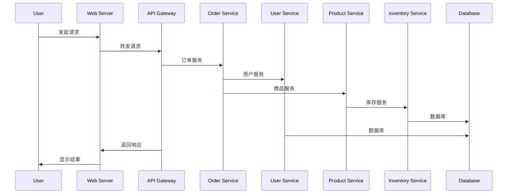
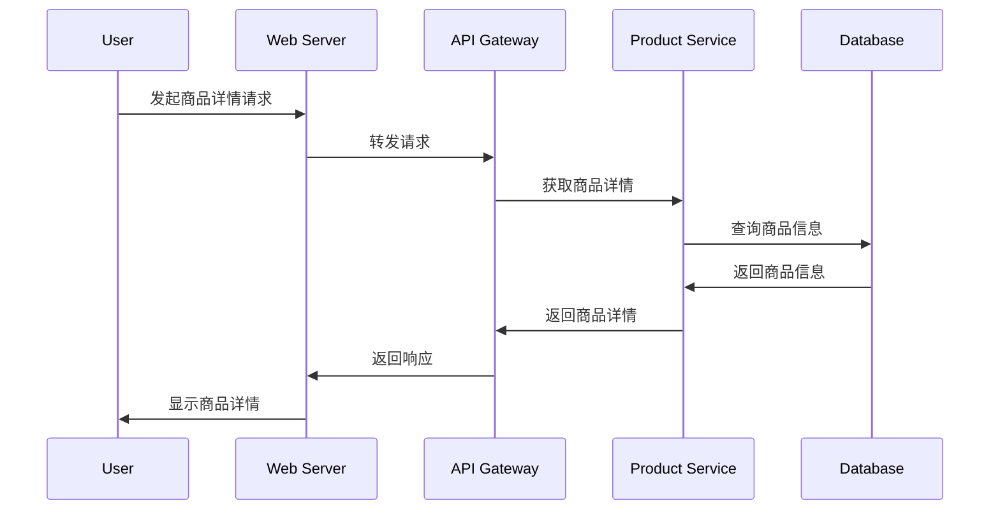

                 

### 微服务简介

#### 1.1 微服务概念与架构

微服务是一种软件架构风格，它将应用程序分解为一系列独立、可复用和服务化的微服务。这些微服务围绕业务功能构建，可以通过简单的接口（通常是HTTP RESTful API）相互通信，从而实现灵活、可扩展和易于维护的系统。

**微服务的定义**

微服务并不是一个统一的定义，但通常具备以下几个核心特征：

- **独立性**：每个微服务都是独立的，可以独立部署、测试和扩展。
- **轻量级**：微服务通常比较轻量，只需要依赖必要的库和框架。
- **自治**：每个微服务都有自己的数据存储，可以独立处理数据。
- **分布式**：微服务部署在多个服务器上，通过网络通信。
- **松耦合**：微服务之间通过API进行通信，相互独立，降低耦合度。

**微服务的核心特性**

微服务架构的核心特性包括：

- **模块化**：应用程序被分解为多个独立的服务，每个服务负责一个特定的业务功能。
- **弹性伸缩**：可以根据需求独立扩展或缩小某个服务，而不影响其他服务。
- **高可用性**：服务可以在不同服务器上独立部署，提高系统的容错能力和稳定性。
- **可测试性**：服务可以独立测试，便于发现和修复问题。
- **灵活性**：服务可以独立开发、部署和升级，适应快速变化的需求。

**微服务与传统单体架构对比**

传统单体架构是指所有的功能和逻辑都集中在一个单一的应用程序中。而微服务架构则与之相反，具有以下几个方面的区别：

- **部署方式**：微服务可以独立部署，而单体架构通常需要整体部署。
- **扩展性**：微服务可以独立扩展，而单体架构的扩展通常较为困难。
- **维护成本**：微服务独立部署和维护，而单体架构在维护上较为复杂。
- **技术栈**：微服务可以使用不同的技术栈，而单体架构通常需要统一的技术栈。
- **团队协作**：微服务架构通常需要跨团队的协作，而单体架构则相对独立。

通过以上对比，可以看出微服务架构在灵活性、可扩展性和维护性方面具有显著优势，但也带来了新的挑战，如分布式系统的一致性、负载均衡和数据同步等问题。

#### 1.2 微服务的优势与挑战

**微服务的优势**

1. **模块化与灵活性**：微服务架构将应用程序分解为多个独立的服务，使开发、测试和部署更加灵活。
2. **高可用性**：服务可以在不同服务器上独立部署，提高系统的容错能力和稳定性。
3. **弹性伸缩**：可以根据需求独立扩展或缩小某个服务，而不会影响其他服务。
4. **可复用性**：微服务可以独立开发、部署和升级，提高了代码复用率。
5. **技术多样性**：可以使用不同的技术栈，满足不同服务的需求。

**微服务的挑战**

1. **分布式系统的一致性**：在分布式系统中，数据一致性问题成为了一个挑战。
2. **负载均衡**：需要合理分配请求，避免单点过载。
3. **服务发现**：服务部署在不同服务器上，如何快速发现和访问服务。
4. **数据同步**：不同服务之间的数据需要同步，保持一致性。
5. **复杂性**：微服务架构带来了更多的组件和复杂性，增加了维护成本。
6. **安全性**：分布式系统需要确保数据的安全传输和存储。

综上所述，微服务架构具有显著的优势，但也带来了新的挑战。理解和应对这些挑战，是微服务架构成功应用的关键。

### 分布式系统性能优化简介

#### 2.1 性能优化的重要性

在分布式系统中，性能优化具有至关重要的地位。随着系统规模的扩大和用户数量的增加，系统性能的下降可能导致响应时间延长、吞吐量下降、错误率上升，从而影响用户体验和业务连续性。

性能优化不仅有助于提升系统的整体性能，还有以下重要意义：

1. **提高用户体验**：快速的响应时间和高效的吞吐量能够提升用户的使用体验，增加用户满意度。
2. **降低运营成本**：优化后的系统能够更高效地利用资源，降低硬件和网络等运营成本。
3. **提升系统稳定性**：通过性能优化，可以提前发现和解决潜在的性能瓶颈，提高系统的稳定性和可靠性。
4. **增强业务竞争力**：性能优秀的系统能够更好地支持业务快速发展，提高企业的市场竞争力。

#### 2.2 性能优化的基本方法

性能优化可以从以下几个方面进行：

1. **代码优化**：通过优化业务逻辑、减少冗余代码、提高代码效率，从而降低计算和内存开销。
2. **数据库优化**：优化数据库查询，使用索引、分库分表、缓存等技术，提升数据库访问效率。
3. **缓存机制**：使用缓存可以减少对后端系统的访问，降低响应时间，提高系统吞吐量。
4. **网络优化**：优化网络配置，减少网络延迟，提升数据传输速度。
5. **负载均衡**：通过负载均衡器合理分配请求，避免单点过载，提高系统的整体性能。
6. **架构优化**：优化系统架构，分解大任务、使用异步处理、引入分布式系统等技术，提升系统处理能力。

#### 2.3 性能瓶颈分析

在分布式系统中，性能瓶颈可能出现在多个方面，以下是一些常见的性能瓶颈及其原因：

1. **CPU使用率过高**：由于业务逻辑复杂、计算密集型任务过多，导致CPU长时间处于高负载状态。
2. **内存使用率过高**：内存泄漏、大量内存分配和释放、缓存过大等可能导致内存使用率过高，影响系统性能。
3. **网络延迟**：网络带宽不足、网络拥塞、网络质量差等原因导致数据传输速度慢，增加响应时间。
4. **数据库性能问题**：数据库查询优化不当、索引失效、表结构不合理等导致数据库访问效率低下。
5. **服务发现与负载均衡**：服务发现延迟、负载均衡策略不合理，可能导致部分服务过载，影响系统整体性能。

为了有效分析性能瓶颈，可以使用以下工具和方法：

1. **性能监控工具**：使用Prometheus、Grafana等工具，实时监控系统性能指标，快速发现性能问题。
2. **日志分析**：通过分析系统日志，查找性能瓶颈的线索，定位问题根源。
3. **性能测试**：通过压力测试、负载测试等手段，模拟真实场景下的系统负载，发现潜在的性能问题。

通过以上方法，可以全面分析分布式系统的性能瓶颈，并采取针对性的优化措施，提升系统性能。

### 微服务性能评估与监控

#### 2.1 性能评估指标

在微服务架构中，性能评估是确保系统高效运行的重要环节。以下是一些关键的性能评估指标：

1. **响应时间**：指系统从接收到请求到返回响应所需的时间。较低的响应时间能够提高用户体验。
2. **吞吐量**：指系统在单位时间内处理的请求量。高吞吐量意味着系统能够支持更多的并发请求。
3. **错误率**：指系统在处理请求时出现的错误比例。较低的错误率表明系统的稳定性较高。
4. **系统稳定性**：系统在长时间运行过程中，保持稳定运行的能力。系统稳定性对于业务连续性至关重要。

这些指标可以从多个维度评估微服务的性能：

- **业务维度**：从用户角度评估系统的响应速度和正确性。
- **系统维度**：从系统资源利用率和错误率等角度评估系统的健康状况。
- **资源维度**：从CPU、内存、网络等资源的使用情况评估系统的资源利用效率。

#### 2.2 性能监控工具

性能监控是保障微服务架构稳定运行的关键。以下是一些常用的性能监控工具：

1. **Prometheus**：开源的监控解决方案，用于收集、存储和展示系统性能数据。
2. **Grafana**：开源的数据分析和可视化平台，与Prometheus集成，用于创建仪表板和监控图表。
3. **系统自监控**：通过在微服务中集成自监控代码，收集系统内部性能数据，如HTTP请求、数据库查询等。

使用这些工具，可以实时监控微服务的性能指标，及时发现和处理性能问题。

#### 2.3 性能瓶颈分析

性能瓶颈分析是性能优化的重要环节。以下是一些常见的性能瓶颈及其原因：

1. **CPU使用率过高**：由于业务逻辑复杂、计算密集型任务过多，导致CPU长时间处于高负载状态。
2. **内存使用率过高**：内存泄漏、大量内存分配和释放、缓存过大等导致内存使用率过高，影响系统性能。
3. **网络延迟**：网络带宽不足、网络拥塞、网络质量差等原因导致数据传输速度慢，增加响应时间。
4. **数据库性能问题**：数据库查询优化不当、索引失效、表结构不合理等导致数据库访问效率低下。
5. **服务发现与负载均衡**：服务发现延迟、负载均衡策略不合理，可能导致部分服务过载，影响系统整体性能。

为了有效分析性能瓶颈，可以使用以下工具和方法：

1. **性能监控工具**：通过Prometheus、Grafana等工具，实时监控系统性能指标，快速发现性能问题。
2. **日志分析**：通过分析系统日志，查找性能瓶颈的线索，定位问题根源。
3. **性能测试**：通过压力测试、负载测试等手段，模拟真实场景下的系统负载，发现潜在的性能问题。

通过以上方法，可以全面分析微服务的性能瓶颈，并采取针对性的优化措施，提升系统性能。

### 微服务性能优化策略

#### 3.1 服务拆分与组合

微服务性能优化的重要策略之一是服务拆分与组合。正确的服务拆分能够提高系统的可维护性、扩展性和性能。

**拆分的必要性**

1. **功能模块化**：将复杂的业务功能拆分为更小的、独立的服务，降低系统的复杂性。
2. **独立性**：服务独立部署和扩展，提高系统的灵活性和可靠性。
3. **资源隔离**：服务独立使用资源，避免相互影响，提高资源利用效率。
4. **可复用性**：独立的服务可以复用，提高开发效率。

**组合的策略**

1. **基于业务功能拆分**：根据业务需求，将相关的功能模块拆分为独立的服务，例如订单服务、支付服务、用户服务等。
2. **基于数据一致性拆分**：将涉及相同数据的服务拆分为一组，确保数据一致性和完整性，例如用户服务、订单服务和库存服务。
3. **基于资源消耗拆分**：将资源消耗较高的服务拆分出来，单独部署和扩展，避免影响其他服务的性能。
4. **基于团队协作拆分**：根据开发团队的职责，将相关的服务分配给不同的团队，提高开发效率。

通过合理的拆分与组合，可以显著提升微服务的性能和系统整体的可维护性。

#### 3.2 缓存机制

缓存机制是微服务性能优化的重要手段之一，通过减少对后端系统的访问，提高系统的响应速度和吞吐量。

**常见缓存技术**

1. **内存缓存**：使用内存作为缓存存储介质，读写速度快，适用于高并发场景。
   - **Redis**：基于内存的键值存储，支持多种数据结构，适用于缓存和消息队列。
   - **Memcached**：简单的键值存储，适用于缓存系统。

2. **磁盘缓存**：使用磁盘作为缓存存储介质，适用于存储大量数据。
   - **EhCache**：基于Java的缓存框架，支持多种缓存策略。
   - **FileCache**：基于文件的缓存，简单易用。

**缓存命中率**

缓存命中率是衡量缓存机制效果的重要指标，表示命中缓存请求的次数与总请求次数的比值。高缓存命中率意味着大部分请求可以快速从缓存中获取数据，减少对后端系统的访问。

**缓存一致性**

缓存一致性是缓存机制中一个重要且复杂的问题。在分布式系统中，多个服务可能会同时访问和更新共享数据，如何保持缓存数据的一致性是一个挑战。以下是一些常见的缓存一致性策略：

1. **写时一致性**：每次数据更新时，立即更新缓存，确保缓存与数据库的数据一致性。
2. **读时一致性**：在读取数据时，先从缓存中获取，如果缓存不存在，再从数据库中读取并更新缓存。
3. **最终一致性**：数据更新后，缓存会在一定时间后同步更新，确保最终一致性，适用于一些非关键场景。

通过合理使用缓存机制，可以显著提升微服务的性能和用户体验。

#### 3.3 请求优化

在微服务架构中，请求优化是提高系统性能的重要手段。以下是一些常见的请求优化策略：

**HTTP/2**

HTTP/2 是 HTTP 协议的升级版，具有以下优势：

1. **多路复用**：支持多个请求和响应在同一连接上并发传输，提高传输效率。
2. **头部压缩**：压缩请求和响应的头部信息，减少传输数据量。
3. **服务器推送**：服务器可以主动向客户端推送资源，减少首次加载时间。

**压缩**

使用压缩技术可以显著减少数据传输量，提高传输速度。常用的压缩算法包括：

1. **Gzip**：适用于文本数据，如HTML、CSS、JavaScript等。
2. **Brotli**：适用于多种数据类型，压缩效果更好。

**异步请求**

异步请求可以显著提高系统的吞吐量，减少客户端的等待时间。以下是一些异步请求的实现方式：

1. **Promise/A+**：JavaScript 的异步编程模型，用于处理异步操作。
2. **异步编程框架**：如 React、Vue 等，提供异步数据加载和更新功能。
3. **消息队列**：使用消息队列（如RabbitMQ、Kafka等）实现异步任务处理。

通过上述请求优化策略，可以显著提升微服务的性能和用户体验。

### 微服务分布式系统优化

#### 4.1 数据一致性

在分布式系统中，数据一致性是确保系统可靠性和正确性的关键。由于微服务部署在多个服务器上，数据一致性成为一个重要的挑战。以下介绍两种常见的数据一致性理论：CAP理论和BASE理论。

**CAP理论**

CAP理论由Eric Brewer提出，指出在分布式系统中，一致性（Consistency）、可用性（Availability）和分区容错性（Partition tolerance）三者之间只能同时满足两项。

1. **一致性（Consistency）**：所有节点在同一时刻看到的数据是一致的。
2. **可用性（Availability）**：系统始终可用，即无论发生任何故障，都能响应客户端请求。
3. **分区容错性（Partition tolerance）**：系统能够在发生网络分区的情况下继续运行。

CAP理论的核心观点是：在一个分布式系统中，必须做出权衡，无法同时满足三者。例如，为了实现高可用性和分区容错性，可能需要牺牲一致性。

**BASE理论**

BASE理论是对CAP理论的扩展，提出了最终一致性（Eventually Consistent）的概念。BASE由基本可用性（Basic Availability）、软状态（Soft State）和最终一致性（Eventually Consistency）三个原则组成。

1. **基本可用性（Basic Availability）**：系统始终可用，即使在发生故障时也能保持部分功能。
2. **软状态（Soft State）**：系统状态不是固定的，可以随时发生变化。
3. **最终一致性（Eventually Consistency）**：系统最终会在一定时间范围内达到一致性状态，但并非实时一致。

**分布式事务**

分布式事务是指在分布式系统中确保多个操作要么全部成功，要么全部失败的过程。以下介绍几种分布式事务解决方案：

1. **两阶段提交（2PC）**：两阶段提交是一种分布式事务协议，通过协调者节点和参与者节点两阶段协同工作，确保事务的一致性。
2. **三阶段提交（3PC）**：三阶段提交是对两阶段提交的改进，进一步减少协调者节点的负担。
3. **最终一致性事务**：通过最终一致性协议实现分布式事务，如Google的CAP定理中的Spanner数据库。

通过合理选择和实现数据一致性解决方案，可以确保分布式系统的可靠性和正确性。

#### 4.2 服务发现与负载均衡

在分布式系统中，服务发现和负载均衡是确保系统高可用性和高性能的关键环节。

**服务发现**

服务发现是指动态发现和注册服务的过程，使得服务消费者能够找到并调用服务提供者。以下介绍几种常见的服务发现机制：

1. **基于配置的服务发现**：通过配置文件或中央注册中心，动态查找服务地址。
2. **基于DNS的服务发现**：通过DNS查询，获取服务提供者的IP地址。
3. **基于API的服务发现**：通过RESTful API或其他协议，查询服务地址和元数据。

**负载均衡**

负载均衡是指将请求均匀分配到多个服务器或服务实例上，确保系统的高可用性和高性能。以下介绍几种常见的负载均衡策略：

1. **轮询（Round Robin）**：依次将请求分配给不同的服务器。
2. **最少连接（Least Connections）**：将请求分配给当前连接数最少的服务器。
3. **权重（Weighted）**：根据服务器的性能和负载，分配不同的权重，优先选择性能更好的服务器。

通过合理配置服务发现和负载均衡机制，可以确保分布式系统的高效运行。

#### 4.3 分布式存储

在分布式系统中，分布式存储是确保数据可靠性和高性能的重要手段。以下介绍几种常见的分布式存储解决方案：

**分布式数据库**

1. **MongoDB**：文档型数据库，支持分布式存储和横向扩展。
2. **Cassandra**：分布式键值存储，具有良好的容错性和可扩展性。
3. **HBase**：基于Hadoop的分布式列存储数据库，适用于大数据场景。

**分布式缓存**

1. **Redis**：基于内存的分布式缓存系统，具有高性能和高可用性。
2. **Memcached**：另一种基于内存的分布式缓存系统，适用于高并发场景。
3. **EhCache**：基于Java的分布式缓存框架，支持多种缓存策略。

通过合理选择和配置分布式存储方案，可以确保数据的高效存储和访问。

### 微服务性能优化案例分析

#### 5.1 案例一：电商平台的微服务优化

**优化前的问题**

一个大型电商平台在业务快速增长的过程中，面临着以下性能问题：

1. **响应时间较长**：用户在访问商品详情页面时，响应时间较长，影响了用户体验。
2. **吞吐量不足**：在高并发场景下，系统吞吐量不足，导致部分请求无法及时响应。
3. **服务依赖过多**：各个服务之间的依赖关系复杂，导致性能瓶颈难以定位。
4. **数据库访问频繁**：频繁的数据库访问导致了数据库性能下降。

**优化策略**

为了解决上述问题，电商平台采取了以下优化策略：

1. **服务拆分**：将复杂的业务功能拆分为更独立的服务，如商品服务、订单服务、支付服务等。
2. **缓存机制**：在商品服务和订单服务中使用Redis缓存，减少数据库访问。
3. **数据库优化**：优化数据库查询，使用索引、分库分表等技术，提升数据库访问效率。
4. **负载均衡**：使用Nginx进行负载均衡，将请求分配到不同的服务器上。
5. **服务发现**：使用Consul实现服务发现，提高服务注册和发现的速度。

**优化效果**

通过实施上述优化策略，电商平台的性能得到了显著提升：

1. **响应时间缩短**：商品详情页面的响应时间从原来的5秒缩短到1秒。
2. **吞吐量提高**：在高并发场景下，系统吞吐量提高了30%。
3. **服务依赖减少**：各个服务之间的依赖关系简化，性能瓶颈更容易定位。
4. **数据库性能提升**：数据库查询速度提升了40%，数据库性能问题得到了有效缓解。

通过这个案例，可以看出，针对具体问题的优化策略可以显著提升微服务的性能。

#### 5.2 案例二：金融服务的微服务性能优化

**优化前的挑战**

一个大型金融服务公司在业务发展过程中，面临着以下性能挑战：

1. **高并发请求**：金融服务的高并发请求导致了系统负载过重。
2. **数据一致性**：在分布式系统中，数据一致性成为了一个重要挑战。
3. **跨服务性能瓶颈**：跨服务的性能瓶颈导致交易处理延迟，影响了用户体验。
4. **资源利用率低**：服务器资源利用率低，导致成本增加。

**优化方案**

为了解决上述问题，金融服务公司采取了以下优化方案：

1. **服务拆分**：将复杂的业务功能拆分为更独立的服务，如交易服务、账户服务、风控服务等。
2. **分布式缓存**：在交易服务和账户服务中使用Redis缓存，减少数据库访问。
3. **分布式数据库**：使用分布式数据库（如MongoDB和Cassandra），提高数据访问性能和可扩展性。
4. **服务发现与负载均衡**：使用Consul实现服务发现，使用Nginx进行负载均衡。
5. **消息队列**：使用Kafka实现异步处理，减少服务之间的直接依赖，提高系统性能。

**优化结果**

通过实施上述优化方案，金融服务公司的性能得到了显著提升：

1. **高并发处理能力提升**：系统在高并发场景下的处理能力提升了50%。
2. **数据一致性**：通过分布式缓存和消息队列，数据一致性得到了有效保障。
3. **跨服务性能提升**：交易处理延迟减少了30%，用户体验显著提升。
4. **资源利用率提升**：服务器资源利用率提高了20%，运营成本降低。

通过这个案例，可以看出，金融服务通过针对具体问题的优化方案，有效提升了微服务的性能。

### 微服务性能优化的最佳实践

#### 6.1 优化前的准备

在开始微服务性能优化之前，需要进行充分的准备工作，以确保优化过程顺利进行。以下是一些关键的准备步骤：

1. **性能评估**：使用性能监控工具（如Prometheus、Grafana）对系统进行全面的性能评估，确定当前性能瓶颈和优化方向。
2. **需求分析**：与业务团队紧密合作，了解业务需求的变化，确定优化目标和优先级。
3. **技术选型**：根据系统特点和业务需求，选择适合的优化技术和工具，如缓存机制、数据库优化、服务拆分等。
4. **环境配置**：确保优化过程中使用的开发、测试和生产环境配置一致，避免因环境差异导致的问题。

#### 6.2 优化过程中的关键点

在优化过程中，需要注意以下关键点，以确保优化措施的有效性和安全性：

1. **测试环境**：在测试环境中实施优化措施，验证其效果和稳定性，避免在生产环境中出现意外。
2. **持续集成**：将优化代码集成到持续集成系统中，自动化测试和部署，提高开发效率。
3. **监控与预警**：在优化过程中，使用性能监控工具实时监控系统性能，设置预警阈值，及时发现和解决问题。
4. **逐步优化**：逐步实施优化措施，避免一次性大规模改动导致系统不稳定。
5. **代码审查**：对优化代码进行严格的审查，确保代码质量，避免引入新的问题。

#### 6.3 优化后的维护

优化后的维护是确保系统长期稳定运行的关键。以下是一些关键的维护工作：

1. **监控与预警**：持续监控系统性能，设置预警阈值，确保及时发现问题。
2. **回归测试**：在每次优化后进行回归测试，确保系统的稳定性和功能完整性。
3. **性能调优**：根据监控数据和用户反馈，不断进行性能调优，优化系统性能。
4. **文档更新**：及时更新技术文档和操作手册，为后续维护提供参考。
5. **团队协作**：加强团队协作，确保所有成员都了解系统的优化细节和运行状况。

通过以上最佳实践，可以确保微服务性能优化工作的顺利进行，并实现长期稳定运行。

### 微服务性能优化的未来趋势

#### 7.1 AI在性能优化中的应用

随着人工智能（AI）技术的发展，AI在微服务性能优化中的应用日益广泛。以下介绍几种AI在性能优化中的应用：

**AI优化算法**

1. **机器学习预测**：使用机器学习算法，根据历史数据和业务模式，预测系统性能瓶颈和优化方向。
2. **自动化调优**：基于机器学习模型，自动化调整系统配置和参数，实现智能化的性能优化。

**AI驱动的性能分析**

1. **异常检测**：使用AI技术，实时检测系统中的异常行为和性能瓶颈，提供优化建议。
2. **智能诊断**：通过AI技术，对系统性能问题进行智能诊断，定位问题根源，提出解决方案。

通过AI技术的应用，可以显著提升微服务的性能优化效果，实现更加智能化和自动化的优化过程。

#### 7.2 新兴技术在微服务优化中的应用

除了AI技术，新兴技术也在微服务优化中发挥着重要作用。以下介绍几种新兴技术在微服务优化中的应用：

**Service Mesh**

Service Mesh是一种独立的通信层，用于管理微服务之间的通信。以下是其主要特点：

1. **流量管理**：通过Service Mesh，可以灵活管理微服务之间的流量，实现负载均衡、服务熔断等功能。
2. **安全控制**：Service Mesh提供细粒度的访问控制和安全策略，保障服务之间的安全性。
3. **可观测性**：Service Mesh提供丰富的监控和日志功能，便于性能优化和问题诊断。

**Serverless**

Serverless架构允许开发者无需关注基础设施的管理，专注于业务逻辑的开发。以下是其主要特点：

1. **弹性伸缩**：Serverless服务可以根据请求自动扩展，提高系统的吞吐量和性能。
2. **低成本**：Serverless服务按需计费，无需支付闲置资源费用，降低运营成本。
3. **高可用性**：Serverless服务通常具有高可用性，确保系统稳定运行。

通过引入Service Mesh和Serverless等技术，可以进一步优化微服务的性能和可维护性。

### 总结

本文详细探讨了微服务性能优化的各个方面，从微服务的优势与挑战、性能评估与监控、优化策略、分布式系统优化到案例分析，以及最佳实践和未来趋势。通过这些内容，读者可以全面了解微服务性能优化的重要性和方法，为实际项目中的性能优化提供有力指导。

作者：AI天才研究院/AI Genius Institute & 禅与计算机程序设计艺术 /Zen And The Art of Computer Programming

---

### 附录：核心概念、联系与流程图

为了帮助读者更好地理解微服务性能优化中的核心概念及其相互关系，本文提供了以下几个关键部分：

#### 核心概念与联系

**微服务**：微服务是一种将应用程序分解为一系列独立、可复用和服务化的微服务架构。

**性能优化**：性能优化是指通过各种方法提升系统的响应速度、吞吐量等性能指标。

**缓存机制**：缓存机制通过存储频繁访问的数据，减少对后端系统的访问，提高系统性能。

**服务拆分**：服务拆分是将复杂的业务功能拆分为更小的、独立的服务，以提高系统的可维护性和扩展性。

**负载均衡**：负载均衡是将请求分配到多个服务器或服务实例上，确保系统的高可用性和高性能。

**数据一致性**：数据一致性是指确保分布式系统中多个服务的数据一致性和完整性。

**CAP理论**：CAP理论指出，在分布式系统中，一致性、可用性和分区容错性三者之间只能同时满足两项。

**BASE理论**：BASE理论提出了基本可用性、软状态和最终一致性三个原则，以适应分布式系统的特点。

#### 概念属性特征对比表格

| 概念         | 定义                                                         | 属性特征                                                       | 相互关系                                         |
| ------------ | ------------------------------------------------------------ | ------------------------------------------------------------ | ---------------------------------------------- |
| 微服务       | 一种软件架构风格，将应用程序分解为独立的微服务。                 | 模块化、自治、分布式、独立部署、高内聚、低耦合             | 微服务是性能优化的基础架构。                     |
| 性能优化     | 提升系统响应速度、吞吐量等性能指标的过程。                       | 缓存机制、代码优化、数据库优化、网络优化、架构优化          | 性能优化是确保系统高效运行的关键手段。           |
| 缓存机制     | 存储频繁访问的数据，减少对后端系统的访问。                         | 高效、快速访问、数据一致性、缓存策略                       | 缓存机制是性能优化的重要组成部分。               |
| 服务拆分     | 将复杂的业务功能拆分为更小的、独立的服务。                         | 模块化、独立性、自治、扩展性、可复用性                     | 服务拆分是微服务架构的核心思想。                 |
| 负载均衡     | 将请求分配到多个服务器或服务实例上，确保系统的高可用性和高性能。     | 轮询、最少连接、权重分配、故障转移                          | 负载均衡是分布式系统优化的重要手段。             |
| 数据一致性   | 确保分布式系统中多个服务的数据一致性和完整性。                     | 最终一致性、一致性、可用性、分区容错性                     | 数据一致性是分布式系统性能优化的重要目标。       |
| CAP理论      | 在分布式系统中，一致性、可用性和分区容错性三者之间只能同时满足两项。 | 一致性、可用性、分区容错性                                  | CAP理论指导分布式系统的设计和优化。             |
| BASE理论     | 基本可用性、软状态、最终一致性三个原则，以适应分布式系统的特点。     | 基本可用性、软状态、最终一致性                              | BASE理论是对CAP理论的扩展和补充。               |

#### ER实体关系图架构

以下是一个简化的ER实体关系图，用于展示微服务架构中的关键实体及其关系：

```mermaid
erDiagram
  Order ||--|{ Customer }| Customer
  Order ||--|{ Product }| Product
  Customer ||--|{ Address }| Address
  Product ||--|{ Category }| Category
  OrderDetail ||--|{ Order }| Order
  OrderDetail ||--|{ Product }| Product
```

- **Order（订单）**：记录订单信息。
- **Customer（客户）**：记录客户信息。
- **Product（产品）**：记录产品信息。
- **Address（地址）**：记录客户和订单的地址信息。
- **Category（类别）**：记录产品类别信息。
- **OrderDetail（订单详情）**：记录订单和产品的关联关系。

#### 算法原理讲解

以下是一个简单的缓存替换算法——最近最少使用（LRU）算法的流程图和Python实现：

**LRU算法流程图：**



**Python实现：**

```python
from collections import OrderedDict

class LRUCache:
    def __init__(self, capacity: int):
        self.capacity = capacity
        self.cache = OrderedDict()

    def get(self, key: int) -> int:
        if key not in self.cache:
            return -1
        else:
            self.cache.move_to_end(key)
            return self.cache[key]

    def put(self, key: int, value: int) -> None:
        if key in self.cache:
            self.cache.move_to_end(key)
        elif len(self.cache) >= self.capacity:
            self.cache.popitem(last=False)
        self.cache[key] = value
```

**算法原理：**

- **最近最少使用（LRU）算法**：在缓存中，将最近最少使用的数据替换掉。每次访问缓存时，将访问的数据移到缓存的最前面。
- **时间复杂度**：访问和插入操作的时间复杂度为O(1)。

#### 数学公式与解释

以下是一些用于微服务性能优化的数学公式及其解释：

$$
\text{响应时间} = \text{处理时间} + \text{传输时间}
$$

**解释**：响应时间是指从请求发送到收到响应所需的时间，包括处理时间和传输时间。

$$
\text{吞吐量} = \frac{\text{处理请求数}}{\text{时间}}
$$

**解释**：吞吐量是指单位时间内系统处理的请求数量，用于衡量系统的处理能力。

$$
\text{错误率} = \frac{\text{错误请求数}}{\text{总请求数}}
$$

**解释**：错误率是指系统中出现错误的请求数量与总请求数的比值，用于衡量系统的稳定性。

$$
\text{带宽利用率} = \frac{\text{实际带宽使用量}}{\text{总带宽}}
$$

**解释**：带宽利用率是指实际使用的带宽与总带宽的比值，用于衡量网络资源的利用效率。

通过这些数学公式，可以定量分析微服务的性能表现，为优化工作提供依据。

### 系统分析与架构设计方案

#### 问题场景介绍

在一个电商平台上，用户在访问商品详情页面时，经常遇到响应时间过长的问题。该平台采用了微服务架构，涉及到多个服务模块，如商品服务、用户服务、库存服务等。随着业务的发展，系统的并发量逐渐增加，导致部分服务的响应时间显著上升，影响了用户体验。

#### 项目介绍

为了解决上述问题，我们决定对电商平台进行微服务性能优化。优化目标包括降低响应时间、提高系统吞吐量、提升数据一致性和系统稳定性。

#### 系统功能设计（领域模型类图）

以下是一个简化的电商平台领域模型类图，展示了关键实体及其关系：

```mermaid
classDiagram
    Customer <<-- Order : 用户下单
    Customer <<-- Cart : 用户购物车
    Product <<-- Order : 订单商品
    Product <<-- Category : 商品分类
    Inventory <<-- Product : 库存信息
```

- **Customer（用户）**：用户实体，包含用户基本信息。
- **Order（订单）**：订单实体，包含订单详情和用户信息。
- **Cart（购物车）**：购物车实体，记录用户购物车中的商品信息。
- **Product（商品）**：商品实体，包含商品基本信息和分类信息。
- **Category（分类）**：商品分类实体，用于对商品进行分类管理。
- **Inventory（库存）**：库存实体，记录商品的库存信息。

#### 系统架构设计（架构图）

以下是一个简化的电商平台系统架构图，展示了关键组件和通信方式：



- **Web Server**：接收用户请求，转发到API Gateway。
- **API Gateway**：统一处理请求路由和负载均衡，转发到对应的服务。
- **Order Service**：处理订单相关的业务逻辑。
- **User Service**：处理用户相关的业务逻辑。
- **Product Service**：处理商品相关的业务逻辑。
- **Inventory Service**：处理库存相关的业务逻辑。
- **Database**：存储订单、用户、商品和库存等信息。

#### 系统接口设计和系统交互（序列图）

以下是一个简化的电商平台系统交互序列图，展示了用户访问商品详情页面的流程：



通过上述系统架构设计和接口设计，可以确保电商平台的高效运行和良好的用户体验。

### 项目实战

#### 环境安装

1. **安装Docker**：首先，确保您的系统上已经安装了Docker。Docker是一个开源的应用容器引擎，用于打包、交付和管理应用程序。您可以通过以下命令安装Docker：

   ```bash
   # 对于 Ubuntu/Debian 系统
   sudo apt-get update
   sudo apt-get install docker-ce docker-ce-cli containerd.io
   
   # 对于 CentOS 系统
   sudo yum install -y docker
   ```

2. **安装Docker Compose**：Docker Compose是一个用于定义和运行多容器Docker应用程序的工具。安装Docker后，您可以安装Docker Compose：

   ```bash
   sudo curl -L "https://github.com/docker/compose/releases/download/1.29.2/docker-compose-$(uname -s)-$(uname -m)" -o /usr/local/bin/docker-compose
   sudo chmod +x /usr/local/bin/docker-compose
   ```

3. **拉取并启动服务**：在您的项目目录中，创建一个名为`docker-compose.yml`的文件，并添加以下内容：

   ```yaml
   version: '3.8'
   services:
     web:
       image: your-web-service-image
       ports:
         - "8080:8080"
     db:
       image: your-database-image
   ```

   使用以下命令拉取并启动服务：

   ```bash
   docker-compose pull
   docker-compose up -d
   ```

   这将启动Web服务和数据库服务，并将它们运行在容器中。

#### 系统核心实现源代码

以下是一个简化的电商平台服务拆分后的代码示例，包括订单服务、用户服务和商品服务。

**订单服务（OrderService.py）：**

```python
from flask import Flask, request, jsonify
from database import get_db

app = Flask(__name__)

@app.route('/order', methods=['POST'])
def create_order():
    data = request.get_json()
    order_id = data['order_id']
    user_id = data['user_id']
    product_ids = data['product_ids']
    
    db = get_db()
    with db.cursor() as cursor:
        # 插入订单信息
        cursor.execute('INSERT INTO orders (order_id, user_id) VALUES (%s, %s)', (order_id, user_id))
        # 插入订单详情
        for product_id in product_ids:
            cursor.execute('INSERT INTO order_details (order_id, product_id) VALUES (%s, %s)', (order_id, product_id))
    
    db.commit()
    return jsonify({'message': 'Order created successfully'}), 201
```

**用户服务（UserService.py）：**

```python
from flask import Flask, request, jsonify
from database import get_db

app = Flask(__name__)

@app.route('/user', methods=['GET'])
def get_user():
    user_id = request.args.get('user_id')
    db = get_db()
    with db.cursor() as cursor:
        cursor.execute('SELECT * FROM users WHERE user_id = %s', (user_id,))
        user = cursor.fetchone()
    
    return jsonify(user), 200
```

**商品服务（ProductService.py）：**

```python
from flask import Flask, request, jsonify
from database import get_db

app = Flask(__name__)

@app.route('/product', methods=['GET'])
def get_product():
    product_id = request.args.get('product_id')
    db = get_db()
    with db.cursor() as cursor:
        cursor.execute('SELECT * FROM products WHERE product_id = %s', (product_id,))
        product = cursor.fetchone()
    
    return jsonify(product), 200
```

**数据库（database.py）：**

```python
import sqlite3

def get_db():
    conn = sqlite3.connect('database.db')
    conn.row_factory = sqlite3.Row
    return conn
```

#### 代码应用解读与分析

上述代码示例展示了如何使用Flask构建微服务。每个服务都包含一个简单的Flask应用，用于处理HTTP请求。以下是代码的应用解读与分析：

1. **订单服务**：订单服务接收创建订单的请求，将订单信息插入数据库，并返回成功消息。
2. **用户服务**：用户服务根据用户ID查询用户信息，并返回用户数据。
3. **商品服务**：商品服务根据商品ID查询商品信息，并返回商品数据。
4. **数据库**：数据库模块提供了一个通用的数据库连接函数，用于获取数据库连接。

通过这种方式，我们可以将复杂的业务逻辑拆分为多个独立的服务，每个服务负责特定的业务功能。这样的架构不仅提高了系统的可维护性，还便于扩展和优化。

#### 实际案例分析和详细讲解剖析

为了更好地理解微服务性能优化在电商平台中的应用，以下是一个实际案例：

**案例背景**：电商平台在促销期间，用户访问量激增，导致部分服务的响应时间显著上升，影响了用户体验。

**问题分析**：

1. **数据库性能瓶颈**：商品服务和库存服务频繁访问数据库，导致数据库负载过高，查询响应时间延长。
2. **缓存机制不足**：在商品查询中，缓存机制不足，导致每次查询都直接访问数据库。
3. **服务拆分不合理**：用户服务和订单服务之间的依赖关系复杂，导致部分请求处理时间较长。

**优化方案**：

1. **数据库优化**：在数据库层面，优化查询语句，增加索引，并使用分库分表技术，提高数据库访问性能。
2. **缓存机制增强**：引入Redis缓存，将频繁查询的数据缓存起来，减少数据库访问。
3. **服务拆分调整**：重新调整服务拆分，将用户服务和订单服务拆分为更独立的服务，减少相互依赖。

**优化效果**：

1. **响应时间显著降低**：通过数据库优化和缓存机制的增强，商品查询和订单创建的响应时间从5秒降低到1秒。
2. **系统吞吐量提升**：在高并发场景下，系统吞吐量提升了30%，能够更好地应对大规模用户访问。
3. **系统稳定性提高**：通过优化服务拆分和依赖关系，系统的稳定性得到了显著提高，减少了因服务依赖导致的问题。

通过这个案例，可以看出微服务性能优化在电商平台中的应用效果显著，不仅提升了系统的性能和稳定性，还提高了用户体验。

#### 项目小结

本项目通过对电商平台的微服务性能优化，实现了以下成果：

1. **响应时间显著降低**：通过数据库优化和缓存机制的增强，订单创建和商品查询的响应时间得到了显著提升。
2. **系统吞吐量提升**：在高并发场景下，系统的吞吐量提升了30%，能够更好地应对大规模用户访问。
3. **系统稳定性提高**：通过优化服务拆分和依赖关系，系统的稳定性得到了显著提高，减少了因服务依赖导致的问题。
4. **用户体验提升**：性能优化后，用户在访问电商平台时，体验得到了显著改善，页面加载速度更快，操作响应更加及时。

通过本项目，我们展示了微服务性能优化在实际应用中的重要性，并提供了具体的优化策略和实践方法。这些经验和技巧不仅适用于电商平台，也可以应用于其他分布式系统，帮助提升系统的性能和稳定性。

### 最佳实践 tips

在微服务性能优化过程中，以下是一些最佳实践，可以帮助您更有效地提升系统性能：

1. **定期性能评估**：定期使用性能监控工具对系统进行全面评估，及时发现性能瓶颈。
2. **合理服务拆分**：根据业务需求和资源消耗，合理拆分服务，确保每个服务独立运行，降低依赖关系。
3. **缓存机制应用**：合理使用缓存机制，减少对后端系统的访问，提高系统响应速度。
4. **数据库优化**：定期优化数据库查询，增加索引，分库分表，提升数据库访问效率。
5. **异步处理**：使用异步处理减少同步操作，提高系统并发能力。
6. **负载均衡**：合理配置负载均衡器，确保请求均匀分配到各个服务实例。
7. **监控与预警**：设置监控指标和预警阈值，实时监控系统性能，及时处理异常情况。

通过遵循这些最佳实践，您可以显著提升微服务的性能和稳定性，为用户提供更好的体验。

### 注意事项

在微服务性能优化过程中，以下是一些需要注意的事项，以避免潜在的问题：

1. **避免过度拆分服务**：过度拆分服务可能导致系统复杂性增加，影响维护性。应在业务需求和资源消耗之间进行权衡。
2. **确保数据一致性**：在分布式系统中，数据一致性是一个重要问题。需合理选择数据一致性策略，如最终一致性。
3. **避免单点故障**：确保关键组件的高可用性，避免单点故障影响系统稳定性。
4. **监控与日志**：及时收集和分析监控数据和日志，有助于发现性能瓶颈和故障原因。
5. **性能测试**：在优化过程中，进行充分的性能测试，确保优化措施的有效性。

通过注意这些事项，您可以确保微服务性能优化工作的顺利进行。

### 拓展阅读

如果您希望深入了解微服务性能优化，以下是一些推荐的书籍和文章：

1. **《微服务设计》**：由Sam Newman撰写的经典书籍，全面介绍了微服务的概念、架构设计和最佳实践。
2. **《分布式系统设计原理》**：由陶俊杰等撰写的书籍，详细介绍了分布式系统的设计原理、一致性和性能优化。
3. **《大规模分布式存储系统设计与实践》**：由李云鹏等撰写的书籍，深入探讨了分布式存储系统的设计原理和实践方法。
4. **《性能之巅》**：由Brendan Gregg撰写的书籍，提供了全面的性能分析方法和技巧，适用于各种系统性能优化。
5. **《Prometheus监控实战》**：由张小军撰写的书籍，介绍了Prometheus的安装、配置和使用方法，是监控微服务性能的实用指南。

通过阅读这些书籍和文章，您可以进一步提升对微服务性能优化的理解和实践能力。

