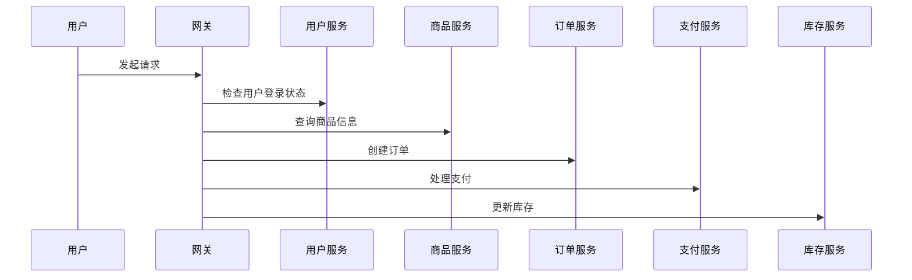
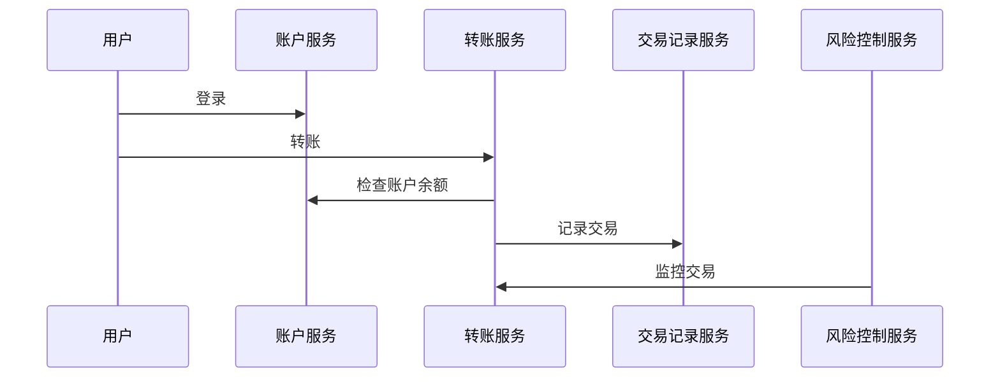

                 

### 背景介绍

#### 微服务架构的概念

微服务架构（Microservices Architecture）是一种设计软件应用程序的方法，它将应用程序作为一组小的、独立的、松耦合的服务组成，每个服务专注于完成特定的业务功能。这些服务通常通过HTTP/HTTPS协议进行通信，有时也通过消息队列等异步通信机制。

#### 微服务架构的出现与问题解决

微服务架构的概念起源于2011年，当时为了解决传统单体架构的不足而逐渐兴起。传统单体架构指的是将所有功能集中在一个单一的应用程序中，这种架构方式在早期软件开发中较为普遍，但随着业务规模和复杂度的增加，单体架构逐渐暴露出以下问题：

1. **技术栈限制**：单体应用通常使用单一的技术栈，这限制了技术的更新和演进速度。
2. **开发效率低**：一个庞大的单体应用需要多个团队协同工作，沟通成本高，开发效率低。
3. **维护困难**：单体应用中任何一个模块的变更都可能影响到整个系统的稳定性。
4. **部署与扩展困难**：单体应用需要整体部署，任何小的改动都需要重新部署整个系统。
5. **容错性差**：一旦某个模块发生故障，整个系统可能会受到影响。

为了解决这些问题，微服务架构提出了以下优势：

1. **技术多样性**：每个微服务可以独立选择合适的技术栈，从而提高技术更新和演进的速度。
2. **独立部署**：微服务可以独立部署，这意味着开发者可以针对不同的服务进行独立的开发和部署，降低了沟通成本，提高了开发效率。
3. **模块化**：每个微服务都是独立的，可以独立开发、测试、部署和扩展，这大大提高了系统的容错性和稳定性。
4. **弹性扩展**：可以根据业务需求独立扩展某个微服务，而不需要整体扩展。
5. **可持续交付**：微服务的独立部署使得持续集成和持续部署（CI/CD）变得更加容易。

#### 微服务架构的边界与外延

微服务架构的边界主要在于它的设计理念和实现方法。它不仅仅是一种技术选择，更是一种软件设计哲学。在微服务架构中，应用程序被划分为多个微服务，每个微服务独立运行在其自己的进程中，这些服务通过轻量级的通信机制（如HTTP/HTTPS、消息队列等）进行交互。

外延方面，微服务架构涉及到多个关键组件和概念，如服务拆分、服务治理、服务发现、服务网关等。这些组件共同构成了微服务架构的核心，支撑起整个系统的运作。

#### 概念结构与核心要素组成

微服务架构的核心要素包括：

1. **服务拆分**：将应用程序划分为多个独立的、可管理的服务。
2. **服务治理**：确保服务之间能够正确、高效地通信和协作。
3. **服务发现**：提供服务注册和发现机制，使得服务可以动态地被发现和调用。
4. **服务网关**：作为外部客户端和微服务之间的统一接口，负责路由、安全性、监控等功能。
5. **容器化与编排**：使用容器（如Docker）来部署和运行微服务，并通过编排工具（如Kubernetes）进行管理。

通过上述核心要素，微服务架构能够实现模块化、可扩展、高可用和易于维护的系统设计。

### 总结

微服务架构的出现，是为了解决传统单体架构在应对大规模、高复杂度业务场景时的不足。通过服务拆分、独立部署、技术多样性等设计理念，微服务架构能够提高开发效率、降低维护成本、增强系统的容错性和扩展性。了解微服务架构的概念、优点和应用场景，对于现代软件工程师来说至关重要。接下来，我们将进一步深入探讨微服务架构的核心概念与联系，帮助读者更好地理解这一架构模式。

---

**[关键词]**：微服务架构，服务拆分，独立部署，技术多样性，持续集成，持续部署

**[摘要]**：本文介绍了微服务架构的概念、起源和解决的问题。通过对比传统单体架构的不足，阐述了微服务架构的核心概念、设计原则、实现技术和运维实践，并提供了实际案例和最佳实践，帮助读者全面理解微服务架构的设计与实现。

---

## 核心概念与联系

在深入探讨微服务架构之前，我们需要了解其核心概念及其相互之间的关系。微服务架构的核心概念包括服务拆分、服务治理、服务发现、服务网关等。以下是对这些核心概念的解释及其关系的详细阐述。

### 服务拆分

**定义**：服务拆分是将一个庞大的单体应用程序拆分成多个独立的服务的过程。每个服务负责完成特定的业务功能，并与其他服务进行通信。

**目的**：服务拆分的目的是为了实现模块化、提高系统的可维护性和可扩展性。通过拆分，每个服务可以独立开发、测试和部署，从而降低了系统的复杂度和开发成本。

**示例**：假设我们有一个电商系统，可以将其拆分为订单服务、库存服务、用户服务、支付服务等。每个服务专注于处理特定的业务需求，如订单服务负责处理订单的创建、修改和查询等。

### 服务治理

**定义**：服务治理是指管理微服务之间的通信、依赖关系和整体系统的运行状态。

**目的**：服务治理的目的是确保微服务能够正确、高效地协作，保证系统的稳定性。通过服务治理，可以监控服务状态、进行故障转移、负载均衡等。

**示例**：在电商系统中，服务治理可能包括监控订单服务的响应时间、处理速度和失败率，并根据这些指标进行负载均衡和服务重启。

### 服务发现

**定义**：服务发现是指提供服务注册和发现机制，使得服务可以动态地被发现和调用。

**目的**：服务发现的目的是实现服务的动态扩展和容错。通过服务发现，新部署的服务能够自动注册并加入到系统中，已有的服务在发生故障时可以自动被替换。

**示例**：在Kubernetes集群中，每个微服务启动后都会注册到服务发现机制中，其他服务可以通过DNS或者API调用这些服务。

### 服务网关

**定义**：服务网关是外部客户端和微服务之间的统一接口，负责路由、安全性、监控等功能。

**目的**：服务网关的目的是简化客户端的调用逻辑，并提供集中化的安全策略和监控功能。

**示例**：在Spring Cloud Gateway中，服务网关负责将客户端的请求路由到相应的微服务，并实现跨域请求、请求头修改等高级功能。

### 关系与联系

这些核心概念之间存在着紧密的联系：

- **服务拆分** 是微服务架构的基础，它决定了系统的模块化和可维护性。
- **服务治理** 确保了微服务之间的正确协作，提供了监控和故障转移的能力。
- **服务发现** 使得服务可以动态地加入和退出系统，提高了系统的弹性。
- **服务网关** 提供了统一的服务访问入口，简化了客户端的调用逻辑。

通过这些核心概念和它们之间的相互作用，微服务架构能够实现模块化、高可用性和可扩展性的系统设计。

### ER实体关系图

为了更清晰地展示微服务架构中的核心概念及其关系，我们可以使用Mermaid语言绘制一个ER实体关系图。以下是该图的基本结构：

```mermaid
erDiagram
    ServiceA ||--o{ ServiceB : "uses"
    ServiceB ||--o{ ServiceC : "calls"
    ServiceC ||--o{ ServiceA : "depends"
    ServiceA ||--|{ ServiceMonitor : "monitored"
    ServiceB ||--|{ ServiceMonitor
    ServiceC ||--|{ ServiceMonitor
```

**图解**：

- **ServiceA**、**ServiceB** 和 **ServiceC** 分别代表不同的微服务。
- 每个服务都可以 **uses**（使用）、**calls**（调用）和 **depends**（依赖）其他服务。
- **ServiceMonitor** 是一个监控服务，负责监控所有服务的状态。

通过这个ER实体关系图，我们可以直观地了解微服务架构中的核心实体及其关系。

### 概念属性特征对比表格

为了更好地理解各个核心概念，我们可以制作一个概念属性特征对比表格，如下所示：

| 概念       | 定义                   | 属性特征                                                       | 对比与联系                     |
|------------|------------------------|------------------------------------------------------------|--------------------------------|
| 服务拆分   | 单体应用的拆分         | 独立开发、独立部署、降低耦合                                 | 基础概念，影响其他概念         |
| 服务治理   | 管理服务间通信与协作   | 服务状态监控、故障转移、负载均衡                             | 支持服务拆分，提高系统稳定性   |
| 服务发现   | 动态注册与发现服务     | 动态扩展、容错性、服务自动注册                             | 支持服务拆分，实现弹性架构     |
| 服务网关   | 统一服务访问入口       | 路由、安全性、监控                                           | 简化客户端调用，提高易用性     |

通过上述表格，我们可以更全面地理解每个概念的作用和相互关系。

### 总结

通过以上对微服务架构核心概念的解释、ER实体关系图的展示以及概念属性特征对比表格的制作，我们可以更清晰地了解微服务架构的设计理念及其各个组件之间的关系。接下来，我们将深入探讨微服务架构的设计原则和设计模式，进一步理解如何有效地实现微服务架构。

---

## 微服务架构设计

在设计微服务架构时，我们需要遵循一系列设计原则和模式，以确保系统的模块化、可维护性和高可用性。以下将详细介绍微服务设计原则、常见设计模式以及设计流程。

### 设计原则

#### 单一职责原则

单一职责原则（Single Responsibility Principle，SRP）是面向对象设计中的一个基本原理，它指出一个类或服务应该只负责一项功能。这一原则有助于降低系统的复杂性，提高可维护性。

**示例**：在电商系统中，订单服务应该只负责处理订单相关的功能，如创建、修改和取消订单，而不应涉及库存管理或用户管理。

#### 开放封闭原则

开放封闭原则（Open Closed Principle，OCP）指出，软件实体（如类、模块和函数）应该对扩展开放，但对修改关闭。这意味着在扩展功能时，不应修改原有代码，而是通过抽象和封装来实现。

**示例**：我们可以通过添加新的服务来扩展订单系统，而不需要修改现有的订单服务代码。

#### 里氏替换原则

里氏替换原则（Liskov Substitution Principle，LSP）指出，子类可以替换其基类而不会影响程序的行为。这一原则保证了代码的灵活性和可扩展性。

**示例**：在电商系统中，订单服务可以由子类实现，如不同类型的订单（如普通订单、VIP订单），这些子类应能够替换基类而不影响整体程序的功能。

#### 接口隔离原则

接口隔离原则（Interface Segregation Principle，ISP）指出，应该为客户端定义专门的接口，而不是一个大而全的接口。这有助于减少客户端依赖，提高系统的可维护性。

**示例**：在电商系统中，可以为不同的客户端（如Web客户端、移动客户端）定义不同的接口，而不是使用一个通用的接口。

### 设计模式

#### 单例模式

单例模式（Singleton Pattern）确保一个类只有一个实例，并提供一个全局访问点。单例模式常用于服务治理和监控服务，以确保系统中的关键组件只有一个实例运行。

**示例**：在一个微服务架构中，日志服务可以使用单例模式来确保日志记录的一致性和准确性。

#### 门面模式

门面模式（Facade Pattern）提供了一个统一的接口，用于访问子系统中的一组接口。门面模式适用于服务网关，简化客户端的调用逻辑。

**示例**：在电商系统中，服务网关可以作为门面，统一处理来自外部客户端的请求，并将请求路由到相应的微服务。

#### 代理模式

代理模式（Proxy Pattern）为其他对象提供一个代理，以控制对这个对象的访问。代理模式适用于服务治理和监控，可以实现请求的过滤、日志记录和权限验证。

**示例**：在微服务架构中，代理服务可以监控和过滤所有的服务请求，确保请求符合安全策略和业务规则。

#### 中介者模式

中介者模式（Mediator Pattern）定义了一个对象来封装一组对象之间的交互。中介者模式适用于服务之间的复杂通信，可以降低系统的耦合度。

**示例**：在电商系统中，中介者模式可以用于处理订单服务、库存服务之间的通信，确保两个服务能够协同工作。

### 设计流程

#### 需求分析

在开始设计微服务架构之前，首先需要对业务需求进行详细分析。这包括理解业务逻辑、用户需求、功能点等。

#### 服务拆分

根据需求分析的结果，将系统拆分成多个独立的服务。每个服务应专注于完成一项特定的业务功能，并与其他服务进行松耦合通信。

#### 服务接口设计

设计每个服务的接口，定义服务提供的功能以及数据格式。接口设计应遵循RESTful原则，确保接口的易用性和可扩展性。

#### 服务间通信

选择合适的服务间通信机制，如HTTP/HTTPS、消息队列等。在设计通信机制时，应考虑通信的可靠性、性能和安全性。

#### 服务治理

设计服务治理策略，包括服务监控、故障转移、负载均衡等。服务治理策略应确保系统的稳定性和高可用性。

#### 服务网关设计

设计服务网关，作为外部客户端和微服务之间的统一接口。服务网关应提供路由、安全性、监控等功能，简化客户端的调用逻辑。

#### 部署与运维

设计微服务的部署和运维策略，包括容器化、编排、监控和故障处理等。部署与运维策略应确保系统的稳定运行和快速响应。

通过上述设计流程，我们可以构建一个高效、稳定、可扩展的微服务架构。接下来，我们将详细探讨如何使用技术栈（如Spring Boot、Docker、Kubernetes等）来实现微服务。

---

## 微服务实现

在微服务架构设计完成之后，我们需要通过具体的技术栈来将其实现。本节将详细介绍如何使用Spring Boot、Docker和Kubernetes等工具来实现微服务。

### 技术栈选择

#### Spring Boot

Spring Boot 是一个基于 Spring 框架的开源框架，它简化了基于 Spring 的应用程序的创建和部署过程。Spring Boot 支持开发人员快速创建独立的、生产级的、基于 Spring 的应用。

**优势**：

- **快速开发**：Spring Boot 提供了大量的默认配置，可以减少配置工作，加快开发速度。
- **独立运行**：Spring Boot 应用可以独立运行，无需额外的集成测试和部署环境。
- **模块化**：Spring Boot 支持模块化开发，使得各个微服务可以独立开发、测试和部署。

#### Docker

Docker 是一个开源的应用容器引擎，它允许开发人员在几乎任何地方以一致的方式部署和运行应用程序。通过将应用程序及其依赖项打包在 Docker 容器中，可以确保环境的一致性和可移植性。

**优势**：

- **容器化**：Docker 提供了轻量级的容器化技术，使得应用程序可以在任何支持 Docker 的环境中运行。
- **部署简化**：通过 Docker，部署过程变得更加简单和自动化，减少了部署时间和错误。
- **可扩展性**：Docker 支持水平扩展，可以根据需求动态增加或减少服务实例。

#### Kubernetes

Kubernetes 是一个开源的容器编排平台，它用于自动化容器化应用程序的部署、扩展和管理。Kubernetes 提供了高度可扩展和可靠的基础设施，使得大规模部署和管理微服务变得更加容易。

**优势**：

- **自动化部署**：Kubernetes 可以自动化部署、扩展和管理应用程序，减少了人工干预。
- **负载均衡**：Kubernetes 提供内置的负载均衡器，可以有效地分配流量到不同的服务实例。
- **高可用性**：Kubernetes 支持故障检测和自动恢复，确保系统的高可用性。

### Spring Boot 实现微服务

#### 快速入门

1. **创建 Spring Boot 项目**：

使用 Spring Initializr（https://start.spring.io/）创建一个 Spring Boot 项目，选择需要的依赖，如 Spring Web、Spring Data JPA 等。

2. **编写服务代码**：

在项目中创建一个 REST 控制器，处理 HTTP 请求。例如，以下代码展示了如何创建一个简单的订单服务：

```java
@RestController
@RequestMapping("/orders")
public class OrderController {

    @Autowired
    private OrderService orderService;

    @PostMapping
    public ResponseEntity<Order> createOrder(@RequestBody Order order) {
        Order createdOrder = orderService.createOrder(order);
        return new ResponseEntity<>(createdOrder, HttpStatus.CREATED);
    }

    @GetMapping("/{id}")
    public ResponseEntity<Order> getOrder(@PathVariable Long id) {
        Order order = orderService.getOrder(id);
        return new ResponseEntity<>(order, HttpStatus.OK);
    }
}
```

3. **配置应用**：

在 `application.properties` 文件中配置数据库连接、端口等信息。

```properties
spring.datasource.url=jdbc:mysql://localhost:3306/ecommerce
spring.datasource.username=root
spring.datasource.password=root
spring.jpa.hibernate.ddl-auto=update
server.port=8080
```

4. **构建 Docker 镜像**：

使用 Maven 构建应用，并创建一个 Dockerfile，例如：

```dockerfile
FROM openjdk:8-jdk-alpine
ARG JAR_FILE=target/*.jar
COPY ${JAR_FILE} app.jar
ENTRYPOINT ["java","-Djava.security.egd=file:/dev/./urandom","-jar","/app.jar"]
```

执行以下命令构建 Docker 镜像：

```shell
docker build -t order-service .
```

5. **运行 Docker 容器**：

运行以下命令启动 Docker 容器：

```shell
docker run -d --name order-service-container -p 8080:8080 order-service
```

### Docker 实现微服务

#### 容器化应用

1. **Dockerfile**：

通过编写 Dockerfile 将应用程序及其依赖项打包到容器中。以下是一个简单的示例：

```dockerfile
FROM openjdk:8-jdk-alpine
ARG JAR_FILE=target/*.jar
COPY ${JAR_FILE} app.jar
ENTRYPOINT ["java","-Djava.security.egd=file:/dev/./urandom","-jar","/app.jar"]
```

2. **构建与运行**：

构建 Docker 镜像并运行容器：

```shell
docker build -t myapp .
docker run -d --name myapp-container myapp
```

### Kubernetes 实现微服务

#### Kubernetes 部署

1. **创建 Kubernetes 配置文件**：

创建 Kubernetes 配置文件，如 `deployment.yaml`，定义部署、服务等：

```yaml
apiVersion: apps/v1
kind: Deployment
metadata:
  name: order-service
spec:
  replicas: 3
  selector:
    matchLabels:
      app: order-service
  template:
    metadata:
      labels:
        app: order-service
    spec:
      containers:
      - name: order-service
        image: order-service:latest
        ports:
        - containerPort: 8080
---
apiVersion: v1
kind: Service
metadata:
  name: order-service
spec:
  selector:
    app: order-service
  ports:
    - protocol: TCP
      port: 80
      targetPort: 8080
  type: LoadBalancer
```

2. **部署到 Kubernetes 集群**：

使用 `kubectl` 工具部署配置文件：

```shell
kubectl apply -f deployment.yaml
```

通过上述步骤，我们可以使用 Spring Boot、Docker 和 Kubernetes 等工具实现微服务。接下来，我们将深入探讨微服务的部署、监控和运维。

---

## 微服务部署

微服务的部署是实现微服务架构的关键步骤，涉及到容器的构建、部署和运维。以下将详细探讨微服务在容器化环境下的部署过程，包括容器化部署、Kubernetes 部署以及持续集成与持续部署（CI/CD）。

### 容器化部署

容器化部署是将应用程序及其依赖项打包到容器中，并在容器化平台上（如 Docker）运行的过程。以下是容器化部署的基本步骤：

#### 1. 构建 Docker 镜像

通过编写 Dockerfile，将应用程序及其依赖项打包到 Docker 镜像中。以下是一个简单的 Dockerfile 示例：

```dockerfile
FROM openjdk:8-jdk-alpine
ARG JAR_FILE=target/*.jar
COPY ${JAR_FILE} app.jar
ENTRYPOINT ["java","-Djava.security.egd=file:/dev/./urandom","-jar","/app.jar"]
```

执行以下命令构建 Docker 镜像：

```shell
docker build -t myapp .
```

#### 2. 运行 Docker 容器

构建完 Docker 镜像后，可以通过以下命令运行 Docker 容器：

```shell
docker run -d --name myapp-container -p 8080:8080 myapp
```

#### 3. 管理容器

使用 Docker Compose 可以轻松管理多容器应用程序。以下是一个简单的 Docker Compose 文件示例：

```yaml
version: '3'
services:
  web:
    image: myapp
    ports:
      - "8080:8080"
```

执行以下命令启动 Docker Compose 服务：

```shell
docker-compose up -d
```

### Kubernetes 部署

Kubernetes 提供了强大的容器编排功能，可以自动化部署、扩展和管理微服务。以下是 Kubernetes 部署的基本步骤：

#### 1. 创建 Kubernetes 配置文件

创建 Kubernetes 配置文件，如 `deployment.yaml`，定义部署、服务等：

```yaml
apiVersion: apps/v1
kind: Deployment
metadata:
  name: order-service
spec:
  replicas: 3
  selector:
    matchLabels:
      app: order-service
  template:
    metadata:
      labels:
        app: order-service
    spec:
      containers:
      - name: order-service
        image: order-service:latest
        ports:
        - containerPort: 8080
---
apiVersion: v1
kind: Service
metadata:
  name: order-service
spec:
  selector:
    app: order-service
  ports:
    - protocol: TCP
      port: 80
      targetPort: 8080
  type: LoadBalancer
```

#### 2. 部署到 Kubernetes 集群

使用 `kubectl` 工具部署配置文件：

```shell
kubectl apply -f deployment.yaml
```

#### 3. 管理 Kubernetes 对象

使用 `kubectl` 命令管理 Kubernetes 集群中的对象，如部署、服务、状态检查等：

```shell
kubectl get deployments
kubectl get services
kubectl logs <pod-name>
```

### 持续集成与持续部署（CI/CD）

持续集成与持续部署（CI/CD）是现代软件开发中不可或缺的一部分，可以自动化构建、测试和部署流程，提高开发效率和软件质量。以下是一个简单的 CI/CD 工作流：

#### 1. 构建应用程序

在 CI/CD 系统中（如 Jenkins、GitLab CI/CD、GitHub Actions），配置构建脚本，使用 Maven 或 Gradle 构建应用程序并生成 Docker 镜像：

```shell
mvn clean package
docker build -t myapp:latest .
```

#### 2. 自动化测试

运行自动化测试，确保构建的应用程序满足质量要求。可以使用 JUnit、Selenium 等工具执行测试：

```shell
mvn test
```

#### 3. 部署到生产环境

通过 CI/CD 系统将构建好的 Docker 镜像部署到 Kubernetes 集群或容器化平台上。以下是一个简单的 CI/CD 配置示例：

```yaml
stages:
  - build
  - test
  - deploy

build:
  stage: build
  script:
    - mvn clean package
    - docker build -t myapp:latest .

test:
  stage: test
  script:
    - mvn test

deploy:
  stage: deploy
  script:
    - kubectl apply -f deployment.yaml
```

通过上述步骤，我们可以实现微服务的自动化部署，提高开发效率和系统稳定性。接下来，我们将探讨微服务的监控与运维，确保系统的可靠性和高效运行。

---

## 微服务监控与运维

微服务的监控与运维是确保系统稳定性和高效运行的关键环节。以下将详细探讨如何监控微服务、处理故障以及进行持续优化。

### 监控微服务

#### 1. 基于Prometheus的监控

Prometheus 是一个开源的监控解决方案，适用于微服务架构。以下是使用 Prometheus 监控微服务的基本步骤：

1. **安装 Prometheus**：

在 Kubernetes 集群中部署 Prometheus 服务器和客户端，使用 Prometheus Operator 可以简化部署过程。

```shell
helm install prometheus prometheus-community/prometheus
```

2. **配置服务发现**：

配置 Prometheus 服务发现规则，以自动发现 Kubernetes 中的微服务。

```yaml
# prometheus.yml
global:
  scrape_interval: 15s
scrape_configs:
  - job_name: 'kubernetes-objects'
    kubernetes_sd_configs:
      - role: service
    metric_renames:
      request_duration: http_request_duration_seconds
```

3. **可视化数据**：

使用 Grafana 可视化 Prometheus 收集的监控数据。

```shell
helm install grafana grafana/grafana
```

#### 2. 基于Spring Boot Actuator的监控

Spring Boot Actuator 提供了一系列端点，用于监控应用程序的健康状态、性能指标等。以下是启用和配置 Spring Boot Actuator 的步骤：

1. **启用端点**：

在 `application.properties` 中启用端点：

```properties
management.endpoints.web.exposure.include=*
```

2. **配置安全**：

配置身份验证和授权，确保只有授权用户可以访问端点。

```properties
management.security.enabled=true
management.endpoint.health.enabled=true
management.endpoint.info.enabled=true
management.endpoint.metrics.enabled=true
```

### 处理故障

#### 1. 基于Kubernetes的故障处理

Kubernetes 提供了丰富的故障处理机制，包括自动重启容器、扩缩容等。

1. **自动重启容器**：

在 Kubernetes 配置中设置 `livenessProbe` 和 `readinessProbe`，以自动检测和重启失败的容器。

```yaml
livenessProbe:
  httpGet:
    path: /actuator/health/liveness
    port: 8080
readinessProbe:
  httpGet:
    path: /actuator/health/readiness
    port: 8080
```

2. **扩缩容**：

根据负载自动扩缩容服务实例。

```shell
kubectl scale deployment order-service --replicas=3
```

#### 2. 基于服务网格的故障处理

服务网格（如 Istio）提供了细粒度的故障处理能力，包括故障注入、断路器模式等。

1. **故障注入**：

使用 Istio 的故障注入功能模拟故障，测试系统的响应能力。

```shell
istioctl experimental inject --destination=order-service --故障类型=延迟
```

2. **断路器模式**：

配置断路器模式，防止服务雪崩。

```yaml
trafficPolicy:
  faultInjectionPolicy:
    delay:
      percentage: 10
      fixedDelay: 100ms
```

### 持续优化

#### 1. 性能优化

1. **数据库优化**：

使用数据库索引、分库分表等技术优化数据库性能。

2. **缓存策略**：

使用缓存（如 Redis、Memcached）减少数据库压力，提高响应速度。

3. **异步处理**：

使用消息队列（如 RabbitMQ、Kafka）进行异步处理，提高系统的吞吐量。

#### 2. 安全优化

1. **访问控制**：

使用 OAuth2、JWT 等安全机制保护服务端点。

2. **加密传输**：

使用 HTTPS 加密传输数据，确保数据传输的安全性。

3. **漏洞扫描**：

定期进行安全漏洞扫描，及时修补漏洞。

### 总结

通过有效的监控与运维策略，可以确保微服务架构的高可用性和稳定性。使用 Prometheus 进行监控、Kubernetes 进行故障处理以及服务网格进行细粒度优化，可以大幅提升系统的可靠性和性能。持续优化和改进监控系统、故障处理策略和安全措施，是确保微服务架构长期稳定运行的关键。

---

## 微服务架构实践

在实际项目中，微服务架构的应用具有显著的优势，但同时也面临着诸多挑战。以下将结合实际案例，探讨微服务架构的实践过程、遇到的问题以及解决方案。

### 案例一：电商系统微服务架构实践

#### 项目背景

某电商公司希望构建一个具有高可用性、可扩展性和易维护性的电商系统。系统需求包括商品管理、订单处理、用户管理、支付处理等。

#### 系统功能设计

根据业务需求，将系统划分为以下微服务：

1. **商品服务**：负责商品信息的管理和查询。
2. **订单服务**：负责订单的创建、修改和查询。
3. **用户服务**：负责用户信息的注册、登录和管理。
4. **支付服务**：负责处理支付相关的功能。
5. **库存服务**：负责库存的管理和更新。

#### 系统架构设计

采用 Spring Boot、Docker 和 Kubernetes 构建微服务架构。以下是系统的架构图：



#### 部署与运维

使用 Kubernetes 进行部署和运维。以下是 Kubernetes 部署脚本示例：

```yaml
# deployment.yaml
apiVersion: apps/v1
kind: Deployment
metadata:
  name: e-commerce
spec:
  replicas: 3
  selector:
    matchLabels:
      app: e-commerce
  template:
    metadata:
      labels:
        app: e-commerce
    spec:
      containers:
      - name: gateway
        image: gateway:latest
        ports:
        - containerPort: 8080
      - name: user-service
        image: user-service:latest
        ports:
        - containerPort: 8081
      - name: product-service
        image: product-service:latest
        ports:
        - containerPort: 8082
      - name: order-service
        image: order-service:latest
        ports:
        - containerPort: 8083
      - name: payment-service
        image: payment-service:latest
        ports:
        - containerPort: 8084
      - name: inventory-service
        image: inventory-service:latest
        ports:
        - containerPort: 8085
---
# service.yaml
apiVersion: v1
kind: Service
metadata:
  name: e-commerce
spec:
  selector:
    app: e-commerce
  ports:
    - name: http
      port: 80
      targetPort: 8080
  type: LoadBalancer
```

#### 遇到的问题与解决方案

1. **服务拆分困难**：

在项目初期，服务拆分不够细粒度，导致系统复杂度增加。通过逐步优化服务拆分策略，将大型服务拆分为更小的服务，提高了系统的可维护性和扩展性。

2. **数据一致性问题**：

在分布式系统中，数据一致性问题是一个挑战。通过使用消息队列（如 Kafka）实现最终一致性，并在服务间使用分布式锁来保证关键操作的一致性。

3. **监控与运维挑战**：

在微服务架构中，监控和运维变得复杂。采用 Prometheus 和 Grafana 进行监控，使用 Kubernetes 进行自动化运维，确保系统的稳定性和高效性。

### 案例二：金融系统微服务架构实践

#### 项目背景

某银行希望构建一个支持高并发、高可靠性的金融系统，包括账户管理、转账、交易记录等。

#### 系统功能设计

根据业务需求，将系统划分为以下微服务：

1. **账户服务**：负责账户信息的管理和查询。
2. **转账服务**：负责处理用户转账请求。
3. **交易记录服务**：负责记录交易信息。
4. **风险控制服务**：负责监控交易行为，防止欺诈。

#### 系统架构设计

采用 Spring Boot、Docker 和 Kubernetes 构建微服务架构。以下是系统的架构图：



#### 部署与运维

使用 Kubernetes 进行部署和运维。以下是 Kubernetes 部署脚本示例：

```yaml
# deployment.yaml
apiVersion: apps/v1
kind: Deployment
metadata:
  name: finance-system
spec:
  replicas: 3
  selector:
    matchLabels:
      app: finance-system
  template:
    metadata:
      labels:
        app: finance-system
    spec:
      containers:
      - name: account-service
        image: account-service:latest
        ports:
        - containerPort: 8081
      - name: transfer-service
        image: transfer-service:latest
        ports:
        - containerPort: 8082
      - name: transaction-service
        image: transaction-service:latest
        ports:
        - containerPort: 8083
      - name: risk-control-service
        image: risk-control-service:latest
        ports:
        - containerPort: 8084
---
# service.yaml
apiVersion: v1
kind: Service
metadata:
  name: finance-system
spec:
  selector:
    app: finance-system
  ports:
    - name: http
      port: 80
      targetPort: 8081
```

#### 遇到的问题与解决方案

1. **高并发性能问题**：

在高峰期，系统面临高并发请求挑战。通过优化数据库查询、使用缓存以及水平扩展微服务实例，提高了系统的并发处理能力。

2. **数据一致性保障**：

在分布式系统中，数据一致性是关键问题。采用分布式事务框架（如 Seata），确保转账和交易记录的一致性。

3. **安全性问题**：

金融系统安全性至关重要。通过使用安全协议（如 TLS）、身份验证和授权机制，确保系统的安全性。

### 总结

微服务架构在电商和金融系统中的应用，展示了其高可用性、可扩展性和易维护性的优势。通过合理的拆分、部署和运维策略，可以解决服务拆分、数据一致性和性能优化等挑战。在实际项目中，持续优化和改进微服务架构，是确保系统稳定运行的关键。

---

## 最佳实践与技巧

在微服务架构的实践过程中，积累了一些最佳实践和技巧，可以帮助开发者更好地设计、实现和运维微服务。

### 服务拆分最佳实践

1. **根据业务功能拆分**：将系统按照业务功能进行拆分，每个微服务负责一个明确的业务领域。
2. **避免过度拆分**：避免将功能过于简单的模块拆分成微服务，导致系统复杂性增加。
3. **保持微服务的独立性**：确保每个微服务具有独立的功能和完整的业务逻辑，避免服务间过于紧密的依赖。
4. **考虑数据一致性**：在服务拆分时，要考虑数据一致性的需求，避免分布式系统中数据不一致的问题。

### 性能优化技巧

1. **使用缓存**：在微服务架构中，使用缓存（如 Redis、Memcached）可以显著减少数据库查询次数，提高系统性能。
2. **异步处理**：使用消息队列（如 Kafka、RabbitMQ）进行异步处理，可以降低系统负载，提高响应速度。
3. **数据库优化**：对数据库进行索引优化、分库分表、读写分离等操作，提高数据库性能。
4. **服务水平扩展**：根据业务需求，通过水平扩展微服务实例，提高系统的并发处理能力。

### 安全性考虑

1. **加密传输**：使用 HTTPS 加密传输数据，确保数据传输的安全性。
2. **访问控制**：使用 OAuth2、JWT 等安全协议进行访问控制，确保只有授权用户可以访问服务。
3. **安全漏洞扫描**：定期进行安全漏洞扫描，及时发现和修补安全漏洞。
4. **日志审计**：记录系统操作日志，以便在发生安全事件时进行审计和追踪。

### 持续集成与持续部署（CI/CD）

1. **自动化测试**：在 CI/CD 流程中，自动运行单元测试、集成测试等，确保代码质量。
2. **容器镜像管理**：使用容器镜像仓库（如 Docker Hub、Harbor），管理容器的构建和发布。
3. **环境一致性**：确保开发、测试和生产环境的一致性，避免环境差异导致的问题。
4. **自动化部署**：使用自动化工具（如 Jenkins、GitLab CI/CD），实现代码到生产环境的自动化部署。

### 监控与运维

1. **集中化监控**：使用 Prometheus、Grafana 等工具，实现集中化监控，实时掌握系统状态。
2. **故障自愈**：使用 Kubernetes、服务网格等工具，实现故障自愈，提高系统可用性。
3. **运维自动化**：使用 Ansible、Terraform 等工具，实现运维自动化，降低运维成本。

通过遵循上述最佳实践和技巧，可以有效地提高微服务架构的设计质量、实现效率和运维水平。

---

## 小结

微服务架构作为一种应对复杂、多变业务需求的有效方式，以其模块化、高可用性和可扩展性在软件行业得到了广泛应用。本文从背景介绍、核心概念与联系、设计原则与模式、实现技术、部署与运维，到实际案例和最佳实践，系统地阐述了微服务架构的设计与实现。

首先，微服务架构起源于对传统单体架构的不足的反思，通过服务拆分、独立部署、技术多样性等优势，解决了开发效率低、维护困难、部署与扩展困难等问题。随后，我们详细探讨了服务拆分、服务治理、服务发现、服务网关等核心概念，并通过 ER 实体关系图和概念属性特征对比表格加深了理解。

在设计微服务时，我们遵循单一职责原则、开放封闭原则、里氏替换原则和接口隔离原则，确保系统的高内聚和低耦合。同时，使用单例模式、门面模式、代理模式和中介者模式等设计模式，提高了系统的灵活性和可扩展性。在实现微服务时，通过 Spring Boot、Docker、Kubernetes 等技术栈，实现了高效的开发、部署和运维。

微服务的部署与运维是确保系统稳定性的关键，通过容器化部署、Kubernetes 部署和 CI/CD 流程，可以自动化地管理和监控微服务。在监控与运维方面，使用 Prometheus 和 Grafana 等工具，实现了集中化监控和故障自愈。最后，通过电商系统和金融系统的实际案例，展示了微服务架构的应用和实践。

尽管微服务架构具有众多优势，但同时也面临着服务拆分、数据一致性和安全性等挑战。通过最佳实践和技巧，如服务拆分最佳实践、性能优化技巧、安全性考虑和持续集成与持续部署，可以有效地解决这些问题。

展望未来，微服务架构将继续向云原生、自动化和智能化方向发展。云原生技术如 Kubernetes 和服务网格将进一步简化微服务的部署和管理。自动化和智能化运维工具将提高系统的自我修复能力和效率。同时，随着区块链、人工智能等新技术的融入，微服务架构将焕发新的生命力，助力企业实现数字化转型。

---

## 未来发展趋势展望

随着技术的不断进步，微服务架构正迎来新的发展趋势。以下是几个值得关注的未来趋势：

### 云原生微服务

云原生（Cloud Native）是一种设计原则，它利用云计算的优势，使应用程序具有更好的可扩展性、弹性和容错性。未来，云原生微服务将成为主流。Kubernetes 和服务网格（如 Istio）等技术将继续发展，提供更加完善的容器编排和微服务治理能力。云原生微服务将更易于部署、管理和扩展，特别是在多云和混合云环境中。

### 自动化与智能化运维

自动化和智能化运维（AIOps）是未来微服务运维的重要方向。通过利用大数据分析和人工智能技术，运维团队能够更快速地识别问题、预测故障，并自动执行修复措施。自动化运维工具（如 Ansible、Terraform）将更加智能化，实现更加高效和可靠的运维流程。此外，智能监控和告警系统将基于机器学习算法，提供更加精准和及时的监控数据。

### 服务网格的普及

服务网格（Service Mesh）提供了一种独立的通信层，用于管理和监控微服务之间的通信。随着微服务架构的普及，服务网格的重要性将逐渐凸显。服务网格将更加成熟和普及，支持更多的协议和功能，如安全、流量管理和监控等。服务网格与容器编排系统的集成也将更加紧密，为开发者提供更好的微服务支持。

### 新技术的融合

随着区块链、人工智能（AI）、物联网（IoT）等新兴技术的发展，微服务架构将迎来新的融合和应用场景。区块链技术可以提供去中心化的信任机制，用于确保分布式系统的数据一致性和安全性。人工智能技术可以用于智能决策和自动化操作，提升系统的智能化水平。物联网技术可以连接海量设备，构建更加智能和互联的微服务架构。

### 开放源码社区的贡献

开放源码社区将继续在微服务架构的发展中发挥关键作用。开发者将贡献更多的创新技术和解决方案，推动微服务架构的持续进步。开源项目的繁荣也将促进微服务的标准化，降低开发者和运维者的学习成本。

### 安全性和隐私保护

随着微服务架构的广泛应用，安全性和隐私保护将变得尤为重要。未来，我们将看到更多针对微服务安全性的解决方案，如加密通信、访问控制、安全审计等。同时，随着 GDPR（通用数据保护条例）等法规的实施，开发者需要更加重视用户隐私保护，确保微服务架构在合规的基础上运行。

### 总结

未来，微服务架构将继续演进，以适应更加复杂和多样化的业务需求。云原生、自动化运维、服务网格、新技术融合、开源社区贡献以及安全性和隐私保护将是微服务架构发展的关键趋势。开发者和技术管理者需要紧跟这些趋势，不断学习和实践，以充分利用微服务架构的优势，推动企业的数字化转型。

---

### 作者信息

作者：AI天才研究院/AI Genius Institute & 禅与计算机程序设计艺术 /Zen And The Art of Computer Programming

AI天才研究院致力于推动人工智能技术的研究与应用，通过创新的理论和实践，为行业带来深刻的变革。本书作者以其深厚的计算机科学背景和丰富的研究经验，为读者呈现了微服务架构的全面解读和深入剖析。同时，作者在计算机程序设计领域的专著《禅与计算机程序设计艺术》，以其独特的哲学视角和精湛的编程技巧，启发了一代又一代程序员，成为计算机编程领域的经典之作。通过本书，作者希望继续传承其智慧，助力读者在微服务架构的道路上取得突破。

