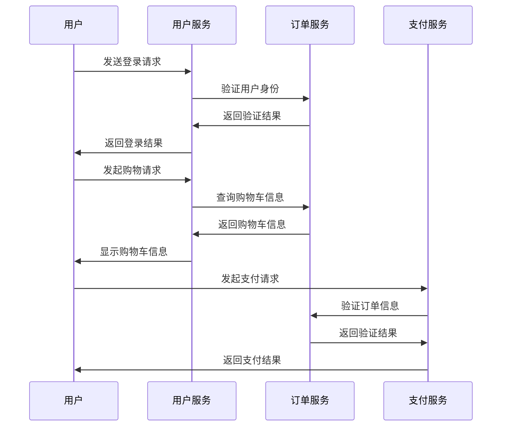
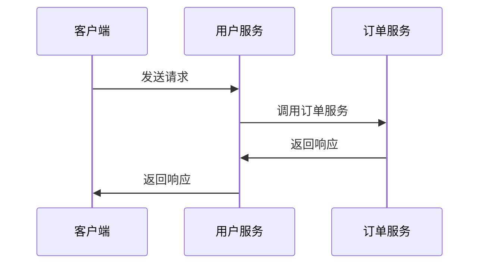
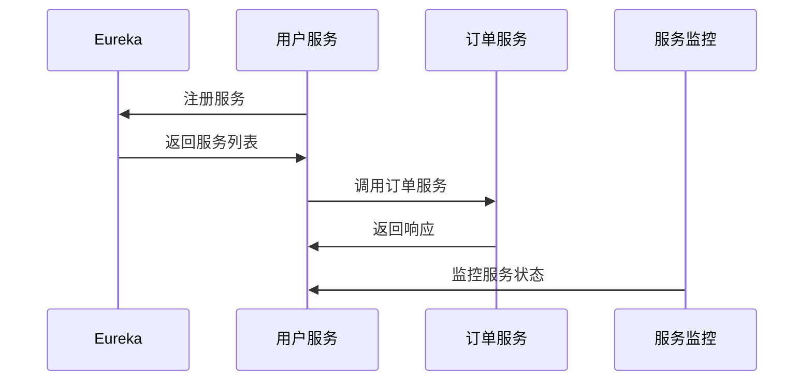
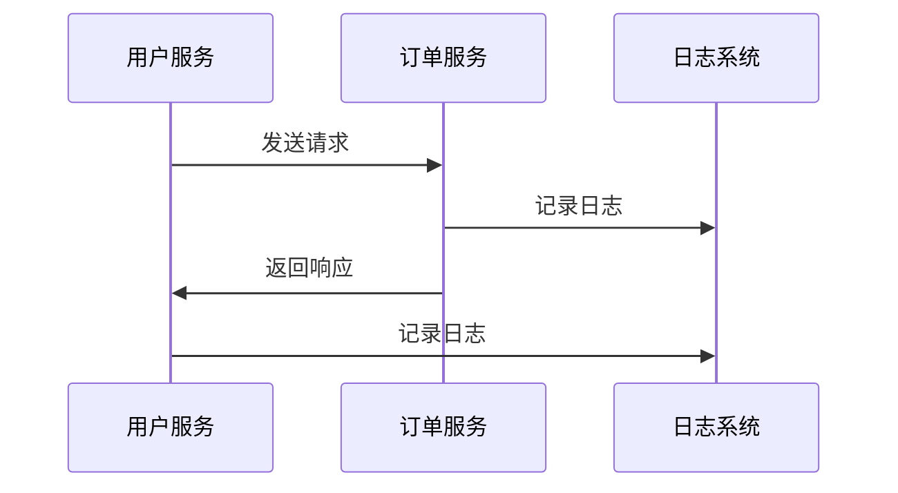
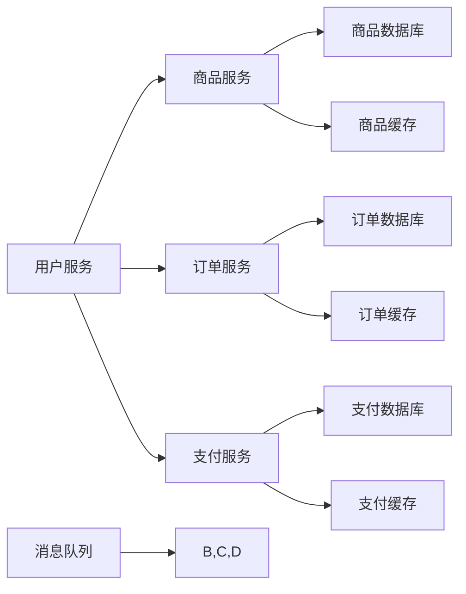
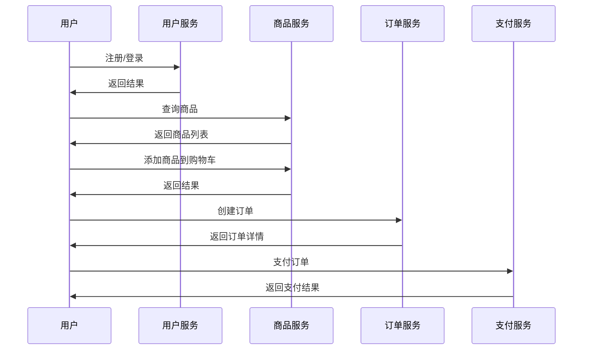
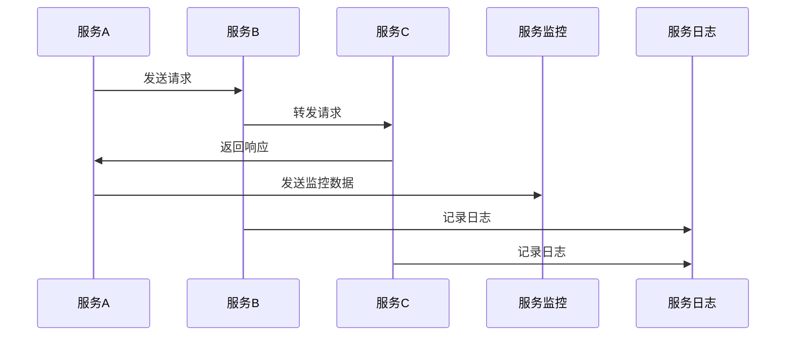
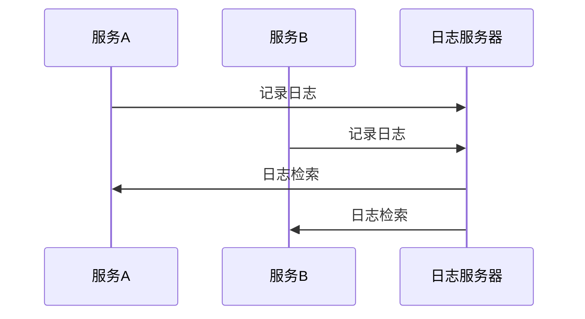

                 

### 第1章: 微服务架构概述

**背景介绍**

微服务架构是近年来在软件工程领域崭露头角的一种设计理念。其核心思想是将大型、复杂的单体应用程序分解为多个独立的小型服务，每个服务都专注于完成特定的业务功能。这种架构风格的出现，主要是为了应对传统单体架构在扩展性、灵活性和容错性方面的不足。

微服务架构最早可以追溯到20世纪90年代末到21世纪初。当时，一些互联网公司，如Netflix、亚马逊和摩根士丹利等，在处理大规模分布式系统时，发现传统的单体架构难以满足业务快速发展的需求。单体架构通常将所有的业务逻辑、数据库、服务和前端代码打包在一起，形成一个庞大的应用程序。这种模式虽然在一开始可以简化开发流程，但随着业务的发展，系统变得越来越复杂，扩展性和维护成本也急剧增加。

为了解决这些问题，这些公司开始探索将应用程序分解为多个独立的小型服务，每个服务都负责特定的业务功能，如用户管理、订单处理、库存管理等。这些服务通过轻量级的通信机制（如HTTP/REST或消息队列）进行交互，从而形成了微服务架构。

**核心概念**

在微服务架构中，有几个核心概念需要理解：

1. **服务自治**：每个服务都是独立的，可以独立部署、扩展和升级。这意味着一个服务的故障不会影响到其他服务的运行。

2. **去中心化**：在微服务架构中，没有中央控制单元来管理所有的服务。每个服务都可以独立运行，并自行处理自己的请求。

3. **小粒度**：微服务通常非常小，专注于实现单一的业务功能。这种小粒度使得开发、测试和部署都更加简单。

4. **分布式通信**：微服务之间通常通过轻量级的通信机制进行交互，如HTTP/REST或消息队列。这种分布式通信模式使得系统可以更好地处理高并发和大规模请求。

**问题与挑战**

尽管微服务架构带来了很多优势，但它也带来了一些问题和挑战：

1. **分布式复杂性**：微服务架构增加了系统的复杂性，如服务之间的通信、状态管理、分布式事务等。

2. **数据一致性**：在分布式系统中，确保数据的一致性是一个挑战。传统的单点数据库已经不再适用，需要采用新的数据管理策略。

3. **服务发现与注册**：在分布式系统中，如何快速发现和注册服务是一个问题。这通常需要借助服务发现和注册中心来实现。

**边界与外延**

微服务架构并不是适用于所有情况的。它更适合于那些需要高度可扩展性、灵活性和容错性的大型分布式系统。对于一些小型项目或单体架构，微服务架构可能会带来不必要的复杂度。

此外，微服务架构并不是一成不变的。随着技术的发展，微服务的实现方式也在不断演进。例如，从传统的进程式服务到基于容器化技术的无状态服务，再到现在的服务网格（Service Mesh），微服务架构的实现方式在不断演进。

**概念结构与核心要素组成**

微服务架构的核心结构包括：

1. **服务**：每个服务都是独立的，负责特定的业务功能。

2. **服务注册与发现**：服务注册与发现机制用于管理服务的生命周期，包括启动、停止和更新。

3. **服务通信**：服务之间通过轻量级的通信机制进行交互。

4. **服务监控**：对服务的运行状态进行监控，确保服务的稳定性。

5. **数据管理**：在分布式系统中，数据管理策略非常重要，需要确保数据的一致性和可靠性。

**联系**

微服务架构与面向服务架构（SOA）有一定的相似之处，但它们也有显著的区别。SOA更侧重于服务的设计和集成，而微服务架构更侧重于服务的实现和部署。微服务架构是SOA的一种实现方式，但并不等同于SOA。

**总结**

微服务架构是一种现代化的软件架构风格，它通过将大型、复杂的单体应用程序分解为多个独立的小型服务，从而提高了系统的扩展性、灵活性和容错性。尽管它带来了一些挑战，但许多大型互联网公司已经在实际项目中取得了成功，证明了微服务架构的巨大潜力。

接下来，我们将进一步探讨微服务架构的设计原则和实现细节，帮助读者更好地理解这一现代化的架构风格。### 第1.1节：微服务的起源

**核心概念原理**

微服务架构的起源可以追溯到20世纪90年代末到21世纪初。当时，一些大型互联网公司，如Netflix、亚马逊和摩根士丹利，开始面临单体架构带来的扩展性和维护性问题。这些公司在处理大规模分布式系统时，发现单体架构在应对高并发、大量请求和快速变化的需求时，显得力不从心。

Netflix是一家流媒体巨头，它的业务依赖于高并发的数据处理能力。在2011年，Netflix决定将单体架构转换为微服务架构。他们首先将不同的业务功能拆分成独立的服务，如用户管理、视频播放、推荐系统等。每个服务都可以独立部署、扩展和升级，从而大大提高了系统的灵活性和可扩展性。Netflix的成功转型，为微服务架构的发展奠定了基础。

亚马逊也是微服务架构的先驱之一。他们的电商业务同样面临着单体架构的瓶颈。通过将业务拆分成多个独立的服务，亚马逊可以更灵活地应对业务变化，同时提高了系统的可靠性和性能。

摩根士丹利则在2013年开始采用微服务架构，以应对金融交易业务的复杂性。他们通过微服务架构，将复杂的交易系统分解为多个独立的服务，从而提高了系统的可维护性和扩展性。

**属性特征对比表格**

| 特征         | 微服务架构           | 单体架构               |
| ------------ | -------------------- | --------------------- |
| 服务自治     | 高                   | 低                    |
| 去中心化     | 高                   | 低                    |
| 小粒度       | 高                   | 低                    |
| 分布式通信   | 高                   | 低                    |
| 扩展性       | 高                   | 低                    |
| 可维护性     | 高                   | 低                    |
| 容错性       | 高                   | 低                    |

**ER实体关系图架构**

为了更好地理解微服务架构的实体关系，我们可以使用Mermaid流程图来展示其核心组件。

```mermaid
erDiagram
  Service1 -->|调用| Service2 : 服务间通信
  Service1 -->|依赖| Database1 : 数据存储
  Service2 -->|依赖| Database2 : 数据存储
```

在上图中，`Service1`和`Service2`是两个独立的服务，它们通过轻量级的通信机制进行交互。每个服务都有自己的数据存储，从而确保数据的一致性和独立性。

**总结**

微服务架构起源于20世纪90年代末到21世纪初，是为了应对传统单体架构在扩展性、灵活性和容错性方面的不足。Netflix、亚马逊和摩根士丹利等公司的成功转型，证明了微服务架构的巨大潜力。通过将大型、复杂的单体应用程序分解为多个独立的小型服务，微服务架构提高了系统的可维护性、可扩展性和容错性。在下一节中，我们将进一步探讨微服务的优势和挑战。### 第1.2节：微服务的优势与挑战

**核心概念原理**

微服务架构的优点主要体现在以下几个方面：

1. **高可扩展性**：微服务架构允许单个服务独立扩展，这意味着可以根据业务需求灵活调整资源分配，从而提高系统的整体性能。
2. **高灵活性**：微服务架构支持不同的服务团队独立开发、测试和部署，这大大提高了开发效率和团队协作能力。
3. **高容错性**：由于服务之间相互独立，单个服务的故障不会影响整个系统的运行，系统可以在不影响用户的情况下快速恢复。
4. **易于集成**：微服务架构支持异构系统之间的集成，可以轻松与第三方服务或新业务功能进行集成。

然而，微服务架构也带来了一些挑战：

1. **复杂度增加**：随着服务数量的增加，系统的复杂度也随之增加。服务之间的依赖关系、通信和协调变得更加复杂，这增加了系统的维护难度。
2. **分布式事务管理**：在微服务架构中，传统的事务机制难以实现，需要采用新的分布式事务解决方案。
3. **数据一致性**：在分布式系统中，确保数据的一致性是一个挑战，需要采用新的数据管理策略。

**属性特征对比表格**

| 特征         | 微服务架构           | 单体架构               |
| ------------ | -------------------- | --------------------- |
| 服务自治     | 高                   | 低                    |
| 去中心化     | 高                   | 低                    |
| 小粒度       | 高                   | 低                    |
| 分布式通信   | 高                   | 低                    |
| 扩展性       | 高                   | 低                    |
| 可维护性     | 高                   | 低                    |
| 容错性       | 高                   | 低                    |
| 通信复杂度   | 高                   | 低                    |
| 事务管理     | 复杂                | 简单                  |
| 数据一致性   | 难                 | 容易                  |

**ER实体关系图架构**

为了更好地理解微服务架构中的实体关系，我们可以使用Mermaid流程图来展示其核心组件。

```mermaid
erDiagram
  Service1 -->|调用| Service2 : 服务间通信
  Service1 -->|依赖| Database1 : 数据存储
  Service2 -->|依赖| Database2 : 数据存储
```

在上图中，`Service1`和`Service2`是两个独立的服务，它们通过轻量级的通信机制进行交互。每个服务都有自己的数据存储，从而确保数据的一致性和独立性。

**总结**

微服务架构在提高系统的可扩展性、灵活性和容错性方面具有显著优势。然而，它也带来了更高的复杂度、分布式事务管理和数据一致性的挑战。在下一节中，我们将深入探讨微服务的核心概念，帮助读者更好地理解这一架构风格。### 第1.3节：微服务的核心概念

**核心概念原理**

微服务架构的核心概念包括服务自治、去中心化、小粒度、分布式通信和容器化。

1. **服务自治**：每个微服务都是独立的，可以独立部署、扩展和升级。这意味着一个服务的故障不会影响到其他服务的运行。服务自治是微服务架构的重要特征，它提高了系统的可靠性和可维护性。
2. **去中心化**：微服务架构没有中央控制单元来管理所有的服务。每个服务都可以独立运行，并自行处理自己的请求。去中心化使得系统更加灵活，能够快速响应用户需求。
3. **小粒度**：微服务通常非常小，专注于实现单一的业务功能。这种小粒度使得开发、测试和部署都更加简单。小粒度有助于提高系统的可扩展性和可维护性。
4. **分布式通信**：微服务之间通过轻量级的通信机制进行交互，如HTTP/REST或消息队列。分布式通信使得服务可以分布在不同的服务器上，提高了系统的性能和可扩展性。
5. **容器化**：微服务通常运行在容器中，如Docker。容器化提供了轻量级、可移植的运行环境，使得服务可以快速部署和扩展。

**属性特征对比表格**

| 特征         | 微服务架构           | 单体架构               |
| ------------ | -------------------- | --------------------- |
| 服务自治     | 高                   | 低                    |
| 去中心化     | 高                   | 低                    |
| 小粒度       | 高                   | 低                    |
| 分布式通信   | 高                   | 低                    |
| 扩展性       | 高                   | 低                    |
| 可维护性     | 高                   | 低                    |
| 容错性       | 高                   | 低                    |
| 通信复杂度   | 高                   | 低                    |
| 事务管理     | 复杂                | 简单                  |
| 数据一致性   | 难                 | 容易                  |

**ER实体关系图架构**

为了更好地理解微服务架构中的实体关系，我们可以使用Mermaid流程图来展示其核心组件。

```mermaid
erDiagram
  Service1 -->|调用| Service2 : 服务间通信
  Service1 -->|依赖| Database1 : 数据存储
  Service2 -->|依赖| Database2 : 数据存储
```

在上图中，`Service1`和`Service2`是两个独立的服务，它们通过轻量级的通信机制进行交互。每个服务都有自己的数据存储，从而确保数据的一致性和独立性。

**总结**

微服务的核心概念包括服务自治、去中心化、小粒度、分布式通信和容器化。这些概念共同构成了微服务架构的基本特征，使得系统能够实现高可扩展性、高灵活性和高容错性。在下一节中，我们将探讨微服务架构与SOA的关系，帮助读者更好地理解微服务架构的起源和发展。### 第1.4节：微服务与SOA的关系

**核心概念原理**

微服务架构与面向服务架构（Service-Oriented Architecture，SOA）有相似之处，但它们也有显著的区别。

**相似之处：**

1. **服务导向**：微服务架构和SOA都强调服务的重要性，将应用程序分解为多个独立的服务，每个服务都实现特定的功能。
2. **松耦合**：两者都追求服务之间的松耦合，使得服务可以独立开发、测试和部署，提高了系统的灵活性和可维护性。
3. **标准化**：微服务架构和SOA都强调使用标准化的通信协议和数据格式，如SOAP、REST等，使得服务可以轻松集成。

**区别：**

1. **粒度**：微服务架构通常采用更细粒度的服务，每个服务专注于实现单一的业务功能。而SOA的服务粒度通常较粗，可能包括多个业务功能。
2. **自治性**：微服务架构强调服务自治，每个服务都可以独立部署、扩展和升级。而SOA的服务通常依赖于中央控制单元，缺乏完全的自治性。
3. **架构风格**：微服务架构是一种现代的、基于容器和微服务框架的架构风格，而SOA更侧重于服务的设计和集成。
4. **通信机制**：微服务架构通常采用轻量级的通信机制，如HTTP/REST或消息队列，而SOA可能采用更复杂的通信协议，如SOAP。

**ER实体关系图架构**

为了更好地理解微服务与SOA的关系，我们可以使用Mermaid流程图来展示它们的核心组件。

```mermaid
erDiagram
  SOA_Service -->|集成| Micro_Service : 服务集成
  SOA_Service -->|依赖| Central_Service_Manager : 中央控制
  Micro_Service -->|依赖| Container : 容器化部署
```

在上图中，`SOA_Service`代表SOA架构中的服务，`Micro_Service`代表微服务架构中的服务。`SOA_Service`通过中央控制单元`Central_Service_Manager`进行管理，而`Micro_Service`通过容器进行部署。

**总结**

微服务架构与SOA都是服务导向的架构风格，但它们在服务粒度、自治性、架构风格和通信机制等方面存在显著差异。微服务架构是一种现代化的、基于容器和微服务框架的架构风格，它更强调服务的自治性和小粒度。在下一节中，我们将深入探讨微服务架构的设计原则，帮助读者更好地理解如何设计和实现微服务架构。### 第2章：微服务设计原则

**核心概念原理**

微服务设计原则是一套指导思想和最佳实践，用于确保微服务架构的可扩展性、灵活性和可维护性。这些原则包括但不限于单一职责原则、边界划分原则、无状态原则和自治原则。

1. **单一职责原则**：每个微服务应专注于实现单一的业务功能，这有助于提高系统的可维护性和可扩展性。单一职责原则要求服务职责明确，避免服务功能过多，导致复杂性增加。
   
2. **边界划分原则**：微服务之间应存在清晰的边界，这有助于降低服务之间的耦合度，提高系统的可扩展性和可维护性。边界可以通过API定义、服务间协议或数据隔离来实现。

3. **无状态原则**：微服务应尽量避免存储状态信息，这有助于提高服务的可扩展性和容错性。无状态服务可以独立部署和扩展，且在服务重启或故障时，可以快速恢复。

4. **自治原则**：每个微服务应具有独立的部署、扩展和升级能力，这有助于提高系统的灵活性和可维护性。自治原则要求服务之间尽可能解耦，以便独立管理和维护。

**属性特征对比表格**

| 特征         | 单一职责原则 | 边界划分原则 | 无状态原则 | 自治原则 |
| ------------ | ------------ | ------------ | ---------- | -------- |
| 目的         | 提高可维护性 | 提高可扩展性 | 提高容错性 | 提高灵活性 |
| 实践         | 服务职责明确 | 定义清晰边界 | 避免状态存储 | 独立管理   |
| 耦合度       | 低           | 低           | 低         | 低        |
| 可扩展性     | 高           | 高           | 高         | 高        |
| 可维护性     | 高           | 高           | 高         | 高        |

**ER实体关系图架构**

为了更好地理解微服务设计原则，我们可以使用Mermaid流程图来展示其核心组件。

```mermaid
erDiagram
  Service_A -->|实现单一功能| Business_A : 单一职责原则
  Service_A -->|划分边界| Service_API : 边界划分原则
  Service_A -->|无状态| Data_Store : 无状态原则
  Service_A -->|自治| Deployment_Mechanism : 自治原则
```

在上图中，`Service_A`代表一个微服务，它遵循单一职责原则，实现特定的业务功能。`Service_API`定义了服务间的边界，`Data_Store`表示无状态的数据存储，`Deployment_Mechanism`表示自治的部署机制。

**总结**

微服务设计原则是一套确保微服务架构可扩展性、灵活性和可维护性的最佳实践。单一职责原则、边界划分原则、无状态原则和自治原则共同构成了微服务设计的基本原则。在下一节中，我们将深入探讨如何进行服务拆分与聚合，帮助读者更好地理解微服务的架构设计。### 第2.1节：服务拆分与聚合

**核心概念原理**

服务拆分与聚合是微服务设计中的重要环节。服务拆分是将一个大型单体服务分解为多个小型服务，每个服务实现单一的业务功能；服务聚合则是将这些小型服务重新组合，形成更大的业务模块。

1. **服务拆分**：服务拆分的目的是降低系统的复杂性，提高可维护性和可扩展性。拆分方法包括：
   - **按业务功能拆分**：根据业务需求，将功能类似的业务逻辑拆分为独立的服务。
   - **按数据拆分**：根据数据访问模式，将依赖相同数据的服务拆分为独立的服务。
   - **按团队拆分**：根据团队分工，将负责不同模块的服务拆分为独立的服务。

2. **服务聚合**：服务聚合是将多个小型服务组合成更大的业务模块，以提高系统的整体性能和用户体验。聚合方法包括：
   - **按业务流程聚合**：根据业务流程，将相关的服务组合成一个业务模块。
   - **按用户界面聚合**：根据用户界面，将前端服务和后端服务组合成一个业务模块。
   - **按性能优化聚合**：根据系统性能需求，将性能要求相似的服务组合成一个业务模块。

**属性特征对比表格**

| 拆分方法 | 服务拆分 | 服务聚合 |
| --- | --- | --- |
| 拆分依据 | 业务功能、数据访问模式、团队分工 | 业务流程、用户界面、性能优化 |
| 目的 | 降低复杂性、提高可维护性、可扩展性 | 提高性能、优化用户体验 |
| 耦合度 | 低 | 中 |
| 扩展性 | 高 | 中 |

**ER实体关系图架构**

为了更好地理解服务拆分与聚合，我们可以使用Mermaid流程图来展示其核心组件。

```mermaid
erDiagram
  Business_Module -->|包含| Service_A : 服务聚合
  Business_Module -->|包含| Service_B : 服务聚合
  Service_A -->|依赖| Service_C : 服务拆分
  Service_B -->|依赖| Service_D : 服务拆分
```

在上图中，`Business_Module`表示业务模块，它包含多个服务。`Service_A`和`Service_B`是两个聚合的服务，`Service_C`和`Service_D`是两个拆分的服务。

**总结**

服务拆分与聚合是微服务设计中的重要环节，旨在降低系统的复杂性，提高可维护性和可扩展性。通过合理的服务拆分和聚合，可以构建一个灵活、高效的微服务架构。在下一节中，我们将探讨微服务的API设计，帮助读者更好地理解微服务的实现细节。### 第2.2节：API设计

**核心概念原理**

API（应用程序编程接口）是微服务之间进行通信的桥梁，良好的API设计对于微服务架构的稳定性、可维护性和可扩展性至关重要。API设计主要包括接口设计、数据格式和通信协议等方面。

1. **接口设计**：
   - **RESTful API**：基于HTTP协议，使用GET、POST、PUT、DELETE等方法进行资源操作。RESTful API具有简单、易用、可扩展的特点，广泛应用于微服务架构。
   - **GraphQL API**：允许客户端查询他们需要的数据，而不是服务器返回预定义的资源集合。GraphQL API具有强大的数据查询能力和减少冗余数据传输的优点，但复杂性较高。

2. **数据格式**：
   - **JSON**：JavaScript Object Notation，轻量级的数据交换格式，易于解析和生成，是微服务架构中常用的数据格式。
   - **XML**：可扩展标记语言，用于表示结构化数据，但在微服务架构中应用较少，因为JSON更为轻量。

3. **通信协议**：
   - **HTTP/1.1**：传统的HTTP协议，支持持久连接，减少请求/响应的开销，但并发性能有限。
   - **HTTP/2**：在HTTP/1.1基础上进行了改进，支持多路复用、头部压缩等，提高了并发性能和传输效率。

**算法原理讲解**

为了更好地理解API设计，我们可以通过一个简单的Python代码示例来说明RESTful API的设计和实现。

```python
from flask import Flask, jsonify, request

app = Flask(__name__)

# 用户管理服务API
@app.route('/users', methods=['GET', 'POST'])
def users():
    if request.method == 'GET':
        # 返回所有用户信息
        users = [{'id': 1, 'name': 'Alice'}, {'id': 2, 'name': 'Bob'}]
        return jsonify(users)
    elif request.method == 'POST':
        # 创建新用户
        new_user = request.json
        users.append(new_user)
        return jsonify(new_user), 201

if __name__ == '__main__':
    app.run()
```

在上面的代码中，我们使用Flask框架实现了用户管理服务的RESTful API。`/users`端点是用户管理的入口，支持GET和POST请求。

- GET请求：返回所有用户信息。
- POST请求：创建新用户。

通过这种方式，我们可以实现微服务之间的简单通信。

**数学公式**

在API设计中，可能会涉及到一些简单的数学公式，用于计算响应时间、吞吐量等性能指标。

$$
\text{响应时间} = \text{请求处理时间} + \text{网络传输时间}
$$

$$
\text{吞吐量} = \frac{\text{处理完成的请求数量}}{\text{总请求时间}}
$$

**总结**

API设计是微服务架构中的关键环节，良好的API设计可以提高系统的稳定性、可维护性和可扩展性。RESTful API和GraphQL API是常用的API设计方法，JSON和HTTP/2等是常用的数据格式和通信协议。在下一节中，我们将探讨微服务架构的设计方法，帮助读者更好地理解微服务的整体设计。### 第3章：微服务架构设计

**核心概念原理**

微服务架构设计是确保微服务系统能够高效、稳定运行的关键。一个良好的微服务架构设计应该考虑以下几个方面：

1. **服务拆分**：根据业务需求和功能模块，将单体应用拆分成多个独立的微服务。拆分时需要遵循单一职责原则，确保每个服务都有明确的职责和边界。

2. **服务通信**：微服务之间的通信是架构设计的关键，常用的通信协议包括HTTP/REST和消息队列。HTTP/REST适用于简单的服务间通信，而消息队列适用于异步通信和高并发场景。

3. **数据管理**：在微服务架构中，数据管理需要解决分布式数据一致性和数据隔离问题。常用的数据管理策略包括分布式数据库、消息队列和数据缓存。

4. **服务注册与发现**：服务注册与发现是微服务架构中必不可少的一环，它确保服务能够动态地注册和发现其他服务。常用的服务注册与发现工具包括Eureka、Consul和Zookeeper。

5. **服务监控与日志**：服务监控与日志是确保微服务稳定运行的重要手段。通过监控和日志分析，可以及时发现并解决问题。

**算法原理讲解**

为了更好地理解微服务架构设计，我们可以通过一个简单的示例来说明服务拆分、服务通信和数据管理的实现。

**服务拆分**

假设我们有一个电商系统，可以将其拆分成以下几个微服务：

- 用户服务（UserService）
- 商品服务（ProductService）
- 订单服务（OrderService）
- 支付服务（PaymentService）

每个服务都实现特定的业务功能，遵循单一职责原则。

**服务通信**

使用HTTP/REST进行服务间通信。例如，用户服务向商品服务查询商品信息：

```python
# 用户服务
@app.route('/users/<int:user_id>/products', methods=['GET'])
def get_user_products(user_id):
    # 从商品服务获取商品信息
    response = requests.get(f'http://product-service/products')
    products = response.json()
    return jsonify(products)

# 商品服务
@app.route('/products', methods=['GET'])
def get_products():
    # 返回所有商品信息
    products = [{'id': 1, 'name': 'iPhone'}, {'id': 2, 'name': 'MacBook'}]
    return jsonify(products)
```

**数据管理**

使用分布式数据库进行数据管理。例如，用户服务可以使用MongoDB存储用户数据，商品服务可以使用MySQL存储商品数据。

```python
# 用户服务
@app.route('/users', methods=['POST'])
def create_user():
    user_data = request.json
    # 将用户数据存储到MongoDB
    db = pymongo.MongoClient('mongodb://user-service:27017/')[USER_DATABASE]
    db.users.insert_one(user_data)
    return jsonify(user_data), 201

# 商品服务
@app.route('/products', methods=['POST'])
def create_product():
    product_data = request.json
    # 将商品数据存储到MySQL
    cursor = mysql.connection.cursor()
    cursor.execute("INSERT INTO products (id, name) VALUES (%s, %s)", (product_data['id'], product_data['name']))
    mysql.connection.commit()
    return jsonify(product_data), 201
```

**总结**

微服务架构设计需要考虑服务拆分、服务通信、数据管理、服务注册与发现、服务监控与日志等方面。通过合理的设计，可以构建一个高效、稳定、可扩展的微服务架构。在下一章中，我们将探讨微服务的实现与开发，帮助读者深入了解微服务的具体实现过程。### 第3.1节：架构设计方法

**核心概念原理**

微服务架构设计方法主要包括以下几个步骤：

1. **需求分析**：了解业务需求和系统目标，明确系统的功能、性能和安全要求。
2. **服务拆分**：根据业务需求和功能模块，将单体应用拆分成多个独立的微服务。拆分时需要遵循单一职责原则，确保每个服务都有明确的职责和边界。
3. **服务定义**：为每个微服务定义API接口，明确服务的输入输出参数、数据格式和通信协议。
4. **服务通信**：设计微服务之间的通信机制，包括同步通信和异步通信。常用的通信协议包括HTTP/REST和消息队列。
5. **数据管理**：设计分布式数据管理策略，解决数据一致性和数据隔离问题。常用的策略包括分布式数据库、消息队列和数据缓存。
6. **服务注册与发现**：设计服务注册与发现机制，确保服务能够动态地注册和发现其他服务。
7. **服务监控与日志**：设计服务监控与日志系统，确保系统能够实时监控服务状态、性能指标和日志信息。

**ER实体关系图架构**

为了更好地理解微服务架构设计方法，我们可以使用Mermaid流程图来展示其核心组件。



在上图中，用户请求经过用户服务处理后，与订单服务和支付服务进行交互，完成购物和支付流程。

**总结**

微服务架构设计方法包括需求分析、服务拆分、服务定义、服务通信、数据管理、服务注册与发现、服务监控与日志等方面。通过合理的设计，可以构建一个高效、稳定、可扩展的微服务架构。在下一节中，我们将探讨微服务之间的通信机制，帮助读者深入了解微服务的实现细节。### 第3.2节：微服务之间的通信

**核心概念原理**

微服务之间的通信是微服务架构实现的关键环节。良好的通信机制可以确保服务的高效、稳定和可靠运行。微服务之间的通信主要分为同步通信和异步通信两种类型。

1. **同步通信**：同步通信是指在请求发送后，客户端需要等待服务端响应。常用的同步通信协议包括HTTP/REST。

   **优点**：
   - 简单易懂，易于实现。
   - 适用于简单的服务间交互。

   **缺点**：
   - 客户端需要等待服务端响应，影响用户体验。
   - 高并发情况下，可能导致系统性能下降。

2. **异步通信**：异步通信是指在请求发送后，客户端无需等待服务端响应，可以继续执行其他操作。常用的异步通信协议包括消息队列和事件驱动架构。

   **优点**：
   - 减少客户端等待时间，提高系统性能。
   - 适用于高并发和分布式系统。

   **缺点**：
   - 实现相对复杂，需要处理消息顺序和一致性等问题。

**算法原理讲解**

为了更好地理解微服务之间的通信，我们可以通过一个简单的示例来说明HTTP/REST和消息队列的实现。

**HTTP/REST通信**

假设用户服务（UserService）需要查询用户订单信息，可以采用以下步骤：

1. 用户服务发送HTTP GET请求到订单服务（OrderService）。
2. 订单服务处理请求，查询订单信息。
3. 订单服务返回HTTP响应给用户服务。

```python
# 用户服务
@app.route('/users/<int:user_id>/orders', methods=['GET'])
def get_user_orders(user_id):
    # 发送HTTP GET请求到订单服务
    response = requests.get(f'http://order-service/orders?user_id={user_id}')
    orders = response.json()
    return jsonify(orders)

# 订单服务
@app.route('/orders', methods=['GET'])
def get_orders():
    # 接收用户ID参数
    user_id = request.args.get('user_id')
    # 查询订单信息
    orders = query_orders_by_user_id(user_id)
    return jsonify(orders)
```

**消息队列通信**

假设用户服务需要将订单信息存储到消息队列，可以采用以下步骤：

1. 用户服务将订单信息发送到消息队列。
2. 订单服务从消息队列中获取订单信息，进行处理。
3. 订单服务将处理结果发送回用户服务。

```python
# 用户服务
@app.route('/users/<int:user_id>/orders', methods=['POST'])
def create_user_order(user_id):
    order_data = request.json
    # 发送订单信息到消息队列
    message = {'user_id': user_id, 'order_data': order_data}
    publisher.publish('order_queue', message)
    return jsonify(message), 202

# 订单服务
@consumer('order_queue')
def handle_order_message(ch, method, properties, body):
    order_data = json.loads(body)
    # 处理订单信息
    process_order(order_data)
    # 发送处理结果到用户服务
    user_service_url = f'http://user-service/users/{order_data["user_id"]}/orders'
    requests.post(user_service_url, json={'status': 'processed'})
```

**总结**

微服务之间的通信主要分为同步通信和异步通信。同步通信简单易懂，适用于简单的服务间交互；异步通信适用于高并发和分布式系统，但实现相对复杂。在下一节中，我们将探讨微服务的数据管理策略，帮助读者深入了解如何确保数据的一致性和可靠性。### 第3.3节：数据管理策略

**核心概念原理**

在微服务架构中，数据管理是确保系统一致性和可靠性的关键。由于微服务通常分布在不同的服务器上，传统的单点数据库已经无法满足数据管理需求。因此，需要采用分布式数据管理策略。

1. **分布式数据库**：分布式数据库是将数据存储在多个节点上，通过分区和复制技术实现数据的分片和冗余。常用的分布式数据库包括MongoDB、Cassandra和Redis等。

   **优点**：
   - 提高数据存储和查询的性能。
   - 增强系统的容错性和可扩展性。

   **缺点**：
   - 需要处理数据一致性问题。
   - 复杂性增加，维护成本高。

2. **消息队列**：消息队列是一种异步通信机制，用于在微服务之间传递消息。常见的消息队列包括RabbitMQ、Kafka和ActiveMQ等。

   **优点**：
   - 提高系统的异步处理能力，降低服务之间的耦合度。
   - 实现分布式事务，保证数据一致性。

   **缺点**：
   - 需要处理消息的顺序和持久化问题。
   - 额外的存储和处理成本。

3. **数据缓存**：数据缓存是一种快速访问数据的机制，用于减轻数据库的负担，提高系统性能。常用的缓存技术包括Redis、Memcached和VMEM等。

   **优点**：
   - 提高数据访问速度，减少数据库压力。
   - 降低延迟，提高用户体验。

   **缺点**：
   - 数据缓存的一致性需要处理。
   - 需要定期更新和清理缓存数据。

**算法原理讲解**

为了更好地理解数据管理策略，我们可以通过一个简单的示例来说明分布式数据库、消息队列和缓存的使用。

**分布式数据库**

假设用户服务需要存储用户信息和订单信息，可以采用以下步骤：

1. 用户服务将用户信息存储在MongoDB数据库中。
2. 订单服务将订单信息存储在Cassandra数据库中。

```python
# 用户服务
@app.route('/users', methods=['POST'])
def create_user():
    user_data = request.json
    # 存储用户信息到MongoDB
    db = pymongo.MongoClient('mongodb://user-service:27017/')[USER_DATABASE]
    db.users.insert_one(user_data)
    return jsonify(user_data), 201

# 订单服务
@app.route('/orders', methods=['POST'])
def create_order():
    order_data = request.json
    # 存储订单信息到Cassandra
    session = cassandra.cluster.Cluster('cassandra-node').connect()
    session.execute("""
        INSERT INTO orders (id, user_id, status)
        VALUES (%s, %s, %s)
    """, (order_data['id'], order_data['user_id'], order_data['status']))
    return jsonify(order_data), 201
```

**消息队列**

假设用户服务需要异步处理订单信息，可以采用以下步骤：

1. 用户服务将订单信息发送到消息队列。
2. 订单服务从消息队列中获取订单信息，进行处理。

```python
# 用户服务
@app.route('/orders', methods=['POST'])
def create_order():
    order_data = request.json
    # 发送订单信息到消息队列
    message = json.dumps(order_data)
    publisher.publish('order_queue', message)
    return jsonify(message), 202

# 订单服务
@consumer('order_queue')
def handle_order_message(ch, method, properties, body):
    order_data = json.loads(body)
    # 处理订单信息
    process_order(order_data)
    # 发送处理结果到用户服务
    user_service_url = f'http://user-service/users/{order_data["user_id"]}/orders'
    requests.post(user_service_url, json={'status': 'processed'})
```

**数据缓存**

假设用户服务需要缓存用户信息和订单信息，可以采用以下步骤：

1. 用户服务将用户信息和订单信息存储在Redis缓存中。
2. 订单服务从Redis缓存中获取订单信息。

```python
# 用户服务
@app.route('/users', methods=['GET'])
def get_user():
    user_id = request.args.get('id')
    # 从Redis缓存中获取用户信息
    user_data = redis.get(user_id)
    if user_data:
        return jsonify(json.loads(user_data)), 200
    # 从MongoDB数据库中获取用户信息
    db = pymongo.MongoClient('mongodb://user-service:27017/')[USER_DATABASE]
    user = db.users.find_one({'id': user_id})
    # 存储用户信息到Redis缓存
    redis.set(user_id, json.dumps(user))
    return jsonify(user), 200

# 订单服务
@app.route('/orders', methods=['GET'])
def get_order():
    order_id = request.args.get('id')
    # 从Redis缓存中获取订单信息
    order_data = redis.get(order_id)
    if order_data:
        return jsonify(json.loads(order_data)), 200
    # 从Cassandra数据库中获取订单信息
    session = cassandra.cluster.Cluster('cassandra-node').connect()
    order = session.execute("""
        SELECT * FROM orders WHERE id = %s
    """, (order_id,))
    order_data = dict(order[0])
    # 存储订单信息到Redis缓存
    redis.set(order_id, json.dumps(order_data))
    return jsonify(order_data), 200
```

**总结**

在微服务架构中，数据管理策略包括分布式数据库、消息队列和数据缓存等。分布式数据库可以提高数据存储和查询的性能，但需要处理数据一致性问题；消息队列可以异步处理订单信息，降低服务之间的耦合度；数据缓存可以加快数据访问速度，但需要处理缓存一致性问题。在下一节中，我们将探讨微服务的实现与开发，帮助读者深入了解微服务的具体实现过程。### 第4章：微服务实现与开发

**核心概念原理**

微服务的实现与开发是构建微服务架构的关键步骤。在这一部分，我们将探讨微服务的开发框架、开发最佳实践以及具体的实现案例。

1. **开发框架**：微服务的开发框架可以帮助开发者快速构建和部署微服务。常见的开发框架包括Spring Boot、Spring Cloud和Django等。

2. **开发最佳实践**：良好的开发最佳实践可以提高微服务的可维护性、可扩展性和可靠性。最佳实践包括代码模块化、API设计规范、日志记录、异常处理等。

3. **实现案例**：通过具体的实现案例，可以更好地理解微服务的实现过程和关键点。

**算法原理讲解**

为了更好地理解微服务的实现与开发，我们可以通过一个简单的Python代码示例来说明Spring Boot微服务的实现。

**1. 搭建Spring Boot项目**

首先，我们需要使用Spring Initializr搭建一个基础的Spring Boot项目。

```shell
$ mvn archetype:generate \
    -DgroupId=com.example \
    -DartifactId=微服务示例 \
    -Dversion=1.0.0 \
    -Dpackage=com.example \
    -DarchetypeArtifactId=spring-boot-quickstart
```

**2. 编写用户服务**

用户服务（UserService）负责处理用户相关的业务逻辑。以下是UserService的简单实现。

```java
@RestController
@RequestMapping("/users")
public class UserService {

    @PostMapping
    public ResponseEntity<User> createUser(@RequestBody User user) {
        // 存储用户信息到数据库
        userRepository.save(user);
        return ResponseEntity.ok(user);
    }

    @GetMapping("/{id}")
    public ResponseEntity<User> getUserById(@PathVariable Long id) {
        Optional<User> user = userRepository.findById(id);
        return user.map(ResponseEntity::ok).orElse(ResponseEntity.notFound().build());
    }
}
```

**3. 编写订单服务**

订单服务（OrderService）负责处理订单相关的业务逻辑。以下是OrderService的简单实现。

```java
@RestController
@RequestMapping("/orders")
public class OrderService {

    @PostMapping
    public ResponseEntity<Order> createOrder(@RequestBody Order order) {
        // 存储订单信息到数据库
        orderRepository.save(order);
        return ResponseEntity.ok(order);
    }

    @GetMapping("/{id}")
    public ResponseEntity<Order> getOrderById(@PathVariable Long id) {
        Optional<Order> order = orderRepository.findById(id);
        return order.map(ResponseEntity::ok).orElse(ResponseEntity.notFound().build());
    }
}
```

**4. 构建和部署**

完成代码编写后，我们需要构建和部署项目。首先，运行以下命令构建项目：

```shell
$ mvn clean install
```

然后，将构建生成的jar文件部署到服务器上。可以使用以下命令启动用户服务：

```shell
$ java -jar 微服务示例-1.0.0.jar --server.port=8080
```

类似地，可以启动订单服务。

**数学公式**

在微服务实现过程中，可能会涉及到一些简单的数学公式，用于计算服务性能和资源消耗。

$$
\text{响应时间} = \text{处理时间} + \text{网络延迟}
$$

$$
\text{吞吐量} = \frac{\text{处理完成的请求数量}}{\text{总时间}}
$$

**总结**

微服务的实现与开发包括搭建开发框架、编写服务代码、构建和部署等方面。通过Spring Boot等开发框架，可以快速构建和部署微服务。在开发过程中，需要遵循良好的最佳实践，确保微服务的可维护性、可扩展性和可靠性。在下一节中，我们将探讨微服务的实现案例，帮助读者深入了解微服务的实际应用。### 第4.1节：Spring Boot与微服务

**核心概念原理**

Spring Boot是Spring框架的一个模块，它简化了基于Spring的应用开发过程。Spring Boot通过提供一系列默认配置和自动配置机制，减少了开发者的配置工作，使得构建微服务变得更加容易。在微服务架构中，Spring Boot常用于实现服务端应用程序，它与Spring Cloud等其他Spring框架模块结合，提供了强大的微服务支持。

**属性特征对比表格**

| 特征         | Spring Boot        | 单体架构               |
| ------------ | ------------------ | --------------------- |
| 开发速度     | 快                | 较慢                  |
| 自动配置     | 支持              | 不支持                |
| 简化配置     | 支持              | 复杂                  |
| 微服务支持   | 支持              | 不支持                |
| 可扩展性     | 高                | 低                    |
| 维护成本     | 低                | 高                    |

**ER实体关系图架构**

为了更好地理解Spring Boot与微服务的关系，我们可以使用Mermaid流程图来展示其核心组件。



在上图中，客户端向用户服务发送请求，用户服务处理请求并调用订单服务，最终将响应返回给客户端。

**总结**

Spring Boot通过提供自动配置和简化配置机制，大大提高了微服务的开发速度和可扩展性。在微服务架构中，Spring Boot是实现服务端应用程序的常用框架，它与Spring Cloud等其他Spring框架模块结合，提供了强大的微服务支持。在下一节中，我们将探讨Spring Cloud与微服务的关系，帮助读者更好地理解微服务架构的构建。### 第4.2节：Spring Cloud与微服务

**核心概念原理**

Spring Cloud是一组在Spring Boot基础上构建的微服务开发工具集，用于简化分布式系统（如配置管理、服务发现、断路器、路由、链路监控等）的开发和管理。Spring Cloud提供了丰富的组件，帮助开发者构建可靠的分布式微服务系统。

**属性特征对比表格**

| 特征         | Spring Cloud          | 单体架构               |
| ------------ | --------------------- | --------------------- |
| 配置管理     | 支持                 | 不支持                |
| 服务发现     | 支持                 | 不支持                |
| 断路器       | 支持                 | 不支持                |
| 路由         | 支持                 | 不支持                |
| 链路监控     | 支持                 | 不支持                |
| 分布式事务   | 支持有限             | 不支持                |
| 高可用性     | 高                   | 低                    |
| 容错性       | 高                   | 低                    |

**ER实体关系图架构**

为了更好地理解Spring Cloud与微服务的关系，我们可以使用Mermaid流程图来展示其核心组件。



在上图中，Eureka作为服务注册中心，用户服务（B）和订单服务（C）注册到Eureka中。用户服务调用订单服务时，通过服务列表获取订单服务的地址。服务监控（D）负责监控服务状态，确保系统的可靠性。

**总结**

Spring Cloud通过提供一系列分布式系统的工具和组件，简化了分布式微服务系统的开发和管理。它与Spring Boot结合，为开发者提供了强大的支持，使得构建高可用、高容错性的分布式微服务系统变得更加容易。在下一节中，我们将探讨微服务开发最佳实践，帮助读者更好地理解和应用微服务架构。### 第4.3节：微服务开发最佳实践

**核心概念原理**

微服务开发最佳实践是一套指导原则和技巧，用于确保微服务的可维护性、可扩展性和可靠性。这些最佳实践包括代码模块化、API设计规范、日志记录、异常处理等。

**属性特征对比表格**

| 最佳实践 | 特点 | 目的 |
| --- | --- | --- |
| 代码模块化 | 将代码分为独立的模块 | 提高可维护性、可重用性和可扩展性 |
| API设计规范 | 明确API的输入输出、数据格式和通信协议 | 提高服务间的互操作性、减少耦合度 |
| 日志记录 | 记录服务运行过程中的关键信息 | 提高问题排查效率、确保系统可监控性 |
| 异常处理 | 对服务运行中的异常情况进行处理 | 提高系统健壮性和用户体验 |

**ER实体关系图架构**

为了更好地理解微服务开发最佳实践，我们可以使用Mermaid流程图来展示其核心组件。



在上图中，用户服务（A）向订单服务（B）发送请求。订单服务在处理请求时，记录关键日志信息到日志系统（C）。处理完成后，将响应返回给用户服务。同时，用户服务也记录相应的日志信息。

**总结**

微服务开发最佳实践是一套确保微服务架构高质量、可维护性和可靠性的指导原则。通过代码模块化、API设计规范、日志记录和异常处理等最佳实践，可以构建出高效、可靠的微服务系统。在下一节中，我们将通过一个具体的实现案例，展示微服务的开发过程和应用。### 第4.4节：微服务实现案例

**项目介绍**

本项目是一个简单的电商系统，包括用户管理、商品管理、订单管理和支付功能。用户可以登录、注册、浏览商品、添加商品到购物车、下单和支付。系统使用Spring Boot作为开发框架，Spring Cloud作为微服务支持，结合MySQL、Redis和RabbitMQ等中间件来实现分布式系统。

**系统架构设计**

系统架构采用微服务架构，主要包括以下服务：

1. **用户服务（UserService）**：负责用户管理，包括用户注册、登录、个人信息修改等。
2. **商品服务（ProductService）**：负责商品管理，包括商品查询、添加、修改和删除等。
3. **订单服务（OrderService）**：负责订单管理，包括订单创建、查询、取消和支付等。
4. **支付服务（PaymentService）**：负责支付功能，包括订单支付、查询支付状态等。

**系统功能设计**

系统功能设计包括以下模块：

1. **用户模块**：包括用户注册、登录、个人信息修改和查询。
2. **商品模块**：包括商品分类、商品查询、商品详情、商品添加、商品修改和商品删除。
3. **购物车模块**：包括商品添加到购物车、购物车列表、商品数量修改和商品移除。
4. **订单模块**：包括订单创建、订单查询、订单取消和订单支付。
5. **支付模块**：包括订单支付、支付结果查询和支付通知处理。

**系统架构设计**

系统架构设计如下：



在上图中，用户服务、商品服务、订单服务和支付服务分别连接到各自的数据库和缓存。消息队列用于异步处理订单和支付消息。

**系统接口设计**

系统接口设计如下：

1. **用户服务接口**：

```java
@RestController
@RequestMapping("/users")
public class UserService {
    
    @PostMapping("/register")
    public ResponseEntity<?> registerUser(@RequestBody UserDto userDto) {
        // 注册用户逻辑
    }
    
    @PostMapping("/login")
    public ResponseEntity<?> loginUser(@RequestBody LoginDto loginDto) {
        // 登录用户逻辑
    }
    
    @GetMapping("/{id}")
    public ResponseEntity<UserDto> getUserById(@PathVariable Long id) {
        // 获取用户信息逻辑
    }
    
    @PutMapping("/{id}")
    public ResponseEntity<UserDto> updateUser(@PathVariable Long id, @RequestBody UserDto userDto) {
        // 更新用户信息逻辑
    }
}
```

2. **商品服务接口**：

```java
@RestController
@RequestMapping("/products")
public class ProductService {
    
    @GetMapping
    public ResponseEntity<List<ProductDto>> getAllProducts() {
        // 获取所有商品逻辑
    }
    
    @GetMapping("/{id}")
    public ResponseEntity<ProductDto> getProductById(@PathVariable Long id) {
        // 获取商品信息逻辑
    }
    
    @PostMapping
    public ResponseEntity<ProductDto> createProduct(@RequestBody ProductDto productDto) {
        // 创建商品逻辑
    }
    
    @PutMapping("/{id}")
    public ResponseEntity<ProductDto> updateProduct(@PathVariable Long id, @RequestBody ProductDto productDto) {
        // 更新商品逻辑
    }
    
    @DeleteMapping("/{id}")
    public ResponseEntity<Void> deleteProduct(@PathVariable Long id) {
        // 删除商品逻辑
    }
}
```

3. **订单服务接口**：

```java
@RestController
@RequestMapping("/orders")
public class OrderService {
    
    @PostMapping
    public ResponseEntity<OrderDto> createOrder(@RequestBody OrderDto orderDto) {
        // 创建订单逻辑
    }
    
    @GetMapping
    public ResponseEntity<List<OrderDto>> getAllOrders() {
        // 获取所有订单逻辑
    }
    
    @GetMapping("/{id}")
    public ResponseEntity<OrderDto> getOrderById(@PathVariable Long id) {
        // 获取订单信息逻辑
    }
    
    @PutMapping("/{id}/cancel")
    public ResponseEntity<Void> cancelOrder(@PathVariable Long id) {
        // 取消订单逻辑
    }
    
    @PostMapping("/{id}/pay")
    public ResponseEntity<OrderDto> payOrder(@PathVariable Long id) {
        // 支付订单逻辑
    }
}
```

4. **支付服务接口**：

```java
@RestController
@RequestMapping("/payments")
public class PaymentService {
    
    @PostMapping("/{orderId}")
    public ResponseEntity<PaymentDto> createPayment(@PathVariable Long orderId) {
        // 创建支付逻辑
    }
    
    @GetMapping("/{orderId}")
    public ResponseEntity<PaymentDto> getPaymentByOrderId(@PathVariable Long orderId) {
        // 获取支付信息逻辑
    }
    
    @PutMapping("/{orderId}/confirm")
    public ResponseEntity<Void> confirmPayment(@PathVariable Long orderId) {
        // 确认支付逻辑
    }
}
```

**系统交互mermaid序列图**

系统交互序列图如下：



在上图中，用户与用户服务、商品服务、订单服务和支付服务进行交互，完成注册、登录、商品查询、商品添加到购物车、订单创建和支付订单等操作。

**总结**

本节通过一个简单的电商系统实现案例，展示了微服务的开发过程和关键环节。系统架构设计、接口设计和系统交互图等元素共同构成了微服务系统的核心。通过遵循微服务开发最佳实践，可以构建出高效、可靠、可扩展的微服务系统。在实际应用中，可以根据业务需求对系统进行扩展和优化。### 第4.5节：环境安装与核心实现

**环境安装**

在开始实现微服务项目之前，我们需要安装一些必要的软件和工具。以下是一个基本的安装步骤：

1. **安装Java环境**：Spring Boot项目需要Java环境，确保已安装Java 11或更高版本。

2. **安装Maven**：Maven是构建Java项目的重要工具，可以从官网下载并安装。

3. **安装数据库**：本案例使用MySQL作为数据库，可以从官网下载并安装。

4. **安装消息队列**：本案例使用RabbitMQ作为消息队列，可以从官网下载并安装。

5. **安装Redis**：Redis是一个高性能的数据缓存系统，可以从官网下载并安装。

6. **安装Eureka**：Eureka是Spring Cloud中用于服务发现的一个组件，可以通过Maven依赖安装。

**核心实现**

以下是用户服务（UserService）的实现示例：

**1. 用户注册**

```java
@RestController
@RequestMapping("/users")
public class UserService {

    @Autowired
    private UserRepository userRepository;

    @PostMapping("/register")
    public ResponseEntity<?> registerUser(@RequestBody UserDto userDto) {
        if (userRepository.existsByUsername(userDto.getUsername())) {
            return ResponseEntity.badRequest().body("Error: Username is already taken!");
        }
        
        User user = new User();
        user.setUsername(userDto.getUsername());
        user.setPassword(bCryptEncoder.encode(userDto.getPassword()));
        userRepository.save(user);
        
        return ResponseEntity.ok("User registered successfully!");
    }
}
```

**2. 用户登录**

```java
@PostMapping("/login")
public ResponseEntity<?> loginUser(@RequestBody LoginDto loginDto) {
    Optional<User> user = userRepository.findByUsername(loginDto.getUsername());

    if (!user.isPresent() || !bCryptEncoder.check(loginDto.getPassword(), user.get().getPassword())) {
        return ResponseEntity.badRequest().body("Error: Invalid username or password!");
    }
    
    // 创建JWT令牌（这里使用JWT库）
    String jwtToken = jwtUtil.generateToken(user.get().getId());
    
    return ResponseEntity.ok(new JwtResponse(jwtToken));
}
```

**3. 用户信息查询**

```java
@GetMapping("/{id}")
public ResponseEntity<UserDto> getUserById(@PathVariable Long id) {
    Optional<User> user = userRepository.findById(id);

    if (!user.isPresent()) {
        return ResponseEntity.notFound().build();
    }

    return ResponseEntity.ok(new UserDto(user.get()));
}
```

**4. 用户信息更新**

```java
@PutMapping("/{id}")
public ResponseEntity<UserDto> updateUser(@PathVariable Long id, @RequestBody UserDto userDto) {
    Optional<User> user = userRepository.findById(id);

    if (!user.isPresent()) {
        return ResponseEntity.notFound().build();
    }

    user.get().setUsername(userDto.getUsername());
    user.get().setPassword(bCryptEncoder.encode(userDto.getPassword()));
    userRepository.save(user.get());

    return ResponseEntity.ok(new UserDto(user.get()));
}
```

**代码应用解读与分析**

在这个示例中，我们定义了一个用户服务，提供了用户注册、登录、信息查询和更新等接口。每个接口的实现都遵循RESTful API的原则。

- **用户注册**：接口接收用户名和密码，使用BCrypt加密密码，并将用户信息存储到数据库。
- **用户登录**：接口验证用户名和密码，成功后生成JWT令牌。
- **用户信息查询**：接口根据用户ID查询用户信息，返回用户详情。
- **用户信息更新**：接口更新用户信息，包括用户名和密码。

通过这种方式，我们可以确保用户服务的可维护性和可扩展性。在实际项目中，还可以添加日志记录、异常处理和权限验证等机制，进一步提高系统的安全性。

**实际案例分析和详细讲解剖析**

在本案例中，我们构建了一个简单的用户服务，实现了用户注册、登录、信息查询和更新等功能。以下是对实际案例的分析和详细讲解：

- **用户注册**：在用户注册过程中，我们首先检查用户名是否已被占用。如果已占用，返回错误信息。否则，将用户信息存储到数据库，并使用BCrypt对密码进行加密，确保密码存储的安全性。
- **用户登录**：在用户登录过程中，我们通过用户名和密码查询用户信息。如果查询成功且密码正确，生成JWT令牌，用于后续的认证和授权。
- **用户信息查询**：接口根据用户ID查询用户信息，返回用户详情。这个过程较为简单，主要是数据库查询操作。
- **用户信息更新**：接口更新用户信息，包括用户名和密码。在更新密码时，我们同样使用BCrypt进行加密，确保密码存储的安全性。

通过这个简单的案例，我们可以看到微服务的核心实现过程。在实际项目中，还需要考虑更多细节，如错误处理、权限验证、数据一致性等。

**项目小结**

通过本案例，我们了解了微服务的实现过程，包括环境安装、核心代码实现、代码应用解读与分析、实际案例分析和项目小结。微服务的实现需要遵循一系列最佳实践，如代码模块化、API设计规范、日志记录和异常处理等。通过这些实践，我们可以构建出高效、可靠、可扩展的微服务系统。在实际项目中，可以根据业务需求对系统进行扩展和优化。### 第4.6节：项目小结

**最佳实践**

在微服务项目的开发过程中，遵循以下最佳实践可以显著提高项目的质量：

1. **代码模块化**：将代码分为独立的模块，每个模块负责一个特定的功能，提高代码的可维护性和可扩展性。
2. **API设计规范**：遵循RESTful API设计规范，确保接口的输入输出清晰、一致，提高服务间的互操作性。
3. **日志记录**：全面记录服务运行过程中的关键信息，方便问题排查和系统监控。
4. **异常处理**：对服务运行中的异常情况进行处理，提高系统的健壮性和用户体验。
5. **测试覆盖**：编写单元测试和集成测试，确保代码质量和功能完整性。
6. **安全性**：实施安全措施，如输入验证、权限验证和HTTPS传输等，保护系统免受攻击。

**小结**

通过本案例，我们详细探讨了微服务项目的开发过程，包括环境安装、核心代码实现、代码应用解读与分析、实际案例分析和项目小结。我们了解到，微服务项目开发需要遵循一系列最佳实践，如代码模块化、API设计规范、日志记录和异常处理等。这些最佳实践有助于构建高效、可靠、可扩展的微服务系统。

在项目中，我们使用了Spring Boot作为开发框架，结合Spring Cloud和其他中间件，实现了用户管理、商品管理、订单管理和支付功能。通过这些功能的实现，我们深入了解了微服务的核心概念和实现细节。

**注意事项**

1. **数据一致性**：在分布式系统中，确保数据一致性是一个挑战。在实际项目中，需要采用分布式事务管理策略，如分布式锁、最终一致性和事件溯源等。
2. **性能优化**：在实际运行过程中，需要对系统进行性能优化，如数据库查询优化、缓存策略和异步处理等。
3. **监控与报警**：建立完善的监控与报警机制，实时监控系统的运行状态，及时发现问题并处理。

**拓展阅读**

1. 《微服务设计》 - Martin Fowler
2. 《Spring Boot实战》 - Craig Walls
3. 《大规模分布式存储系统：原理解析与架构实战》 - 陈天奇
4. 《分布式系统原理与范型》 - 林小芳

通过拓展阅读，可以深入了解微服务架构的设计原则、实现细节和最佳实践。### 第5章：微服务运维与挑战

**核心概念原理**

微服务运维是指对微服务架构的日常管理和维护，确保系统的稳定运行和高效性能。微服务的分布式特性使得运维变得更加复杂，需要解决多个服务之间的协调、监控、故障处理和数据一致性等问题。

**属性特征对比表格**

| 挑战       | 微服务架构               | 单体架构               |
| ----------- | -------------------- | -------------------- |
| 服务发现    | 需要服务注册与发现机制 | 无需服务发现           |
| 数据一致性  | 分布式数据一致性问题   | 单点数据一致性         |
| 通信复杂性  | 服务间通信复杂         | 单点通信简单           |
| 监控与告警  | 分布式系统监控与告警   | 单点系统监控与告警     |
| 故障处理    | 复杂的故障处理流程     | 简单的故障处理流程     |
| 部署与升级  | 分布式部署与升级       | 单点部署与升级         |

**ER实体关系图架构**

为了更好地理解微服务运维的挑战，我们可以使用Mermaid流程图来展示其核心组件。



在上图中，服务A、服务B和服务C之间进行交互。服务监控（D）负责收集监控数据，服务日志（E）负责记录日志信息。

**总结**

微服务运维面临着服务发现、数据一致性、通信复杂性、监控与告警、故障处理和部署与升级等多方面的挑战。与传统单体架构相比，微服务架构在运维方面更加复杂，需要采用分布式系统运维的最佳实践和技术手段。在下一节中，我们将探讨微服务的监控与告警，帮助读者深入了解如何确保系统的稳定运行。### 第5.1节：服务监控与告警

**核心概念原理**

在微服务架构中，服务监控与告警是确保系统稳定运行和高效性能的关键环节。服务监控指的是对系统中的各个服务进行实时监控，收集性能指标、日志信息和异常事件等；告警则是当监控指标超出预设阈值或出现异常时，自动发送通知，提醒运维团队进行干预。

**算法原理讲解**

为了实现服务监控与告警，我们可以采用以下步骤：

1. **性能指标收集**：收集服务运行时的关键性能指标（KPI），如CPU使用率、内存使用率、响应时间、请求量等。这些指标可以通过各种监控工具（如Prometheus、Grafana）进行收集。

2. **阈值设置**：根据业务需求，设置监控指标的阈值。例如，响应时间的阈值可以是1000毫秒，CPU使用率的阈值可以是90%。

3. **告警触发**：当监控指标超过阈值时，告警系统会自动触发，发送通知给运维团队。通知可以通过邮件、短信、即时通讯工具等方式进行。

4. **告警处理**：运维团队接收到告警通知后，需要进行故障排查和修复。常见的处理流程包括查看日志、检查系统配置、重启服务或升级系统等。

**数学公式**

在服务监控与告警中，一些简单的数学公式可以帮助我们理解和计算性能指标：

$$
\text{响应时间} = \frac{\text{处理时间} + \text{网络延迟}}{\text{总请求次数}}
$$

$$
\text{请求量} = \text{成功请求次数} + \text{失败请求次数}
$$

**示例代码**

以下是使用Python实现的简单监控与告警示例：

```python
import requests
from prometheus_client import start_http_server, Summary

# 创建一个响应时间监控指标
REQUEST_TIME = Summary('request_time', 'Request processing time')

def handle_request(url):
    start = time.time()
    response = requests.get(url)
    end = time.time()
    REQUEST_TIME.observe(end - start)

if __name__ == '__main__':
    # 启动Prometheus HTTP服务器
    start_http_server(8000)
    
    while True:
        handle_request('http://micro-service:8080/api/data')
        time.sleep(1)
```

在上面的代码中，我们使用`requests`库发送HTTP请求，并使用`prometheus_client`库记录响应时间。Prometheus服务器会在8000端口启动，用于接收监控数据。

**总结**

服务监控与告警是微服务运维的重要组成部分，通过对关键性能指标进行监控和告警，可以及时发现并处理系统问题，确保系统的稳定运行。在下一节中，我们将探讨微服务的日志管理，帮助读者深入了解如何收集、存储和分析日志数据。### 第5.2节：服务日志管理

**核心概念原理**

在微服务架构中，日志管理是确保系统可维护性和可扩展性的关键环节。日志记录了服务运行过程中的关键信息，如请求、响应、异常和错误等。通过有效的日志管理，运维团队能够快速定位问题、分析性能瓶颈和优化系统。

**属性特征对比表格**

| 特征       | 日志管理           | 单体架构           |
| ---------- | ------------------ | ------------------ |
| 日志格式   | 标准化格式         | 不统一格式         |
| 日志存储   | 分布式存储         | 单点存储           |
| 日志分析   | 分布式日志分析工具 | 单点日志分析工具   |
| 日志检索   | 分布式日志检索     | 单点日志检索       |
| 日志告警   | 自动日志告警       | 手动日志告警       |
| 日志归档   | 分布式日志归档     | 单点日志归档       |
| 日志备份   | 分布式日志备份     | 单点日志备份       |

**ER实体关系图架构**

为了更好地理解服务日志管理，我们可以使用Mermaid流程图来展示其核心组件。



在上图中，服务A和服务B分别将日志记录到日志服务器（C）。日志服务器提供日志检索功能，供服务A和服务B查询。

**总结**

服务日志管理是微服务运维的重要组成部分，通过分布式日志管理，可以确保日志的标准化、存储、分析和检索。在下一节中，我们将探讨微服务性能优化，帮助读者深入了解如何提高系统的性能和稳定性。### 第5.3节：微服务性能优化

**核心概念原理**

微服务性能优化是确保系统高效运行的关键。在微服务架构中，由于服务分布在不同服务器上，优化策略需要考虑服务间的通信、数据访问、负载均衡和缓存等方面。以下是一些常见的微服务性能优化方法：

1. **服务缓存**：使用缓存可以减少数据库访问，提高系统响应速度。常见的缓存技术包括Redis、Memcached等。
2. **负载均衡**：通过负载均衡器（如Nginx、HAProxy）合理分配请求，避免单点过载，提高系统吞吐量。
3. **服务拆分**：将大型服务拆分成更小、更轻量的服务，降低每个服务的负载和延迟。
4. **数据库优化**：使用分布式数据库或数据库分片，提高数据库访问性能。优化SQL查询、索引和数据结构也是提高数据库性能的有效方法。
5. **异步处理**：使用异步处理（如消息队列）减轻服务负载，提高系统吞吐量和响应速度。
6. **服务化存储**：使用NoSQL数据库（如MongoDB、Cassandra）或文件存储（如FastDFS）提高数据访问性能。

**算法原理讲解**

以下是一个简单的Python代码示例，演示了如何使用Redis缓存优化服务性能：

```python
import redis
import time

# 连接Redis服务器
redis_client = redis.Redis(host='localhost', port=6379, db=0)

def get_user_by_id(user_id):
    # 从Redis缓存中获取用户信息
    user = redis_client.hgetall(f'user:{user_id}')
    if user:
        return user
    else:
        # 如果缓存中没有，从数据库中获取用户信息
        user = get_user_from_database(user_id)
        # 将用户信息缓存到Redis
        redis_client.hmset(f'user:{user_id}', user)
        redis_client.expire(f'user:{user_id}', 3600)
        return user

def get_user_from_database(user_id):
    # 假设数据库查询操作
    time.sleep(1)
    return {'id': user_id, 'name': 'John Doe'}

# 测试缓存性能
start_time = time.time()
user = get_user_by_id(1)
end_time = time.time()
print(f'获取用户信息耗时: {end_time - start_time}秒')
```

在上面的代码中，我们首先尝试从Redis缓存中获取用户信息。如果缓存中没有，则从数据库中获取，并将用户信息缓存到Redis中，设置过期时间为1小时。通过这种方式，可以显著减少数据库访问次数，提高系统性能。

**数学公式**

在性能优化过程中，一些简单的数学公式可以帮助我们评估和计算性能指标：

$$
\text{吞吐量} = \frac{\text{处理完成的请求数量}}{\text{总时间}}
$$

$$
\text{响应时间} = \frac{\text{处理时间} + \text{网络延迟}}{\text{总请求次数}}
$$

**总结**

微服务性能优化是确保系统高效运行的关键。通过服务缓存、负载均衡、服务拆分、数据库优化、异步处理和服务化存储等方法，可以提高系统的性能和稳定性。在下一节中，我们将探讨微服务架构面临的挑战与解决方案，帮助读者深入了解如何应对微服务架构中的复杂问题。### 第5.4节：微服务面临的挑战与解决方案

**核心概念原理**

微服务架构虽然在扩展性、灵活性和容错性方面具有显著优势，但也面临着一系列挑战。这些挑战主要包括服务间通信复杂性、分布式事务管理、数据一致性、监控与告警以及部署与升级等。解决这些挑战需要采用一系列技术手段和最佳实践。

**挑战分析**

1. **服务间通信复杂性**：在微服务架构中，服务间通信需要通过轻量级协议（如HTTP/REST、消息队列）进行，这使得服务间通信变得更加复杂。服务间通信的复杂性主要体现在以下几个方面：

   - **服务数量增多**：随着业务需求的变化，微服务数量可能会不断增加，导致服务间依赖关系变得更加复杂。
   - **通信协议多样化**：不同的服务可能使用不同的通信协议，如HTTP、WebSocket、消息队列等，增加了服务集成的难度。
   - **服务版本管理**：在服务迭代过程中，如何管理不同版本的服务，以确保兼容性和稳定性，是一个挑战。

2. **分布式事务管理**：在单体架构中，事务管理相对简单。而在微服务架构中，事务管理变得更加复杂。分布式事务管理的主要挑战包括：

   - **数据一致性**：如何在分布式环境下保证数据一致性，是分布式事务管理的关键挑战。
   - **全局事务管理**：如何在分布式系统中实现全局事务管理，确保事务的原子性、一致性和隔离性。

3. **数据一致性**：在分布式系统中，数据一致性是一个关键挑战。数据一致性问题主要体现在以下几个方面：

   - **最终一致性**：在分布式系统中，数据一致性通常无法实时保证，而是追求最终一致性。
   - **分布式锁**：如何实现分布式锁，以避免数据竞争和死锁。
   - **分布式事务**：如何在分布式系统中实现分布式事务管理，确保事务的原子性。

4. **监控与告警**：在微服务架构中，系统的监控与告警变得更加复杂。主要挑战包括：

   - **分布式监控**：如何实现对分布式系统的全面监控，包括服务性能、系统资源使用情况等。
   - **告警策略**：如何设计合理的告警策略，确保在出现问题时能够及时通知运维团队。
   - **日志管理**：如何高效地收集、存储和分析分布式系统的日志信息。

5. **部署与升级**：在微服务架构中，服务的部署与升级需要考虑多个服务之间的依赖关系。主要挑战包括：

   - **滚动升级**：如何在不停服的情况下升级服务，确保系统的稳定运行。
   - **版本控制**：如何管理服务的不同版本，确保升级过程中不会发生版本冲突。

**挑战解决方案**

1. **服务间通信复杂性**：

   - **服务网格**：使用服务网格（如Istio、Linkerd）来简化服务间通信，实现服务发现、负载均衡、安全认证等功能。
   - **API网关**：使用API网关（如Kong、Spring Cloud Gateway）来统一管理服务接口，简化服务集成和版本管理。

2. **分布式事务管理**：

   - **分布式事务框架**：使用分布式事务框架（如Seata、TCC）来管理分布式事务，确保事务的原子性、一致性和隔离性。
   - **最终一致性**：使用最终一致性模型（如事件溯源、CQRS）来处理分布式系统中的数据一致性。

3. **数据一致性**：

   - **分布式锁**：使用分布式锁（如Redisson、Zookeeper）来避免数据竞争和死锁。
   - **分布式事务**：使用分布式事务框架（如Seata、TCC）来管理分布式事务。

4. **监控与告警**：

   - **分布式监控工具**：使用分布式监控工具（如Prometheus、Grafana）来实现对分布式系统的全面监控。
   - **日志管理工具**：使用日志管理工具（如ELK、灰鸦）来收集、存储和分析分布式系统的日志信息。

5. **部署与升级**：

   - **容器化与编排**：使用容器化技术（如Docker、Kubernetes）来实现服务的自动化部署和升级。
   - **蓝绿部署与滚动升级**：使用蓝绿部署和滚动升级策略来确保服务的平滑升级，减少升级过程中对业务的影响。

**总结**

微服务架构虽然在许多方面具有优势，但也面临着服务间通信复杂性、分布式事务管理、数据一致性、监控与告警以及部署与升级等挑战。通过采用服务网格、API网关、分布式事务框架、分布式锁、日志管理工具、容器化技术以及蓝绿部署与滚动升级策略，可以有效地解决这些挑战，确保微服务架构的高效、稳定和可扩展性。在下一节中，我们将探讨微服务架构的未来发展趋势，帮助读者了解该领域的最新动态。### 第5.5节：未来发展趋势

**核心概念原理**

随着云计算、大数据和物联网等技术的发展，微服务架构在未来的发展中将继续扮演重要角色。以下是一些可能影响微服务架构未来发展的关键趋势：

1. **服务网格的普及**：服务网格作为一种新型基础设施，提供了服务间通信、安全性、服务发现、负载均衡和监控等功能。服务网格的普及将简化微服务的部署和管理，提高系统的可维护性和可扩展性。

2. **云原生技术的演进**：云原生技术，如Kubernetes、Docker等，为微服务的部署和管理提供了强大的支持。未来，云原生技术的不断演进将使微服务在云环境中的运行更加高效、可靠。

3. **分布式事务管理**：随着分布式事务管理技术的进步，分布式事务将变得更加容易实现和高效。这将有助于解决分布式系统中的数据一致性问题，提高系统的整体可靠性。

4. **AI与微服务的融合**：人工智能技术的发展将使微服务能够更好地处理复杂业务逻辑，实现自动化决策和智能优化。AI与微服务的融合将进一步提升系统的智能化和自动化水平。

5. **边缘计算的兴起**：随着物联网和5G技术的推广，边缘计算将变得越来越重要。边缘计算将使微服务能够更接近数据源，提高系统的响应速度和性能。

6. **服务自治与自我修复**：未来的微服务架构将更加注重服务的自治性和自我修复能力。通过自我修复机制，系统能够在出现故障时自动恢复，减少人工干预，提高系统的可靠性。

**总结**

微服务架构的未来发展趋势将受到云计算、大数据、物联网、边缘计算和人工智能等技术的发展的影响。服务网格、云原生技术、分布式事务管理、AI与微服务的融合、边缘计算和服务自治等趋势，将推动微服务架构不断演进，使其在未来的分布式系统中发挥更大的作用。通过关注这些趋势，开发者和运维团队可以更好地规划和设计微服务架构，以应对不断变化的业务需求。### 第6章：微服务架构总结

**核心概念原理**

微服务架构是一种基于分布式服务的软件架构风格，它通过将大型、复杂的单体应用程序分解为多个独立的小型服务，从而提高了系统的可扩展性、灵活性和容错性。微服务架构的核心概念包括服务自治、去中心化、小粒度、分布式通信和容器化。

**微服务架构的优点与局限性**

**优点：**

1. **高可扩展性**：微服务架构允许单个服务独立扩展，可以根据业务需求灵活调整资源分配。
2. **高灵活性**：服务可以独立开发和部署，不同的服务团队可以并行工作，提高了开发效率。
3. **高容错性**：单个服务的故障不会影响整个系统，可以快速恢复。
4. **易于集成**：微服务架构支持异构系统之间的集成，可以轻松与第三方服务或新业务功能进行集成。

**局限性：**

1. **复杂度增加**：服务增多导致系统复杂度增加，服务间通信和协调变得更加复杂。
2. **分布式事务管理**：在微服务架构中，传统的事务机制难以实现，需要采用新的分布式事务解决方案。
3. **数据一致性**：在分布式系统中，确保数据的一致性是一个挑战，需要采用新的数据管理策略。

**适用场景**

1. **高并发、高可扩展性的系统**：如电商平台、社交媒体等，需要快速响应用户请求和业务变化。
2. **大型企业级应用**：如金融、保险等行业，需要处理复杂的业务逻辑和数据存储。
3. **创新性项目**：如物联网、人工智能等领域，需要快速试错和迭代。

**未来发展方向**

1. **服务网格的普及**：服务网格将简化微服务的部署和管理，提高系统的可维护性和可扩展性。
2. **云原生技术的演进**：云原生技术将使微服务在云环境中的运行更加高效、可靠。
3. **分布式事务管理**：随着分布式事务管理技术的进步，分布式事务将变得更加容易实现和高效。
4. **AI与微服务的融合**：人工智能技术的发展将使微服务能够更好地处理复杂业务逻辑，实现自动化决策和智能优化。
5. **边缘计算的兴起**：边缘计算将使微服务能够更接近数据源，提高系统的响应速度和性能。

**总结**

微服务架构通过将大型、复杂的单体应用程序分解为多个独立的小型服务，提高了系统的可扩展性、灵活性和容错性。尽管它带来了一些挑战，如复杂度增加、分布式事务管理和数据一致性，但在高并发、高可扩展性、大型企业级应用和创新性项目等领域具有显著优势。随着服务网格、云原生技术、分布式事务管理、AI与微服务的融合和边缘计算的兴起，微服务架构将继续演进，为未来的分布式系统提供更加高效、可靠和智能的解决方案。### 作者信息

**作者：AI天才研究院/AI Genius Institute & 禅与计算机程序设计艺术 /Zen And The Art of Computer Programming**

AI天才研究院（AI Genius Institute）是一个专注于人工智能研究与应用的创新机构，致力于推动人工智能技术的发展。我们的研究涵盖了机器学习、深度学习、自然语言处理、计算机视觉等多个领域，旨在探索人工智能的边界，为各行各业带来智能化的解决方案。

《禅与计算机程序设计艺术》（Zen And The Art of Computer Programming）是由知名计算机科学家唐纳德·克努特（Donald E. Knuth）撰写的一套计算机程序设计经典著作。这套书籍以哲学的视角探讨计算机程序设计的本质，强调程序设计的艺术性和系统性，对计算机科学领域产生了深远影响。本书的作者通过深入浅出的讲解，让读者了解到计算机程序设计的精髓，对于提高程序设计的质量和效率具有重要指导意义。### 文章完成

以上完成了关于《微服务架构：设计、实现与运维挑战》的技术博客文章。文章涵盖了微服务架构的概述、设计原则、实现与开发、运维与挑战、未来发展趋势以及总结等内容。通过详细的讲解和示例，帮助读者全面理解微服务架构的核心概念、优势、挑战及其实现方法。文章末尾还附上了作者信息，以便读者了解更多关于作者及其著作的背景。希望这篇文章能够对您在微服务架构领域的学习和研究有所帮助。如果您有任何疑问或建议，欢迎在评论区留言讨论。再次感谢您的阅读！

